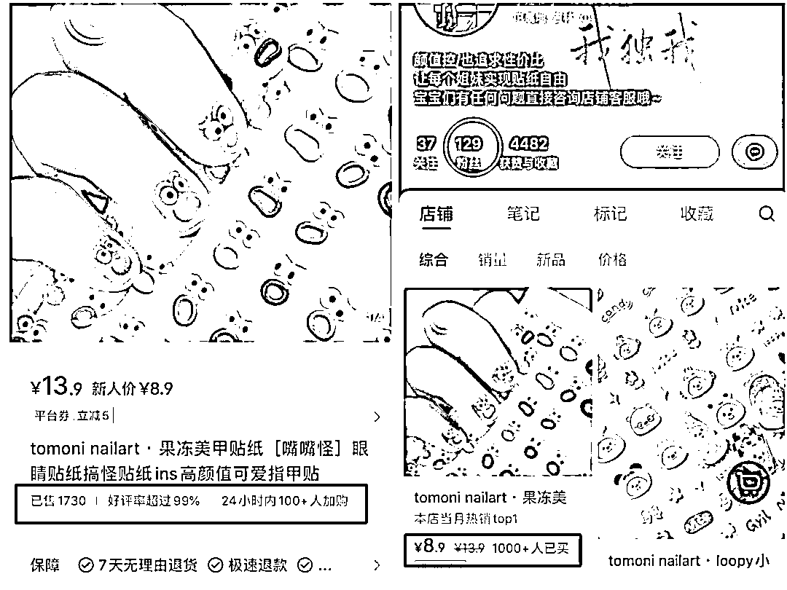
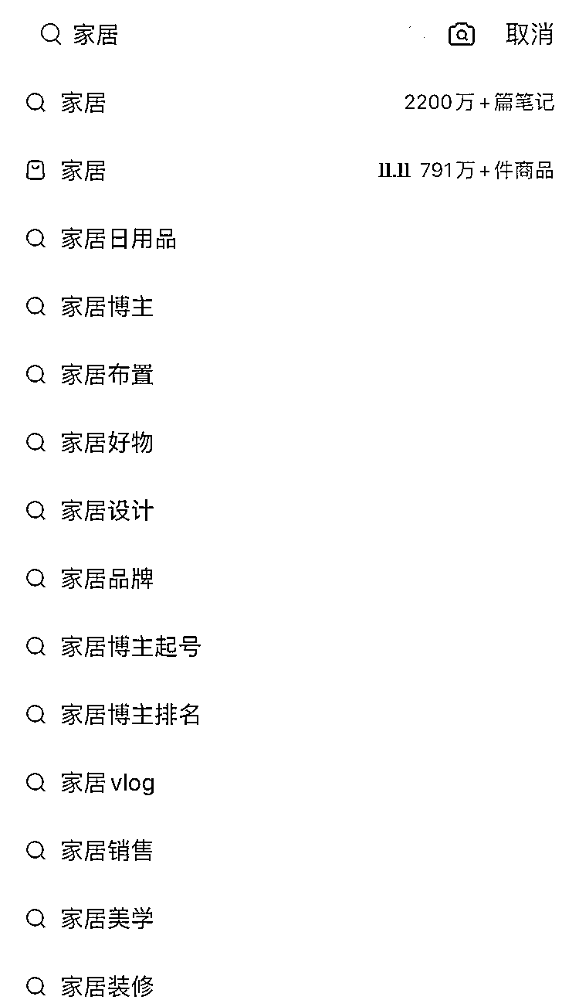
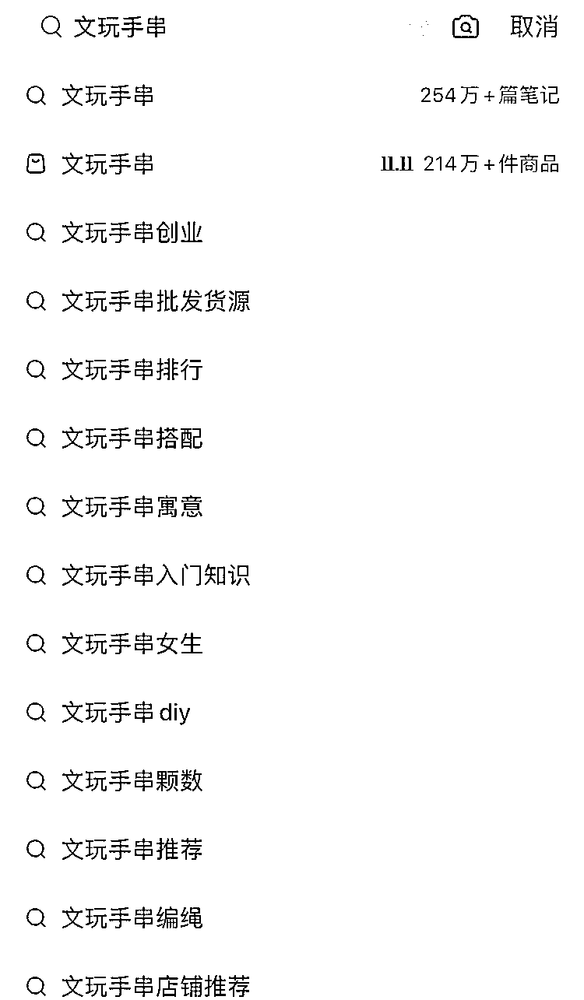
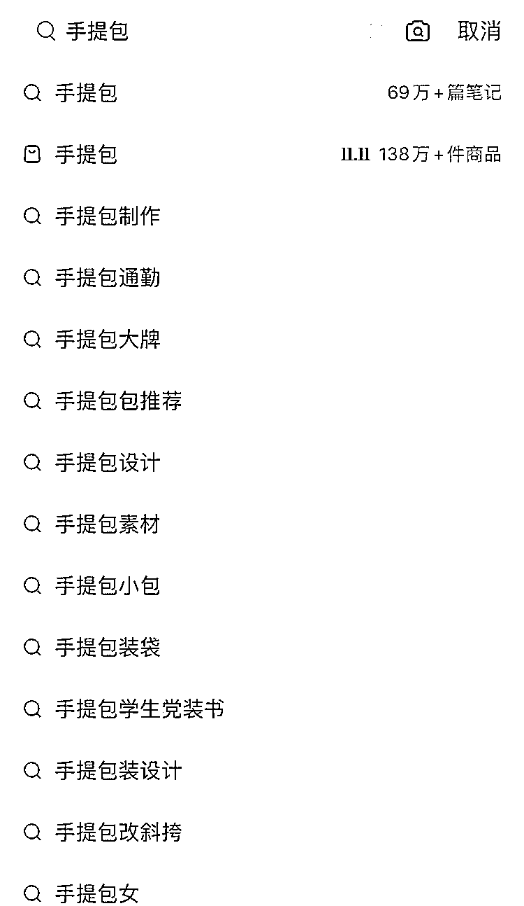
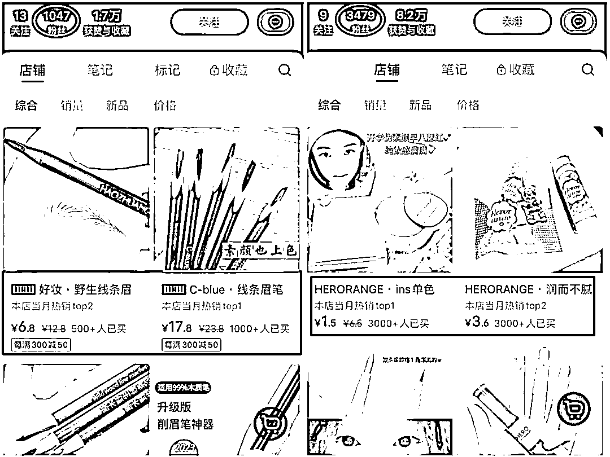
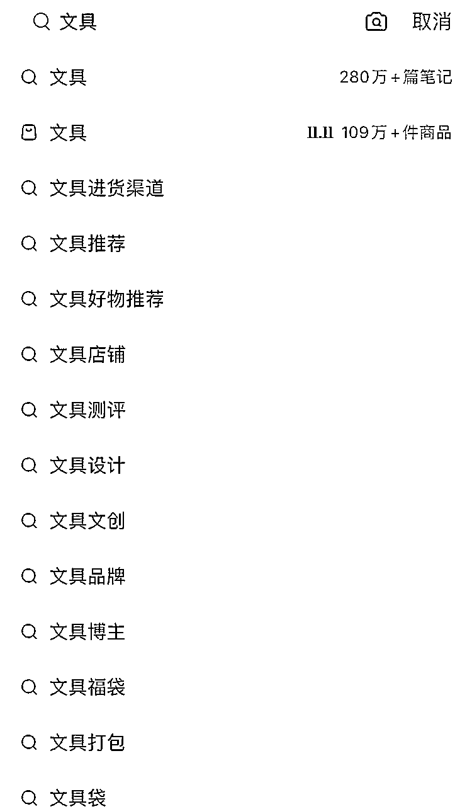
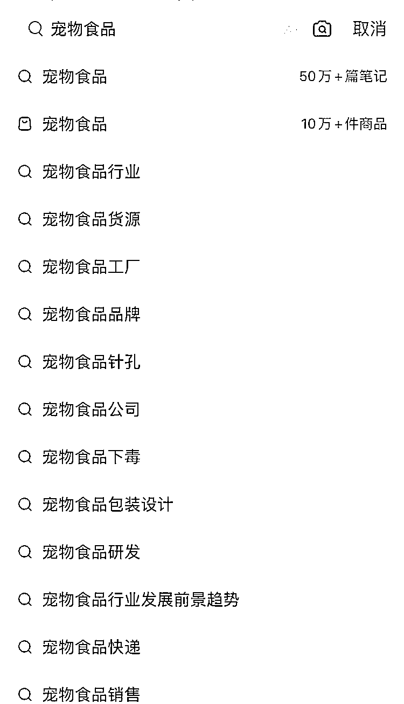
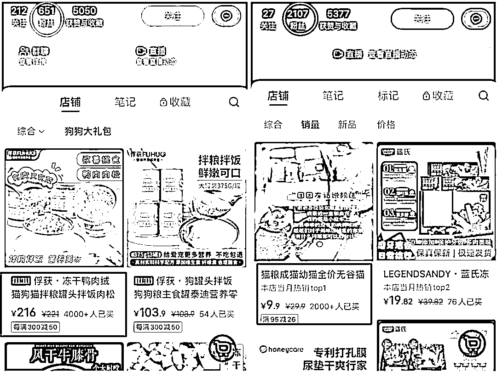

# 不会选品？推荐小红书这 6 个低粉爆品

> 原文：[`www.yuque.com/for_lazy/thfiu8/od4o7kbk4zs45xtr`](https://www.yuque.com/for_lazy/thfiu8/od4o7kbk4zs45xtr)

## (36 赞)不会选品？推荐小红书这 6 个低粉爆品

作者： Sherry💎谢无敌

日期：2023-11-17

Hi~生财的朋友们大家好~ 我是你们的老朋友-谢无敌，小红书 MCN 闪亮猫传媒创始人。

既是实体经营者也是流量赋能者。同时也是知识星球的头部小红书社群【谢无敌的红书宝】创始人。

大家最近应该都在不断地听到“小红书买手”这个词，而且平台也在大力扶持买手和商家。

买手可以说是博主的 2.0 版本，买手在小红书主要是通过开直播和商品笔记的方式来进行带货。

他们基于自身品味进行选品，然后吸引用户来买单，所以，买手更拼选品能力和审美能力。

**选品选不对，努力全白费**。不管是商家还是买手，选品都是非常重要的一个环节，选对了品，出单速度会更快。

我看到过很多这样的情况：商家认认真真做内容，但是选品选不好，店铺出不了单，换了一下品后，不仅能出单，爆单也是常有的事。

## **一、怎样找到低粉爆品**

既然选品那么重要，我们要怎样去选呢？

我们知道，普通人适合借鉴的爆款笔记并不是那些粉丝基数很大的头部博主，而是低粉爆文。

这个思路放在选品上也同样适用，我们需要找到这类低粉爆品。

一般来说，这类品并不是因为博主的粉丝基数大，所以能卖爆。低粉也能卖爆的品，说明这个品本身就自带流量，是大家都感兴趣的。

低粉爆品一般是指那些博主**粉丝数量很少**，但是**销量很好的品**。

比如，博主的粉丝数量就两三千，但是店铺里产品销量能到 1000+，

如果是高客单价的商品，销量也能达到好几百，这样的品也算是低粉爆品。

大家可以按照这个标准，去小红书搜索自己感兴趣的、行业复购率高的品类，再通过笔记数量和商品数量评估一下这个品类的竞争强度。

另外，如果是客单价弹性高的品类，大家设置货品结构也会更方便。

## **二、推荐 6 个小红书低粉爆品**

按照这个标准，我给大家推荐 6 个小红书上的低粉爆品：

### **1、家居日用品系列**

家居赛道是小红书的热门赛道，在小红书上搜索关键词家居，有 2200 万+篇笔记，商品也高达 791 万件。

从数据可以看出，平台用户对家居用品是很有需求的。

其中，**ins 风家居日用品系列**，非常受平台用户喜欢，它们不仅颜值高、价格还便宜，所以很有出爆品的潜力。

接下来，我就给大家推荐两款家居类的低粉爆品，一个是竖条纹玻璃杯，另一个是陶瓷碗。

卖这两款产品的博主粉丝数量才几百，但是月销量最少都是 1000+，甚至还有的卖出了 1 万+，足以说明这两个品非常受用户喜欢。

### **2、文玩手串和财神摆件**

近几年，禅修赛道非常火爆，与之相关的文玩手串也受到了大家的喜爱。

搜索**文玩手串**我们会发现，笔记数量和商品数量是差不多的，这也是因为，文玩手串做带货笔记非常合适。

像下面这两款也属于低粉爆品，粉丝数都是 400 多，一个卖文玩手串，一个卖**财神摆件**，但是两个品销量都达到了 3000+。

其实就是因为戳中了用户的痛点和痒点，非常值得大家学习。财神爷摆件，寓意来财，抓住了用户心理，价格合理，所以销量很好；

文玩手串，它是一个手链合集的形式，有很多种款式可供用户选择，而且还用了限量 100 单的价格优惠来进行促单。

珠宝文玩属于比较容易违规的品类，所以大家在进行笔记创作的时候需要多注意：避免使用辟邪、消灾这类封建迷信用词，不要有医疗功效方面的描述。

另外，这类品在小红书上属于特殊类目，对卖家资质要求比较高。

需要提供营业执照和珠宝鉴定证书等资质证明，通过后才能上架商品。

### **3、低客单价手提拎包**

手提包在小红书的笔记才 69 万多篇，但是商品却达到了 138 万+，所以也属于非常有潜力的品类。

而且手提包本身的实用性非常强，不管是工作党还是学生党都有需求，覆盖的年龄层很广。

手提包也有选品技巧，像毛毡包和帆布包这类**低客单价手提拎包**尤其容易卖。

这类品主打的是性价比超高：**实用、适合日常通勤、客单价低**。

这两个博主粉丝都不到 3000，但是店铺的销量却非常惊人，销量最高的品能到 1 万+！其他还有销量好几千的品。

所以，低客单价的手提包真的比较容易出爆品。

### **4、低客单价化妆品**

美妆是小红书里的大热门赛道，搜索化妆品相关的笔记有 310 万+笔记，搜索排名第一的居然是：化妆品小样进货渠道！化妆品品牌反而排在最后面。

这也说明了，现在平台上，大家对于化妆品的品牌需求没有那么强烈，反而是有低价的需求。

下面这两位博主做的就是低客单价化妆品，一位主打卖眉笔，另一位卖彩妆，粉丝数不多，但是销量都很好。

### **5、文具系列**

**文具系列**也很有爆品潜力，客单价低又是刚需，办公学习都需要用到，实用性很强。

如果能够在选品上花点心思，用户群体是非常庞大的。

下面这两位博主，店铺主要卖文具，粉丝数量也都不多，但是都出了爆品，销量 1K+起步，非常好卖。

文具类属于低客单价产品，主要是**走薄利多销**的路线。选对了品，销量上去了，利润自然不用愁。

### **6、宠物食品**

最后一个推荐**宠物食品**，宠物赛道也是近几年很火的赛道。

养宠成了很多年轻人的生活方式，所以针对宠物用品的市场前景也是非常好的，细分下来有很多赛道：宠物食品、宠物养护、宠物医疗......

接下来给大家展示的是卖宠物食品的两位博主，粉丝数量都不多，但是都出了自己的爆品。

但是，爆品之间也有一些区别：客单价高的品，销量反而是低客单价的两倍！

其实，这里体现的是一种选品思维：戳用户痛点。

低客单价的就是普通的猫粮，而高客单价就多了一些选品思考：改善挑食、有肉有菜、营养均衡.....

有挑食习惯的宠物主人看到这里，可能就会想要买回来给自家宠物吃。

所以虽然它的客单价比较高，但是销量却很可观。

从上面这些低粉爆品的例子中，我们可以总结出一些选品的规律：

1.  优先选择能戳中用户的痛点、痒点的选品；

2.  选品除了考虑实用性，有热点相关的可以追热点；

3.  低客单价的产品很适合前期没有粉丝基础的新手博主。

以上就是今天的分享，希望能对你有帮助~

也欢迎大家和我交流，微信：sherryxie668

* * *

评论区：

暂无评论

* * *