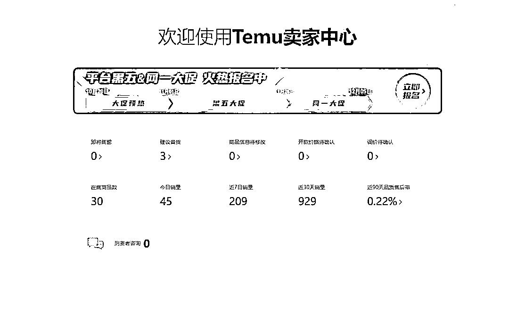

# 8 月开始到 11 月结束，聊一聊我的 TEMU 之路

> 原文：[`www.yuque.com/for_lazy/thfiu8/xa04fbl78a8a6e86`](https://www.yuque.com/for_lazy/thfiu8/xa04fbl78a8a6e86)

## (精华帖)(39 赞)8 月开始到 11 月结束，聊一聊我的 TEMU 之路

作者： 铭与华

日期：2023-11-14

8 月开始到 11 月结束，聊一聊我的 TEMU 之路

大家好，我是铭与华，10 月份刚刚加入生财。希望跟诸多大佬学习生财之书，努力破圈。
大佬们的成功分享文章已经很多了，我来聊聊我做 TEMU 的失败之路，希望给想要做 TEMU 的朋友提供些经验，避避坑。

```
  TEMU 全托管的跨境模式，大概是从去年 9 月份的适合开始的。那个时候我其实是已经知道这个事情。微信里做亚马逊大麦的朋友经常发朋友圈喊着让大家入局。那个时候真的是不以为然，脑子从来没往那上面想过。
  直到今年 4 月份，线下实体的生意因为各种原因，跟之前的合伙人分开，自己算是脱离了出来。然后就是整天在想做什么？每月的房贷，两个儿子的各种费用，真的有点压得透不过气。这段时间是非常煎熬的，每天都在自我否定，看不到希望。
 一直到 7 月，有天又看到朋友发 TEMU 的朋友圈，突然觉得是否要试试。在简单的了解了全托管的模式后，决定入局。
 TEMU 的全托管模式，国内卖家（其实应该叫供应商）只需要做好产品供应的环节，其余的完全交给 TMEU 来运营。那个时候觉得这太简单了，选好产品，定好价格供货就可以了。
```

说干就干，平台规则了解清楚后，就是选品阶段。一句话，任何的销售平台，选品是最重要的。产品会觉得你挣多少钱，走多远。
我当时报了朋友的 TEMU 训练营，大家在选品的时候，都是有一套方式的。比如根据亚马逊及其他平台各品类的 TOP 排名来筛选。有的人在 1688 上选品后，进货加价就可以供应给 TMEU，有的则是本身就是生产工厂或者大贸易商自己有库存直接上品供货。
因为我在山东威海，是渔具用品产业带，全球 80%的渔具产品来自威海。所以当别人还在选品摸索的时候，我直接就决定做渔具，遍地的工厂，拿货方便，简直太有优势了。
很惭愧，我本身不会钓鱼，也不爱好钓鱼。所以初期对渔具的学习是很头痛的，尤其是鱼竿，钓什么鱼用什么杆，每个杆的特性是什么，学习了几天后真的是云里雾里，这大概只有实践和热爱才能迅速的掌握。这个时候，我发现了，渔具品类里面还有个鱼饵。单品价格低，属于消耗品，复购率又高，体积又小（TEMU 主打轻小品），这不就是绝佳的品类么！
鱼饵比起鱼竿简单了很多，我从 1688 上选品，搜索本地的工厂，开始了每天选品，去工厂看货的阶段。
产品选好后，开始上传，包括图片整理，英文翻译等前期的工作也繁琐的很，我逼着自己每天至少上传一个品，一点一点的累计。
前半个多月的时间，大概上传了四五个品，零销量。这个时候是很熬人的。一直得不到正反馈。大概快一个月的时间，终于有个零星的几个订单。在和买手沟通后，得到的信息是做为渔具店，上 100 个品才能算及格。然后我就冲着个目标，不断的选品，上架。一直到 9 月份，我的产品上到了 30 个，每天大概 40 左右的订单量。同期跟我一起做 TEMU 的朋友已经做到每天 300+的订单，当然我们选的品类是不同的。
在这后面几个月中，TEMU 开始间隔性的对产品提出降价要求，这就意味着同类产品，有更低的供应商出现，如果不同意降价，产品将会被降低权重和流量。虽然我有工厂资源的优势，但是拿货的量对于工厂来说还是非常非常小的，拿货价格跟在 1688 上的价格就差了个运费。有的品 TMEU 要求降的价格直接低于我的成本价，这意味着我必须把这样的产品迅速的清仓处理下架。
在上架的产品里，有一款 30CM 的深海大饵莫名的爆了，TMEU 系统自动下单的数量从 20，30 一直到 60 多的备货单（单品 5 元的利润）。我热情高涨，马上从工厂下单补货，看着销量起来，信心满满。
然后，就是当头一棒，我的货第一次因为质检不合格，被退供了。
这个产品，之前是从来没有质检问题的。莫名的从 9 月份开始，质检非常严格，有一点划痕都会被仓库退回。眼看退回的产品越来越多，我及时跟工厂沟通。但该产品从价格上来讲工艺只能达到这样，在其他平台速卖通等都没有出现问题。又跟 TMEU 买手沟通，买手也表示没有任何办法，仓库质检有自己的要求。最后的结果是，这款产品从爆款到一直无货可发。眼看着越来越多的备货单却无货可发，我开始有了一点灰心。
让我彻底放弃 TEMU 事情出现了。
因为是全托管备货模式，需要备货到 TEMU 的国内仓。我清楚的记得，当时的规则是，如果上品 30 天没动销，会被当作滞销品退供。所以一开始上品备货，我都按照最小数量，订单有起色的时候才会逐步开始提升备货量。可万万没想到，其中几个品，因为前期销量很好，我提升备货量后，突然的某一天，我收到一个退供消息，是卖的很好的一个品。竟然因为滞销退供了，我立马沟通买手，给我的答复是，现在 14 天没有动销的产品就会被退供，即使前面卖的很好。真的是火大，而且后面这样退供的产品越来越多，比如每个 SKC 有不同颜色的几个 SKU，红色的卖的好，没问题，绿的卖的不好，就退供。更奇葩的是退供后库存为 0 的产品，系统又马上给我下了补货单！找到买手，买手给我的答复是：退供是仓库手动退供，备货是系统自动备货。要不要补货，自己斟酌。WTF。因为我没有国内的销售渠道，时间久了又不能退回给工厂，退供下来的产品全成了库存。这就意味着如果我上品上到 100+，退供回来的库存会很多很多。自此，我彻底对 TMEU 失去信心。

11 月，打算降价清仓，闭店。但心里其实还是不舍得，毕竟是一步步做到现在，有感情。为了减少损失，去找了一家工厂，连账号带所有库存一起转让了。工厂那边正好也想自己开拓跨境市场，尝试全托管模式。我的条件就是把库存全部收走。双方谈妥，完成交易。
至此我的 TEMU 之旅暂时告一段落了。

总结一下：个人要做 TEMU 平台的，一定要选好品！切勿铺得太大，如果自己国内有销售的渠道无妨。可以尝试增加 TEMU 的销售渠道，但是价格一定要有优势，不然后期会被卷的很厉害。因为 TEMU 是可以跟卖的，你卖的好的，别人也可以卖，别人的供货价比你低，你就失去流量。
TEMU 最适合工厂直接供应，即使有退供产品回来，也可以在其他渠道继续销售。中间贸易商除非有不可代替的品牌产品，否则最后都会卷价格。
个人卖家的红利期会越来越少。
讲到最后，我不是一个好的 TEMU 卖家，但是自己一步一步经历过，从选品，上架，到运营也算是全面了解了这个平台。肯定有做得成功的卖家对我嗤之以鼻。我只是希望从我失败的角度，也让大家了解我遇到的困难和所犯的错误。

现在来到生财，我开始全面了解更新的生财之道，做为年到 40 的“小镇青年”真的是挺难的，很多潮词我一时很难理解。真心希望在生财里面找到自己后面的路。
有句话叫：老天对每个人最大的公平就是每天都有一样的 24 小时。
为自己，为家人，努力吧。

* * *

评论区：

LongQiang : 其实我一直认为全托管模式就是一个大坑 到最后就是压价格一条路 没有任何壁垒
唯一利好的是平台
探花郎 : 加油
李天民 : 身边挺多朋友在做 TEMU 的，圈友方便点我头像链接下吗
铭与华 : 怎么说呢，目前来看还是最适合工厂直接做。
Keke : 玩不过拼多多的[呲牙]
黄大仙女🧚‍♀️ : 心累啊 刚想做
铭与华 : 选品选好了么？
黄大仙女🧚‍♀️ : 上架了一个产品 不用寄样 核价环节了，但是我觉得我填的不是那么准确链接信息，


* * *