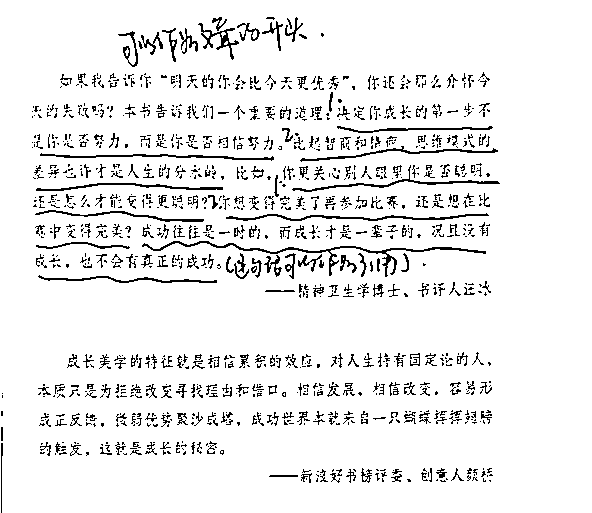
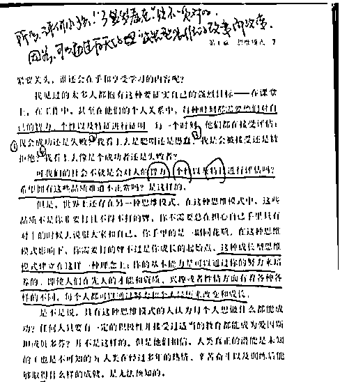
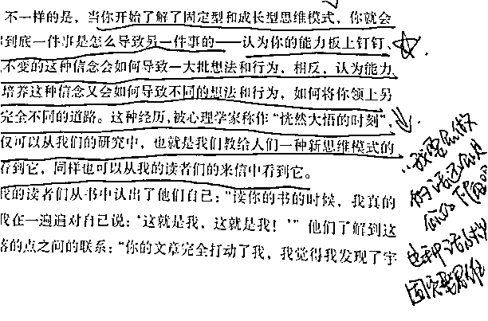
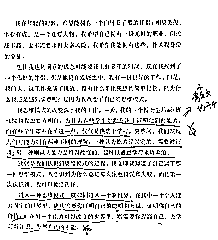
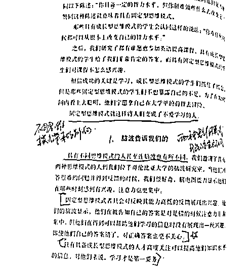

# 6 个读书笔记的方法，让你读完一本书，写出 N 篇文章

> 原文：[`www.yuque.com/for_lazy/thfiu8/uwlfuhm2ewqnnbqu`](https://www.yuque.com/for_lazy/thfiu8/uwlfuhm2ewqnnbqu)

## (31 赞)6 个读书笔记的方法，让你读完一本书，写出 N 篇文章

作者： 二丫吖

日期：2023-11-24

**1）带着写文章的目的去记笔记**

有同学跟我说：看书的时候很有感觉，觉得有很多话写，可是动笔的时候，发现，思路太多又不知道怎么下笔了。

这个情况，可以试试在读书的时候，就明确安排书中的内容，在书上直接写类似于：**这一段可以作为文章的开头、这一段可以作为结尾、这里跟上面那个点可以融合一下，作为一个点写到文章里。**

**举个例子：**

比我在读《终身成长》这本书的时候，看到这一段，我觉得可以用来做一篇文章的开头，然后这一段的最后一句话，做为金句，可以引用到文章中。于是，我就写下了“可以作为开头”、“这句话可以引用”这样的笔记。

这样写笔记有个好处，就是你要出文的时候，你翻开书，看到这个笔记，就会想着，当时为什么会觉得这一段可以作为开头。然后，很快就会进入写文章的状态中了。

### 2）带着“新媒体写作”思维去记笔记

什么是“新媒体写作”，就是你在写之前你想一下，**自己这一篇文章是用来干嘛的。**

发在头条号、百家号、在公众号用来投稿吗？那么，你需要有一个基础的领域意识，比如，你看读书的时候，就要自己思考，这个内容，能用在哪些领域。

**举个例子：**

我在看目录的时候，我就会做这样的笔记：比如下面这张图，这本书可以出育儿、职场、情感几个领域的选题。这样，在读这本书的时候，我就已经对这本书进行定位了。

假设我要投稿，当甲方需要育儿文章的时候，我就写育儿，需要职场我就写职场，需要情感，我还是可以用同一套方法论去写情感，只不过例子更换就好了。

然后这一章节写的是“是什么的部分”，这其实就是我套用了：是什么、为什么、怎么办的这个公式去看这本书，这样不仅有利于我自己快速理解，我还能读完后，立马就梳理一个写作的框架出来。

以此类推，那么这本书哪一部分是在说：为什么和怎么办的部分呢？也可以用这种笔记记录出来。这样其实也是在训练自己拆解框架的能力和逻辑思考能力。

### 3）带着场景感、故事思维去记笔记

很多学员经常会问：我找到痛点了，找到方法论了，但是我现在要怎么将痛点和方法论结合呢？我感觉我就是在书里面出不来，就是被书牵着走了，我要是就按照书上的方法论和问题来写，那不就变成抄袭了吗？

其实，这是因为你缺乏举一反三的思维，你可以在书上做类似这样的笔记。

比如，我在看到《终身成长》这本书里讲的这个：

**你的基本能力是可以通过你的努力来培养的，即使人们在先天的才能和资源、兴趣或者性情方面有着各种各样的不同，每个人都可以通过努力和个人经历来改变成长。**

于是，我自己在这一段话的基础上做了一个总结，我想到，我老家的人总是喜欢说：**小孩子是 3 岁看老，**我不知道你们有没有听过类似这样的话。但是，这个缪语，是大多数家里有孩子的、尤其是老人家的共同认知，这就是一个写作的点，用成长型思维来看，这句话是不对的，人家才 3 岁，后面怎么发展，是可以通过后天的努力而改变的，你无法通过 3 岁就看到一个小孩老了以后是怎么样的。

这样就可以通过这个《终身成长》的书来写一篇育儿领域的观点文。

再比如，我在看到“能力板上钉钉”这个关键词的时候，我就想到了一个场景，我们在工作的时候，有时候会吐槽，：**我要会做的话，我还会是你的下属吗？或者，我要是会的话，我只拿这几千块钱的工资吗？**

这就是一种场景，这样的认知就是固定型思维，认为自己不会所以工资低，所以是下属，认为领导一定会比自己强。这就是一个写作的点，可以作为一个固定型思维的反面例子来写。人的能力是会成长的，你不会做，你想到的应该是，**我要怎么做，才能改变自己暂时不会的这个问题，因为人的能力是会变的，人是会成长的，需要具备成长型思维，才能改变这种抱怨。**

### 4）用书中的总结做笔记，拓展一个故事

《终身成长》这本书最后我的开头选用了这一段，这一段相当于是这本书的开始，也是非常重要的一个节点，因为书上写了：“我的思维模式的改变源于我的工作”，接着作者总结，是什么问题，产生了什么结果，所以，我们在看书和写文的时候，你要注意，这样的写法就是：总分总的写法。

作者直接把结论抛出来：两种思维模式的不同理解，那么你就要去理解，到底这是个啥思维模式，这个时候你就要回忆自己，对照自己是什么思维模式，然后关联到你身边的例子，是什么思维模式。

于是，我就根据这一页的结论，通过我自己的消化理解，结合我的工作，我写了这样一个开头：

### 5）借用书中观点，要学会翻译，将你翻译后的语句当成重要笔记

我们在看书的时候，书上如果有详实的方法论，这对我们来说是好事，你要想着是不是可以用在自己文章的“怎么办”的部分，但是你又不能一个个字的抄，那样你的文章就缺乏灵魂。这时候，咱们需要“巧用翻译，举一反三”。

比如这一页，原文是：脑波告诉我们

那么我就在旁边做了笔记，这一段是在说不通思维模式所带来的影响是什么，区别在哪里，然后将这“脑波告诉我们”，翻译成：两种思维模式的脑波显示不同，这样一来，**我就可以将这个点作为我文章的小标题了，**而我文章内容只要写清楚，**脑波是怎么显示的，有啥不同就可以了。**

翻译后的效果：

### 6）如何替换书中的例子，为你文章所用

比如书上用的例子是《太空英雄》飞行员的例子，看到这里我立马就想到了咱们自己国家的关于机长的电影《中国机长》，于是我在旁边写下了，四川 4U8633 的航班刘机长就是一个成长型思维的人。如果需要进一步扩展，出来一篇文章，结构可以完全模仿者一页的结构。

例子替换成刘机长，还可以顺带截机长刘机长的采访图，如果不了解的，也可以去搜关于刘机长的采访，这样就进一步为你的写作添加了素材。

你写这本书的书评时，可以翻出中国机长的例子写，万一什么时候，哪家航空公司又因为类似的事情上了热搜，你就可以用这个方法论，来写热搜的深度文了。

我的读书笔记没有高大上的命名，但是却是亲测好用的，是符合咱们现在的需求：**高效阅读快速出文，用这样记笔记的方式，不需要读完一整本书，你就可以列一个框架出来一篇文章。**

我经常是看书看到一半，然后有思路了，就先写一篇文章，然后写完文章后，再接着看这本书，我之前看《创始人》这本书也是用这样记笔记的方式读完的，整本书我一共写了 5 篇文章。

**总结下来，读书最重要的是思考，笔记是你思考的体现。**

你得带着目的去读，你是用来写文章的，那你就要带着，你是什么领域的，这本书有没有合适你的选题，这个点能否拓展到你的领域里去，如果能的话，通过举一反三你想到了什么？把你的想法记录下来，当你的笔记足够形成一个框架了，那就立马出文。

* * *

评论区：

一个无聊且无趣的人 : 二 Y 老师你那篇小助理那篇删了吗？
二丫吖 : 没有呀，在这里哇～

还被亦仁加精了[呲牙][`t.zsxq.com/1423uocNI`](https://t.zsxq.com/1423uocNI)
一个无聊且无趣的人 : 嘻嘻，找到了二丫老师。电脑找有点乱，手机一下子找到了！好好学习学习[偷笑]
๑仿 : 记笔记是边看边记，还是

* * *