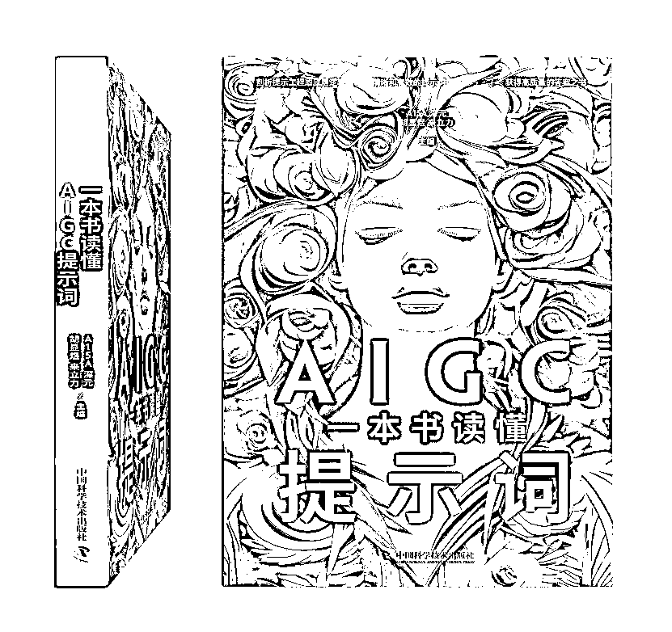
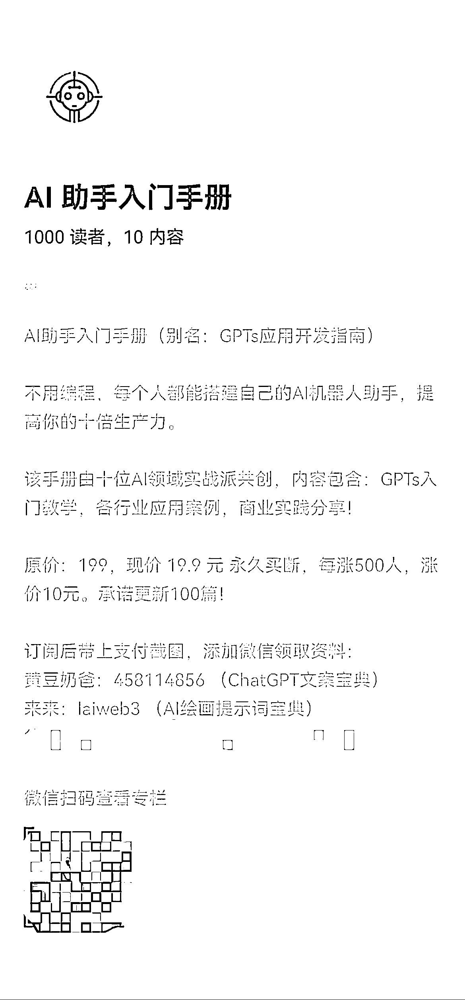
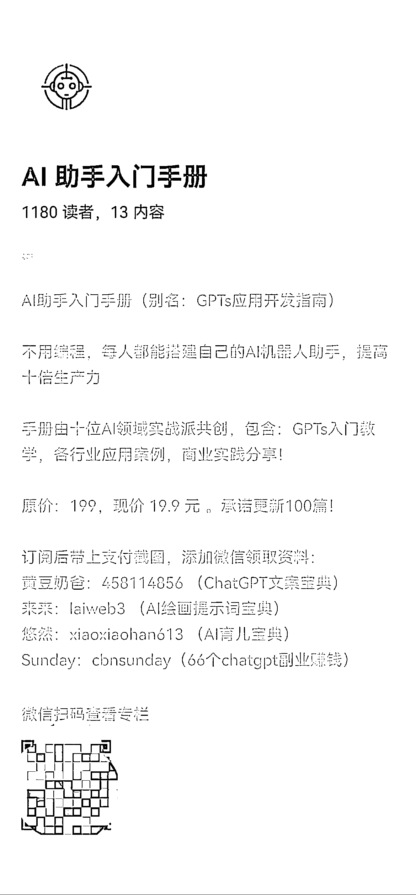

# 3 天卖出 1000+单小报童，全盘拆解我们如何做到？

> 原文：[`www.yuque.com/for_lazy/thfiu8/ccez9myow0nywnym`](https://www.yuque.com/for_lazy/thfiu8/ccez9myow0nywnym)

## (36 赞)3 天卖出 1000+单小报童，全盘拆解我们如何做到？

作者： 来来

日期：2023-11-20

大家好！我是来来，20 年设计经验，10 年老师经验，生财有术 AI 绘画航海教练，破局俱乐部 AI 绘画航海教练，玩赚新媒 AI 绘画训练营教练，AI 探索家成员，AI 绘画图书作者，长江商学院特邀讲师，阿里巴巴集团银牌淘拍档。

**本月底上市的 AI 绘画（独立撰写 8 万字 400 页）和 AI 提示词（和其他作者合作撰写）的图书封面，欢迎大家选购。**

今天给大家分享我和合伙人@黄豆奶爸 如何在 3 天内完成从 0 到 1000+单小报童专栏订阅，而且探索出一条合伙人共创产品、裂变流量、可复制可操作的合作样本。

黄豆奶爸介绍：前大厂大数据经理，辞职后全职奶爸，19 年躬身入局自媒体，小红书英语启蒙博主，3 个月 5 W 粉， 23 年入局人工智能创业，开发《ChatGPT 大师班》，三节课，圈外同学签约讲师，在线学员 5000+

1.  感谢 @芷蓝 和@梁靠谱 给了我们方向和指导帮我们宣传，通过他们的冷启动，撬动了更大的流量。

2.  感谢合伙人 @黄豆奶爸，一起互补协作，共创出这份小报童，从 0 到 1 完成 3 天 1000 销量。

3.  感谢 @生财小苗哥 和 @大西 CC，我们之前从 0 到 1 制作引流小报童的过程中，共创了很多好的想法和建议，给了我们制作《AI 助手入门手册》小报童很多灵感和启发。

4.  所以我们觉得要把我们制作《AI 助手入门手册》小报童的过程全盘拆解，也希望能给其他需要发售小报童的小伙伴一点帮助。

# 销量展示

11 月 15 号 13 点上线**（截止 0 点销量 244 人，7 篇内容）**

11 月 16 号**（截止 0 点销量 724 人，9 篇内容）**

11 月 17 号**（截止 0 点销量 1049 人，10 篇内容）**

11 月 18 号**（截止 0 点销量 1180 人，13 篇内容）**

详见飞书链接：

[`duuxkmjwsy.feishu.cn/wiki/EWh2wZuFzi3nnekwXUSc22ZOnQe`](https://duuxkmjwsy.feishu.cn/wiki/EWh2wZuFzi3nnekwXUSc22ZOnQe)

* * *

评论区：

新新新 : 小报童是什么？[撇嘴][撇嘴]
观者 : 小童报怎么订阅？
Horace : 小报童是一个「付费专栏服务」，嵌入在微信体系内。创作者无需设置复杂的社群运营规则，只需要设置好订阅价格和专栏主题，然后专注于内容创作和推广即可。
微信订阅即可
Horace : 可以参考一下[`xiaobot.net/p/yibentong?refer=138af198-02d2-4133-9028-3079addf5fdd`](https://xiaobot.net/p/yibentong?refer=138af198-02d2-4133-9028-3079addf5fdd)
来来 : 小报童没有单独的 APP，核心在于流量获取+内容创作，相对是一个轻量级的知识付费长篇，后端交付可以是微信群作为交流群，小报童仅提供内容查阅。
勿拧巴 : 你好，想知道这个如何引流？
雨落秋山 : 在小报童里搜了一下帖子中的名字，没搜到啊

* * *