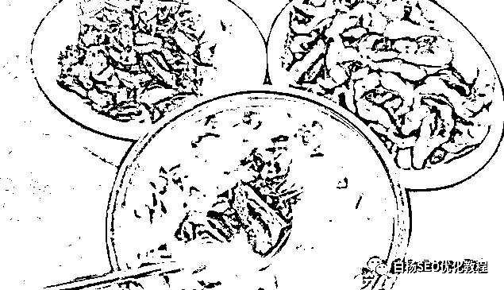
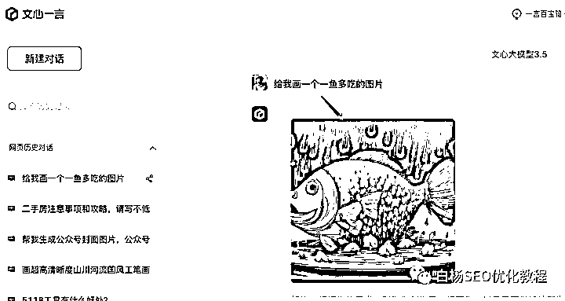

# 内容产生流量，流量带来利润，如何让内容价值最大化？

> 原文：[`www.yuque.com/for_lazy/thfiu8/bdo887rl7cn0yp3y`](https://www.yuque.com/for_lazy/thfiu8/bdo887rl7cn0yp3y)

## (20 赞)内容产生流量，流量带来利润，如何让内容价值最大化？

作者： 白杨 SEO

日期：2023-11-21

大家好，我是白杨 SEO，

在分享这个主题之前，先简单说说**内容、流量、利润**三者之间的关系。

流量可以带来利润，这句话大家都认可。只要有流量了，不管你是赚广告费，赚平台流量分成，还是带货卖货都可以。

内容产生流量，有些朋友可能还不清楚，这是今天白杨 SEO 要重点说的。如果你之前看过那篇《[白杨 SEO：如何制作网站或自媒体文章内容获取流量？批量方式](http://mp.weixin.qq.com/s?__biz=MzU2NTQzMzA4Nw==&mid=2247493242&idx=1&sn=448c9a02f063e7ef64d1679bdc1035aa&chksm=fcb961eacbcee8fccb1274f2c20da39d266547387dc75278d89e57b5dfc58a40d51728bb18b0&scene=21#wechat_redirect)》，可能会理解一些。

内容产生流量，流量带来利润，所以做好内容间接就能赚钱，没错吧？那么这里就有三个问题：内容指什么？内容为什么会产生流量？怎么生产内容？

**一、内容指什么？**

我们这里的内容，主要是指互联网（包含移动互联网）上的内容。内容有哪些形式呢？具体有文字、图片、图文、音频、视频、直播。

上面这六大形式之间它们其实是可以互相转换的。再白话一点就是，你写的一篇文章，可以变成图片形式，可以转成音频、视频。当然如果你直播讲的一个内容，可以剪辑成视频，也可以转成音频、图文、图片等内容。

**其实本质，它们就只是一个内容**。但因为形式有多种，所以一下子就变成了多种内容了。

比如大家知道每年年底搞年终总结各互联网大咖，就是用这种方式生成文章、PPT、音频、视频等内容进行全网营销。既然搞营销大佬都会用这个方式，我们做 SEO 流量出身的人，这种“一鱼多吃”让内容价值最大化的方法为什么不用呢？

**二、内容为什么会产生流量？**

内容为什么会产生流量？如果你生产出了一个内容，束之高阁当然产生不了流量！但如果你让内容流动起来，他就可以产生流量，因为各个不同平台都有用户需求。

白杨 SEO 入行 SEO 这行学习老师之一的国平老师曾说过“让内容在渠道中间流动”就是这个意思。这些流动的内容之所以会产生流量，是因为推广者在各个平台去发布，这样当有用户需要搜索时，就给你产生流量了。

拿文字为主的来说，早期社区、论坛、博客、个人网站都是主要文字为主。

图片平台呢，以前有个花瓣网，现在一些漫画平台也算哈。

图文呢，不管是百家号、搜狐号、知乎、公众号、头条号都是这个为主。

音频平台最出名的是喜马拉雅，还有什么荔枝 FM，现在还流行什么小宇宙等等。对了，罗胖的得到也算。

视频平台，长视频有爱优腾，中视频有 AB 站，短视频是最火，除了专门的抖音、快手以外，像什么微信视频号、微博视频号、几乎主流的平台，哪怕电商平台如拼多多、美团等都有短视频这一栏了。

白杨 SEO 这里再补充说下，因为很多人对流量并不是很理解。你可以看《[白杨 SEO：谈谈我理解的流量](http://mp.weixin.qq.com/s?__biz=MzU2NTQzMzA4Nw==&mid=2247485553&idx=1&sn=52e20c34a8f22db8ca327a5d4ea7fd09&chksm=fcba8fe1cbcd06f76f586834dfb7b06fc9028505d2106f8494d0789bd43cf06eae52135b0829&scene=21#wechat_redirect)》这篇，流量分为推荐流量和搜索流量等各种。你的内容到底是需要推荐流量还是关键词搜索流量，看你选择。前者流量大，但并不那么精准；后者流量小，但精准，易转化。

如果你要做关键词精准搜索流量，那么你就需要懂 SEO，需要懂关键词挖掘、分析、布局等，需要懂上面那些平台的搜索规则。你可以自学，搜白杨 SEO 之前写过的相关文章，你也可以考虑白杨 SEO 训练营课，这样可能会更系统，更快。

**三、怎么生产内容？**

上面我们说了内容有哪些形式及内容为什么会产生流量，那么，你肯定想问，内容怎么生产？

关于怎么生产内容，白杨 SEO 这里有两种方式，分别来说一下。

**第一种：自己原创或找人合作**

比如白杨 SEO 公众号写了近 500 篇原创，数百万字了，都是我自己实战经验写的。如果你自己在所在的行业有实战经验，你可以自己写。

如果你没有，或者不那么擅长写，你不擅长写可以用讯飞等工具语音转文字。你没有那么有经验，可以邀请你们行业大牛或者专家访谈，然后跟他说内容合作授权，你是不是就有内容了？

**第二种：借助各类 AI 生成工具**

自从国外 ChatGPT 横空出世，AI 创作生成内容就已经慢慢成为趋势了。谁先学会了用 AI 类生成工具，谁的工作效率，推广营销效率就会上一个台阶。

不管你是用它来给你写标题，还是写文章，还是生产图片，都可以，现在 AI 工具真的是太厉害了。当然，这里还有个重点，那就是你会用 AI 工具的提示关键词，以及你能懂得 AI 工具生成的内容是不是乱说的，而且你还要做一些修改。

你可能会说，白杨 SEO，我用不了 ChatGPT 啊，我没有账号，也没有魔术上网方法。其实，你可以用国内 ChatGPT 平替 AI 工具啊，比如百度出的文心一言，比如讯飞星火等等。

以上，希望会给你有一些帮助或启发，欢迎留言说说你的看法。

**相关推荐：**

[白杨 SEO：谈谈我理解的营销](http://mp.weixin.qq.com/s?__biz=MzU2NTQzMzA4Nw==&mid=2247489302&idx=1&sn=205577c3521391b11e8c79ecec68a71f&chksm=fcba9086cbcd199030729ddee558d480b7f77b2028398a40a299dd61f3b640b463a6112ec93d&scene=21#wechat_redirect)

[白杨 SEO：揭秘各平台搜索关键词排名靠前的因素，数据与内容谁更重要？](http://mp.weixin.qq.com/s?__biz=MzU2NTQzMzA4Nw==&mid=2247493171&idx=1&sn=549673a645c09e83deff113eb1657b15&chksm=fcb961a3cbcee8b5b8d3af53f389e2295e60f122a3d91b3fe6df67335cebfa915cb6e6b64f99&scene=21#wechat_redirect)

[白杨 SEO：关键词布局，具体该怎么做？【干货】](http://mp.weixin.qq.com/s?__biz=MzU2NTQzMzA4Nw==&mid=2247498729&idx=1&sn=b4aec1a7e4442cb9ba566aea9147a66a&chksm=fcb97c79cbcef56fe14bf2a85d30f66f09fe9e46ba4e9c8d09a99c56cfec197eaeb681e79abb&scene=21#wechat_redirect)

**作者简介：**

白杨 SEO，专注 SEO 十年，全网 SEO 流量实战派，对互联网精准流量有深入研究。

* * *

评论区：

chris : 优秀
白杨 SEO : [咖啡][咖啡]

* * *