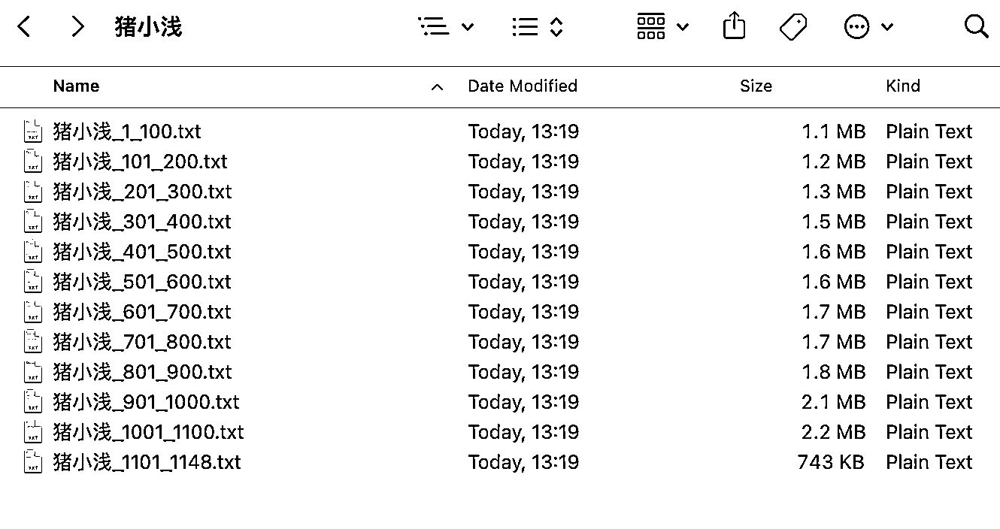
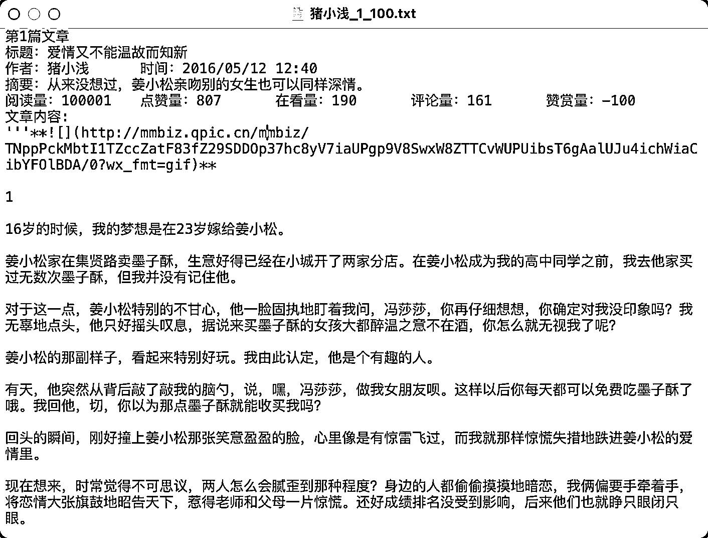
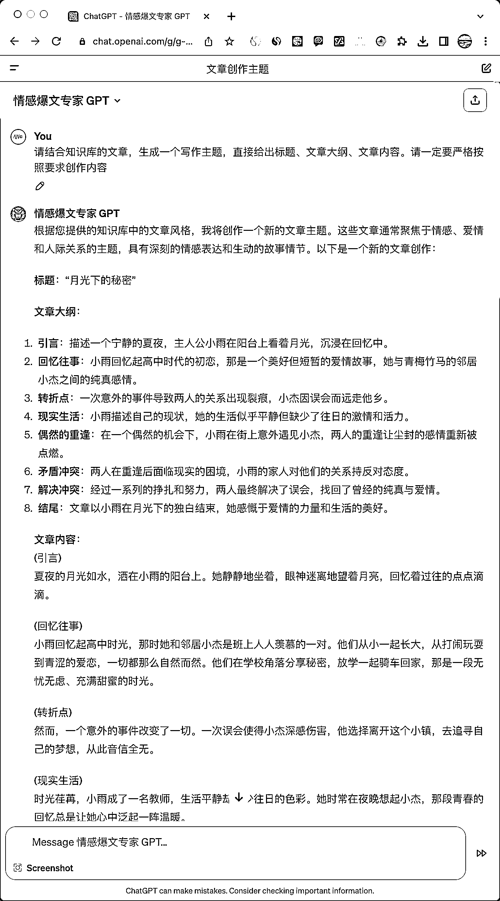

# 公众号爆文写作场景下如何使用 GPTs ？

> 原文：[`www.yuque.com/for_lazy/thfiu8/iy6xf7qdkw41ra1a`](https://www.yuque.com/for_lazy/thfiu8/iy6xf7qdkw41ra1a)

## (74 赞)公众号爆文写作场景下如何使用 GPTs ？

作者： Dai

日期：2023-11-27

GPTs 似乎就是为文本数据分析、挖掘量身定制的，用来做公众号爆文写作，效果、效率都要远胜 GPT4 微调。我简单拆解下流程，有兴趣的圈友可以大胆去实践。欢迎有经验的圈友在评论区多多指教、分享经验

什么是 GPTs ？

用户可以通过 GPTs 创建一个定制版的 ChatGPT，怎么理解这个定制呢？

1.  可以上传自己数据，形成知识库

2.  通过文字描述约束 ChatGPT 的角色、制定回答的格式等等

3.  接入第三方指令和其他平台产生互动

这些定制的动作是一次性的，以后每次使用 GPTs 都会结合 ChatGPT4 和用户的定制来回答问题，你可以随时修改这些定制项目，比如扩充知识库

公众号爆文写作场景下如何使用 GPTs ？

抛砖引玉，我简单说说

1.  找到对标公众号，将它的全部或者部分高阅读量文章导出，包含标题、摘要、发时间、作者、各种阅读数据、文章内容。具体格式可以参考图 1、图 2

2.  创建一个 GPTs，在指令中描述描述任务要求。这里没有标准答案，多参考其他 GPTs 的指令、自己多尝试不同指令，就会慢慢找到最优解。差不多就是图 3 的样子

3.  和这个 GPTs 对话，无需微调，直接要求结合知识库，给出文章主题、标题、大纲和具体内容。你甚至可以要求给出几张插图，文章素材都不用自己找，见图 3、图 4、图 5

GPTs 结合了高质量的知识库，垂直领域，效果肯定优于 ChatGPT4 直接写。由于没有大量的调教动作，打开 GPTs 直接写，效率也高于 ChatGPT4。

最终的效果还是要看流量和流量主收益，期待你的好消息

导出对标公众号历史文章，如果你还没有自己的方案，可以去淘宝找，也可以百度搜索 wcplusPro，免费导出 1～2 个公众号的全部历史文章，见图 6

* * *

评论区：

52 赫兹 : 有启发，感谢感谢
小马哥 xy50 : 呆叔[强]
赵卿久 : 很有启发
希声 : 有启发！
走天涯 : 很有启发

* * *