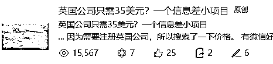
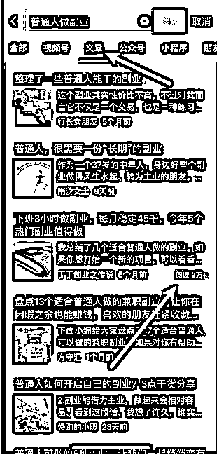
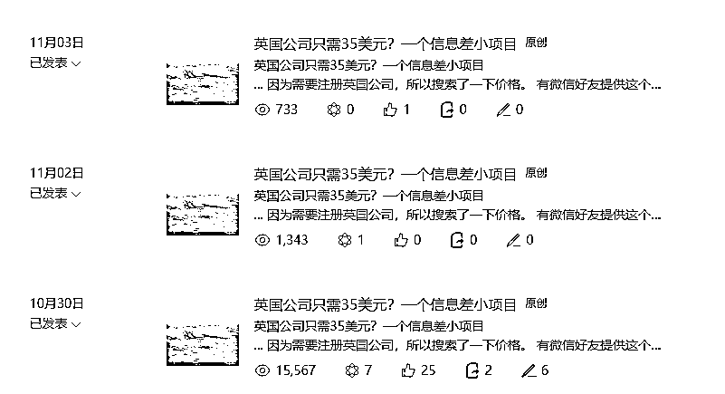

# 公众号想要 10 万+？试试这几招！

> 原文：[`www.yuque.com/for_lazy/thfiu8/cd4l49gd15btppmy`](https://www.yuque.com/for_lazy/thfiu8/cd4l49gd15btppmy)

## (32 赞)公众号想要 10 万+？试试这几招！

作者： 希声

日期：2023-11-27

最近一个月左右，我的两个公众号涨粉明显。

看下数据之后发现有许多文章的浏览量都非常高，比如下面这三篇文章：

这是截止今日的这三篇文章的数据：

而这些文章的显著特点便是流量几乎全部来自于推荐流量。

虽然我暂时还没有写出过 10w+的文章，但我还是总结了几点提高文章阅读量的技巧：

1.标题非常重要。

既然流量的绝大部分来源于推荐流量，那么就说明有大量陌生人看了文章，而对于陌生人来说，看不看一篇文章最重要的点是什么？标题和封面图。

而标题比封面图更重要，因为文章封面图在有些展示位置是不显示的。

标题非常重要原理是：如果标题都无法吸引到人，那么人就不会点击进去，那么其他一切都是空谈了。

这就像做电商，点击率是一切的起点，没有点击率，那么转化率、复购率等数据都失去了意义。

2.起好一个标题最简单的方式就是模仿。

比如我常用的一个方法是，当我确定好主题之后，我会用这个主题在微信的搜一搜的“文章”选项里面检索，特别关注右下角有 10+，2w+等符号标识的文章，那么他们的标题就可以拿来参考。

不过有一点要注意，有些大号本身粉丝就很多，那么随便写都能 10w+，这种要记得排除。

3.标题要通俗易懂，不要故作高深。

尽量不要用拗口的名词，要让任何普通非专业的人都能通过文章一眼看懂文章内容。

4.可以多谈和钱和爱有关的事情。

普通人最关心的两点大概就是：金钱和感情。

所以和这两点挂钩的内容，流量一般都不会太差。

4.选题/内容可以蹭热点。

当你不知道写什么的时候，蹭热点是最合适的方法。

比如我下面这篇文章：

这篇文章是因为当时看到了“许家印被捕”的新闻，然后我想到的一个主题。

5.文章重复发有奇效。

比如这篇文章：

我重复发了三次，第一次一万多阅读，第二次依然有一千多的阅读。

而且并不是说第一次发流量一定是最高的，后面就会更差。

我也有一些文章是第一次发没啥流量，第二次发就爆了。

6.重复发的时候最好改下标题。

要想重复发却有更高的流量？秘籍就在于要改标题。

所以切忌一字不改地直接重复发。

7.总结：做公众号和做抖音短视频越来越像了。

比如：要前三秒抓住用户，内容不要太长，选题要有趣吸引用户……这些点都非常相似。核心就在于公众号的流量逻辑也开始转换为推荐流量的算法机制了，那么在这种机制下面，只有抓住用户的注意力，让用户看得爽了，看完想互动了，那么你的流量才会被不停地推送到下一个越来越大的流量池里面。

**如果分享对你有帮助希望点个赞哦~**

**————————**

**我在生财的其他文章链接：**

[跨境创业？新手下场前必看的赚钱指南！](https://articles.zsxq.com/id_n97vrpiahx5w.html)

[保姆级教程！注册 Midjourney 并开通付费订阅功能](https://articles.zsxq.com/id_gnm2x96buu9t.html)

[跨境电商的 ChatGPT 应用指南全集 v3.0](https://articles.zsxq.com/id_eh50cr4chn8a.html)

[1 天内如何启动电商/外贸/跨境网站？ChatGPT 来助力！](https://articles.zsxq.com/id_1azlnfovac6q.html)

[一个工具管理上百个社媒账号？指纹浏览器使用全攻略！](https://articles.zsxq.com/id_u2ub0iv60p1g.html)

[白嫖！3000 元的谷歌广告优惠你要吗？](https://articles.zsxq.com/id_sa1bz4dckqeq.html)

[Etsy 注册最新最全指南！一文回答如何注册、需要哪些材料、如何避免封店、如何申诉](https://articles.zsxq.com/id_590wii7jr4iu.html)

[批量做小红书图片/视频的方法-canva 批量创建](https://articles.zsxq.com/id_pnpv1g2m5fi6.html)

[一个 ChatGPT 高效使用技巧—编辑原有内容](https://articles.zsxq.com/id_5twbrd3idlbw.html)

[效率飙升！跨境电商领域的 ChatGPT 应用指南 v1.0](https://articles.zsxq.com/id_7wu5dtpkh4m4.html)

[《段永平投资问答录-商业逻辑篇》精华金句摘录](https://articles.zsxq.com/id_xrltpwocer4p.html)

[《段永平投资问答录-投资逻辑篇》精华金句摘录](https://articles.zsxq.com/id_2k5d3mdace44.html)

[《穷查理宝典》精华金句摘录](https://articles.zsxq.com/id_er7b3dm8lx7w.html)

[《零编程知识怎么在 AI 帮助做一个贪吃蛇的游戏》](https://articles.zsxq.com/id_nqxxc79whz1t.html)

[快速获取谷歌 SEO 流量的一个策略](https://articles.zsxq.com/id_txli3kufpvig.html)

[ChatGPT 4.0 新功能，让你的数据和设计工作事半功倍！](https://articles.zsxq.com/id_it0blu6we0p4.html)

[打造转化率页面的 13 个技巧大公开](https://articles.zsxq.com/id_ohdbfoxwndkx.html)

[什么是跨境电商独立站？有哪些运营模式？](https://articles.zsxq.com/id_3lz2mf370csx.html)

* * *

评论区：

菜菜 : 只改标题不改内容吗？
希声 : 一般不改，有的时候我会修改几个字。但多数情况是只改标题

* * *