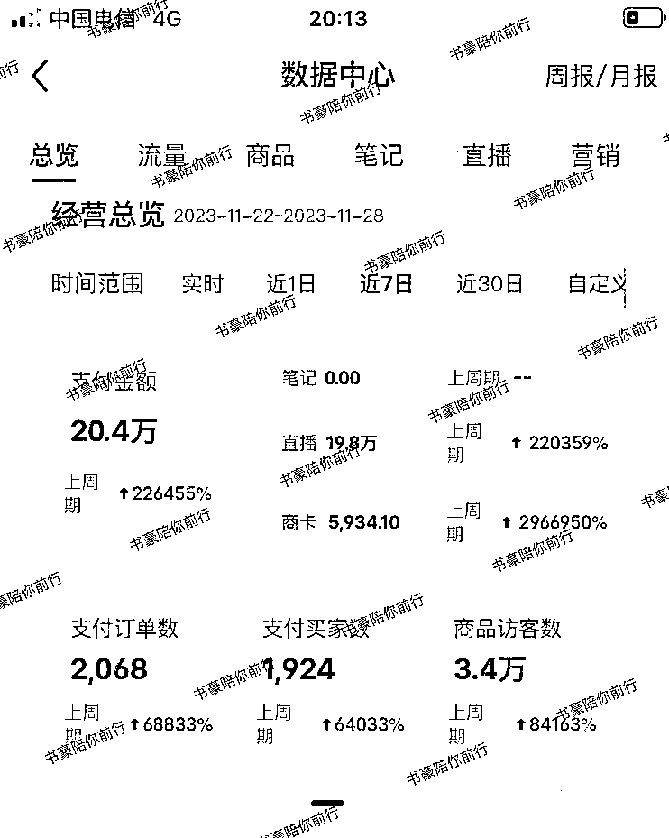

# 7 天 25W+营业额！小红书无人直播实操玩法分享

> 原文：[`www.yuque.com/for_lazy/thfiu8/cgff1vkmczs4fl09`](https://www.yuque.com/for_lazy/thfiu8/cgff1vkmczs4fl09)

## (144 赞)7 天 25W+营业额！小红书无人直播实操玩法分享

作者： 书豪

日期：2023-12-01

分享一个小红书闷声发财的路子，成本不高，可以赚波快钱。

虽说最近小红书流量越来越难拿，混剪违规、实拍不起量。但是无人直播这块流量真的起飞，我们拿了 10 个号来跑，活着 4 个号，爆了 2 个品。

7 天下来，GMV 累计 25 万+。

玩法也很简单，就是从抖音录直播间素材，通过 OBS 搬到小红书直播。懂行的圈友看到这里就可以开始跑了。

这是真风口，但也只能赚短期快钱。做小红书无人直播，本质是在切平台野蛮生长这段时间的量，拼的是概率。

接下来我会讲讲这段时间，做小红书无人直播的实操经验，重点是踩的那些坑，送给路过的有缘圈友。

**大致内容如下：**

**一、小红书无人直播赛道选品**

**二、录制抖音直播视频**

**三、测品方法**

**四、注意事项**

**五、小红书无人直播赛道踩坑点**

# **前言**

大家好，我是在杭州的龙珠圈友书豪，连续四年年入百万，目标 30 岁之前搞定 1000 万！

有幸在小红书店铺航海担任教练，本周很荣幸，拿到了亦仁哥的微天使投资 1 万元！

生财圈友中做过小红书店铺项目的圈友，毛估估有几千名圈友，最近全部都遇见笔记流量混剪容易违规，实拍笔记流量起不来的问题！

最近有个趋势，小红书无人直播的流量在悄悄起飞。要不要搞搞无人直播，各位圈友自行判断，本人想法存在主观局限性，欢迎探讨。

同时，小红书无人直播玩法，也没有可持续性，赚的钱属于短期的快钱。看重项目半年周期到一两年可持续性盈利周期的圈友放弃即可。

**最近一周，我们拿了 10 个号来跑小红书无人直播，10 个号，死了 6 个号，还活着 4 个号。**

**其中有两个号拿到了结果，累计 25 万 GMV ，所谓一将功成万骨枯，想撸小红书的直播流量，用无人直播这个方式，优势是没有高昂的直播间搭建成本，弊端是容易死号。**

**核心的玩法就是一句话：录制抖音的直播间素材通过 OBS 搬到小红书直播。**

快速起号的方法也就是一句话：小红书截留选品，抖音以图搜直播间录制直播素材。

对于老手而言，上面两句话，足够了，眼光敏锐的人，看完可以下场实操了。

对于新手而言，从实操层面展开讲就四步：

1.  第一：选品

2.  第二：录制抖音直播视频

3.  第三：测品

4.  第四：注意事项

# 一、小红书无人直播赛道**选品**

**（1）第一种是赚小钱的方式**

小红书无人直播最重要的选品方式是通过小红书站内选品，用刚注册的小红书去刷直播间，找一些场观在 3000 以上的，销量还不错的直播间。

注意避坑点，切记需要再看一下直播场次和笔记发布情况，最好的是直播场次低，笔记没有发过或者笔记数量少没有爆过量的。

简单一句话就是寻找纯靠直播起量的小红书对标直播间。

**精简三个字，就是：跟爆款**

**精简两个字，就是：截流**

找十几个这样的对标账号关注起来，然后就是去测就可以了。

**（2）第二种是赚大钱的方式**

第二种选品方式就是通过第三方软件去选，灰豚、考古加、蝉妈妈等，人群选择在 24-30 岁之间的，看近 7 天或者近 30 天的数据。

# 二、录制抖音直播视频

**操作方法**

**第一步：录制视频**

先在抖音里找对标产品的直播间，用江湖这个软件进行录制，录制时长最好在 2 个小时以上。

如何在抖音上找到对标直播间素材呢？其实很简单，打开小红书对标直播商品，截图，通过抖音以图搜直播的方式。

**第二步：处理视频**

把录制的素材放到剪映里识别一下字幕，然后检查一下是否有“抖音”，“天猫”，”小黄车“之类的语音或者画面，有的话直接删掉就可以。

**第三步：OBS 设置**

把素材添加到 OBS 中，然后在设置中调一下视频的分辨率”1080*1920“，音频设置成”监听并输出“，素材一定要设置成”循环播放“，最后把虚拟摄像头打开。

**第四步：小红书直播助手设置**

点击摄像头，选择 OBS 虚拟摄像头，找到 1080*1920 分辨率，如果找不到刷新一下就可以了。

然后点击开播就可以，直播封面也很重要，一个点击率高的封面，也可以给直播间带来很多流量，另外就是标题，模仿爆款笔记的标题就可以。

# 三、测品方法

小红书无人直播测品需要至少三场直播，每次直播至少 5 个小时以上，单直播素材循环两三次，一直到出单为止。

三场直播分别使用不同的直播间，或同一个直播间不同直播场次的最新的直播素材。

爆单起量后，可以拉到单次直播 10～18 个小时，把量吃掉。

直播封面点击率往 4% 冲，人均观看时长往 30 秒冲。

起量的直播间，评论区需要做互动跟进直播间，以拉高转化。

单场支付金额突破 2 万，小红书首页推荐会赠送 3 万曝光，这很香了。

# 四、**注意事项**

1、直播前或者直播中发布不挂商品的笔记流量也很有用，笔记直播互相联动，笔记也可以给直播间带来一定的流量。

2、OBS 一定要把循环打开。

3、录制素材的软件只要挂着就可以，直播间只要开播就能自动录制。

4、新号的话第一场一般流量不会特别高，也正常，继续播两场看看，每次直播时间可以拉到 5 小时以上。

5、录制是素材尽量在 2 小时以上，循环播放两三次是相对安全的，在实际直播过程中，如果场观在线特别高，也可以继续播。

6、直播过程中，如果有违规，我一般是看情况而定，如果还在推流进人， 我也不会下播，直接干到底。

7、如果有账号违规限流了，可以再等一下，隔天试试，还是没流量，就可以考虑换号了。

8、账号都是消耗品，一场直播只要突破 10 万+GMV ，一切都是值得的。

9、小红书直播赛道的选品策略、女装大于食品大于百货的权重。

10、做小红书无人直播的矩阵，电脑可以采购组装机、或者买二手笔记本或者租赁。

# 五、小红书无人直播赛道踩坑点

小红书无人直播有几个比较磨人的地方，很熬心态。

1、大家遇到的第一个卡点会是可能不好判断具体的品是处在爆发期的哪个阶段，如果是大爆款，很多人都在跟的品。

那么，这种情况去跟的话，会出现几十个直播间的画面都是同质化的画面，所以会出现违规，被判定录播违规。

2、就是测品阶段的时候，压力也是蛮大的。

打女装，那么上架录制抖音直播视频之前，需要比百货类目赛道花更多的时间在 1688 和淘宝找有性价比的货源，因为抖音的爆款直播间的女装价格都是有一定的价格优势的。

那么挑战是，在 1688 和淘宝找供应链的时间也需要花费比更多，如果找不到有利润空间的货源，那么这个品也没有去打的意义。

3、小红书无人直播的跟品时间时效性比较短，可能晚两天跟进这个品，成功的概率会下滑至少一半。

需要的是今天看到对标直播的品，立马今天就去测试，最晚明天去测试的这种超强执行力！

4、女装类目整体的售后和退货，也是需要花费比较多的时间的，看着 GMV 很高，但其实利润率比百货类目在小红书赛道是低很多的。

5、短周期内，对于个人来说，想要抓住机会，抓紧利润，一定要客观的认识到，死号违规都是家常便饭，是需要多准备几个小红书号的。

因为做小红书无人直播，本身是在切平台野蛮生长期的规则不严的这段时间的量，走到最后肯定是无人直播结合真人直播的打法。

本质是在拼概率。

6、小红书即使被判定录播，店铺不会冻结资金、这是可以去放开去打的红利点。

7、包括我们自己做起来的两个直播间，也是 10 个号里面，只成功了 2 个爆品。

以上，一起生财有术！欢迎各位圈友前来交流，微信  wsh137552775

* * *

评论区：

安宇轩~ : 闷声发财，雀食帅
坏脾气的小可爱 : 学到了！原来还可以这么玩！
Miss 董｜依依妈 : 还可以这样，学到啦👍🏻👍🏻
佳佳 : 我说怎么有个旗袍号，一直直播。
安壹 : 还是得是豪哥
拾年 : 感谢书豪的分享
陈发发 : 新的搞钱思路 get 到了
小乐 : 学到啦

* * *