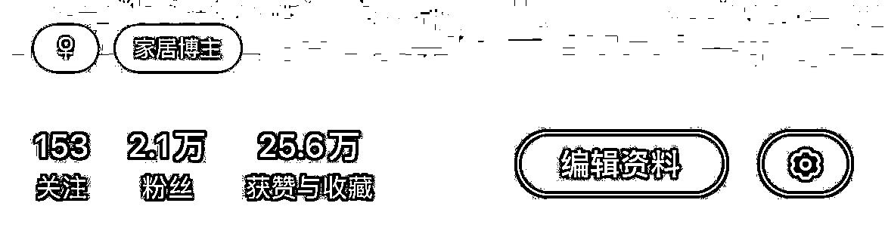
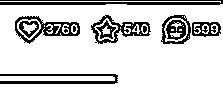

# 家居博主一条广告报价 4800，0 经验起号 5 个月涨粉 2W＋

> 原文：[`www.yuque.com/for_lazy/thfiu8/uxxhzdfxv9x7eaa0`](https://www.yuque.com/for_lazy/thfiu8/uxxhzdfxv9x7eaa0)

## (53 赞)家居博主一条广告报价 4800，0 经验起号 5 个月涨粉 2W＋

作者： 十一

日期：2023-11-29

怎么做一个有接商单能力的家具号？

答案很简单：内容。

通过优质内容让商家找到我们，并且持续复购。今天我会复盘自己 5 个月运营的细节，希望能给大家一些启发。

赚钱从来都不是一件容易的事

赚钱不容易，但有迹可循，大家好我是 90 后的生财新圈友十一，从业三年，带娃好多年哈哈。。。

简单的介绍一下我自己，我是一个 90 后的单身妈妈（女孩）因为生长在农村早早的辍学，所以被家里安排结婚，女生大好的青春因为懵懂无知和一味的听父母话葬送了好多年，婚姻的不幸福和生活的窘迫也造就了我独当一面的性格。

幸好为时不晚，27 岁勇敢脱离苦海出来工作，期间做过销售，卖过衣服，摆过地摊，在去年也独自一人带过团队做主播。

一路三年摸爬滚打心酸自知，但我从不抱怨。于建国老师说过，人只能从案例中学习，我深以为然。

如果没有做销售的经验我就不会与人打交道，不懂得揣测客户心理；没有卖过衣服，就不知道时尚趋势和后来做私域的供应链那么快的链接上；

不做主播就不知道原来我也可以站在屏幕前自信的带货，也不会接触到现在的电商赛道。每一个经历都是一张事业的拼图，看似无用其实都在暗暗发力....

废话一堆，接下来进入主题，我现在主业经营一家线下实体婚纱礼服馆，副业做小红书家居博主。下面接主题，五月份开始做小红书家居博主账号，五个月涨粉 2 万+两个月靠接广告变现 10w+，新红家居博主榜位居前列。

今天给大家分享一下我做账号的一点经验，希望对有想入局商单号的圈友有帮助

# 一、新手上路，上场即点爆

**（1）定位**

我关注到小红书的赛道其实非常的多样化，宠物，美食，美妆，穿搭，旅游，减肥……

每个赛道都有非常好的数据呈现和高质量的博主，那为什么在众多赛道里选择了家居博主这个非常卷的赛道呢？

首先家居类型可涉及到的广告品类会非常多，可选择的机会就会更大。

小到家居摆件大到家居家电，如果再结合到 Ip 属性，粉丝的粘性会更高。

因为我本身是比较臭美也喜欢拍照的，而且有一定的审美和网感（这里强调一点，做定位的时候一定要结合自身积累的优势之上的，没必要从零开始），此时赛道已经确定，接下来就是账号要以何种方式呈现。

**（2）账号方向**

因为之前在生财看了很多大佬分享的小红书店铺无货源玩法，也下场实操了几个账号。（没有太大的成绩，这里就不多赘述）

因为有了这个经验，对小红书笔记封面和爆款视频制作有了一定的认知。

在分析 20 个同行之后，发现他们主要都是做图文类的，视频偶尔会发那么一两条，但是数据会相比图文突出很多，而他们却不自知。

那机会不就来了吗？接下来继续分析，在刷了大量的同行视频笔记之后发现，低粉爆文里很多改造类视频非常吃香，粉丝粘性高，涨粉率也非常惊人。

刚好老家里的房子有条件可以改造，并且我对这个相当有兴趣，说干就干，这时账号定位已经非常清晰了。

上场即爆，首条视频按照以上思路去做，果然第一条视频就做成了爆款。

第一条爆款视频就为我带来了将近五百个粉丝，这对于当时的我来说，是非常激动和开心的，同时我也对这次视频能爆做了一次深度分析

**1、封面。**

我没有用大多数家居博主美美的封面，而是用了比较猎奇的封面吸引点击率。（这里大家可以打开小红书看看同页面几个封面哪种会让你有点击欲望，多分析拆解提升网感）

**2、情绪价值及反差。**

一间房子从一无所有破破烂烂历经几十天变得温馨好看你会不会有兴趣看下去？那么，改造这个房子的人是一个女生，自己动手改造而且她还没有任何装修经验会不会更有兴趣了？

总结一下就是通过真实和反差感会迅速拉近读者的距离，又通过励志的视频提供了情绪价值牵动了大家的共鸣。

在这个条件和背景下，系统根据笔记的标题，图片，内容等信息将笔记智能推荐给相关的一部分人群。

如果在初始曝光的人群中，笔记获得了较高的互动（赞，藏，评论，转发，关注）那么这篇笔记会进入更大的流量池，以此类推

**情绪价值是爆文的第一生产力，笔记带入作者的情绪才能牵动读者情绪，在实用类笔记中也可通过娱乐化，情绪化的表达来提高爆文几率**

我深知爆款都是重复的这个道理，继续沿用上一条爆过视频的封面和大致内容框架开始第二次尝试，果然成功了…

一周左右就到了千粉，开通了蒲公英商单，根据平台的推荐设置了报价，此时视频报价才 200，虽然价格不高，但是也算很快就见到了正反馈，还是很高兴的。此时就有了广告主找来合作。

# 二、着急变现，陷入流量瓶颈

粉丝数量低，笔记数据好，价格又便宜（200 块）性价比这么高的博主能不吃香嘛，这个时候很多品牌来合作，你以为这么顺利就能赚到钱了？别着急接着往下看

**（1）着急变现**

刚开始只顾变现忘了账号定位，有单子就接很多品牌不会管你账号，他们要的效果就是多账号分发，直接给我图文直发（那时候想也不用我拍东西，也不用写文案直接投喂多方便啊）

没发几篇之后很明显的感觉到流量下滑（这里提醒大家，刚开始接广的频率不要太高，最少间隔三天），不然会影响账号健康。

**（2）流量瓶颈**

因为刚开始不知道接广的限制，所以导致账号低迷了很长一段时间，我意识到必须搭建一个爆款选题库，来提高爆款的概率

# 三、内容为王，提升竞争力

那么接下来重点是，怎样才能持续输出爆款内容？

1、通过爆款选题，了解到近一周内比较热门的话题，查看每条笔记的标签以及内容的重合度，比如视频开头，视频结尾的互动，评论区内容，相信你一定会有很大的收获。

2、因为本身我自己的账号的封面已经是测试好的，基本上封面能够保证一个月左右的流量稳定，内容方面除了以上爆款选题以外，就是要看评论区大家互动的热议点（这点非常重要）

这就是我能够持续输出爆款的关键点，比如说厨房这个词出现的频率比较高，那么下一期我一定会出一个厨房相关的视频，这招百事不腻，下面是十月份数据概览。

**接下来是大家都比较关心的，如何对接广告主**

1、1000 粉就可以开通蒲公英，一般此时的广告费用是在 100-200 左右。不建议接直发的广告，还是以和账号内容强关联的产品合作为主。

2、随着粉丝量的增加报价也会随着数据和粉丝增量而提高，蒲公英后台会有建议报价，每个月 25 号前可以更改报价，次月生效。

3、当品牌要求硬广时要勇敢说，不。不过现在很少有这么强硬的品牌方了，不管是品牌还是博主都是希望通过合作达到最好的宣传效果，不会强硬要求和平台抗衡。

4、返点。很多大品牌会把推广项目分发给下面的机构以提升最大的效率，机构会从中吃些回扣，大部分会跟博主要 20%或者更高的返点，这个大家可以自己衡量，不知道怎么回复也可以问我哈。

5、账号走向越来越好时手里的 pr 也会更多，平时可以多聊一下增进感情，不但他们有新产品可以找你合作，还有在做帐号时的方向包括疑惑你都可以从他们那里得到不小的收获。

以上就是一整个起号的思路经验包括跟品牌的接洽。

目前账号五个月，粉丝 2.2W 一条视频报价 4800（目前 5000 了）虽然粉丝量没有很高，但是丝毫不影响我接广到手软，9 月份基本就把 12 月前的广告档位排满了。

（附加一句家居博主真的很香，家里的家电包括家具基本已经全部被广告主包揽了甚至到了没地儿可放的状态）

**思路拓展**

那么这个时候我开始思考既然商单号可以用这种方式起号，那么我的线下实体店（婚纱礼服馆）是不是也可以同样方式来引流？于是试着做了一个账号，以下是两天内发出视频的流量反馈，成功引流十几个潜在客户。

商单号与私域不同的点在于，商单号是重内容为粉丝提供情绪价值和种草拔草的一个过程，私域是重产品本身。

1、做私域，最简单的方法，就是拆解同行，看 20 个以上同行的笔记方式，看他们爆文是什么形式什么品，同行是最好的老师，他已经替我们铺好了路，我们只需要微创新，是最有效高速的方法。

（不过我们这些实体同行好像会做流量的不多，那这不就意味着我有机会）

2、把他们的最近一期的爆文款式直接找来图片，标题略改就 OK 了。上图所示，第一篇就爆，这个时候后面的内容流量基本能保持稳定，爆文生产因素跟上面讲的商单号同理大家可以多揣摩思考一下。

3、接下来就是引流私域的环节，很多用户会在评论区评论”怎么买“，我们需要对客户进行一对一的转化。

但是小红书的私信规则对企业号是 20 次/天，我们可以对评论用户主动去要微信，注意规避站外词，生财有很多大佬有分享私域引流话术这里就不多赘述。

4、关于是做个人号还是企业号，我的建议是先个人号为主，先跑通 0-1，因为站外引流还是有很大封号风险的建议多账号操作，成本低不怕哪天平台突然逮到也还有无数的号可以重新起。

5、心态方面，很多人会问我小红书还有红利吗，还适合新手入局吗？

我的答案是有的，但是依然希望大家对自己的预期低一点，为自己设定一个项目计划：投入多长时间，预计收入多少（我刚开始赚十块钱都很开心）每日更新多少条笔记。

之后就是坚持和信念，千万不要内耗。三天打鱼两天晒网的同学可不行哦。

# 最后经验总结

无论是做商单号也好，还是做店铺做私域，都要从粉丝的角度出发，输出有价值的内容，多挖掘赛道用户需求，持续输出优质内容才是长期发展的根本。

于此同时多去看同类型博主的视频，提升流量感知，让内容（封面以及视频风格）拥有自己的特色记忆点。

以上就是这次的分享，如果大家手头暂时没有很合适的项目，并且对小红书商单号或者私域感兴趣的圈友可以下场做起来了。

以上就絮叨这么多啦，感谢大家耐心看完，我是十一，一个努力奔跑的女孩。分享有不好的地方欢迎大家多指正，也欢迎大家有好的项目多链接多交流。

* * *

评论区：

早早 : 太励志啦！[强][强]
小鹅老师 : 有联系方式嘛
十一 : 大家都很励志💪
十一 : 哇，是小鹅老师哎！欢迎链接：759960577
Diana : 借个楼，最近新房装修，也准备起号，方便交流下吗
海波  活动策划师 : 想链接 13943434394
十一 : 可以 759960577
剑渊 : 给优秀的十一点赞[强]

* * *