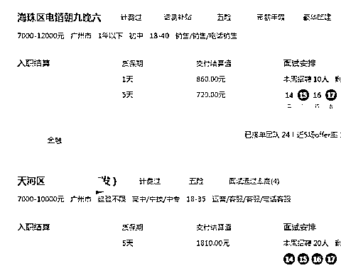
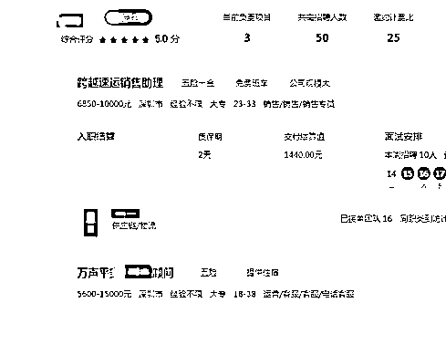
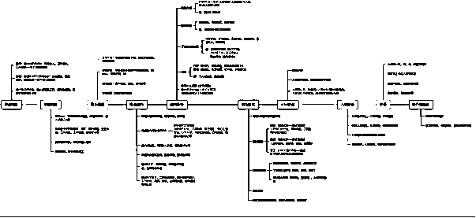

# 在互联网探索的失败中涅槃，揭秘人力资源代招聘的月入过万

> 原文：[`www.yuque.com/for_lazy/thfiu8/fgw7khg6idei69xl`](https://www.yuque.com/for_lazy/thfiu8/fgw7khg6idei69xl)

## (36 赞)在互联网探索的失败中涅槃，揭秘人力资源代招聘的月入过万

作者： l（一术）

日期：2023-11-27

圈友们大家好，我是一术。

来生财不知不觉已经 600 来天了，我从原来什么都不懂的小白到今天成长为一名持续创业者，知识得到提升，眼界得到开阔。这多亏了生财这个圈子带给我的成长，多亏了亦仁老大的言传身教。我不得不说生财有术的确是创业者的福音。

记得刚加入的时候，我填写了基础信息说过 3 个月变现一百万，从而受邀两次分享。

但分享一直是放了大家鸽子的，这其中的原因嘛，没有别的，只是生财圈友们的能力和水平让我自愧不如。

说是仅靠自己能力 3 个月变现一百万，倒不如说，是踩中行业风口让我获得了这一百万。（爆料一下，这个行业就是“债务协商处理”）。

**一、我从事人力资源管理项目的原因**

既然已经踩中风口，我为什么又放弃原来的项目选择从头再来呢？

原先的行业到 22 年初我就退场了，原因就在于当时的情况不容乐观，同行们都知道，刚开始百度信息流便宜，我们团队入场的时候才 25 一个的加粉，后面已经到了 200 一个粉，走起来困难重重。毕竟行业是能者居之，所以我这样的“无能者”便退场了。

在这次中我自己也深刻的体会到，多少的能力匹配多少的财富，当能力没有达到应该有的水准，那也会凭着实力把钱亏空。

22 年我做过很多动作，教培、抖音截流、小红书矩阵、群控，有关于流量的事情我都玩了一遍，成长自然是心自知。

可以说当时每天都研究平台规则，顺应平台规则来做事，这段经历总结出一个道理吧，当自己没有本钱的时候不要总想着创业搞项目，这个时候的我们抗风险能力极差，平台的任何规则变动对于个人都是内心沉重的打击，先踏踏实实的上班赚钱，由副业转创业才是现实的。

我大言不惭的说自己经历过大部分互联网项目，可最后的最后，我真的累了。

每次的短暂风口过后都是昙花一现，所以我一直想找一个长期主义事业，不受平台限制的，不受平台规则局限的项目，可以互补，但是不能过分依赖互联网的项目。这对于对互联网悟性比较低的我来说，可能才是最好的选择。不精但懂。

而我为什么选择人力资源代招这个行业呢，也很简单，求职者找不到好的工作，公司招不到优秀的人的问题，在疫情后这两年相当明显。企业求招的需求量很大，尤其是流动性大的岗位几乎是天天招人，我们的工作就是帮求职者找到满意的工作，帮公司招聘更多更好更优秀的人。有过招人经历的老板其实更能体会到，岗位只要挂着，天天有求职者打招呼。所以说，人力资源项目有需求有市场。

另外的话，其实各大招聘平台都在做人力资源 RPO。原因就是在于在中国的人力市场行业没有巨头及上市公司，我相信各大招聘平台巨头的眼光和布局，他们的团队告诉我目前这个市场的发展有肉吃。

另外我们对于求职者来说是完全免费与利他的，所以变现丝滑。让我不禁想到了一句话。“羊毛出在猪身上让狗来买单”。

**二、我个人在人力资源项目中的经验分享**

今天给大家分享的，是我在多次失败经验积累之后，取得成功的人力资源项目。第一次分享，是抱着真诚利他的想法去帮大家剖析一下这个行业，如果有不清晰或者讲的不对的地方敬请谅解。

**1.工作内容及成果**

人资代招聘行业大致可分为三种：蓝领、白领、高端猎头。

每种人资代招的对应人群都有所不同。

蓝领：文化水平较低的求职者，进入工厂做计件工以及简单而单一的劳动力。

白领：文化水平大专及本科以上，如今普通企业担任客服，销售等一些基础白领岗位。

猎头：为某领域某行业挖掘比较专业的技术性人才等。

我们团队是做的基础白领岗位，工作内容简单来说就是帮企业招人，拿佣金。

先以我们团队举例吧，我们团队 11 人、每月大概营收 35 万左右，主要以电销模式以及互联网平台引流为主。我们的身份就是官方的岗位推荐官利用话术，推荐岗位，获取信任后可以不断重复的利用私域去内推白领岗位。

个人做尝试的话，做好基础领域，不需要去研究平台规则，市场规则，更多的是开通招聘平台发布招聘岗位，如何多渠道获得简历预约面试时间就可以了。

那么针对于个人代招行业每个月可以赚多少呢？

以小白为例，开通招聘账号后第一个月上手后大约可以拿 30-50 份简历，成功入职在 5-8 人不等，也就是月薪 5-8K（这个数据会随着自己越来越熟练，手上的招聘账号的增加而随之增加）当然，基础的招聘平台的岗位费用和会员费用也会随之增加，一个招聘账号的费用为 300 左右，但是收入与付出肯定是成正比例的。

以团队来说，还是以我公司举例，目前加粉率为百分之 20 左右，一个员工目前一个月加粉 600-800 之间，产值 3-5 万一个人，投入产出比还行。

**2.新手如何入行接单**

人资招聘行业不管是大企业还是小公司或者个人，行业的唯一准则就是快速帮企业招到合适的人选并且拿到佣金，这是生存的基本。毕竟招聘速度太慢的话，企业自身同样可以招聘，这样就失去了竞争力。理解这个逻辑后，我们初期的单子可以选择和人力资源企业合作去开展，有点类似于现在的线上旅游或者线上民宿分佣逻辑。

那么，如何找到合适的人资企业对接呢？

●传统渠道：只要我们作为求职者去到各大招聘平台上，自然会有很多企业和我们打招呼叫我们面试，这中间一部分打招呼的 HR 就是人资的代招聘，详细咨询企业面试地址后如果和登记位置不合符，那大概率为人资代招。（这种方法省时省力都是 HR 和我们咨询，所以加 V 后谈成合作意向的概率很高）

●互联网渠道：逻辑和我们找对标账号一个道理，找到互联网账号所招聘的账号，加 V 丝滑。当然为了更好的对接，我们都以本地去开展合作意向会比较好。

●谈合作具体事项：每个岗位的返佣政策，佣金结算时间，保质期。

大部分岗位属于一次性入职后返佣多少钱。并不复杂。

而有些工厂属于岗位按小时返佣的，比如对外招聘一个小时佣金 20，给到人资公司返佣是一小时 2-5 块，那么这个员工之后只要一直在职，那么我们的返佣则一直都会有（这种返佣政策本人觉得并不可取，做久了感觉在剥削体力劳动者，仁者见仁智者见智吧。）

●接单平台的选择：传统的人力资源行业是自己去和企业谈意向拉单子，再去帮企业招聘。对于新手来说肯定难度有点偏大了，所以当时自己在人力资源拿到结果后，我也加盟大品牌花了十几个心痛得很，当然也证明了我对这个项目的决心以及肯定。现在大品牌加盟的话都是招聘平台下场自己自营的，曾经和某高管聊过这个话题，现在大家都想占领市场份额，平台想要的是数据，用户量，钱的话大部分留给加盟商。

boss.智联.猎聘.58 这些平台都是需要几万-十几万左右的加盟费（对于个人或小白并不友好），看完文章的圈友也一定要理性分析，投资有风险，创业有风险，生财有术人才辈出，多了解沟通准没错。

而我现在也因为做的比较稳定了，所以这些平台的服务商我也都拿了，目的就是需要足够多的岗位输出，另外对于企业福利待遇比较好的公司，我们会跳开平台自己再去对接一遍，这样的话佣金可以上浮百分之 10-30。当然一个也绝对够用了。

成为他们的岗位推荐合伙人后。这样的话，我们手上就不缺岗位订单了。

接单后系统显示的非常清楚，保质期是几天，佣金是多少，过了保质期后就计算佣金，平台会统一结算给我们。

**3.如何选择岗位**

因为我们开通岗位招聘都是要花 100-300 不等的会员费，所以选择岗位尤其重要，这也是小白最容易踏进去的误区，指标主要有三点：

（1）看需求量（需求量少我们招了几天后不招了，等于这个岗位也就浪费了。

（2）面试场次（像今天拿的求职意向如果等到 3.5 天后才有面试场次，大概率结果是求职者已经找好了工作，不需要了。

（3）确定好招人方向，主推基础白领岗位.还是蓝领岗位。

白领追求的是公司 5 险一金等晋升空间、以及氛围。

蓝领追求的是上班时长.是否包吃住.以及辛不辛苦等。

确定好我们主推的行业或者类别后在去开通岗位。

（我们团队靠着一家企业岗位做了 1 年，因为福利待遇好，6 险一金，面试通过率高，所以选择好的岗位尤其重要，岗位很多，所以前期需要有点耐心）

整个流程为：挑选岗位-与 pm 确定具体的详细情况-确定招聘渠道-对接求职者（流程很简单，多劳多得，简历越多面试越多.拿到的佣金也就越多。

**4.阶段方法**

●入门玩法：选择我们注册 boss 等各大招聘账号，开通岗位以及会员，把岗位的福利待遇详细情况复制到招聘平台（可以稍微把福利写好一点为了引流，吸引求职者去面试，但是不能太夸张）对接求职者，约定面试时间，等求职者如约面试通过后就能拿到钱（当然会有保质期的，一般来说是 3-5 天，也就是说待满 3-5 天就可以计算佣金）各位圈友很多都开过岗位招过人，所以基本上一个月成功入职 7.8 个员工是不成问题的，这也是最基础的，人力资源月入过万也就是这么来的。

整个流程并不复杂，唯一需要注意的点在于 boss 招聘账号注册的问题，是需要场地验真的，所以在这一块的话，基础搭建：需要一个只有座椅电脑的空房间，一个 40×60 的 KT 板招牌（25 元左右），一个营业执照，一个营业执照可以开通三个 BOSS 招聘账号，对于个人来说是绝对够用了，当然如果朋友有场地愿意借给我们注册账号那就更好了，成本 0。各大招聘平台肯定是属于这个行业的红海，因为百分之 90 的团队都是用这个方法。

●资深玩法：开通快手.抖音.小红书等账号矩阵视频或直播进行招聘，这些平台不用说，肯定流量是大把的，且不违规。

需要注意的点是抖音是需要报白的。当然不报白引流有没有办法呢，当然也是很多的。

分享一些案例给大家作为参考（再次感叹宝藏生财的强大，其实都是咱们生财圈友的案例，亲测有效，借花献佛了。）

包括我们团队电销模式在内，账号矩阵、兼职群发、城市代理、全网卖项目招商、创业粉、兼职粉引流等等，可玩性很多，在这里我也就不班门弄斧了。

这个项目对于小白来说发不了大财，但好在多劳多得月入上万不难。

可是对于圈友来说可玩性就多得多了。

我是一术，人力资源的前行者，由于文笔不行，第一次分享自己的行业，不清晰的地方不要介意，之后如果大家对人力资源兴趣浓厚的话，

后续我再分享一篇针对于新手 0 成本入行的实操文章给大家作为参考。

**PS：如何对接当地人资公司话术及方法、**

**引流同城求职者方法、及相关话术**。

最后感谢生财，感谢圈友的知识分享，才能成就现在的我。

有对人资感兴趣的圈友或者同行期待大家的交流与联系。

* * *

评论区：

52 赫兹 : 期待后续文章
薯条 : 期待后续文章
范杰 : 怎么联系您呢文章挺好的
l（一术） : 头像主页有呢，期待链接交流。
摸鱼大师 : 兄弟，看了你的文章受益匪浅，加你了通过一下，求个做单账号。
l（一术） : [OK]
Jeremy yeu* : 魔方？
l（一术） : 其中一个展示[呲牙]

* * *