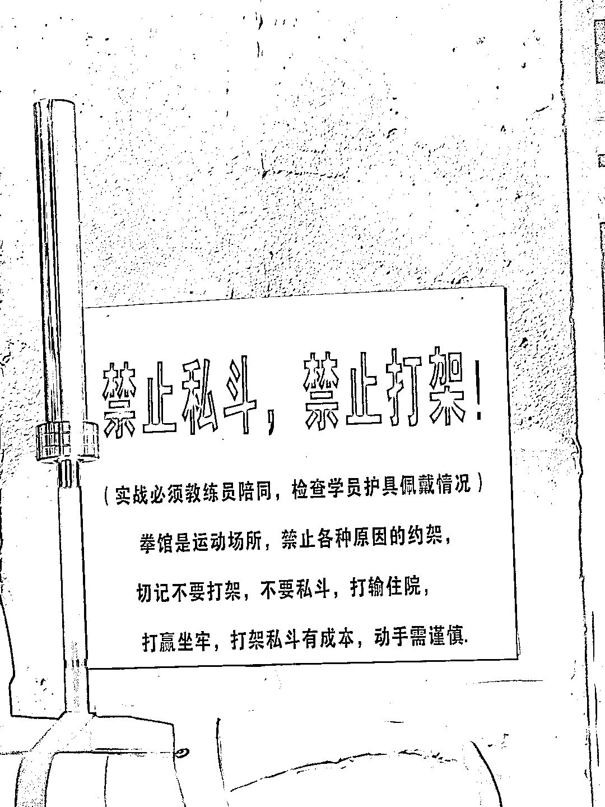

# 腰部的创造者，最容易受 AI 影响

> 原文：[`www.yuque.com/for_lazy/thfiu8/owtvwz8btzdkiexv`](https://www.yuque.com/for_lazy/thfiu8/owtvwz8btzdkiexv)

## (26 赞)腰部的创造者，最容易受 AI 影响

作者： 杨昌

日期：2023-12-11

“腰部的创造者，最容易受 AI 影响”这个观点，我一直觉得有点不对劲，今天终于有点相通哪里不对劲了。

一、为什么很多人认可这个观点？

1、他们可能是这么分析的

“有了 AI，及格线以下的人，似乎可以干到及格线，实现了质的飞跃；

而头部的人，可以一个人就是一支队伍，更好更快实现自己的想法。

唯独是腰部的人，不上不下，尴尴尬尬，处境最危险。”

2、这段分析的不靠谱之处在哪里？

这段分析，想想似乎有点道理。但仔细想想，会发现她更适合二维世界里的玩贪吃蛇游戏。

可惜现实世界不是二维游戏，早在互联网时代马化腾就曾说过：

“这个新时代，不再信奉传统的弱肉强食般的「丛林法则」，它更崇尚的是「天空法则」。

所谓「天高任鸟飞」，所有的人在同一天空下，但生存的维度并不完全重合，麻雀有麻雀的天空，老鹰也有老鹰的天空。

决定能否成功、有多大成功的是自己发现需求、主动创造分享平台的能力。”

二、先说个反直觉的现象

很多腰部创造者，早已因 AI 而受益

1、在抖音上，腰部创作者也很赚钱

2021 年前后，我有浅度参与过部分“抖音商业 IP”的打造，真正见过一些腰部创作者赚到钱。

现在去微信上搜我的名字加“抖音商业 IP”，应该还能搜到几篇文章。那么，为什么这些腰部创作者也能赚到钱呢？下面这段话，能解释一部分原因：

“如果马云在做生意方面可以打 100 分的话，那他只会带着 90 分以上的企业家去做生意，那 90 分以下的人怎么办呢？80 分的人，去跟 90 分的人学；70 分的人，去跟 80 分的人学；60 分以下的，去跟 70 分的人学.....

这不是骗人，这是市场中价值流动的事实。因为 90 分的人，时间很值钱。如果你让他教 60 分的人，一定要一次教很多人才能获得匹配的收入，比如得到的专家，一堂课卖 99、199，可以卖很多份。

但如果 60 分的人，不满足于听课，需要有人带着干呢？90 分的人能带这么多人吗？不能。

这时候需求就出来了，60 分的人没有 90 分的人带，就需要 70 分、80 分的来满足他的这个需求。

我们没必要、也不可能一开始就成为行业顶尖专家，也不用服务全国人民，只要我们在某一个领域有一点优势，再找到有这一部分特定需求的用户，能够服务好他们，就足够了。”

2、更重要的原因，其实是 AI

虽然 70 分可以教 60 分，60 分可以教 50 分。但凭什么“只要我们在某一个领域有一点优势，再找到有这一部分特定需求的用户，能够服务好他们，就足够了”呢？

因为有推荐算法，因为大数据真的会把我们这些腰部创作者的内容，推荐给真正需要他的人。是推荐算法，让更多人有机会只要有 1000 名铁杆粉丝就能养活自己。

再举个极端点的例子，论搞笑，小杨哥不可能有周星驰搞笑，甚至连开心麻花的门槛都够不上，但有了推荐算法和短视频，他的搞笑内容可以被更多人看到，如今就有了名震安徽的“三只羊”。

当然，你可以说，推荐算法的 AI，和 ChatGPT 这一波的生成式 AI，是两种不同的 AI。行，我们接下来，再聊聊生成式 AI。

二、生成式 AI，也在持续造福腰部创作者

就在这几个月，我就看到了很多腰部创作者因生成式 AI 而受益，下面举两个例子。

1、生成式 AI ，让腰部创作者更具独创性

很多创作者吐槽，AI 生成不出有独创性的好东西，然后就不进一步研究生成式 AI 了。

但我也见过一些聪明的创作者，自己创作完了，也找生成式 AI 创作一波。

如果 AI 输出的结果，跟自己写的相似度较高，那么就说明还是有点套路化，还有进一步原创的空间。

而进一步原创的思路，也可以让 AI 来更快更好地激发。

2、生成式 AI，腰部创作者有更多机会被看见

有生成式 AI 之前，更容易被看见的创作者，往往是那些名气大或者数据好的。

但坦白讲，名气好不等于不会扑街，一众流量明星的票房滑铁卢就能说明问题；而数据好，有时候只是因为迎合了平台，或者干脆就是刷出来的量。

那当时为什么不能基于内容质量本身让更多人被看见呢？因为对不起，C 端的消费者和 B 端的采购者，都没那么多时间去看海量的内容。

因为没有名气、没有数据，很多“金子”就被埋没了地下，没了发光的机会。

现如今，在生成式 AI 的辅助下，很多普通人用 AI 辅助筛选哪些内容值得读，于是更多内容被适合他们的人看到了；

部分采购者终于不再受限于内容的数据和创作者的名气，而是可以腾出手来，直接基于内容的闪光点去采购更值得的内容。

———

我坚信，有了生成式 AI 的辅助，更多中腰部的创作者，因为有更多机会被发现，因为有更多机会被赋能，将会快速成为更多垂直细分领域的头部创作者。

生成式 AI 带来的，不止是头部创作者的强者恒强，也不止是底部创作者的爬上及格线，更是腰部创作者们蓬勃发展，带来的各个细分品类的空前繁荣。

* * *

评论区：

李彬 : 有同感!我就是这样的腰部，也能抓住一些机会。不过这些机会可能是头部看不上的

* * *