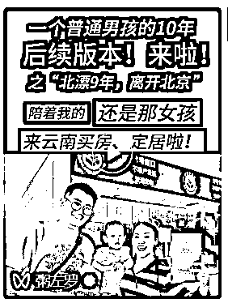

# 纯靠私域从 0 个好友的纯小白到 4000 个好友的朋友圈运营心得

> 原文：[`www.yuque.com/for_lazy/thfiu8/spn9g2tuegarkhp7`](https://www.yuque.com/for_lazy/thfiu8/spn9g2tuegarkhp7)

## (58 赞)纯靠私域从 0 个好友的纯小白到 4000 个好友的朋友圈运营心得

作者： 挽歌｜烽狂创客创始人

日期：2023-12-15

大家好，我是挽歌，03 年 985 大学生，2023 年进圈开始做私域 IP，纯靠私域做 IP 营销，从 0 个好友的纯小白到 4000 个好友，至今积累近 3000 个付费用户，接近一年时间赚了将近一百万。

我是怎么做到的？今天给大家分享一下我的私域运营三大法宝之一：朋友圈运营心得。

不认识的朋友如果想了解我，或者想了解我对于私域的基本认知，可以先看一下我写的这篇精华帖：[`t.zsxq.com/15ZzRNyDn`](https://t.zsxq.com/15ZzRNyDn)

#   一、为什么要发朋友圈？朋友圈应该发什么？

如果说**私域的本质是你的门店，那么现在朋友圈就是你的广告牌。**

想要成交，要么你去私信拉客，要么你就建群营销，要么你就通过朋友圈去打广告、去吆喝，去告诉经过你的朋友圈的人：

1.  **你是一个什么样的人**

2.  **你在做什么事**

3.  **你能为他提供什么价值**

但是私信营销是非常难的，特别是做虚拟产品，容易被人拉黑，而且转化率很低。

社群运营又有较高的门槛和需要耗费巨大的心力才能做好，人人都能发的朋友圈就是重中之重了。

所以我说，**普通人的私域应该从朋友圈开始！**

那么，如何评判一个的私域朋友圈到底合不合格？

其实，就看他的广告打得怎么样。

**广告，就是广而告之，让大家都知道、让更多的人知道你以及你的观念、你的产品。**

**如果一个人朋友圈运营得很好，那么你就会很清晰的知道他的私域 IP 定位、他的个性、他的三观、他的核心产品。**

所以这里大家应该知道朋友圈该发什么了吧？

1.你——展示世界中的你：你是谁？你在做什么？你的个性？你的外貌？你的生活？你的认知？你的格局......

2.你的观念——展示你眼里的世界：你的人生观、你的价值观、你的世界观、你的金钱观、你的恋爱观......

3.你的产品——展示你能给别人的东西：时间？注意力？信任？金钱？影响力？技能？项目？认知......

但是能发的好像又太多了，我们的目标是赚钱、是成交、是打造私域的个人品牌，所以我们需要选择性的发：

1.你——展示世界中【美好】的你：清醒的你、独立的你、优秀的你、正能量的你、帅气的你、勇敢的你、努力奋斗的你、热情的你、谦逊的你......

2.你的观念——展示你眼里【美好】的世界：相对正确的三观、客观的深刻思考、理性的视角......

3.你的产品——展示你能给别人的【好】东西：宝贵的时间？稀缺的注意力？坚定的信任？大量的金钱？巨大的影响力？精湛的技能？稳定赚钱的项目？超越同龄人的认知？强大的商业思维和商业嗅觉......

所以，说到这里，所谓个人品牌、私域 IP、超级个体，其实就是**一个人的正向真实世界的投影的交集。**

怎么理解？

举个例子：

假设我的全世界是集合 W，我在其他人眼里的样子是集合 W1、W2、W3、W4.......

我在 A 眼里是一个样子——W1

我在 B 眼里是另外一个样子——W2

我在 C 眼里是第三个样子——W3

......

那么，我在所有人眼里的样子=W1+W2+W3+W4+......=我在其他人眼里的样子的合集。

我在其他人眼里的样子，其实是我的真实世界的投影，那么：

我在所有人眼里的样子=W1+W2+W3+W4+.....=我的真实世界的投影的合集。

但是，如果好的样子也有，坏的样子也有，这样的角色也有，那样的角色也有，这叫个人，但是不叫 IP，不叫品牌。

**IP 之所以为 IP，品牌之所以为品牌，是因为他们纯粹且优美：纯粹容易被记住，优美容易被追随。**

那么，如何才能做到纯粹且优美？

**让自己变得足够纯粹，让别人对你产生强大共识；**

**让自己变得及其美好，让别人对你至死追随！**

——这，就是我理解的个人 IP 的塑造之旅。

所以，我便得出来我理解的个人 IP 的定义：**一个人的【正向】真实世界的投影的【交集】。**

由此也能证明：其实我们不可能窥见一个人的全世界，切莫以偏概全。

# 二、发朋友圈之前要做好准备

## **第一步，一定找好朋友圈定位**

做 IP 和做自媒体的小伙伴大部分都遇到过这样的境况：犹豫朋友圈做什么人设？输出什么内容？换几次定位都没确定下来……

★那么该怎么做好自己的朋友圈定位呢？

### **定位第一步：选择一个合适你的赛道。**

一个好的赛道应该包含以下几个因素：

#### **1\. 你感兴趣**

什么叫感兴趣？感兴趣就是没有及时快速的正反馈和经济回报，你也能很开心的去做的赛道！

千万不要选择一条你自己做起来没有任何正反馈的赛道，否则大概率你会半途而废，或者非常折磨。

**2\. 你有能力**

什么叫有能力？有能力就是，你在这个赛道里面，你能做到前 20%！

要么你有天赋，要么你足够努力！要么两者皆有！

哪怕你感兴趣，但是如果你就是做不好，那么你也是白搭，只能当成爱好，不能当成事业。

**3\. 能够变现**

什么叫能够变现？你有能力做好，也有兴趣，但是如果你选择赛道变现能力非常差，那么就是一件很难走长远的赛道。

因为，民以食为天，没有足够的经济价值，你最后都走不下去的！精神需求建立在物质需求之上！除非你是个富二代！

**4\. 有持续性**

什么叫有持续性？有持续性就是，你的流量你的精准粉丝来到你身边之后，你可以把他们圈住，并且使其不断为你提供经济价值，也就是说你能够让他们持续为你付费！

也就是你要考虑你的产品是否具备让人复购的属性。这样的话你才不需要永远一直在引流引流，一次引流，终身受用，流量进多出少，你后期才能做到非常大！

**选好赛道，我们再去找更具体、更细分的小领域。**

具体到那一步？

**具体到你能解决一个什么问题！**

赛道只是领域，领域太宽泛了，无法着手，想要赚钱，你就要细分具体：**根据问题找定位。**

之前我说过：**用户买的不是你的产品，而是解决方案！**

**所以想变现，一定要能够给别人提供解决方案，而解决方案的存在就是为了解决问题——所以我们应该从问题出发，从需求出发。**

比如什么？

1.朋友圈运营教练——叫别人怎么运营朋友圈——满足别人朋友圈运营变现的需求

2.网络社交教练——教别人怎么进行网络社交——满足别人混圈破圈的社交需求

3.化妆师——教别人怎么化妆——满足别人化妆爱美的需求

4.摄影师——帮别人拍/或者教别人拍照—满足别人对写真/学习摄影技术的需求

......

**你要赚的钱来自客户，所以，你的定位应该来自你的客户的需求。**

用一句很形象的话来形容就是：**要带着问题去寻找答案，而不是带着答案去找问题——而这恰恰是大多数人的思维误区！**

最后提醒一下：

**不要纸上谈兵，一定要去亲身感受市场需求情况。**

如果你脑袋里只要有一个大致的方向，就要行动起来实操去试错。

在实操过程中,不断关注来自用户和自己的反馈，再去进行调整。

### **第二，构建你的产品体系！**

光是定位没有用，流量来了，客户来了，你得能够让他们为你付费，所以你需要有一个产品。

但是做私域，是循序渐进的，一步到位是不现实的，所以你需要设计好你的产品体系。

一个完善的产品体系，我认为应该包括以下三部分：

**1.流量池**

什么是流量池？就是流量来了之后，你要做流量承接，把它圈住，不让他流失，方便后面做转化。

流量池包括免费流量池和低价流量池，免费流量池可以是个人微信，也可以是免费知识星球，免费社群，还可以是公众号，你的公域账号！

付费流量池，一般都是指那种几块十几块或者几十块的付费社群，或者知识星球。

**不断从免费引导到付费，通过朋友圈运营，和知识星球的运营以及公众号运营，不断的去做付费的激活和转化！**

**2.转化池**

转化池是什么概念？

转化池是你一个低价到高价的中间转化的产品，可以是社群，可以是课程，可以是训练营，不过都是中客单价的，比如说几百块的。

转化池的作用就是为低价转高价做一个转化作用，当然也有一定的收入，但是真正的私域高手都是通过质量取胜，人家一个高客单价几万块十几万，你要做低客单价，得做多少流量？

所以还是得建立自己的转化池，赚多少钱不影响，这里就要做战略性的放弃，比如说中客单价做的性价比最高，同类产品里面做到价格最低，然后交付做到最好，让你的客户感受到你的产品的质量和性价比，从而让他们转化成为你的铁杆粉丝！

**拥有铁杆粉丝之后，你才能拥有让他们为你付高客单价的能力！**

**3.付费池**

付费池也是我自己搞的一个概念。

为什么要用池？

**因为圈人就是圈钱！**

你的高客单价的产品，尽可能还是不要 1 对 1，一分时间多份利用，充分利用社群的杠杆或者说圈子的杠杆，达到一个放大的效应！

从而让你的高客单价产品的交付更加轻松，并且一次交付，收获多次收益！

所以要打造付费池！

## **第三，要做好流量方案！**

如何做流量？

先问自己几个问题：

1.  **你的流量群体在哪？**

2.  **他们有什么特性？**

3.  **他们有什么共性？**

4.  **他们有什么共同的需求？**

5.  **这些需求是否强烈？**

6.  **他们的需求你的产品是否能满足？**

7.  **你的能力是否能够让他们为你付费？**

想清楚这些问题，就能确定你的精准流量群体在哪！

### **下一步才是做引流！**

**引流就是匹配用户的共性需求去生产内容，从而吸引到你的精准用户！**

当你的精准用户被你吸引的时候，留下公域转私域的钩子，引流到私人微信或者其他的私域平台——也就是你的流量池！

所以拆解到这，从赛道，到产品体系，再到流量方案，最后到转化运营，整套流程，如果你心里面有一整套这样完善的流程，你做知识付费那就是一件事半功倍的事儿！

如果你没有这么一个清晰的构架，那你做个人 IP 就是一件事倍功半的事！大概率拿不到什么结果！

有了以上准备，接下来就是进入正式发朋友圈的阶段了。

# 三、理解在朋友圈运营中附加价值的重要性

朋友圈营销的本质，是与你的朋友圈好友建立情感联系，并且为他们提供一种终极的用户体验。

**工业时代的产品标准是功能性体验，主要强调功能功效，能够让人下单的依据是以下标准：**

1.属性：你的产品有什么不一样的功能。

2.优势：你的产品比起别人怎么样。

3.好处：用了这份产品，你能获得什么好处，物超所值。

现在大家觉得在互联网时代，在朋友圈运营过程中，这三个标准还适用吗？

其实不适用，因为，**工业时代是功能时代，互联网时代是体验时代。**

人家要是看功能，还有朋友圈什么事。

朋友圈是为了社交而存在的，为什么能够在朋友圈把产品卖出去？因为用户情感体验感更好！

**朋友圈营销之所以能够诞生，就是因为现在的用户多了使用需求之外的强烈的情感诉求。**

**在移动互联网时代，产品只有触动了用户的心灵，提供了超越商业本身的价值，才有新的机会。**

朋友圈带货就是因此应运而生的。

**什么叫做提供“超越商业的价值”？**

我们先来理解一下，现在的商业和以前的商业有什么区别。

**以前的商业：**

你卖东西，你把产品给我，我把钱给你，交易就结束了。

因为供不应求，所以只要你的产品够好，压根不愁卖。

**现在的商业：**

供大于求，这个产品，我在小红书也能买，在淘宝还能买，在拼多多、京东、得物、咸鱼......

用户有太多的选择了，所以，现在，你想要我买你的产品？凭什么我要在你这里买呢？

**这个问题就是核心：你得让我获得更多的赠品——附加价值。**

单单靠产品本身已经不足以让用户锁定你了，知道吗？

这么多人卖，我为什么要在你这里买？因为你给了我更多的东西!

比如说什么？

1.知识：让人学习、成长

2.娱乐：让人开心、快乐

3.情怀：让人感动、敬重、仰慕

4.救赎：让人被治愈、被解放

5.震撼：让人开眼、印象深刻

6.进阶：让人格局打开、境界突破

......

这也符合了之前文章中提到的：

*1.私域营销，第一步卖自己，第二步卖观念，第三步才是卖产品。*

*2.用户买的不是产品，而是解决方案。*

*3.想要把东西卖出去，你要学会给用户一个下单的理由！*

**附加价值，不仅仅是品牌之所以存在的原因，还是用户下单的依据。**

我买了一辆豪车，我买的那是车吗？

不，我买的是身份证明、地位证明，我买的是面子和门面以及商业牌桌上的筹码。

买了一份产品，我不仅仅获得了产品本身，还获得了 XXXX。

而这，就是打造个人品牌和朋友圈营销的核心。

**做个人品牌，就要做出强大的附加价值，才能让人一有什么需求，就想到你。**

**做朋友圈营销，就要从附加价值着手，给足别人从你这里下单的理由，让客户非你不可。**

那么，如何利用附加价值促使成交呢？

——**我们需要拥有俘获他人心灵的力量。**

# 四、如何俘获用户的心灵呢？

我们已经知道，俘获用户的心灵就是俘获用户的钱包。

那么，如何俘获用户的心灵呢？我总结了以下几种途径。

### 1、传递你的价值主张

最高级的营销学，讲的是价值观。

举几个例子：

1.  生财的：一个谈钱不伤感情的社群

2.  公众号：再小的个体，也有自己的品牌

3.  脑白金：今年过节不收礼，收礼只收脑白金

**传递你的价值主张，作用其实就是需要你在无声无息之间，给用户大脑植入一个成交密码。**

你得告诉大家：

“你存在于我的朋友圈，我的生命当中，你的价值是什么？你的意义是什么？”

最好能把你的价值观，变成一个大家的共识——一个共同的追求！

那么，很好，你的成功就是指日可待的了！

因为，你满足了一下三点：

**你的成功是所有人都希望看见的；**

**你赚钱是所有人都希望看见的；**

**让你就是要成功变成所有人都共识。**

如果做到这样，成交还难吗？裂变还难吗？转介绍还难吗？

答案显而易见，是不难的。

### 2、讲一个令人印象深刻的故事

**非凡的故事创造非凡的印象，故事给我们描绘的印象，远比单纯的事实和抽象的观念更有说服力。**

把你的个人故事讲好，让新认识的或者说不认识的人，也能看到你的存在、你的状态，让你的好友可以了解你、认识你，甚至能够认可你。

案例：

**· 人设文：写一篇足够详尽一点的文章，记录你创业以来的个人经历和感悟。**

比如：之前在生财写的这篇精华帖：https://t.zsxq.com/15ZzRNyDn

**· 【我的 xx 十年】系列视频作品。**

比如：

1.  还有很多，就不一一列举了。

这些都是故事，告诉大家一个【逆袭翻身】的故事，告诉你背后的艰辛以及你取得的成就。

**非凡的故事，将会给人们带来非常的感动以及非凡的印象。**

朋友圈运营何尝不是如此——你的朋友圈，就是你的故事日历。

**让你的朋友圈，变成一个【让人欲罢不能、想要追更的电视剧或者小说】。**

你就成功的写成了你的故事。

**记住：做个人品牌的人，都需要成为自己人生的主角。**

如何实现的呢？

其实，很简单，就三个词：

**1.持续记录**

**2.与众不同**

**3.波澜起伏**

你的故事，其实开头可以很简单，结尾也可以很平凡。

但是，记住：**你需要传递出改变和向上生长的力量!**

人们需要案例，比如：

1.  逆袭成功的案例

2.  改变人生的案例

3.  绝境逢生的案例

4.  逆向生长的案例

**你要做的，就是活成别人向往的样子，变成他们对标的案例。**

怎么去做？

1.改变普通人没办法改变的现状

2.坚守普通人不能坚守的理想

3.完成普通人完成不了的任务

4.实现普通人实现不了的梦想

并且，记住：做个人品牌，并不需要你多么牛逼，多么不可思议。只需要，你比普通人强一点就行。

你比普通人更加的努力一点、强大一点、坚强一点、目标远大一点、浪漫一点、热爱多一点、坚持多一点……

**处处都多一点，这就是你脱颖而出的起点，也是撬动个人品牌的支点。**

所以，真的，个人品牌没有大家想象中的那么难。难的是时间建立起来的壁垒。

关键在于，你是否自认不凡，或者不甘于平庸？

如果是这样，讲好你的个人故事，展示你的蜕变历程，叙述你的高光时刻和低谷时刻，告诉别人你的精彩人生。

那么，你就可以成为别人眼里的光。

### 3、创造一种终极的用户体验

最好的代言，就是交付本身。

比如：

1.靠谱：你承诺了什么，实现它，连贯、一致、质量，长期、持续、稳定的高质量交付。

2.溢出价值：创造感情上的联系，不要仅仅只是交易，比如说定制、专属等，就能满足他们的虚荣心，或者说装 B 的需求，或者说，仪式感，或者说，惊喜感，等等等等

3.用户视角：以用户的视角看待交付结果，需要大家拥有换位思考的能力。

如果我是买家，我会有什么期待？我会有什么需求？我会有什么体验感？

然后根据强大的用户思维，进行产品和服务的调整升级，最后结果不会差。

4.可沟通性：朋友圈运营需要大家给用户很强的沟通感，感觉到你是重视并且用心对待他的需求的。

5.亲和力：友善，很好沟通交流。

......

### 4、修炼你的表现力——朋友圈文案的王炸

什么是表现力呢？

首先大家要清楚这四种平面力的概念：表面力、表象力、感染力、表现力。

第一，表面力：单纯的数量堆砌，排版，比如之前提到的朋友圈美学技巧，其实就是表面力的体现。

第二，表象力：表象力在表面力之上，给人提供一种感觉，一种情感在里面。这是可以在感觉、知觉作用消失之后依然存在的力。

第三，感染力：感染力是一种引起共鸣点认同感，重点在于感觉的传播迁移。

所以，表现力到底是什么？

**表面力和表象力都呈现之后，能够对观众实施感染力——这就是表现力。**

你和你的品牌需要修练你的表现力，你的感染力太虚弱，你能感染谁你呢？怎么感染？

真正打动人心的文案，都是发自内心的呐喊。

极致绚烂的结果，来自极致用心的栽培。

动之以情，晓之以理——这就是我朋友圈成交的核心心法。

感谢大家的观看，我的分享到此为止，一起生财有术！

* * *

评论区：

挖哈的阿抓 : 666
挽歌｜烽狂创客创始人 : 还没睡呢？哈哈
胡意甜 : 6666 呀真的是全是干货～
挽歌｜烽狂创客创始人 : 经验有限，如有不当之处，欢迎指教~
挽歌｜烽狂创客创始人 : 谢谢认可~
阿叶 : 🙋🔥🔥
拾一 : [强][强][强][强]
♻️李拜五💥 : 流量主要是哪里来

* * *