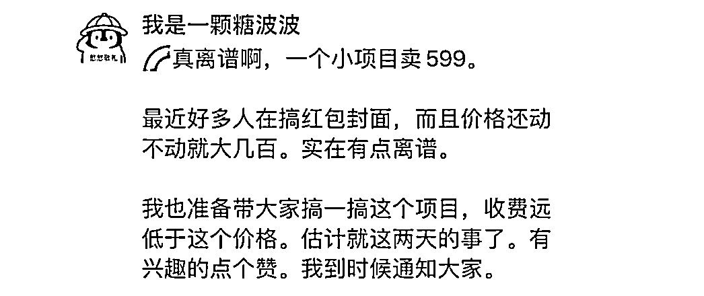
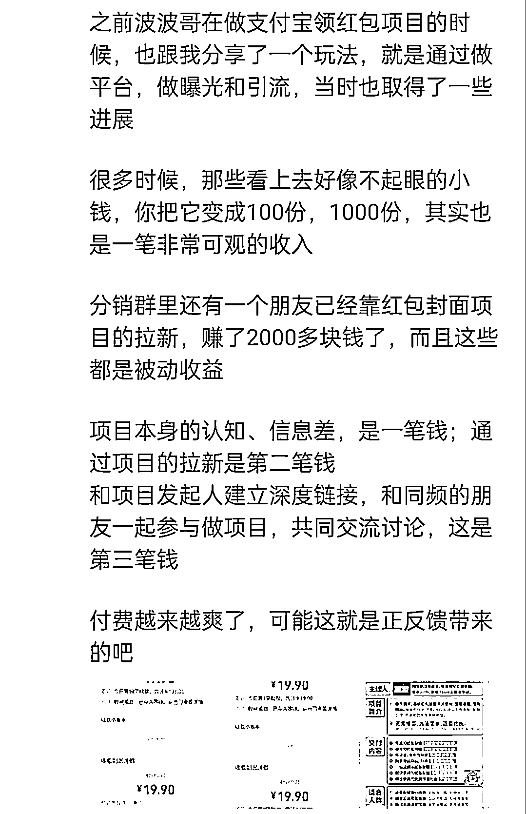

# 深度拆解“波波红包封面项目裂变 2700 人”的私域玩法

> 原文：[`www.yuque.com/for_lazy/thfiu8/clcooygelzo8sgis`](https://www.yuque.com/for_lazy/thfiu8/clcooygelzo8sgis)

## (18 赞)深度拆解“波波红包封面项目裂变 2700 人”的私域玩法

作者： 辰风

日期：2023-12-14

大家好，我是辰风，主要是做 IP 孵化和私域运营，23 年通过私域成交变现了 15 万。

这一次也是全程看着波波哥的红包项目，见证波波的社群从几百号人裂变到 2700 多号人，目前已经开展到了 7 群。

我觉得这是一次非常值得参考和学习的朋友圈营销爆款案例，所以在看完波波这篇帖子之后，复盘下了我的拆解和思考：[`t.zsxq.com/158CD1FKI`](https://t.zsxq.com/158CD1FKI)

这次的变现数据和分销成绩非常可观。比如老马，还有几位朋友，通过红包封面项目赚了小两三千块钱，分销了 100 多位用户。

我算是入局比较晚，当时我还在睡觉，大家就已经开始分销起来了，所以没有把握先发优势，

但是最终还是通过私域的社群和朋友圈分销了 30 多位用户，小赚了 600 来块钱。

废话不多说，步入正题，和大家拆解一下波波项目裂变和我分销过程中的私域玩法。

目录如下：

1.  借 IP 的势能和数据曝光

2.  借项目的风口和异常值

3.  用户调研，铺垫预告

4.  正式宣发，注意力拉满

5.  大 V 下场，分销激励

6.  私域导流，项目持续推进

## 借 IP 的势能和数据曝光

波波曾实操天涯神贴项目，全网涨粉 6 万，个人变现 30w+ 利润;带领 100+ 小白学员全网涨粉 40 万，累积变现 60 万利润。

光是这个项目背书和成绩，就非常吸引人了，波波本身就是一个非常强大的 IP，用户粘性也很好。

在之前的项目推进过程当中，波波也有建立自己的社群，也带领很多学员拿到了成绩，所以大家天生的对于波波的项目认可度非常高，这是来自波波的 IP 魅力和个人的势能。

再加上之前在网赚项目也取得了非常好的成绩，大家对于这种成绩天然就会有一种崇拜感，会好奇，会感兴趣，想下场做流量一起赚钱。

IP 能打，往期学员认可，冷启动非常简单。

## 借项目的风口和异常值

微信红包封面的玩法其实也是在先前天涯神帖引流的升级玩法之前，波波哥在这个项目也跑通了取得的成绩，并且变现很好，所以波波哥对于这一整套 sop 的流程和打法是非常了解的，所以这是硬件设施。

波波在之前的精华帖拆解当中提到，红包封面是一个异常值，尤其在春节前夕，搜索量非常大，大家对这个话题的关注度也非常高。

趁着很多人还没有反应过来，没有来得及入场，波波抓住了先发优势，率先出击。

（如果大家有留意的话会发现，在此之后有很多红包封面的项目和团队爆发了出来）

## 用户调研，铺垫预告

铺垫的目的，就是把注意力拉满，让大家留意你的动向。

朋友圈消息是有小红点的，让用户先点赞，之后可以朋友圈评论，算是一对多的定向提醒。

不用私聊，省事省力，但是却同样可以触达用户。

这也是朋友圈的一种玩法。

## 正式宣发，注意力拉满

冷启动的环节是非常关键的，在冷启动的过程当中，一定要把曝光度和大家的注意力足够拉满。

要强调自己项目的优势，把营销做到位，社群裂变的第一个环节就是从自身的私域开始

比如社群和朋友圈，只有你把你的私域调动起来，推动了，这样才能有效的激励你的列表用户，去进行后续的裂变，冷启动完成好了，你后端的裂变效果也会更好。

在我的正式宣发过程当中，我用了两套文案，第一套文案：先聊波波哥是谁聊，这个项目的风口和优势。

因为我的用户不熟悉波波哥这个 ip，所以我需要简单的介绍一下。

通过项目的优势和数据来引发大家对这个项目的好奇，最后再告诉大家这个项目非常便宜，通过对比市面上几百的割韭菜教程，这个项目只需要 19 块 9 就可以入局.

其实到这一步大家已经非常感兴趣了，也通过这种方式就当场拉了十多个人入群。

第二条朋友圈就是进行用户的付费截图，强调大家加入积极性很高，来吸引用户，进行逼单的操作，持续的推动和营销。

之后很多用户已经按耐不住了，但是仍然在保持围观。

但是没有关系，我们依然可以继续进行内容推广。

我发了一条偏营销的内容，继续介绍课程的内容交付和项目的收益。

如下是来自一位群友的文案：

其实朋友圈的触达就是一个多次推动的过程，我们没有办法通过一次就实现，那我们可以反复去发内容进行多曝光，比如分多个时间段，多个时间节点进行推送。

很多人可能不一定能够刷到你的朋友圈，那我们多发几次，它的曝光率也会有所提高。

针对于那些已经付费过的用户，我们可以使用定向朋友圈，不对他们展示，减少对高价值用户和已付费用户的营销，这也是定向朋友圈的一个优势

## 大 V 下场，分销激励

有很多很多 IP 入场帮忙推荐，比如说老马还有老马的合伙人团队，大家可以把波波的红包封面迅速的进行裂变。

通过 IP 的裂变，形成朋友圈现象级营销，然后继续调动更多人参与。

在同期做红包封面项目的，应该也有至少四五个团队，甚至都不止，但波波的势头是最猛的。

当波波哥启动分销裂变的时候，我当时还在睡觉，睡醒了一看，哇塞，群里都炸了，大家都开始分销开单了。

因为项目本身，它的客单价拉的足够低，因为我们就是冲着流量和引流去的，做私域用户去的，而且项目回本周期很快，我们不光有项目的 sop 流程，还有大佬的背书，有交付有答疑，另外再加上 100%的分销的佣金，大家都能够从中赚钱，甚至入群之后立马就能够看到正反馈，看到正反馈之后有了这个绩效的激励，也会带动自己开单的一个激情。

所有分销群里，大家自发地都卷起来了，每一笔分销的钱，都是纯利。

## 私域导流，项目持续推进

打造出朋友圈刷屏小案例之后，一定要考虑到后端转化的问题。

红包封面项目的社群搭建之后，波波哥通过定向朋友圈的方式进行了私域用户的导流，也是积累原始的用户。

在这个项目实战群当中，除了交付之外，也可以推进其他的副业变现项目，这些都是基础流量，大家对于做项目本身就很感兴趣，也是非常精准的用户。

那我们在带给大家新项目的同时，也可以顺带通过这个过程赚点小钱，我觉得也无可厚非。

基础产品之后也可以考虑后端的承接，大家在参与的过程当中看到波波哥的实力和交付水平，很多朋友拿到成绩之后自然而然的也可能会考虑参与波波的更高客单的产品，或是项目，进行更长远的项目实战，产生更深度的链接，毕竟大家都是往上走的，也想赚更多的钱。

**商业合作，我认为更多的也是讲究一种资源的互相交换，你有执行力，而我有项目有 sop，那我们可以一起把这个事情得到放大，一起赚钱。**

最后，我想和大家说的是：

项目执行力很重要，先做了再找路。

风口是要追的，下场越早肯定越能出成绩，效果越好。如果提出一个概念，马上落地实操，把他变成实实在在的银子。

就拿红包封面项目来说，sop 流程已经非常完整了，还有社群答疑，需要做的最大两个环节，是流量和成交问题。

用优质素材做曝光和引流，然后做用户转化和成交。

最后，见帖欢喜，感谢你看到这里~

* * *

评论区：

鱼渔 : 小赚的两三千块和 600 块大概花了多久时间？

* * *