# 清迈旅居指南

> 来源：[https://q4u7b61cya.feishu.cn/docx/Zne6dEy92oq2rIxmpTxcXLzAnIh](https://q4u7b61cya.feishu.cn/docx/Zne6dEy92oq2rIxmpTxcXLzAnIh)

# 行前准备

## 1.常见签证类型和注意事项

|  | 电子旅游签（我自己选择的这个签证） | 学生签 | 陪读签 |
| 办理时间 | 10天左右 |  |  |
| 费用 | 240RMB |  |  |
| 留泰时长 | 2个月 |  |  |
| 所需材料 | 所需材料较多，请参考网站：选择赴泰⽬的并查询所需资料 - สถานเอกอัครราชทูต ณ กรุงปักกิ่ง |  |  |
| 优点 | 自己DIY，相对省钱,停留时间相对免签要多一个月，总计60天 |  |  |
| 缺点 | 等待时间较长 |  |  |

小Tips

*   如果无法确定出发地和时间，不够时间去整理办理材料，又或是着急办理旅游签，可以在国内淘宝和飞猪等平台上购买旅行社的签证办理流程简化/加急套餐，一定程度上会给自己的旅程增加灵活性/便捷性。

*   出国前会要求出示回国机票，如果无法确定回国时间或是担心自己会在地多呆，为避免和减少免经济损失，可以对比多家航空公司的舱位，预定可全额退款的机票（一般是头等舱）；或者是预定飞往泰国周边东南亚国家的机票。

*   落地签可以续签7天，但是会影响后期再来泰国的签证办理；如果落地签想要续签，可以飞到周边东南亚国家玩几天，转旅游签再返泰（办理时间最快可以一天出签）。

*   9月13日，泰国内阁会议作出决定，对中国游客实施为期5个月的免签政策。免签时间段为2023年9月25日至2024年2月29日。免签可停留时长为30天，所以大家也可以自行免签过去。

详细请参考官网：

选择赴泰⽬的并查询所需资料 - สถานเอกอัครราชทูต ณ กรุงปักกิ่ง

中国领事服务网： cs.mfa.gov.cn

签证申请官网：https://www.thaievisa.go.th/

## 行李准备

*   电话卡：

选项一：泰国运营商 AIS 很好用，去营业厅办理是最划算的，机场附近有一家，古城附近也有一家，50🐷买SIM卡，200🐷一个月30G高速流量的套餐。机场和 711 默认推荐给你的都是贵的套餐，你可以跟他们说太贵了，有没有更加便宜的。

选项二：可以提前根据在泰的时间长短，在淘宝上购买相应时长的电话卡，比到本地购买更加便宜，一般大家都是买happy卡。

选项三：我自己在泰国时间较长，因此买了true卡。

True卡操作流程：

关注小移在泰国公众号，选择购卡，我选择了第一个档次的卡，折合人民币月租50元，需要绑定护照信息，人在国内的话一般3-4天可以收到电话卡。等到到了泰国之后，就可以自动开始使用。之后续费可以通过网络上微信支付或者支付宝充值话费。曼谷的网络信号好于清迈。

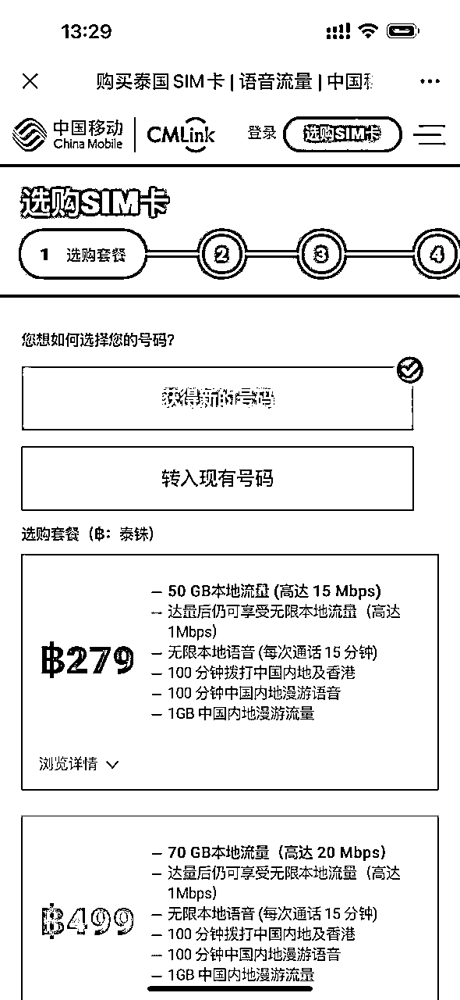

*   现金：由于注册本地银行账号较麻烦，外国游客到清迈本地大多使用现金。可以提前在国内换好少额泰铢（这里有防坑指南：招商银行不提供泰铢，建议工商银行或者中国银行，提前两天准备预约）以备从机场到酒店的打车或开始的吃喝基础开销（机场汇率较低，可以换少数），到当地后再寻找汇率较好的地方换泰铢（大部分地方只接受现金兑换，部分可用微信和支付宝兑换的兑换店的汇率较低且有最低的兑换额度要求，所以建议带够人民币现金）

*   衣服：夏季衣物再加一些外套，可以参考温度历史，清迈的冬天也不是那么冷，加件外套就够了（如果要进入一些寺庙景点，女性不能穿短裙，男性不能穿短裤）

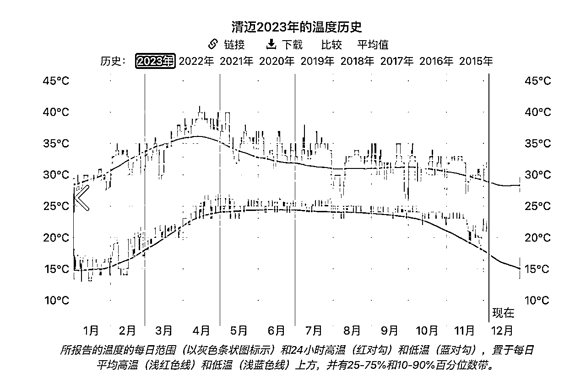

*   电子设备类：包括电脑、手机、充电宝、耳机🎧、各种数据线等（泰国没有共享充电宝，因此出门玩一天下来很有可能手机没电）

*   插线板和转接头：这个看个人需求，我个人长期远程办公，经常要背着电脑到处跑。而且电子设备较多，假设要一晚充完，会比较有压力。另外，泰国的插头，国内的两孔的都可以用，可惜我的插线板是三孔的，才需要另外携带转接头过去；

*   晴雨两用伞

*   护照、英文行程单、酒店预订证明等

*   便携拖鞋（看个人，大部分酒店其实也提供，但是我倾向于使用自己的，而且我当时还要去参加vipasana内观课程，这个内观中心是不提供任何纸巾、洗浴用品以及拖鞋之类的，所以我都全程携带自己使用的东西）

*   个人洗漱用品

*   个人旅行境外保险：这个看个人，我相对风险意识很强，在境外，我说不清楚会有什么意外发生，倾向于考虑到最差的情况，提前做好应对措施。

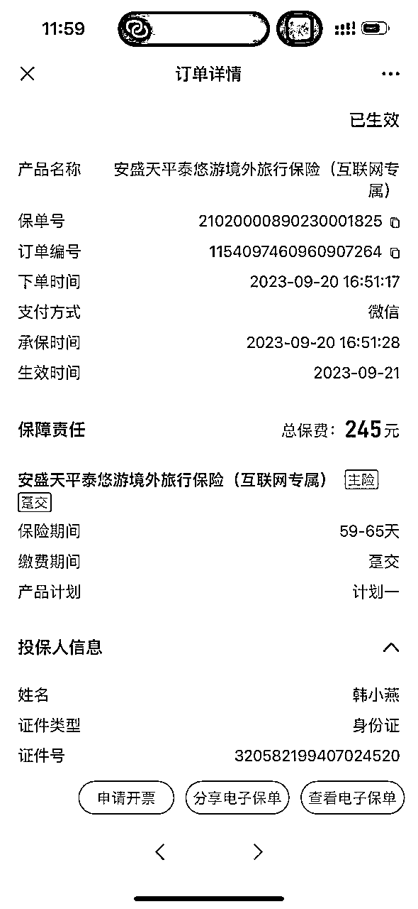

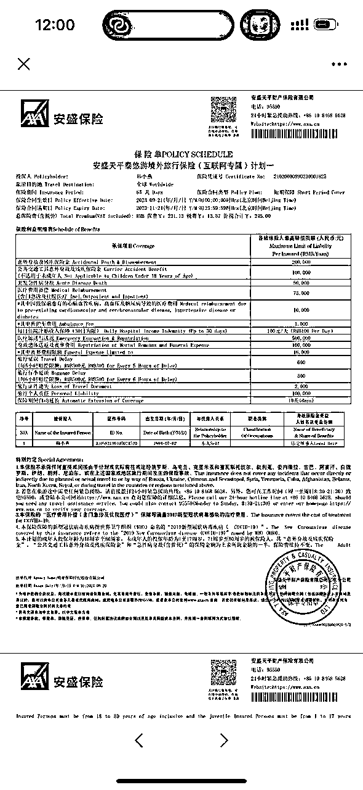

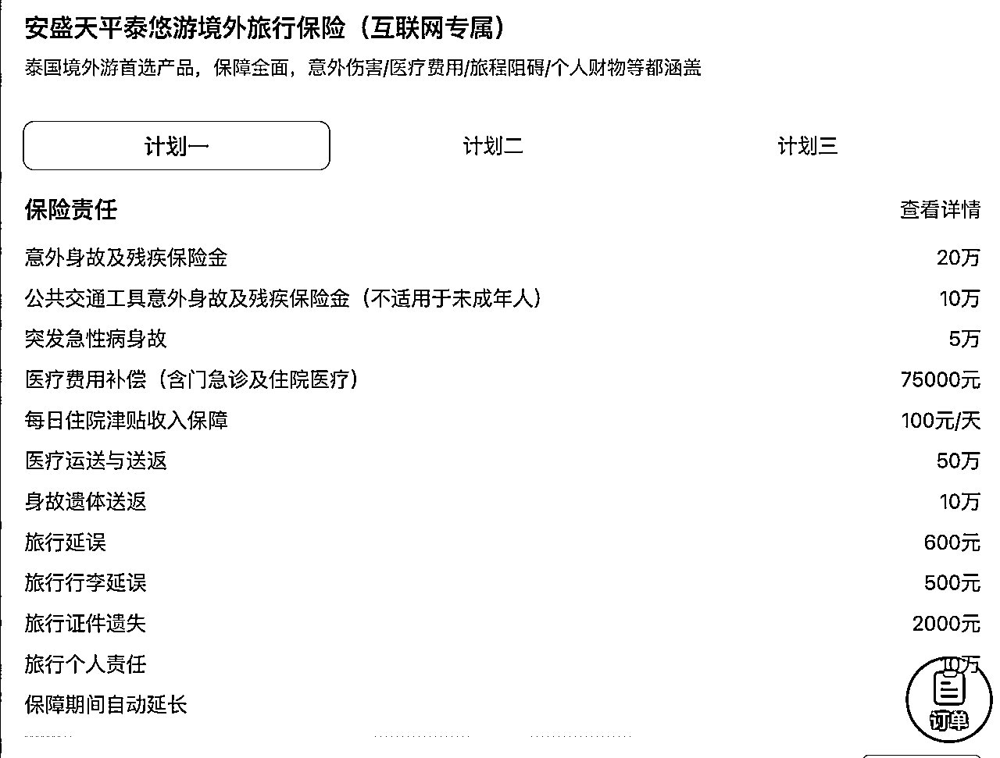

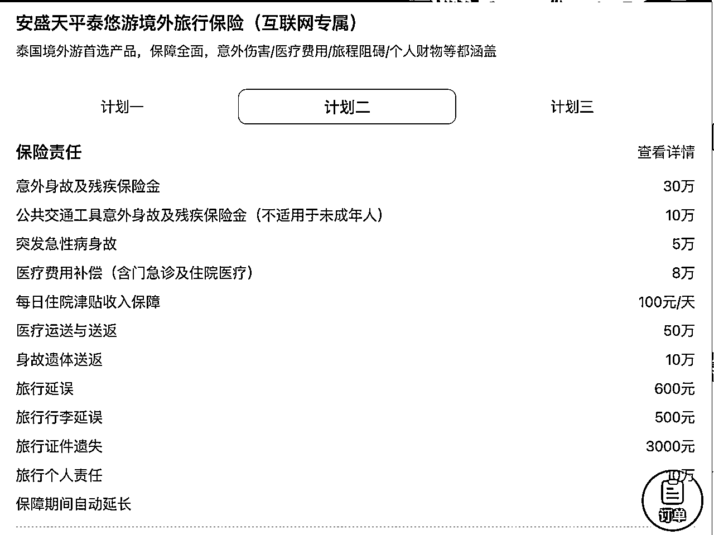

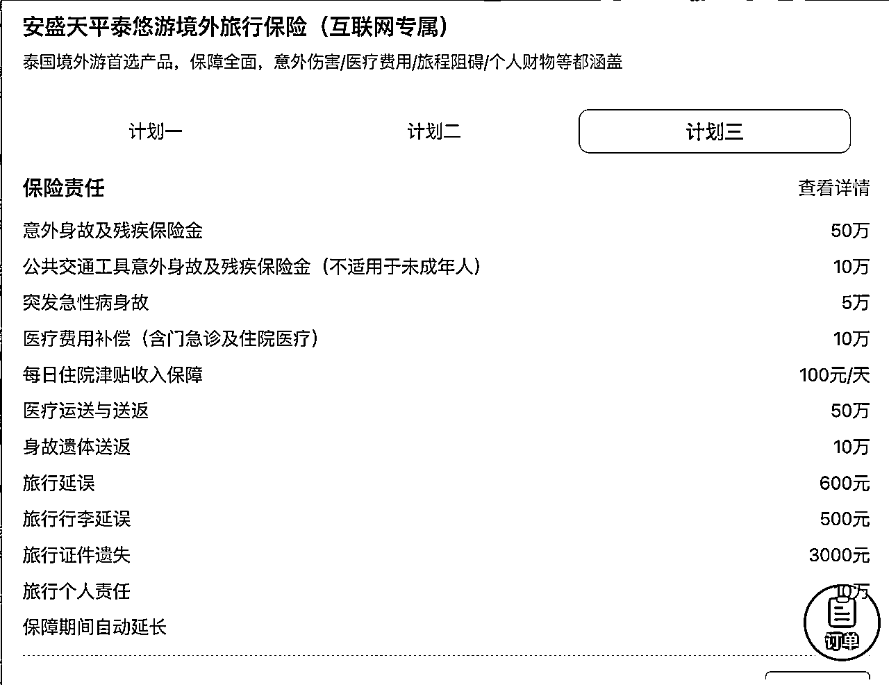

这是我自己选择的旅行意外险，我自己选择的是计划一，保费是最低的那一档。大家自己在选择的时候，可以多对比下，因为泰国的摩托车的意外较多，所以最好能够看清这种交通意外的赔偿责任。注意点在于一定要在出境之前买，如果人在境外后才买，是不包含赔偿责任的。

## 提前下载的App

*   Google Map：除了导航，我自己在国外找餐厅、按摩店等，都通过这个软件，也有大众点评的功效

*   Grab： 打车软件，也可以点外卖等。可以用泰国手机卡注册，可以绑定信用卡扣款

*   Bolt：打车软件，可以用泰国手机卡注册，可以绑定信用卡扣款，性价比最高，个人用这个最多

*   Booking: 住宿软件

*   Airbnb：住宿软件

*   Line: 本地聊天软件，每个泰国人都有，类似于微信，用泰国手机卡注册即可

*   Facebook

*   WhatsApp

*   Instagram

## 泰国旅行禁忌

*   大部分泰国人因为信仰观音文化，不吃牛肉

*   泰国人不吃狗肉

*   不能够摸泰国人的头顶，因为头顶是灵魂所在，如果摸了头顶，灵魂会被人带走，或者带来厄运

*   泰国整体其实没有小费文化，但是如果要给小费，就要给纸币，而不是硬币。硬币被视为是给乞丐的。如果要给小费，20泰铢是最常见的。

*   泰国王室在泰国的地位很高，之前有一个国王死了，泰国是全年禁止饮酒和娱乐活动来祭奠，所以在泰国旅游的时候，如果看到有皇室成员的头像或者图片，千万不要指指点点或者乱加评论，并且说话的时候一定要注意言辞。

*   想要进泰国寺庙参观，那么一定要注意着装，短裙，短裤和拖鞋一定要更换。而且在寺庙里面一定要对佛像尊重，不能攀爬佛像，不能对佛像指指点点，不能对佛像拍照，不能将佛像揣在兜里。

*   泰国法律规定在公共场所是不能吸烟的，这一点吸烟的朋友一定要注意，如果实在忍不住，可以去附近的吸烟区吸烟，如果是在酒店，也一定要问清楚酒店的吸烟区域在哪里，如果随便吸烟可能会被罚款等；

*   泰国和中国的交通是相反的，在泰国自驾是靠左行驶，自驾的朋友一定要注意，如果是骑摩托车，那么一定要戴好头盔。

*   在泰国旅游的时候，每天在固定的时间8点和下午6点，经常会听到泰国的国歌，这个时候一般都是需要原地立定，以表示尊重。

*   泰国人认为右手是干净的，左手是不干净的，在和泰国人交流的时候，一定要用右手拿那些比较重要的物件，左手拿可能会被他们嫌弃。

*   在泰国他们是不喜欢用红色的字体签名，因为在那里，人死后，一般会用红笔写碑文等，所以切忌使用。

# 数字游民共居空间：

## 706清迈客栈（住宿和办公一体）

706清迈客栈是由1座带花园的小院子、2个公共空间、20间客房与一群温暖的小伙伴组成，另有洗衣房、厨房、烘焙设备一应俱全。

这也是我在清迈的主要住宿地，如果你的英文不好，想要更多的和中国人在一起，这是一个很好的住宿点，而且可以自己做饭，也会有一起的娱乐活动。但是月租3000人民币左右，在清迈不算便宜，且不太能够和其他外国人互动，实现当地探索。

706清迈客栈住宿的预订细节，欢迎联系张紫姀（微信：zzh92t09）

任何关于706清迈的咨询，欢迎联系706小伙伴（微信：xiaohuoban706706）

706清迈客栈google map：清邁客棧（15/1 ซอย2 Tambon Si Phum, Mueang Chiang Mai District）

地理位置优越：位于清迈古城塔佩门（东门）的猜也蓬路（Chaiyapoom Rd.）上，距离塔佩门500米。

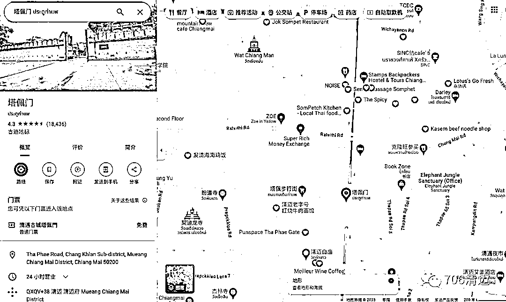

相当于大理古城洱海门（东门）的洪武路上。

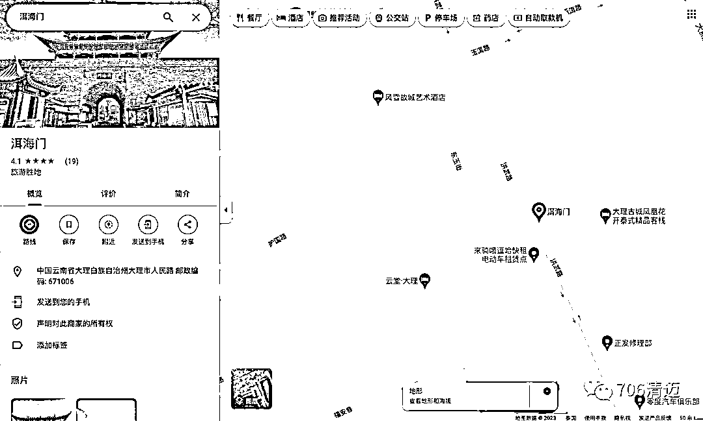

## Punspace

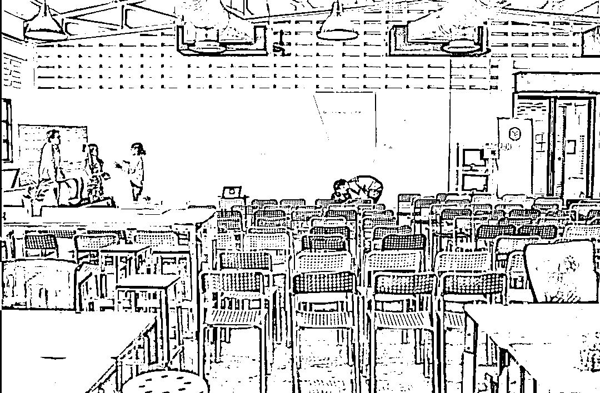

从2013年创立至今的老牌联合办公空间，老空间位于清迈老城区Wiang Kaew，靠近许多文化地标以及美食和饮品，工业风既狂野又舒适。也有玛雅购物中心顶层的C.A.M.P，吸引许多新潮人群。

地址：

7 2 Rachadamnoen Rd Soi 4, Tambon Si Phum, Mueang Chiang Mai District

官网：https://www.punspace.com/

## Alt_ChiangMai（外国人很多，也比706贵很多）

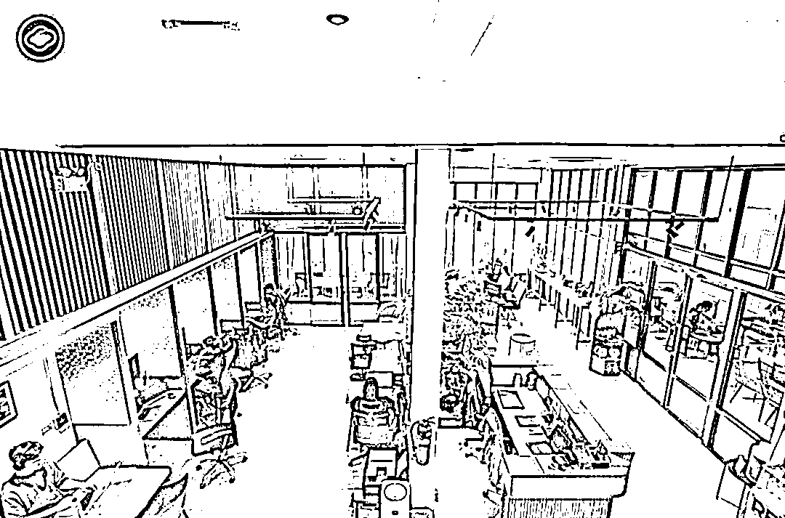

一种新型的共享居住/联合办公空间，它将优质住所与各行各业的专业人士聚集在一起，创造了一个良好的共创空间。

地址：129, 1 Intrawarorot Rd, Tambon Si Phum, Mueang Chiang Mai District

官网：https://www.altcoliving.com/

## Yellow Coworking Space

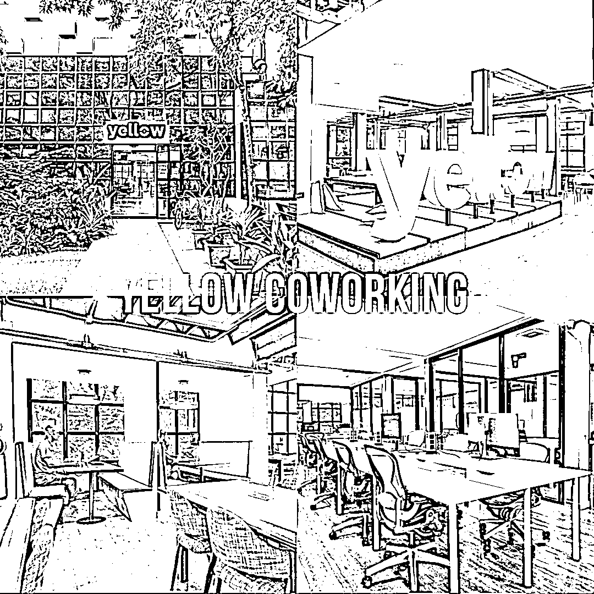

YELLOW是东南亚久负盛名的联合办公中心和 Web3 创业孵化器，有着令人印象深刻的办公场所和成体系的创业孵化平台，来自全世界的创意人才与开发者们齐聚一堂。

地址：

16 2 Nimmanahaeminda Road, Tambon Su Thep, Amphoe Mueang Chiang Mai

官网：https://www.yellowincubator.com/

## 四海社区 4 Seas

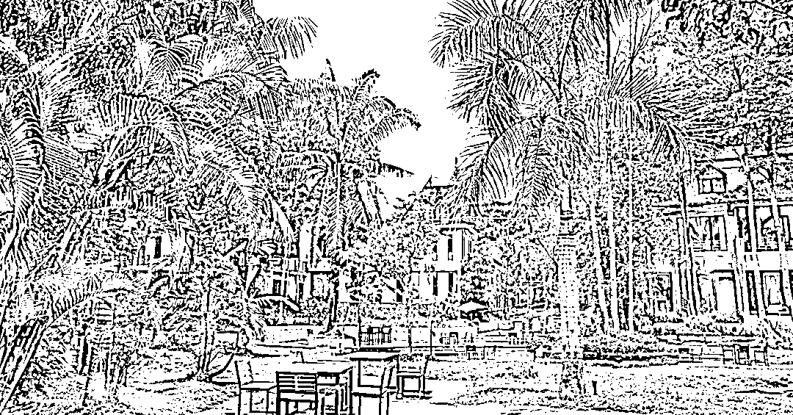

4seas 是一个加密游牧初创社区，其第一个站点位于清迈，旨在促进加密技术与创新社会的融合，为数字和加密游牧者提供理想的工作空间、生活环境和活动空间，4seas正在为数字游民建立起一个初创社会，让清迈成为加密游牧的新手村，Web3伟大航道的始发站。

地址：1269, Ban Pong, Hang Dong District（地理位置相对比较偏，不在中心地带，适合比较喜欢安静环境的人）

官方网站：https://www.4seas.io/

## Phrasingh House (非典型数字游民空间)

https://www.youtube.com/watch?v=XuXftA59qVk

视频中美国人住的guest house, 月租800人民币，环境尚可，位置也在古城附近，楼下就有小餐厅。地理位置以及对应的联系方式请见下图。在这里可以遇到一些长居泰国的小伙伴，且来自不同国家，但是社区氛围不浓，更多的需要自己去打开社交圈。

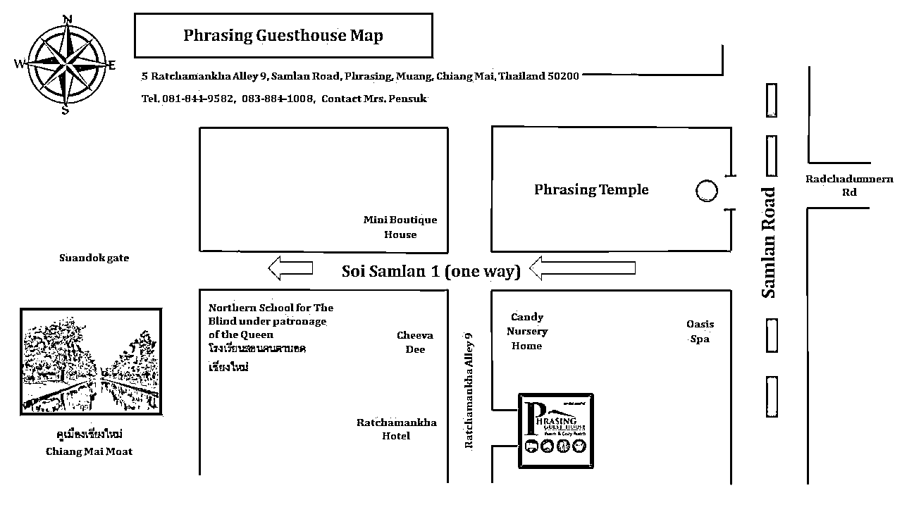

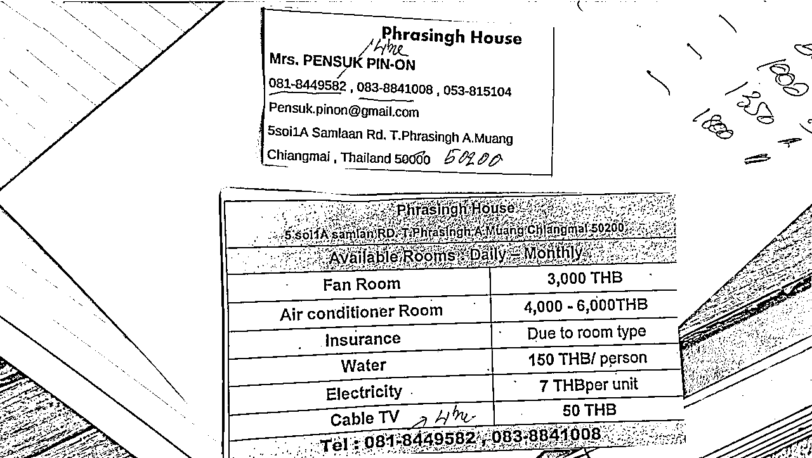

## The Social Club

国际化程度高，我自己认识的一个巴西小姐姐就住在这儿，她对其评价较高

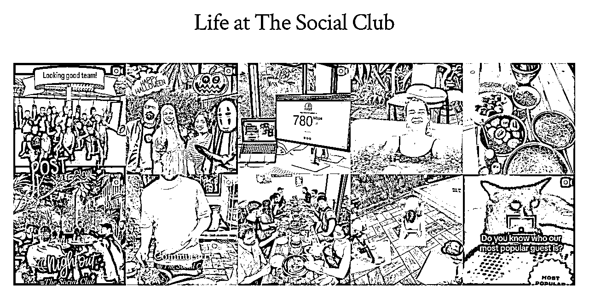

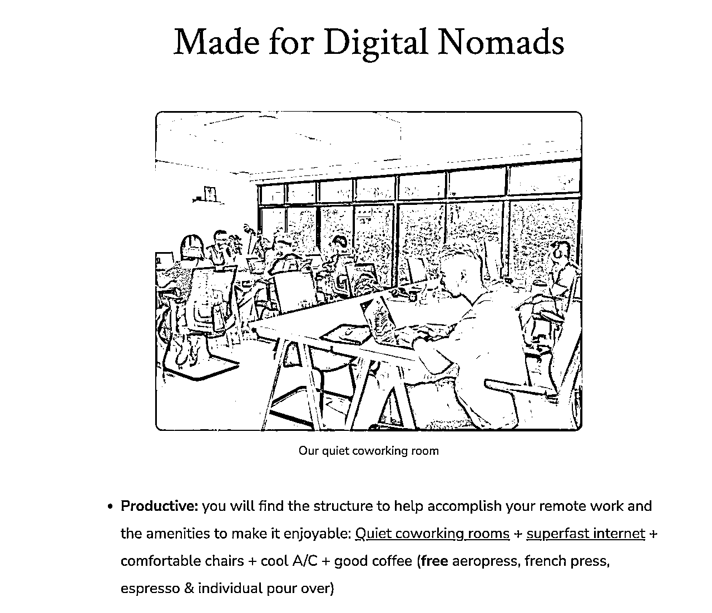

官网：https://www.thesocialclub.asia/

更多游民共居空间请参考谷歌文档：

## Facebook或者WhatsApp群组找房

参考话术：

Hi everyone!I will arrive in (目的地)in (预期到达日期)，and I would like to rent a fully furnished(apartment/house/spacious room with private bathroom) for (预计租期，例如 3 months)

A few key requirements:

Centrally or conveniently located

A functional kitchen(gas stove and necessary kitchenware)

Desk and chairs for working and dining

Relatively good WiFi(>XXMbs down)

Our budgetis between (预算租金金额) /month，would like to start with a (预计租期) contract.

Please kindly comment or DM if you have any leads, thanks!

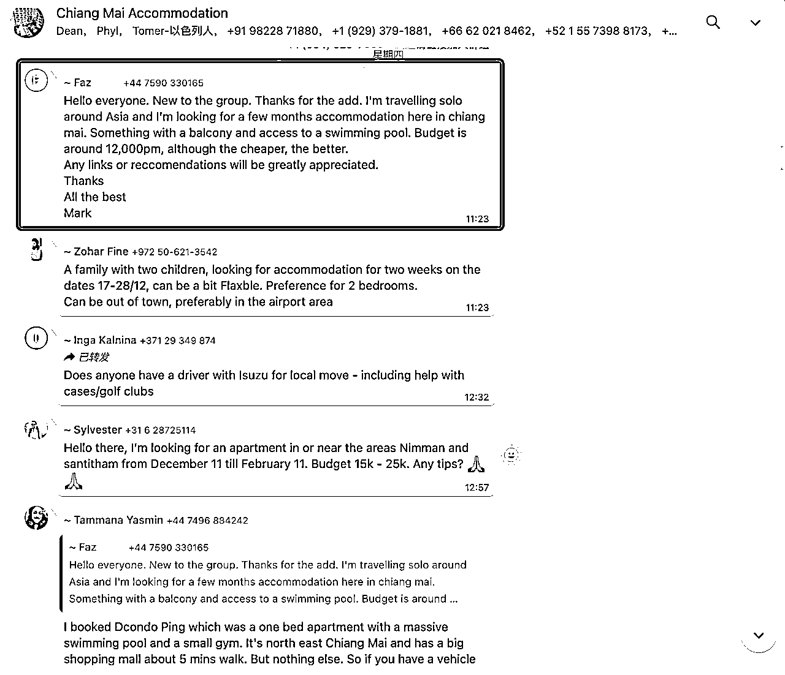

WhatsApp群组链接：

https://chat.whatsapp.com/HdSXlZHY18HHeCQ8g3PJSc

# 逛吃游玩指南：

## 清迈整体：

1.  从经典游玩；市集、美食与购物；艺术生活；自然与生态；短居与长居Tips等五个维度较为全面地介绍了清迈的旅居生活方式：

1.  若是经典玩法和交通攻略，这里倒是有一篇很不错的攻略：

1.  Lonelyplanet 经典：

Chiang Mai travel

## 餐厅推荐：

Tips: 其实可以不用推荐餐厅列表，在清迈当地直接用谷歌地图，点击餐厅，附近的餐厅就会显示在地图中，并且每个餐厅都有对应的评分以及评价详情，一般评分在4.4分以上，且总评价数高于50，都不会太差。按摩店同理，可以通过谷歌地图找到比较不错的店。关键词：massage。只是谷歌地图出来的餐厅可能会更加偏西方口味，这时可以也和大众点评上的数据进行对比。大众点评上的餐厅，可能更加符合中国人的口味。

## 出行方式：

*   推荐使用Grab和Bolt打车，都支持绑定visa卡，通常Bolt要便宜很多。

*   不太推荐双条车，不同乘客有不同目的地的时候会绕很多路；司机的英文水平有限，如果要乘坐，一定要再三确定司机真的知道你的目的地在哪里。

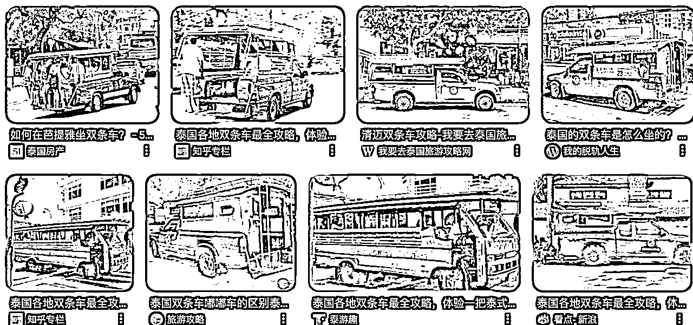

*   租山地车🚲，月租每天50🐷是合理的价格；推荐一家小店 Thai Charoen Motorbike

*   租摩托车🛵，月租每天150🐷是合理的价格；没有国际摩托车驾照的话，被交警抓住会罚款500泰铢，但可以获得3天的免死金牌（三天之内都可以继续无证驾驶）。

# 建立当地社交圈

## 飞盘

每周二及周六，下午四点到六点，在清迈大学橄榄球场。参与者有清迈大学学生、长期定居在清迈的人以及数字游民。国际化程度高。 每次活动结束后，还会一起去吃晚餐。以下视频是之前实拍：

他们也有自己的Line群组以及Facebook群组。详情请参考以下公告：

🥏 Pick-up game Tuesday (December 5) @ 4:15 PM at CMU Rugby field.

🌅 Sunset is at 5:46 PM. please come early

👕 Bring BOTH white and color shirts, and drinking water. Please avoid gray shirts!

⌚️ We would like to have as much play time as possible before it gets dark, so come early if you can, please.

Have fun!!! 😇

PS. We play rain or shine. We play every Tue/Sat even without a recent post

more info in the post below

https://www.facebook.com/groups/cm.ultimate/permalink/10157606855550367/

Line群组加入二维码：

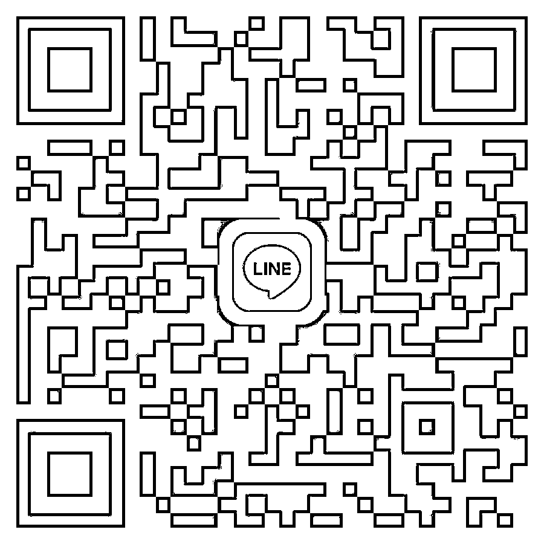

## 徒步/爬山：

定期发起和组织，每周都有活动。我去参加时，带上了我的一个朋友。结果我俩是唯二的中国人。这也是有专门的数字游民WhatsApp群组，国际化程度极高。

加入链接：https://chat.whatsapp.com/DNsbjFwsSMuIKuyuhWZ2iR

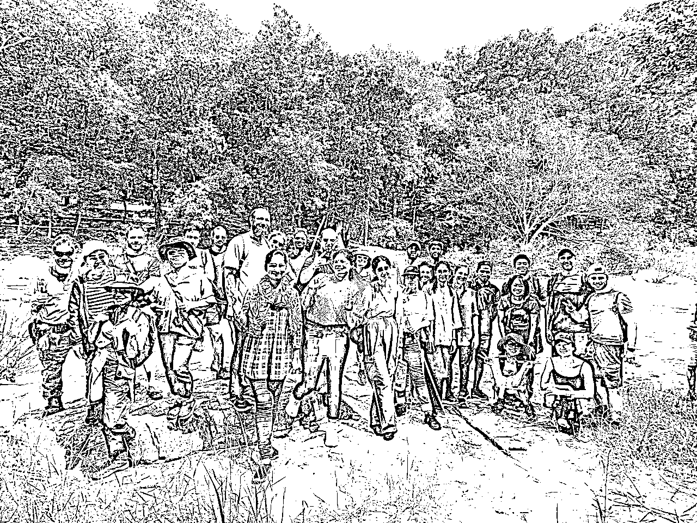

## 跨语言交流（Language Exchange）

每周二晚上七点到十二点

一般是会有贴纸，说明你的母语以及想要学习的语言。国际化程度极高。泰国本地人也会有。

地点：the moat house 顶楼酒吧

## 其他Meetup活动

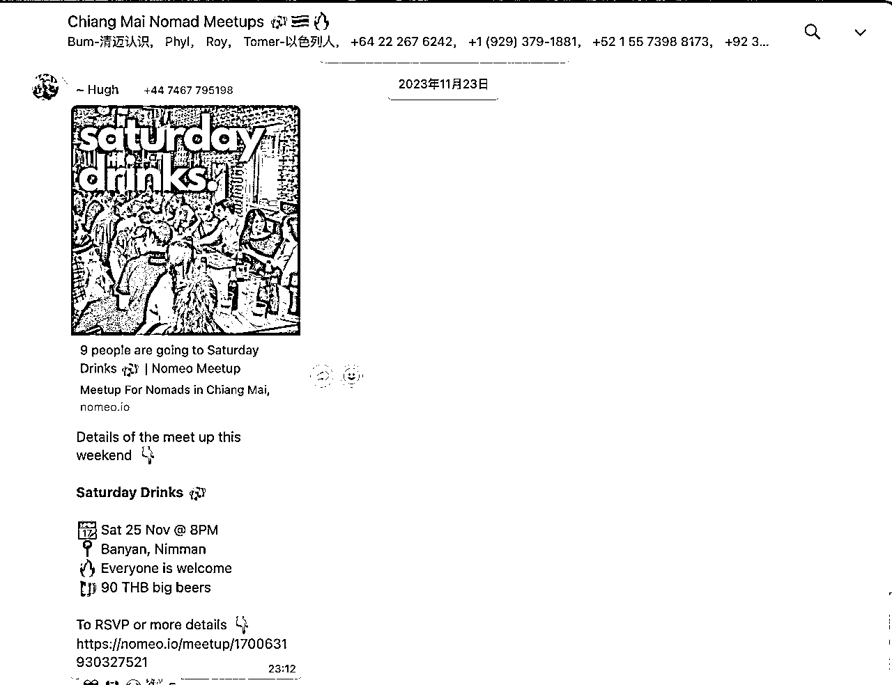

加入WhatsApp群组：https://chat.whatsapp.com/Lu103BaR6tuD012Ugcgvja

1.  你也可以提前下载MeetUp app，搜索在清迈的在地活动，就可以挑选一些你感兴趣的活动报名参与

1.  更多国际数字游民群组以及活动信息可以参考谷歌文档：

Chiang Mai Digital Nomad Hacks + Sub-Groups

1.  清迈活动信息汇总 Facebook上搜到的清迈活动信息汇总，更新及时，非常全，全英文。

# 泰国相关书籍

1.  《泰国文学简史》

1.  《泰学研究在中国：论文辑录》

1.  《泰国教育制度与政策研究》

1.  《马克思主义在泰国的传播与影响研究》

1.  《泰国电影研究》

1.  《文化人类学视阈下的泰国传统音乐研究》

1.  《缅甸与泰国跨国民族研究》

1.  《泰国北部山地民族舞蹈文化研究》

1.  《泰国傈傈族社会发展和文化变迁：整体研究与个案调查》

1.  《泰国兰那十二个月习俗研究》

1.  《保山学院地方文化研究丛书·泰北华人村：来自泰国金三角地区的田野报告》

1.  《巴蜀三国文化符号泰国传播研究》

1.  《马来西亚、印度尼西亚与泰国华人的语言问题研究》

1.  《红河学院国别研究丛书：泰国罗米阿卡人文化调查研究》

1.  《从韩江到湄南河：管窥泰国潮人社会（潮汕文库·研究系列）》

1.  《中国-东盟与中泰关系研究（第一辑·政治、文化卷）》

1.  《东南亚研究译丛：泰国研究回顾译介（2000-2013）》

1.  《泰语构词研究》

1.  《泰语外来词同化现象研究》

1.  《滇西傣族古代史略（傣文汉文国际音标泰文）》

1.  《全球化背景下的中国及东南亚傣泰民族文化》

1.  《傣泰民族研究文集》

1.  《傣泰民族民间故事研究》

1.  《傣泰民族的历史与文化多样性研究》

1.  《十三世纪傣泰语言的语音系统研究》

1.  《泰国传统文化与民俗》

1.  《一个半世纪的美国与泰国关系史》

1.  《泰国华人社区的汉语方言》

1.  《泰国优勉（瑶）族及其语言》

1.  《泰国瑶人》

1.  《泰国现代史纲》

1.  《泰国与柬埔寨史》

1.  《世界历史文库：泰国史》

1.  《泰国民间故事选择》

1.  《泰国民族国家的形成及其民族整合进程》

1.  《泰国北部的云南人》

1.  《泰国降头和巫术漫谈》

1.  《泰国史》-中山大学东南亚史研究所编

1.  《当代泰国政治》-宋清润，张锡镇

1.  《泰国谚语译注》

1.  《泰国民主政治论》

1.  《泰国政治体制与政治现状》

1.  《泰国清莱拉祜族及其语言使用现状》

1.  《泰国民间故事（一）》

1.  《泰国的三个汉语方言》

1.  《泰国北部山地民族民间美术与艺术设计》

1.  《东南亚的印度化国家》

1.  《南洋华侨与闽粤社会》

1.  《泰国华人社会》

1.  《横渡孟加拉湾：自然的暴怒和移民的财富》

1.  《中国人类学的定位与规范》

1.  《多元视角下状语与泰语谚语比较研究》

1.  《东南亚文化概论》

1.  《清代中泰关系》

1.  《探索与反讽》

1.  《信徒与公民》

1.  《逃避统治的艺术》

1.  《中英关系略史 暹罗古代史》

1.  《古代中日关系之回溯 中暹关系史》

1.  《启微·朝贡与利润：1652-1853年的中暹贸易》

1.  《贸易与移民：清代中国人移民泰国历史研究》

1.  《南海贸易与南洋华人》

1.  《晚清民初南阳华人社群的文化建构：一种文化空间的发现》

1.  《政治人类学：亚洲田野与书写》

1.  《泰国法律制度概论》

1.  《泰国通史》

1.  《泰国（第三版）》-田禾 周方治

1.  《泰国：海丝路的战略支点》

1.  《弱者的武器》（人文与社会译丛）-詹姆斯c斯科特

1.  《农民的道义经济学：东南亚的反叛与生存》（人文与社会译丛）

1.  《泰国现代文学史》-栾文华

1.  《东南亚：多文明世界的发现（讲谈社·兴亡的世界史 06）》

1.  《世界佛教通史·第十二卷：斯里兰卡与东南亚佛教（从佛教传入至公元20世纪）》

1.  《山海之间：从华南到东南亚》

1.  《东南亚女性的政治参与》

1.  《东南亚女政治领袖研究》

1.  《比较的幽灵：民族主义、东南亚与世界》

1.  《金山、南洋与离散中国（东方历史评论02）》

1.  《椰壳碗外的人生：本尼迪克特·安德森回忆录》

1.  《民族的渴望：缅北“怒人”的族群重构》

1.  《泰国支教日记》

1.  《后冷战时期美国与湄公河流域国家的关系》

1.  《西南地区海外移民史研究：以广西、云南为例》

1.  《缅甸高地诸政治体系（汉译世界学术名著丛书）》

1.  《琉璃宫史》（汉译世界学术名著丛书）

1.  《多姿多彩的清迈》 劳拉吉布斯

1.  《东南亚文学史概论》

1.  《泰国傣泐人的历史、文化认同与区域和谐》

1.  《东印度公司与亚洲之海》（讲谈社·兴旺的世界史09）

1.  《季风吹拂的土地：现代东南亚的碎裂与重生》

1.  《从逃离到归附：泰国北部美良河村村民国家认同的建构历程》

1.  《泰国概论》

1.  《泰国经济社会地理》

1.  《形似神异：〈三国演义〉在泰国的古今传播》

1.  《神猴：印度“哈奴曼”和中国“孙悟空”的故事在泰国的传播》

1.  《泰北佛教史》

1.  《南天佛国--南诏大理佛教历史与文化》

1.  《古代云南与东南亚的铜鼓文化交流研究》

1.  《东南亚宗教艺术研究》

1.  《泰国通史（珍藏本）》-段立生 （网上被推荐最多的一本书，所以我个人最先看了这本）

1.  《泰国佛教史》-段立生

1.  《图绘暹罗》

# 其他可参考资料：

## 来自中南半岛的数字游民报告

https://mirror.xyz/hydao.eth/SLxgPtTnLcILeYvIWJegSn0nyobaNZwdPWHxVtFLBOw

## 古代东南亚毗邻中国，为何走向了印度化

【伯爵】古代东南亚毗邻中国，为何走向了印度化？_哔哩哔哩_bilibili

# 作者简介：

小燕，末流985本科，19年从传统制造业大厂美的集团加入一家互联网创业公司后，从hr，运营转型到产品经理。由于公司全员远程办公近两年，因此期间在探索数字游民的生活方式。国内数字游民中心待过DNA数字游民中心，海南以及大理。泰国是国际数字游民第一站。

但是清迈旅居打破了数字游民滤镜，遇到了一些数字游民在原有的系统中遇到了问题，因此选择游民生活方式，本质上是一种逃避。这对自己形成了一种映射，因为自己选择该生活方式，部分原因是近一年和自己妈妈的关系出了一些问题，通过旅居来在外面获得能量来面对问题，这也是一种逃避。在意识到该问题后，接下来不一定完全追求旅居的生活方式，而是更加积极的回到原有系统中面对现有的问题，同时努力搞钱。

个人爱好户外，尝试过探洞、溪降、爬雪山、高空跳伞、潜水、飞拉达以及攀冰等项目。

为了解决和母亲关系问题，也在积极学习非暴力沟通以及内观冥想，也欢迎同频者链接。