# 小红书电商爆款选品逻辑分享

> 来源：[https://go6xq64elg.feishu.cn/docx/B4qjd46GIoRpUkxB6FycvfuGnJc](https://go6xq64elg.feishu.cn/docx/B4qjd46GIoRpUkxB6FycvfuGnJc)

大家好，我是曜文

今天和大家分享小红是电商爆款选品，大家都知道做电商选品占7分，如果选品不好，发再多的笔记也没办法变现，所以我把我们团队近期最新测试的方法拿出来和大家分享，希望能够给大家在做小红书电商选品方面有所启发！

在了解选品小红书电商之前我想和大家说说小红书电商的流量逻辑和来源

小红书电商目前出单90%都是来自于笔记，笔记的数据又和标题文案相关也和选品相关，如果你选的品好，这篇笔记即使内容非常差，用户也会看到你的产品而点击，其次是热门的爆款标题，之所以这个标题能成为爆款标题是大多是创作者都用过并且获得了不错的流量称之为爆款标题。

也就是说，你的选品好，自带点击，你的内容好，会得到平台的更多的推送。

为了方便大家阅读我把小红书电商选品提炼为几个板块：

1.价格

2.季节

3.人群

4.兴趣

# 一、价格

在理解价格区间选品前，我想告诉大家在我们实测了小红书电商价格选品，低客单新店前一周出单率是90%，高客单前一周出单率是50%，为什么会告诉大家通过价格来选品呢？

便于大家在自己的产品利润中找到自己合适的定位，对于新手，你想快速看到效果选择低客单是一个不错的选择。

我们先来说低客单，低客单区间是9.9-19.9，有着20%左右的利润空间，如果你想通过价格选品，你只需要确定类目后打开小红书的商城，选择此价格区间的产品，进行筛选即可。

（在这里提一句选品尽量围绕着女性选品，价格低的女性产品有什么，我们通过数据工具查阅一下即可，例如：发夹，卷发棒，挂件，饰品...等等之类）

我们拿发夹来举例：

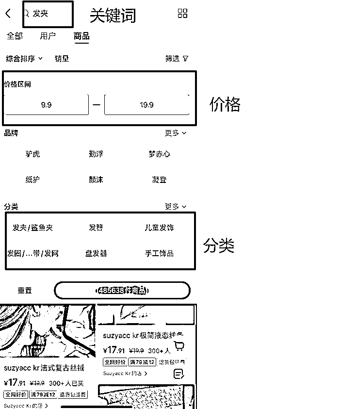

然后我们开始在商城找相关的品，通过我们的实操，直接告诉大家几个选品标准

1.销量

月销量大于1w多家店铺都有销售，得出这个品为爆品，拥有很多爆款笔记。

近期销量100-500店铺少于5家销售，得出这个品为近期爆品，少量商家在发送笔记获得流量。

月销量1000-3000且不超过3家销售，得出这个品为少量自有货源品，或者投流产品。

（通过以上标准我们点击店铺再来到账号的笔记数据做分析）

2.笔记数据（数据为选品实测参考）

笔记发送数据近7天销量1000+爆品率为80%

笔记发送数据近30天销量10000+爆品率为50%

笔记发送数据近90天销量为10000+爆品率为20%

怎么理解呢？

笔记7天爆款可以理解为这个品对标店铺7天内的销量，证明是近期爆品，根据平台逻辑，爆品推送几率更高

笔记30天爆款可以理解为这个品在之前爆过，如果不是季节性的品，可以考虑跟品，因为小红书爆过的还会再爆

笔记90天爆款可以理解为，这个品爆过，但是时间周期太长不稳定因素较多，爆款率下降，需要自测笔记数据

有了以上的数据我们对于产品就会有更好的判断力，接着把数据做为参考，就可以选择单品，通过其他平台对比来找到适合的单品爆款。

接着我们讲解高客单价的产品，高客单价的产品我们定为200+到3000+

高客单的价格产品销量不会太高，销售区间在100-1000左右，更多的我们是看款，这个款有销售数据，证明小红书的笔记有被推流过，选品可以参考款式，再对比店铺笔记的数据来进行测试即可，高客单在小红书销售数据没有太多对比参考，就不做案例分析，更多的是结合自有产品，或者其他平台卖爆的产品，拿来小红书参考爆款选题进行内容布局变现。

# 二、季节

季节类选品可以理解为：春，夏，秋，冬季节类产品，再覆盖到大类目里面，同时也会出现某个类产品只能做一个季节。

我们拿最简单的水果来举例，如果你做季节选品你应该要知道什么季节产出什么水果，在刚上市的时候提前布局。

例如：目前季节上市的是脐橙

我们来到小红书商城看到脐橙数据也是符合上述标准的

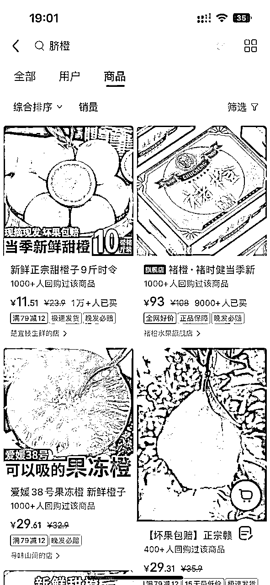

如果不知道自己行业什么季节出什么品为了便捷的有个大概的上市时间还可以借助AI来得知

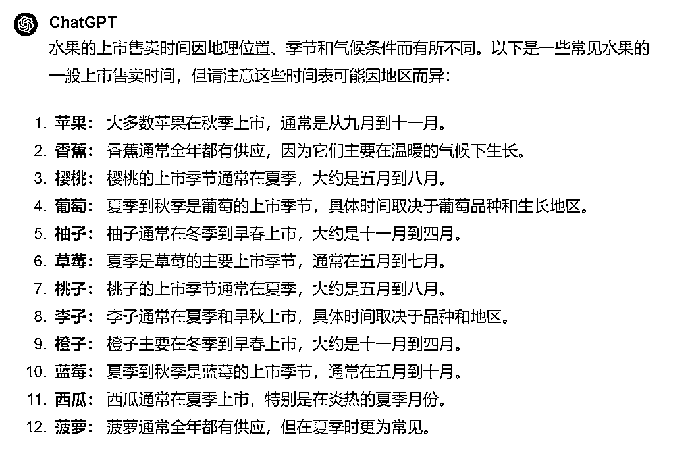

如果延伸到百货类目，可以夏天卖风扇，冬天卖暖手宝....等

根据每年的热卖产品和后台数据来做到及时跟品抓住爆品的机会，当然，往年的季节选品也可以参考

比如，暖手宝，去年也卖今年也可以卖，他们只是款式不同，我们可以从商城看到对应的数据，符合及时跟品上架也能获得不错的销量。

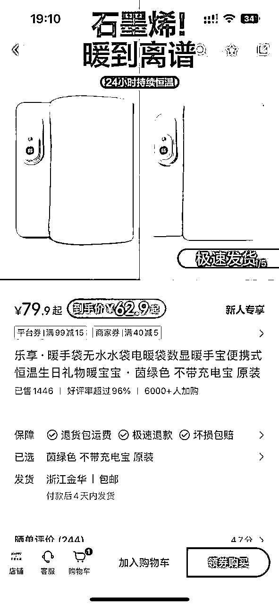

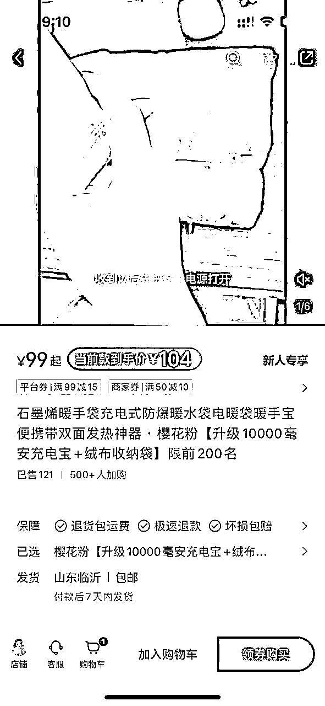

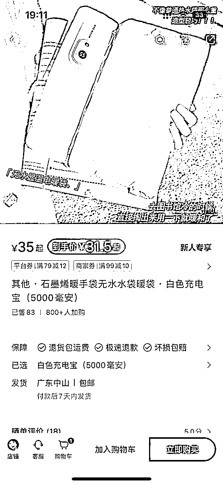

（注明：爆款率和周期和笔记账号权重有关系，图1是一周内卖了5000单，如果在这一周内跟品虽然没办法卖出5000单但是几百单也是可以实现的）

# 三、人群

人群选品我们需要先找到小红书热门的人群，例如：宝妈，上班族，学生党..等等

如果你在小红书卖一些中老年用户群体的产品那么即使他在其他平台是爆款，在小红书也不一定能出单，要知道，小红书的用户人群，适合的产品，要么有颜，要么有价值，要么符合上述人群场景。

好，我们继续分析

思考一下宝妈会需求什么产品

上班族会需求什么产品

学生党会需求什么产品

如果不会看数据，不知道什么品好，我们结合价格选品再来到小红书搜索关键词，因为小红书有一个热门关键词的标签以及下拉词，我们可以通过近期热门标签来找到近期的热门选品来实现我们店铺的销量增长！

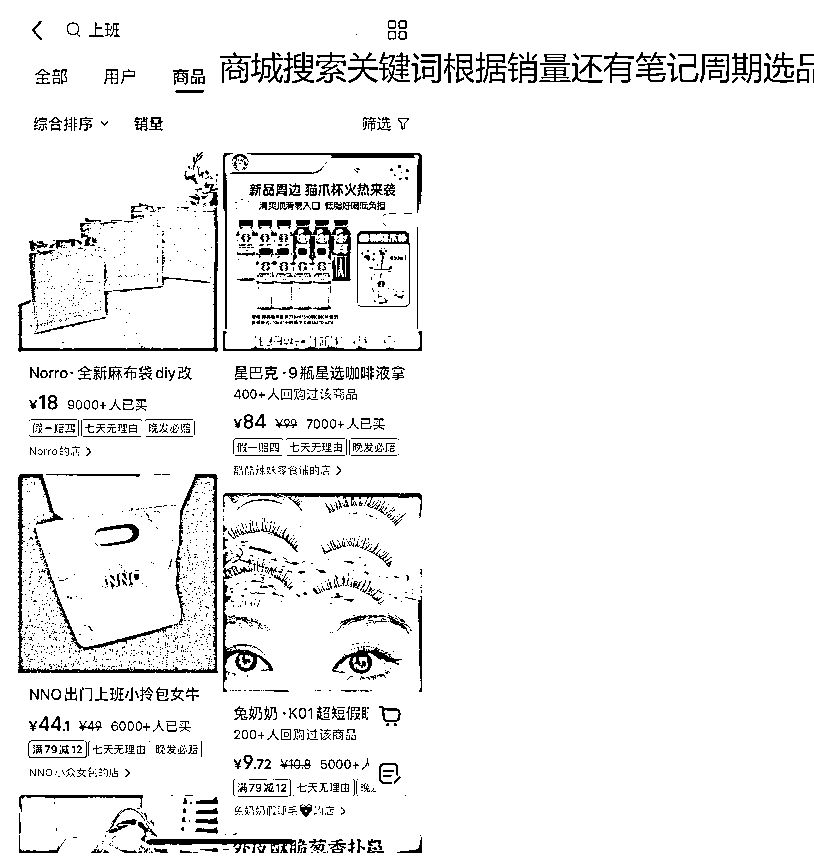

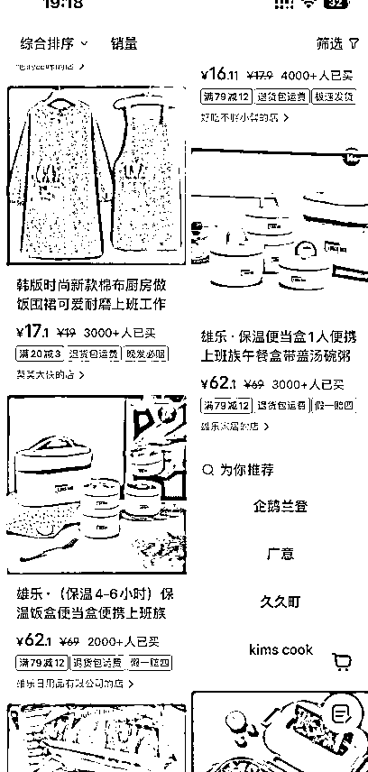

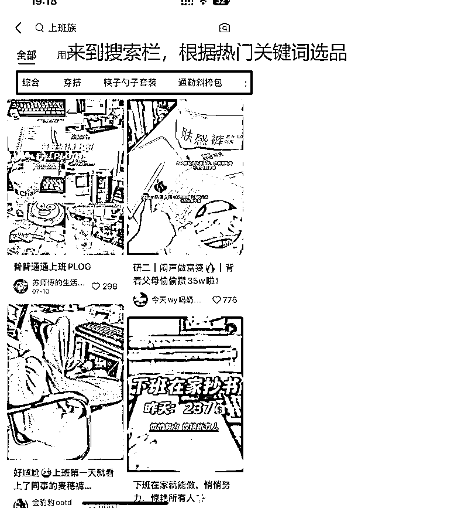

然后我们再做数据分析，找出哪些笔记是近期一周热门，找出哪些商品是符合我们上述讲解的标准数据，然后就可以开始测试笔记热度，笔记数据如果1000+以上，证明这个品还不错，如果有人在卖，还没有大爆款，可以抓住机会~

# 四、兴趣

兴趣选品分为两个维度

1.用户兴趣，用户有什么兴趣喜欢什么产品

举个例子来说，有些用户喜欢潮玩收藏，暴力熊、挂画、潮流类的收藏，这就是用户的兴趣

2.自身兴趣，自己喜欢做什么类目的产品

举个例子来说，有的商家喜欢追爆款，有的商家对鞋服情有独钟，有的商家喜欢手串，在自己的兴趣领域里面能够得到一些当下行业的爆款产品。

得知用户兴趣我们还是可以用工具来看兴趣热度，在某个细分领域里面研究用户的需求，然后通过小红书本身平台来看到笔记的热度，如果一个产品非常多的人在发，他们的赞藏评又非常的高，然后我们再商城看这个产品销量又不是特别高，就可以判断这个产品大多是用户都感兴趣。

例如：

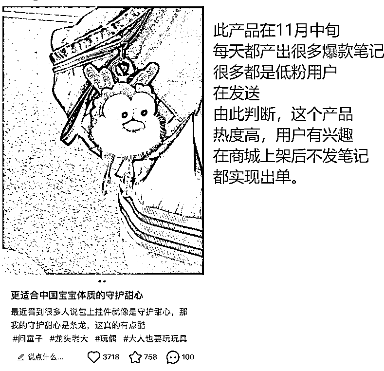

自身兴趣选品

就拿我自己举例我做了很久的鞋服领域，当季有什么新款我都能在第一时间得知，具体的得知来源于穿搭和品牌方的一些预告，这个领域里面每年厂家生产的款，或其他电商平台正在热推的款都能拿到信息，正是自己感兴趣所以才会关注，所以拿来小红书电商选品上会具有优势。

另外，我还有兴趣研究小红书的热门赛道的选品

通过数据工具搜索关键词

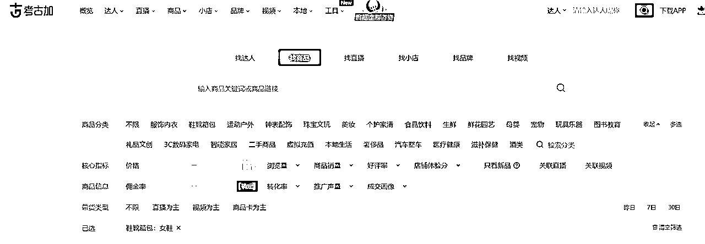

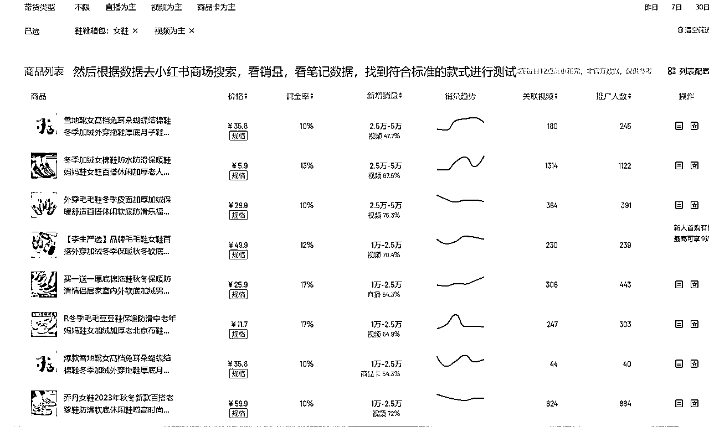

当然，兴趣类两者相结合来选品，再根据上述提到的选品数据标准来判定这个产品是否值得测试。

# 五、最后

其实，可以把几个选品方式记录下来，把这些选品方式都互通然后提炼出属于自己的选品方法论

当然，也是离不开持续的操作复盘和总结，只有自己亲身动手实操才能发现更多选品上面的技巧

以上就是我近期对于小红书电商总结出来的精华，希望能够对大家有所帮助

选好品，做好内容，在小红书持续爆单!!!

# 六、附带视频讲解