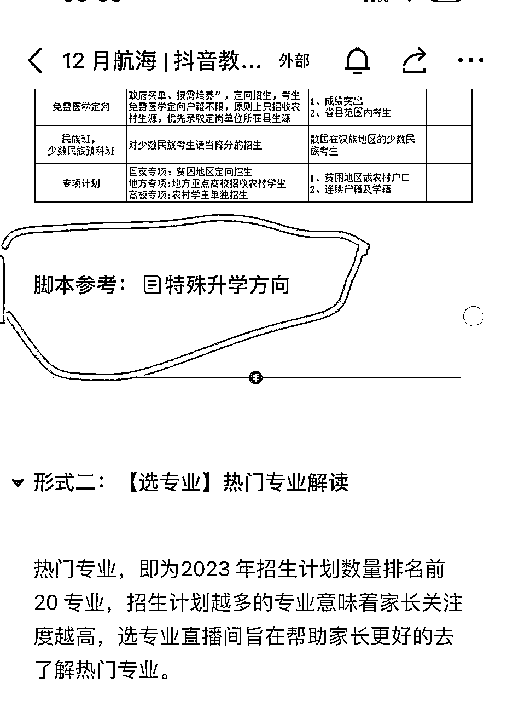
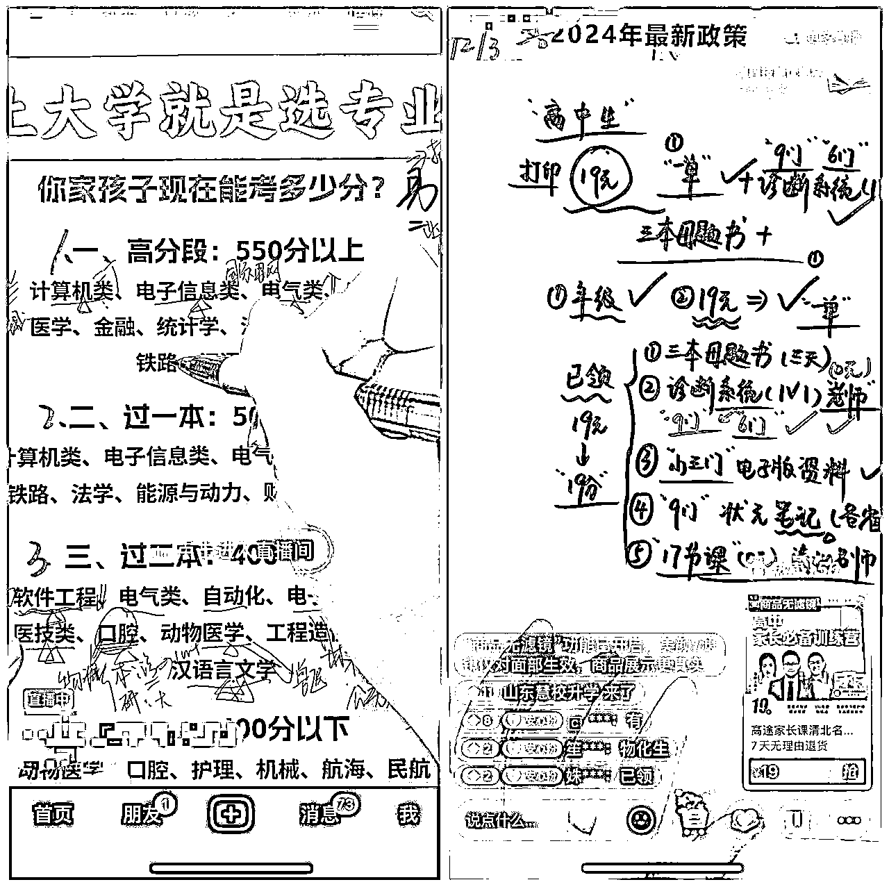
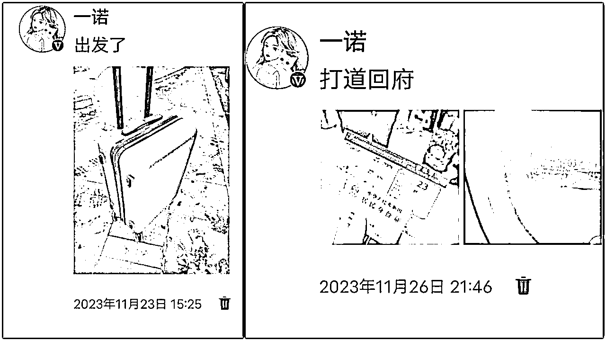
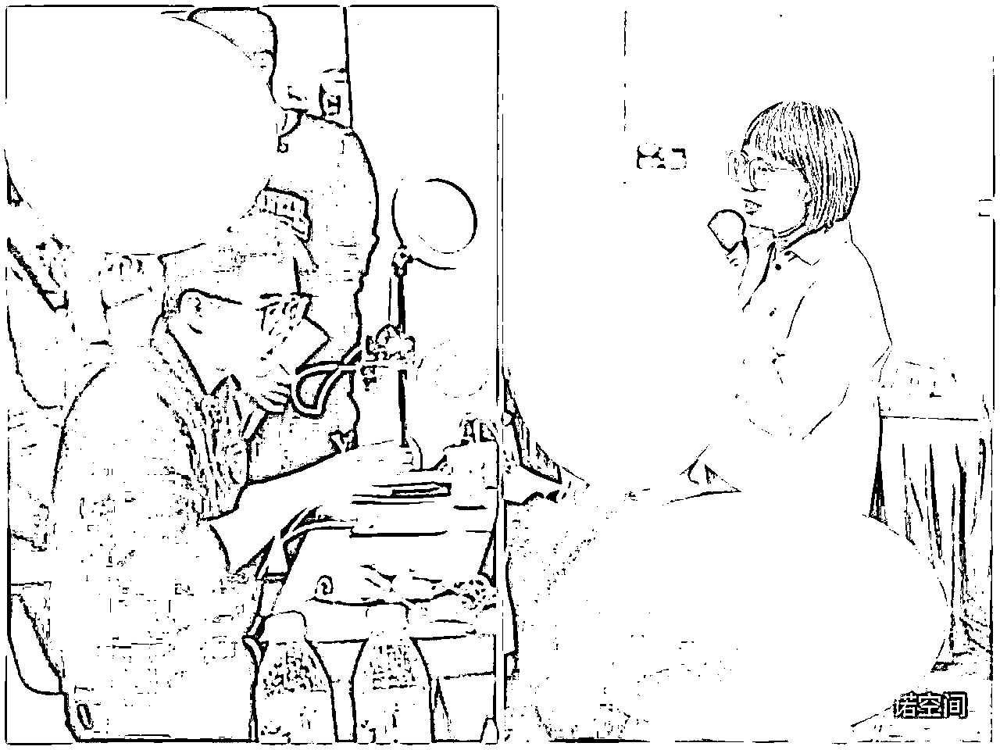
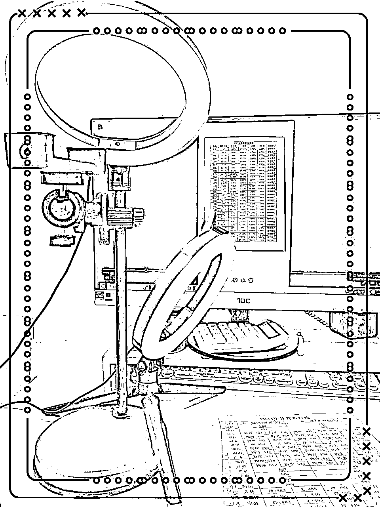
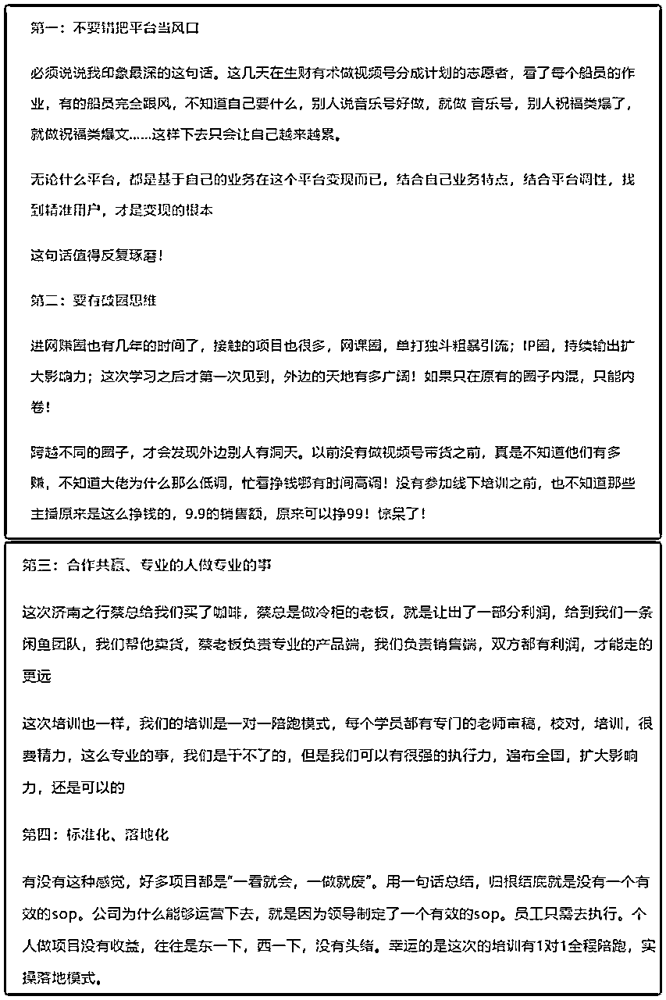

# 线下6980的项目（抖音教育直播），终于开航海了~

> 来源：[https://hiac6nj36g5.feishu.cn/docx/WqLad8zxboSAkUxuk6wcbjmvnBh](https://hiac6nj36g5.feishu.cn/docx/WqLad8zxboSAkUxuk6wcbjmvnBh)

生财有术2024年首次航海1月5日开船，昨天开始报名了，这次你报名了哪条船呢！

我报名了抖音直播（教育）这条船，不仅报名了船员，还报名了领队、志愿者！如果能再被选上，多一份热就多发一份光，如果没有选上，就安安静静的做个船员尽情的享受整个过程！

也许你会问我，为什么这么热衷这条船，那咱就来了解一下这个项目吧！

# 项目介绍

抖音教育直播具体是什么项目？

初看这条船，你是不是和没有做过线下培训之前的我一样，一脸懵逼，一脸抗拒！我不懂专业知识，我没有做过K12的老师、我不能出境直播，我社恐，我不行……

如果你也这样，那咱俩还真一样，我一开始也觉得自己没有基础干不了，学过之后才恍然大明白：零基础也能干，并且老师说：越是零基础越好做，因为不会受原有知识限制，不会自己乱发挥，更能按照老师的要求，符合抖音的规则做事，更容易成功！

悄悄的告诉大家，教练把脚本都直接给大家插入了航海手册，几乎可以不带脑子的参加！

接下来，咱就说说“抖音教育直播”这条船到底是做什么的！

用一句简单的话介绍：抖音教育直播，是一条升学规划垂直赛道的教育直播，主要是通过手播的形式（无需出境），按照脚本话术，进行专业知识输出，最终带货：小课包、书籍、志愿卡等产品，实现变现的过程！没有淡旺季，只有旺季和更旺季，平时带小课包，高考之前还可以报考！

信息差：通过带货19.9的小课包，一单利润能达到60-100！（不要过于惊讶，也不要觉得我手误打错了，就是19.9的课程，能挣到60-100）

直播场景展示：

项目介绍完之后，再讲讲我的济南之行，最后再说说我为什么推荐这条船！

# 济南，我来了

## 初次了解高考规划师

在去济南之前，我就对高考规划师有所了解，因为有亲戚家孩子去年高考，报考花了5000（如果我当时会报考，是不是这5000就是我的了，嘻嘻），这让我意识到高考规划师绝对是一个利润空间非常大的行业，只不过当时并不懂，觉得一定是专业人士才能从事，所以一直没有涉足，直到遇到Lemon！

认识Lemon是在一条闲鱼团队，我们都是高级代理，她最开始也是做闲鱼项目，后来转型做了高考规划师！

因为我们“一条闲鱼”团队一直都是内部非常和谐的团队，大家平时都会交流一些引流方法，运营技巧，有好的项目也会互相分享，一次交流中，Lemon和我们分享了线上做高考规划师的前景和她收入状况。

这真的惊到了我的下巴，再一次意识到：隔行如隔山的道理，原来网上卖的19.9的课程，一单利润居然能达到60-100！一整个大震惊😱，所以在她组织线下培训的时候我毫不犹豫的去了！

## 网上规划师的前景

目前市场上主要存在一种现状：现在机构会报考，但是并不了解网上运营方法，线上机构会运营，但是对专业知识了解的比较少！

所以，针对目前这个状况，抓住线上和线下的信息差，普通人也可以入局线上规划师项目，主要考验的其实是直播能力！

线上直播间：小课包，教辅图书，志愿卡，课程等

线下引流后：志愿填报，多元升学规划，这些都是高客单！

所以，这很有可能是一次线下，线上相整合的机会！即便不会做线下，到了高考旺季，也能赚到一笔不错的收入！

## 学习过程

三天两夜的学习，脑子的cpu都要干烧了，印象最深的一句话：不要错把平台当风口，仅仅这一句话，都值得跋山涉水来济南。

第一天上午：主要围绕的现状和发展趋势进行了讲解。了解了柠檬姐如何一步一步从闲鱼无货源电商做到规划师的历程。

第一天下午：讲了抖音的底层逻辑，讲了直播的算法，“知其然，更要知其所以然”，以前在视频号直播，感觉就是视频爆了，直播来承接流量，也不管自己在说啥，反正不冷场就行，这次听课之后才恍然大悟，原来一切都是有底层逻辑的。

第一天晚上：亲自观摩了侯老师的在线直播，现场观摩，印象一目了然，第一感觉就是：原来搭建直播间并没有那么难！这个没到现场的时候感觉好难啊,真的要现场感受才知道！

第二天上午：拆脚本，这是让人想睡觉的一个上午，脚本拆解太枯燥了，就像文化课一样，虽然重要，但是真是枯燥，还必须学！

第二天下午：自己练习拆脚本，此刻的感觉：书到用时方恨少，唯一能拆出来的就是：拉互动，其他还需要再多多练习

第三天上午：如何做好科学复盘，又是茅塞顿开的一个上午，原来这样！！！！！！

第三天下午：未来发展规划，如何一步一步做好变现路径和多元化发展……

# 推荐理由

## 1.客单价低、利润高、容易成交

这一点我强调了好几遍，这就是信息查吧！以前认为19.9元的小课包顶多能挣10元，没想到居然可以赚到60-100！

19.9一杯奶茶，一包烟的价格，家长不会过多考虑，比较容易出单！

## 2.Lemon老师带队，值得信任

我是线下进行了三天两夜的学习，真真的见识了老师的专业能力和在抖音平台做高考规划师的运营能力，这一点毋庸置疑！并且没有高高在上的架子！

有做此赛道的朋友，一定要链接一下，也许能碰撞出更多的灵感！

## 3.投入少，产出高

有些项目可能操作需要投入一定的的时间或者金钱，比如做视频，实拍在没有起号之前，厂家不会给邮寄样品，需要自己购买！闲鱼无货源电商，在客户咨询的时候需要随时回答！

相比于其他项目，该项目每天花的时间都是固定的，一场直播大概在1-1.5小时，一天播几场自己做主，看你想挣多少钱！

基本投资在100元以内，不需要投流，只需要手机、补光灯、手机支架等一些简单的设备，直播时间也是固定的！

以下是我的装备，总计投资：57.96元

## 4.存在认知差，有一定壁垒

在线下经济不断下滑的今天，很多人转移到线上，带货、直播变得非常内卷！但是知识赛道抖音知识直播的看播时长增长 165%，且超过 55% 的抖音教育兴趣用户有相关购买行为，其中小课包占比最高。

而且很多外行，觉得一定要很专业的高考规划师才能做这个项目，不敢轻易入局，相比于其他行业没有那么卷！

## 5.这不只是一个项目，还是一份事业

在济南线下学习的过程中，感触最大的一句话就是：不要错把平台当风口

在生财里，从来不缺项目，但是可能缺的是变现的能力，项目多有多的好处，同样也有劣势，乱花渐欲迷人眼，大家可能更适应短频快的项目，而没有考虑到，其实我们想要的是一份事业

每天跟着平台到处改项目，真的越做越累，以下是我学习后的感悟，可以参考！

## 6.旺季之前，提前布局

高考规划师变现方式除了卖小课包、志愿卡、书籍等，还可以线下报考做学习规划！我们平时卖的小课包是给机构卖的，挣的是佣金，但是客户是可以引流到私域的！

转过年，就进入了旺季，大部分家长都开始着手准备，六月份线下报考更是供不应求，线上，线下相结合，前景一片光明，如果没有报考经验，即便把粉丝卖到当地机构，或者和线下机构合作也是一笔不小的收入

## 7.可以为自己家孩子报考

都说一技在手，吃穿不愁，咱不用那么多，至少可以给自己家孩子报个考，省5000元呢！如果那些不行，咱们至少在给孩子选择报考规划师的时候，让老师看到你的专业，更重视你的孩子！

## 8.体会一下A+志愿者的服务

这次志愿者报名，我又报名了志愿者和领队，如果有幸成为志愿者，可以和大家一起冲起来了，你也可以来体会一下A+志愿者的服务！想了解我的服务怎么样，可以看这篇精华帖！

https://t.zsxq.com/154JoIeL0