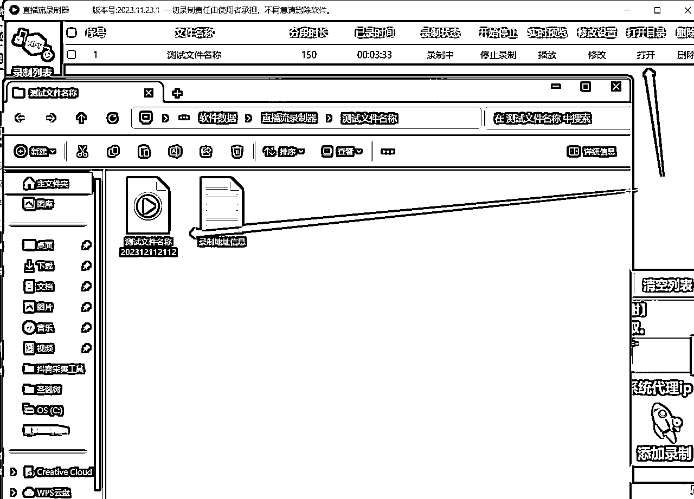

# 【生财有术分享】抖音直播录制搬运小红书

> 来源：[https://ibimo1rg20.feishu.cn/docx/D93Kd24RXoekhWxWJgMcfQC8nNf](https://ibimo1rg20.feishu.cn/docx/D93Kd24RXoekhWxWJgMcfQC8nNf)

之前看书豪分享了把抖音的品截流到小红书开无人直播，根据文章内容摸索了一下，目前已经可以正常使用相关软件录制好搬到小红书，就是小红书直播的画面太模糊且容易卡顿（应该是电脑配置不太够的原因），拿了两台电脑连接同一网络会更卡，还在想办法看怎么样可以做到后续多开，多账号测品，下面可以根据我摸索的流程来进行抖音直播截流，选品这块大家任意去选，主要看操作。

# 一、涉及工具：小红书直播助手、江小二工具箱、OBS软件

1.小红书直播助手网页：https://www.xiaohongshu.com/zhibo/robs

根据网站去下载软件，下方有个去OBS开播，这个后续会用到，先把软件下下来

2.江小二工具箱网站：http://shipindata.com/【附加工具使用教程： 】

根据自己的选择，找一个网盘去下载

3.OBS软件

这个可以随便百度搜索，看到这个图标的下载就行了

三个软件下载后打开的界面是如下三张图（图一：小红书直播助手、图二：江小二工具箱、图三：OBS软件）

# 二、选定好抖音直播间开始录制直播间内容

1.复制直播间地址；2.设置好直播间相关，比如清晰度我一般都选原画，弹幕和礼物特效也选择屏蔽，这样录制下来的直播间内容也会比较干净，大家根据自己需求设置就行

设置好后就可以直接复制直播间地址到"江小二工具箱"，先把【万能网页嗅探器】【直播流录制器】点击下载升级

下载后打开【万能网页嗅探器】按照图下的1、2、3步骤，点击【嗅探浏览器】点击"粘贴地址并打开"，或者直接往白框内粘贴地址并点击"打开地址"，等直播间打开了也可以在这设置上一步相关内容，分辨率、弹幕、礼物特效等，检查一下界面没有问题就点击左侧【嗅探结果】，将最下方绿色的地址复制下来（如图二）

这里有个插曲，之前我用另一台电脑嗅探地址的时候他出现了两个地址一长一短，我根据教程复制了最下方绿色短的那个，结果根本录制不了，后面咨询了其他人才知道要复制长的地址，如果你们在嗅探地址的时候也出现短的地址，记得选择很长的绿色那个，还是多尝试多测试多上网搜，很多东西你摸索就会有答案的

复制好后，打开【直播流录制器】，将地址复制到空白框内，同时设置录制时长，这个时长我一般录制150分钟（2个半小时），文件名大家根据自己录制的内容随意更改，这样录制后也好辨别是什么素材，设置好后点击右下角【添加录制】

添加录制后，检查一下已录时间是否开始计时，以及最下方的绿色字体是否有显示"正在录制数量1"，如果还是不放心有没有录上，这时候可以点击录制内容内【打开目录】下方的"打开"，他会将你录制的文档打开你就可以双击选择看到是否录制成功

# 三、素材录制完毕，连接小红书直播助手进行无人直播

1.素材录制完毕

点击【停止录制】—打开目录【打开】，找到素材，拉入剪映后开始识别字幕，根据字幕搜索功能搜一下相关关键词，看有没有违规的关键词，有就删点或者处理一下

2.手机打开小红书，选择【+】，点击下方【直播】，进入后点击上方【电脑】，就会出现一个有6位数字验证码的界面，把6位数字验证码复制下来，打开小红书直播助手网站https://www.xiaohongshu.com/zhibo/robs

把手机显示的6位数复制到白框内获取【串流秘钥】，复制后得到一串串流秘钥再次点击复制

打开OBS的界面，点击【设置】，选择【直播】，将服务选择为【自定义】

服务器复制小红书直播助手网站的服务器地址、推流码则为刚刚复制的【串流秘钥】

其他设置我一般默认不动，或者你可以自行看看其他比如有码率、帧率、音频、fps等可以适当调高调低，还有分辨率记得一定要手动输入设置成1080x1920，切记！！

另外打开素材循环播放也是很重要的，我一般挂直播都是挂5-8小时，基本循环个3遍就差不多了，第二天在重新录最新的素材播，按照图下的方法点击右键素材，选择【设置】，勾选【循环】

然后把录制好的素材手动拉进OBS，点击OBS的素材调整好大小，将素材拉大与黑框一致

这时候你点击播放按钮会发现素材没有声音，就点击【混音器】内任意一个三列的小点，选择【高级音频设置】

看好对应的名称，把素材的【音频监听】改为"监听并输出"，点击后你会发现声音就出来了，再看看界面声音、图像没有问题，点击【开始直播】【启动虚拟摄像机】

到这一步就差不多了，我们可以准备开始小红书无人直播了，打开【小红书直播助手】软件，点击【摄像头】，左侧再将打开的摄像头列表选择OBS那个虚拟摄像机（就是我们刚刚打开那个）

选择后就可以看到有画面显示了，你就会看到小红书播的就是OBS的内容，将OBS的素材暂停小红书也会暂停。

有时候到这一步的时候你会发现什么都没有显示，这个时候我们关闭小红书直播助手重启就好了（目前我只有这个解决办法，虽然我也不知道他是咋造成的）

最后再检查直播助手软件界面声音没有问题，就可以直接点击右下方的【开始直播】，最后再设置好直播的标题、封面就可以了，同时最好用手机再去看一下画面是否顺畅，还有清晰度是否需要调整。

以上就是我摸索的抖音直播录制搬运小红书的流程，可能很多点我还没注意到还望大家指点，工具里面还有很多其他的小工具和小设置大家都可以自己去试着用用，其实最主要的还是自己多试，一直解决不了就在网上搜，总会有蛛丝马迹可以找到最终的答案的。

我是忌廉😀，欢迎各位圈友链接！