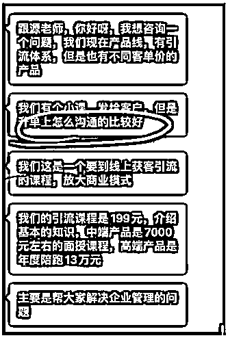
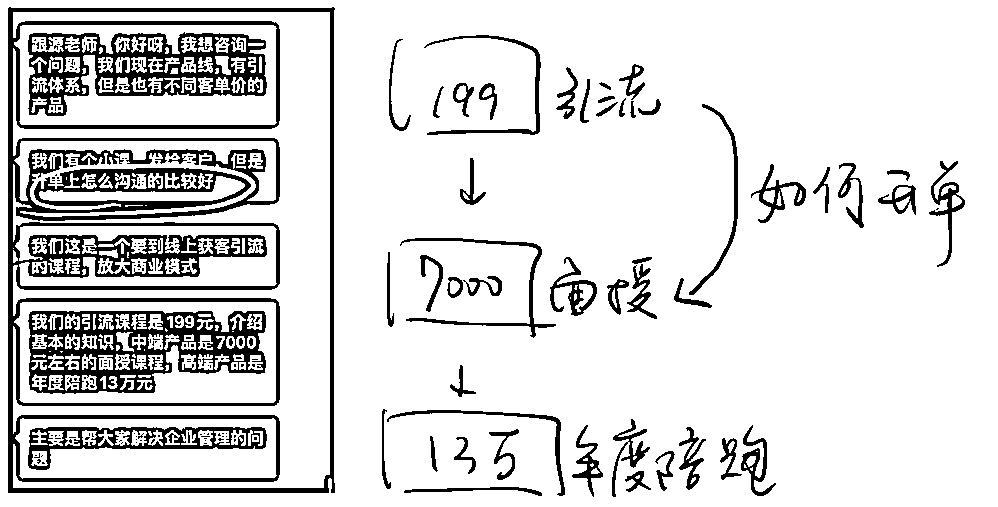
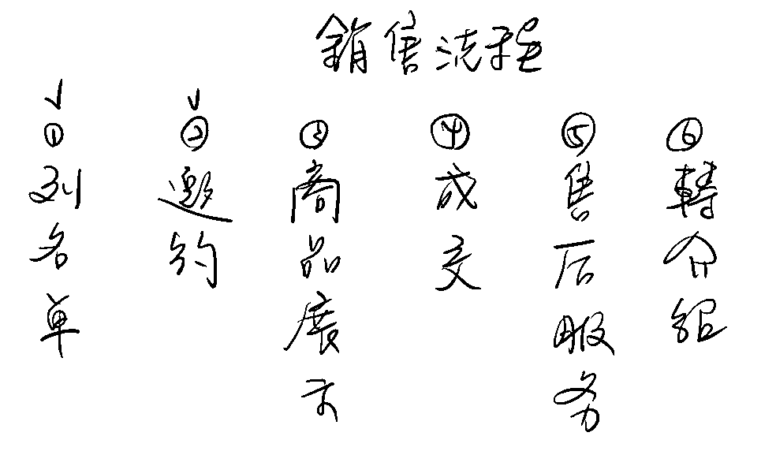
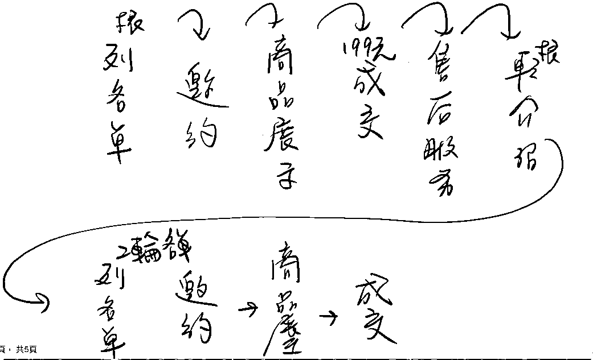

# 产品线有引流体系，如何通过沟通促成升单？

> 来源：[https://oee5lr7gsk.feishu.cn/docx/Dfx7dLwpno9kWYxqLjRcBx2bn8d](https://oee5lr7gsk.feishu.cn/docx/Dfx7dLwpno9kWYxqLjRcBx2bn8d)

全文6,580字

大约阅读时间需要8分钟

从低客单价产品，转高客单价产品，

一直是一件不容易的事情

这也是很多知识付费者以及拥有自己私域产品的朋友

都会特别重视的一个领域

那刚好最近有一个学员

有问到我这个话题，

趁着这个机会，我也谈一谈对这个问题的思考

以及自己是如何做的。

因为我自己的课程以及服务体系，有非常清晰的价格梯度，

这也是我过去12年销售经历中，

一直会去特别使用的一套流程和方法。

想着顺便能分享一下

自己对于这个问题的思考。

这回答有点长，

但也是我个人觉得是非常棒的一段内容。

很欢迎看完文章后

能一起讨论。

* * *

## 学员提问：如何透过沟通，促成升单？

这是一位学员私下跟我的提问，他的问题就这样子的：

我现在有一个产品线，有引流体系，但是有不同的客单价的产品。

那有客服发给客户，但是升单上怎么沟通比较好？

所以这个问题的第一阶段其实主要想问的是这个对于升单的提升，

然后这是一个要线上获客引流的课程，要放大商业模式。

然后引流课程的单价是 199 元，介绍基本知识终端产品是 7000 元，

然后最高的这个价格是 13 万，是属于年度的陪跑，核心是解决企业的问题。

那解决什么企业问题，我先不管了，就是我先不用管它解决哪类的问题，

也就是说这产品的目前的结构是它有一个引流品，然后再来就是有两种不同的价位，

再往下就是这个 7000 元的面授，接下来就是3万的年度陪跑，然后还有 199 元的引流品，

目前第一阶段就是从这个地方（199元）到这个地方（7000元）我应该如何升单？

* * *

## 透过销售架构，让自己的思考更有效率

所有的问题的思考，我一定会从架构着手。

因为有架构，就代表我能够更有逻辑，以及更有效率地去思考

升单这个问题我会归类于销售流程中的某一个环节

因为我自己对于销售流程有一个很完整的框架，

1.  列名单

1.  邀约

1.  商品展示

1.  成交

1.  售后服务

1.  转介绍

我刚好用图的形式做一下呈现

那升单就代表一定先有过第一次的成交

也就是一定得走过第一轮销售流程的6个环节

在转介绍的环节，进入到下一轮的销售流程

也就是重新进入下一轮环节

我一定还需要开场破冰，就类似于：

诶，根源好久不见呐，

我今天想特别来跟你说

就是很谢谢你当时上个阶段对我的信任，

愿意花钱跟我购买了产品

因为这一期的上课

我发现就是你在课程上非常的活跃

尤其你提出了某几个问题，我特别记录下来了，

我发现这个问题我能知道一下，就是目前你在课堂上曾经提过的这个问题，

你有想要持续的有一个后续的解决方案吗？

或者是，你有想要再继续地去精进这一块吗？

我是不是就可以询问了？

也就是我在做第一轮邀约的时候，我是不是我得重新问需求？

如果今天只是第一轮销售流程的列名单，

因为你不知道我到底有没有需求嘛，我只是在你名单本里面，对不对？

第一次在邀约的过程，我们之间没有过任何的交易行为，

我们进到商品展示的时候，我聊天的话题有可能就不用跟商品相关。

而是，我得透过闲聊去找需求，对不对？

但是当我进到第二轮的销售流程的时候，我同样是邀约，

我可能因为之前有过交集，有过第一轮销售流程中的接触，有过售后服务，

我有跟你熟悉过，所以我就能够直接把你过去提过的问题，我再一次提出来。

因为我已经有过服务你的经验了，也就是

这个时候，如果我要升单，我要再一次的进行成交，

最重要的就是刚刚提到的「邀约」环节。

我说重要的意思是，

如果这个事情做得好，是能够增加成交率的。

那邀约其实就是一个如何更好的开场跟破冰的方式，对不对？

也就是邀约环节，在线上其实是几个固定的话术，

就是邀约的定义叫做一定要跟你见到面，或者微信聊天场景，就是我得跟你聊上。

也就是我在正式进入到商品展示之前，

我必须要有一段词，那这段词讲完之后，

我才可以切入到我如何介绍我的产品，这个逻辑可以吧？

因为，一个好的介绍词，会决定我准备讲产品的时候，对方的接受度的高与低？

我如果切入得好，就能让这个商品展示可以更轻松；

如果我切入的不好，对方可能就不太愿意听下去了。

假设今天一种情况叫做

我已经跟你买过一个 199 的产品了，一开始你就说：

诶，根源，

我们公司有一个新的 7000 块的产品，

要不再买一个吧？

这是第一种方式。

另外一种方法叫做

诶，根源

今天特别要来发一张毕业证书给你，

因为你上一期你非常的认真，

那我有特意记得你在上课里面你提出过了三个问题，

（然后把那个问题拍照截图发给你）

因为我对于所有的学员

都会有一个非常详细的记录

以便我们能够真正地解决客户的问题

我能知道一下，

你上课曾经提过这 3 个问题是你很迫切想解决的吗

假设你说你很迫切，

我能听你说一说吗？

看看有没有能够协助到你的

这两种开场方式，假设最终谈成交，成交率肯定会不一样

也就是说你会发现

### 一个好的开场能够决定

### 这个产品在卖的过程能不能够更顺利。

如果说第一轮销售流程中的邀约开场可以很随便

类似于

好久不见，

我发现朋友圈的那个图片拍得太好了诶，

或者是一个新朋友：

我发现能力真好，

特别谢谢你加我好友，

我的名字叫什么？

这个开场其实都简单，因为就不熟嘛，

不熟就几个固定开场的聊天方式

但是如果到了第二轮销售流程中的邀约

我的目的性就很强，要想从一个卖 199的产品 变成要卖 7000 块的产品，

这时候我的开场邀约肯定得很精准，

也就是第二轮销售流程中，首先我的名单就得精准，

我得去找第一次就有付费的人，同时上课活跃度最高的。

* * *

## 透过筛选机制，更精准地筛选用户名单

好，那么在观察名单的过程，如果说这个人已经进入到第二阶段了，

我已经跟他有过一次交易的行为了。

他要进到升单的阶段，用什么方法可以最快地判断，

这个人对于我或者对于我的课程到底有没有兴趣？

我会透过对方的活跃度，或者说课程群里的说话次数

如果说我真的做了统计，第一期我的学员总共我 100 个人，每一天在群里面说多少句话。

统计下来发现，假设

1号叫石石，打了1000句

2号叫颖颖，打了800句

3号叫明明，打了1500句

4号叫白白，打了 400句。

如果我今天要推新产品，我要把我第二阶段的名单重新再精细化地做一次分类，

这时候我应该最优先找谁去做第二次的邀约？

肯定是明明，因为他在群里的活跃度最高，这也能在一定程度代表他对我的信任度是最高的

当然所有的学员我一定都会找，但找的过程，也一定是有先后次序的，

* * *

### 列名单的过程是升单能不能成的关键

所以当我做到第二轮销售流程，我在做邀约之前，列名单的过程就变得非常重要了，

因为列名单的过程是一个升单能不能成的关键。

因为我们先要解决的问题是我如何能够做到这个阶段到这个阶段的升单

我怎么让这个人从 199 愿意付到 7000 块？我得重新有一个第二轮名单。

### 关键点就是我如何在第二轮列名单的时候，做好名单的筛选。

也就是我有没有一个属于我们公司体系的筛选模式？

如果有一个很好的筛选机制，这会让后续的成交率有比较高的提升。

我就谈这个最基本的，用他的活跃度来看，活跃的是不是就可以筛选的，对不对？

或者是，有没有可能我开了一次课，我邀请主编帮我整理内容，邀请主编的过程，是不是也是一种筛选？

也就是筛选得当，我是不是就能够在第二阶段想卖高价产品的时候，能够更好地找到这部分名单？

这个逻辑没有问题吧？

如果这逻辑是没有问题的，当我第二阶段我要做邀约的时候，我重新列完名单，我要进到邀约了，

这时候如何更好地邀约，是不是就非常重要？

也就是我是不是要在第一期的时候

对于这个上课活跃的学员非常的了解。

我如果对他不了解，那就代表我之前的售后服务很可能是没有做好。

如果说我跟他谈聊天的开场都是这一个月他曾经说过的话，

或者是这个月他在朋友圈更新的某个内容，

或者是他在某一个公众号打的某一个文章，

……

类似这样子。

或者是今天这个 199 的课程，它只是一个数据，只是一个工具。

假设如果这只是个工具，一般公司做工具，背后总有数据，

那数据总能看到这个客户使用工具的点击率或者是使用频率。

那如果有，我是不是就可以从这里面去找到一些讯息。

这时候开场我就能说

明明，你好，

今天特别地找你

是因为我发现你特别的喜欢用我们的产品，

那不知道你介不介意？

就是我们产品其实最近准备有一个很大的更新，

我们想要真的去收集使用产品的人，

对于产品有没有什么你觉得需要改进的地方

类似这样子，

我们有时候去淘宝买东西不是都有售后服务吗？

你可以帮我写个好评吗？

或者你帮我想一下，就是这产品有没有什么副作用干嘛的，

你如果写，我给你返 3 块红包， 5 块红包

……

我们是不是就可以用这个邀约了，对不对？

也就是你要么看点击率，要么看到活跃度，

如果这是一个群的课程的话，活跃度好，我们就得看他过去在群里打了哪些内容，

* * *

### 找到一个合适的契机，让邀约更好地提升成交率

也就是一般来讲，我们在做升单的过程，一定要有一个契机。

那请问一下啊，假设 199 的课程，要进阶到 7000 的课程交付，哪一个东西是最好的契机？

我来讲一个点就是，

契机是一个场景，其实这个场景是最好用也最合理的，对方不会觉得尴尬的。

这个契机就是

### 我们怎么切入会让对方觉得，

### 你肯定得来找我一次的，我肯定得回你的。

当然也有一些例外，像我常常在做这个契机的时候，就会有人不回我，

这个契机就是发结业证书，

我每开完一趟课程之后，我个人就非常的喜欢结业式，

完毕之后我会一对一的发毕业证书，结业证书或者是什么徽章、勋章，反正管他什么鬼合理。

我花了钱，我最后拿了一个什么东西，然后当做纪念，

我不管储存不储存，我不管留念不当留念。

当你发现讲师给你亲自发这个东西的时候，你心里会排斥吗？

也就是如果说你当下，你心情是普通的，你会排斥这个行为吗？

跟你赌不会的。

只要这个课你不讨厌，只要这个课你每一期或者每一次上课你都会在现场，

那代表这个老师你觉得可以嘛，或者这产品你觉得可以嘛，对不对？

那当我去发结业证书，去发一个就是类似什么产品使用凭证，你肯定不会觉得排斥的。

那有没有可能今天有人不回？他有没有可能他真的对于课程没有什么感觉？

就像假设我第一期我上沟通课的时候，全班 402 个人，

我一个下午发了 400 多张毕业证书，回复的也就 300 多个，没有全部回我的。

那有一些，因为刚好在忙嘛，那再来一个点是课程一百多块，很多人不会重视，我觉得很正常。

但是如果有回你的人，是不是代表他对你是有兴趣的，

或者他对你是有好感的，

或者他觉得你这个人还挺可以的，我能够能接收你的证书。

也就是这个场景是

我认为升单的过程，要找到一个邀约场景最好的一个点。

然后花点钱去找一个设计师帮你做一张奖状，什么徽章

或者要个地址：

很谢谢你这一次的参与，

那因为我们这些所有的学员，

我们都会送一份小礼物，

刚好拿到他的这个细节的名单、有地址、有电话，是不是就可以寄东西了，对不对？

那寄完之后我能不能说，

对了，我才想到

你在那个第 21 天课程的时候，

因为我们这节课程 31 天嘛，

你曾经在群里提交了一个问题，

那个问题我特别记录起来了，

我能知道一下

这个问题你当时提完问之后已经解决了吗？

因为这个问题当时我有特别的记录，

这 21 天里面那个问题是我觉得提得最好的问题，

尤其那问题刚好也跟我们接下来的某一个产品是有关联的。

那如果说你还没有解决，

你介不介意我说一说，

这是我们觉得一个更好的解决方案

你会发现我就切入了，那这个切入的点，基于曾经我们的交付过程里面发生的某一个事件，

只是我把事件提出来放大了，

那你要想这种邀约就很合理，我是不是就可以快速切入产品了，对不对？

所以这就是一个升单的关键，只是我们在谈升单的时候，你就势必也做了商品展示嘛

* * *

### 总结：

这边我先做个小总结，也就是升单的关键，

其实以销售流程来看有两个核心点，

⭕️第一个叫「精准的名单」，

我要如何从 199 元的产品里面去找到我能够谈 7000 块产品的名单，

如果说今天有 1000 个人跟我买，难道我就 1000 个人都问他说，

诶，我们有个什么什么产品，你有需求吗？

不可能的，这么做有点傻，也容易让对方觉得不舒服，

⭕️第二个叫「合理的邀约切入点」

我可以选择要发毕业证书，那我能不能发问卷，然后我说，

诶，那个很谢谢你，

就是这一次我们有一个课程档案的打包

一起发给你，

我就给他了，那发给你之后，我再问他

你介不介意

用大概 30 秒的时间帮我填一张小问卷，

我就发个链接，那问卷填完我就给这个产品的总课包，

或者是我先拉课包，我再给他问卷。那这个问卷你可以就只设 2 题嘛？

第一个就是这课程你喜欢吗？

第二个就是我们如果有一个进阶课程，大概是 4 位数，你会有兴趣了解吗？

如果他第一题勾是第二题勾愿意，那我是不是就能再问了，对不对？

所以我不管是用毕业证书，不管是用那个送礼物，不管是什么给这个课程的总合并的答案，

不管是这时候我都可以接个，

诶，那有一个小问卷，这个问卷就两题，你可以帮我填一下吗？

然后放个三题。

第三题就是，

那如果你有兴趣，

你介不介意过几天

我们会有私下专人服务你，

跟你介绍我们的新产品？

（不买没关系）

类似这样子，那如果对方三个都勾可以，那代表什么？

这不就是一个我们接下来可以跟他谈的人的嘛？

因为第二个我填的就是我们这些产品，那它价格大概多少钱？懂这个意思吗？

也就是这个都是我们准备进入到二阶段的销售流程的时候，

我在列名单我必须要做的事情，就是筛选，

如果 1000 个里面有 700 人填的名单，然后有 200 人全填可以，

请问一下，在这情况之下，你觉得是去重新跟 1000 人都聊一次，还是我优先找这 200 人去聊？

哪一个会更有效率？

肯定是 200 人更有效率的，不止有效率，还精准，同意吧？

也就是，

升单这件事情是一个一连串的事情，升单都不是个名词.

### 升单是一个渐进式的动词，

### 我得在每一个环节都做得细节好一点，就能够增加我的升单机会。

* * *

## 促成升单的底层逻辑是「把服务做好」

促成升单的底层逻辑，

从来不仅仅是做好交付，而是一定得把服务做好。

就是很多人都会以为我只要把课程交付完毕，我就能够更好地升单。

我跟你讲这句话叫鬼扯，因为课程的交付，这个叫交付者的本分，

你收199，你就应该把 199 交付好。

所以我认为产品的交付那个都是本来就应该做的，

但是决定升单的关键是「服务」，你服务做了些什么？

### 服务不就是增加你的交付感跟增加信任感嘛！

所以这个过程太重要了，也就是升单的过程，每一个环节都很重要。

就像我之前我在第一期沟通课结业，我就会发红包，

之后我会私下的一个发毕业证书，那毕业证书发完之后我还会有一段毕业寄语，就是这个话术，

我想给他的，然后每一段话我都会在上面去特别打上他的名字，

然后下一句就是说有三份礼物以及有一个资讯是想告诉你的，你愿意听吗？

他只要说愿意，我就会说

第一个是毕业证书，我就发给他了。

第二个是课程的这个总的打包合集，

第三个是接下来有两个进延伸性的产品，、那大概是多少钱，想知道。对于这两个产品你会不会有需求？

那他只要讲有需求，我是不是就能够说？

那你介不介意过两天之后我特别花时间跟你聊一下，你对这需求有没有就是想进一步的了解？

他如果讲可以，我是不是两天之后我就可以再找他聊天呢？对不对？

我当时所有的毕业证书，我都是一个一个这么发的。

去年我开了26 期的课程，我大概就发了 24 种毕业证书。

这 24 种毕业证书发出去之后，我不就可以就是很好地去做一个第二阶段的名单筛选，然后再邀约了，

这时候你会发现，商品展示你不用介绍这么详细，因为你的信任感是在的，

## 低价服务和高价服务的区别，核心是『了解度的加深』

举个例子

如果说假设你上了我的聊天成交课，在一个不担心预算问题的情况之下，

假设我的下一个阶段我有一个 7000 块的课程，你已经对我付过 3000 块了，

接着我有一个 7000 块的课程准备要我要推荐给你。

如果说你第一期的课你上得很好，这个进阶的内容你可能有需求，预算上你也是没问题的，这钱你能付得起的

你觉得第二次我再跟你介绍产品的时候，我需要再说的这么详细吗？

不需要的，同意吧！

因为你信任我的人。也就是很多人在做低价服务的时候会忘记好好的服务他。

# 对于我来说，

# 高价与低价的服务都不是『交付时间』或者『交付内容』的比较，

# 而是『了解度的加深』。

也就是有可能 199 的服务跟一万块的服务，

在我的世界里面都一样，只是因为我们关系更熟悉了，

所以我可能服务的过程，我说话的内容跟文字就不太一样，但是我的服务时间可能是一样，这逻辑OK吧？

也就是当我想升单，从名单筛选，到邀约的开场，

把他过去上课的某一段话截取出来，或者是填问卷，或者是什么都好，

这时候就能够更方便我做商品展示，只是因为之前的服务，我们已经有过一个很好的信任感，

到了第二轮销售流程的「商品展示」，就可以让我们重新介绍的过程，变得轻松很多，

我就可以不用花这么多时间去把产品的细节说得这么的完善，有可能我不用说得很完善，我就能成交了。

因为我们已经进到第二轮，就是我转介绍了我自己的名单出去了，

然后对方已经要考虑下一个，也就是我从问卷、从询问的过程，已经筛选出他有这个需求。

也就是升单的过程，最重要的环节还是得

列名单（重新筛选）以及邀约，

就是去找过去你对它的某一段的了解，然后把它提出来，然后把它加深，让对方感觉到被你重视。

要记得那种被重视感是非常重要的，

如果说你没有让对方感觉到被重视感，你想要再二次的成交他，难度是高的，

不是不可能，只是难度比较高。

* * *

# 尾声的过去历史介绍

我是根源，同时也是第四期的生财圈友

一个有 2w+ 实战案例的心理咨询师

12年线下销售、团队管理经验。

2022 年开始转型线上，做一些知识付费的项目。

过去曾发表过几篇文章

都能看到这，代表你对文章的喜爱

肯定有一定的程度！

也欢迎阅读过去我写过的历史文章。

2021年的文章（精华x1）

1.  精华《直觉式萨克斯 透过社群成功变现146万》 https://t.zsxq.com/116B1bcYc

1.  《73项被动收入打造》 https://t.zsxq.com/11EHjTH0P

1.  《杭州夜话02场，夜话官复盘》 https://t.zsxq.com/19IkX4UMl

1.  《年入百万，团队从20人到4万人》 https://t.zsxq.com/19JYt77hL

1.  《主题：如何更有效的链接见面会认识的圈友》 https://t.zsxq.com/19VY2LWg4

2022年的文章

1.  《互联网小白，第 1 次做线上产品，7 天赚回 10 倍门票》 https://t.zsxq.com/11ooZZbM7

1.  《把捣乱分子『逆势』转成爱用者的好方式》 https://t.zsxq.com/19lipLhJ5

1.  《 好的内容，是目前依旧没退旧流行的变现方式 》 https://t.zsxq.com/19BLMAYw1

1.  《明白老师的一个启发，让我从100天日耕的过程赚了30W+》 https://t.zsxq.com/19BgNoxfi

2023年的文章（精华x6）

1.  《私域的意义不是管理，而是经营》 https://t.zsxq.com/19WEsfSq1

1.  精华《9年传统行业 1 年时间，从一无所有，到年入 200 万》 https://t.zsxq.com/10nmEr1cA

1.  精华《25个提高微信成交率的小技巧》 https://t.zsxq.com/11AgRW24F

1.  精华《35 个让私域收入翻 3 倍的技巧》 https://t.zsxq.com/11FmV2aqZ

1.  精华《续篇 - 25个提高微信成交率的小技巧（26 - 50）》 https://t.zsxq.com/13yRbmUwo

1.  《 私域话题：涨价之后，如何回复以及留住客户？》 https://t.zsxq.com/11UJk9HxQ

1.  精华《成为自由职业者的20个必备特质 》 https://t.zsxq.com/14XTxhh15

1.  《 36个让私域成交率翻倍的实战指南！ 》 https://t.zsxq.com/17zSrYzvk

多亏加入了生财有术

让我少走了很多弯路。

也积累了一些经验、心得

如果圈友有什么需要探讨的

欢迎加我微信「 AF54094 」交流~

▲

也能扫码撩我~