# 干货分享-教你用影刀 RPA 批量抓取抖音爆款视频数据

> 来源：[https://p8y34fwle2.feishu.cn/docx/EMj4dzYAlo08nKxUiZecR1ESngg](https://p8y34fwle2.feishu.cn/docx/EMj4dzYAlo08nKxUiZecR1ESngg)

# 一、需求挖掘

都说会抄才会超，但我发现很多做抖音的圈友还在手动搜集对标账号的爆款视频数据，不仅伤眼睛，还特别费时费事，这么一项重复的、有逻辑性的工作，不正是 RPA 的工作范畴吗？那是不是可以用影刀 RPA 来给自己的抖音项目加杠杆呢？我还真的做了出来！

答应我，看到文末，因为我还是一如既往，毫无保留地把源代码附在文档里了，不为别的，就想跟你真诚交个朋友！

大家好呀，我是马小威，影刀官方认证的中级工程师，Uibot认证的初级工程师，擅长用影刀RPA来给自己做的项目赋能，当然如果你有其他我还没涉及的项目，也欢迎来跟我唠唠。

## 1.1 视频演示

话不多说，先来看看我这个抖音抓爆款视频数据的机器人都能做点什么吧！

# 二、基础知识普及

在制作本次的机器人时，我们会用到两个指令，分别是「循环 Excel」和「双循环」。下面，我先来给大家解释一下这两个指令分别是什么：

## 2.1 什么是循环Excel

简单来说，【循环 Excel】就是把 Excel 表格中的内容，按照顺序一个一个拿出来使用，直到拿出全部的内容。

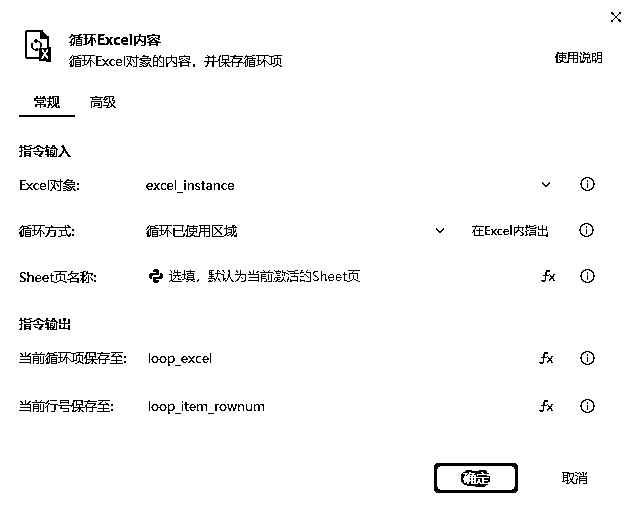

例如，下面的 Excel 表里有 1、2、3、4、5，五个数据，循环表格就会分别从表格中拿出 1，完成后再拿出 2，直到拿到最后一个数字 5 为止。

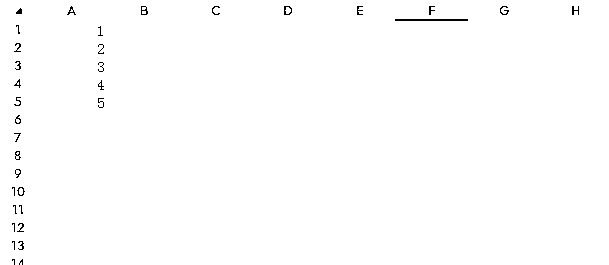

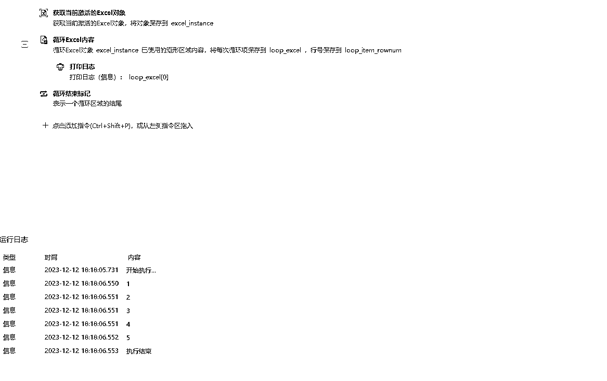

如果还是不理解的话，可以参考官方文档： 循环Excel内容 · 影刀文档

## 2.2 什么是双循环

还是以上面说的数字为例，就是给已经在循环的 1、2、3、4、5 的每个数字后面，再加上其他的操作。

流程会先进行最外层循环中的第一项，再进行内层循环中的每一项，等内层循环结束后，再继续外层循环中的第二项以此类推

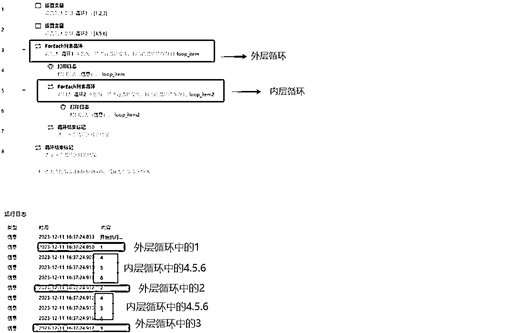

图中就是先拿出外层循环中的 1，再拿出内层循环中的 4，5，6；然后又继续拿出外层循环中的 2，接下来拿出内层循环中的 4，5，6…直到外层循环结束。

图中的1就是外层循环的数据，4，5，6就是内层循环的数据。

# 三、机器人落地

## 3.1 准备工作

我们可以提前将需要抓的对标账号相关数据写入 Excel 表格里，后续直接使用影刀指令【循环 Excel】，就能让机器人逐一查询账号的爆款视频数据了。

RPA 会访问对标账号的首页，并按照昵称新建 sheet 页，完成后会在“抓取状态”栏中体现。

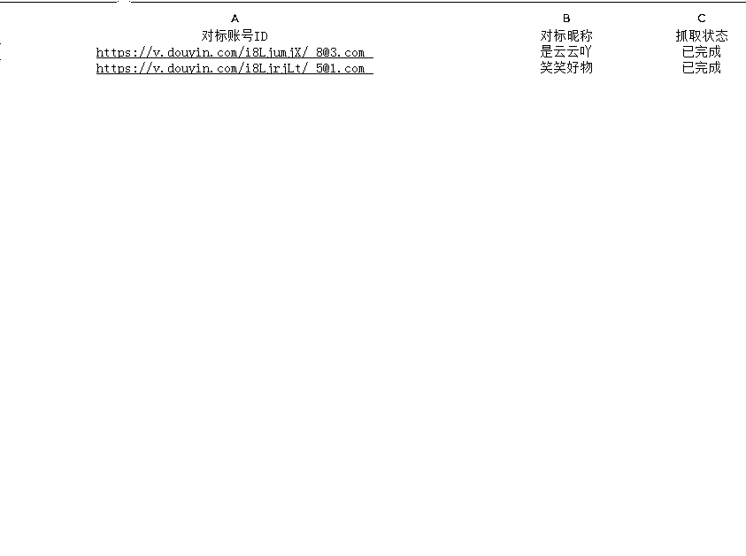

在日常收集爆款素材的时候，我们可能会对素材进行一定的筛选，譬如需要点赞、评论超过 xx 的，时间需要是 xx 号~xx 号的。有些小伙伴可能会问了，RPA 机器人可以实现这种筛选吗？

嘿嘿，这里我来告诉大家：别小看我们做的机器人，这些筛选完全可以实现~

譬如，在开始获取数据前，我们可以先提前设置爆款标准：点赞超过 1w 的，评论超过 2000 的，也可以按照当前账号的某几天内最高赞、最高评论的视频……

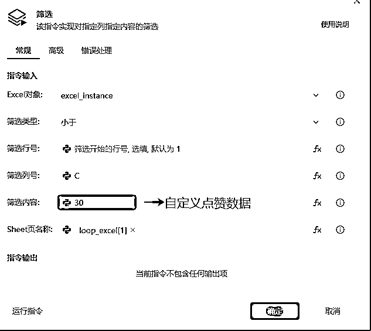

需要注意的是：爆款都是有时效性的。所以，这次我们做的这个爆款机器人抓取的是该账号近 3 天内的优质视频，这样才让我们参考有意义。

当然，时间范围是可以自己设置的：

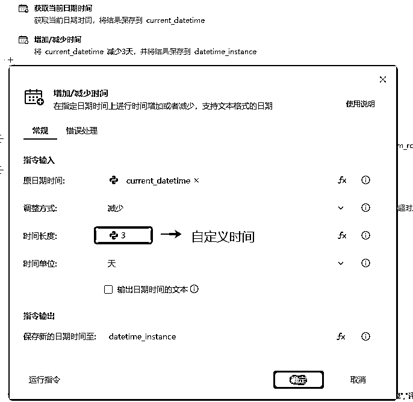

## 3.2 抓取对标账号的数据

循环里的第一步：打开该对标账号的链接（上一步中，我们需要在 Excel 表里提前写好的内容）

通过【批量数据抓取】指令，将我们需要的数据（正文内容、发布时间、链接、点赞、评论数据等）抓取下来。

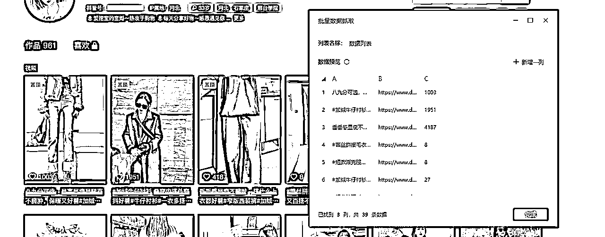

需要注意的是：这里的批量数据抓取，抓到的是该账号的视频的文案，链接以及点赞数据，和我们最后想要的数据还是存在一定差别的。

所以，我们可以利用影刀的市场指令【筛选】，对刚刚抓到的全部数据按我们想要的标准来进行筛选

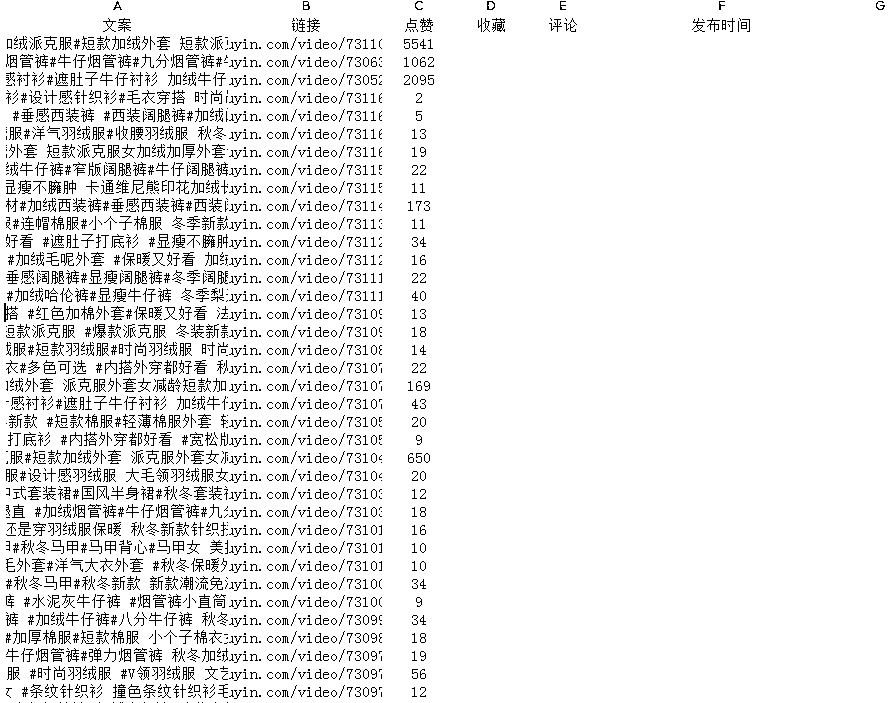

这里具体的筛选标准，大家可以根据自己的实际需求来进行调整（筛选内容可以是点赞数）

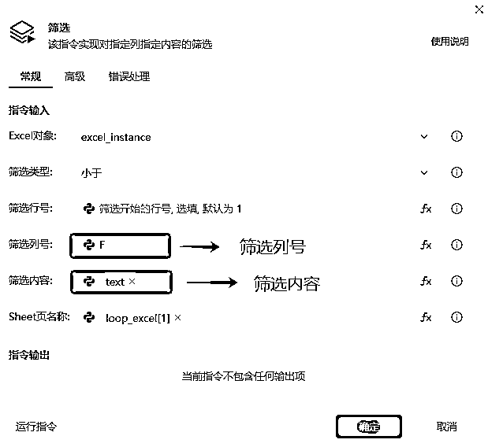

这一部分的操作流程如下图，具体完成的动作就是：在 Excel 表格中新建 sheet 页，写入上面批量抓取的数据，并进行初步的数据筛选。

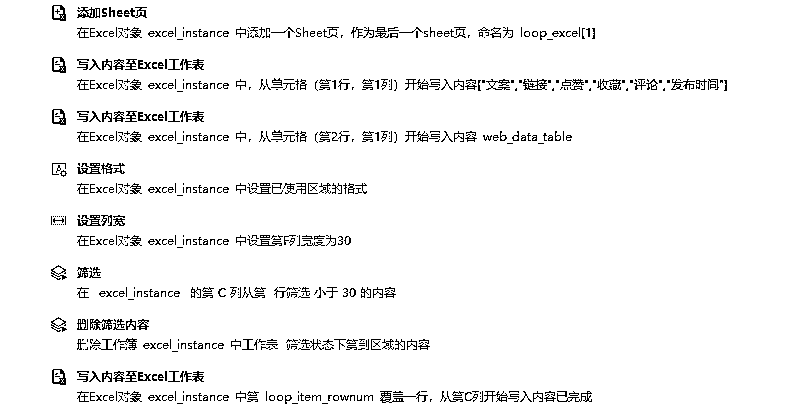

细心的你可能会发现，上述的操作步骤，所获取到的数据是不完整的，在账号主页只能看到文案、链接以及点赞数据，所以只能抓取到文案、链接以及点赞数。

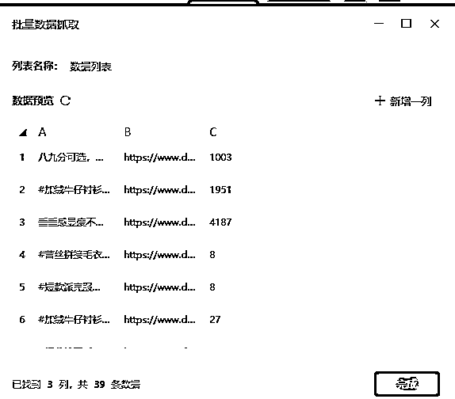

那么如果我们还想要该视频的评论数据、发布时间和收藏数据该怎么办呢？

## 3.3 进一步抓取数据

大家都知道，RPA 机器人的工作逻辑，其实就是模拟我们人工的操作。既然这样，我们就让 RPA 按照人工操作时最笨、最简单的方式，来获取这些我们想要的数据。

没错，就是先逐一点开具体的视频，然后再捕获相关的评论数据和收藏数据。

这里对于 RPA 的设置，就稍微增加了一点点难度，

需要我们在前面的【循环 Excel】里，再套一个新的循环，即前面提到的「双循环」

为了提高效率，我们可以直接在步骤 3.2 中初筛过的数据里，进一步对相关视频的评论数据和收藏数据进行抓取。

大体的流程就是：

*   循环上面抓取到的数据 → 打开抖音的链接 → 抓取评论、点赞、发布时间这些数据 → 写入Excel表格中。

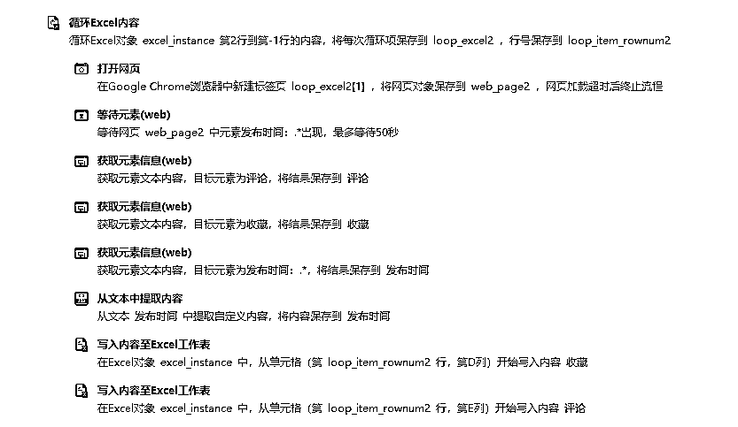

这样一套流程走完，无论是想收集点赞超过 1w 的视频数据，还是评论超过 2000 的视频数据，还是该账号近 3 天内的最高数据……统统都可以实现~

不过需要注意的是：在获取对标视频数据时，这个点赞、评论的数值确实是要需要结合账号本身来进行调整的。

如果账号粉丝量低的话， 那么上面说的，点赞 1w、评论 2000 的标准就没问题；而如果对标账号本身就是几十万、甚至是几百万粉丝的体量的话，那么这个爆款的定义就需要重新斟酌了。

毕竟大家也都知道，低粉爆款其实才是更有对标价值的~

那经过了以上的两次筛选，我们最终得到的数据就是这个样子，直接在 Excel 里呈现好了：

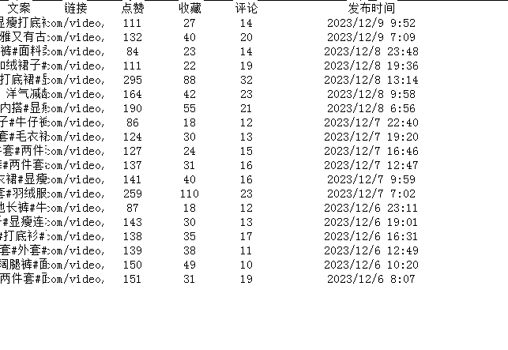

可以看到，视频的正文文案、视频链接、点赞数、收藏数、评论数和发布时间，这些数据全都有了。拿到了这些数据，我们也就可以去模仿、跟款了~

## 3.4 同步信息给指定的微信

为什么要设置同步信息这一步呢？

因为我觉得，等机器人跑完流程后把重要的内容直接发给我们，提醒我们查看，这样便于我们更快的、更随时随地的了解对标账号的数据，以便及时进行下一步操作，进一步进行跟款处理。

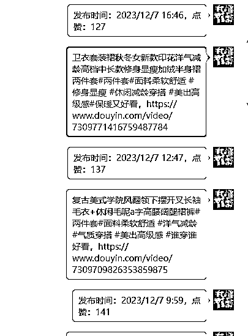

这里的操作依旧是循环 Excel 表格，循环上面抓取到的视频数据：

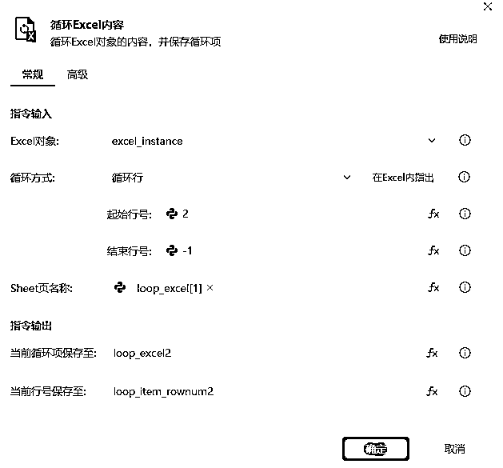

大体的流程是：

*   唤起微信窗口 → 点击输入框输入需要发送的微信昵称 → 点击输入框输入点赞数据和发布时间 → 把文案和视频链接发送

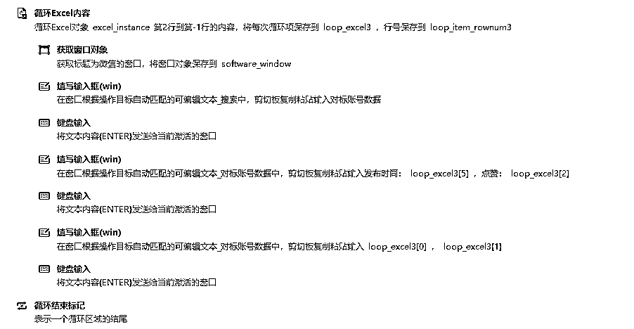

这一套流程走下来，也就大功告成了！

当然，也可以把Excel表格中每一行的所有信息放在一起发送，这里只选择发送了部分数据用来示范。

# 四、结语

我始终认为，【学习】不是一个词，而是一组词，不仅要【学】，也要【习】。

学会影刀的基础知识只是第一步，更重要的是在了解了基础知识后，不断升级打怪的过程，这样 RPA 才能最大限度地给我们的工作和生活加上杠杆。

最后，附上本次机器人的链接: 自动抓取抖音爆款视频数据-马小威（密码是：mxw4260）

点击链接，下载影刀，点击获取的应用，就可以进行操作了，使用过程中如果有什么问题也欢迎和我交流。

以下是我之前做过的一些 RPA 相关的机器人，也许会有你需要的：

马小威 - 如何利用影刀RPA为微头条10倍赋能

马小威 - 如何利用影刀RPA给公众号爆文赋能

马小威 - 免费自动加微信好友的RPA机器人，保姆级使用教程

我是马小威，一位专注研究影刀 RPA 降本增效的 95 后奶爸，最后祝大家一起生财有术！

如果你也想要提升工作效率欢迎你和我一起交流~V：mxw4260