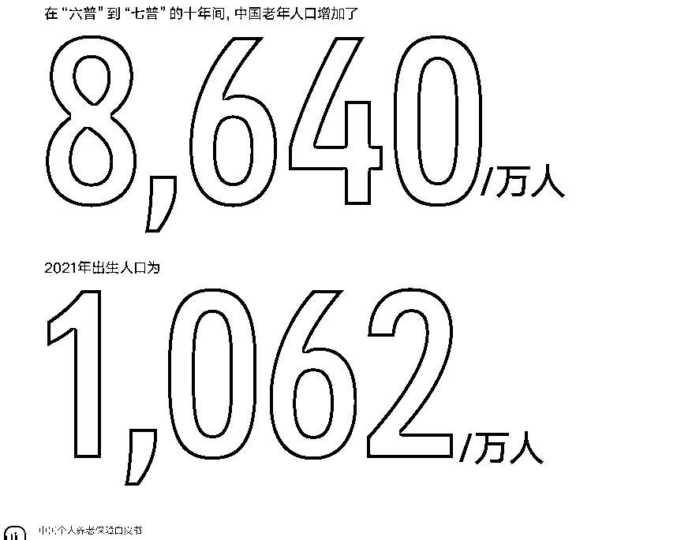
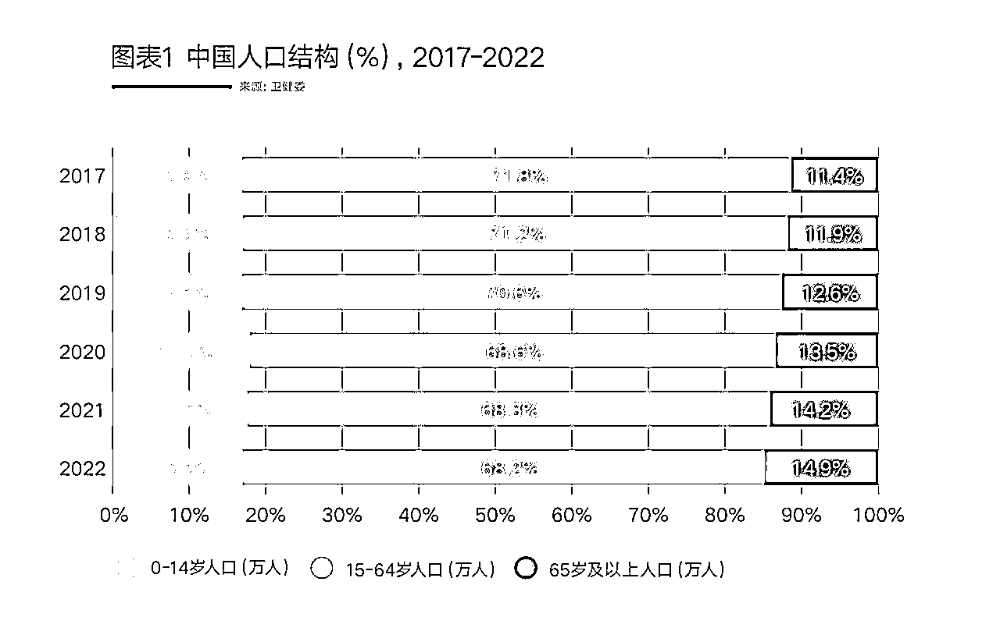
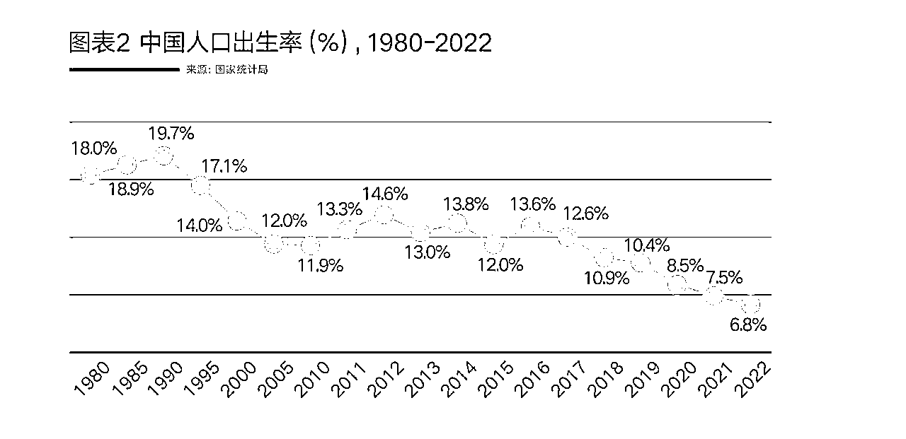
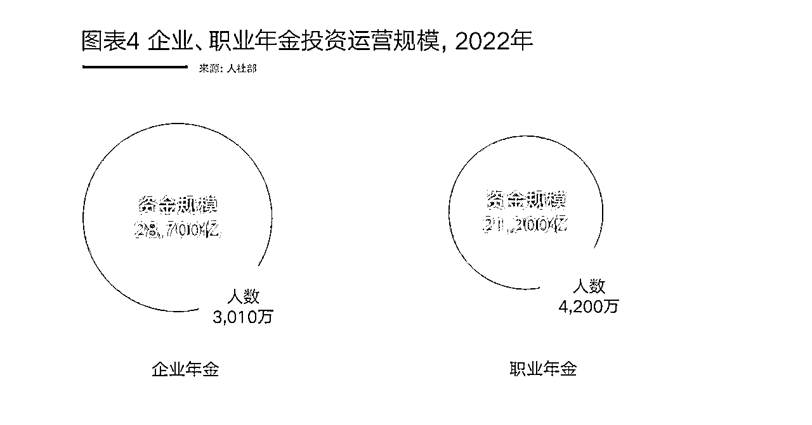
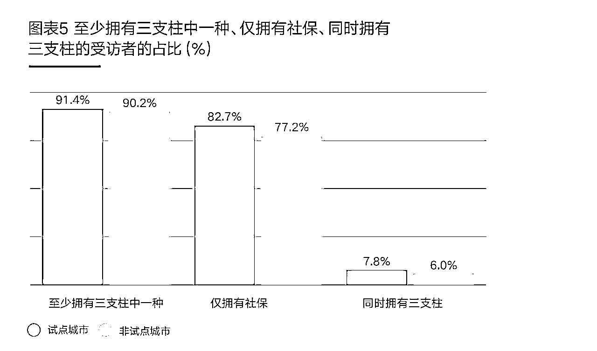
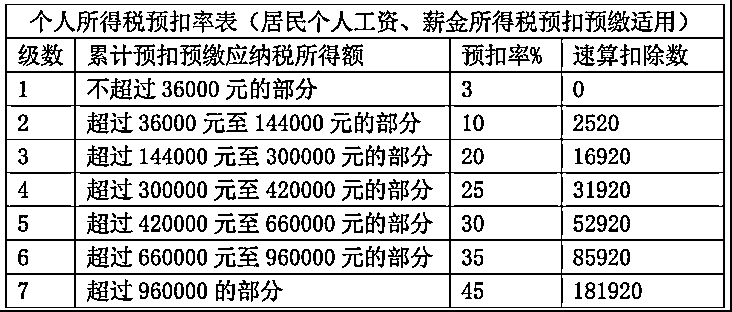
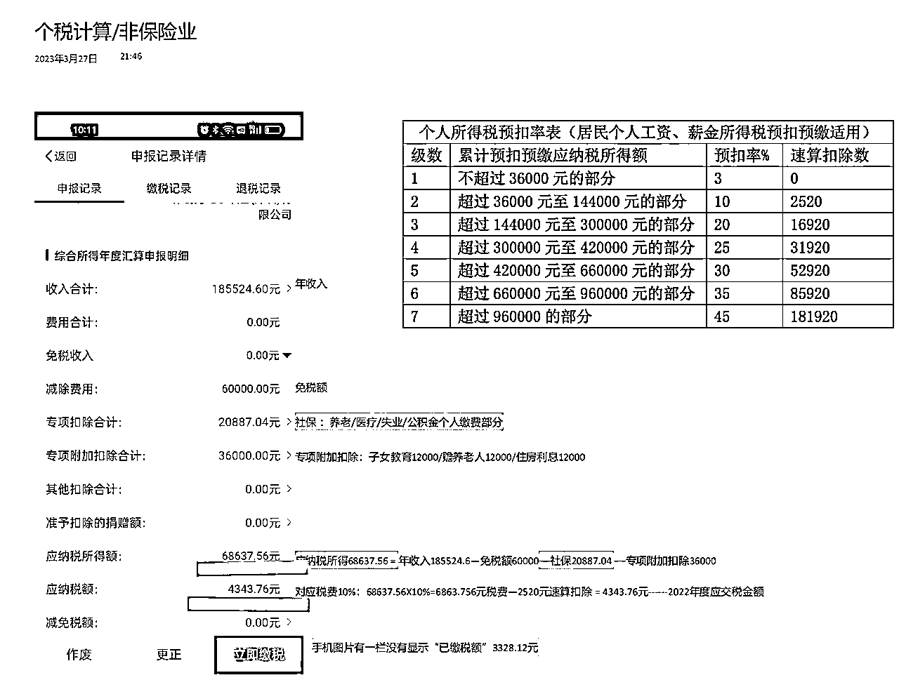

# 2023年最后一个月了，一文说清楚可以退税的个人养老金（今年缴存截止到12月31号，明年才可以退税）

> 来源：[https://dvynhp7ntg.feishu.cn/docx/ETsIdRXNpoYsmRxaEvBcQ5ipnke](https://dvynhp7ntg.feishu.cn/docx/ETsIdRXNpoYsmRxaEvBcQ5ipnke)

# 个人养老金产生的背景

1\. 人口老龄化：随着生育率下降和人们寿命的延长，中国的人口老龄化问题日益严重。这给养老保障体系带来了压力，因为越来越多的老年人需要养老金支持，而劳动力人口相对减少。

第七次人口普查结果显示，截至2020年11日1日零时，中国60岁及以上人口占比达到18.7%，其中65岁及以上人口占比13.5%，即将迈入深度老龄化社会。在“六普”到“七普”的十年间，中国老年人口增加了8,640万人，并预计到2030年再增加2.23亿老年人口。与此同时，“少子化”对人口结构也造成了一定影响，2021年出生人口以1,062万创下新低，比2016年下降了43.6%。

2\. 传统养老保障体系的不足：中国的传统养老保障体系主要依赖于基本养老保险、企业年金和个人储蓄。然而，这种体系在应对人口老龄化和养老金支付压力方面存在不足。

“十四五”规划提出，发展多层次，多支柱养老保险体系，提高企业年金覆盖率，规范发展养老第三支柱，促进养老保险体系更加均衡、完善。2022年11月25日，人力资源和社会保障部会同财政部、国家税务总局印发《关于公布个人养者金先行城市的通知》，参加个人养者金成为了在享受国家基本养老保险待遇的基础上，额外增加的补充养老保障渠道，能够帮助个人理性规划养老资金，同时享受税收优惠政策。

3\. 养老金支付压力：随着人口老龄化，养老金支付压力不断加大。为了确保养老金的可持续发展，中国政府需要寻求新的养老保障模式。

4\. 发展个人养老金制度：为了缓解养老金支付压力，中国政府开始推动个人养老金制度的发展。个人养老金制度鼓励个人为自己的养老生活储备资金，从而减轻国家和企业的负担。

5\. 国际经验借鉴：许多发达国家已经建立了成熟的个人养老金制度，如美国的401(k)计划和澳大利亚的超级年金。这些国家的经验和做法为中国发展个人养老金制度提供了有益的借鉴。

为了应对这些挑战，中国政府正努力推动个人养老金制度的发展，以实现养老保障体系的可持续发展。

# 什么是个人养老金？

个人养老金是指政府政策支持、个人自愿参加、市场化运营、实现养老保险补充功能的制度。个人养老金实行个人账户制，缴费完全由参加人个人承担，自主选择购买符合规定的储蓄存款、理财产品、商业养老保险、公募基金等金融产品（以下统称个人养老金产品），实行完全积累，按照国家有关规定享受税收优惠政策。

# 中国养老三支柱

1994年，养老“三支柱”定义首次出现在世界银行《防止者龄化危机-保护老年人及促进增长的政策》白皮书中。目前，中国的养老三支柱，分别是：第一支柱即由国家主导的基本养老保险，包括城镇职工基本养老保险和城乡居民基本养老保险，对老年人的生活提供基本保障；第二支柱为企业年金和职业年金，是由国家监督、市场运营管理的补充养老保险，在政府政策指引下，企业年金由企业自行创设，职业年金为强制建立；由个人掌握并以扩充养老保障供给为目的的金融类产品则归于第三支柱，除政策给予优惠的个人养老金外，还包含养老理财产品和商业年金保险等其他养老金融产品。

2022年5月，随着国务院办公厅发布《关于推动个人养老金发展的意见》，标志着我国第三支柱个人养老金制度在历时4年后将逐步从试点转向常规。11月，人社部、财政部、国家税务总局等五部门联合印发并出台的《个人养老金实施办法》，是贯彻落实党中央、国务院关于健全多层次、多支柱养老保险体系，规范发展第三支柱养老保险的重要举措，也是推进国务院关于推动个人养老金发展的意见落实落细的具体做法。

# 养老三支柱现状分析

## 第一支柱覆盖广、替代率低、增长空间有限

中国已于2021年正式跨入中度老龄化社会，65岁及以上老年人口占比为14.2%。(图表1)在上世纪90年代，为对抗老龄化进程加剧的情况，基本养老保险制度在中国建立，也成为了如今中国养老第一支柱。同时，中国人口出生率走低，2022年降至6.8%。(图表2)“少子老龄化”成为了中国人口结构的未来趋势。

截至2022年末，中国基本养老保险参保人数达10.5亿，(图表3)基本养老保险基金年度收支规模超过12.6亿元，累计结存超6万亿元，在三支柱中占比最重。根据中国社科院预测，全国城镇企业职工基本养老保险基金累计结余或将在2027年达到7万亿元峰值，随后急剧下降，直至2035年耗尽。

## 第二支柱覆盖率有限，惠及人口较少

在第一支柱支付压力持续增大的背景下，政策鼓励企业共同参与分摊职工的养老压力，孕育出以企业年金和职业年金为主的第二支柱：补充养老制度。然而，职业年金与企业年金覆盖人数仍有限，(图表4)第二支柱的作用尚未完全释放。

## 第三支柱规模有待提升，未来仍有广阔发展空间

个人养老金是发展第三支柱的重要举措。在当下人口老龄化严重、国家养老金资金紧张、社会保障面临较大压力的境况下，个人养老金得到了政府大力地推广和发展。

个人养老金由个人主体负责、自愿参加，产品类型多样，包括专属养老保险、养老储蓄存款、养老目标基金、养老理财等产品。通过结合第一支柱和第二支柱，该第三支柱将有望打开养老金融产品的零售市场。

在政策规范方面，中国政府自2022年开始试点推行个人养老金政策，试点地区居民可根据自身意愿向个人养老金账户中存钱。虽然个人养老金账户金额上限并不高，每年最多存入1.2万元，但可获得一定的税收优惠，意在通过税优政策提升个人养老金的吸引力和覆盖面。

据人社部数据，截至2023年6月，个人养老金已吸引超过4,030万名开户参与者，平均账户缴费约2,000元。中国社会保障学会副会长金维刚表示，从36个试点城市和地区推行个人养者金政策后的情况来看，参加人数占符合参与资格的总人数的比重并不大，开户后实际缴存资金的人数和人均缴存资金水平亦需进一步提升。这表明，个人养老金政策还有待普及，缴费额有待提升，未来市场发展潜力相当巨大。

2022年以来，为应对全球经济形势的不确定性，央行几度降息。随着存款利率下调，结构性存款收益率和普通定存产品收益下降明显。为了更好地管理现有资产、实现远期养老储备目标，人们开始寻找有别于存款储蓄之外的新型金融产品。因此，在社会保障制度日趋完善的背景下,未来养老金融产品市场将被下游不断增长的需求进一步打开,多元化、多功能的养老金融产品或将成为除银行存款外最炙手可热的养老储备新方式。】

# 个人养老金哪些城市可以参加

# 哪些人可以参加个人养老金？

1、在中国境内参加城镇职工基本养老保险

2、城乡居民基本养老保险的劳动者

划重点：建议以下人群积极参与

◎期望获得更多税收优惠的人群：年收入大于等于9.6万（税前），参与后多少可以享受到一定的税收优惠

◎期望积极提升养老金替代率的人群：按国际标准，退休后的养老金应该达到退休前的70%及以上，则退休前后的生活质量不会发生较大变化

◎希望管住自己进行强制储蓄的人群：人性是有弱点的，很多时候需要及时引入一定的外部约束力才能更好地实现长期储蓄目标

# 为什么要参加个人养老金？

1、个人养老补充

养老保障体系三大支柱（基本养老保险、企业年金、个人养老金及其他个人南业养老金融业务） 发展不平衡，养老金资产总量不足，养老金替代率持续下滑、严重不足，未来长寿时代养老需求进一步扩大。

2、税收优惠

参加人每个自然年可在1.2万元的额度内向个人养老金资金账户缴存资金，缴存金额可在应纳税所得额中税前扣除，参加人可根据实际缴存资金规模享受对应额度的税收递延优惠，领取阶段按照领取金额的3%缴纳税款。

# 如何参加个人养老金？

1、自愿开户

通过商业银行手机APP线上最快一分钟可以完成开户，资金账户账户支持中途更换银行

2、自愿缴存

自愿向资金账户缴存金额，最高12000/自然年享对应缴存金额的税优，1月份在“电子社保卡”小程序下载缴费二维码，3-6月份可在“个税APP”完成缴税抵扣

3、自愿投资

可以选择投资储蓄产品，商业保险，理财产品，公募基金这四种，账户封闭运行，投资收益暂不征税

4、满足条件领取

满足四项条件之一领取，①达到领取基本养老年龄，②完全丧失劳动能力，③出国（境）定居，④国家规定的其他情形

领取的时候银行代扣3%个税

①可按月、分次或一次性领取养老金，②划传到参加人本人社会保障卡银行账户，③参加人身故，其个人养老金资金账户中的资产可以继承

# 个人养老金该如何进行投资（供参考）

## 可投资范围

只有经银保监会或证监会批准、并在人社部信息平台和金融行业平台公布的四大类产品（储蓄产品、理财产品、商业养老保险、公募基金）才可以纳入投资范围。

## 各品类基本特征介绍

| 品类 | 产品形态 | 优势 | 劣势 |
| 养老储蓄产品 | 整存整取、零存整取、整存零取三种形式 | 安全性高 | 单利计息，收益较低 |
| 养老理财产品 | 主要以固收类产品为主，间以混合类产品等 | 起购门槛低 | 收益不保证 |
| 商业养老保险 | 年金保险 | 在刚兑被打破背景下，安全性和确定性相对更强 | 一般需要长期缴费，且锁定周期相对更长，中途不能转投其他品种 |
| 公募养老基金 | 养老目标日期基金 | 自负盈亏，市场好的时候有机会获得更高的收益，但市场波动时，也可能出现亏损，投资周期以中短期为主，相对较为灵活，到期后资金可以转投其他 | 收益不保证，波动风险高 |

# 个人养老金Q&A

Q1：如果客户的生活工作地不在36个试点城市，能否前往试点城市开户？比如无锡（非试点城市）的客户去

苏州（试点城市）进行开户并购买个人养老金产品？是否可以享受税收优惠？

只有在试点城市参加职工基本养老保险或城乡居民基本养老保险，才有资格开通个人养老金账户。

如果无锡的客户在苏州有职工基本养老保险或城乡居民基本养老保险，则可以开通账户，否则不能。

关于能否享受税收优惠，需要在当年向个人养老金资金账户缴存资金并在个人所得税APP完成抵扣信息录入，

即可根据实际缴存资金规模享受对应额度的税收递延优惠。

Q2：灵活就业人员可否开通个人养老金账户？如何开通？

灵活就业人员如在中国境内参加城镇职工基本养老保险，或城乡居民基本养老保险，且参保城市为官方公布

试点城市，也可以参加个人养老金。可通过商业银行APP线上开通。

Q3：推荐在哪里开通个人养老金账户比较好？

建议选择首批入围获得个人养老金账户资质的23家银行（六大国有银行、12家股份制银行、5家城商行），可以

直接在银行app个人养老金专区线上开通，且一次性开通个人养老金账户和个人养老金资金账户，方便快捷。

Q4：退休前社保断交的年份，是否可以继续缴存个人养老金？

可以。缴纳社保仅作为当前开立个人养老金账户的前提条件，断交年份暂不影响享受税优，后续是否有变化

取决于当时政策情况。

Q5：个人养老金具体如何实施扣税减免，是否有特别优势?

个人养老金实施前，个税 =（税前月收入 - 五险一金 - 专项附加扣除项）*适用税率

个人养老金实施后，个税 =（税前月收入 - 五险一金 - 专项附加扣除项 – 个人养老金缴存）*适用税率

Q5：个人养老金账的个税抵扣如何操作？

第一步：获取缴费凭证。登陆国家社会保险公共服务平台首页——个人养老金——缴费凭证查询打印，或者

登陆个人开户商业银行手机APP获取。

第二步：扫码录入扣除信息。使用个人所得税APP右上角“扫一扫”功能，扫描个人养老金缴费凭证右上角

的二维码。

第三步：将扣除信息推送给单位。在选择申报方式界面，勾选“通过扣缴义务人申报”，并选择相应的扣缴

义务人，点击提交。提交后可通过“个人养老金扣除信息管理——查看我的扣除信息”界面，查询自己申报

的个人养老金扣除信息。

Q6：个人养老金账户之前买的是基金，可否中途赎回再买保险呢？

可以，发起基金赎回后，相应金额将返回至个人养老金资金账户，然后再用资金账户里的金额买保险。

Q7：个人养老金购买商业养老保险有哪些优势？

安全性：收获确定利益，保障财富稳健增长；

长期性：锁定周期长，适合做长期养老规划，有效规避冲动的消费、投资行为；

收益性：在长生命周期内，可发挥复利效应*，利益可期；

保障性：提供身故、全残、失能等保障；

资源整合：提供风险保障、资金储备、健康管理、养老服务等多方位养老保障；

Q8：个人养老金的增值部分需要缴税吗？

投资环节中，投资收益暂不征税。领取环节中，不区分领取方式和领取额度，均按照3%最低税率缴纳

个人所得税。

Q9：政府推迟退休年龄，个人养老金账户是都一并推迟领取？

按目前个人养老金政策，领取个人养老金需达到领取基本养老金年龄。