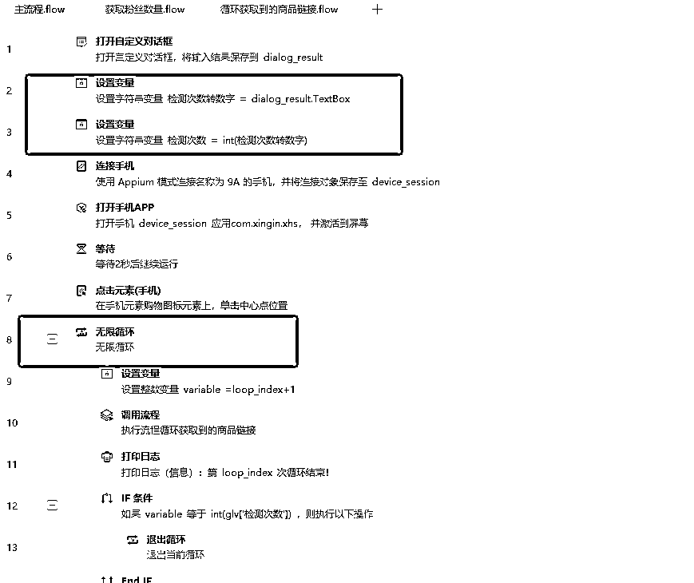

# 手把手教你使用影刀RPA批量获取小红书低粉爆款的商品！全自动解放双手！

> 来源：[https://riodtlbegu.feishu.cn/docx/EkcLdKXHSowEJ1xsX67csVhunad](https://riodtlbegu.feishu.cn/docx/EkcLdKXHSowEJ1xsX67csVhunad)

# 前言：

这个脚本适合有有一定影刀RPA基础的小伙伴使用，不然的话看起来会很复杂!实际上并不难，只是代码看起来比较多，我自己学习影刀也就几个礼拜的时间！

今天主要讲的是思路，就算是别的脚本，到时候也可以根据这个思路去写，而不是只会学习写这一个代码

这个脚本是在手机里面运行，在我这边能流畅运行，在你那边可能不能运行，所以分享给你也不一定有用。

所以讲清楚原理，可以自己去尝试写写看！

最后也会附上所有的代码，可以拿来参考！

# 一.先上操作视频！

获取到第一个低粉爆款商品链接从28秒开始！

获取到的链接分享效果从45秒开始。

## 1.1 视频演示

## 1.2 批量抓取小红书商品的销量视频演示

# 二.需求挖掘：

## 2.1 为什么要写这样一个脚本

因为很多人在刚开始接触小红书电商带货，卡在了选品阶段.

买一些数据网站的会员又比较贵，对新手不是很友好，所以很多新手选择了刷对标账号，自己跟品

然后自己跟品的话又是非常浪费时间，并且很无聊的，并且这个动作也有重复性，适合用RPA

注意:任何有重复性的动作，都可以考虑使用RPA来解放双手！

根据这个需求，我就有了这个想法可以尝试写一个脚本来获取低粉爆款的商品！

思路来源于：https://articles.zsxq.com/id_xwveu3e0usfv.html 书豪的这篇文章的选品方法一！

# 三.如何开始：

## 3.1 想法如何转变成脚本

深入了解需求，我们抓取的商品要是 销售量>100，并且粉丝数量<200的

我们先在自己的手机里面试着手动抓取商品链接，

### 1.模拟手机手动抓取：

#### 手动抓取详细的步骤为：

1.打开小红书app

2.点击左下角的购物按钮，会出来商品链接

3.点击商品链接，查看销量

如果销量>100，点击店铺图标，查看粉丝数量，如果粉丝数量<200 就返回记录商品链接

如果粉丝数量>200 就返回到购物页面，点击下一个商品链接

如果销量<100，直接返回购物页面，点击下一个商品链接

### 2.流程图：

制作流程图，有助于我们理清自己的思路，方便我们在写代码的时候思路更清晰，不会乱！

可以把每个部分制作成子流程，方便优化代码的时候方便查看，编辑，这些要养成习惯

如果有遇到报错，等异常代码，也更方便修改！

# 准备阶段：

## 1.配置电脑端环境：

来自官方文档：https://www.yingdao.com/yddoc/topic-basedDoc/a5c87b1d3996d052c4d24649863a4e9d.html?

第一步：打开影刀首页的设置中心

第二步：点击 ⌈ 自动化插件 ⌋ 中的 ⌈ Android 自动化组件 ⌋

第三步：点击之后，手机管理器打开后会自动检测当前机器是否已安装自动化环境。未安装则会提示用户安装，若已安装，且手机已开启调试模式，会自动连接当前手机

第四步：点击"立即配置"

第五步：等待环境安装成功

第六步：安装成功后，会自动启动内置安卓自动化组件。同时影刀管理器进入扫描设备状态。只要将开启调试模式的通过数据线连接电脑即可连接

## 2.配置手机端环境：

来自官方文档：https://www.yingdao.com/yddoc/topic-basedDoc/7dc8582d60cea069e994d96d84531ea6.html?

我使用的手机是 小米9A

1.手机开启开发者模式

2.手机开始USB调试，数据线连接电脑之后选择文件传输

具体可以看这个官方文档里面的视频：

电脑端和手机端的环境都配置完了之后，尝试在影刀的手机配置器里面连接

第一次连接他会自动下载影刀的插件，一直点同意就可以了！

如果你想更快掌握影刀手机脚本，推荐观看这个官方视频：

影刀RPA中级课程：12 手机自动化：

https://www.bilibili.com/video/BV1Zk4y1w7HA/?spm_id_from=333.337.search-card.all.click&vd_source=14a3ed1caf691b990c61aad056f9fc03

# 开始阶段：

## 第一步：确保手机能正确连接

只有保证这步能正常执行，才能执行接下来的所有步骤！

如果这步没有搞定的话，就去重新看上面的官方文档，如果自己实在搞不定，也可以联系官方人员远程帮你操作！

我刚开始测试模拟器连接，一直都不行，也可以联系官方人员帮忙处理的！

## 第二步：根据流程图写代码

### 流程图第一部分：

连接手机之后，第一步打开小红书APP

直接使用 打开手机APP的命令，具体配置如下

如果APP包名那边是空的，在影刀手机管理器里面打开小红书app，这里点击右边的获取就可以获取到了！

打开小红书app之后还需要点击购物按钮，才能跳转到商品链接

我们使用：

这里的购物图标元素，直接捕获元素就可以直接捕获了比较简单！

这里加了一个等待2秒的动作，是因为有时候手机比较卡，打开小红书账号页面还是空白的，所以加2秒的等待

至此，我们流程图的第一部分已经搞定了！是不是很简单

### 流程图第二部分：

首先需要获取到我们要找的商品链接

直接使用 获得相似元素列表(手机) 就行！这个也比较简单.获取到的列表我们自定义名称为：商品链接_element_list，也可以使用别的名称，只要方便自己记就行，养成好习惯！

然后使用 循环相似元素(手机） 依次点击我们获取到的商品链接，在单独在商品链接页面内进行判断销量和粉丝数量！

### 流程图第三部分：

#### 第三部分准备工作：

第三部分也是比较关键的部分，我们的核心代码都在这边，我们要点击到商品链接之后

依次判断 销量和粉丝数量！

注意！！！注意！！注意！！：

这个时候我们需要捕获很多元素，包括返回，分享，微信图标等等！

这里有两个元素需要注意，我们使用直接捕获是捕获不到的，或者捕获到了换了一个商品链接就没办法校验了

所以我们需要使用Xpath定位，我这个也是现学的，看完视频，马上测试就成功了！在我们这个流程中也不难

官方教学：

https://www.bilibili.com/video/BV1Zk4y1w7HA?p=7&vd_source=14a3ed1caf691b990c61aad056f9fc03

这两个元素分别是:

已售数量的元素：//*[contains(@text, "已售")][1]

粉丝数量的元素：//[contains(@text, "粉丝")]/preceding-sibling::

注意，元素的定位方式要选择：Xpath！

这样我们就捕获到了我们所需要的所有元素，总的元素很少，这里我有一些还重复了！

接下来只要根据我们的流程图，一步一步走就可以了！

#### 第三部分开始：

我们首先观察流程图，我们要做的就是先判断已售的数量

在第二部分结束的时候，这个时候我们的手机页面已经进入了一个商品链接，

因为我们又已经获取到了已售元素，所以我们直接获取已售元素的文即可

使用命令：获取手机元素信息

注意：

我们这个时候获取到的元素的文本内容大概是：已售4.4万 或者 已售328

有两种形式：

一种带【万】字的，

一种没有带的！

1.判断 已售数量元素 有没有【万】字！

如果有【万】字，我们把元素的 数字部分记录下来 *10000 就是具体的销售额

如果没有【万】字，我们直接获取元素的 数字部分，就是我们的销量！

具体代码如下：

这样我们就判断完了已售数量：

接下来的思路根据流程图走：

#### 判断已售数量>100

如果销量>100，我们通过我们模拟手机抓取过程发现

我们可以点击左下角的店铺图标，这个时候我们就可以看到粉丝数量，并且获取到！

具体代码如下：

因为这里要获取粉丝数量，但是这个时候代码现在太杂了

我把获取粉丝数量单独弄成一个子程序，拿来调用！

B获取粉丝数量子程序代码如下：

##### 获取粉丝数量：

这个时候，获取粉丝数量子程序就会返回对应店铺的粉丝数量！

这个时候我们要注意，跟已售一样

我们获取的粉丝数量也有两种形式：

一. 2.8万

二. 3266

这样两种类型，我们也要分别对这两种进行判断

判断的依据是，文本里面是否带【万】字

有的话: 数字部分*10000

没有的话: 最终粉丝数量=数字部分

这个跟已售一样，不多做赘述！

* * *

##### 判断粉丝数量>200

根据流程图的思路走：

由于上面已经判断了已售数量是>100，并且我们获取到了粉丝的数量：

这个时候我们只需要判断粉丝的数量即可：

如果粉丝数量>200

因为我们这个时候点进店铺头像，是个人主页的页面

我们需要返回上一个页面，就是商品链接页面

点击右上角三个点，点击分享到微信

分享到我们设定好的微信好友或者微信群聊！

###### 导出目标链接到微信

具体代码如下:

##### 判断粉丝数量<200

###### 直接返回到商品链接页面

如果粉丝数量<200，我们直接就返回商品主页面

注意，这个时候我们进入的是个人主页的页面

我们需要点击两次返回

一次返回到商品连接页面

第二次返回到购物主页面

这样才能保证能继续点击下一条链接

* * *

#### 判断已售数量<100：

如果销量<100,根据我们构建这个脚本的想法，我们直接不要，并且返回到购物主页面，

中间要用到返回，使用点击屏幕或者点击元素都可以！

准备点击下一个商品链接！

具体代码如下：

###### 直接返回到商品链接页面

注意:中间的点击屏幕，是点击我手机里面返回键的位置

因为我们我们发现已售数量<100，这个时候还在商品链接里面，

这个时候想要点击下一个商品链接，需要先返回，才能获取到下个商品链接，不然会报错！

这个代码是 IF 代码，

我把销量>100 写在IF里面

所以这里 销量<100，我写在else里面

### 第一阶段代码结束

* * *

# 第三步：调试阶段

以上核心代码写完之后，我们已经可以开始简单的运行

1.检测脚本是否正常

2.检测脚本会不会报错，如果有报错，就记录报错的原因

3.脚本能正常运行，但是一直循环等等

分享几个我前几版遇到的问题，并且是如何解决的。

如果你刚好也遇到了，可以直接解决！

注意！！注意！！注意！！

每次运行能正常，但是要加代码的时候切记一定要备份了在备份那边写

我这个也备份了好几个版本，就怕哪里改了 就出错 改不回来了！

#### 1.可能遇到的报错

报错1：匹配到多个元素, 无法唯一定位

这个我遇到的是 已售元素 匹配到多个元素，绝大多数商品都正常的，但是其中一个商品有两个 已售元素

解决方法是：//*[contains(@text, "已售")][1]

在最后加[1]表示获取前面一个！

报错2：循环的时候下标超过最大值：

这个时候看看是哪条指令错误，检查对应的指令是哪个元素，

我遇到最多的就是商品链接 提示这个

原因为：手机页面卡在个人主页页面或者店铺页面，获取不到商品链接，所以报错！

解决方法是：增加放回到购物页面动作

报错3：商品没有已售，销量为0，脚本获取不到

直接在 获取元素对象(手机)里面设置，并且加上代码

如果已售数量=0，直接进行下一次循环！

报错4：商品主图太长，获取不到 已售元素，

解决方案：增加 屏幕上滑动作

我的手机坐标大概是：

小米9a手机可以参考!

别的基本没有什么大问题了，有的话都是很简单的，自己就能解决！

#### 2.增加无限循环操作

可以固定次数或者无限抓取

注意：

我这边无限循环使用的操作是上滑！

就是获取一组商品链接完了之后，上滑刷新，获取新的商品链接

下滑也可以，但是下滑可能会重复，所以我设置的上滑

也可以设置成，通过关键词抓取对应类目的商品链接，这个我有空了会做出来！

一些报错都解决完了之后，就可以在整个循环代码外面增加一个 无限循环 命令，并且设置循环次数

这里可以用到全局变量

设置一个全局变量拿来当作循环的次数

具体代码如下：

并且设置一个自定义对话框，可以选择自己要抓取的次数！

设置好退出循环的条件，这样就可以固定次数或者无限次数抓取

也可以设置定时运行，每天定时或者设多少分钟定时获取等等！

定时运行在影刀主页面的触发器里面：

可以根据自己的需求设置:

# 第三步：增加稳定性，设置容错

推荐观看影刀官方视频：

影刀RPA中级课程：03 异常处理

https://www.bilibili.com/video/BV1Uh411u72J/?spm_id_from=333.999.0.0&vd_source=14a3ed1caf691b990c61aad056f9fc03

我这个脚本里面的异常处理主要是使用

Try命令和Catch命令

简单解释： Try命令和Catch命令

如果脚本正常运行的话 ，这段代码就跟没有一样

如果try里面的代码报错了，就会转入Catch命令！执行里面的代码！

#### 我的异常机制处理：

##### 1.首先记录错误信息

##### 2.通过错误信息判断问题，并且解决，我一般遇到的是获取不到商品链接，这个时候我卡在个人主页

所以我点击了两次返回，并且进行上滑刷新动作！

##### 3.跟2同理！

# 总结：

影刀RPA适合有很多重复性的动作，我学习影刀的初衷也是希望自己平常的工作中也可以用到上.

今天讲的思路适合做很多平台，包括抖音，视频号等等

这几天刚好给自己写了这个脚本，希望这个分享对你有帮助！

本人刚开始做小红书电商，如果你喜欢影刀RPA或者正在做小红书电商·

希望可以多交流！

本次代码中也有很多不足的地方，有影刀大佬的话可以多多指教！

往期跟RPA有关的文章：

## 本文所提到的所有链接：

1.思路来源于：https://articles.zsxq.com/id_xwveu3e0usfv.html 书豪的文章【小红书单店铺单月6000+利润选品保姆级教程】

2.影刀配置电脑端环境：

来自官方文档：https://www.yingdao.com/yddoc/topic-basedDoc/a5c87b1d3996d052c4d24649863a4e9d.html?

3.影刀配置手机端环境：

https://www.yingdao.com/yddoc/topic-basedDoc/7dc8582d60cea069e994d96d84531ea6.html?

4.影刀RPA中级课程：12 手机自动化：

https://www.bilibili.com/video/BV1Zk4y1w7HA/?spm_id_from=333.337.search-card.all.click&vd_source=14a3ed1caf691b990c61aad056f9fc03

5.Xpath定位，官方教学：

https://www.bilibili.com/video/BV1Zk4y1w7HA?p=7&vd_source=14a3ed1caf691b990c61aad056f9fc03

6.影刀RPA中级课程：03 异常处理

https://www.bilibili.com/video/BV1Uh411u72J/?spm_id_from=333.999.0.0&vd_source=14a3ed1caf691b990c61aad056f9fc03

# 完整代码奉上：

本人也是0编程基础学习了几个星期做出来的

代码肯定有不好的地方，有影刀大佬也可以交流一下！

核心流程太长了，

这几天会简化一下，多设置几个子流程

这块自己还不是很熟练，还在学习中

后续可能会出搜索关键词，抓取低粉爆款商品！

## 图1.主流程

## 图2.获取粉丝数量

## 图3.核心流程循环获取到的商品链接：

