# 爆肝8000字｜小红书副业一年涨粉10W+，如何从0做赚钱的小红书IP号？

> 来源：[https://oq30tjbwlph.feishu.cn/docx/FqIpdNxlPoXw48xbsF0cS3DJnof](https://oq30tjbwlph.feishu.cn/docx/FqIpdNxlPoXw48xbsF0cS3DJnof)

大家好我叫丁小翼，是今年刚加入的生财萌新，30岁后今年7月开始不上班，目标40岁退休～

承蒙生财众多大神投喂高质量帖子，今天我也来毫无保留分享我的起号经验，

希望能给正在做小红书IP号的圈友一点启发，就值得啦。

先发下我的小红书成绩，是我下班做的副业，在去年实现了1年涨粉10W+，没有花过一分钱，纯自然涨粉。

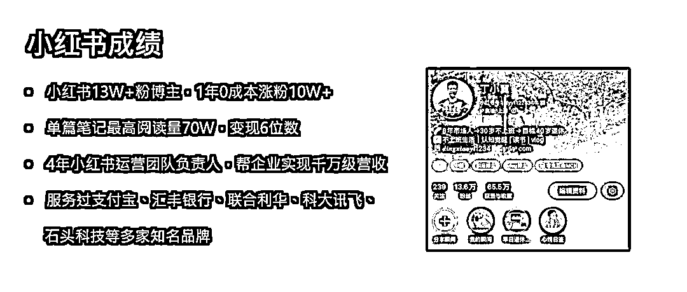

# 一、动机：我为什么选择 all in 小红书？

先聊动机，是我觉得它比方法重要，我们可以模仿一个人的结果，却很难模仿TA的动机。

我真心建议，在没搞懂这个问题前，不要轻易做小红书。

这个问题就是：你究竟出于什么目的，做小红书？

如果你的回答是“赚钱”，说明你没有想清楚。

只是大家都说小红书赚钱，于是你也想要试试。

事实就是：90%以上的人小红书做不起来，就是没有“以终为始”的思维。

如果看不清终局，就特别容易在过程中迷茫、放弃。

每个人做小红书的动机，我把它分为5层：

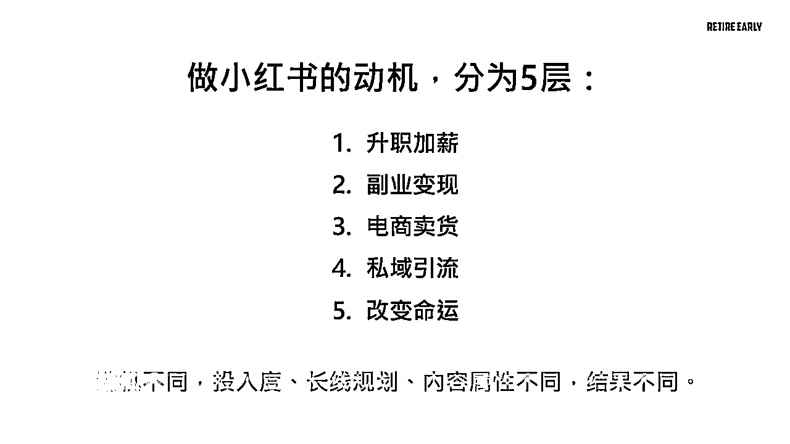

每一层不分高低，但每一层心态、目标和打法，是完全不同的。

## 第一层：求职/升职加薪

你没看错，我们大部分都是打工人，自媒体并不是主业。

如果是从事市场/运营相关工作，或者想要转行进入该领域，

小红书就是短平快的敲门砖。

怎么做？非常简单，你直接做合集类账号

——书单合集、电影合集、APP合集等等，

只要掌握了笔记创作技巧，数据会非常好看。

我有个案例，她就是这样，通过小红书高赞藏的图文，放到简历里就很亮眼：

累计XX万浏览量，XXXXX个赞藏，熟练掌握选题、文案、排版、运营等创作技巧，网感好XXX

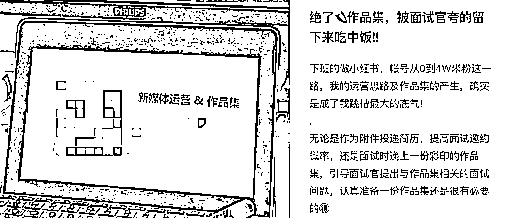

类似这种，可以做成作品集，放到简历里

我自己做市场负责人时，也会优先招有个人小红书经验的，沟通起来就很顺畅，脑子也活络。

这样做投入产出比很高，你不需要考虑什么人设，也不需要拍摄图片、做视频。

文案都可以用AI写，模板化操作， 换来一个数据不错的账号。

## 第二层：副业接广变现

这是大部分人做小红书的理由。

因为小红书的确是对新人最友好、接广最容易的平台。

但是，你也得搞清楚，到底接广告需要什么条件？

你想接到什么类型的广告？你期望广告每月带来多少💰？

先说接广的条件，简单来说有3点：

有人设、有广告位、数据相对好且稳定。

这样一看，第1个的目的的号，就达不到要求。

所以你是接广目的，就不要问”为什么我的号数据挺好，但是接不到广告了“。

再说广告的类型，你做读书/知识类博主，

能接到的广告基本就两种：1是图书、2是课程。

特点就是广告预算不高。尤其是图书，大多是置换，几万粉只有几百元预算。

想接其他类型的广告，你该做的事是“换赛道”，而不是在原有的赛道上死磕。

不然，更新100篇笔记，也只是感动自己。

目的不同，倒推的行为、方法完全不同。

## 第三层：电商卖货

如果自己有货源，或者之前有过电商经验，以这个为目标是最合适的。

怎么开店、选品、卖货等详见这篇。

确定好卖的东西很重要，直接影响笔记的打法。

比如，你是卖纸巾的，大众刚需品，

笔记就是图文堆量，直接发。

点赞、收藏数据都不重要，几个赞也不影响出单。

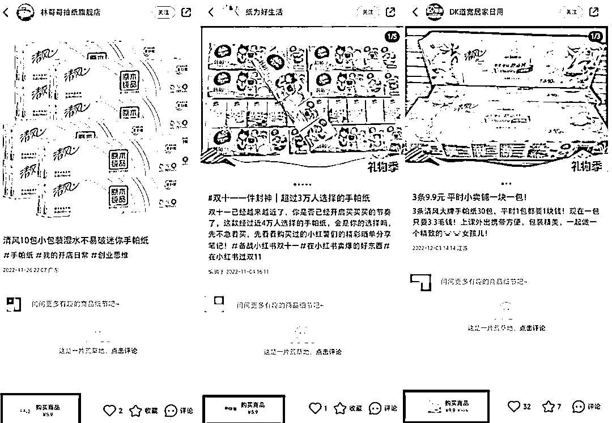

那如果你是卖高颜值的小东西，

打法又不一样了，封面图一定要好看！

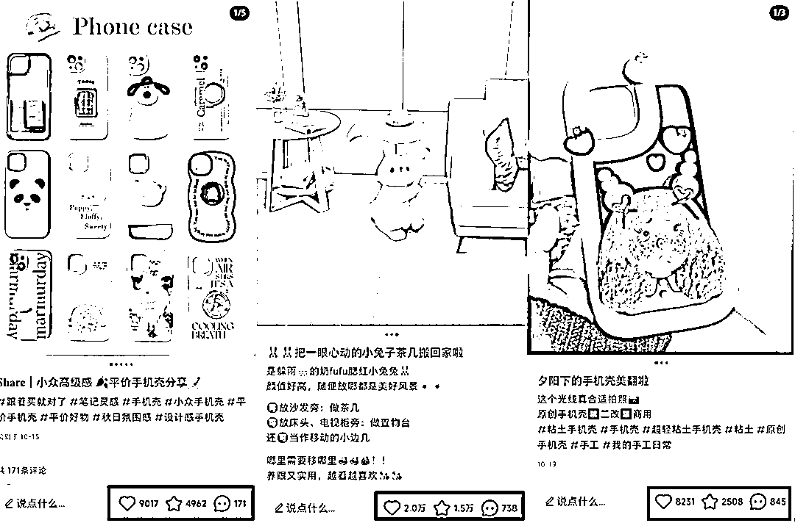

那如果是卖知识付费/资料类的产品，内容就一定要有干货、要利他。

不同产品有不同的侧重点，整体而言，带货笔记的评论，比赞藏更重要，另外发布笔记的频率会非常高。

因为你不需要用户关注你，只要TA能刷到你的笔记，有冲动下单就好。

## 第四层：私域引流

重要的不是在小红书接广，也不是卖货，而是引流到私域，再进行变现。

比如卖虚拟资料、付费群/知识星球、高客单价产品、公众号涨粉等等。

如果你的主阵地在公众号，可以持续发征稿/投稿/写作赚钱的笔记。

或者思路打开，你的重心不应该放在小红书内容上，而是投放上。

批量投放一堆性价比高的素人博主，就能帮你达成引流目的。

几百粉的素人博主，安利你的公众号，就有可能出爆文，投放费用便宜，投产比高。

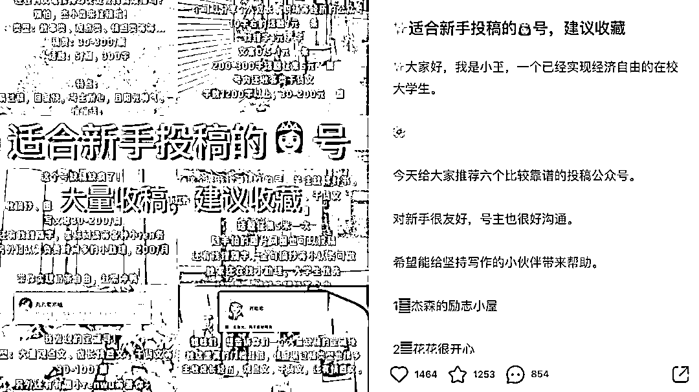

然后你的重心放在经营好公众号，承接好来的流量就可以了。

再说下高客单价产品。

如果是小众的高客单价产品，本来受众群体就少，不容易出爆款。

所以内容策略，主要是找精准粉丝，用50-100篇笔记，把你所在行业的关键词全部覆盖上。

因为小红书占比最大流量，是搜索流量，用户搜关键词，能刷到你的笔记，就会持续有精准咨询。

## 第五层：改变命运

最后这点，看似跟第二点”副业变现“很像，但心态和目标，是完全不同的。

也就是说，你已经不满足做个副业赚点小钱了，你期望把它做成你的个人事业：打造IP、打通公私域、拥有多个变现路径等等。

你真正把它当做生意，生意就要有起步资金，有商业模式，有现金流测算。

那你的投入度、你的长线规划、你的内容属性，一定是不同的。

当然，这条路是有些门槛，需要一定积累的。

可能有50%的人，会从小红书上赚到钱，但1%的人会改变命运。

我们可以从“副业变现”慢慢过渡到“改变命运”，不用着急。

我自己从2016年注册小红书，有6年时间了，正式开始玩是2019年，当时基于摄影兴趣发了小红书，几乎靠1篇爆款涨粉到了1w+，但是因为我的动机不够强，后期就荒废没管了。

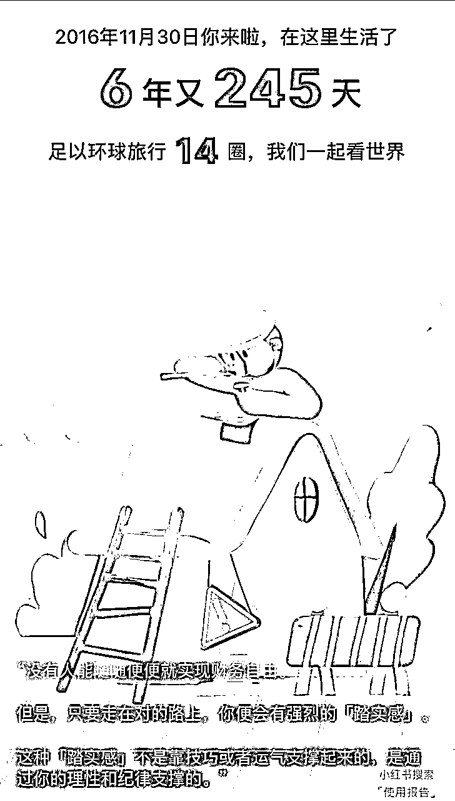

到了去年，我非常清楚地明白，这一次不是一时兴起做做，是冲着做成个人事业，改变命运去的。所以我的投入度、长线规划、内容属性，一定是不同的。

我看到很多朋友小红书做不起来，先不说方法，在心态和动作上，需要先问自己：all in了吗？全力以赴了吗？

我特别看重 “以终为始”的思维，做小红书，首先想清楚why，why想得越透彻，动机越强大。

# 二、变现：新手做小红书，反而更好变现？

这部分给到刚接触小红书的小白朋友，大白可以跳过哈～

因为工作的关系，我负责管理过各个公域平台的流量获取。我太清楚哪些平台适合专业团队，投入资金重，不适合个人起步了。

在这个过程中，我发现小红书是新手开启公域的最好平台，没有之一。

为什么这么说呢？

新手做小红书有几点优势：

1、平台去中心化，素人号也能千赞爆款笔记

相比于公众号的半私域，抖音的机构化，

小红书对完全去中心化的流量机制，

让0粉素人被看到的可能性比其他平台更大。

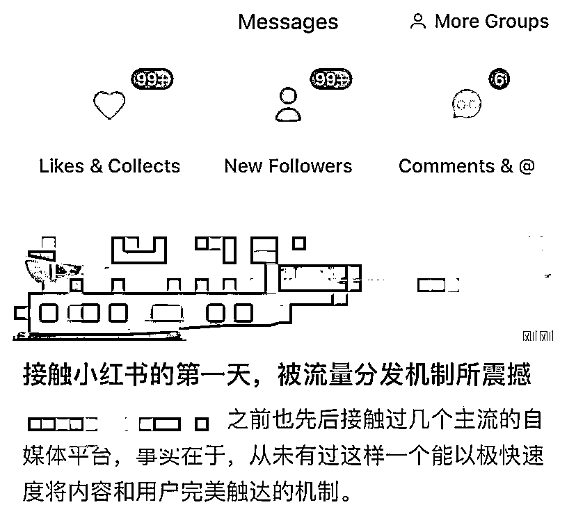

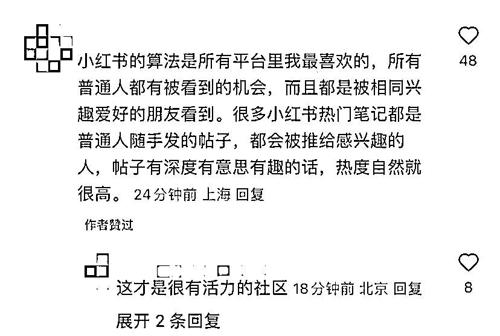

2、离变现近

几千几百粉，甚至几十个粉丝就能变现。

不用像其他平台要熬到变成KOL或大V，

很多品牌其实更倾向于投素人号。

3、粉丝价值高

用户画像是一二线城市、年轻、消费力强的群体。

总结单粉价值：小红书>B站>快手>抖音，1个抵其他平台甚至10个。

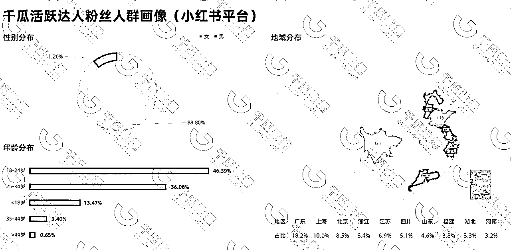

4、客单价高，带货转化率高。

如果你做中高客单价女性群体，那做小红书是最佳选择，没有之一。

那很多朋友好奇，做小红书，到底怎么赚钱，有哪些途径呢？

我在这里总结了6大变现途径：

## 1、好物体验

适合1000粉以下的新手博主，如图 点击左侧好物体验，大牌新品都可以0元体验。

收到后，发布真实体验笔记就可以了，具体流程我都给你整理好了：

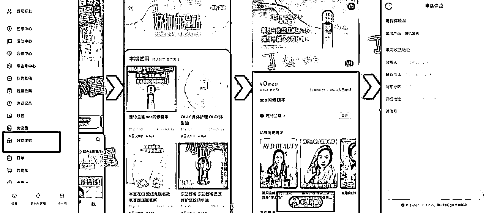

## 2、品牌合作

这块是我小红书的主要收入来源，适合任何赛道的博主。

如果你粉丝过了1000，恭喜你可以开通合作中心，点击左上角的三条杠-创作中心-内容合作就可以开通。

然后就可以设置你的广告报价，报价一般是你粉丝数的10%，品牌方就会来主动联系你啦。

当然我们还可以主动出击，如图在这里报名你心仪的品牌，写上理由，增加被选上的几率。

报名流程我也给大家整理好啦：

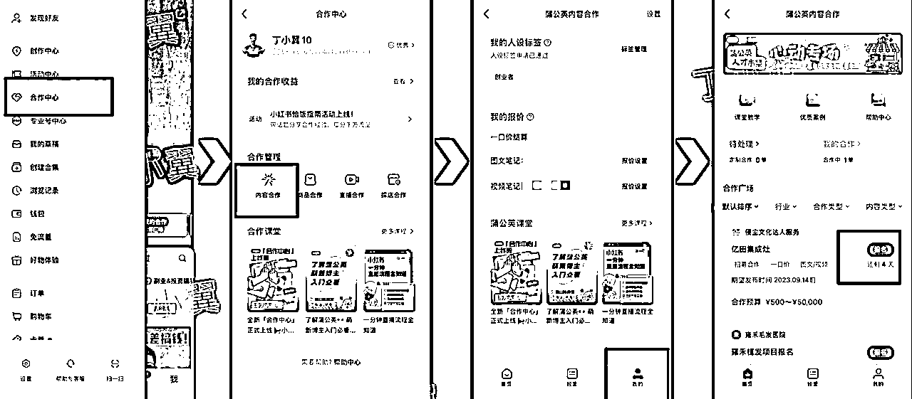

## 3、商品合作

不需要直播，发笔记也能带货赚钱。

点这里，可以任选你想要带货的商品，不仅能免费拿样品，发笔记带货还有佣金，

特别适合笔记种草类、好物分享博主：

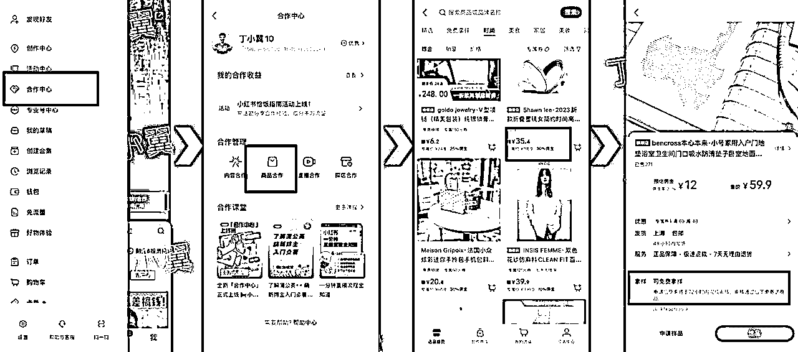

## 4、探店合作

这个很多人还不知道，从下图报名不仅能享受免费餐食，还有流量扶持

超级适合爱吃、爱玩、爱旅游的博主：

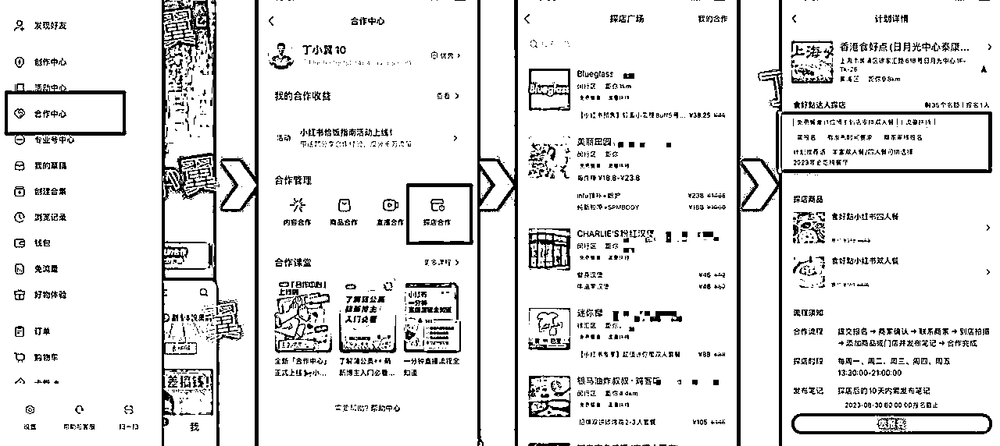

## 5、直播合作

这是今年小红书的超级大风口。

如果你表达不错，可以在这里直接选品带货，还能根据粉丝画像定制选品单。

做得好呢，官方还会拉群，给予流量和运营扶持，

可见小红书真是为博主变现操碎了心，大家一定要好好利用起来！

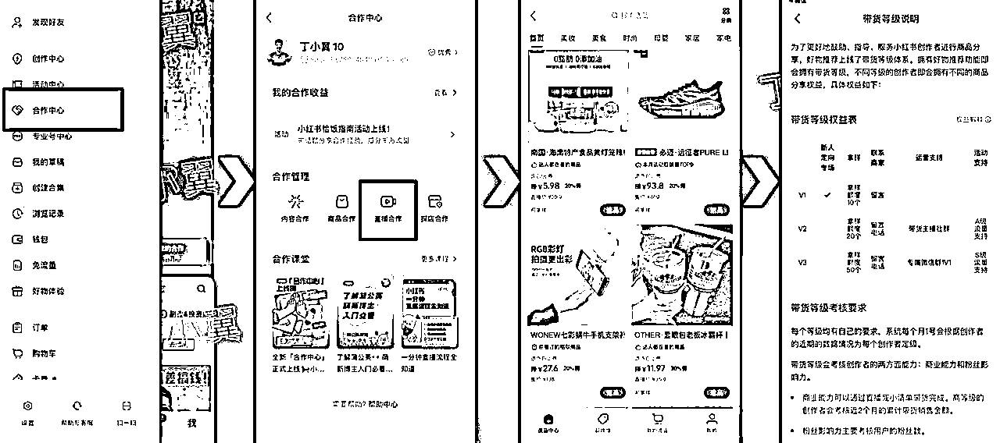

## 6、0粉开薯店

这个之前有详细出过教程，0粉丝就能开通，

官方还有培训课程和流量扶持，自己有货源最适合这种变现模式了，

火了1条就能带来爆单。最新开通流程如下：

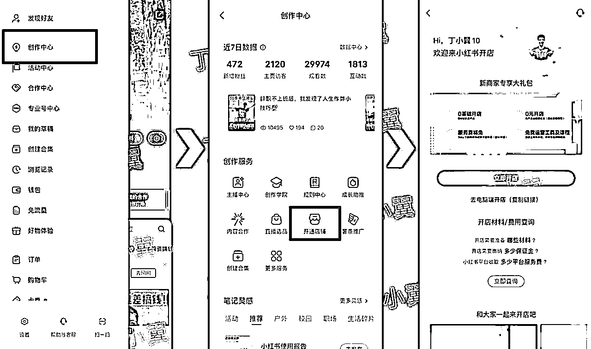

其他之前有过的小清单、专栏等方式，目前已经下线啦。

做好上面这6种的1-2种，收入就不会差。

其实小红书的变现路径，还不止平台这几种。水面下的，比表面上的赚钱机会更多。这个之后我们可以深入探讨

那知道了赚钱途径，那怎么能够成为这样的账号呢？

接下来聊聊我自己的经历故事。

# 三、1年广告报价翻20倍，有爆款公式？

有个品牌PR，他最早跟我合作的时候，我的报价是500，之后再来复投，我的报价10000+，他说怎么一年不见，我的报价涨了这么多？

这一刻我意识到，我也成为了甲方口中，价格一年翻N倍的博主了。

但是，刚开始做的时候，我跟大家一样，该经历的过程一样没少经历：

流量瓶颈、数据焦虑、账号违规提醒等等，尤其是图文转视频那段时间，给你们看下我的“黑历史”：

这背景、这封面、这口播、这剪辑，就不播放给大家看了，因为现在我都不好意思再看。

所以我和大家一样，第一次做视频的时候，1个1分钟的视频，要录1个小时，剪辑还要搞好久。

包括我认识很多老板，别看他们平时有多牛，经常开会演讲啥的，到了拍短视频也是从头学起，面对镜头很不自然，这都非常正常。

你运营过再大的号，做自己的IP号，还是一样有很多东西都要学习。

好在做自媒体是非常公平的，只要你掌握了方法，花时间精力下去，就会迎来一个转折点。

我的转折点在去年7月底，也就是说我努力了半年多，粉丝也才刚到2万。直到7月底有一条视频，突然爆了，给我带来了上万粉丝，然后我也迅速抓住机会，小爆了一些后，10月又迎来大爆款，粉丝指数级增长。

也就是说，同样的付出，下半年的涨粉数，是上半年的4倍。

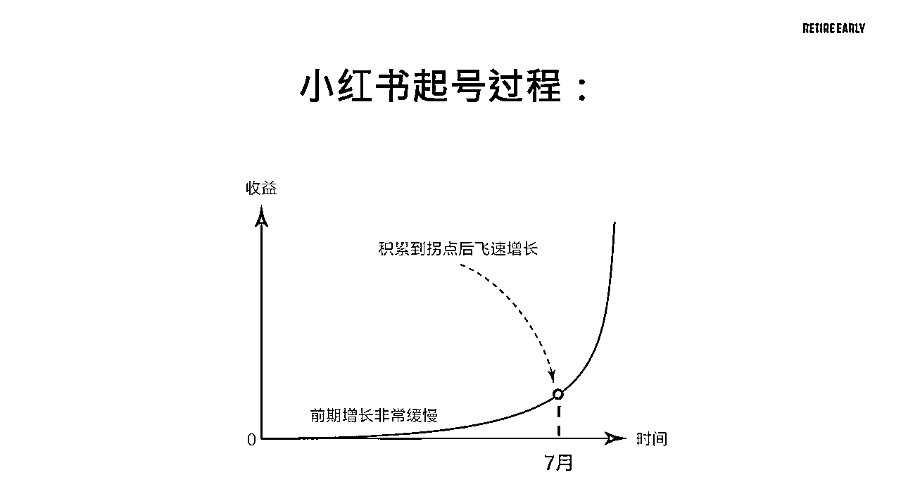

所以做自媒体最难的部分，就是从0到1这个阶段。公域就是去搏爆款，你的粉丝80%都是爆款带来的。

新手发笔记，容易犯3个错误：

错误1：把小红书当朋友圈发

小红书已过了“INS美图”阶段，已经升级为“你的生活指南”，

重点强调利他！利他！利他！

重要的事说三遍。

你的内容能给他人提供什么价值？实用价值、情绪价值、谈资价值？

千万不要只顾自我表达，做自嗨或流水账式的内容，你不是明星。

说句扎心的，其实没人想看【你的】生活，

大家想看的是你的【生活经验】。

错误2：凭借个人灵感发内容

小红书的笔记生产是有科学的流程的，是有“套路”的

纯凭个人灵感，做个人专业领域的内容，

很可能在早期就遭受打击，丧失信心，内容也不持久，

而小红书却看重你的持续更新。

新账号有沙盒机制，持续更新才能提升账号权重，

迎合平台的算法机制，平台才能给你不断推流。

错误3：发的内容没有人设，沦为只涨赞不涨粉的工具号

看有没有人设的判断标准：

你的笔记如果别人拿去发，是不是也完全不违和？

如果谁发都一样，那你的笔记可替代性太高，读者为什么要关注你？

破解误区后，如何生产出一篇爆款笔记呢？我总结了一个爆款公式：

爆款笔记=50%选题+20%封面&标题+ 20%文案+10%话题&评论

我们一个个来拆解下：

## 1、选题定成败：

不要太相信自己的判断力，而要相信市场的判断力。

寻找被市场验证过的选题，有非常多的方法，比如：

-从对标博主的爆款笔记的热评里，找选题，点赞最高的热评，往往戳到了大家的痛点

-用小红书的数据分析平台，灰豚数据、千瓜数据、新红数据、蝉小红，任选一个都可以，找低粉爆款的选题（千粉以下）

-从小红书笔记灵感/每日热搜/官方活动里，找跟自己领域相关的选题

......等等

然后我们把定期刷的选题素材，放入选题库，模版如下：

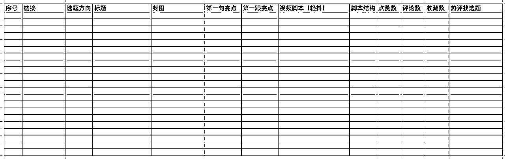

## 2、封面即标题：

在小红书的瀑布流下，封图的重要性相当于标题，比那个文字标题更重要。

没有吸睛的封面，内容做得再好，用户不点击也白搭。

所以，封面点击率，是小红书笔记最核心的指标。

小红书封面特点：

图片尺寸3：4、竖屏为主，占手机屏幕不到1/4大小

我们可以用6个维度，看下你的封面是否达标：

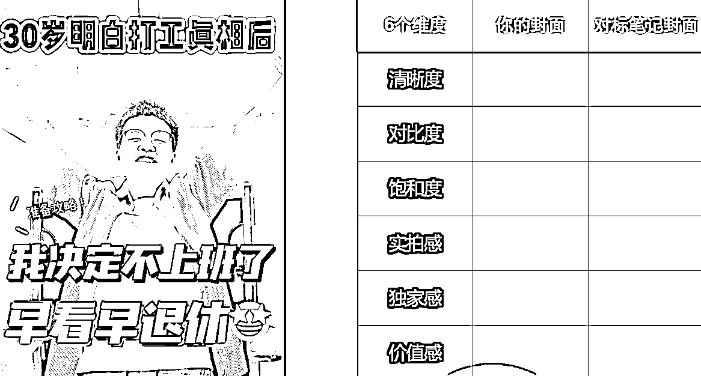

想要做出这样的封面，可以任选以下几个封面设计工具：

黄油相机、醒图、美图秀秀、稿定设计、Proknockout抠图工具、PPT

重点是先模仿，再超越。

比如我刷到小红书笔记的封面，90%一看就知道是怎么做出来的，

你是否能够还原爆款笔记的封面？先100%还原，再说有没有创新。

## 3、文案是灵魂

小红书的文字文案有字数限制，在1000字以内（包括标点、表情符号、话题字数），因此实际能写的字数最多约700字左右。

因此一定不要写流水账式的废话，实用、逻辑、情绪、有趣、真实，五样里至少得占两样。

跟公众号不同，小红书比较注重【速成】的结果，而不是冗长的过程分析。

小红书的文案是有套路的，我们可以用工具去多拆解爆款的文案的结构，在结构上完全可以对标。

## 4、互动撬流量

小红书评论的权重很高，评论权重>收藏>点赞

因此我们可以在笔记里就提前埋下钩子， 故意留下槽点、痛点、爽点，激发用户互动。

比如：评论里有没有正反两种观点？有没有统一的情绪？有没有人去讲自身的经历？3个里面占2个，就有爆款的潜质。

另外记得添加话题：就是发布笔记最后添加的#号，新手要尽量多添加推荐话题、热门话题，以撬动相关流量。

保证每一篇笔记都从笔记灵感那里发布笔记，而不是直接发。

看似简单的公式，其实每个点拆开来又有很多可以讲，严格按照公式去做，以10篇为一打，不出意外就会有爆文。篇幅有限，有疑问欢迎大家链接交流。

# 四、IP号起号最困扰的定位问题，怎么破？

在早期起号阶段，我发现最困扰大家的不是怎么做笔记，而是定位。

定位一般需要1对1针对性沟通，简单来说就一句话：

基于我XXX 的优势，我是一个能帮助 XXX 解决 XXX 问题的 XXX人

比如，基于我8年营销和小红书10W+涨粉经验，

我是一个能帮助 自媒体创业者 解决 小红书获客变现 问题的 小红书导师。

大家可以由此写一下自己的定位。

如果你实在不知道自己有什么特长，那请务必仔细深挖这3个问题：

1、你被别人夸奖过的点有哪一些？/请别人说出你的3个具体优点

2、别人是否愿意为TA夸赞的点，而为你付费？

3、到目前为止，你在哪件事情上花费时间/付费最多？

很多同学有优势而不自知，但是他人的评价、你花出去的时间、金钱是骗不了人的，这些将引导你找到最适合自己的定位。

## 1、关于定位案例

那又有同学问了，自己的积累确实不够，感觉没啥擅长的怎么办？

比如：我想做学习博主，但学历和学习成绩都普通，没那么好怎么办？

这是个好问题，不仅是学习博主，其他领域的博主，也会遇到同样的困扰，毕竟只有少数人是从事这个领域的专家。

我非常简单且有效的小思路，就是：

有时关键并不在于【你会什么】，而是在于【你可以持续学什么】，用户【想看什么】。

以学习博主为例，咱们看下这个账号：

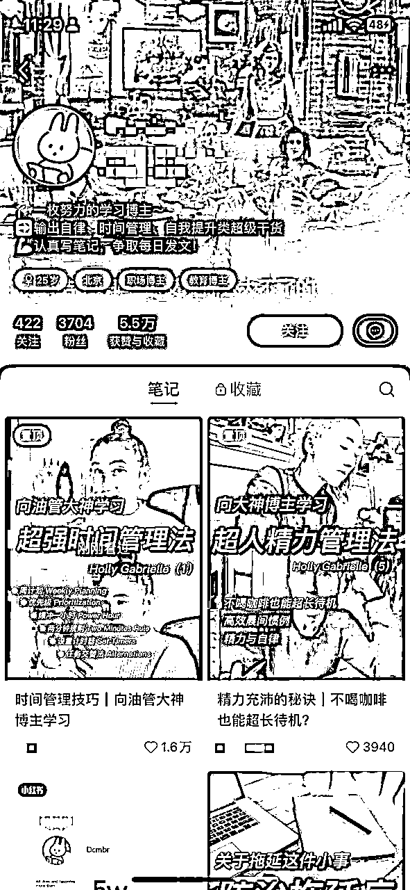

你看下她的选题内容，是更新油管大神博主高效自我管理系列方法，把方法总结翻译了过来。

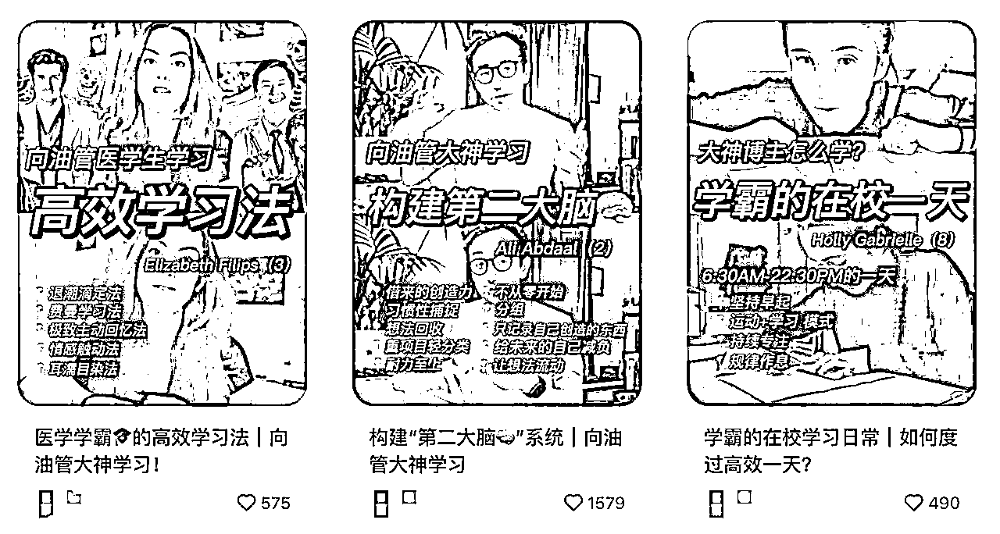

这样方法不需要自己原创，又有学习大神博主的背书，

而且可不止找一个学习博主，找几个优质且人气高的学习博主，就能够无限更新下去！

借此，博主发布的笔记数量不多，点赞达到了5.5万，粉丝也达到了3K以上。

那这种账号后续怎么变现呢？

其实目前这个账号已经可以接广变现了，只是会有点生硬。

后面可以结合大神的学习方法，发几张PLOG图片，慢慢过渡到自己去实践这些方法的日常上，

走干货plog路线，让跟自己有关的部分占比慢慢提升，从10%、20%到50%，这个账号就做起来了。

总结下，这个案例就是把油管的学习视频干货翻译过来，是信息差，同时也是作者在持续学的，用户想看的。

所以不用担心说“你喜欢也愿意持续做的东西，但自己还不够厉害”，很多事情你真的花心思钻研一周，你就胜过周围80%的人了，就可以拿来分享。

包括我看到生财很多帖子，都是圈友现学现做起来的。我印象比较深刻的两个案例，一个是“靠P掉路人，在小红书从0-1跑通了，一周变现过千”，另一个是“0基础小白，自学了AI小和尚说话的教程，赚到自媒体第一个4位数”。

所以，我总结了5点经验：

1、不需要等到“会什么”，再“做什么”。很多人会拿还没准备好，还不够强作为借口，但这两个案例中，博主都是由“我要做什么”，到“我要学什么”。

先做起来，在做的过程中，不会的立马学习，不需要到专业水平，够用就好。大部分技能，从0分到60分，只需要1-2天，60分已经超过很多普通人了。

2、再小的技能，有需求就有变现场景。如果你做自媒体还没有收入，始终去思考一个问题：我能帮助谁？解决什么问题？

3、踩在前人成功的肩膀上，不要担心“这个已经有人做了自己再做是不是没戏了”，信息差永远存在。

新手在红海市场里（已经存在的，竞争程度比较高的市场）更有机会，这意味着整个路径别人都替你跑通过了。

比如星球就是很好的信息源，可以用来搜索想学的技能，看到别人的详细教程直接自学，开干，中间有问题再搜索，整个流程跑下来，做项目的经验和信心，比赚到的钱更宝贵。

另外别小看这几百、几千块钱，它可比打工挣的同样数额的钱重要得多，是你独立跑通的一个闭环。

4、学会分享，把自己赚到第一块钱的过程分享出来，就是新一轮势能的开始。

比如这个小成功是不是可以写成经验贴？是不是可以发到星球里拿精华？是不是可以收徒？是不是可以卖工具？

由这一个小的成功作为杠杆，用“内容”放大这次成功，你的自媒体赚钱雪球，就滚起来了。

会有更多人像当初的你一样，看到文章来链接你，向你付费学习，然后你更加精进自己，从小白到小有所成，越分享越厉害，最后变成这个领域的大牛，如此正循环。

5、想都是问题，做才有答案。

我发现有很多新手太“珍惜”自己的账号了，这也不敢发那也不想发，一个月下来发个一两条，没有任何水花。

新手账号试错成本是最低的，大不了重新再来！

把账号想象成你养的猪，把猪养得多多的，让它为你赚钱，而不是把时间花在给猪梳毛上。

## 2、关于内容模型

至于账号持续发什么内容，也是有讲究的，我总结了一个：

721内容模型=20%干货合集 +70%专业经验 +10%人设故事

1、前期起号：20%干货合集。

也就是你所在领域，信息整合类的内容。

比如：

女性成长类：优秀女生必听8个高质量播客

摄影类：新手小白的九种万能构图教程

两性情感类：性知识不该从片里获得❗几本好书分享

这些盘点内容，会让你的笔记快速出圈，从而顺利起号。

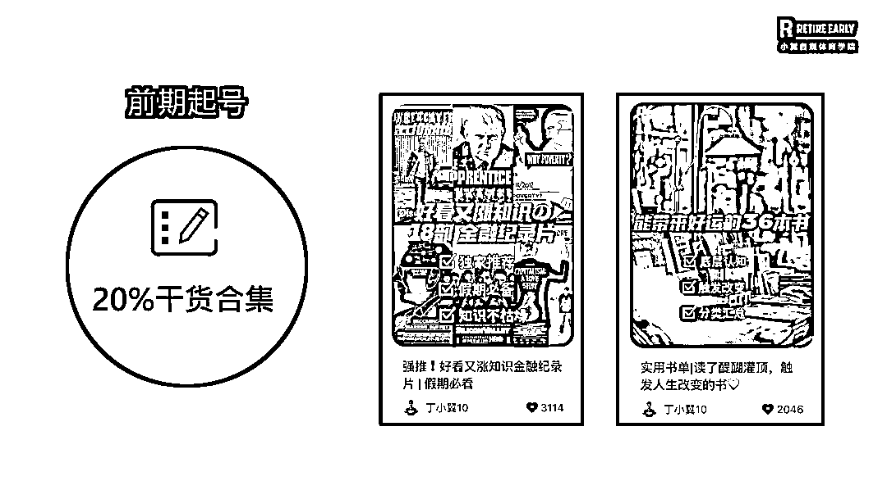

2、中期涨粉：70%专业经验。

因为干货合集往往涨赞快涨粉慢，

中期结合你的亲身经历、故事写出来的专业经验，帮你实现快速涨粉。

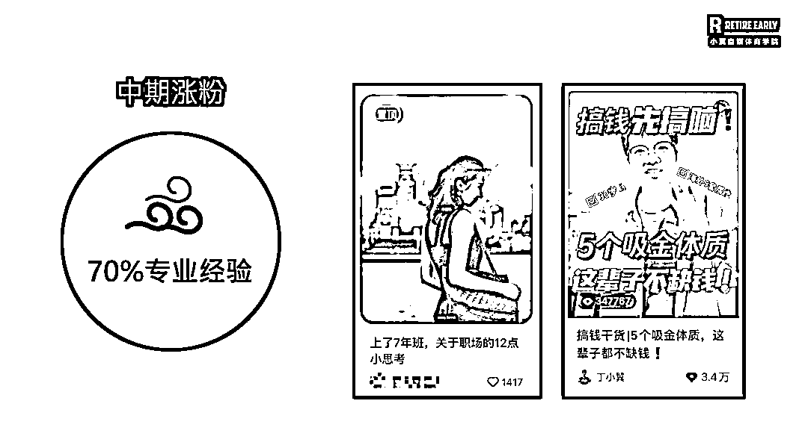

3、后期巩固：10%人设故事。

新手的一个误区，就是早期发个人故事，个人生活，没有什么人看。

因为你没有粉丝基础，人家根本不关心你是谁，

只有后期有了几万粉了，有一些铁粉了，这个时候发，才更有效。

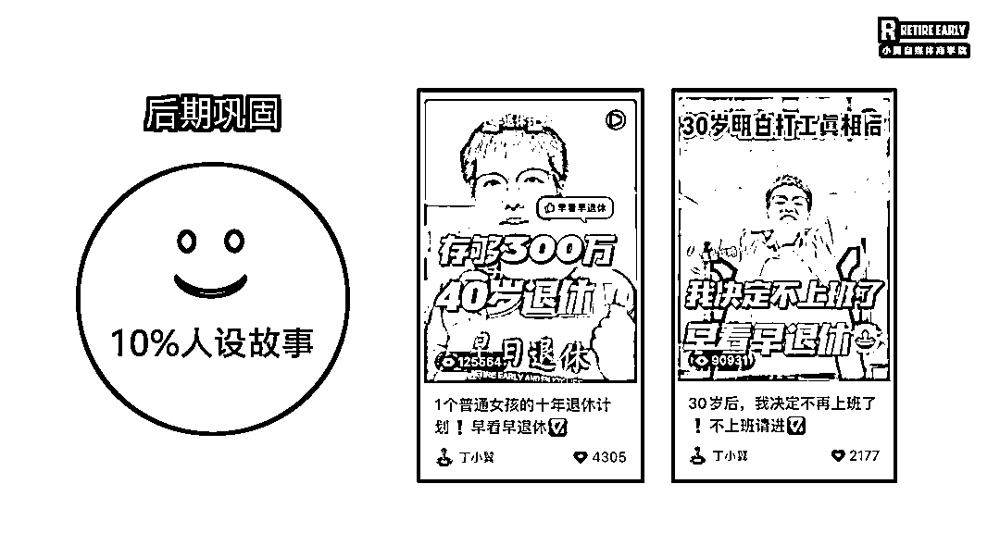

现在小红书已经进入了2.0时代，流量越来越分散，

平台开始扶持直播、笔记带货和商家付费投放。

留给普通人的就两条路，

1、要么做个人IP，顺应平台规则，接广变现；

2、要么做低粉高变现的账号，适合有技能、有产品的人，小红书仍是精准客户最多的平台。

至于各个具体的行业怎么做，我自己做了个小红书案例库，只筛选普通素人可直接落地的案例。

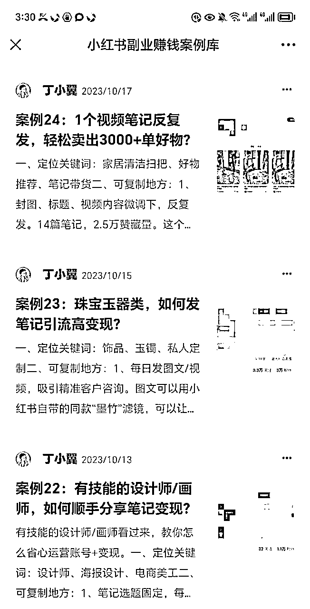

# 五、想拍口播/vlog，如何低成本做桌面博主？

这部分是想给低成本做口播/vlog博主的圈友，一个最常被问到的问题：

小翼，我也想做小红书博主拍vlog，但是我的家不好看，拿不出手怎么办？

这个问题，好办！

只要一张书桌，下班后你也能副业赚钱，不再害怕失业。

去年，我把出租屋的书桌由这样，

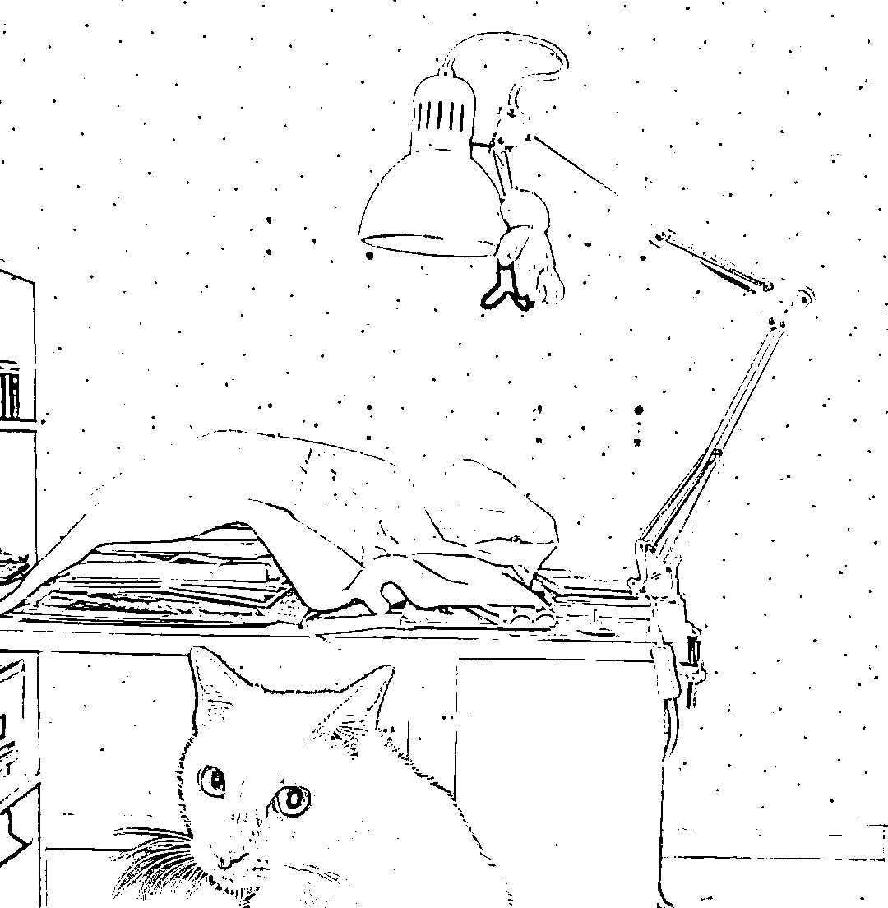

改成了这样⬇️⬇️

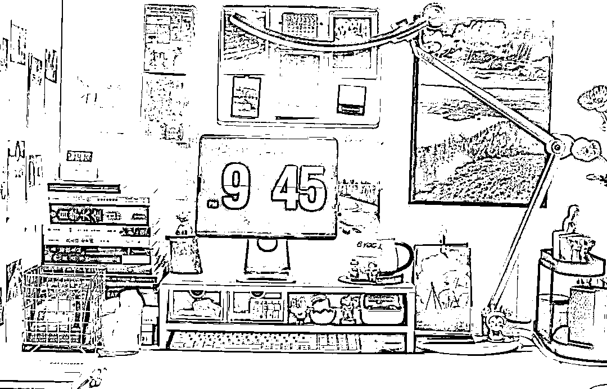

这个可能没有博主敢讲，我将毫无保留分享我的桌面改造方案，

让新手也能快速上手做博主，拍好桌面vlog。

## 1、想做博主？从改造桌面开始！

很多职场人都想做博主，但担心知识储备不够，家里也不够好看。

没关系，不需要花钱改造整个家，只要花1个周末改造下书桌，就足够你拍视频了。

在这里分享读书笔记、学习过程、职场经验、生活感悟等都可以，

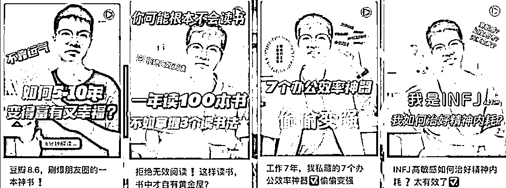

即使你不是牛人，观众看到舒服治愈的画面，也更愿意看下去。

而且，它的变现比单纯的口播更容易，你想啊桌面上可以放的东西（植入的广告）太多了，

新手在小红书接广的渠道，我给你整理好了：

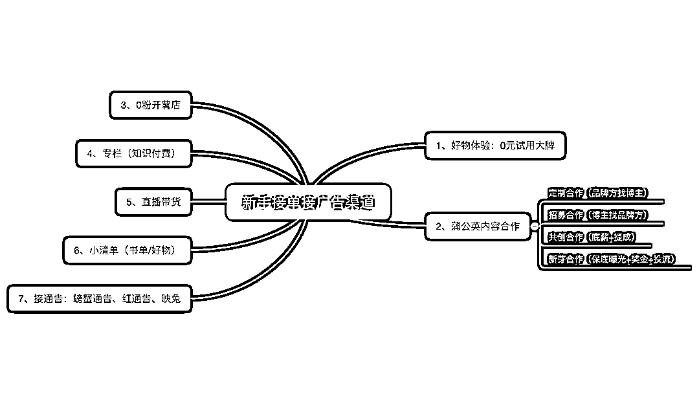

只要你坚持用心更新，商家会主动找到你，一条视频几千元很香～

## 2、我的桌面改造过程及好物分享

改造顺序可按照：墙纸-墙上装饰-桌面整体布局-氛围感好物 ，4个部分。

我精选了8个桌面基础好物，供大家抄作业：

1、 墙纸：

一定要买这种加厚的（0.6cm），手残党也不会贴皱，颜色建议白色或暖色系，这样整体风格就有了。

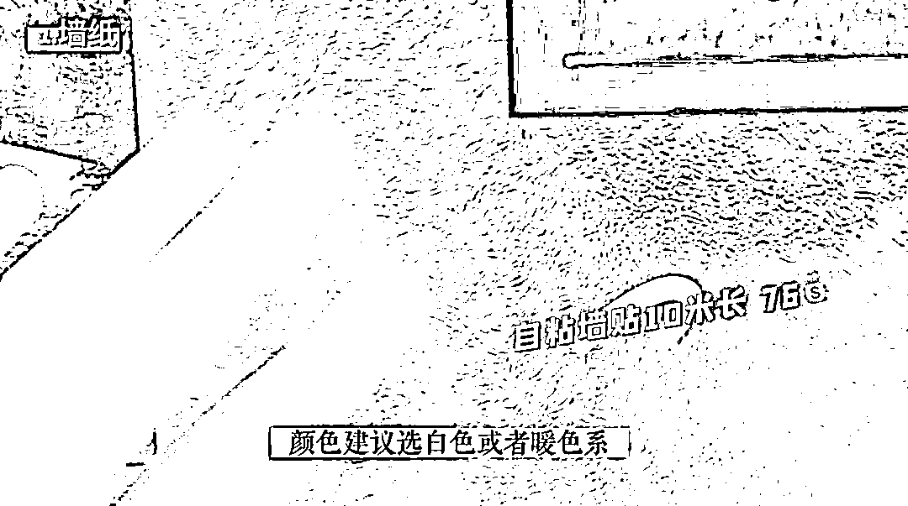

2、 墙面装饰：

我用的是毛毡洞洞板+复古海报+风景画这样的组合，粘贴方便，氛围感一下就有了，看着心情都会变好。

3、桌面增高架：

这个建议人手1个，提升桌面层次感必备，一下子有了三层空间。

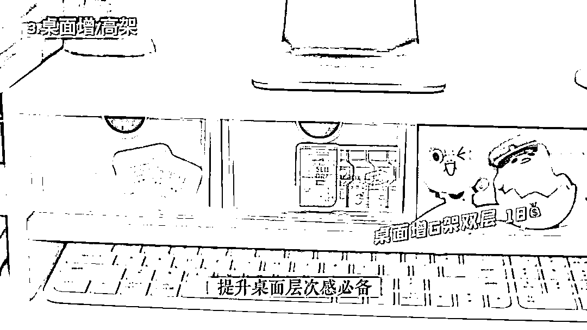

4、台灯：

台灯我用的是明基护眼灯，不仅颜值高，对眼睛也很友好。

6、豆瓣日历：

每天早晨起来翻一页，既有仪式感，又能解锁一部电影，重点是跟这个台灯底座完美匹配。

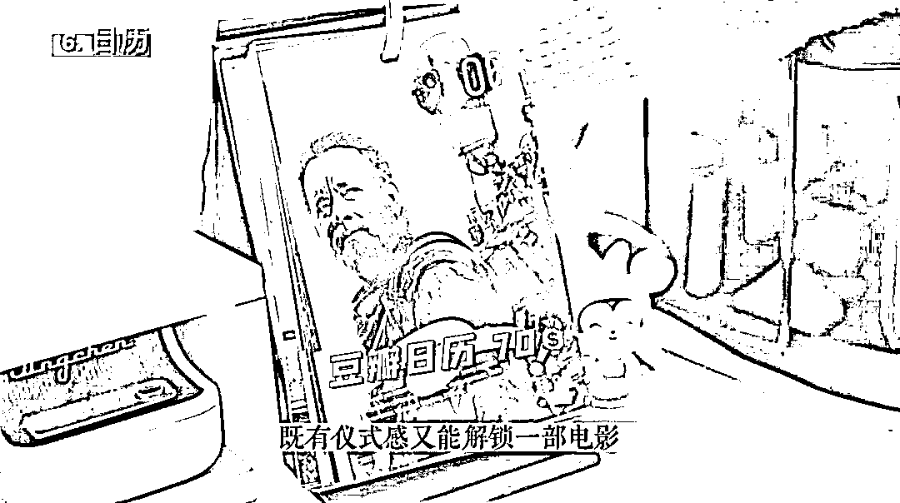

7、充电线收纳器：

保持桌面整洁的利器，直接挂桌子下面，烦人的数据线都不见啦。

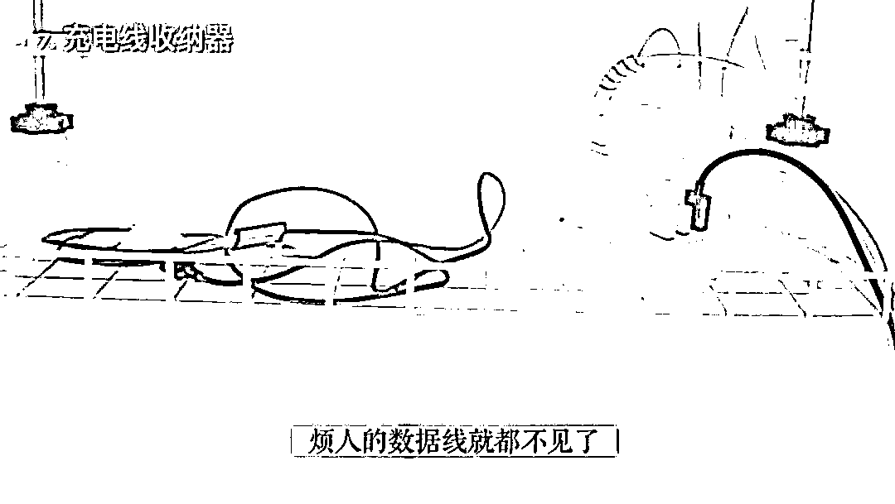

8、计时器：

既可以做时钟，又可以正反计时，实用又实惠，几块钱就搞定了。

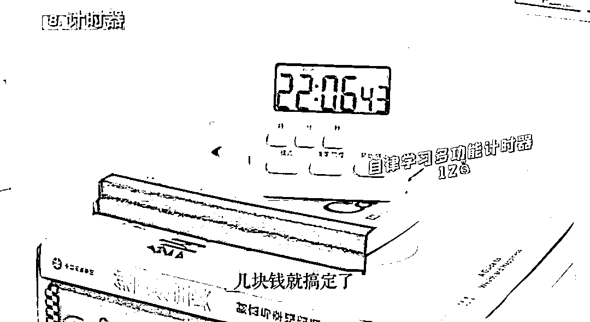

## 3、小白如何快速上手桌面vlog？

总共4步：主题+脚本+拍摄+剪辑。我们一个个来拆解：

1、主题：

新手很容易把vlog拍成流水帐，读者看完觉得没收获，自然对你不会有印象。

这里我直接给你经过全网验证的爆款选题，你只要挑出适合自己的，

做出1个爆款，号就起来了：

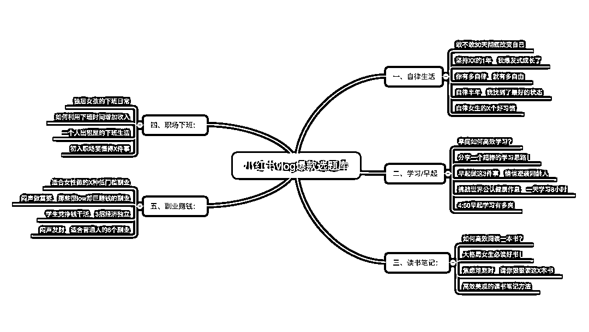

2、脚本：

这部分是重点，千万不能偷懒。

文稿完成后，再构思每句话所对应的场景。

这里有个知识点叫机位，它有高度（平视、俯视、仰视）、方向（左中右）、和距离（特写、近景、中景、远景）三个维度。

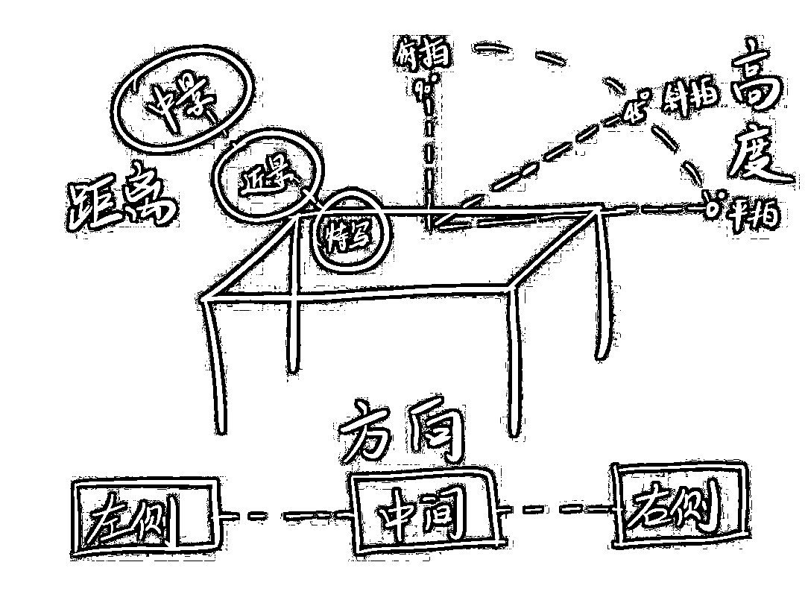

新手先用好平视+近景即可。

脚本模版我直接分享给你。

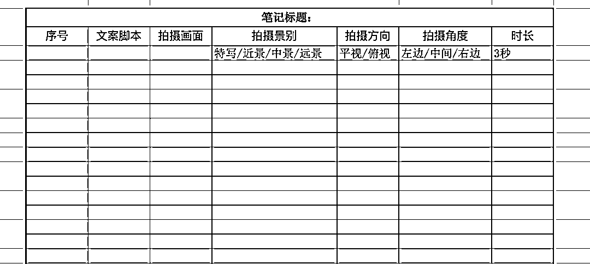

3、拍摄：

新手1部手机+落地三脚架+桌面支架就可以，拍完后可用滤镜整体调色。

后期有条件再上相机，用手机做提词器。

4、剪辑：

直接用剪映，封面用黄油相机制作就完成啦。

记住2个要点：

1.  每个场景拍3-5秒即可，多换场景拍，观众才不会感到无聊

1.  拍摄没有捷径，多拆解别人的优秀作品，然后不断练习

* * *

感谢大家看到这里。

最后特别感谢阿猫，我是他的觉醒合伙人，在他圈子里发了一系列小红书干货帖，他鼓励我来生财做个分享。

还有生财大师兄涛哥、理白大大给我的建议指导，如果有任何问题，评论区见，有问必答～

我是小翼，人生辽阔，希望我们一起：实现早日退休！