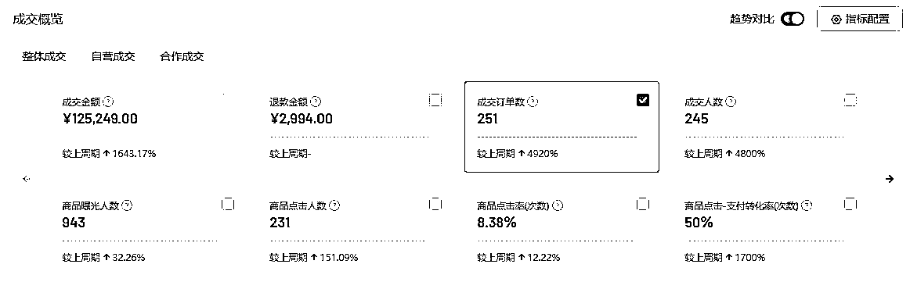
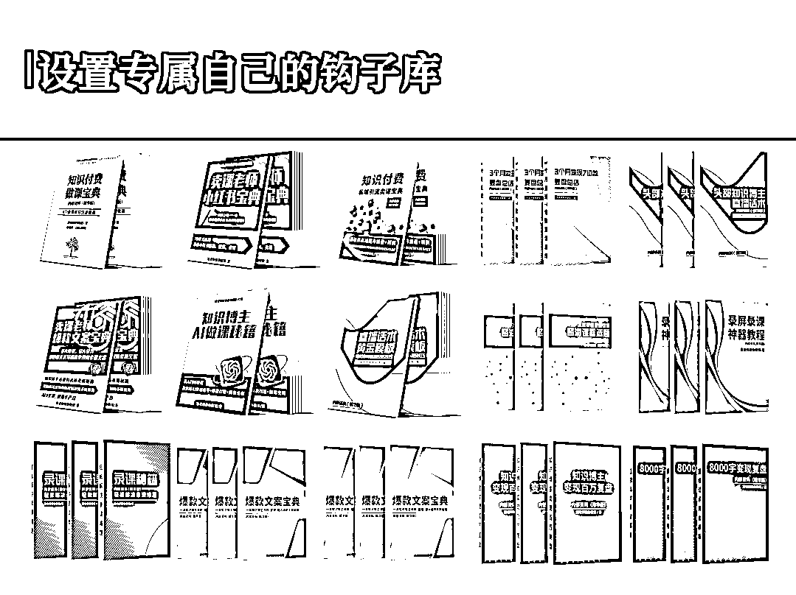

# 《独家揭秘：仅发售600人，轻松变现12w+，我是怎么做到的？（深度复盘最简发售模型）》

> 来源：[https://b16xnqwk20.feishu.cn/docx/GTngdLlD8oBPrfxNOlkc29JMn1b](https://b16xnqwk20.feishu.cn/docx/GTngdLlD8oBPrfxNOlkc29JMn1b)

生财圈友们大家好，我是宋老师（账号：宋老师帮你做课）

目前是全网做课卖课赛道头部，年变现800W+，5000多学员中200多位变现100W+。

上周，我又小范围地搞了一波大动作——仅发售600人，轻松变现12W+，卖的是我499的文案营。

先展示结果：

发售600人，成交251人，营收125,249.00元，转化率高达41.8%。

商品点击-支付转化率高达50%，也就是说，2个点链接的人，就有1个付款。

又是和团队打的一次小胜仗，发售结束之后和团队连夜做了深度复盘，得到了最简发售模型。

今天我把这个最简发售模型分享给你，希望你也能在发售的道路上创造佳绩！

在分享之前，先做个简单的自我介绍，便于大家快速知道我的价值：

我的五个标签:

1.目前自媒体头部的做课&卖课博主——流量能力

2.原来的新东方总监，最高记录同步管理80w学生社群——教学能力

3.仅发售600人变现12W+，成功打通最简发售模型——发售能力

4.8000多位知识博主的老师——成绩

5.很多百万博主背后做课卖课的男人

我把这套最简发售模型划分为三个环节：筹备--造势--发售。

话不多说，听我细细道来。

# 一、筹备

我的做事风格是：不打无准备之战。

在做一件事之前，我一定要提前捋清楚底层逻辑，至少保证有70%的把握能打胜仗，否则就是在浪费时间。

因此筹备环节至关重要，这极大程度决定了这件事是否能成功。

在这个阶段，我只做了两件事：

第一，确定发售排期；

第二，物料准备和责任到人。

看似好像很简单，但其实布满了陷阱，我一件一件事说。

## 第一，确定发售排期

不管是完成一个大事件还是小事件，都必须提前做好排期，这是后续为打胜仗而做出一系列动作的核心指引。

仅发售排期这一步，我和团队就开会磨了五个小时，用沙盘推演的方式模拟了整个发售路径，确认每个细节都没问题之后，才开始行动。

下图是最终版本的发售排期，涉及商业机密，就不给大家详细展示了，浅看一下第一天的大纲就好。

在写发售排期的时候，需要重点考虑几件事情：

第一，谨慎选择发售对象，并不是每次发售都要针对所有私域用户

这次仅仅是一次小型发售，也算是一次小的尝试，

因此只对新进私域的600人做发售，不会对老用户造成影响和打扰。

团队粗略统计了一下，最近私域新增用户，在文案方面的需求要相对更强一些，

因此对这波人做发售，精准度要更高，转化也更容易。

第二，社群的价值要充分利用，你会收获意想不到的效果

你过去和现在建的每一个免费的、付费的社群，都是你发售时能用到的关键子弹，直接帮你把势能顶起来。

在这次发售过程中，对此我深有体会，后面我会详细说。

第三，牛逼的人一次只做一件事，千万不要两件事同时进行

上周整个团队的工作核心，都围绕文案营发售这件事，其他事情都要往后放。

我从新东方出来，再到自己站到台前做IP，一步步成为做课卖课赛道的头部，再到如今已经累计带了5000多付费学员，我发现那些专注做好一件事的人，最能成事儿。

相反，眉毛胡子一把抓，什么都想做的人，往往什么都做不好。

这一点至关重要，只要你能把这一点牢牢记住，一个月后你一定会来感谢我，记得私下告诉我你的心得体会😁。

## 第二，物料准备和责任到人

发售排期确定好之后，下一步就是严格按照排期做准备工作了。

准备工作主要包含两个部分：物料和人员。

每个环节需要用到什么物料，都提前准备清楚，以免执行的时候出现混乱，或者临时补物料的情况。

比如，私信触达需要话术，需要海报，都明确责任人，以及提交物料的时间。

在物料准备的deadline之前，能配齐所有物料即可。

下图是团队这次发售需要用到的物料合集，每个物料需求都有对应的负责人。

对于任务分配也是有方法技巧的，篇幅有限，这里就不展开说了，感兴趣的可以私下交流。

# 二、造势

做知识付费，IP的势能很关键，

任何一个大事件或者小事件，都是给自己不断积累势能的机会。

在这个环节，我主要做了以下几个动作，直接打通微信生态闭环：

## 第一，朋友圈

朋友圈是造势的重要场所，是每一个IP的动态社交名片。

在整个发售环节中，我的朋友圈主要包含这几个动作：

### 1.集赞造势

在发售之前的集赞，主要有两个用意：

其一，判断用户意向。

我发的集赞朋友圈，都是资料赠送，尤其是要放大资料的价值和用途。

如果点赞人很多，说明用户对这方面内容很感兴趣，来报名的可能性会非常大。

其二，储备二次激活用户。

在关键的时间节点，可以在集赞的朋友圈下面发一条评论，作为强提醒。

### 2.倒计时

我这次发售打的一个噱头是：年终公开课，海报直接做了一个系列。

给大家看看我团队设计老师的海报，扔在朋友圈里是不是势能直接拉满。

篇幅有限，就不把所有的朋友圈放在这里了，欢迎私下近距离围观。

### 3.转发直播间

直播发售时，每讲不同的话题，都会及时转发到朋友圈。

尤其是我当天开播的时间是20:00-21:00，这个时间段正是用户刷朋友圈的黄金时间，朋友圈必须刷爆。

## 第二，私信触达

这次发售，我一共私信触达了600个新进私域的用户。

私信触达的目的很简单，就是进我年终公开课的群，也就是我的发售群。

私信环节也很简单，都是借用工具，全自动帮我发话术+图片

一天触达200人，3天就完成任务了。这次发售就安排了2位小伙伴，过程还是比较轻松的

也很顺利的完成了5个发售群的建立，还有个小技巧。从建群开始，到最后的结束，群名也可以随着任务的进行，做更改

tips：备课中、预约中、8点直播、免单中、结营等等，不断的变化，也是为了增加用户点击群的频率，增加粘性

## 第三，社群

社群造势非常重要，群内有kol和koc可以帮助IP带节奏，把事件热度推起来。

像我这次发售，刚建群，就有个我付费学员，在群里好一顿夸我，像极了水军，哈哈哈！

建群结束后，也就是直播的前一天，我在群内做了一次文字分享，

强调本次公开课的重要性，以及能解决什么痛点问题。

最关键的一步：拉直播预约！

拉直播预约的环节，我又做了一个关键动作：预约直播送资料。

这让我这次直播预约瞬间拉起来，发售600人，当天晚上预约就拉到了300+。

## 第四，企微必不可少

本次发售中，企微的两个核心价值：

1.自动发资料

企微提前设置好加好友话术后，可以自动给用户发资料，直接减轻劳动力。

篇幅有限，这里就不展开讲了，非常简单就可以搞定。不知道怎么设置的老师，可以私下交流。

2.直播促到场

直播前促到场环节必不可少，这样才能保证直播时的在线人数。

## 第五，视频号直播

用视频号直播发售，是我这次做的最明智的选择，没有之一。

后来和团队复盘，视频号直播的好处太多了，我在发售的板块具体讲。

## 第六，直播卖课成交心法

1.私域卖课不等同于公域卖课，拉群快速成交，1小时内结束即可。我的转化直播，一般是40分钟干货+20分钟推课，可供参考。

2.直播讲干货部分，也需要拉停留，可以加一些钩子，送一些资料，抽奖互动。平均观看50分钟，才是好的讲师，也意味着转化一定ok

一定要舍得给老师发福利，送资料。电子版、纸质版、高级的礼盒都可以

3.20分钟推课部分，一定要憋单。讲究的就是层层叠加权益，但是迟迟不放链接。积攒势能。大概5张ppt之后，突然放价格，配合直播操盘手，后台进行操作改价，放优惠，1分钟成交几十单都有可能。更详细的推课环节，可以参考我的直播

4.群内动作，可以采用接龙模型，不断的触达未卖课的粉丝。我们一般也是采用“3级火箭模型”。10位接龙报名送xx福利，25位接龙报名送xx福利，终极福利40人报名可以抽奖免单 --真实抽奖哈。也是为了营造一种积极学习的氛围，同时也是为了白嫖党参与

# 三、发售

正式发售一共两天的时间，第一天是一个简单的开营，是群内文字分享的形式，在前面已经提到过了。

第二天是年终公开课的直播，是【发售】板块要重点讲的内容。

虽然只发售了600人，但开播之前的直播预约已经拉到了440人以上。

这是我的预约数据，预约转化率高达77%，这个数据很牛逼了。

视频号直播还有个最大的优势——公私域联动，私域的势能可以撬动公域流量。

简单来说，私域用户进入直播间，会带动公域用户进来。

给大家看我上次发售的直播数据：

在累计观看人数的统计分布中，直播推荐占比高达60.6%，足以说明公域流量可以带来无限想象力。

再看看成交数据：

直播推荐的成交用户占比高达29.9%，第一次进我直播间就能给我付费，

也充分说明了我直播的内容力足够硬，迅速建立信任。

如何快速在直播间建立信任，也是有一套核心的方法的，在这里就不展开细讲了，

后面有机会可以单独开个贴详细分享这个话题，感兴趣的老师也可以多交流。

从上面的直播数据中不难发现，在所有短视频平台中，视频号是整个微信生态闭环中的一环，对新手开播特别友好，公私域联动带动的直播节奏真的巨牛。

我私域有3W+好友，这次发售是仅仅撬动600好友的结果，于是激起了我想要真正搞一波大事件的冲动——

12月我会发售新产品，会在这次最简发售模型的基础上无限放大玩法，欢迎来围观我的年终大动作。

# 写在最后

发售是一个系统且复杂的大工程，但也可以将其简化处理，像我这次小规模发售，我把它称为“最简发售模型”。

如果你之前没有尝试过发售，如果你是新晋知识博主，如果你担心大规模发售会玩砸，

不妨先按我的这次发售路径，做一次小型发售先探探路，然后不断完善自己的发售模型。

希望我今天的这次分享能给你带来帮助，让你在发售的道路上越走越远。

复制有结果的模型，迅速打通认知体系，对知识博主来说尤为关键。

希望大家都能通过发售迅速积累势能，大家有任何做课卖课相关问题，欢迎随时与我交流讨论。

我是宋老师，23年帮助500位老师卖课50w，欢迎和我一起卖课生财！