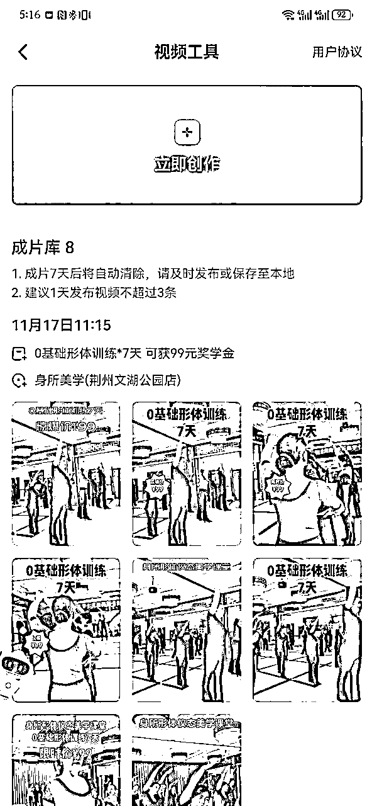
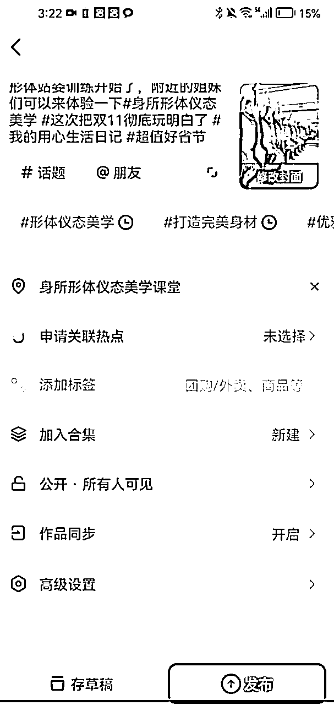
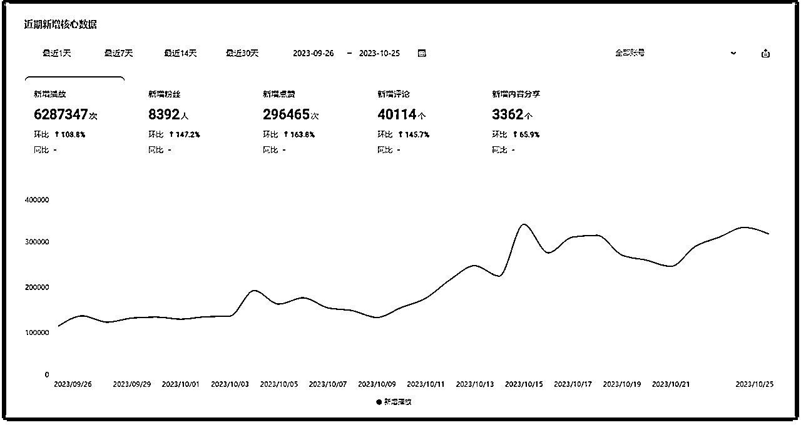
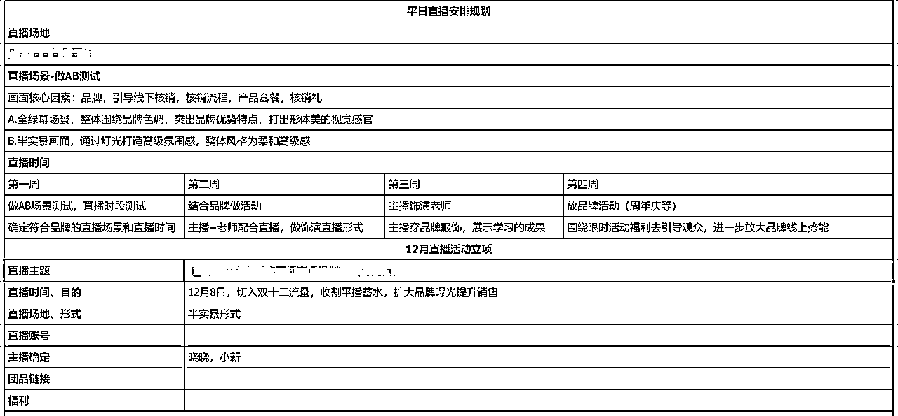
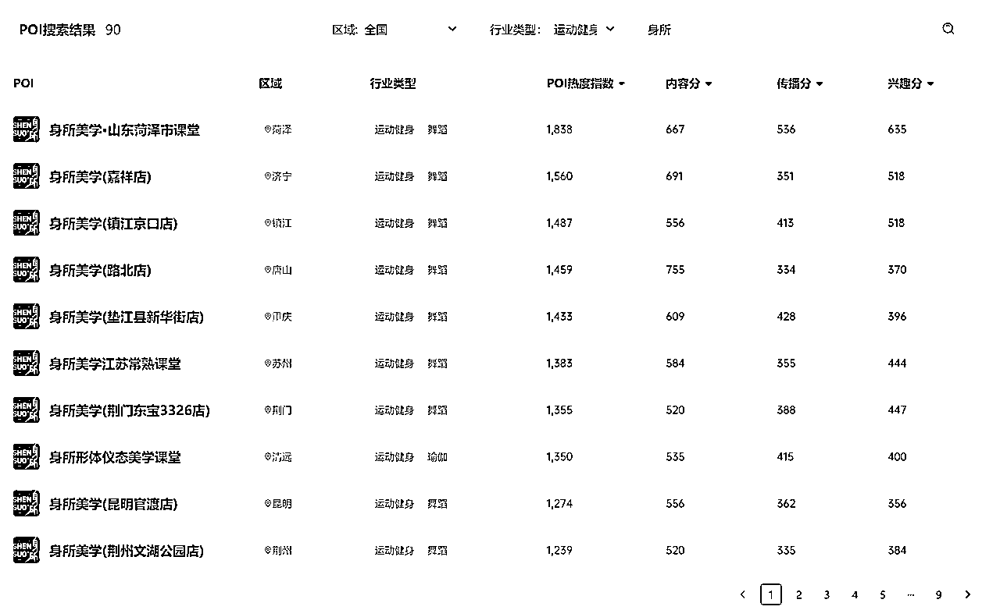

# 实体门店如何做好抖音同城获客？

> 来源：[https://yavp2a65mmx.feishu.cn/docx/GVjddmZJToqPNhxPzR7crTBzn0S](https://yavp2a65mmx.feishu.cn/docx/GVjddmZJToqPNhxPzR7crTBzn0S)

这是朱少锋2023年度总结的第一篇

我希望跟大家分享一下在2023年，我所探索出的“连锁门店如何利用抖音同城进行线上获客与成交”的一些细节与成绩，为了保证数据安全我隐藏了一些关键数据，但是思路才是关键。

2022年初的时候，有个做中药减肥的门店老板跟我吐槽：“自己开了30多年才做出来30家门店，怎么有人一年多就开了2000多家”，他表示十分的震惊，后来才发现是他们做了抖音同城。

而这个案例中的后者就是“大唐辣妈”。

这虽然是行业中吃到巨大红利的个例。但实体门店一定要学会线上获客，尤其是抖音同城，已成为必然。

原因有3点：

1、流量最大：抖音平台目前用户平均使用时长最长的平台，用户的注意力在哪儿，我们就要去哪儿个平台抢流量。如果你还想在激烈的流量竞争中占一席之地，一定不能错过抖音同城流量。

2、功能完善：抖音的本地生活/同城业务是目前在所有平台当中，从线上开店、到精准推荐附近流量，算法最完善、功能最成熟的平台。

3、撮合成交：抖音是兴趣电商，当用户去搜索与你的产品相关的关键词的时候，他就有可能推送你的门店给用户，需求完成精准匹配。

毕竟抖音平台也要赚钱。如果它发现这个用户有需求，而你能提供这个商品，他就会帮你撮合这次交易，从而赚取其中的软件服务费。

好，那么作为一个实体门店或者连锁门店集团，

我们应该如何做好抖音同城/本地生活，进行线上获客与成交呢？

接下来我将从以下8个方面给大家分享：

1、线下门店如何入驻抖音同城？

2、如何通过抖音同城短视频精准获客

3、如何通过抖音同城直播/本地直播持续获客？

4、如何利用达人探店，快速获得订单？

5、如何让抖音同城/本地生活自然流量提升？

6、如何让加你微信的人快速成交？

7、如何做好个人品牌，快速提升信任？

8、最后：给连锁门店老板的一些忠告

## 1、线下门店如何入驻抖音同城

为了打击云连锁，也就是虚假连锁企业，目前抖音审核的难度有所上升，所以需要你要有清晰的门头照（展现你是这个连锁品牌的实体门头）、价目表（展现你的具体品类）、营业执照这三个核心物料。

之前有很多人钻漏洞疯狂认领门店，从而获得线上自然流量的时代已经过去了，一定也会越来越合规了。

在这个阶段的核心是2点：

1、找到门店所在地区所在类目官方对接人，让官方对接人协助你上架门店，修改品类错误问题

2、提供符合要求的照片，快速通过审核

## 2、如何通过抖音同城短视频精准获客

1、误区：大多数门店觉得自己发不了短视频

对于大多数的门店而言，最大的问题就是觉得自己不会拍摄。

因为有个很大的误区，就是短视频要非常的精美，甚至于你可能那个会认为短视频如果流量比较低，点赞比较少，都是无效的。实际上，这是一个非常错误得认知。

作为实体门店而言，你需要的是什么？

你需要的是门店附近的精准流量。也就是你只需要让你门店附近几公里的对你的产品有需求的人。看到你的短视频--产生好奇--引发下单就可以了。因此你不需要过度在意你的播放量、你的画面的精美程度，只要他传递的信息足够就可以了。

其实一个非常有效的抖音同城/本地生活短视频模板就是三段论

第一段：直接说出你用户的痛点。

第二段：告诉用户，我能帮助你解决，并且我已经帮助了很多像你一样的人解决了这个问题

第三段：我现在有一个活动非常的优惠

对于商家而言，你只需要不断地更换你的痛点、解决方案和产品活动介绍就能拍出无数条优质短视频了。

更有效的一点就是在开头加入你的定位和目标人群，例如：在清远30-50岁想改善体态的小姐姐看过来......

通过这些关键词，你就能获得当地更加精准的流量。

2、如何更高频的发有效短视频？

其实对于抖音同城/本地生活而言，我们先要保证一个视频的数量，然后再去提升的质量。每一个商家每天都能发两到三条短视频，这样能去提升它的门店的线上热度。

那如何才能让这些商家更加快速的发出有效的短视频？

其实一个最简单的办法就是我们要上传一个视频/图片素材包，然后后台根据我们的规定加上热门的话题、画面上的文字、音乐、地点信息就可以了。

尤其是现在抖音来客（抖音同城商家后台）当中还刚刚更新了一个一键成片的工具，可以更好的帮助商家混剪自己的视频，完成数量上的积累。

我们已经利用一些AI短视频工具实现了很好的效果

## 3、如何通过抖音同城直播/本地直播持续获客？

1、日常直播&门店直播

对于连锁线下门店而言，需要建立更多的直播间，通过日常直播帮助在线上获客。

尤其是在现在，直播的红利远大于短视频，因为短视频的制作成本低，大家觉得比较简单，而直播大家觉得更加的困难，而实际上很有可能在你这个城市当中，你这个行业只有你一家在做直播。

就拿我亲身体验来举例，我现在身处于清远，真正做餐饮类直播的非常之少，只有两到三家同时在直播。

这两三家他们其实播的几乎没有什么专业度，但是他们的效果依然很好，为什么？

因为用户在搜索清远美食直播的时候他们没有对手。只要展示清楚你卖的是什么，你的产品的单价是什么，他们就可以完成获客。

所以大家一定要去进行日常直播，不用在意专业度只要先开播，然后再去不断的优化即可。

2、品牌大播

如果你的实力比较强，能去做一场真正专业化的直播，那么我建议大家每一个月做1-2场品牌大播。

可以结合关键的时间点，例如双十一双十二或者品牌自己的节日，给你的用户放一波福利促进复购，并且通过线下门店&老用户贡献的GMV去撬动更多的抖音自然流量。通过一场活动既让老用户通过直播场景完成复购，又让线上新用户看到你的品牌并完成首单体验式下单，还是很有效的。

## 4、如何利用达人探店，快速获得抖音同城/本地生活订单？

其实在2021年，22年的时候，达人探店的效果是非常好的。

因为那个时候很少有人去做探店视频，用户也比较相信，而现在由于商业化过于严重，大家已经不是那么相信达人探店的视频了，所以它的效果大大折扣。

但是目前它还是一个重要的获客流量来源，你需要找到很多的达人来你的门店当中进行视频发布，这也有助于你整体流量的上升，而且能帮你带来一些他自己粉丝流量的变现。

但是目前达人服务商鱼龙混杂，很多服务商就为了赚点儿达人的探店的钱，实际上效果非常的差，他们会找很多完全不会拍摄的一些素人去完成他给你承诺的这个指标。一定要注意分别。

## 5、如何让抖音同城/本地生活自然流量提升？

很多的门店主不理解什么叫POI分数，而实际上大家都可以在巨量算数当中找到自己门店的POI分数。

除了订单成交量这个隐含条件不会再显示之外，在这个页面中，你都可以看到你的内容分，传播分跟兴趣分。也就是说你要在你门店的定位。多发短视频、提升播放量和互动量，通过这样的方式能提升你的POI分数。

POI分数决定了你的每一条视频的自然流量，你的分数越高，每一条视频获得的自然流量就越多

同时，还需要不断提升自己的订单量、核销量和好评量。你冲上了榜单，也会获得更多额外的自然流量

## 6、如何让加你微信的人快速成交？

一定要重视的私域成交：朋友圈成交

其实很多门店主都忽略了自己朋友圈的塑造，以下问题不知道你们有什么答案？

你需要在你的置顶的朋友圈当中放上三个内容：

1、个人故事：你是谁？你做这个事儿多少年了？帮助了多少人？

让别人充分的了解你到底能为大家提供什么样的价值

2、公司介绍：介绍你的公司规模，用户案例、权威认证

让用户提升对你产品的信任度

3、产品活动介绍：产品解决了什么痛点？你的解决方案是什么？帮助哪些人取得了什么效果？有什么优惠？

让他们看到就想跟你咨询下单

优化你的朋友圈

生活和工作6:4，不要让广告充斥你的朋友圈，你都不乐意看的朋友圈，为什么要给别人看？

## 7、如何做好个人品牌，快速提升信任？

目前，如果你还想在抖音平台做一个大IP出来，那难度一定是地狱级的。

因为抖音平台不希望出现超级IP，使劲薅平台流量又不贡献很多流水。

但作为实体门店主，我们只希望做到让门店附近几公里的目标用户

*   在有需求的时候第一时间就能想到我

*   让他们都知道我的专业性

*   知道我之前的成功案例和效果

*   了解最新产品和活动信息

所以，我们要做的是区域性个人品牌，精准获客

通过个人10年故事，让目标用户相信我们的专业性、真实性，通过故事的形式引发他们的情感共鸣

（插入视频号置顶视频）

## 8、最后：给连锁门店老板的一些忠告

1、门店管控要强：做抖音同城是个快节奏的事情，而就管理力度而言：代理＜加盟＜直营，如果你的管理力度不到位，那很多动作做的不标准，下面的门店会觉得你在忽悠他们，反而会引发更大的争议

2、目前抖音服务商鱼龙混杂：说实话，专业的服务商真的不多，很多都是出来用达人探店出来骗钱的，一定要好好分辨。关键就是公司内部得有真正懂的人，要不然可能会一地鸡毛

3、传统企业一定要有懂线上的人：最好是老板亲自上阵，搞清楚线上的逻辑，然后引入从互联网行业出来的操盘手（注意，不一定是高管），让他来主导这个项目，而不是让他辅助原来的内部高管，要不然肯定是搞不成的。

以上就是我2023年实际操盘连锁企业做抖音同城的一些经验分享，希望对大家有所帮助。

展望2024年，我认为实体门店对线上获客的需求会更加强烈，以下是我未来主力研究的营销重点，

关键词是：AI营销

*   通过AI批量生成短视频/图文内容，帮他们做好线上获客与成交

*   通过AI多平台分发及评论回复，提升获客效率

*   通过AI节省人力，获客后进行用户筛选，问题答疑，促进成交

（详情可以点一下关注，我的第二篇年度总结会展开讲述一下AI营销的事情）

2024年，应该是AI应用落地的一年，对于很多企业都至关重要

让我们一起，持续增长吧！