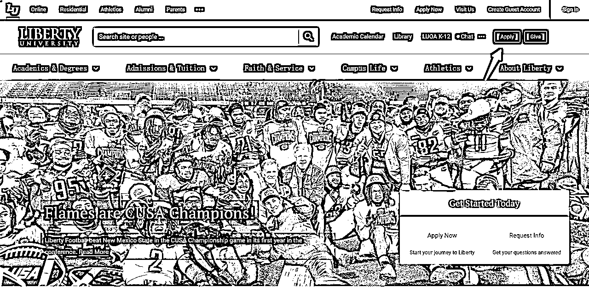
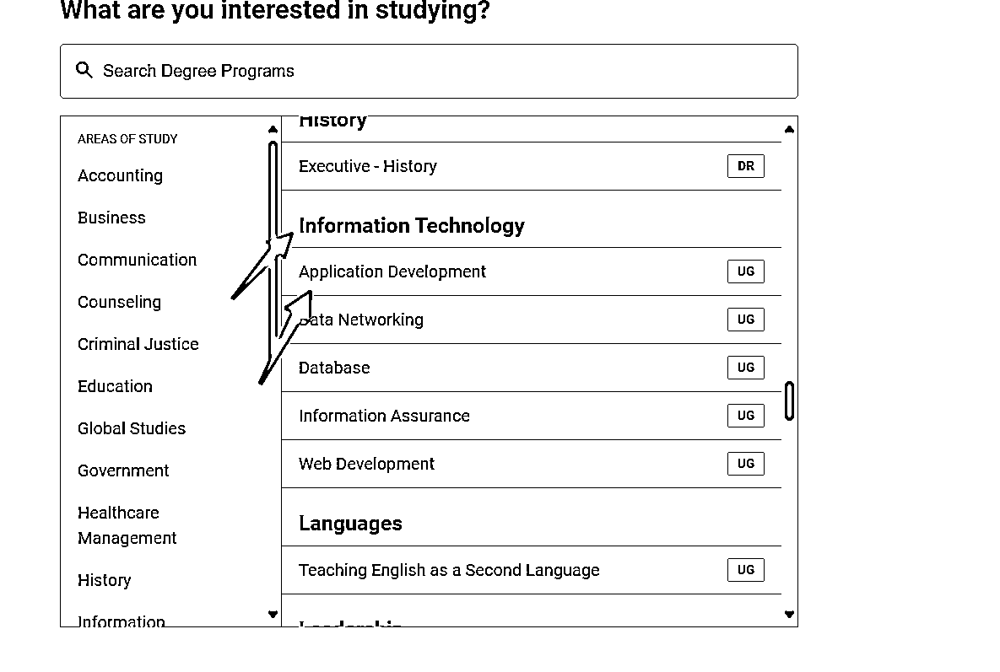
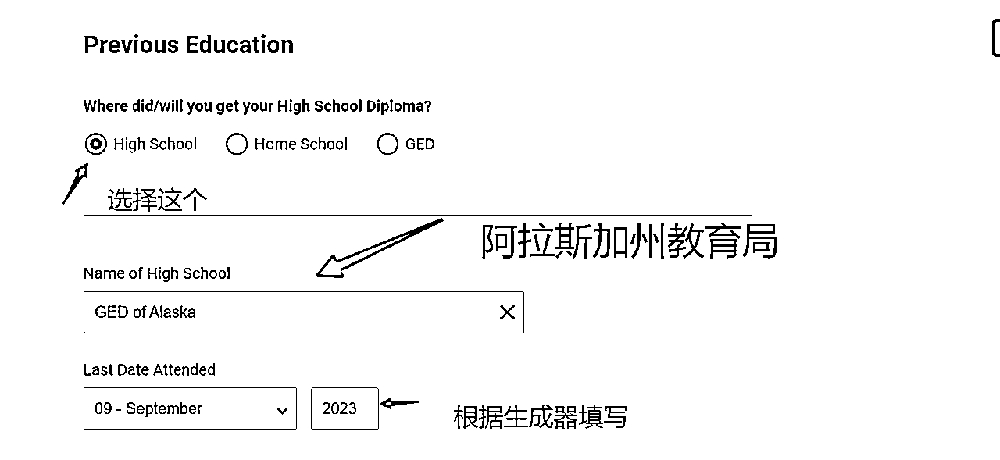
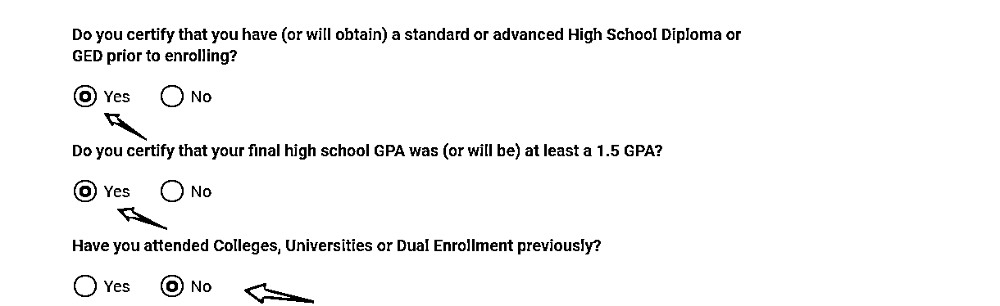
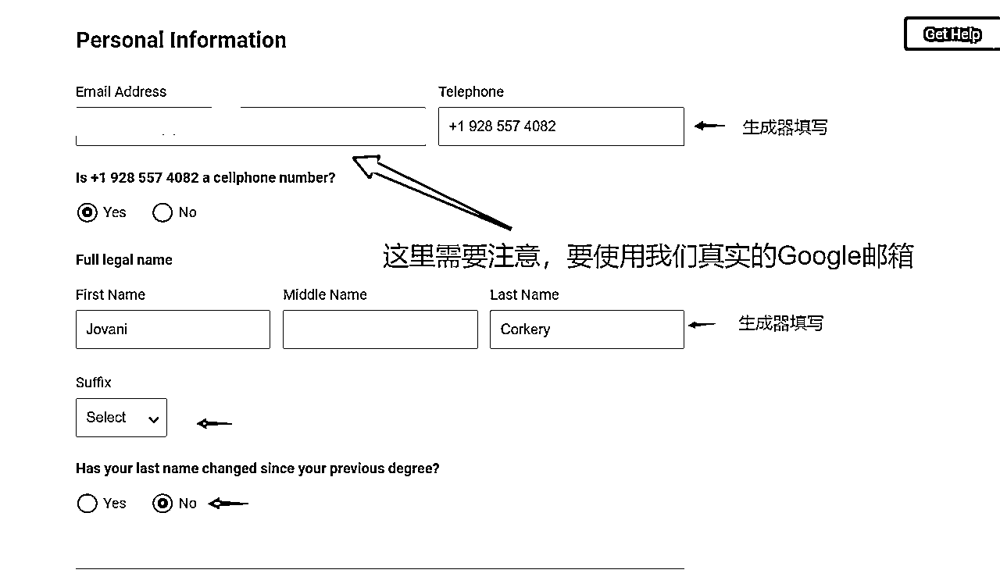
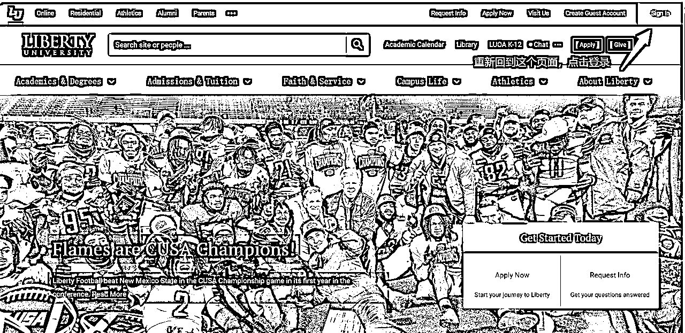
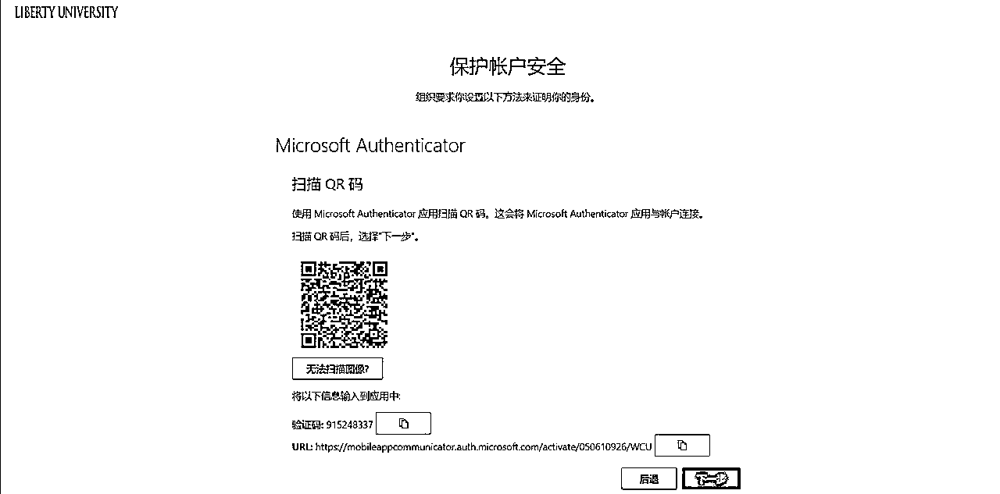
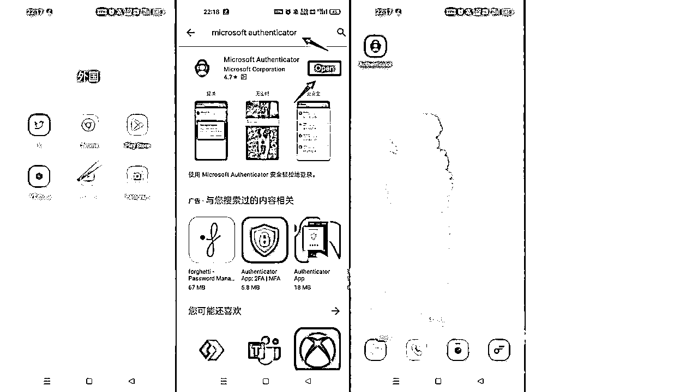

# 如何申请国外edu邮箱

> 来源：[https://qz5e4g7okh.feishu.cn/docx/H2XKdLTlwouvUCxy7XxcETiEnL9](https://qz5e4g7okh.feishu.cn/docx/H2XKdLTlwouvUCxy7XxcETiEnL9)

hello大家好，我是三月雨

今天教大家的是关于美国自由大学的edu邮箱申请

# 说一下前提

现在已经是美国全局的状态了

## 首先我们打开链接https://www.liberty.edu/

点击申请

## 选择online

## 这里需要选择学习内容，建议选择信息技术——应用开发

## 到了需要美国身份信息的步骤，这里推荐一个网站https://fauxid.com/

## 美国身份生成器

## 推荐这个选：年龄选择18~24岁，国家选择美国，洲选择阿拉斯加州

点击生成

这里姓名推荐两个单词的，年龄尽可能在20岁左右

## 填写完成，领到了我们的学号

进入学生证填写页面

## edu邮箱到啦~

## 这里要等待15~20分钟，因为他有一个开通过程~

## 需要进行保护设置

## 打开手机Google应用商店进行下载~

## 使用Microsoft authenticator进行二维码扫描

## 登陆成功，成功拥有该邮箱

# 利用脚本或者RPA可以进行批量操作批量申请~