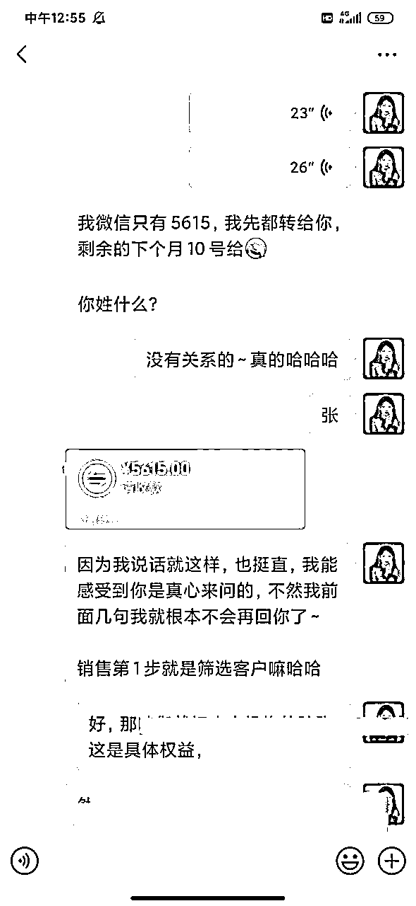

# 葡萄｜教培老师副业变现20w，独家揭秘百战百胜的销售沟通体系！》

> 来源：[https://n28vbku1px.feishu.cn/docx/HNfHdyaiiovVucxhbf4cyNXhnXb](https://n28vbku1px.feishu.cn/docx/HNfHdyaiiovVucxhbf4cyNXhnXb)

先简单介绍一下自己。

我在小红书发教培销售技巧，目前是1.9w粉，变现20w。

20万收入，2/3来自于私教，1/3来自于社群和课程，以及各种分销。

设计社群和课程的目的，是为了让用户升级做我的私教，完成低转高。

总结后发现，今年收到的将近40个私教，大概只有不到10个人是低转高。

剩下的客户全部是加上微信之后，一天内或者两三天内谈完成交的。

接下来先给大家展示一些在短时间内成交客户的结果。

于是我发现，

相较于通过社群完成低转高的中高单价成交，

我更擅长直接把单子谈成。

谈单与销售简直就是我的绝对领域。

所以接下来分享一套销售成交体系，

我将其称之为葡式销售法则。

作为知识IP，或者是销售，相信大家一定经常遇到明明有客户来咨询了，感觉对方意向还挺高的，也不是没有付费能力，但最后却没有成交，自己在抓心抓肺地难受。

或者聊一个客户要花好长的时间去运营，去培养对方对我们的信任。

再或者我们明明产品很好，流量很多，就是谈不成这个意向客户。

那么接下来就进入我们葡式销售体系的第一步。

一、了解自己和产品

很多人无法成为销冠，

本质上其实是对自己产品的不了解，

销售有以下三个境界：

底层的销售给客户当舔狗，

中级的销售和客户做朋友，

高级的销售做客户的导师。

成交中高单价非常看重客户对你的信任，也就是成为他的导师。

这意味着我们一定要要了解自己的产品整体框架和底层逻辑。

只有先了解自己，才能推销自己。

我设计了几个步骤来整理自己对自己产品的了解。

1、我是谁。

我给自己提炼了几个非常关键的人设点，

八年教培从业人员，擅长家校沟通，研究过心理学与儿童心理学。

从业多年，意味着我有行业经验，擅长的点正好是我售卖的产品的点，也就是我的沟通私教。

后面还有一些专业的书籍的背书。

对自己能具体帮助别人什么不清楚的话，是很难推销的。

2、我产品的买点和卖点。

在这里我们先聊一下，买点和卖点的区别。

举个例子，

比如说我是一个媒婆，我想跟一个女孩推销一个男孩。

我说这个男孩一米八，大眼睛，特别帅，名校毕业，其实就是卖点。

都是对这个男方的吹嘘，但是对女方来说并没有什么实际的好处。

但如果我说，男孩是国企工作稳定，能够跟女孩的工作形成风险对冲。

同时，男孩家里全款买了车跟房，女孩过来就能够减轻很大的压力，男孩的父母都有退休金，也没有养老压力。

这个时候就是对女方好的部分。

所以我们一定要提前想好自己产品的三个买点和三个卖点。

卖点就是对自己的吹嘘，

比如我是名校毕业，

比如我们这个产品是几个大教授一起研发，比如我有多厉害多厉害。

买点呢，是对方的好处。

比如我是名校毕业的大学生，所以我有一套很优秀的学习方法和很多学习资源可以给你。

以朋友圈文案为例：

卖点：这套朋友圈文案课程是在文案营销行业工作了八年的大佬设计的。

买点：可以有效地调动你列表的流量，让他们想要买你的货。

3、产品有什么价值。

蔡珏老师在《产品魅力30讲》中说过，产品要有功能价值，资产价值，情绪价值。

鉴于我的产品是“销售私教”，所以我按照这个纬度列出了它的三个方面。

①功能价值：

学会了销售和沟通，就可以更好的售卖你的课程，本来你一个月只能成交十单，现在你一个月可以成交30单。

②资产价值：

你花3000块学会这个技能，并不是说只能用三个月，对不对？接下来你有一辈子的时间去使用这个技能，这个技能在接下来的五年十年三十年里，都可以源源不断地帮助你提升收入。

(不过因为我这个是知识类产品，所以资产价值有待商榷。)

③情绪价值：

你跟家长沟通的不顺利，自己也会非常的内耗，别的同事都跟家长聊的特别好，只有你的班群里面冷冰冰的，真的很难受，但是我们学会沟通了，就不会出现这个问题了，对不对？

只有对我们自己的产品非常了解，我们才能知道怎么去帮到客户，这个时候再去收客户的钱就顺理成章。

甚至不需要我们自己去提，客户会主动说老师，您这边怎么收费？

二、了解用户

1、为什么

首先说一下我们为什么要了解用户。

如果我们能知道他们具体的困惑，痛苦，需求，那很容易能够给到他匹配的方案。最精准的方案就是最值钱的！

如果自己都很混乱，对方却能精准点出困境和方向，我们对他的信任度就会大大的提高。

相信他能够帮到我，就是我们为他付费的第一步。

2、怎么做

那怎么做才能了解到自己的用户呢？这里需要了解的群体分为三个部分。

第一是已经为你付费的用户。

已经为我们付费的用户是非常珍贵的，我们可以跟他做个回馈，比如是我的什么东西吸引了你？哪个环节让你下定决心为我付费？你的哪些痛点让你决定一定要出钱去解决它？

如果能够总结三个付费用户身上的共性，那离我们成为销冠就不远啦～也有助于我们接下来精准引流。

第二是你想对准的目标用户。

通过已经为你付费的用户(如果你还没有付费用户，那也没有关系)，我们心里大概有一个目标，用户是什么群体的概念。

比如我的目标，用户就是教师群体。

那我会通过朋友圈，群聊，小红书，微博，知乎等平台的评论区，以及线下聚会，去了解一下他们的现状，看看他们平常关心什么，吐槽什么。

这些都会是我们接下来在销售过程中的谈资。

第三就是来找你咨询准备付费的用户。

通过前面的一些步骤，其实我们就大概能了解，来找我们咨询的用户是一个什么样子的人。

这时候最好的就是去翻翻他的朋友圈，翻翻他的视频号，再跟他售卖产品的过程中，简单联系他的现状。

比如我就会说：“可以啊，我觉得你是很适合自媒体的，我刚刚看了一下你的朋友圈，图片发的很漂亮，文案配得也很好，说明你是有基础的文案编辑能力和图片PS能力的，那你就很适合做自媒体啦。”

当然，对方如果朋友圈什么都没发，那就靠你们聊天。你来了解一下对方，大致感受一下对方是一个什么样子的人，平常有什么做过什么事情。

3、了解什么

现在来到最后一步，我们需要了解他们什么东西？

先从大众的部分来看，我会去翻一下这些老师们，在各种公众平台和公开场合表达过的期待，能够有一个什么样子的家校关系，他们吐槽过的，让他们烦恼的是什么东西？他们羡慕的是什么人？他们羡慕的是一个什么样子的生活状态？

再如果有人来找你咨询了，那我们就可以跟他简单的聊一聊，在聊天的过程中，可以感受一下对方关于什么部分吐槽比较多，在什么时候表达了好羡慕啊的情绪，这些都是在聊天中需要重点关注的。

举个例子，如果我们是做盖洛普优势咨询的，那大部分用户，就是很迷茫，在一个自己不喜欢或者不擅长的工作岗位上，苦苦地熬着。

但想要跳出去，又不知道自己应该有一个什么样子的方向，最羡慕的就是做着自己热爱且擅长的工作，闪闪发光的人。

我们可以问问，为什么想要了解一下盖洛普优势咨询呢？

或者还是用朋友圈文案来做例子，为什么想要了解下朋友圈文案课程呢？

等对方说出，因为客户很多，但是朋友圈发的不好，都没有把它们激活，这个时候我们就可以顺杆往上爬。

所以，学会朋友圈是很重要的。

三、积累素材库

销售的能力并不是一时一天就能立刻学会的，但素材是可以积累和整理的。

我们可以多整理一些内容，销售过程中就可以信手拈来。

1、同样情况顾客的困境

2、你的成功案例

“对，是的，我这边就有个学员跟你是一样的情况，然后他现在已经怎么怎么样了。”

“对呀，我这边有个学员跟你一样是课程顾问，之前也是跟家长谈单谈不好，现在已经单单必成交了，直接冲销冠。”

“我这边有一个学员跟你是一样的情况，也是微信列表几千人，但是买东西的人很少，他前两天还跟我报喜，已经出单了，其实你们两个是差不多的。”

3、成功成交别人的话术。

这个就是我们需要去反复问一下，让付费用户愿意为我们付费的是哪个部分。

比如说我们聊了什么，让你这么下定决心给我交钱。

我自己会总结成功成交客户的朋友圈和一些有用的话术，我的客户说你这句话，让我好安心，打钱。

就会回头分析这条朋友圈或者这句话，把它们收藏起来，经常使用，成交率会升高。

# 四、设计销售思路七步走

希望这个部分能帮助大家简单设计一下自己的销售谈单体系。

1、筛选客户。

如果我们推的产品是四位数，五位数的，那在聊天的第一步就是做一个简单的筛选。

两位数，三位数也可以根据这个维度去做一个简单的筛选。

对方一定是有付费能力➕有痛点的。

说实话，没有痛点的朋友，很难直接给你付这么多的费用，我们去聊天也只是浪费自己的时间和精力。

举个例子，我说：“你好，需要帮助吗？”

对方：“你的星球要365，好贵呀。”

我就会直接把我的资料送给他，祝他接下来一路顺风，剩下的就不会多聊了。

逼着一个没有付费能力的人去买你的产品，我是一件很痛苦的事情，对双方来说也挺难受的。

或者我说：“请问你在沟通方面有哪些问题呢？”

他如果说目前没啥问题，那我也不会再聊了，没什么问题，说明人家不需要我们，那就不聊。

这个就属于【初步筛选】。

筛选非常重要，因为如果你选错对象，聊个两年都成交不了他。

比如，之前有个大三的学生来向我咨询，沟通私教的情况。

我说你可以买一个课，199。

他觉得他的问题没有办法被解决，又问还有别的产品吗？

我说我的私教是3000多一个三个月。

他说好吧，那我回去和爸爸妈妈商量一下。

（这个就属于暂时没有付费能力的，不过等他工作了，我觉得情况会好很多。）

我说好呀，对于大学生来说是一笔不小的开支，还是要跟爸妈商量一下的，也没有强求。

我们双方都非常的和平，大家都不内耗。

2、主动出击/掌握主动权。

因为我大多是从公域引流过来的，所以引流过来的新流量分两种情况。

不过不管是哪种情况，都一定要有自己的框架和流程。

比如，先筛选决定你是不是我的目标用户，再聊一下你目前的痛点是什么问题是什么，再给你推一下我的产品。

而不是说客户问什么，我们答什么，被对方牵着鼻子走。

最后，也没有成交，还花了几个小时去聊，去浪费自己的时间。

来看一下以下两种情况

①对方过来领资料

这个时候我除了把资料送给他，还会多嘴问一句，为什么想要领资料呢？是目前想要解决xx问题吗？

对方说不是，筛选失败下一位。

对方说是的是的，那我们就仔细聊一聊就可以往下推进。

②对方过来咨询

先问为什么想要过来了解这个产品呢？

答案不理想，下一位。

答案理想，继续聊。

3、了解对方

可以从朋友圈简单的看看生活状态，这样在接下来聊天的过程中，就可以结合朋友圈，让我们的说的话更有说服力。

比如我看你朋友圈上发的内容都非常有创意，但是你现在做的是流水线的工作，应该很痛苦，我从你的优势报告上看得出来。

这个就是言之有物。

就像卖衣服，如果说美女你穿这个真漂亮，没有什么可信度。

但是如果说美女你是梨形身材，腰非常的细，穿这个掐腰的裙子刚刚好，可以显示出你的身材的美好的部分，就很有可信度了。

也可以跟他聊一聊，像医生一样。

你目前的问题是什么，感觉很难受吗，状态持续了多久，有想过自己解决吗，结果如何。

其实就是大概的聊一聊，这个部分也有很多可以延伸的。

（今天因为篇幅问题，我们就先说到这）

4、让对方主动说出困境和细节

细节非常重要，如果聊对目前的工作不满意吗？想要换工作吗？

就有点太大了，还没有扎到他的痛点，相当于往他肚子上来了一下子。

但是如果我们问，是今天做什么工作的时候觉得很难受吗？可以详细描述一个场景和状态吗？

是给老板汇报工作的时候，还是做PPT的时候让你觉得很痛苦？

这个时候就等于我们拿着针在他指甲上扎了一下子。(容嬷嬷既视感)

他就会唰的一下子被扎出血，然后觉得好痛啊，医生快点帮帮我。

换到我们的场景里来就是，老师，帮帮我，有没有什么私教产品能帮我？

5、找到对方困境与我们产品的联系。

我的产品是销售私教，所以一般如果客户说，因为我跟家长聊不来，或者说因为我总是试课成交不了。

我就会说，那可能是你沟通的方式有问题，方法有问题，我来看一看你的情况。

哦，这个情况啊，你看我私教里面的第三节课就会教这个事情，怎么去解决。

这个就是对方困境与我们产品的联系了。

把对方的困境和我们的产品联系起来，他想要摆脱目前的状况，就只能去买我们的东西～

6、给对方一个解决方案

比如我会让客户给我她跟家长谈单的聊天截图，告诉他怎么跟这个家长谈，能够成交。

但是他有那么多的家长，所以只给他一个解决方案，是不行的。

也就是我之前说过的，我们给对方的解决方式一定要很具体，但是不能太完整。

具体→得让对方觉得你能帮到他。

不完整→得让对方觉得他还是需要你。

而不是说哦，你告诉我怎么办了，那我就不需要你了。这个度需要拿捏一下～

7、主动提成交

一个敢跟客户说你给我交钱吧的导师，是非常值得别人信任的。

我敢跟你说，这个部分我能帮到你，你来买一个我的私教吧，本身就意味着强大的自信和能力。

如果我什么都不是，什么都不会，我是不敢跟你说这个话的。

客户感受到你的自信，当然也就愿意更信任你，付费也就会更丝滑啦～

我一般会这么说：“好，你的情况我了解了，我觉得我能帮到你，我这边有很多学员跟你的情况是一样的，他们目前的状况是怎么怎么样，都非常的好，所以我觉得你可以报一个我的私教。”

或者：“好，那我们今天就先简单的聊到这里，如果需要更多的帮助的话，那可能就是得你报一个私教啦，因为我的咨询是付费的～”

还是那句话，有很多客户都是我去主动要钱，主动提成交的。

我提钱非常的坦然，甚至有点替他们着急，就是那种你快交钱叭，我真的能够帮到你。

# 五、一些很有用的句子，分享给大家

举例：

【销售产品】

“我看了一下你的流量和产品，都挺好的，主要就是成交有点差，如果能把这一块提起来，月入过万不是问题。”

【朋友圈产品】

“你看你的产品单价都很高啊，列表又有几千人，你要是能把朋友圈发好，把这些客户都激活，随便成交几单就是几万啦。”

【盖洛普产品】

“你的这个优势才干很强的，你看那个谁，谁跟你的才干图一模一样，人家都月入几十万了，你要好好发挥才干的优势，不然只会内耗。”

总之就是要先夸对方很好，能够获得更多的收益，但是因为某部分没有做好，所以就非常的可惜。

又有痛点，又有远景。

同时还要做比较，一味的夸对方，也会不真实。

所以有时候我也会说这类型的句子：“今天如果你是一个图片PS的很差的人，我是不会让你来跟我学习自媒体的，因为你赚不到钱，只会亏钱，但是因为你作图文案都很好，所以我才会来给你推荐，我觉得错过了，真的很可惜。”

今天如果你是一个悟性很差的，我也不会给你推这个沟通的私教，三个月的时间，很可能你学不到什么，还花了钱，但是因为你很有悟性，我觉得你能学到很多东西，而且学完之后你可以更进一步，对你有益无害。”

最后，我想说销冠的终极秘诀和核心，是为对方解决问题，而不是卖货。

以及前期引流很重要，我们不可能对着大学生卖别墅，那无论如何都卖不出去的。

今天有很多话术，因为是给大家举例子用的，所以其实还是有些生硬，需要结合具体情况，大家可以酌情使用～

想要深入了解《葡式销售法则》的小伙伴，可以找我【免费做一次谈单思路梳理】+【领取一份销冠秘籍】

v：putaolaoshi19

