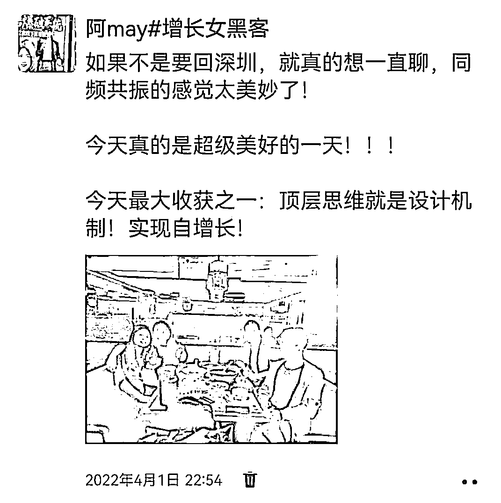
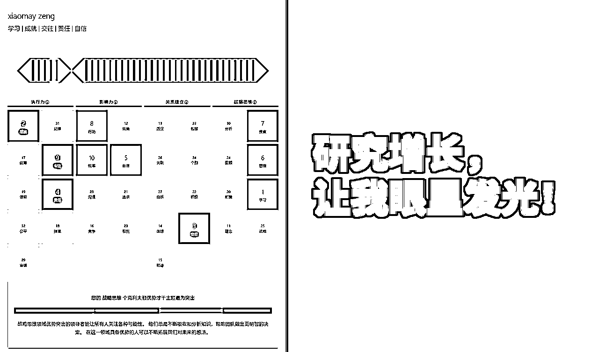
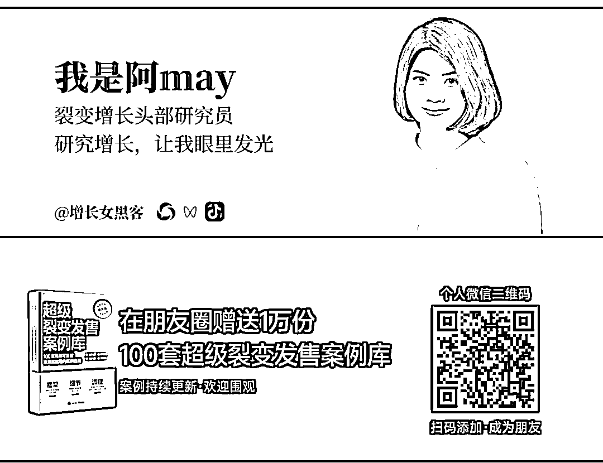

# 阿may：依靠200个私域好友起家，2次濒临倒闭，创业6年，我到底经历了什么？

> 来源：[https://uuy7p3hra0.feishu.cn/docx/IGgadlE6doqGm7xZn24chTWbnMb](https://uuy7p3hra0.feishu.cn/docx/IGgadlE6doqGm7xZn24chTWbnMb)

我是 阿may ，我辈科技创始人，人称“增长女黑客”，1990年出生在广东湛江吴川市，一个四线小城市

很多人知道我，是由于我在刚创业的起盘阶段做一场私域裂变增长活动，3天获客1.5万人，产品用户200多万，刷爆整个运营圈

创业6年来，我一直深耕于私域裂变增长，帮助过科大讯飞、群响、混沌、车海洋、易仓、盘子女人坊等3000+企业获取私域好友5000万+

我还被邀请到生财有术社群、混沌学园、帅张和他的朋友们、首席CMO等各大平台分享我的私域获客经验，，累计为我付费的学员超过2万人：

但是很多人却不知道曾经的我是个社恐，创业之初微信好友只有200人，创业6年，公司曾经2次濒临倒闭，我为认知买单超过300万……

今年，是我进入互联网营销的第10年，也是我深耕私域创业的第6年，今天，我把我不为人知的故事，以及我创业的真实思考和经验教训，全部分享给你。

这是我花费了1个月，总结我在6年的创业生涯里， 像我一个没有任何背景没有资源没有人脉的小老板，是如何在90%创业失败率中活下来的创业避坑心得。

也是 我不花一分钱广告，如何从200好友到50万私域客户，帮助3000+企业获取私域好友5000万+获客增长核心打法的公开拆解。

如果你的企业正在遭遇流量和转化增长瓶颈、利润增长瓶颈甚至正陷入低谷，如果你想深耕私域，苦于找不到运营增长核心打法，那么我强烈建议你看完我这一篇年度长文。

文末，我还准备了我花费3个月打造的100套《超级裂变发售案例库》书籍，送给每一位想要持续获得精准客户的创业者和营销操盘手，想做好私域增长的长期主义者。

# 01、真正让我下决心创业的，是我工作6年，却只有2万存款

我小时家里因病致贫，负债累累，尽管我成绩一向优异但是高中却因没钱一度辍学，最后是在媒体报道下，找到贵人资助才能继续上学，后在贵人建议下，大学选择了211华南师范大学。

大学4年，我努力学习如何做一名优秀物理老师，作为年级代表参加国家级师范大赛获奖，还由于学生喜爱在微博上传作品上了热门获得记者采访登报……

但我天生渴望自由，不爱受束缚，当初我由于在一家半军事化的学校实习，经过实习后，发现自己实在难以忍受一辈子就这样了，不想过这种稳定的、一眼望到头的人生。所以我决定放弃老师生涯，进入社会大学熔炉中。

那会互联网行业正火热，我选择直奔深圳，跟着我表哥一起创业。

那时候的我什么都不懂，跟在表哥身后瞎干，从销售开始做起，努力干了30天，终于赶在最后一天，在表哥的帮助下，我开了第一单！

当我领了第一笔工资后超级兴奋，拿了2000块钱回家，马上给家里置办了四件套，让我们家第一次用上了煤气灶、热水器、消毒柜和微波炉。

这给了我很大的激励，我发现自己还是有点销售天赋的，很快我的月薪就从2500元做到了1.5万，所以那两年在表哥公司做得十分快乐。

一方面是全新的互联网营销领域，我在新事物探索的过程中拿到了很好的结果，自己很有成就感；另一方面公司除表哥外我最大，我也开始学着组建销售团队，也带着技术团队优化我们的网站和后台，

那时候的我们，每个月的业绩都在持续增长，在家装互联网平台也干出了不少名气，最高峰期，我们网站一天的自然流量就高达10万人！

啊，那时候的我，感觉人生走上了正轨，即将迎来巅峰！不曾想，两年之后，我和表哥就因为经营理念的分歧走向了分离。

有一次，在意见争执中，表哥说，我根本没有给公司带来太多价值，就是给公司搭建的销售管理后台比较有用，其他没有什么作用。

我很难过，这一次争执让我意识到，我对于表哥来说，实际上就是一个“打工工具人”，根本不是创业合伙人，我一气之下，就辞职了。

我走得义无反顾，在休息了两个月后，我重整旗鼓，选择了我的第二家公司——牛商网。我拿到了好几份offer，包括打败了海归留学生、复旦硕士等人拿到了英孚市场主管的offer，但是我都没有选择，而是选择了一个只给我月薪4000元的牛商网。

因为我觉得做一家公司，做一些生意，你除了懂销售之外，你必须要懂得获取流量。而获取流量，就必须要花时间学习运营和推广。

当初第一家公司时，什么都靠自己去摸索自己去试，没有任何培训。所以我想要系统学习网络营销这门技能，就想去一家可以给我正规系统培训的公司，而在这类公司中，专门做网络培训的公司应当是最好的也是最适合我的。

所以我当初筛选了已经在业内上市、母公司是做了10年网络营销培训的牛商网，哪怕它是同期给我offer的公司中给的薪酬是最低的，我也毫不犹豫地选择了它，并且一待就是4年。

我用心打造了牛商微讲堂、牛小丫等IP，开启了公司线上直播卖系统的先例，在2017年我们就做到7天裂变流量150万，一场线上发布会收款过百万的结果。

现在想想，其实自己一直都走在自己想要走的目标上面，哪怕此时的目标还不够明确。

我每一次做选择，包括职业的选择，都不是朝着赚钱最大化去做的，每一次都是想走长期主义。

锻炼自己，生长自己，扎根自己，才能走得更快，更远，更稳。

但任何选择都伴随着代价。在牛商网工作的最后1年，是我人生的最低谷。

公司涨工资有个规定，涨幅不能超过8%，我每年领导都帮我特批申请加薪，但是，尽管如此，到了第四年，我的工资还没有过万，还没有回到我工作第一年的薪酬水平。

那时候，我父母已经不工作了，家里要装修，弟弟妹妹要读书，家里的开支大部分都要我来承担，我工作的收入，基本都拿来填补家用了，工作了6年，我每月月光，没有存款，住在一个只有10平米的小房间里，还面临着要跟男朋友结婚花钱等压力。

工作三年多，我没有存一毛钱的积蓄，还把我之前的积蓄往外掏了。没有钱，情绪不稳定，导致我内分泌失调，脸上爆痘，极度焦虑。

而那时候已经工作五年了，我身边那些选择当老师的同学，都已经买房买车了。我每次回去跟他们聚会，都觉得自己好像做了一个错误的决定，因为选择做出来之后，生活并没有变好，反而更差了。

更可怕的是，等到2018年我和恋爱5年的男友举办婚礼后，我们统计一下，我们这个新建立的小家庭总存款只有2万元。

这让刚刚升职的我，感觉打工再没有希望，当初刚好在一个线下大课认识的同学他缺运营合伙人，他擅长技术和产品，我擅长运营，刚好很匹配，于是我决然辞职，开始了我的创业之旅。

然而当初的我，没想到创业如此艰难，我们刚起步时没有资源没有人脉，我的微信只有区区200个好友，大部分还都是老师，这让只有营销经验，但却缺乏商业认知的我，差点在创业的第10个月宣告失败！

# 02、创业6年，公司濒临倒闭2次，我到底经历了什么？

创业的想法是美好的，过程却是艰苦的。我们公司一开始靠一款小程序融资了100万，就招了技术和设计等团队，每个月的团队开支大约要10万元。

刚开始的我们没有经验，只觉得我们把小程序做火了，拉到融资了，就算成功了，根本没想到怎么挣钱。

而为了省钱，公司负责运营推广的就只有我和另外一个伙伴，我们做了很多项目，但是一开始的时候，都是很苦逼地一个客户一个客户寻找，而我的微信好友只有200个好友，产品就推进得非常缓慢。

最后，我无奈之下，开始研究低成本裂变获客的系统打法，最后，我们通过结合分销裂变和战队PK裂变的获客玩法，让我们的小程序起盘获客到了1.5万的付费用户，再结合模型裂变的玩法，让我们的小程序产品快速增长到百万用户！

但是虽然我们做出了爆款案例，也拿到了上百万的流量，也被多家专业媒体报道过，但因为我们对商业的整体规划和认知很浅很浅，我们光是想着用户来了后面变现就好办了，却没有认认真真思考过我们到底靠什么赚钱，只是上架了一个针对C端用户几块钱和几十块的工具会员费，我们所构建的商业模式根本没有办法打动投资人，也就没有办法拉到新的融资。

而我们产品每个月的变现仅仅只有6000元，到了第十个月，我们甚至到了快发不出工资的程度。

就在这时，雪上加霜，三个合伙人中，有一个提出要退出。没有新的投资、账上快发不出工资、合伙人要退出，公司马上就要倒闭了！创业最寒凉的境遇也不过如此了吧。

这时候，我才深深意识到，对于中小企业来说，产品不是最重要的，流量不是最重要的，服务不是最重要的，变现才是最重要！有利润才是最重要！

我不甘心，我第一次创业就这么惨败。我就开始琢磨着想出路，我们的小程序并没有给我们带来多少收入，但是我们推广小程序的裂变玩法却天天有人来咨询，希望能够购买我们的裂变系统和请我当顾问，给他们指导，想要来跟我学习裂变方法论。

我就想到了我可以把这套裂变获客的工具和玩法输送给他们，让他们去推广产品。于是，我开始探讨把我们的裂变系统开发成一套可商用的saas工具。

这一次，我深深吸取了做群勾搭项目的教训，以终为始，从之前围绕着流量做变现，到围绕变现来做流量！

对外销售，并打造了一套自动化裂变获客的流量增长体系课程，对外分享：

没想到一推出市场，大受欢迎，很快，我们一年时间就营收几百万，积累了40多万公众号粉丝，10万私域好友，和3万多企业用户，公司转亏为盈了！

当初我们服务了很多知名客户，包括喜马拉雅、知乎、知识星球等企业，还帮助了樊登读书代理商7天卖出超过1000万的会员卡。

然而，就在我准备大干一场的时候，公司的创始人却跟我提出，要我全部停掉所有营销服务的业务，也不要做个人IP推广业务，全力跟他做相亲赛道，他认为群勾搭就应该往相亲赛道发展，而规划的商业模式中，依然还是没有看到太多短期内盈利的可能性。

而我因为之前吃过企业不变现濒临倒闭的亏，我就不愿意马上停掉现在有现金流的业务，而且做营销服务行业，我很擅长也很喜欢。

所以我跟他产生了很大的意见冲突，最后我是在他说“合伙人就应该要满足创始人的梦想”这句话中，我醒悟到我如果继续在这家公司，实际上我还是一个高级打工人，我们创业梦想并不相同，所以我最终选择退出公司，不带走任何资源，把自己辛辛苦苦2年努力而来的心血，拱手让人。

这里还有一个坑要分享的，我当初签订合伙合同时，实际上商业认知浅到不行，连合同上写着我要在这家公司一辈子，如果退出连投资本金都拿不回来，而且股权的主体根本也不是我工作的主体，我无权查账，也没有约定任何分红规则，只是每个月领1万块工资而已……（这也许不是我合伙人故意这么设置，合同有他人参与设计，但是我的确是踩了这些坑，希望后续创业者不要再踩同样的坑！）

如果不是我的合伙人挺有良心，我退出时把本金退还给我，我就真的只是在这家公司自个掏腰包付费打工了2年……

我退出公司后，开始筹划我的新公司，由于一直都在互联网行业里闯荡，对工具产品特别痴迷，认为互联网工具产品可复制性强，边际成本为0，完全可以满足我想要“把团队做小，业务做大”的梦想。

而这一次选择重新出发，我由于吃了商业认知不足的亏太多，所以选择先去学习深造。

想问下大家，你们第一次想要认真学习创业这件事情时，你们第一时间想到在哪里学习？

我第一选择就是混沌学园，我深深被混沌的“与其更好不如不同”的口号打动，我不想要跟随别人做产品，我想要做一个创新型的营销增长工具产品出来！

在混沌学习打磨了2个月，一边学习我也一边开始组建我的新团队来开发新产品，当初我看到了一个10倍速变化的要素，那就是企业微信，2019年12月，企业微信发布3.0版本，全面支持企业链接外部联系人，最后我结合供需连的要素，梳理出来我的新产品——伙伴猫企业微信获客saas工具

一开始我选择从我所熟悉的教育培训行业入手，并且选择切入的场景是线下活动，找了几个客户来打MVP，发现效果惊人，最高可以帮客户1场线下活动裂变了5万人！

我还在混沌的课程找到了我的天使投资人——

我的投资人之一广州混沌，来源于我付费报名了混沌创新训练营，当初我们团队拿到了全场第一名，这让混沌的执行社长吕宁宁注意到了我。

当初我就想着是否可以找到天使投资人，他就把我推荐去参加了宗毅的裂变式创业营，宗毅是裂变式创业的作者、他的公司是全球的隐形冠军。在裂变式创业营毕业时，我也再次通过项目拿到了全场亚军。

宗大就是在那个时候注意到我的，他说的一句话，让我受益匪浅：“你想要成为什么样的人，你就跟着谁去创业。”

作为业界大佬，他说他愿意投资我个人，相信我，放任我去闯，这句话对我来说，本身就是莫大的鼓励和支持。

我的第二个投资人肖荣燊，3个10亿项目的创始人，C咖创始人，前韩后总裁，他是我在混沌创新商学院课程上的同学，他跟我相互了解后投资了我，我非常感恩老肖，当初我问他为什么要投资我时，他说想要提携后辈，在创业的过程中，他给我非常多战略上的指导，也给了我充分的自由度。

初始资金的投入让我快速启动了saas工具项目，投资人更是在战略定位、信任背书上给到极大的帮助，这是我人生中的3大贵人！

我们公司开始启动企微客户的推广，半年内，我们就拓展了1500多家企业客户，公司也迎来正向现金流，3个月后就开始盈利！

而我那时候由于在2020年疫情爆发之初开了几场训练营赚了几十万，投入了基金，当年翻倍，再加上之前经营知识星球，存款已经有一百多万，当初一方面新闻老是在报道美国不断印钱导致钱越来越贬值，而身边太多人由于买房资产翻倍的信息在刺激着我们，所以当初我就做了一个决定，在2021年2月，我选择在深圳买下了一套600多万的房子。

只是没想到，给完30万定金买下房子的第二天，深圳迎来指导价，我们600多万的房子瞬间变成400多万，不过我当初还是很乐观的，因为房贷的压力于我们来说当时还是不大的，我依然按照流程去办理贷款过户等流程，而在签贷款合同的当天，我突然发现我怀上了宝宝！

当初怀孕并没有特别影响我的工作，我当初在怀孕到三个月时，有一个朋友找到了我，说有个展会，推广了两个月，只推了2000人，他们的目标是线下到场1万人，看看我能不能帮助到他们实现这个目标，介绍的朋友是我一个非常好的朋友，跟我说，别人他真的不放心，非常希望我能够亲自操盘。

我一看，刘润老师是主讲嘉宾，还有很多业内专业人士，展会质量应该不错的，所以就跟展会负责人见面做了一次沟通，初步提出了冲榜赠礼裂变和战队pk的思路，对方非常认可，马上就支付了8万，让我亲自辅导他们团队落地这个项目。

最后，我带着他们的团队，连夜做项目，实现在3天内裂变近6000个用户报名参加线下活动，最终助推活动报名人数累计1.8万人，到场1.5万人的活动结果，这是当初刘润老师作为嘉宾参与这次活动发出的感叹：

然而，正当我为我能兼顾事业和怀孕两不误欣喜之余，我们却迎来了真正的棒头一击！

在2021年7月，我们选择的教育培训行业，由于政策的问题，一夜之间，我们几乎失去了80%的客户！

我赶紧调整赛道，开始主攻线下门店、私域电商等行业，我和我的合伙人，全身心去帮扶我们的客户，哪怕客户只是给我们交了几千块的工具费，我们都一对一做深度服务，就是为了在线下实体、私域电商等之前我们不熟悉的行业打出案例，验证私域裂变这套获客方法，依然可行！

在我们的努力之下，终于，我们做出了大量实体店和私域电商的爆款案例，截止到现在，我们累计帮助3000+企业获取企微好友5000万+

但是，我去盘点工具的使用情况时却发现，活跃在使用工具的中小企业占比太少了，很多客户购买了工具，却根本没有用起来！！！

作为一款裂变获客的工具，我们在服务中大企业时，特别容易出成果，例如科大讯飞、盘子女人坊、烈儿宝贝、读客文化、京东二手拍拍等等，这些中大企业有完整的营销策划团队，有着比较好的品牌知名度、势能和推广资源，跑一场裂变获客活动可能就有几万人参与，甚至于几十万几百万！

更多的中小企业，购买了工具，只是在我们的辅导之下做了一次两次活动，就没有再做活动了！尤其是我们服务线下门店、私域电商这些客户的时候，他们大多都是没有怎么做过私域运营的中小企业，他们在营销策划上的能力，远远比不上教育培训、互联网等行业，他们的团队能力，根本没有办法策划出可复制的获客活动，持续做活动！而他们在微信的成交能力也太弱，就算裂变了客户，却很难成交！

所以，我不断去拜访朋友、调研客户真正的需求，他们告诉我，对于中小企业而言，他们根本不是要一套工具，而是要一套可复制的获客解决方案！！！我经常被客户私信问，

“阿may，我们非常认可你们团队的能力，

也觉得你们的工具很好，但是我们的团队不会做，

你们有没有课程？教会我们怎么做。”

“我们也想做裂变获客方案，但是我们没有人，

你们有没有代运营服务？直接帮我们做”

而让我最有成就感的，却是帮助中小企业实现增长。因为帮助中大型企业成功，我们是锦上添花，但是帮助中小企业，我们真真实实是雪中送炭！

我们在产品交付上也很是痛苦，我们团队经常半夜三更还在辅导客户落地，要教会的东西太多，我们不仅仅是要教会他们策划获客活动，还要教会他们怎么使用企业微信，还要教会他们怎么承接客户，服务成本巨高无比，一算账，公司收企业几千块，根本覆盖不住我们的人员成本！！

我面临着如果只是提供工具服务，我们给中小企业客户就无法提供持续获客的长期价值，而我深深知道，作为一个saas工具，如果客户不会用就谈不上续费，那就意味着我们公司将会一直要不断获取新客户，而跟我要做“关系复利”的理念是违背的！

我们创业，理想中的状态是做出好产品，用户主动来，有一支不用管也能自动运行的运营团队，能从事让自己快乐的事业，却偏偏在现实中活成了自己讨厌的样子——跪着求客户来，天天拼命赚钱养团队，又累又辛苦！

怎么办？这让我很是揪心！我非常不满意这种状态，我的团队也很痛苦，总觉得那那那都不对，虽然很努力很努力，但是非常不开心！

而行业内的各种消息也在不断冲击着我，我看着我的好友鉴锋所创立的零一裂变更换为零一数科，从做裂变营销全面迭代为私域代运营服务，甚至于还有朋友跟我说，裂变这种方式早就过时了！

我在生孩子、坐月子的时间里，都在思考公司下一步应该怎么走，我想，如果继续以这样的情况发展下去，公司在我的带领下，我最多只能带到几百万一千万的营收规模，短时间很难有什么突破！怎么办？怎么办？未来还能怎么走？

我去请教我的投资人老肖，老肖告诉我，有三条路可走：

第一条路转型做培训，把我们所积累的方法总结提炼出来，去针对中小企业和营销从业者做培训，虽然没办法像他那样能收取400万一天的咨询费，但是我可以收得便宜点，再加上运用新媒体工具，前景还是可以的。但是这条路，什么时候都可以开始，我可以再锻炼一下自己，他认为人在35岁之前应该要让自己变得更值钱，等我拥有了更高的眼界和能力的时候再开始也不迟。

第二条路是跟他干，跟他学习干消费品品牌的一整套方法，从营销开始到供应链，大约需要5年时间，5年之后我可以自己再干一个品牌，品牌干成了至少可以10年无忧。

第三条路是选择一个需要增长能力的企业，加入到这个企业里当合伙人，相互互补，彼此成就，这也是很好的路径。

老肖的战略能力在我心目中是神一样的存在，当他拎出来这3条路时，我非常激动，第一条路我有点想走，但我的确认为这条路随时都可以走，我应该走第二条路和第三条路。

我决定选择第二条路，他从团爆品后开始启动C咖时就邀请我加入，当初我还想继续做伙伴猫，没想到他只花了1年时间，就把C咖带到了月销6000万，老肖的品牌操盘能力真的是顶尖的，我也真的很想未来能像老肖那样做一个品牌出来，能跟着老肖身边学习成长，一定是我人生中最大的幸运。

我决定下得很快，在跟老肖在广州谈完回深圳的路上，我打电话给我的两个合伙人，跟他们说明了情况，说我想要停掉现在的项目，我想要跟着老肖干，在他身边学习。

合伙人他们其实也被公司的困境压得很辛苦，他们也很快就一致同意了。我开始思考，怎么处理公司的员工和客户售后的问题，继续保留2个员工做售后服务，其他团队解散，不再接收任何新客户……这是我第二次面临着要解散团队的决定，看着努力2年多的作品，我其实心如刀割，但是为了追寻生命中的呼唤，我感觉我又应该当断立断。

但是我回到深圳跟先生说完之后，却发现，因为买房这个决定，我每个月的房贷高达2.5万，生完孩子后家庭开支比我预想中要高得多，如果我选择跟老肖学习做消费品品牌5年，这5年学习的时间里，我每个月收入可能是2万多，这样的收入是无法覆盖我家庭的开支，如果我要拓展收入，就会涉及到我不能全身心专注投入，这让我很痛苦。

我很无奈，只能谋求第三条路，同时也在看看是否有合适的营销服务企业可以收购我们公司，让我们的客户可以得到妥善的售后服务，同时也给合伙人、股东和员工一个更好的交代，其实曾有一度小鹅通就想收购我们产品，不过在有赞爆出要裁员三分之一消息后停止了这项计划。

我只跟我身边3个要好的企业家说了这件事，想要问问他们的意见，结果他们马上就抛出了橄榄枝，年薪给我出到100多万，甚至于有一个跟我说，不要去任何公司，就跟他合伙干短视频产品，他负责帮我融资5000万……

而这时，我的一个咨询服务客户，开拓了自助洗车行业现在有3000+门店的车海洋Lucy由于看到我们公司变更企微好友，就马上给我打来了电话，问我公司有什么变动，她在2020年就开始邀约我加入她公司，当听到我当初的思考和变动时，她就马上邀约我加盟车海洋。

我当初也没有想好怎么做，本来是想说先做一个超级个体试试看，不过当初我是混沌华南的私域顾问，我4月1日要去广州给混沌团队讲解方案服务，当初我就一起约了lucy聊一聊。

只是让我没想到的是，那天我去到车海洋跟lucy和费烨见面10分钟后，我就做下了一个重大的决定，举家搬迁到广州，来做车海洋！这是我当天写下的朋友圈：

是的，我跟Lucy和费烨聊完的感觉是，我们灵魂共振了！

当天我们提到的“灵活创业“”共创共享“”美好生活“”自增长”等关键词就是我一直在追寻的梦想，就像是被使命召唤那样，我就毫不犹豫来到了广州，没有像跟其他人那样去聊什么股权、收入之类的东西，因为我认为，事对了，人对了，这些都不重要！

我想说，来到车海洋，如果以生命长河来看，也许是我做过最好的决定，我收获到了三个人生非常宝贵的战友，lucy、艾文和费烨。

我在车海洋真正深入探讨了组织裂变和模式裂变，极大地完善了我对于裂变的理解，这让我从裂变从用户裂变的狭隘理解，进化到了用户裂变-组织裂变-模式裂变的完善系统：

同时，我还拿到了充分的自由权，我甚至可以抽出部分精力来服务我们伙伴猫的客户，那时候我每个月都会抽出半天时间来给我们的客户辅导落地：

为了更好地服务好我们的客户，我还和六六合作，推广了他的四步客流密码线下课程，我也在其中讲半天课程，让我们的客户能够学习到科学获客的方法：

另外一方面，我被充分授权在车海洋做任何我想要做的关于增长相关事宜。

我开始在车海洋搭建增长部，开始搭建车海洋的自有私域和自有积分商城，还带着加盟商去学习怎么做抖音、怎么做招商IP，还开通了美团等等拓客渠道。

尽管车海洋内部比较缺乏新媒体基因，我却要努力在车海洋搭建起新媒体火花出来。

我是那么地无所无惧，又是那么地张扬，但是我其实高估了车海洋对于营销增长的需求，也低估了内部组织沟通对接的难度，对于车海洋来说，在B端来说根本不缺人加盟，缺的是合适的场地，在C端来说，洗车更多是抬头生意，新媒体有些作用，没做几个月，我们新媒体的团购单已经有几万销量了，但是更多还是地面推广在起作用，一个好的选址比其他推广手段要重要得多！

去年年底，我在策划车海洋年底“全民狂欢节”活动时，我由于是新冠次密接被困在家里2个月，又遭遇新冠爆发阳了一个星期，在我高烧到40℃说不出话时我还在坚持指挥工作，然而活动做得并没有我预期那么理想，我们轰轰烈烈地做，但是最后销量结果还不如往年。

我开始怀疑我是不是真的如大家所说那样，我是不是真的有能力，我到底真的擅长做营销增长吗，还是说之前我之前之所以能做出那么多成功的案例，只是我很幸运而已？！

我感觉我找不到我在车海洋内部组织的生态位，我好像无法为车海洋创造更大的价值。所以在去年年底，我提出我要离开车海洋内部团队，转成当初车海洋还是我客户时我和lucy一起提出来搭建的外部共创共享团队——车海洋蓝鲸团队，成为车海洋生态圈合伙人，继续寻找我的生态位。

但是这其实让我极度痛苦，要知道，我当初可是举家搬迁来到广州的，甚至我先生是为了我，辞掉他每年都涨薪2次的深圳500强公司，来到了广州。家人希望我在车海洋闯出一片天，我却说，我在车海洋找不到我的生态位，我如何面对家人对我这么强大的支持？

而在这1年时间里，Lcuy和艾文对我如家人一般好，给到我无微不至的关心和照顾，lucy、费烨和艾文更是带给我关于创业的各种认知，极大地填补了我对于亿级以上企业如何经营以及团队如何管理执行的知识盲区。我又怎能辜负？

另外，虽然说投资人给我极大地自由权，但是我拿着他们的钱，是要给他们回报的，如果我不能带给他们回报，那他们投资就变得没有意义，他们对我帮助如此之大，我如何能够带给他们回报？

而且，我们买的600多万房子，邻居不断爆出有人卖出价就是400多万，我们买房3年多，支付房贷近100万，但是如今的贷款本金却超过了房子售价，带上房子首付，相当于3年我们亏掉了270万！在买房这件事情上，我根本没有深入做研究，真正让我深刻地体会到什么叫做“凭运气赚来的钱，凭实力亏回去”。

自我能力怀疑，无脸面对家人，无脸面对lucy，无脸面对投资人，房子跌价房贷压力……五座大山压着我，我觉得自己很差劲，很差劲，很差劲，生完孩子后好像智商降为负数，把事情搞得一团糟……为此我痛苦了5个月，今年的5个月里，我由于孤魂野鬼，我不知道自己在干什么，也不知道自己该干什么……

我天天在总结我过去到底做对了什么，又做错了什么……

直到我看到了混沌创始人善友教授今年在厦门的大课，他所说的美好作品，深深戳中了我：

人活一辈子，到底想干什么呢？我要干那个我喜欢、我擅长、很美好（对社会有价值）的那件事！

这便是我的美好作品！我一心就想要追求“哪怕到了80岁，依然可以跳着踢踏舞去工作”的事业！

我开始研究我擅长什么，我喜欢什么，对社会有价值的是什么？

我发现，研究增长这件事，让我眼里发光，我要是看到一个火爆的营销事件，就会深钻进去研究！

而我的盖勒普展示出来，我非常擅长学习、战略能力出众，而我又特别喜欢分享，哪怕在我只做工具产品的情况下，我都经常对外讲课分享我的营销思考和打法！如果你是长期关注我公众号的读者，应该有看过我部分分享的案例内容。

今年，我还花了接近3个月的时候梳理，把我们这几年来操盘的案例以及部分我收集研究的实战案例，整理成为一本《超级裂变发售案例库》：

里面大多数都是我和我团队陪跑客户跑出来的获客案例拆解，每个案例都拆过2000多字的拆解， 如果你想要领取这份案例库，可以扫码加我微信领取：

而我真的很想帮助像我这样没有资源没有人脉的中小创业者，帮助他们能够创业成功，我非常同意马云的这句话——“商业就是最好的慈善”，商业的本质是交换，商业，让多方受益，因为都受益，才愿意持续下去。现代生活的便利，大多可以归功于商业。

所以在此背景之下，我的美好作品涌现而出：

从我真正认知到我的使命之后，我闭关3个月，把我这么多年来低成本获客的一线操盘经验做个完整的梳理和打磨，在我之前做用户裂变客流增长的基础上，深度融合私域发售、组织裂变、模式裂变等前沿玩法，迭代出一套适用于当今中小企业、营销服务商和个人IP的「裂变式发售增长系统」。

找到使命的感觉真的很好，实际上，我们公司在找到这个使命后，团队精神气瞬间焕然一新，积极向上，通过两次内测学员的打磨，我们实现了超过80%的客户帮忙转介绍、97%的学员打出超级满意的结果！

我很认可黄有璨说的：

今天的宏观环境下，大多数人要是持续处在一种“卷游戏”里，是很难感受到长期自洽和幸福的。

而“学会以自己为中心来设计+重构自己的业务模式”，就是要追求让自己作为一个创业者，处在一种身心合一、内外自洽的状态里，长期体面而踏实的赚到钱。

我觉得找到自己这个事情，真的是无比的重要！

也正是因为如此，我们才会感觉到幸福。

创业的后半段，我的人生，将会在未来10年，围绕着这个美好作品继续打磨，后面有时间，再跟大家汇报。

以上就是我，在2023年12月，掏空自己1个星期，写的一封长信，没想到又是1万多字，希望我的创业故事，能给你带来启发和力量，谢谢你看到这里。

创业这6年来，感恩遇到众多贵人一直帮扶支持，他们是：吕宁宁、宗毅、肖荣燊|光头肖、翁丽青/Lucy、甄妙、鉴锋、张守君、KK、张小潘、卢向群、六六、王文涛、陈勇、亦仁、Caoz曹政、杨坤龙、spenser、stormzhang、黄长征、木头、徐志斌、王文涛、端银、刘容、谦行公子、费烨、祁杰、嘉伟、牛牛、黑小喵、梁仲鹏、袁慧君、尹基跃、张希伦、弗兰克、小白哥、田建梅、晴格格、Menu、分销王子、文林、千喜、关键明、陈掌柜、苏轶、付旭、刘驴、宁培、韩夜、阿喵、杨涛、赵蕾、王惠、富叔、时明、Terrence、张然、考拉、徐丹丹、谢老师、冯涵等，感恩大家的一路同行，我才能走得更稳更远！

最后，附上我的座右铭;

善良比聪明更重要！聪明的人走得快，善良的人走得远！

阿may伙伴猫创始人、私域增长圈主理人

2023年12月5日

如果你对我的故事有启发，欢迎分享给更多朋友和社群。

你的支持，是我持续输出的动力。