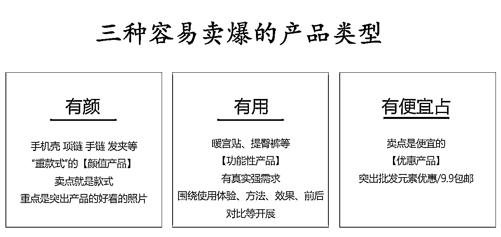
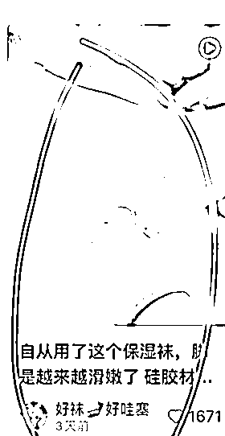

# 12天卖了23.6万，小红书电商测品方法解析

> 来源：[https://hi428l7bh89.feishu.cn/docx/JROHdC0r8oe8g3xlu8Uc5KtrnPd](https://hi428l7bh89.feishu.cn/docx/JROHdC0r8oe8g3xlu8Uc5KtrnPd)

哈喽大家好，我是小刀~自我介绍一下

抖音半无人直播GMV突破3000万

小红书电商矩阵中，蕞近又爆了4个品（美妆工具、护理用品、头饰、家居服）

组织的《小红书5天免费实战特训营》已超过4000小伙伴参加

很多人最近都问题，小红书电商是不是有点晚了还能不能做。

不拿老店数据，跟大家分享最近2周新爆的店。

这个是纯新店，11.26日开始出了第一单～今天结束差不多24万gmv

这个号做了1个月了，但也是11.25号开始爆量的，马上也要突破20万了。

所以我的结论是：不晚、可以做。

但是也不要被我们这爆的店铺迷惑，整体来说，小红书电商肯定是比前几个月更难了的，而且大概率后面会更难一些。

野蛮期渐渐过去，更要拼实力了。

言归正传，这是【小红书电商选品】系列第四篇，想跟大家分享测品。

很多小伙伴都知道做电商要测品，做小红书也要测品。

但是很多人困惑于，测品到底是在测什么？怎么测？

今天跟大家讲一下我对于测品的理解以及一些我们的实操经验。

【所有的方法论都是指导实操的，不要沉迷方法，最有效的还是知道方向快速开干、不断优化！】

搞钱搞钱，搞在前✌️

本篇文章阅读目录

1、测品重点在于测什么？

2、测品怎么测才能提升成功率？

*   封面怎么做？

*   视频剪辑注意事项

*   标题怎么模仿

3、不同类型产品测品的侧重点

*   【有颜】类型产品怎么测试？

*   【有用】产品类型怎么测试？

4、测品的几个注意点

5、做小红书的心态秘诀（灵感来自于亦仁之前分享的长期主义）

建议对小红书感兴趣的、准备入局小红书的小伙伴，结合之前的几篇文章进行综合阅读。

正在实操的一定要仔细看看细节篇～

因为我的系列文章有一些概念是连续的，为了方便阅读，我这里补充一下小红书选品篇的内容

三种容易在小红书上容易卖爆的产品：有颜值的产品、有用户的产品、有便宜占的产品。

## 1、测品主要测的是什么？

#### 1.1 小红书是爆品+爆文特点

先跟大家说一下小红书目前的做法：基本上是找到一个【爆款产品】后会持续围绕这一个品写笔记。

新手入局，建议采取【混剪测品】+【稳定出单后开始实拍】的策略。

#### 1.2 测品是在测什么？

很多人以为测品就是看看这个品行不行，这是不对的。

我们在讲过小红书带货也是完整的人货场逻辑，我们测的是【货】和【场】，即产品本身和你对这个产品的卖法。

简单来说：你现在要卖苹果～

一个苹果有很多卖法，有人说这个苹果甜，有人说这个苹果vc多，有人说这个苹果吃一口平安。

你观察发现吆喝苹果甜和VC的卖的更多。

那你现在要去卖苹果了，你怎么做？

首先就要测试：你也去吆喝这个苹果甜、VC多，看能不能卖出去。

我们选品篇讲过，能有销量的品都是好的产品。

我们要测的是这个时间以我们的笔记制作能力，能不能把这个好的产品卖出去。

产品本身行不行，是要在选品阶段进行判断的，这样保证你经过筛选，测品有更高的成功率。

这个建议大家优先去看一下选品篇文章～有一个选品判断部分，建议多康康。

所以要想尽各种办法有效测品。

有效测品就是：你已经说了这个苹果甜，说了vc多，想尽了办法还没卖出去之后放弃。而不是随心所欲自己创造卖法，说 这个苹果闻起来臭吃起来香，你们也试试，结果没有人买。

你上了一个品，没卖出去，可能不是品的问题，有可能是因为你卖错了。

每一条笔记都是你面对很多人的【售卖】，你卖什么重要，你怎么卖也很重要。

测品首先要能做到的是，你已经穷尽了这个产品相关的【封面】【脚本】测试。

已经穷尽了这个产品相关的【封面】【脚本】测试后，怎么进行创新，这个就是需要进一步的能力了，我们今天先针对模仿这一阶段进行详细解释。

其实如果再严格一点，运用的不同选品方法，做不同类型的产品，测品的重点都是会有差异的。

这一部分差异后面详细讲。

## 2、测品怎么测，才能提升成功率？

小红书的笔记有封面、标题、内容等元素组成，为了方便后面讲解，我把小红书笔记拆分为：

*   封面（图片）

*   视频部分

*   文字部分【以标题为例】

我们前面说过了，目前建议大家测品等时候还是要通过【图片/视频二创】+【文字部分模仿】完成。

也就是传说中的“抄！”

这里需要注意一下，我们在测品的时候有2个原则：

脚本和封面要对标小红书站内

素材要优先去抖音找没有被混剪过的素材，越新越好。

看到这里，很多人都会觉得【谁还不会抄啊】

1分钟的时间，先看看下面2组作业，你们觉得“抄”的是否到位？

1⃣️ 第一个关于玉米的。

看起来标题和正文模仿的无懈可击。但是为什么数据差异这么大？

图1的爆款的笔记，产品是白玉米，相对少见。所以搭配标题【惊艳】是合适的。

爆点在于以种草视角分析给了大家一个【少见的好吃的产品】。

但是图2的产品是什么？ 是棒槌啊！！！我从小掰到大 ，玉米地全都是。

我***对不住，但是真的惊艳不起来。

你这就像是图1是肖战，图2是黄渤，你可以说：被肖战的脸惊艳到了，但是黄渤更适合的话术是：被演技惊艳到了。

2⃣️ 第二个是关于内衣

这个很多人都能发现首先图2就比图1本身质感就差很多。

但是我想提醒大家的是标题。

图1把价格29.9打到标题里，是因为29.9的价格+高大上的图片，完全符合我们爆款的【有便宜占】，所以这时候放到标题当卖点是很合适的。

但是图2不高大上+价格是49.9 ，这个价格不算贵，但是对很多人来说不算【有便宜占了】。

⚠️ 本质上这两个错误，都属于对于自己要卖到产品卖点（用户为什么买你的产品）这个问题没有想清楚。

给大家举的这两个例子，是想提醒大家回头去看自己的笔记，模仿是不是模仿对了。

如果你已经意识到在模仿环节可能出现的问题，那我们开始正式操作了。

#### 2.1 封面怎么做？

很多人犯的第一个错误就是模仿了抖音的封面。

牢牢记住，抖音重要的是前3秒，小红书才是封面为王，所以封面和标题模仿的对象，一定是要选择小红书站内模仿。

##### 2.1.1 封面第一阶段

这里为了更加方便理解，我直接用我们10月份爆了20多万的硅胶保湿袜给大家举例子（现在这个品过时了）：

01 —直接搜索产品名字，按照最热排序

02 —浏览筛选最近1个月（如果没有就时间拉长到3个月、6个月）最高点赞的笔记

优先选择最近时间的爆款封面模仿

03—用微信小程序-好东西，保存下来【爆款封面】和【标题】

04—分析爆款封面，找到封面来源

以足套最热的封面举例子：

第一步：分析

排序第一的封面，是白色的背景+手上有金镯子+脚正在套足膜。

第二步：寻找

最好的一比一模仿（即你的封面也要包含白色的背景+手上有金镯子+脚正在套足膜） 。

找到这个封面图来自于哪个原视频，直接去原视频抽帧相似画面（可以用winkapp截图），保证你抽到的画面包含第一步分析中含有的元素（金镯子，正在套足套）

第三步：去重

这个主要看美图秀秀篇，其旋转一定角度必不可少。

⚠️ 注意⚠️

如果找不到原视频，就进来找相似度更好的图片。

这个图片最好来自于某个视频的截图，这样你去截图重复度会低很多。

一定要尽量1:1模仿。

爆款用的什么文字你就用什么文字，爆款把文字放哪里你就放哪里，爆款用什么颜色你就用什么颜色。

✍️ 补充说明

很多人也会直接扒爆款封面下来去重使用，这样效率更高也能爆。

但是我们比较怕号嘎掉，步骤就多了一些，这个你们自行选择。

##### 2.1.2 封面进阶方法：

✍️ 分析这个产品背后的用户需求是什么。

拓展搜索词，去找更多可能爆的封面，跟大家疯狂内卷的封面进行差异化。

比如，硅胶足套背后的用户需求是：脚部护理、脚步保湿，痛点是脚干。

那就可以开始搜索【脚部护理】【脚步干裂】【脚膜】等系列相关词，去看是否有可以借鉴的封面模版。

✍️ 去看这个产品之前有没有类似款式。

比如这个硅胶保湿袜爆之前，其实有很多其他款式的保湿袜爆过。

去看之前产品的封面，按照封面分析方法进行分析模仿。（我们的第2个爆款封面也是这么找出来的）

✍️如果上面方法都找不到合适的，就大胆多测试

我们最开始爆的这个品的号，封面是自己测出来的，因为小红书还没出现爆款。

但是不是毫无逻辑的测试，比如优先从抖音爆款前3秒中选取画面。

这个应该不用多解释了吧？

#### 2.2 视频剪辑注意事项

@保证混剪力度（我们现在都是3秒内换一个素材）

@不要改变爆款音频

@尽量保证爆款素材前3秒保留

小红书平台混剪查的越来越严，不能偷懒

除了是你自己拍摄的图都不建议拿来就用，除非你确定这个素材没有被用过

现在同样的内容在自己的账号也不能多次发布，会违规

已经搬运违规的，建议直接做新账号，违规账号每天发布2条原创视频，3天后天天去申诉试试

已经稳定出单的产品建议开始实拍

#### 2.3 文字部分怎么模仿？

##### 2.3.1 判断爆款笔记标题是否是“爆款标题”

👇这种标题就完全没有参考意义

##### 2.3.2 卖点内容保留+修饰部分替换

以实际案例展示

✍️ 爆款标题1： 姐妹们一定要试试这个超简单的抓夹鸡毛头!

我们首先要能判断，这个标题的关键词是什么。

一个是简单（女生的刚需），一个是鸡毛头（为了好看），所以在改写的时候要保证简单+鸡毛头这两个关键元素存在。

超简单❗这个抓夹鸡毛头也太美了ba

有手就会❗10秒钟搞定抓夹鸡毛头

✍️ 爆款标题2： 这才是夏天该穿点内裤吖!!好薄好透气

一个是夏天，一个是好薄好透气。

又薄又透气❗我宣布今年夏天就穿这个内裤!

夏天的快乐就靠这个内裤了🧊又薄又透气

小红书对于标题的重复查的不严格，实在觉得麻烦。

可以直接在原爆款标题改几个文字和标签即可。

姐妹们一定要试试这个超简单的抓夹鸡毛头!

集美们！赶紧试试这个超简单的抓夹鸡毛头!

## 3、不同类型产品的不同测试偏重

### 3.1 如果选的品类属于【有颜】

选品篇我们有讲过，有颜类型的产品，如饰品、服装、手机壳、鞋子、宝宝等种款式的产品。这种产品本身什么样子就大概率决定了这个产品能不能爆。

#### 3.1.1 重点应该放到【选款式】上

如果款式不对，你怎么努力都有可能白费。

我们最近爆了2个头饰的帐号（是下面这种类似的发箍），就3张图2个号已经卖了1.5万单。

我们的号不能发，发一个其他的作为示意，下面这个帐号也是卖着一个款式，图文就爆了。

所以，决定做这一类型的商品，就要做好长期战斗选款式的准备。

一模一样的拍摄风格，数据差异的唯一原因就是【款式本身】。如果是有模特出现的：会增加整体画面好看程度（模特+产品+拍摄）的影响因素。

很多人想做饰品，这里给大家补充一下：

一般来说，饰品类在小红书能爆起来的大多数是原创（相对来说不绝对）～

因为不同于百货等品类，很多饰品没有有足够多的混剪素材。

饰品里面唯一方便混剪的品类是头饰里面的（抓夹类），因为这类产品除了展示产品本身，还可以展示用途--怎么扎头发。

所以如果你做这个方向，建议你选品的时候考虑一下【电商平台选品法】，即盯紧有原创能力的淘宝/抖店等，去截他们的款式和素材。

说到饰品，补充一点内容。

太多人谈到小红书就是要做饰品～

（表格数据来源于灰豚数据）

1、大家可以看表格最上面那部分：饰品是一级类目，下面还会有很多二级类目，如眼睛/镜框/手链/耳饰等

2、所以饰品下不同的二级类目差别蛮大

从二级类目看，眼镜/发饰/脚链爆文率更高（近30天）耳佛珠、吊坠、耳饰，爆文率低于1%

3、很多二级类目下设三级类目

如头饰还分为发夹/发簪/抓夹/发带等，很明显相比而言-发箍和发夹，相对爆率更低

相对来说，发带又比发夹好做

上面这是大品类看，三级类目下还会有具体款式～

这个分享想让大家感知到：看品要往细分类目看；学会用数据筛选更容易的品类

#### 3.1.2 款式类测试5条左右即可

在你笔记不出错的情况下，一个款式类产品测试5条就能明显看出数据好坏了。

✍️ 友情提示：如果审美一般+剪辑能力一般+有点懒，慎重做这个方向。

### 3.2 如果选的品类属于【有用】

你能选到的用途类商品，大概率都是在某一个平台已经爆起来的产品。

#### 3.2.1 如果这个品在小红书已经爆起来了

这时候重点会放在，是否有新的爆款封面+新的爆款素材。

比如下面这个产品，扁平足矫正鞋垫，那可是也火了很久了。

但是过一段时间，这个品都会再火起来（同类的比如 小白鞋清洗剂 、缝隙刷之类的）。

因为有用的品能火起来，证明这个品一定可以戳中用户需求，但是之前【种草】内容，大家看腻了，这时候你有一个新的【种草内容】出来就可以了。

比如扁平足矫正鞋垫，上一周爆的这个笔记，直接脱离了产品打的是【腿变直】的点（这样的坏处就是大概率转化不会特别高），就又爆起来了。

类似的品，比如护腰坐垫，一直能有人爆。

这就回到了我们选品的那个问题：你有没有能力去探索新封面，重新打爆这种已经爆过的品？

如果觉得做不到，那就老老实实现在在爆单品，快速跟品～

#### 3.2.2 如果这个品在小红书还没爆起来

这时候拼单就是判断力和执行力了。

结合选品篇内容来看，用途类产品能爆起来证明一定是有需求的，那判断跟小红书的用户群体一致以后，就要大胆的测试各种可能爆的封面和脚本（逻辑类似封面部分）。

#### 3.2.3 用途类商品 建议多测试几条

一般来讲，有用的产品相比于有颜类商品，可以混剪的素材更多，可以延展的卖点也更多。

一个发箍再怎么好看也是只能带到头上的发箍，但是一个缝隙刷，是可以到处的缝隙都刷的。

所以针对【有用】类型的商品，一般建议穷尽的情况下测试10条左右。

## 4、测品的几个注意点

#### 4.1 要慢慢学会数据分析

我在上一篇 分享过数据分析思路。

测品蕞重要的是能通过测试判断哪个封面更好、哪个脚本更好、哪个素材更好？

把测出来的：好的封面+好的脚本+好的素材放到一起，那不是钱哗啦啦到你兜里了。

#### 4.2 前期不需要过度追求“垂直”

大多数小伙伴，都知道做小红书要垂直，所以做了一个方向没有结果还硬做。

我的经验是，前期新手很难上来就选对方向，所以同一个帐号保持的是大方向一致且人群一致即可。

比如：头饰、手饰、戒指、帽子、裙子，背后的大人群都是爱美的女生。前期拿不准的情况下都可以测。

等测出哪个产品效果比较好后，再专注数据好的品。

#### 4.3不要过早放弃也不要钻牛角尖

款式类产品，测5条左右不出单就可以考虑换；用途类产品，测10条左右不出单也可以考虑换品，前提是保证你的素材过关。

有出单过的笔记，不要轻易删除和隐藏，小红书很慢热，说不定哪天就爆了。

## 5、关于做小红书的心态

小红书很多新人入局的时候网感一般，每次看到200个小眼睛就很崩溃，从而特别容易放弃。

我就想来一个方法来鼓励大家，一般这个方法语言表达会更有说服力，这里你们自己脑补。

我现在是用这个方法来鼓励小伙伴们坚持，反馈很不错。

根据过往情况来看，100条有效笔记赚2万的可能性还是很大的。

所以如果你选择相信这个理念，你的每一条笔记都是在赚钱，不过钱存在了储蓄罐里。

这个储蓄罐你现在没有密码，但是你只要坚持住，密码就在你发完100条笔记以后会出现，钱也会在那个时候到你的兜里。

你现在已经写了10篇了，已经存进去2000块钱了，如果放弃就什么也没有了。

你，不再坚持坚持吗？ ？！！

清醒一点，你要是停更，你的2000块就被别人揣走了！

蕞后，最好的方法是，开始行动～共勉