# 新手入局视频号电商带货，持续迭代实现单日GMV 3w+

> 来源：[https://vxqm3o3stzd.feishu.cn/docx/LKzbdxS3DopmiRxwYj2cGAElnbg](https://vxqm3o3stzd.feishu.cn/docx/LKzbdxS3DopmiRxwYj2cGAElnbg)

# 自我介绍

哈咯大家好，我是达达，一个视频号带货新手。今年3月份从互联网公司裸辞后，我一直在探寻自由职业的方向，短

短半年下来，先后尝试了短剧cps、小红书无货源、视频号带货等多个方向，其中，在视频号上拿到的成绩最大。整

个过程心酸只有自己晓得，颠沛流离说不上，但无数个失眠的夜晚却是真实存在的。直到现在，不敢说自己已经站稳

了脚跟，只能说是找到了一点方向

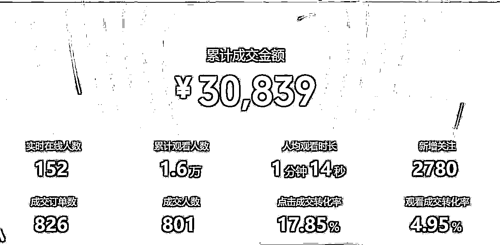

# 初入视频号电商

今年5月份，当时自己还在做小红书的无货源项目，品是直接一件代发，素材也是搬运混剪。做过的朋友可能知道，

小红书无货源从5月份之后就比较难做了，不仅是混剪素材易违规，同时，随着平台对无货源的打击力度越来越严，

且不说赚钱，一不小心店就会直接被封。那时的自己心高气傲，单打独斗，偏偏想在这个项目上拿到结果，结果死磕

到最后，不仅GMV没做起来，整个人的自信心也受到了极大的打击。难道真的是我自己的能力差吗？现在回想起来

，能力是一方面，最主要的是，5月份已经是无货源模式红利的尾期了，在大势面前，个人的努力微乎其微。

没有收入的日子真的很痛苦，迷茫痛苦之际，自己就天天在生财里面刷帖子，试图找到适合自己的新项目。后续经过

自己的标准判断，觉得视频号带货这个方向可能还有一些机会。但由于完全没有经验，于是第一想法就是找有经验的

大佬付费学习，最后选择了当时的小李同学（当然现在已经成李百万了哈哈）

链接上百万之后，就开始踏出视频号带货的第一步。当时我们打的品还是偏传统文化相关，我本来对自己没抱太大信

心，因为自己之前从来没直播过，结果开始发视频的第二天，视频数据就非常不错，于是在火急火燎中，开启了自己

人生的第一场直播带货。尽管话术非常不熟悉，但也转化了几单，从来没有想到，正反馈来的这么及时！这给了当时

的我非常大的信心！

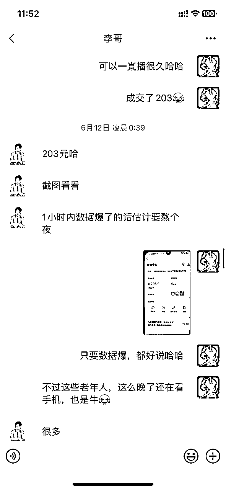

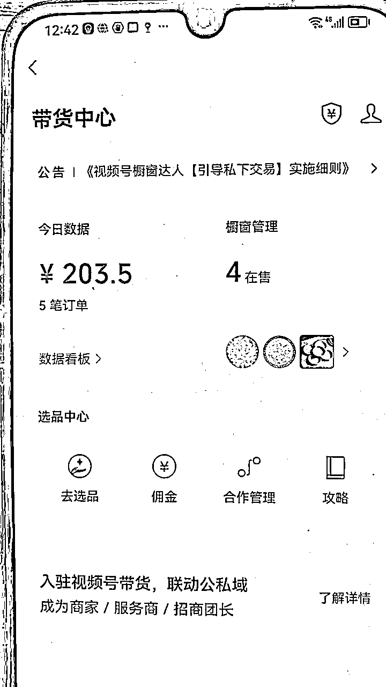

拿到正反馈之后，立即再办新号！再继续剪视频！继续发视频！不得不说，视频号真的非常给力。到第三天的时候视

频直接爆量，于是又火速开始直播，播了2个小时gmv就到了3600+，佣金1800+，这是人生第一次体会到爆单的感

觉，兴奋的一晚上没睡着

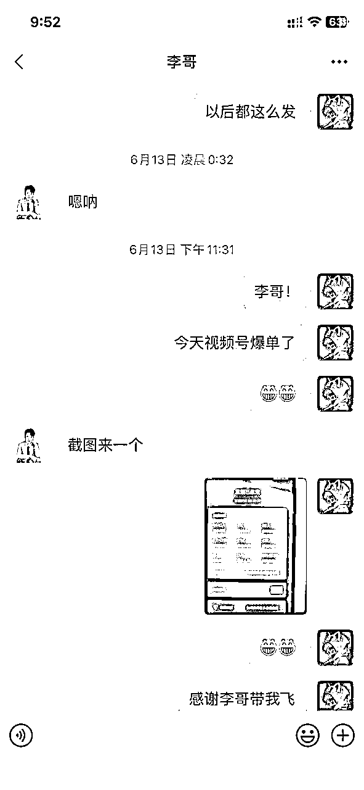

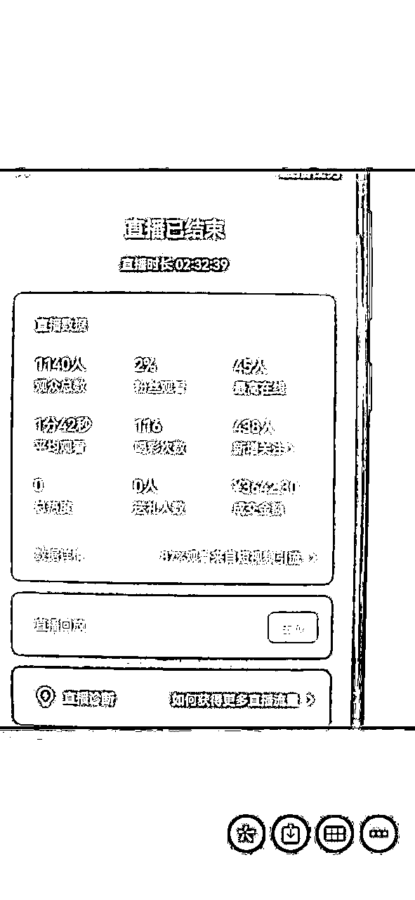

在后面的几个月里，我又跟着尝试了百货连怼连爆玩法、剧情类打法等多种玩法，期间也大大小小拿到了一些成绩，

但是一直没有突破自己的目标（日入过万）。过程中也有非常多的煎熬，发了视频直接素材不过审，素材刚跑起来又

被同行举报了，跑到10w播放就过不了人工审核了等等。视频号给我整体的感觉就是：迭代非常快，你需要不断的跟

上他的节奏，跟上了就有肉吃，没跟上就什么也没有。

虽然玩法在迭代，但是这些正反馈告诉我，视频号这个方向是可以做的。一二线城市的中老年人人群优质，消费能力

强，可以做到较高客单+高佣金+高播放，是有机会实现自己的目标的，所以即使困难重重，但也还是坚持了下来了，

接着就是大家最上面看到的，在最近的滋补品打法上，实现了自己日入过万的小目标。是运气，也是自己之前坚持了

几个月的结果

话不多说，接下来就给大家正式分享项目实操细节

# 项目介绍

短视频类的卖货，这里面最核心的我认为有两点：

第一：卖什么品，卖给谁

第二：通过什么方式来卖

## 卖的什么品，卖给谁

在一个好赛道上走一天，要比在一个差劲赛道里走10天还快

最近几个月，我自己在视频号里面打的主要是滋补类的，显而易见，目标的用户群体是中老年人，且是对自己的身体

健康比较在意的老年人。一方面，中老年群体确实在视频号里面占了较大的比重，另外一方面，这部分人群的痛点突

出，需求刚性，且消费能力尚可，可以被认为是优质的、潜在的客户群

为什么要打滋补品，也很显而易见，因为老年人需要。对于老年人来说，没有什么比健康更值得庆幸的事情了，由于

平台本身的限制，我们不能没法卖一些直接涉及医疗的产品，当然了，即使是滋补品，也不能去讲产品的功效（这点

后面会详细讲）

## 通过什么方式来卖

实际上，在视频号上卖货还是有很多方式的，包括但不限于：

1.  纯短视频自然流/付费流挂车卖货

1.  纯直播自然流/付费流带货

1.  短视频爆量后开直播带货（多为自然流）

目前相对来说，第三种方式是初级玩家最为普遍的选择，一般的流程是先开好橱窗上好产品，然后开始发短视频，这

里短视频可以选择混剪或者是实拍（目前我自己走的是实拍流），然后观察视频爆量情况，如果短视频爆了之后，通

过短视频引流直播间，主播通过直播来承接流量，完成流量的转化

# 项目实操分享

## 视频号注册

带货的第一步就是要完成视频号的注册，不要小瞧第一步，做好第一步能让你后续顺利很多，在这个环节中，有几个

点需要大家注意下：

1.  尽量使用新号，不要使用历史违规过的微信号，或者在视频号里面有过违规发布行为的微信号

1.  新微信号完成实名认证后，不要立即就发视频，需要模拟正常用户操作，俗称养号，可以在这个期间加几个微信好友、刷刷朋友圈、刷刷视频号、互相转账一次等等操作，总之，尽量表现正常，不要让系统一上来就判定你是一个营销号

1.  要带货的短视频，尽量不要用这个号去刷同行，或者给同行点赞，我们之前遇到过类似情况，你给同行点赞后，同行会更容易刷到你的视频，到时候招来一些无缘的举报投诉就不好了

## 橱窗开通

注册完视频号之后，我们需要去进行橱窗的开通，具体步骤如下：

点击创作者中心-带货中心-橱窗管理，完成资质认证后缴纳保证金就可以开通

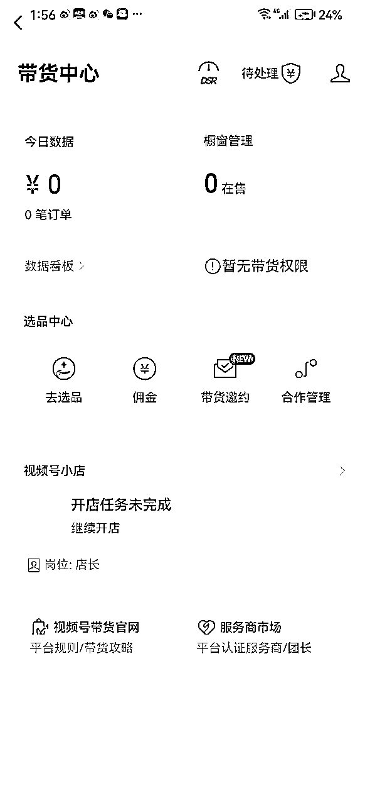

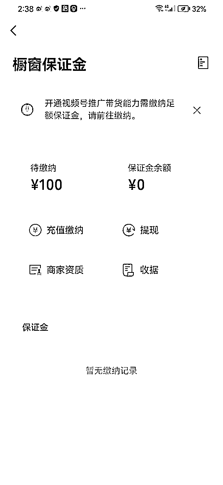

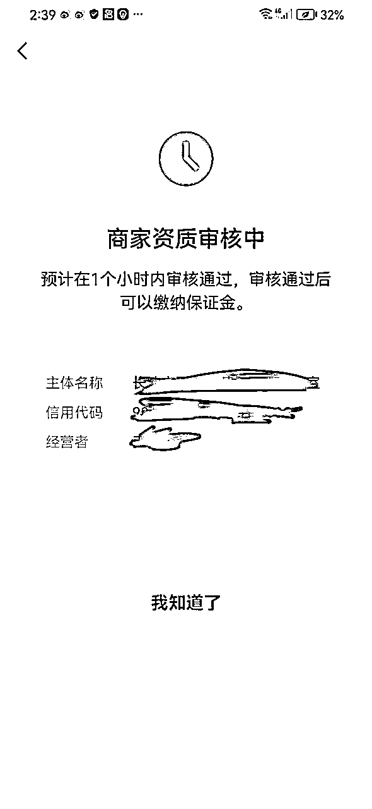

## 带货权限开通

在1120之前，咱们直播带货权限是默认开通的，但是目前规则已经变化了，需要满足以下两个条件任意一个即可：

1.  有效关注人数达到1000人（千粉要求）

1.  开通视频号小店

我自己目前走的是视频号小店这条路，个人认为千粉的话效率太低了，如果你要直接买粉的话，不仅成本高，账号也

会有一定风险，所以最终还是选择开视频小店。其实没有大多数人想的那么复杂，开通视频号小店唯一需要的就是个

体户的营业执照，可以直接在淘宝上找代办帮你办理（一般成本在50元以内，且办理周期为3天左右即可），以下为

开通视频号小店的具体步骤：

第一步

提交个人身份证、营业执照信息

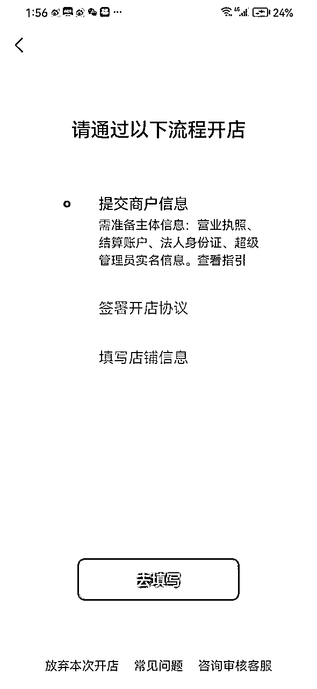

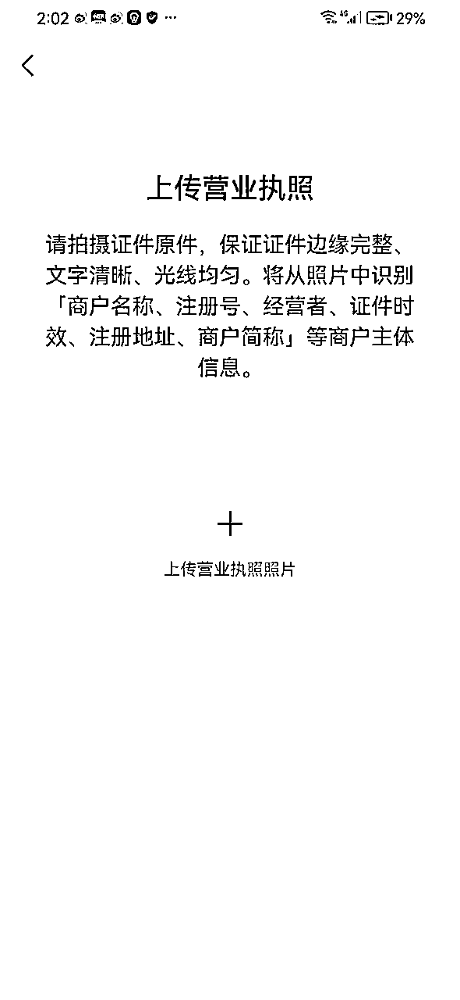

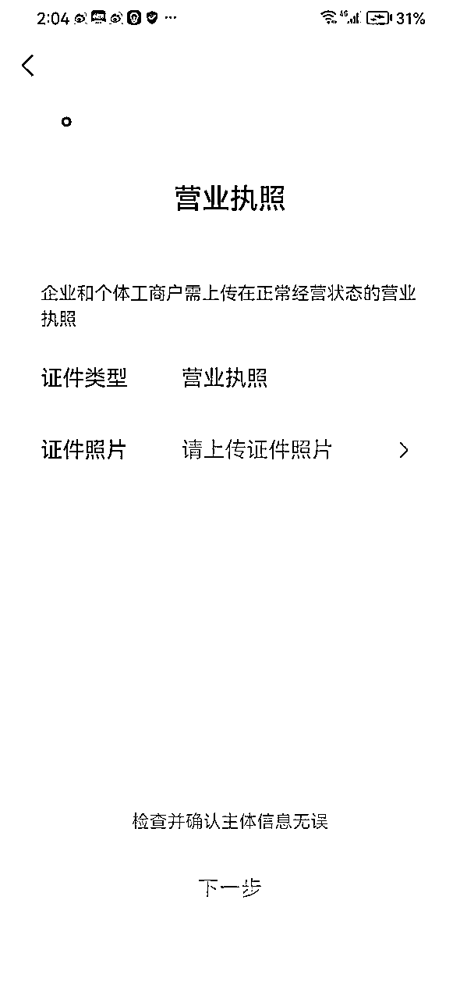

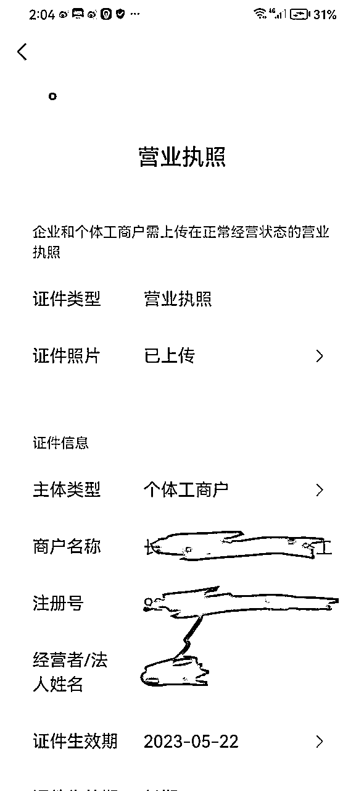

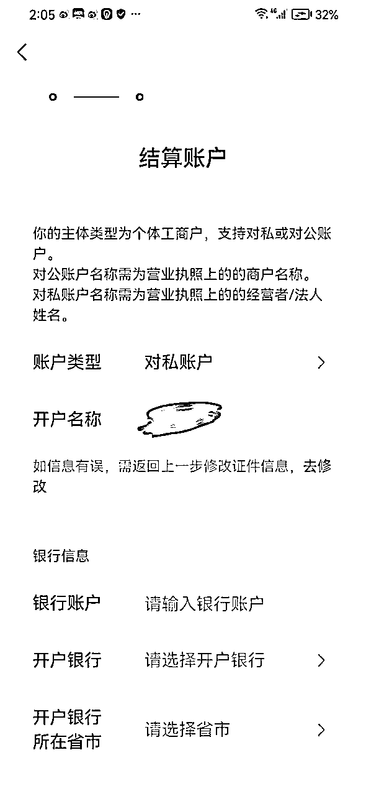

类型选择个体工商户、账号类型选择对私账号就可以

提交审核之后，会通知你等待7-15天，实际不需要那么久，正常工作日情况下，20-30分钟就会出审核结果

第二步

签订开店协议

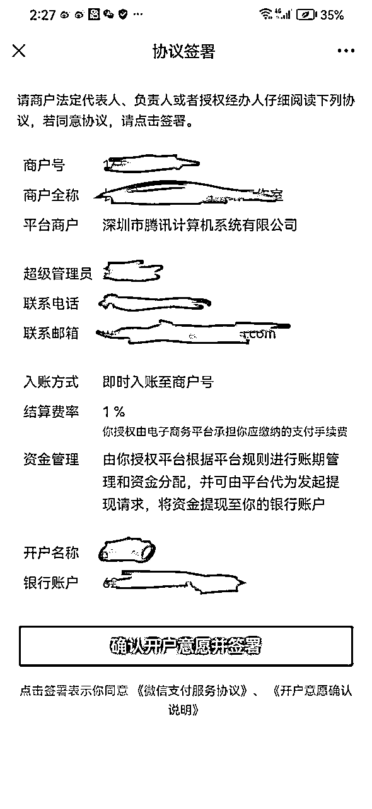

第三步

填写店铺信息

这步需要你自己完成店铺的头像、商户名称的填写，建议和咱们视频号的头像、名称保持一致就可以

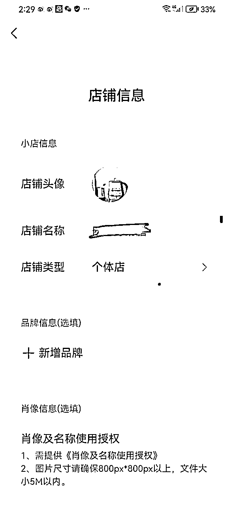

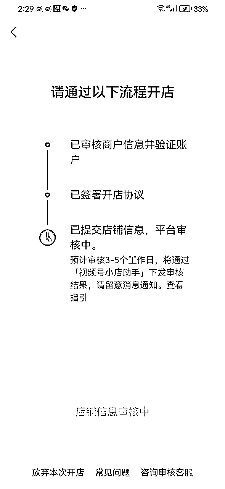

另外需要注意的点是：

1.  品牌信息和肖像信息不用管，直接忽略即可

1.  提交店铺信息后，提示3-5个工作日审核完成，实际也不需要那么久，正常工作日下20分钟也基本能出结果

到这里，咱们基本就开好了一个小店，拥有了可以直播带货的权限的

## 短视频素材制作

1.  找到对标账号

赚钱就是复制，谁赚钱就复制谁

在我们确定好品类和目标人群后，第一步要做的事情，就是找到自己的对标同行，先看看别人是怎么跑的，然后我们

学着别人的样子，才能慢慢走出第一步

找对标的方式也很简单，就是刷。在视频号搜索产品相关的关键词，然后给相似的视频点赞、收藏，不出意外的话，

当你重复了几次这样的行为后，系统就会判别到你非常喜欢这类内容，就把源源不断的把相同的内容分享给你，这个

时候就是我们找对标的时候，找对标就要看几件事情

第一，别人赚了多少钱（直接看别人账号的橱窗销量和产品，结合行业的佣金率，你大概就能算出别人赚了多少钱）

第二，别人是否可被复制和模仿

主要就是看，这个人的视频画面我们能否复制、视频音频我们能否复制、直播方式我们是否能复制

如果你看到一个人赚到了钱，并且初步分析可被复制，那么可以确认他为你的对标账号，确定对标之后，接下来要做

的事情就是拆解对标账号

1.  拆解对标账号

基础信息拆解：包含对标账号的头像、简介、橱窗引导方式、每天发布的视频数、是否有置顶视频、置顶评论是什么，这部分我们直接和他成相似就可以

带货视频拆解：视频是实拍还是混剪、基础视频是由哪些画面组成的、共有几个画面、每个画面的持续时间是多长、

视频的配音是什么、视频上的文字是什么，易违规文字有没有做特殊处理，视频开头是什么、视频结尾是怎样的

直播带货拆解： 看对标的直播间背景是什么、是否有真人出镜、直播准备了哪些直播物料（有没有逼单铃、灯牌等）、直播间的话术是怎样的

几个心得：

1.  目前视频号生态里面，直接搬运的方式基本是直接死，混剪的话，大概率会被判非原创，所以，还是建议大家老老实实做实拍，不仅可以规避风险，视频播放量的天花板也能被拉高

1.  品和素材在一个平台上都是有生命周期的，当我们发现一个爆款素材越来越难爆或者品越来越难卖的时候，这个

时候不要纠结于是自己视频质量太差，果断换品换素材即可

1.  细节细节细节！细节很重要，有时候就是因为一些细节没有做到位，导致我们失去了很多获得利润的机会。常见

的不注意细节的表现包含：制作视频时不检查文字，文字中存在违规词；不愿意花小成本做置顶评论引导等等

1.  不要做创新！在自己没学会走路之前不要想着跑步，找到对标之后，就按照对标的方式来就可以，不要自己加入

新元素和新画面，否则很可能会得不偿失

## 直播带货相关

1.  开播标准，一般来说，我们需要观察视频发布之后的流速，如果一条视频的播放量跑到了10000以上，就可以直

接开始直播了，或者如果流速很快很快，在发布后很短的时间内就上了几千播放，也可以尝试开播。如果你是混

剪类的视频的话，视频的播放量很难跑的非常高，一般10w➕播放就到头了，但是如果走实拍路线的话，播放量

的天花板就会比较高，播放量高，通过短视频引流到直播的人也就越多，单场直播收益的天花板也被随之拉高

1.  一定要自己提前去练习话术，不要匆忙上阵，特别是我们打滋补品的，一定要在平时就练习好自己的话术，知道

什么可以讲，什么东西不能讲，时刻要注意，别等到流量来了，结果直播违规就很不划算了

一般滋补类的产品，常见的话术违规点如下：

第一，涉及到医疗相关的宣传，比如主播直接说该产品具备xx效果，可以治xxx病或者是xxx问题等

第二，涉及到虚假宣传，比如主播说这个品吃几天之后，就会马上起到xxx效果

第三，在主播话术中提到一些违规的关键词，比如生病、吃药、咳嗽等等

但是我们打滋补品的话，如果你不讲功效，整体的转化又会比较低，那么我们该如何应对呢？主要有两个方法：

第一是转化说法，比如不直接讲失眠，而把它更换为：晚上翻来覆去的睡不着

第二是使用叠词，比如生病，可以说生生病病，咳嗽可以说成是咳咳嗽嗽等

1.  用户进来之后，先讲卖点，但滋补品不要直接讲功效，你可以说你的产品非常的天然健康，也可以说你的服务很

好，比如支持7天无理由退货，但是不能直接讲吃了你的东西后会怎么怎么样，功效类的话术一定要尽量避免，如

果一定要说功效，也一定说的非常委婉

举例来说，当你介绍产品的时候，不要直接说有什么用，而可以换成：这个是非常非常好处的哈，懂的自然都懂，

尽量委婉一点，宁肯转化率稍低一点，也不要去冒风险，因为可能会被封直播，验证直接封号，不划算

1.  学会逼单和促单，当我们讲完之后，会有部分用户产生兴趣，但是还处于犹豫点要不要下单，这个时候可以进行

逼单，逼单一般结合两个点：库存不足+服务好，强调自己没有库存了，马上就要下播了，这次的活动价后面不会

再有了，同时，强调你的售后服务很好，支持7天无理由，支持免费试喝等等

常见的逼单话术举例：

各位哥哥姐姐们，线下价格是79块9，今天我们线上直接给大家39块9啊，而且买五盒送五盒，直接去拍买五盒送五

盒，到手十盒，十盒的价格都不到200啊，最后一单，最后一单，你们手速真的太快了，没有拍到的啊，我跟大家讲

啊，你没有拍到，你今天没有抢到，这个名额就没了啊，就没了你抓紧时间，50岁以上的不用犹豫，50岁以上的直

接去买5盒，最后一单了啊，5盒送5盒，到手是10盒，最后一单，去用热水去泡它喝，每天两包左右，两包到3包，

最后一单，最后一单啊，咱们直播间里面人太多了，人太多了，我都这边的货都准备过来了，你们现在没有买到的别

着急，你先点一下链接看能不能抢到，你要是抢不到的话，你要听好了，你要是抢不到的话，这样吧运营再从我们那

个呃青年大街那个店再调几单，我看看直播间里面多少人啊，1,000个人，这样掉10单吧，掉掉不了，只能调5单是

吧，那这样调5单过来，抓紧时间啊，抓紧时间，因为我们线下线上价格他不一样啊，我们线下他是79块9，我们今

天线上39块9，抓紧时间，抓紧时间，库存拍完了，这样啊，我把刚才从我们线下门店那个调调，那个几单掉那5单

给大家上，这回你要是抢到，那就是买到了，要是买不到我也没有办法啊，54321上链接，下方链接给你们弹好了，

直接去买，直接去买……

1.  直播引导微信下单。由于年龄的原因，有的人群对你的产品很感兴趣，也看了你的直播间，但是他不会在视频号

购物，这个时候我们也不要错过，可以引导他们去微信进行成交。我自己之前在做的过程中，发现其实引导到微信成交的概率是非常大的，因为本身这些就是精准用户

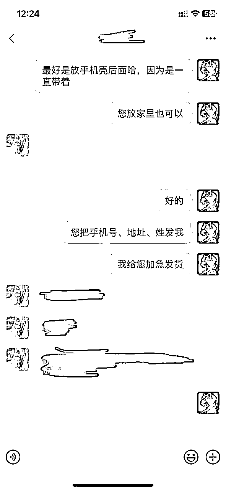

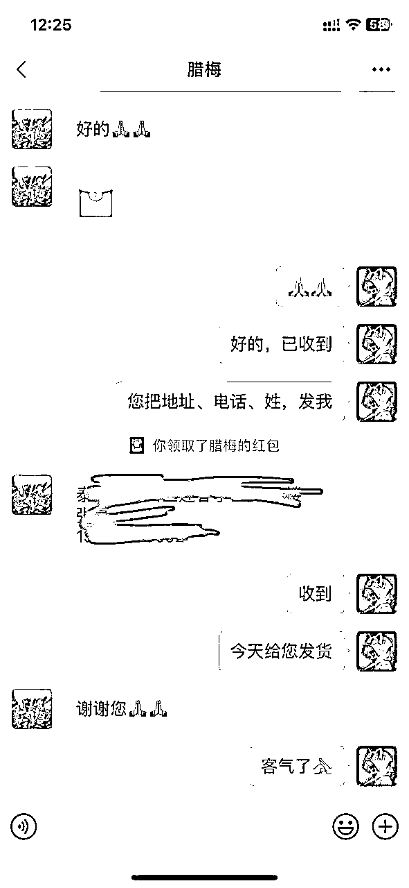

# 心得与体会

1.  目前在视频号上，自己只能说是跑通了0-1，但是后续这个项目如何放大还是需要思考，目前能想到的还是多账号

矩阵进行，因为本身视频爆的概率还是有限的，在保证自己有足够的内容输出能力的情况下，可以去进行多号矩阵发

布，提高自己整体视频爆单的概率

1.  选择大于努力，认知高度决定执行效率。之前自己在做小红书的时候，因为无货源被打压，于是选择做了有货源

的水果赛道，结果发现整个过程非常的累非常的磨人，因为自己不仅要做前端的引流，还要负责后端的交付，流量不

好拿，利润也不高，并且售后问题还一大堆，非常心累。而在视频号这个项目上，我明显感觉到太多不同了，做带

货，不用管后端的交付，你只需要研究流量怎么拿就可以，简直不要太轻松。同时，滋补品本身的佣金比较高（当然

视频号上各个品类的佣金有区别），所以收益也要比自己做小红书可观

1.  坚持坚持再坚持！做视频号的时候，自己也是一步步受挫，有一段时间视频发了一直不爆，看到同行爆单，

自己心里也很痒痒，但是暗暗告诉自己不能放弃，于是只能闷着头继续拍、继续发，不爆就继续拍、继续发，继续优

化自己的视频和直播，每天练习话术，直到最后曙光降临

最后，非常感谢@李百万 李哥在做项目途中给出的宝贵意见和方向，把我带到一个新的方向上，也非常感谢生财里面

大家分享的各种关于项目、关于个人成长的信息，阅读这些对我都是受益匪浅，真的非常感谢！！！

最后的最后，祝大家都能够生财有术～