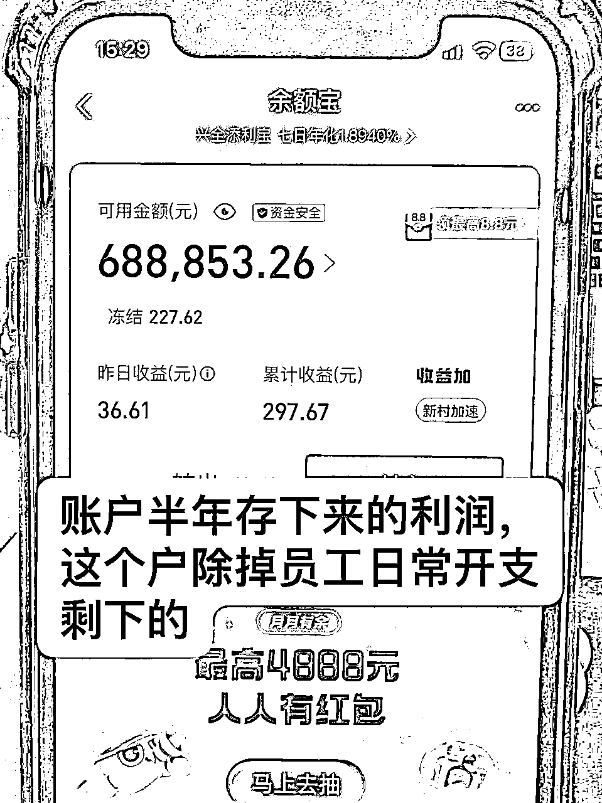
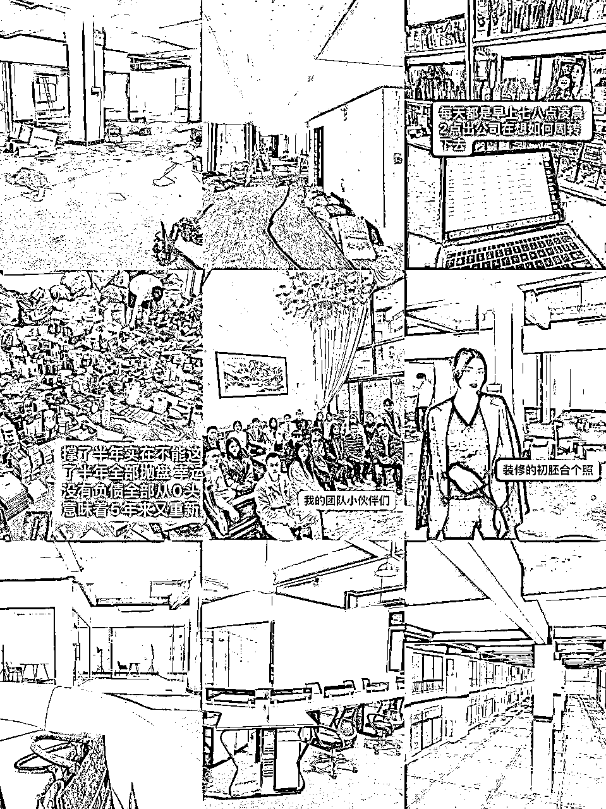
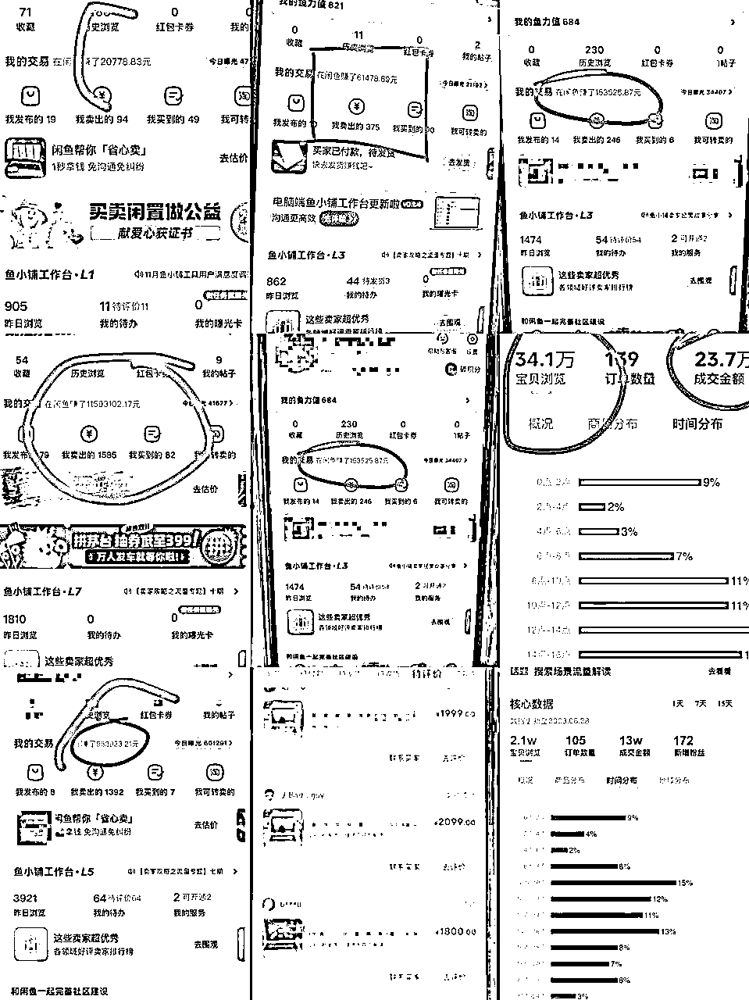
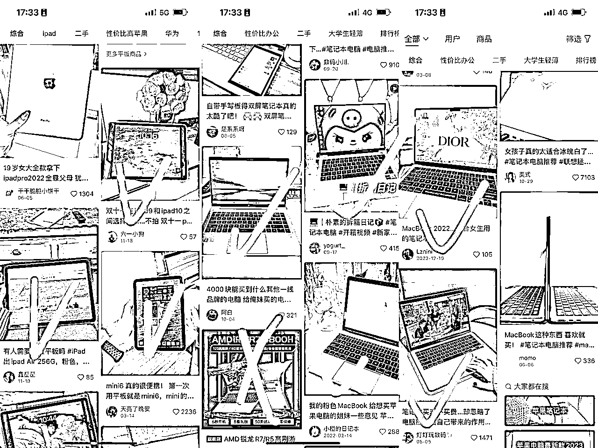
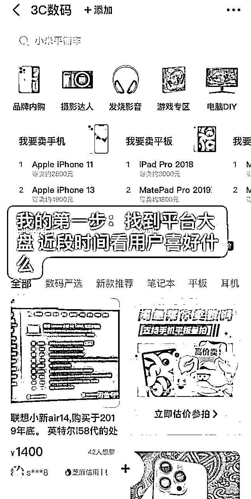
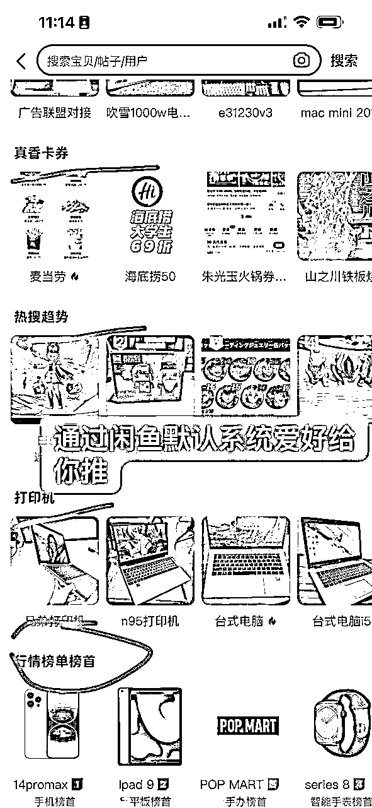
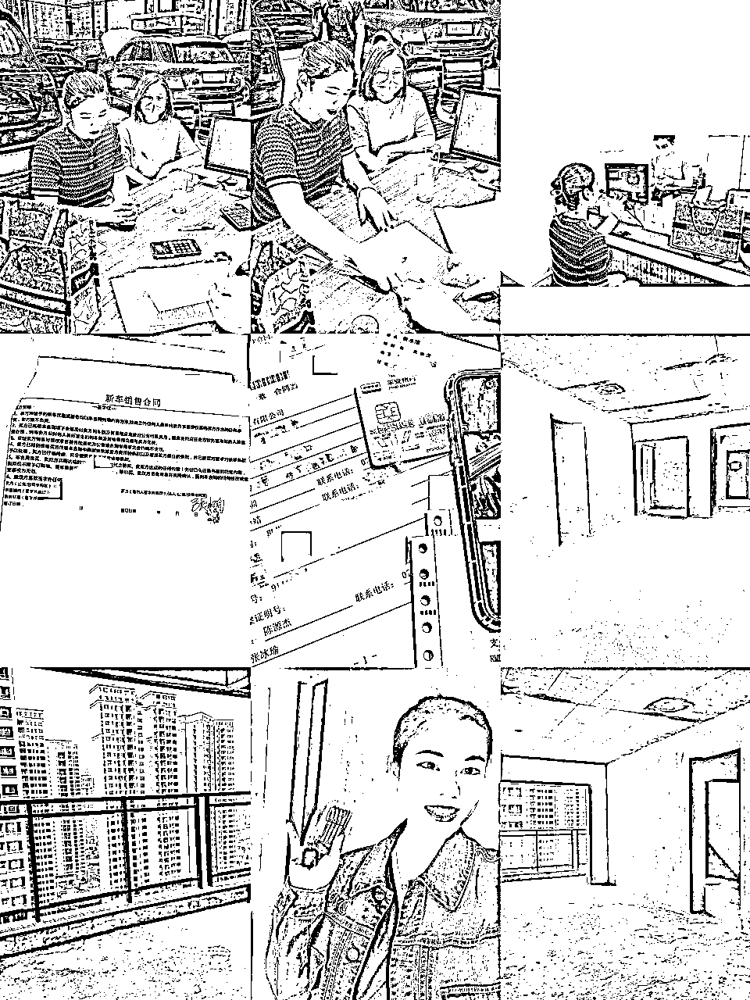

# 闲鱼数码赛道半年210万销售额做号技巧分享

> 来源：[https://fziji6736b.feishu.cn/docx/L2S5dD3troMiI9x47NMcltMknYc](https://fziji6736b.feishu.cn/docx/L2S5dD3troMiI9x47NMcltMknYc)

嗨，我是瑜大，01年创业女孩目前踏入互联网也快6年多了。初一开始接触微商小商品，18年17岁运营微商品牌起过一千人左右微商团队自己也创立了微商品牌自己做护肤品牌出货，2020年疫情放弃985学历大学辍学出来创立直播公司21年-22年在广州运营了一家5000平方直播基地，由于疫情包括运营方式不当五年累计全部重新开始今年3月份踏入电商赛道四个月深耕重新爬起来总额利润在70万左右。

# 电商小白半年从0起步取得的结果

利润率选品大概就是30%品类

# 为什么会转型做电商

21-23年3月份我一直都在支撑着广州直播公司，没有多少盈利，每天房租人工消耗撑了那么久回想也是傻子，不能果断放弃抛盘及时止损最后亏掉清盘的时侯身上剩下现金3000多块钱下个月自己住房的房租水电都不知道哪里来钱

（也总结过原因：由于微商踩住了风口得到获利，过往的成绩导致我盲目的自信，没有专业的直播运营经验做自己陌生的领域却抛全盘投入拼了命的把赚的钱砸进去 没有归于现实一味的自我意淫最后大梦一场空）

3月份从0开始，直播公司五年的努力一场空，爱情长跑也在这个月同时结束了。我有持续一个星期失眠奔溃22岁，父母劝我低头回去重修学业我的内心一万个拒绝我的好胜心不允许我以失败者身份回家被身边人看笑话。

为什么选择闲鱼因为我是从大风口被筛选下来的失败者，能存活的大佬们都是卷王我真的卷不过大伙们。我深耕过的平台1:快手直播2：视频号3:抖音憋单起号4:红书电商 把国内市面上该做的平台我都做过了 也取得了小成绩但这些平台都会有同一个问题：平台变化太大了一天规则风向一个变，追了两年多追得我心力憔悴。

我没有最新方法都是自己每天刷平台摸索，也没有一群人探讨技术，又不是一个专业运营 当然这一定也是我的问题 ，是我自己不够！但在这个市场上竞争者比我更差的还有一大把！也有很多转型直播最后亏钱失败的。

我最起码还有执行力 风向嗅觉 起初兜里还有200万现金流 5年管理经验 失败就是失败我重新静下心来思考着力哪一个平台今年3月份红书电商火了（闲鱼，拼多多，红书电商我都同时测试过了后面在闲鱼我得到了正向回馈）

# 电商的看法心态：

项目那么多眼花缭乱我发现这个平台一直被大家忽视，大家冲最新的产业包括平台流量也是给足给新板块。虽然我个人也非常心动也动摇过。但我按捺住了我的好奇心想暴富发财心！怎么选择一个合适你的赛道呢，选择你能够得找钱的赛道，不是大家赚钱的赛道！反过来说：赚钱的赛道不一定合适你，你能赚到钱的赛道才合适你

追寻细水长流的稳定

几年的直播波荡下来让我心力憔悴，莫一天有大收入可能明天号就被平台封了，身份证实名没有了，直接隐形限流你你很努力 号没了 你想努力都没有展现机会了 重复的封号循环无形的打压你的信心 睡不好身体也不好。经历这么多我想要稳定想要细水长流

电商闲鱼是一个细水长流平台，没办法一夜暴富但我发现这个平台规律很稳定就算封号，大部分都是简单罚一下下架帖子而已不会出现隐形限流让你摸不到方向。只要每天坚持深耕它会有结果（结果差距大小：就是着重在货盘利润大小而已，所以选品注意一些）

# 关于闲鱼选品热门梯度分享

每一个款都有测试过越排上面热门包括流量想要度都是比较高

第一类电子数码产品：

U盘，智能手机，数码照相机，摄像机，扫描仪，手机，平板，笔记本电脑，办公设备PC，打印机，cdd相机，显示器这一类型是比较适合上班族以及学生党，所以电子数码产品一直都是热销产品。而且好的品利润高目前我自身也在全身心深耕数码赛道，利润是会比较香

日常我自己选的品笔记本电脑，我的12人公司每天现在保底产20台笔记本电脑，利润20*大约600左右一台一天公司产出利润就是12000块钱收益 客单价1800-2500以内 回款周期大约3天左右 对于小型团队包括小白都蛮有好，可以推荐跑包括流量非常大之前闲鱼有过百万推荐！现在整体平台调整了一个星期新号帖子怎么样都可以爆一条几万几十万曝光的帖子！

第二类汽车用品

拖车绳、胎压表、后备轮胎、千斤顶、车载灭火器、随车工具包、三角警示牌、照明灯、急救箱、行车记录

仪，这类型就是属于有车一族的热门产品，基本上客单价比较小，适合新手小白去操作。不过也要做好心理准备就是利润比较低，比较杂碎对女生不太懂的也不太友好

第三类宝宝母婴用品

娃娃餐具、娃娃的摇篮、娃娃毛毯子、婴儿车、玩具电话、母婴清洁用品、抓握的玩具，这类属于母婴类的热门爆款，利润在百分30以上合适宝妈上手更快

第四类办公室家具用品

办公桌、办公椅、沙发躺椅、电竞椅、电竞沙发、移动抽柜、小茶几，这一类型是非常适合上班族的产品。

第五类当下应季用品

现在已经开始进入冬天，天气会比较变冷也会干燥。床垫、电热毯、加湿器、毛毛鞋等都是应季的爆款。

通过这几类的分析，大家可以结合起来这些产品去上架，通过当下应季的选品出来以后去上架。只要你用心做链接，闲鱼不能保障你马上大富大贵但生计保证肯定没有问题

第六类卧室家具用品（主打租房好物）

落地灯，靠垫，空气净化器，加湿器，扫地机器人，桌椅板凳，便携式置物架，实木鞋架，实木床，实木沙

发，因为现在大城市租房搬家的人特别多，所以家居用

品也是热销产品。

# 卖出千单以上累计的闲鱼流量关键经验

在闲鱼上能卖出的前提一定是物品有市场+价格有优势一些+一点运营技巧+执行力+和一颗永远杀我不死的心态

简单又有效的方法挑几个分享给圈友们

(1）【多次降价】能快速提升店铺的曝光度。

有时候东西卖不出去，不一定是产品本身不好，也可能是曝光少，别人没有刷到，多次降价能快速增加曝光量。所以，我们在发布商品的时候一开始上架的价格不要写内心的底价，标高一点，然后慢慢降价。

举例子：

比如一个产品你要卖 2100元，就可以一开始标2500元，然后一次降价几十块钱块，这个过程中曝光量会慢慢增加，卖出去的概率会大很多。

（2） 实拍图代替好看的电商平台图

闲鱼平台是二手交易平台，那种电商平台图反而会降低用户的可信度，请一定要用实物拍摄图片，并且需要清晰。特别要重视封面图，背景干净，图片清晰。图片数量宁多勿少，细节给到位，规避后续扯皮风险。滤镜可以用，但衣服慎用，有色差。（以下举例案例就可以非常清楚可观了）

图片的关键决定了你的闲鱼推流点击率怎么样，就跟小伙伴们做快手一样封面非常重要。

分享一个热门图片找寻app：小红书

直接搜索关键词找到比较好看的图片即可（当然找图需要自己锻炼自己的网感）前期没有网感的小伙伴们可以多种风格探测。特别是想做高客单价小伙伴们一定要选好图再加上平台自身也对数码推流就是锦上添花！若非价格有绝对优势这个就是甩开你的同行取得更多流量的关键！

(3） 怎么写文案更容易卖出

（提炼关键词，简洁明了不啰嗦）这个对前期新号起号推流非常友好关键！

有其他电商平台链接的，直接复制，然后把个别关键词调换顺序，人家卖家提炼的关键词绝对比你自己写的更准确更有吸引力。其次可以按这个思路来写【品牌/商品分类/尺码/颜色/新1旧/出售原因/是否包邮】

# 如何提高成交及快速增加客户信任度关键

1.精心设计店铺你的主页非常关键

店铺是你卖货的基础，先打好基础才能更好的销售。尽量完善账号信息要求，真实的账号信息能够让买家更加信任你。而且店铺尽量打造的专业，比如你是卖数码的，那么从账号名到头像这些，都要贴合自己的卖点去填写。

其中注意：（头像是模糊，风景，动漫的一般成交率都不高 客户信任度很难极速打成）

头像建议：女生使用高清网感女生图片还有学姐身份，男生帅气一点的头像包括一些学长身份利于成交。或者你直接打造成批发工厂身份。这几个身份都是在闲鱼有利于你的成交

背景：可以使用工厂图片高级一点图片包括日常高级一点图片与你头像风格包括颜色相搭的即可（切记不要过度炫富直接漏一大堆现金这种背景极易封号）

1.  优化商品文案

精准的商品标题和详细的商品描述能够提高搜索曝光率，吸引更多的潜在买家。当然也不能过渡宣传，需要以真实、诚信的描述自己的产品。文案分享给大家一个技巧，记住同行就是你的最好的老师！直接筛选同行热门文案复制粘贴包括稍微关键词修改就可以啦

（此点有疑问的小伙伴们可以找我发个如何寻找热门文案风向案例视频 里面都会有细致讲清楚，这个软件没办法上传视频）

3 积极真实一点与买家互动

客户的咨询及时回复，有时候也不能那么死板，客户问什么回答什么，深入了解客户需求，特别是高客单的产品。对于还有拼多多淘宝平台客户为什么选择买你，拉近信任交朋友方式非常重要。切记不能太过于死板，死板也是很多小伙伴们卖不了高价的原因主打一个情绪价值！前期的20-230阶段聊天可以打字后面可以搭配一点语音。但一定要切记语音条不可以发太长 谁都不愿意听。跟小酌怡情一样道理！

用语音回复可以增加成交率30%

如果你是工作室/公司的小伙伴们（建议多请女客服，女客服的成交率是男生的80%）

关于选品方式和选品技巧都在之前的帖子里面给小伙伴们分享过可以翻一下

# 电商真的拼7分选品分享经验

因为做品的方向太多了，条条大路通罗马只是分利润大少，考虑这个品平台市场有多大？及你的投入精力产出比。

这里给小伙伴们分享一条选品思路及逻辑：

### 无货源选品思维逻

### 1.看同行卖啥不错，咱就卖啥（永远记住同行就是最好的老师）

这个方法是新手刚开始做相对容易出爆款的方法，自己不知道卖啥，看同行，拆解同

行，人家卖的不错的，咱们也拿来卖一卖，没大毛病吧？

为什么选择同行，这个逻辑思维底层是同行能够火的包括不违规一定是她测试过的站在巨人的肩膀上去努力，会减轻很多新手小白试错时间。

第一步：先找任意一个关键词，比如你身边能接触到的桌子，椅子，水箱，手机，平板电脑，iPad，电脑，耳机...都行，实在不知道的去某多分类里面找一个词也可以

第二步：去闲鱼搜素这个关键词，搜索之后找【我想要】数量比较多的点进去。按照这个思路找很容易选择得到平台爆品包括这个市场哪一个品更有平台市场

第三步：点头像，查看主页动态，看她最近卖的什么，然后看同行哪一个好卖最近，你就可以去拼多多搜同款，这样一个选品就出来了。

第四步：继续看一下她之前是什么东西好卖，卖过什么商品也是增加一个新的选品思路

第五步：进一步拓展，看他关注的人最近卖啥，这样你可以源源不断的有选品，当你看到别人卖的有别的东西的时候，又可以拿那个关键词去闲鱼搜索，回到第一步，重复做一个逻辑就可以啦。

•2.参考闲鱼热卖趋势

对闲鱼选品还是没思路的，参考这个趋势

可以带来不少灵感，并且是官方的数据，还是有比较大的参考价值的。

点开卖闲置进去，看【近期热卖趋势】，热卖趋势还可以左右滑动看更多，但是热卖趋势的数据比较少。在热卖趋势下面还有个【看看家里什么可以卖】，这里面的东西就很多了，能给你足够的灵感!选品源源不断朝你走来

### 有货源选品思维逻辑

目前我自身也在做有货源这个赛道

我能感受到的优势好处：1:会比较稳定，不担心链接爆了怕发货那边供货不上都是合作过一段时间了

2:利润深耕下去会比较显易化，举例笔记本电脑来说代发无货源利润大约在200块钱左右不到我们跟厂家合作一直深耕包括出货稳定我们的利润一台大约500-1000块钱！这也是一个深耕的好处

3:垂直做一个赛道平台推流更大更精准可以吃平台流量红利

4:账号没有那么容易限流有跑一百多万曝光也有案例

5:无货源的选择太多有货源好卖的品就这些 容易静下心来思考不会东想西想

对于没有货源小伙伴迷茫的给小伙伴们建议你可以从无货源测试一个爆品出来，再去细谈厂家做进一步合作 这是一个漫长过程 切莫着急

### 无货源与有货源都要估算核心投产比

公式：产品想要度+成交难度+流量曝光+每天投入时间+退货率+利润率+封号率

利润率很重要：

举例：很多小伙伴做这个赛道客单价几十块钱不到想要度很高每天扎堆在那里回复着，闲鱼对于一个号是有高度的 一天大概出个10单利润5块钱一单5*10=50块钱，一个人精力做3个号一天150收入还是算很OK数据的时侯，一个月4500块钱收入 全职在家做看似非常努力结果一算数不尽人意。目前现在电子厂上班稍微努力一点一个月都5-6k收入 举例：你选择了一条利润200赛道，一天5单一个号:5*200=1000，精力做3个号 1000*30*3一个月就是30000块钱收益，这个收益就非常明显化了甩掉大部分工薪阶层

选品决定你能飞多高度，执行力决定你的横度有多宽

退货率也要考虑：

举例：以目前投影仪市场来说，因为我本人也是靠投影仪赚到了闲鱼第一波启动小资金5万块钱。但目前的退货率太高了300台严重的退50退货率意味着只有150台收益。如果你可以接受跟女装一样玩法逻辑当然也没有问题。选择货盘不仅要看利润，还要看货盘退货率及售后麻烦程度

## 需要具备的软实力是哪些

1:电商需要基础小现金流（2k-5k打底）

这是每一个小伙伴做电商应该知道的算好目前你的项目需要多少启动现金可以滚的过来非常重要，要算好目前手上资金包括起来了如何开公司复制请人扩大。这个在我往期的帖子都有分享

分享一个很强心态：

【凡事杀我不死的，必将使我更加强大】的心态一直咬牙坚持

【不要给自己那么多退路】互联网创业对于实体店铺特别今年大环境相对于简单了很多

【放弃玻璃心你才真正成长】很多人吃不了微弱的苦，随便互联网遇到封个号从头来过就开始放弃披靡不正。破山中贼易，破心贼难 万事都是看自己以什么角度去想它。如果互联网创业的苦吃不了，工地那些烈热的砖 流水线无尽的夜 读书三更灯火五更鸡的日子 被竞争者背景筛选下去的闭门苦 每一个行业都有每一个行业的苦 形式不同而已但终将相信一定会拨开云雾见青天！

无数的夜我都想在当初我放弃了如今我是什么样的结果。非常感恩当初一直坚持，可以在22岁前收集了🚗和🏠两件套。平常很少在这里分享东西埋头苦干也希望认识更多电商直播互联网大佬们一起交流，抱团发展包括一起前进 一起交流一定畅所欲言

