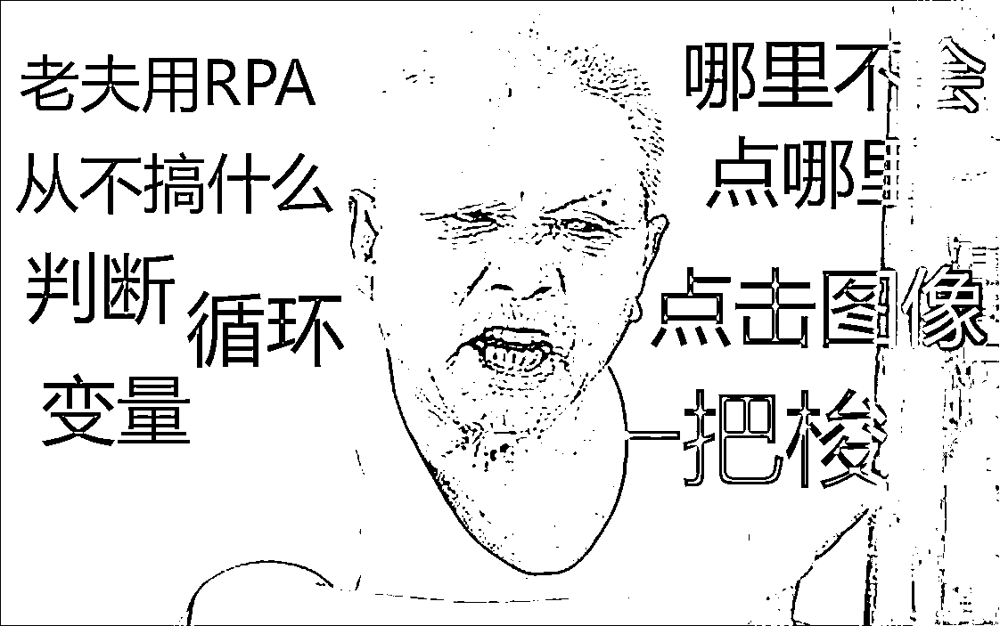
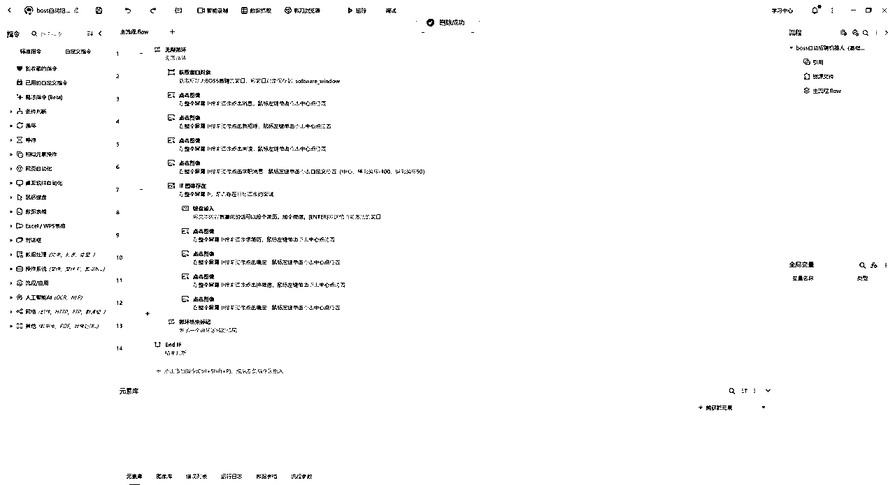
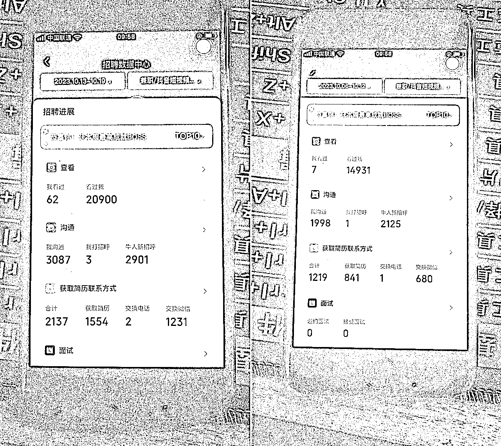
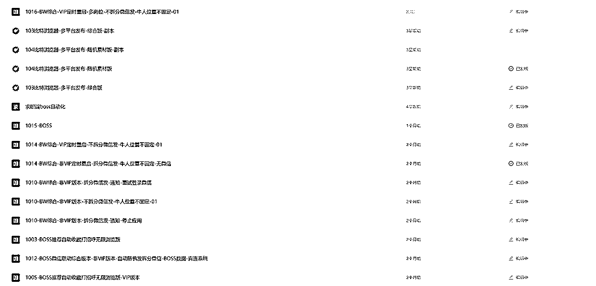
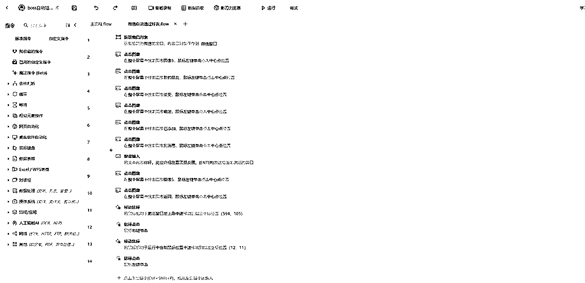
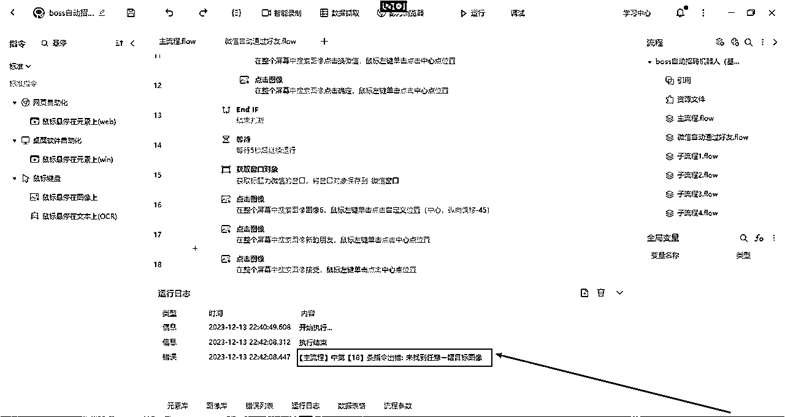
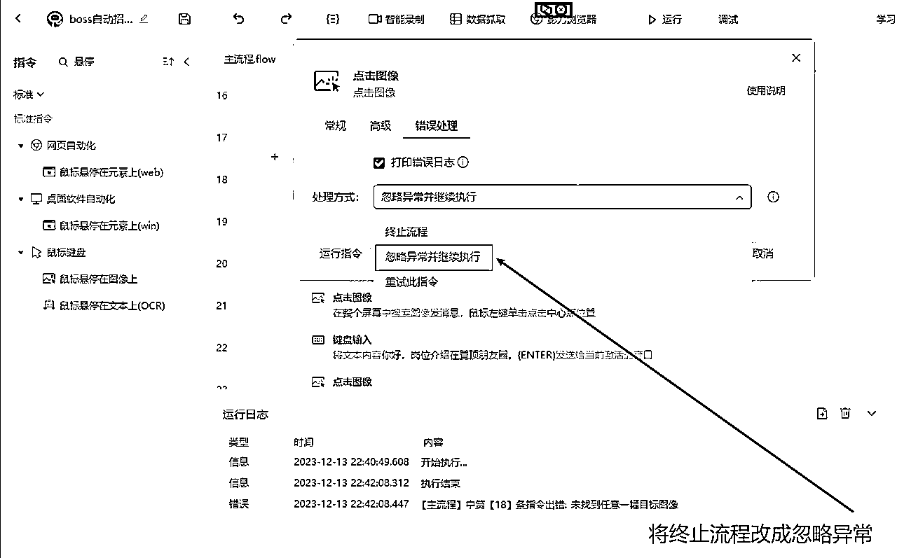

# RPA+明星切片+BOSS直聘自动化招聘全流程解析

> 来源：[https://vgcf8zrqd4.feishu.cn/docx/M9lHd769toHVnLxWlC5c5n4dnPq](https://vgcf8zrqd4.feishu.cn/docx/M9lHd769toHVnLxWlC5c5n4dnPq)

## 前言：为什么要多犯错多讲细节？

讲一个例子，

马斯克关于面试和招聘选人的经验，

反思之前自己写的一些内容，

确实是比较空洞，没有什么细节。

今天就把实操了的明星切片和BOSS直聘自动化招聘的全流程记录一下。

为了更好的效果，我不会去拿正在用的成品BOSS直聘机器人去讲。

而是纯粹基于自己的手动流程，不做任何的规划。

去一步步试错，并做出能运行且更适合新手的RPA机器人。

## 一：BOSS直聘注册SOP

办执照，租场地，开对公，

BOSS的成本还是很高的，

而这次跑切片，预期也拉的很低，

挂账号在开始之前就预见到了，

朋友人工跑BOSS差不多有5年了，

我作为户头，

基本上，可能遇到的各种乱七八糟的问题早已亲身经历过，

封号可以说是家常便饭了。

本身就不是在正经招聘。

会员，会员不开，

每个月就花个30,50块钱

不停搞平台的人，

本身有公司，有办公场地的团队，

从平台这获客成本的边际几乎是0。

它封的也并不过分。

下面是内部BOSS直聘注册相关的SOP，

和注册淘宝抖音店铺什么的，区别并不大。

如果你看完决定动手，

那我给你把所有用到的软件都准备好了，

省得一个个找下载入口，

写SOP和教程就一个标准，

只要这个人电脑开机打字没有问题，

那就能搞。

a.相关软件：https://pan.quark.cn/s/7d7e748accb1

b.电源设置：https://docs.qq.com/doc/DRVFCZ2tSbHp1d0d6

c.远程软件设置：https://docs.qq.com/doc/DRUlsVVlSYVBiVWxB

## 二：BOSS自动回复消息机器人配置教程

整个代码极其极其简单，

用我们当时做微信自动加好友机器人的时候的一句话来说，

这种东西都不好意思收钱的。

这里，我也把代码直接公开给大家了，14条，一行多余的都没有。

这很像幼儿学的积木编程，

拖拽就完成了自动化流程的配置。

很多人看到RPA，可能没有什么概念，会觉得有困难，

跟小朋友去上几次少儿编程的体验课，完全可以一起学会。

BOSS自动化，最开始是我付费买的解决方案。

然后在实操中迭代了无数个版本。

因为这个BOSS直聘自动化早在2021年，我就给我的RPA老师讲了，

而且讲了不止一次，每一次都被否了，

我没有下场去把这个在两年前弄出来，是我自己的问题，

而我家人本身就是海尔外包的人事。

BOSS直聘最早是2018年左右我朋友问我家人，我家人告诉他的。

我也是那个时候第一次听到这么一个招聘软件的。

有句话叫做：

世界上最远的距离不是生与死，

而是我站在你身边，你却不知道XXX。

这一刻，

我深刻的感受到，

想到，知道和做到，

是遥不可及的，

多数时候，

永远都不会有交集。

不过，客观来说，BOSS测试的成本和环境，

确实是个问题，

对于一个自由职业者或者上班族来说，

基本上一上来几K就没了，100%送人头。

2年前另外一个痛点就是，人招来了，没有项目，不知道招来干什么。

明星切片这个被唾弃的项目，确实是解决了人招来了干什么的问题。

## 三：BOSS自动化周周拿第一

## 四：当头一棒：微信挂+BOSS封

第1天BOSS人脸验证，

第2天地址验证，

第3天对公打款，

折腾一番之后终于大量进人了，

微信进人的喜悦没享受2天，

微信就频繁了，

然后很快就被封了，

上来就是永封，

因为接微的是一个不常用的微信，几乎没有生活轨迹，又是新登录新设备，

然后又换老微信，

老微信也没熬过多久，

BOSS又出警告，被封了，

因为加进来的人都是自动回复的，

发了广告之后，基本上就不理他们了，

导致求职者的体验非常差。

为什么不理？

因为人太多了，号也太多了，

机器人调试优化，还有一些其他的工作要做，

进线的都是宝妈，学生，重复性问题太多太多了，

其实要回答的问题，我已经做成了非常详细的SOP了，

回答他们也是复制SOP里面的内容，

对着文档一个个问题找答案，复制粘贴过去。

电脑端微信在自动加好友，自动回复，

手机端去回复成几百上千个人，多个手机轮流着来，

低着头搞这个，颈椎搞不了几个小时就挂了。

不过，这只是表面原因，

更深层次还是缺乏一个将这些流量立刻马上快速出金的项目。

单纯的涨粉我觉得是不够的，

还是需要去和其他的业务搭配着。

个人微信总是频繁，为什么没用企业微信加？

因为企业微信的粉丝价值不如个人微信，

你微信上有个企业微信好友总是发些与你需求不相关的广告，

你会像有强迫症一样要删了他，

但是如果是一个个人微信，

删的概率会小的多，

因为你可能会需要他提供的服务，

也可能就想看看别人是怎么赚钱的，

也许自己也有可能这样赚钱。

他是个人微信，是具体的某个人，还有可能去找你买东西，买服务。

## 五：做减法，优化流程

人太多了，微信根本抗不住，老号很快就加满了，

只能做减法，不要那么多人，

同时手机端也设置快捷回复语，

将常问的问题答案拆分了整理过来，

而不是发一大段内容或者飞书链接让求职者自己找答案，

另外，去掉了一些人，选择性的加人，而不是来了人就加。

可是整个BOSS自动化招聘流程，

还是会出现很多异常，

为什么RPA号称最安全的自动化工具还是用的不那么顺畅？

RPA虽然是纯粹的模拟人工，不是靠协议或者内存之类的外挂，

但这套自动化招聘的流程和玩法本质上还是挑战了平台既定的规则和生态的。

## 六：迭代BOSS直聘招聘机器人（微信自动通过好友）

没有实操，是不会有流程的，

一旦实操，问题会接踵而至，

而解决这些问题的过程，

最终也推进着BOSS直聘招聘机器人不断的升级。

所有的机器人或者自动化流程也都是如此，

它绝不是写完一个流程就完了的。

BOSS自动微信手动怎么通用处理？

怎么加快BOSS发消息的速度？

怎么管理每天进来的微信好友？

怎么主动打招呼解决流量问题？

怎么建立自己的简历人才数据库？

怎么筛选求职者？

笔记本和台式机怎么通用配置机器人？

如何表格化管理不同职位不同微信的话术？

怎么多岗位多微信？

由于篇幅有限，每个人的需求场景也不一样，这里只能去讲通用的场景。

问题1：有的人明明发了消息，但是当求职者秒回的时候，又给同一个人重复发消息

问题2：BOSS电脑端运行一段时间就出bug，卡住不发消息了

问题3：BOSS风控，看不到求职者微信了，微信交换太频繁，平台留的微信求职者加不上，

问题4：BOSS端弹微信验证，要求绑定的微信BOSS对应的 手机微信要一致

问题5：发的岗位没有流量怎么办？

问题6：BOSS进来的人，微信怎么自动通过好友，自动发话术？

问题1：

B1:有的人明明发了消息，但是当求职者秒回你的消息的时候，又给同一个人重复发消息

A1:增加了1个BOSS聊天记录识别的流程，聊天记录识别到特定关键词就判断为发过消息了，

不再发BOSS话术了。

补充问题a：

Q:这里提到判断，识别聊天记录的内容，那为什么不用开始的判断约面试图像是否存在了呢？

A:因为实际运行中发现，判断图像是否存在并不稳定，经常会出现判断错误的情况。

补充问题b：

Q:你说判断图像不稳定，那你出的教程为什么要用判断图像？

A：因为判断图像是最最适合新手，一看就会，马上就能理解，几分钟跟着做，一定能跑起来的。

如果我用其他复杂的方式，或者直接把我正在跑的机器人流程放出来，大多数人会直接双击右上角的×。

因为我迭代了十来个版本，每个版本十几个子流程，加上备注，几百行。

如果不看备注，自己有的都不认识了，确实是太麻烦了。

马老师说过，第1步是手动，第2步是让流程不要那么蠢，第3步是精简流程，第4步才是自动化。

我这里用判断图像其实是在引导大家去做第1步手动的流程。

问题2：

B2：BOSS电脑端运行一段时间就出bug，不发消息了

A2：增加了自动重启BOSS的流程，隔一段时间就重启一次BOSS

问题3：

B3：BOSS风控，看不到求职者微信，微信交换太频繁，平台留的微信求职者加不上，

A3：看不到微信，在boss话术上去引导求职者主动加我们。

微信频繁的问题：第1个办法是增加延时，不要加那么频繁，第2个办法是直接告诉求职者自己微信频繁了，让他错峰加。第3个是尽量用老号权重高的微信去接。

当然，还有一些跟平台沟通的技巧和方法，不过基本上一公开就要挂了。

跨平台去借鉴玩法和思路，在淘宝抖音小红书用的一些骚操作，同样也是适用的。

问题4：

B4：BOSS手机端弹微信验证，要求绑定的微信和BOSS对应的手机上的微信要一致

A4：这是让人比较头疼的问题，你微信和BOSS的手机因为不可抗力因素不一致，比如原来绑定的微信封了，或者被加频繁了。

你现在换BOSS登录，如果人脸不在会很麻烦，还可能出地址验证，如果是个安卓手机，你换设备登录了，那又消耗1个能登录boss的手机。

还有个王炸就是如果原来微信设备死过boss。那就只能微信换绑过来了。

不对，换绑前务必要确认微信没被boss绑过，如果绑过，一定改微信号。

比较绕口可以看下前面的BOSS注册SOP

你现在把微信换到BOSS设备上来，微信换设备登录同样影响权重，而且原来这个设备的微信记录就不干净。

如果发生了根据具体的情况来处理，如果人脸方便，地址验证方便，微信设备也没有登录过boss那就换到微信设备去。

问题5：

Q5：发的岗位没有流量怎么办？

A5：模仿前面写的自动打招呼的流程，写1个自动推荐收藏的流程，循环和逻辑都是一模一样的，只需要先梳理好手动流程，照着图像点就完了。

干这个流程的时候只强调一点，是你主动找的别人，你批量发完了，需要稍微主动一点，

你找别人，和别人找你，是两个概念，

你主动找别人约等于推销了，

所以就算接到微信端，话术也要小心一点，最好人工回。

问题6：

Q6：BOSS进来的人，微信怎么自动通过好友，自动发话术？

A6：自动通过好友，自动发话术，和前面的BOSS自动打招呼是一模一样的，

把每一步手动操作截图，

用笔在纸上做好记号，画出每一步的手动流程，

依葫芦画瓢，

哪里不会点哪里，

对着图像做点击就完成了。

还是14行搞定，

这不能说和前面的BOSS直聘自动打招呼很像，

简直就是一模一样。

类似这样的问题还有很多很多，

在遇到的一个个问题的背景下，催生了上面这些各种版本的BOSS直聘机器人。

不可避免的很多需求是伪需求，

很多流程也很蠢。

但是，最好的流程，一定是去掉了无数愚蠢的流程优化出来的，

而不是凭空产生的。

## 七：在解决问题的过程中掌握技能

写微信流程是子流程写的，可以不用子流程，End IF 后面加一个延时等待，再简单粗暴的接过去就行。

BOSS自动打招呼，自动通过微信好友连起来跑一遍。

出错了。

检查之后发现，被加了好友之后通讯录图像变了。

怎么办？

继续跑

发现BOSS端进线的微信太快了，一个加好友删除添加 好友记录流程没跑完，下一个好友又来了，

结果，还没添加的好友，好友申请记录也被删掉了

于是将微信通过好友流程的第11行（即合并后的第25行）的移动鼠标，改成鼠标悬停到图像上。

再继续跑

又出错，因为微信好友都通过之后，

就不存在接受按钮的图像了。

18号开始，所有的点击图像，统统做忽略异常处理。

依然，还是出错了。

第11行，前面的BOSS打招呼流程出错。

因为一个求职者发了一次简历和微信，

我又给他发话术找他又要了一次简历和微信。

再把BOSS打招呼流程里的全部点击图像错误处理也改成忽略异常。

为了避免求职者反复回复我们，将话术优化一下，改成有意向的话可以投个简历，辛苦主动加我微信一下。

视频教程见下文：

站在普通人的立场去设计教程，站在用户的视角去设计流程

https://t.zsxq.com/151Itp5hu

【如果有用辛苦知识星球留个赞】

## 八：BOSS直聘机器人进阶玩法

不会的人不知道如何下手，

这样的流程学会的时间成本太高了，

更加适合拿来即用。

而会写的人一看就会了，

其实，已经讲完了。

## 九：学RPA到底是应该投喂还是应该结构化

忽略异常是非常粗暴的一个解决问题的方法，

点击图像就更加粗鲁了。

在今天将到的RPA机器人里，能不用其他的方法，我就一律不用。

对于没有接触过RPA的人来说，

就像一张白纸一样。

初入学堂的小学生，

咿呀学语的幼儿，

甚至是动物的世界里。

最快的学习方式是模仿，

什么是模仿，

我个人的理解就是投喂。

教程也好，训练营也好，

希望多一些必做题，

少一些选择题，

我希望能够化繁为简，

哪怕明知道是错误的，

甚至可能承担被喷的后果。

也不要让新人自己选择。

因为新人，99%他一定是小猫钓鱼。

学习和成长是一个证伪的过程。

如果你去站在一个已经懂RPA或者懂编程的人的视角，

去写今天的这个RPA机器人，

毫无疑问，根本不可能这么写。

甚至直接下结论，这样写是错的，毫不为过。

但是对于一个从未接触过RPA和编程的人来说，

对于判断，循环和变量，

是没有任何概念的。

对于已经有项目的人，

工作本身就很忙的人，

是没有多少精力和耐心，

去学一件确定性未知的事情的，

无论你觉得python相对于java多么简单，

是绝不可能把精力投入到这里的，

选品，选项目，选人，

每一项都比学编程的紧急程度更大。

但是当他通过半个或者几个小时把

这个不那么完美的机器人写出来，

去解决掉眼前的问题的时候。

他就有动力去做进一步的了解。

无论你说的再好听都没有用，

你必须让他先尝到甜头。

一定是他先用起来，发现有用，他才会去深入了解，研究。

在研究的过程中，

一定会发现，解决同一个问题，会有不同的解决方法。

用点击图像可以，用点击元素或者位移大概率也是可以的。

通过识别微信聊天内容，可以避免给发过消息的好友再次发送，

那他一定也能联想到用类似的方法，去识别BOSS聊天记录，

去规避给发过消息的求职者再次发送消息。

相似法，一题多解，这是儿时校园里就已经被教过无数次的内容了。

当你顺着别人的思路能够跑通，

并且能够发现他做的不够好，

甚至是做错了的时候。

你就根本不需要别人再教你什么了。

用起来，复盘的时候，将各种知识点串起来，再结构化会更加适合。

如果你看了我前面列出来的流程块还是无法上手，

没有关系，下一篇里会更详细，手把手的演示出来。

《站在用户的角度去梳理流程，站在新人的角度去设计教程》

需要强调的是，不要等到缺人再招人。你需要的人永远不会等你，而是你去找她。

## 十：明星切片介绍

谈到明星切片，给人的印象就是太卷了，

这个切片剪辑确实成功率太低了，

但换个角度，薅羊毛上限太低，去做羊头，可能会有不一样的视角。

这里提到的明星切片，并不是自己去拿授权，做剪辑，

而是做渠道招人做剪辑。

做明星切片的条件：

1.开橱窗

2.1000粉丝

3.1个账号只能1个明星

第1个问题：做明星切片渠道商能赚钱吗？靠什么赚钱？

收入来源主要是靠剪辑带货佣金的分成，这是一个漫长的过程。

但是，他山之石可以攻玉。

微信日进百人是常态。

来的人都是目标非常明确，想赚钱的，

对于本身就是做知识付费的人来说，

客源就非常精准了。

当然，如果流量来了没有接好，

也会达不到这个效果，或者并不稳定。

最坏的打算就是直接出掉这些兼职粉，差不多3块到5块一个。

老号一天加100到300好友问题不大，

1个号加满1万好友是非常快的，

如果出给不认识的人，风险太高了，

1个号几个w收了你也心慌。

卖的虽然是把菜刀，但是用的人去干了踩缝纫机的事，你也得一起踩。

最好是圈子里做电商，做知识付费的人。

电商里做店铺的销量管理或者抖音的数据维护，是非常需要这方面的资源的。

因为它是一片处女地。

BD一下你认识的电商朋友，这一谈下来就是几百上千万的项目了。

只要一个人，尝到一次甜头，她会越陷越深，

不停的去找更多的人对接，

那这个人用过一次后，其实就不适合了。

想做的，不让她做。

不想做的，劝她做。

通过BOSS直聘进线的人是跨行业的，是最适合不过了的。

第2个问题：去哪里招人？怎么招人？

BOSS直聘，流量最大的招聘平台就是它了。但是，平台流量大，不代表你的流量大。归根结底还是像淘宝抖音一样，要去解决流量问题。boss目前几乎是蛮荒，24小时拉回复率，流量就能做起来。

第3个问题：招过来用谁的账号

如果自己控账号，1个人只能开1个橱窗，把亲戚朋友都算上，也是有上限的。

解决了这个问题，同时也就解决视频号或者抖音账号被大量封禁的sm问题。

这个价值，是超过明星切片本身的。

确实没有那么多账号给剪辑，也只能是用招聘过来的剪辑自己的账号。

第4个问题：怎么让剪辑愿意做这个？

在抖音上又有非常多的人为他背书，

小杨哥，广东夫妇，郝邵文，

这些名字一说，绝大多数人都能听懂，

再让他自己去抖音一搜这些明星切片的案例，

播放数据，橱窗销量一看，

仿佛自己也能一个月月入几万了，

几乎不用太多转化的话术。

第5个问题：粉丝不够1000怎么办

粉丝不够，就去引导涨粉，也是盈利点之一。

没有粉丝，我教你涨粉，互关互助也好，发作品也好，

实操一遍发现累人，或者容易频繁，难涨成功，

最后还是会找到你。