# 小红书旅游项目，上手2个礼拜，利润3000+的经验分享

> 来源：[https://yujiguohou.feishu.cn/docx/MtlDdQmBIoUxTSxZ2C4cSucWnZd](https://yujiguohou.feishu.cn/docx/MtlDdQmBIoUxTSxZ2C4cSucWnZd)

大家好，我是田新一，在副业三年后，今年把自己定义为流量商并开始全职创业，现在涉及了教育、奢侈品、沪牌等项目。这次跟着生财的航海一起做了小红书的旅游项目，最近7天引流60多人，成交9单，成交客户10余人次，单客利润200-300，利润已经达到了3000+。

趁着旅游航海还没有结束，接下来我会从目的地的选择、搭建内容库、内容制作、引流、转化五个方面详细介绍下我的操盘经验，重点是选择目的地选取与内容制作方面的内容，欢迎大家斧正。

### 一、选取目的地

### ——选品定生死，目的地也一样

我们开始来做旅游项目，航海教练建议只选择一个目的地就好了，单一目的地有助于我们尽快掌握所需的知识并且尽快的跑通整个流程。选目的地和电商选品一样重要，选取到热点或者蓝海的目的地，决定了我们整个变现之路是否顺畅。关于目的地的选择，我有三个建议，前两个新手都很适用，第三个可以做为高手升阶版。

#### 1、上游供应商

通过我们上游的供应商了解，他们现在所推热门线路是什么，他们从业多年，对行业特别了解，我们进入每个行业都最好有这样一个向导，带领我们入门。

#### 2、携程等平台

打开携程，看一下他们主推的目的地。大平台的每一个位置都很值钱，都是精心测试过的最热点，最赚钱的线路。

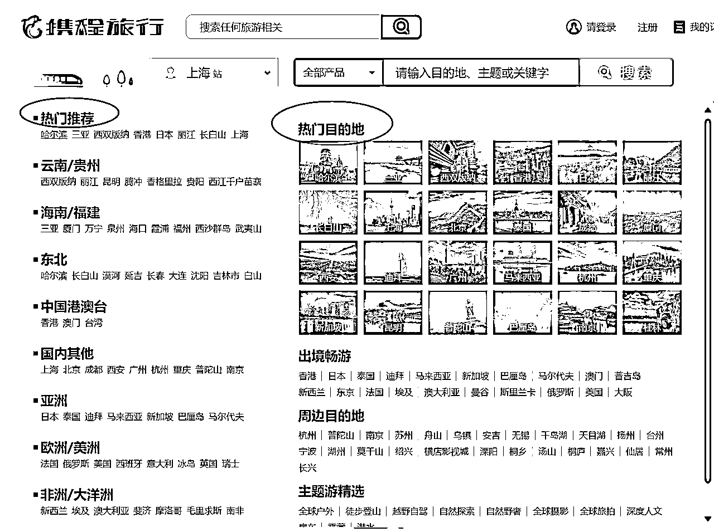

#### 3、生意参谋

这个方式是我这两天和旅行社的老板交流才了解到的，这是他们的选择蓝海线路的办法。很多旅行社会有飞猪运营的岗位，飞猪运营的一个重要职责就是，通过飞猪的数据，选到近期新火起来的线路，然后旅行社根据这个数据，制定新的线路。飞猪的数据和淘宝是打通的，也就是说我们通过生意参谋就可以找到目的地的搜索情况与竞争度。

比方说我们打开生意参谋看下面这个数据：禾木三日游的商品数只有3个，5日游的商品数是38个。但是三日游的搜索指数是五日游的两倍！

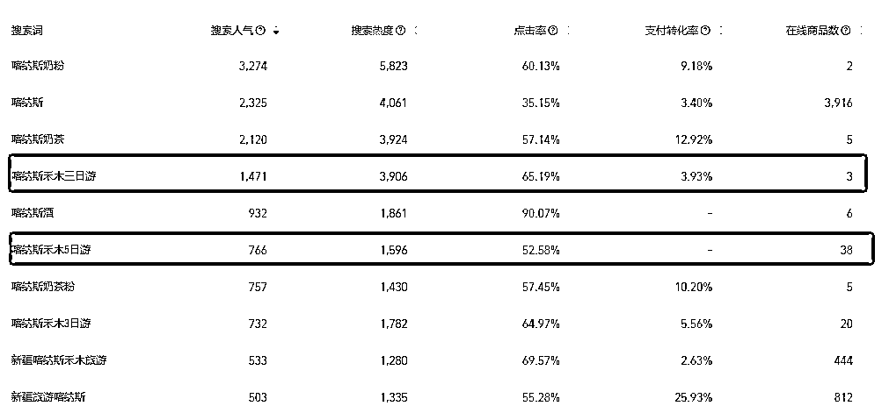

我也通过这个方式查了一些地方的热度，给大家参考，国内哈尔滨vs西安

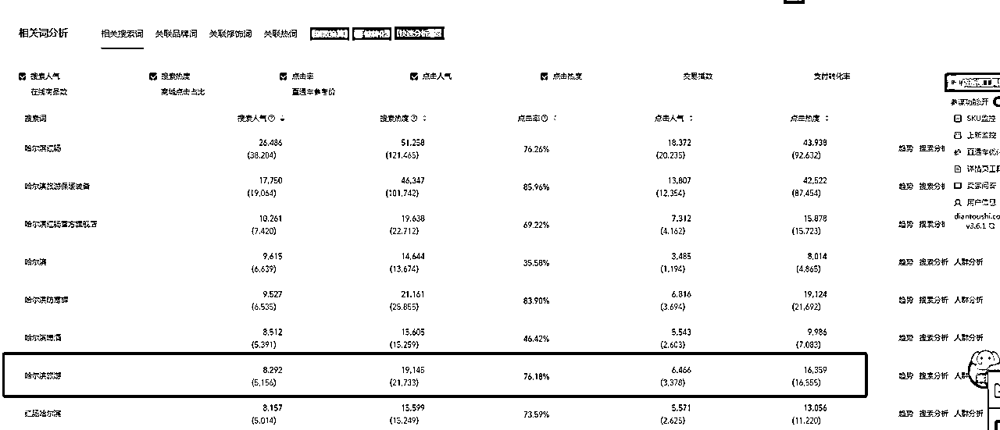

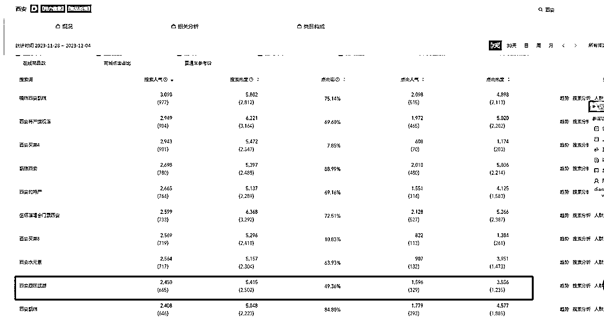

国外的大阪vs济州岛

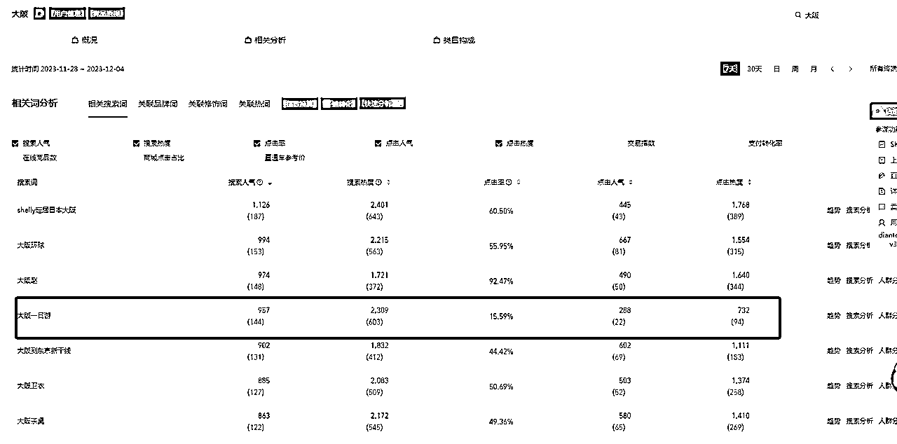

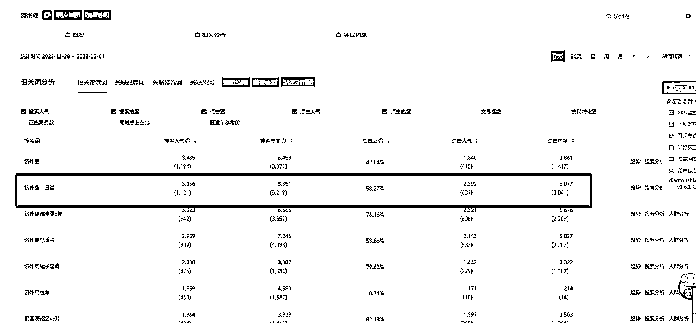

### 二、搭建对标账号库与知识库

### ——快速了解行业，打破认知壁垒

对标账号的库与知识库的建立，有助于我们快速的熟悉这个行业，从而打破陌生感，心理上的陌生感会让我们迟迟动不了第一步。

#### 1、对标账号库

我会将近期的爆款内容整理到表格里，我的表格很简单，我最需要的信息就是封面、标题以及链接。爆款封面我都会截图下来，这样方便我观察模仿。

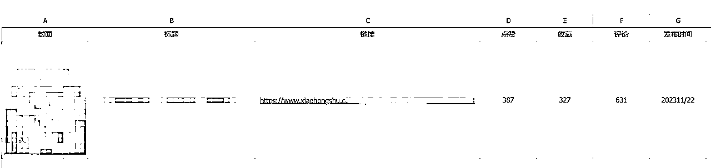

（对标账号库）

整理以后，大体就能了解，我们这个线路，发什么东西会火了，后面就是来像素级的模仿爆款封面。

#### 2、知识库

知识库分为两个部分，营销部分与客服部分。

1.  营销部分可以参考对标账号的干货贴内容，以及旅行社给的资料。 线路知识库的搭建可以让自己快速的做出优质内容，比方说对标账号的爆款内容是，来西安旅游15个注意事项，我们就做20个注意事项。别人写要避的20个坑，我就写25个坑，这个硬功夫一定要下，做10篇一般的内容，不如这一篇对客户有说服力。整理知识库很花费时间，整理出线路加写第一篇文章，我用了整整一个工作日。但是第一篇发出来以后就1000+阅读，目前还在持续增加。

1.  客服部分可以找对标客户都聊一遍，聊个10家8家的就差不多了，然后总结下话术。有了客服知识库以后，随时可以交给其他人打理，解放自己的时间。

### 三、内容制作

### ——拒绝平均用力，该卷卷该抄抄

我把内容分为两类，第一类为人设笔记，第二类为营销笔记。人设笔记要增强客户对我们的信任，而营销笔记要展示出我们产品的卖点。

#### 1、人设笔记

##### 1）干货类：

常见的有攻略、合集、路线图、注意事项、避坑指南

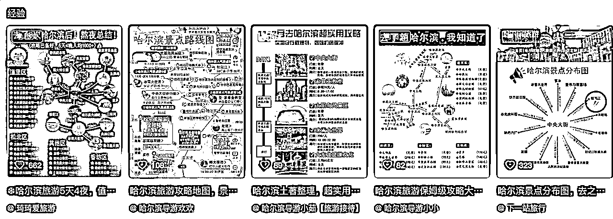

我们前面说的“避坑贴”和“注意事项”，在我看来也是一种人设笔记，当全网最多写到“来X地要注意的20个事项”，我们写到“来X地要注意的30个事项”，客户会觉得【我们做这个事情很认真】，进而有助于我们的转化。

##### 2）自我介绍：

这个是航海教练阿渡在航海群里分享的，清晰的告知我们是谁，我们做什么，我们有什么优势。

链接：https://www.xiaohongshu.com/explore/649e4fe2000000001300a835

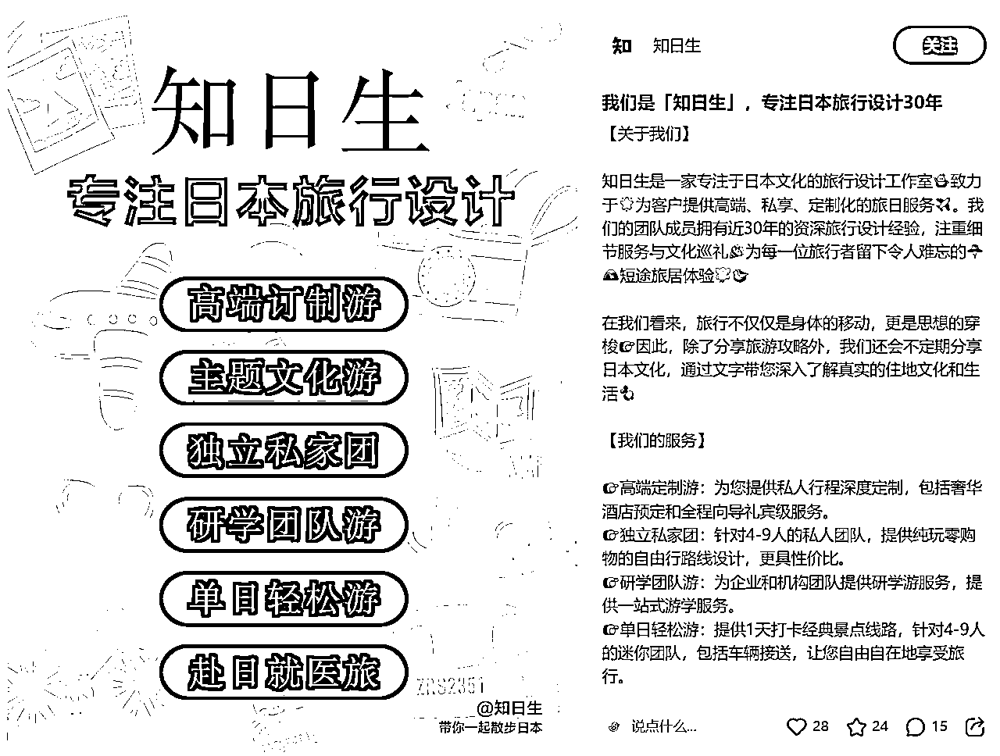

##### 3）展示权威

这个账号就选择了直接亮证，自然让客户多了一份信任。

链接：https://www.xiaohongshu.com/user/profile/5c9de72f000000001002e744

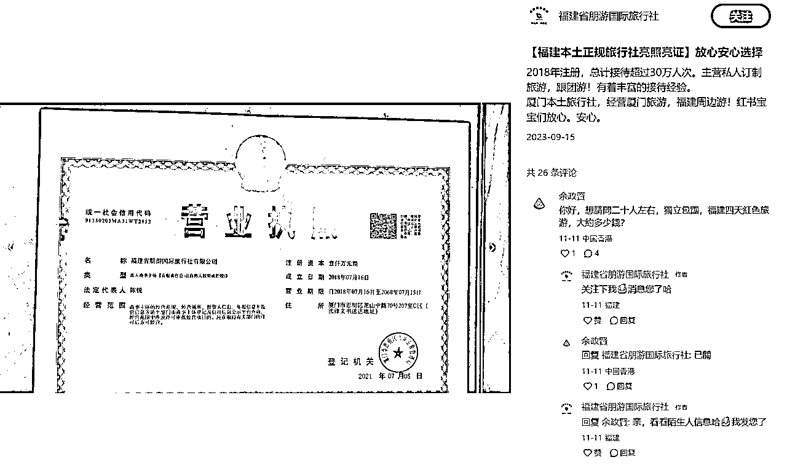

目前小红书笔记只能置顶两篇，建议第一类必选，二类和三类二选一置顶。下面这个账号，就是两个人设笔记置顶，下面内容基本都是营销笔记。

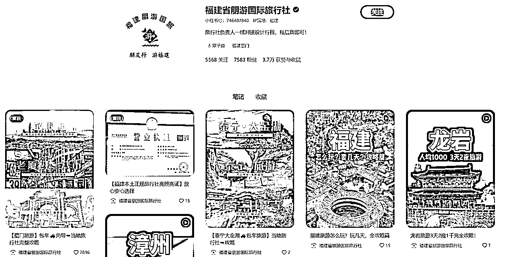

#### 2、营销笔记

昨天和其他航海船员交流时，发现他的干货型笔记做的很用功，但是没有任何引流，这是因为缺少了营销类内容。大家看完干货就走了，很少人会咨询，何况成交呢。一个好的营销型笔记，应该突出卖点，并且尽量满足批量化快速化的生产。

我们一定要避免平均用力，干货型笔记就是要投入更多的时间比被别人更卷，营销型笔记就是要找到合适的模板快速生产。

我给大家举几个旅游行业的营销模板的列子：

##### 1）路线轨迹图，动图

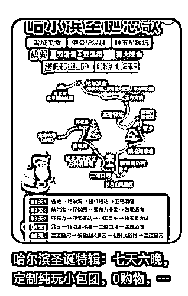

https://www.douyin.com/user/MS4wLjABAAAAmNcHLTYpiyPhl5GxqoqDjNGTYaC7l1xirYBk1-1vzaHh-8_KEn2j2jvl6H6QZAzV?modal_id=7309296986522406194

###### 路线轨迹图，静图

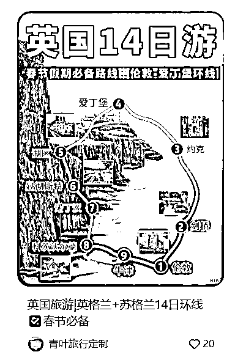

##### 2）美女朋友圈拼图

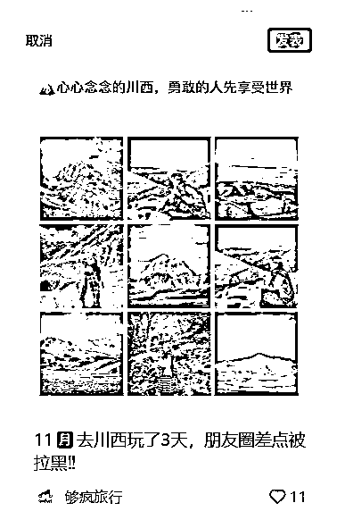

https://www.xiaohongshu.com/explore/6553675f0000000032038e3c

##### 3）旅行vlog混剪

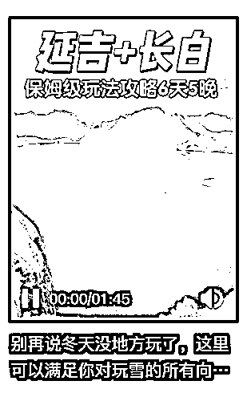

https://www.douyin.com/user/MS4wLjABAAAAmNcHLTYpiyPhl5GxqoqDjNGTYaC7l1xirYBk1-1vzaHh-8_KEn2j2jvl6H6QZAzV?modal_id=7291491209187544320

##### 4）产品报价单

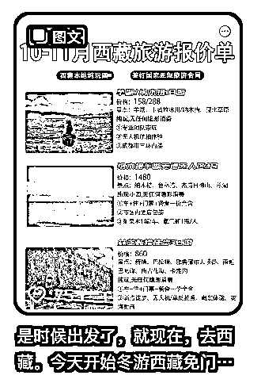

https://www.douyin.com/user/MS4wLjABAAAAR_ShWI7NrRKZiR5193bPCSn2FGHiawheUdRtUUkkCocISa4_ZxR_Ds8npnWPMFOK?modal_id=7290427688265715000

##### 5）产品介绍图

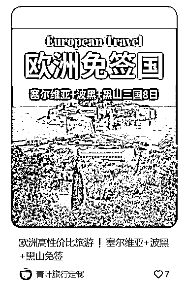

https://www.xiaohongshu.com/explore/655da39f000000000f028a6a

##### 6）美女打卡图+标题低价引导

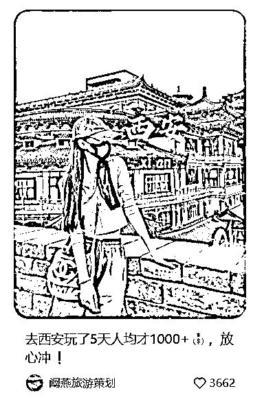

##### 7）产品+卖点：拼车+上门接送

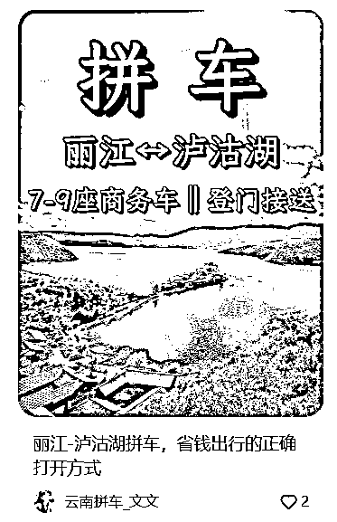

营销笔记就是要通过找到合适的模板，来快速的生产出我们的内容。不是说内容简单成交就低，也不是说不是爆款内容成交就高。客户成交和文章是否爆款，粉丝量多少没有太大的关系。一个模板可能有效期只有一两个月，甚至更短。除了旅游行业的模板，我们也可以学习其他行业的模板，来迁移到我们所做的旅游类目。模板看起来简单，但实际上拼的是见识、是对产品的理解、是对客户需求的捕捉，是创新力。

#### 四：引流

#### ——学习航海手册，多个方式合规引流

这次航海老师总结了几个引流方式，大家参考即可

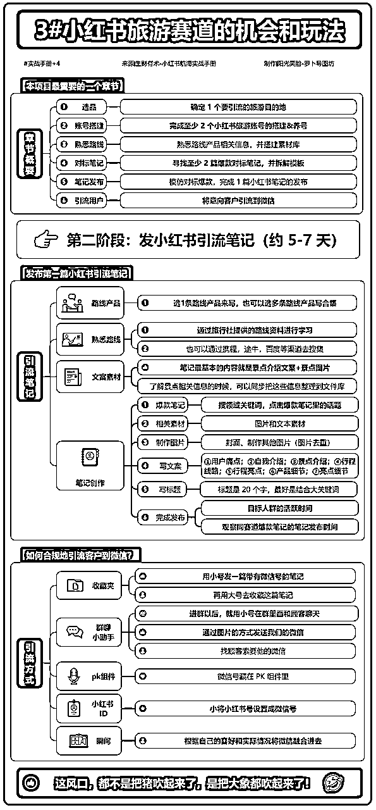

ps:来源|生财有术-小红书航海实战手册 制作作阳光笑脸-罗卜导图坊

#### 五、转化：

#### ——搭建人设朋友圈，提高客户成交率

转化方面，需要注意两点：一是朋友圈的搭建，二是客服话术.

关于朋友圈搭建，在这里我栽了一个坑，由于开始的朋友圈发布的太少，所以成交率特别低，应该听教练的，直接拉群给旅行社转化，或者说前期把客户直接给旅行社就好了，后面朋友圈搭建起来再自己转化。

客服话术方面，这个前面我们已经整理好了，没有遇到的问题，去找旅行社询问，然后补充到客服知识库里即可。

#### 总结：

#### ——入行两周的思考，以及未来的布局

这两周做下来的整体感受：

虽然旅游项目目前做的比较顺利，但是我们也发现了旅游项目存在的问题，一是产品的问题，线路内卷、价格内卷。二是内容问题，目前小红书整体的趋势是对内容的要求越来越严格，但是目前旅游行业内容同质化严重。如何结合小红书平台特点，发挥种草优势，且产出的内容是对平台、对用户都有价值的，也是一个考验。

面对这两个问题，从长期讲，要做好旅游项目最终还是要拼供应链、拼产品、拼素材、拼创新。不断的拓深优质供应链的合作，找到合适又合规的素材都是必须要解决的环节。

接下来我们将深度参与到某条旅游线路上，重塑这个线路的营销链路。之前我们是通过搬运混剪、或者是通过旅行社现有的素材来进行创作，未来我们将参与到旅行的体验中，甚至参与到旅行线路的设计中，深度挖掘旅途中的亮点，告诉旅行社我们需要怎样的素材，然后由向导来执行拍摄，拍好素材再返给到我们来制作营销内容。当有了更多的素材，我们就会有更好的内容，有了更好的内容就会有更多的客户，有了更多的客户又会有更多的素材，进而形成飞轮。欢迎喜欢旅游行业的小伙伴们一起深耕旅游项目，一起讨论，一起生财有术。

谢谢生财以及小红书旅游的教练们，谢谢郭晓文老师对项目的指导，谢谢大家！