# 如何低成本打造一个年盈利300万的线上升学规划机构（抖音教育直播航海）

> 来源：[https://wq43syvo98.feishu.cn/docx/MviudsEpSodwmLxG3xXcPqoanTh](https://wq43syvo98.feishu.cn/docx/MviudsEpSodwmLxG3xXcPqoanTh)

航海开船在即，本次航海新增了一条【抖音教育直播】的航线，跟圈友几番沟通下来发现大家对这个航海的项目有所误解，故在开船之前连夜写下这篇拆解帖。

本篇帖子共分为四个章节：

1、升学规划行业概述

2、直播升学规划变现拆解

3、小而美的教育直播公司团队搭建

4、总结

开始正文之前先用几个场景让大家看看什么是可复制的升学规划直播

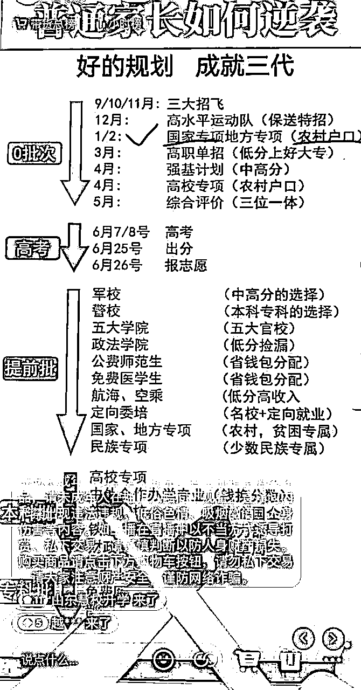

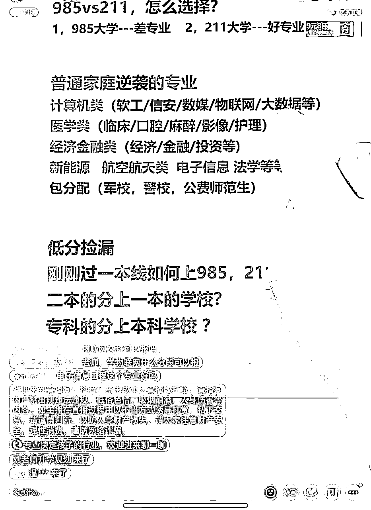

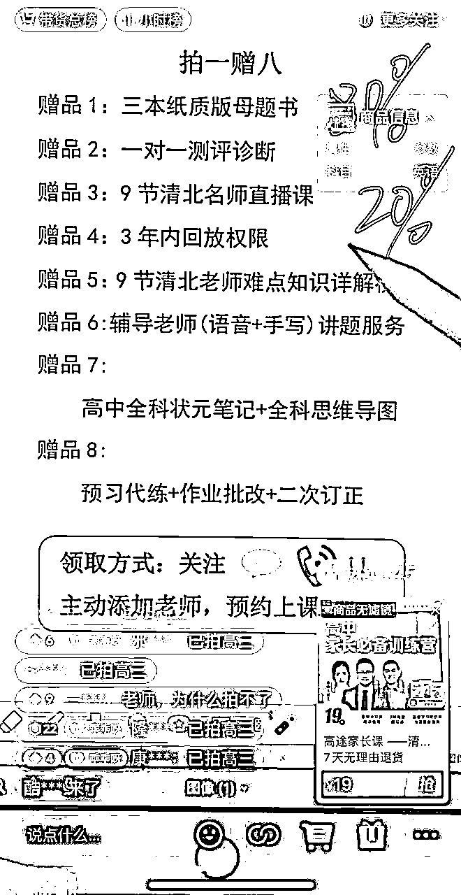

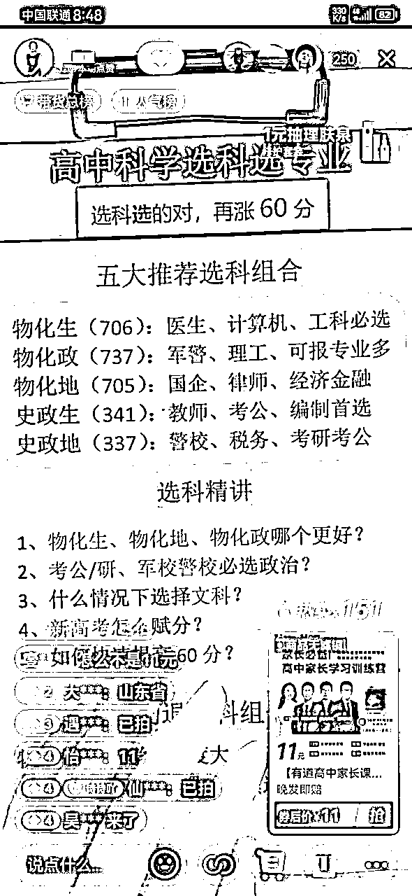

但看场景，大家是不是会认为需要极高的专业度？如果我摆出直播间背后我们直播场景大家又当如何看？

没错，所谓在直播间听到的专业都是稿子读得足够流畅而已！好啦，降低难度预期之后我们开始进入正题。

# 第一章：升学规划行业概述

第一步先说一下，为什么做升学赛道，升学赛道赚钱的机会大不大。值不值得去深耕这个赛道。

先看官方数据

教育部数据显示，2023年高考报名人数达到1291万人，比去年增加98万人，创历史新高。这是竞争空前激烈的一届，同时，也是求学过程格外曲折的一届：他们经历了中考延期，高中三年大部分时间都在疫情中度过，与他们同期毕业的高校学生就业困难。

伴随着这些背景，“高考志愿规划师”（以下简称“规划师”）成为热门职业，根据我们的采访，今年的高考志愿报考的市场人均单价基本已达到5000元或以上。根据艾媒咨询今年6月8日发布的相关报告，2022年，中国高考志愿填报市场付费规模达8.8亿元，预计2023年高考志愿填报市场付费规模达9.5亿元。

最少从官方数据来看，升学赛道是一个逐步增长的蓝海市场。但是数据代表不了实际情况，因为我本身一直在教育行业，在做这个赛道之前，我就以兼职独立规划师的身份找到了几个线下机构去面试。

只要有岗位，那市场一定有需求。目前整个行业的问题就是规划师严重不足，尤其是暑期高峰期。另一方面来看，也是这个行业的优势，一个规划师能服务的学员是有限的，那这个赛道就是天然的弱内卷行业。内容上重服务轻产品，那对初入者也相对友好，没有头部品牌效应。

确定了整个市场是蓝海市场，下一步就是看线上能不能做？有没有头部IP？线上的发力点在哪？

整个升学规划行业都是集中在线下市场，自12年逐步向上发展至今，新高考改革可以算是行业的一个爆发点。

线上业务的现状是：只有头部IP张雪峰，没有头部机构。但是张雪峰也是在考研转入升学行业。这就是一个巨大的空白市场，而且是一个非常好做个人IP的市场。

上面也说了，这个行业的交付内容是重服务轻产品，内容知识面广。张雪峰的IP不管流量多大，他的公司能服务的人是有限的。这个内容的个性化要求非常高，那头部IP和机构所带来的压力很小。从教育行业的来说，这是一个可持续做高价续费和转介绍的项目。

目前升学规划行业都是集中在线下业务，线上凤毛麟角。再基于内容的属性，线上就大有可为。

个性化+内容深度，两个因素就决定了线上可批量复制，并且可以深耕。足够的深度就代表有门槛、可持续；个性化那不同风格的规划师都有自己的受众群体，用户的个性化也给了规划师IP塑造和变现的抓手。

# 第二章：直播升学规划变现拆解

纯自然流，不涉及任何付费投流

这个项目能做，那么就要说这个事怎么去做。

讲项目，先看变现：

*   初级变现：直播获客卖订单粉（小课包）

*   中级变现：直播带课/带货

*   终极变现：直播带货+引流规划高客单

## 初级变现：直播获客卖订单粉（小课包）

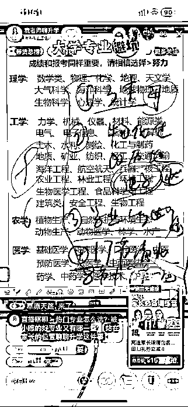

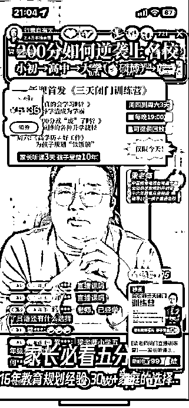

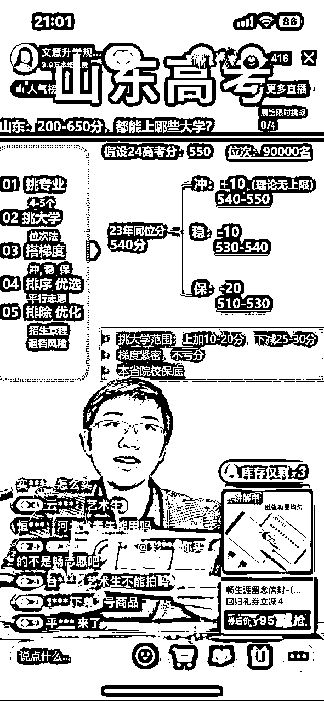

三个直播间都是升学赛道的直播间，小黄车挂的就是小课包。简单来说就是我们给别人卖的引流课，这个课他不是你卖19块钱你就赚19块钱。实际上结算的是流量费，一般能结算到60往上，相当于卖出第一单。19元的小课包你能挣60往上。卖50单，相当于你就能挣3000块钱。

我们这边的主播非高峰期平均下来一场三四十单，高峰期一场100多单。一般主播是一天4场左右，单场90分钟。一天的单量就在100-500单左右。

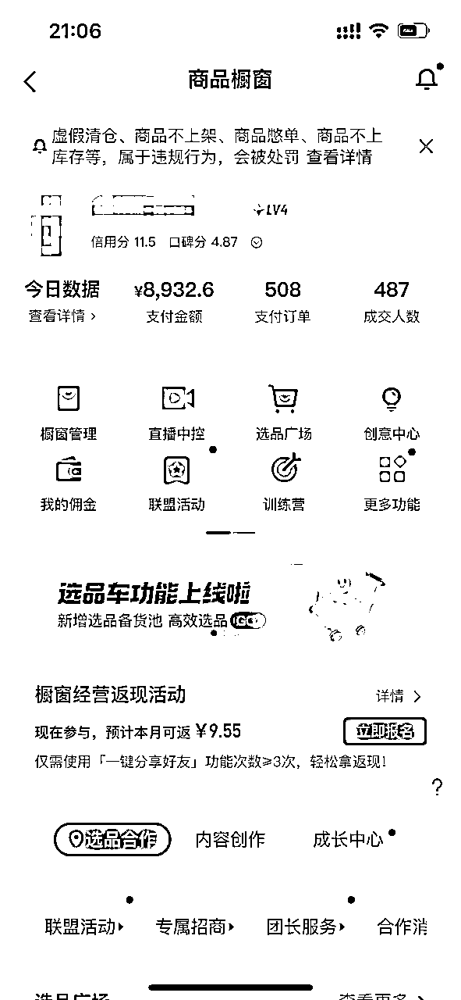

这个变现就非常可观。初级阶段的变现，非常适合还没有拿到结果、或者自己一个人想做副业的朋友去做，能够比较快的去见到结果。

## 中级变现：直播带课/带货

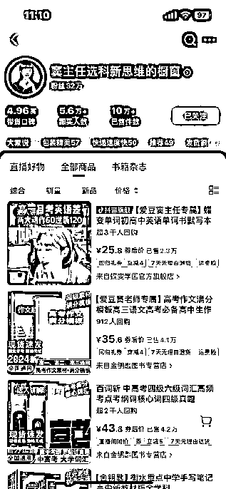

除了初级变现的小课包以外，基于我们的用户群体是高中家长。那就可以拓品带教辅图书、教材等，甚至一些养脑的保健品。

教辅图书的佣金一般在30%-60%，优势就是这个赛道的产品对于用户来说是硬性刚需。升学的压力下，家长的付费门槛非常低。

教育行业的特性就是家长认老师，不认机构。很多主播自然流带教辅类图书，比官方直播间要高的多。以老师的身份去推荐产品，在个人IP和内容的塑造下，带货收益非常可观。

这个阶段的变现就可以理解为：一个没有那么卷的电商赛道。同样，只要是匹配这个阶段的用户群体，符合你的直播间定位的产品都可以去带，不是局限于教辅类。面向高中生的保健产品销量也非常高。

这个账号7月开始第一场直播起号，截至目前，单场稳定销售额2.5～5万

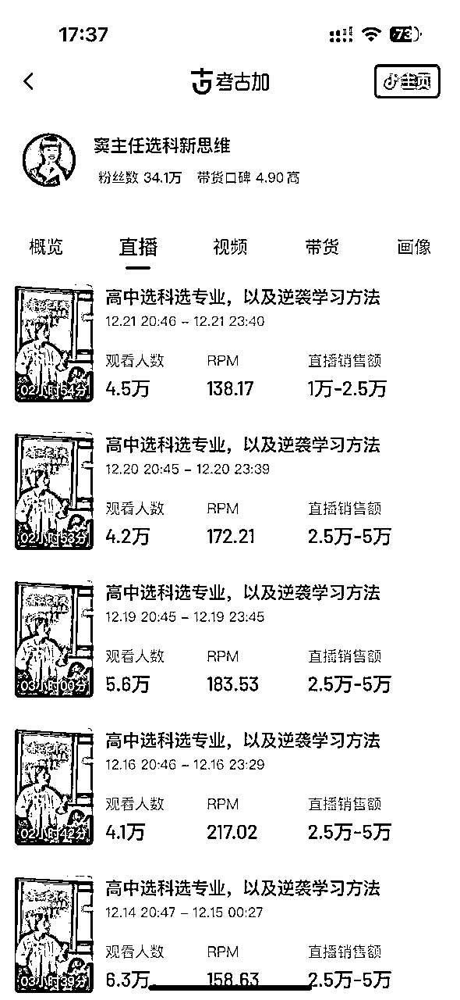

## 终极变现：直播带货+引流规划高客单

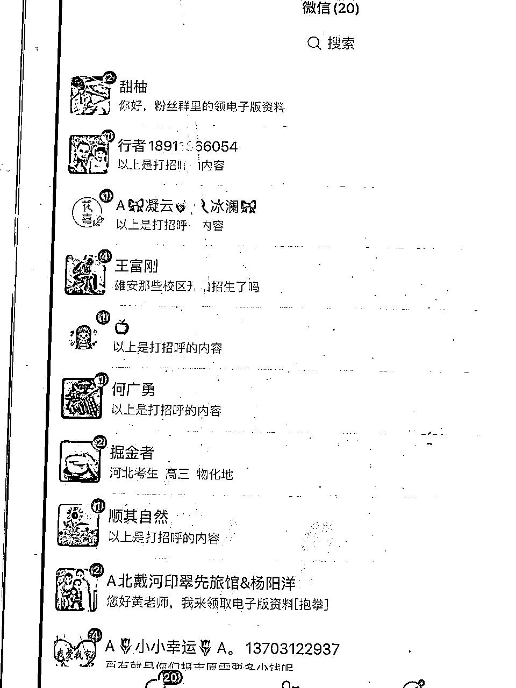

这个阶段的变现就是面向团队操作的了。升学赛道除了志愿填报以外，还有提前批报考、海外升学、港澳升学、强基计划、高职单招等。

产品基本是涵盖了各个分数段的学生。而每个方向的课程价格一般都在2万以上，海外和港澳方向价格更高。并且解决的是升学这个刚需问题，家长是有付费意识和认知的。

我们在直播间，日常做数据也需要去引导关注、引导粉丝群。在除了小课包和直播间带货两个直接的变现路径以外，还可以在粉丝群做引流。

如果是有一个团队的话， 可以去嫁接甲方的产品，沉淀到私域进行高价转化。个人的话，可以考虑找好合适的后端，去卖流量。这一块板块增长空间非常大，适合团队项目去做。

# 第三章：小而美的教育直播公司团队搭建

接下来说一下我这一年是怎么去做的，过程中有踩过哪些坑。

在此，再次感谢lemon姐的指导，有lemon没难题

确定一个项目可以开始做，第一步就是一定是自己先去跑通，跑通整个流程，才知道怎么去放大。

第二步就是考虑人的问题。先有人再有事。思考怎么通过人来放大项目

第三步去拓展后端，把变现路径扩大

## 初期：0到1，跑通初级变现

确定了项目可以做以后，在lemon姐的指导下，先做出了两版直播话术。我和另外一个朋友开启了无脑实操。

直播这件事说难不难，说简单也不简单。直播这件事就是你付出多大的精力，就能拿到多大的结果。

有后面的航海我就不讲具体操作了，给大家分享一下我踩过的几个坑。

### 1.先做学生：内容深度不够，学习方向有偏差

教育的第一步永远是先成为一个学生。

项目初期，我连直播话术怎么去拆解都不知道。依托的就是之前在教育行业的积累，也去学习了升学的相关知识，但是比较浅，没有深入学习。

在破风控和打标签的过程中，浅薄的知识还可以能够支撑。但是在第二周开始，流量始终没有突破。有流量测试，但接不住流量。最初以为是话术的结构有问题，反复的去优化互动和节奏。持续了两个周没有任何成绩。

发现不了问题，学习对标是最简单的方式。当时还没有明确的对标。只能拿张雪峰做对标，跟了三天他的直播，最大的问题就是不专业。

对直播比较了解的圈友，应该知道直播的基础数据就是停留。教育直播讲不出内容来，自然留不住人。没有停留，互动和加团不可能会有增量。

以学生心态入局。学生准备好了，老师自然就来了。

这应该是教育直播最大的坑，也是第一个坑。这一步决定了你能不能做成这件事。教育直播最大的门槛就是持续学习。

### 2.先是老师才是主播，分享利他，先予再取

这个在我看来，可以说是教育直播和电商最大的区别了，各位圈友在直播的过程中，一定要摆正这个心态。先做一个分享者，做一个老师去解决他的问题。然后你才是一个主播。

这个阶段踩得坑，简单来说就是急功近利，迫切的想寻求变现。

积攒够学习知识以后，数据有了突破，那就开始考虑变现。最初参考了电商的节奏，一轮一轮的带货。15分钟左右带一轮。发现这个方式停留数据很差，各项数据下滑的厉害，并且没有太多的转化。然后调整为一场带两次货，每次10分钟左右的时间。一直转化率不是不好。

后来还是在lemon姐的指导下，才知道这个节奏怎么去把控。教育直播带货转化的主要群体是停留的那部分用户，本质还是先分享利他，当你解决他的问题了，能够给到他价值，用户自然就会完成转化。先成为一个老师，再做一个主播。

## 中期：招募主播，扩大规模

直播跑通以后，就考虑怎么去放大了。志愿填报的内容决定了可以去批量复制。并且内容广，可以细分出三大板块十几种细分内容。内容层面又可以避免内卷。下一步就是招人来跑测试了。

在招人之前，先确定的一个问题就是：人怎么去带？

基于业务，我把整个流程做了拆分：面试-试播-上播-起量-带货；过程中持续优化。想低成本的跑通，就需要大量的人员做覆盖。最简单的方式就是标准化流程，每个阶段有明确的考核指标，以漏斗的形式去跑。

#### 面试阶段&试播：

面试阶段快速的完成一轮筛选，从声音条件、直播时间及场次、职业履历等方面判定是否合适。

通过面试后，发初步稿件开始试播；试播需要从拿到稿件到试播的时间，大概判断学习能力、态度，根据试播的情况做出综合考评

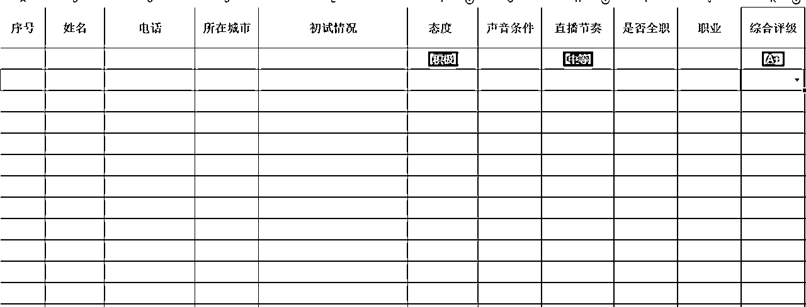

#### 上播&起量&带货

上播后的整个流程，就是以运营为主。运营一定比主播重要。内容运营持续输出内容，保证内容迭代；数据运营帮助主播做数据复盘；全职主播跑样。

按照主播的情况做分级，优质主播重点跟进，次级主播复盘优化，初级主播统一跟踪。一定是要有一个标杆，榜样的力量是无穷的。在标准化内容的基础上，全程由运营结合标准sop去做跟踪带教。

一句话：复杂的事情简单化，简单的事情重复做。

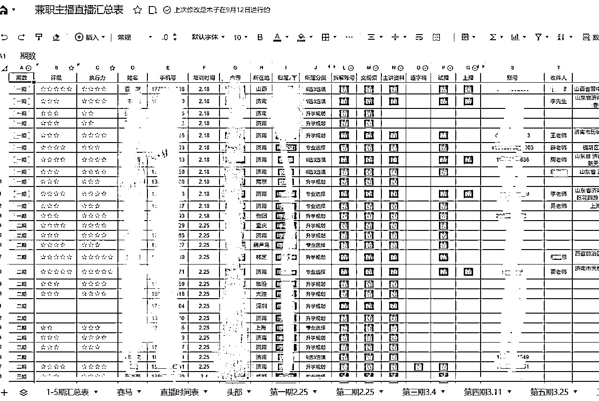

## 后期：开发后端产品，

放大项目的第二个方式：前后产业链拓展。当前的状态说产业链有点大，其实就是寻求外部合作。有流量了，那就去找合适的产品。

志愿填报前置产品就是提分课程，虽然提分课程好售卖、利润高。但这一部分是目前明令禁止的，线上无法上架，线下严查。所以更多的是在后置产品上下功夫。

升学赛道的后置产品非常丰富，志愿填报、提前批报考、海外升学、港澳升学、强基计划、高职单招等。前期来说不建议大家自己去做产品研发，难度大、成本高。尽量以外部合作为主。这一块可以搭建自己的私域团队，自己来做转化可以。也可以以流量合作的方式去做增量。

这块业务目前还处于开拓期，等有更大的结果了再来分享。

# 第四章：总结

以上就是我的分享了，有不足的地方欢迎各位大佬指正。抛砖引玉，期待大家的分享。

今天报航海的时候，发现所有直播类的航海是报名人数最少的。从这一点不难看出，大家还是很担心项目门槛高。我认为这反而是保护我们自己的壁垒。

其实在做教育直播这件事上，我一直没有拿它当一个项目，始终认为这个是一个值得去终身深耕的事业。教育本身就不该是一个项目。想做好教育很简单：有初心有底线、空杯心态持续学习

如果说各位圈友想入行教育或者教育主播，建议大家放平心态。教育行业最坏的结果来说你也掌握了知识。最后不也能反馈到下一代身上吗，没有什么损失。不要怕犯错

再次感谢lemon姐的指导，最后祝各位圈友生财有术，23年过个肥年，24年继续发财！