# 小红书副业卖脐橙，复盘5小时开单的过程

> 来源：[https://nivut760ftk.feishu.cn/docx/N8KGdu7avoJ301xBBl7cFjl8nWf](https://nivut760ftk.feishu.cn/docx/N8KGdu7avoJ301xBBl7cFjl8nWf)

大家好，我叫艾小飞，专做小红书流量

昨晚有位圈友来找我咨询：飞哥，准备过年了，我现在很焦虑迷茫，不知道自己要做什么才能赚到钱，该怎么办？

当晚也有人来问我：飞哥，最近有什么好做的赚钱项目吗？想做点副业，赚点奶粉钱

如何赚钱，成了很多成年人焦虑的问题

现在知识付费行业很成熟了，但市面上太多宣称日赚上百上千的项目，收费都很贵，眼花缭乱的，不知该信谁

很多人想网上找副业，但又不想被人坑

于是我打算写篇文章，分享我用小红书新号，5小时开单的思考和过程

虽然这次卖的脐橙每单利润只有14.2元，但这个项目低成本，出单快，易复制，是很多“大佬”看不上的小生意，却给了我们一点点赚钱机会的空间，非常适合新手小白去实操

为了方便知道我接下来会讲到哪些内容，我列出了以下目录：

一、我是怎么想到卖脐橙的

二、我是如何思考产品定位的？

如何价格定位

如何人设定位

如何封面定位

如何标题定位

如何模式定位

三、我是如何发帖引流成交的

素材准备

测试流量

数据差劲

客户咨询

付款成功

四、最后我想对你说的是

想赚钱，先行动

行动前，先思考

思考时，做测试

测试后，拿结果

有结果，快复制

五、总结

好了，废话也不多说，文章较长，想在小红书赚钱的圈友，请继续阅读文章！

* * *

# 一、我是怎么想到卖脐橙的

可能有些朋友会比较好奇，我去卖脐橙，都有哪些思考的关键点？

其实也没什么好思考的，全凭我对象的一句话刺激了我，我就去做了😂

是这样的，自从我上个月跑通残蟹项目赚到钱后，这个月就一直没有跑通什么产品，半个月连续做失败了三个项目

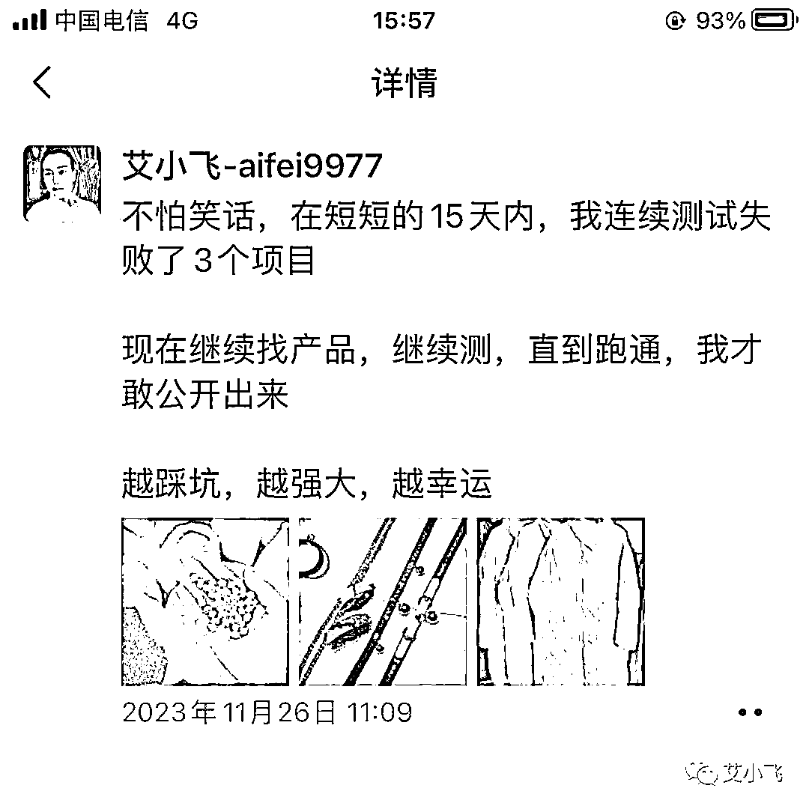

实话说，这次自信心受到打击了，赚钱重担都在我头上，所以我也很急，失败了继续测试，测试了继续失败

然后有天我对象来跟我说，她现在自己跑通了脐橙项目，每天都能出几单，边开玩笑边挑衅的问我，要是给我来做，能不能也像她那样三天出单

哎哟喂，她一这么问我，我就不服气了

我反问她要怎么玩，输了怎么办

她说，规则是要求我们俩同时用新号卖脐橙，谁出单快，谁就获得对方送的礼物

本来我对脐橙不太感兴趣的，加上当时连续失败了三个产品，没信心了

哎呦，她这么一提，那干就干吧，所以当时就发了个圈，记录了她跑通项目和我开始做脐橙的时间

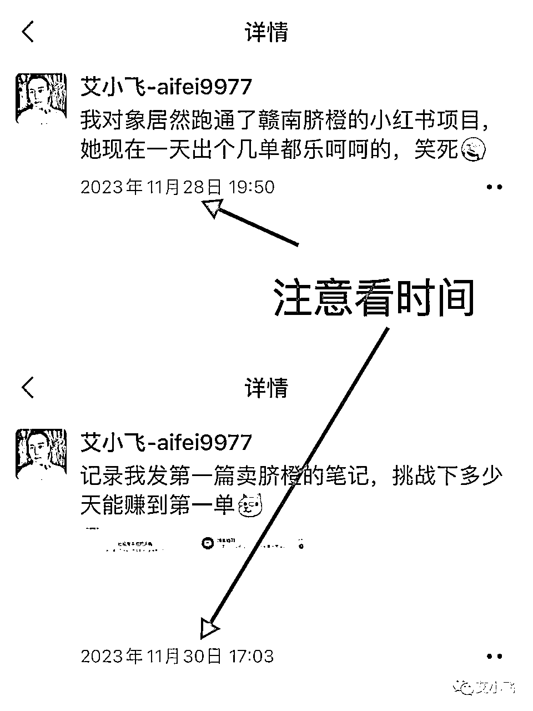

既然接受了她的挑战，那就要认真的去思考如何快速的出单了

# 二、我是如何思考产品定位的？

我考虑到自己在脐橙行业算是个新人，不熟悉市场，不懂需求点，也因为连续失败几个产品，对于这个挑战，当时我心里是没底的

为了能快速的摸透脐橙的所有信息，我只能先观察同行，看看他们的价格是如何定的，封面是如何做的，人设都有哪些身份，模式都是怎么玩的

## 如何价格定位：

当时什么都没想，我第一思考的问题，就是价格，因为它关系到我的利润空间和产品竞争力

当时搜了一圈小红书卖脐橙的笔记，发现他们有打价格战的，也有走中高端路线的，综合平均下来的市场价，大果基本在60元十斤左右

然后我去拼多多对比，看看我的利润差额有多少

我找了几家，基本上都是在25.8~29.8元区间

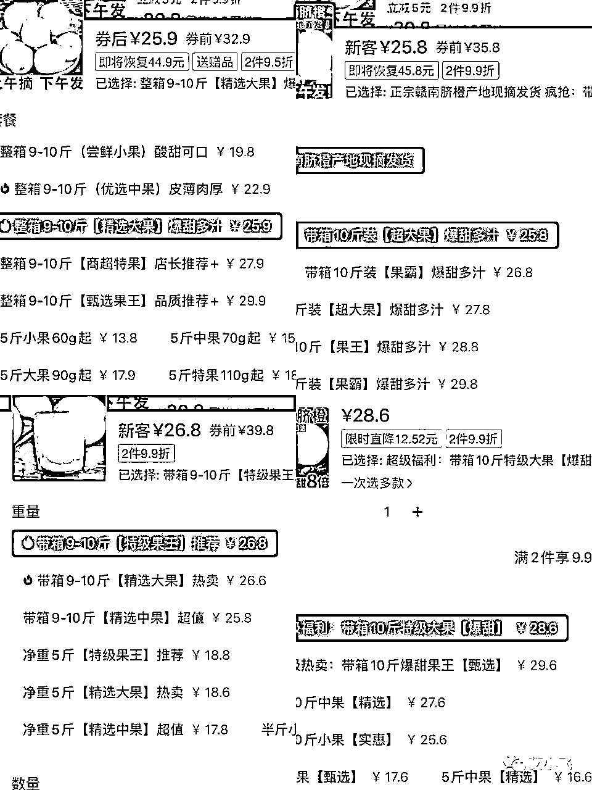

如果我卖的跟他们一样价，那肯定没有优势

我看市场上卖40元十斤的人很少，不如我降低利润，每单只赚14元，先暂定这个价格试试看，不行再做些调整

## 如何人设定位：

确认好了利润和定价后，我第二个要思考的问题是，同行都是在用什么样的人设身份卖脐橙的

这个很重要，会直接关系到产品的转化率

看了一圈，发现大部分都是以“用户”转“商家”的身份去卖的

发现他们笔记流量大，但转化低

而少部分都是以“果农”的人设身份去卖的，流量少，但转化高

当时我就看中了“果农”的人设身份，但烦恼的是，别人一看我的ip在广西，就知道我的冒牌的了，该怎么办？

当时我思考，要不我用残蟹项目的那个玩法，把自己包装成，在外省上大学的果农女儿

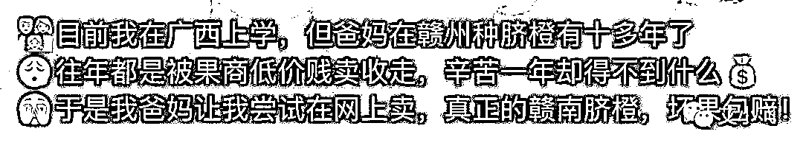

“因为不忍心看到爸妈被果商低价收走，于是尝试在网上帮爸妈卖”

有解释，有缘由，这样既能保证了我的ip不被人怀疑，还能加深用户对我的信任度，可以一举两得

## 如何封面定位：

确定好了价格和人设后，第三个思考的问题是，看看同行之间的封面，都是怎么做的

因为我清楚，如果想在小红书上快速获得自然推荐流量，封面是很关键的

去搜了一圈，发现同行大部分封面都是以挂在树上的为主

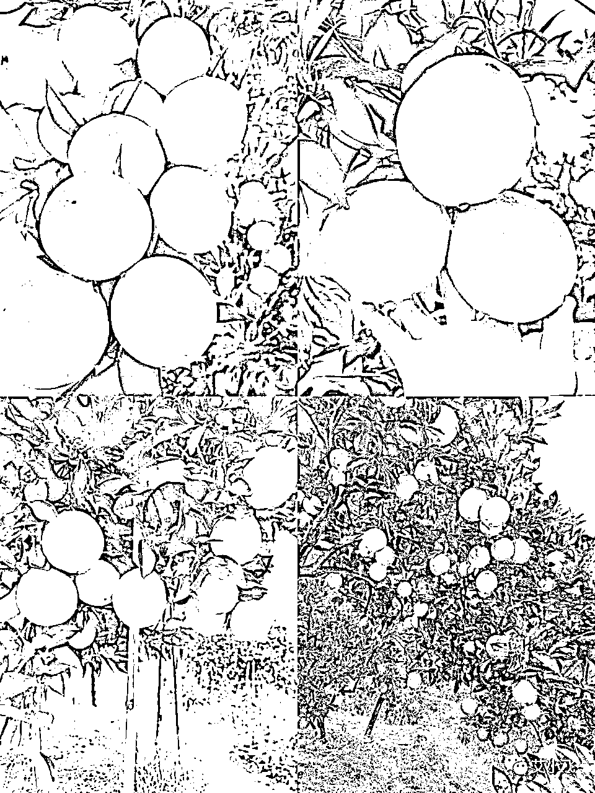

刷了10分钟，有种莫名的视觉疲劳

我觉得这样不行，要是我也发这种封面，用户也会划走的，没有什么吸引力

那要找什么样的封面呢？

我在思考，用户会因为脐橙的哪些点产生好奇？为什么想下单买脐橙？

于是我联想到了，利用“多汁”的封面，配上“价格低”的标题，驱使用户的好奇心，让他主动的点击进来看

确定好了封面的核心点后，那封面的素材该去哪找呢？

总不能去网上买正宗脐橙来拍素材吧？

这时间和成本太高了，要是拍成，对象已经早都出单赢我了

于是我用了老套路，去搜“脐橙吐槽”的笔记，到评论区去收集用户的“反馈图”

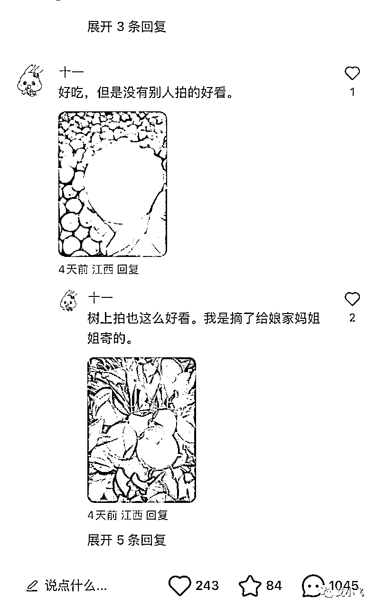

把符合“多汁”的封面，通通都截图收集到相册，然后再用美图秀秀二创去水印备着

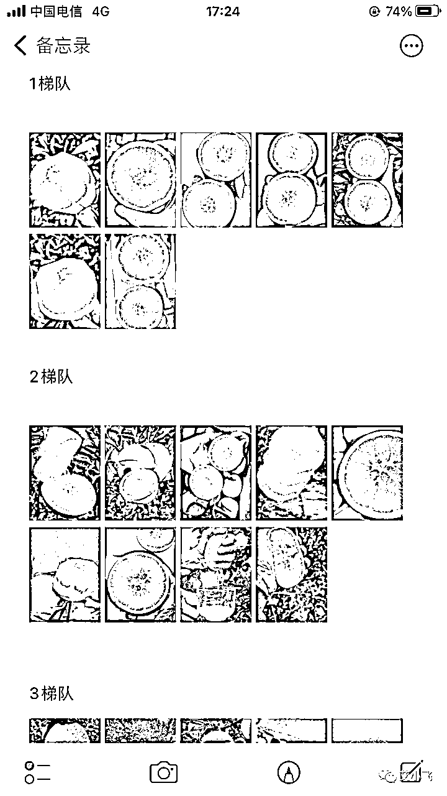

这样省时间也省成本，轻松搞定了封面素材的问题

## 如何标题定位：

刚说封面是影响小红书流量的关键，但标题也一样重要

比如高级的封面配上一个垃圾的标题，流量是高不到哪去的

所以我当时操作的路径是，搜“脐橙”“赣南脐橙”的关键词，点击“最热”

把符合我人设身份的标题，收集了十多个，放在了我的备忘录里

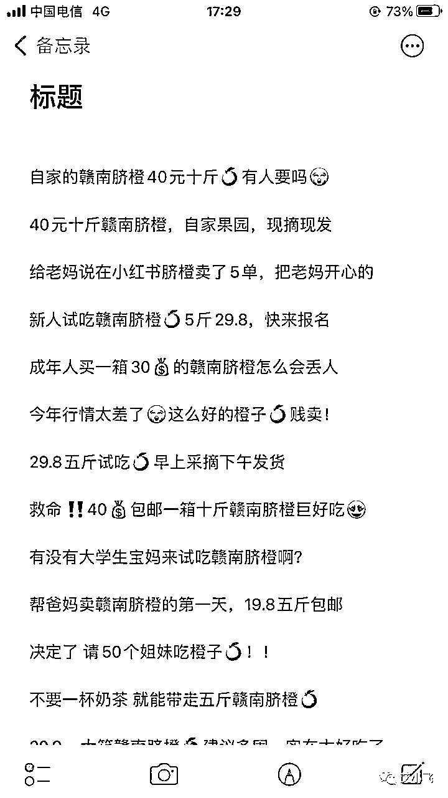

只有模仿+优化，才是出单最快的捷径之一

## 如何模式定位：

当所有的思路和问题都搞定了后，就差模式该如何定位了

要是这个问题想通了，就能节省很多的时间成本

在小红书上卖脐橙的方式有两种，有人在小红书上开店卖的，也有人引流到私域卖的

要选择哪种比较适合我呢

当时我去了解了在小红书开店的情况，如果开一家卖水果的店，要交押金，还要去办一张营业执照，而且营业执照要有水果的经营范围

这么麻烦！

要是全部都弄好，黄花菜都凉了

于是我在思考，如何低成本，高效率的去卖脐橙呢？

那只能走私域模式了

不用开店，不用押金，不用执照，更不用压货，快速跑通，快速赚钱

这个模式是在小红书上发帖吸引人，转化，然后引到微信上成交后，再从拼多多下单给他发货，完成！

以上这四个就是我做项目前要思考的关键问题，要是不提前思考好思路和定位，就盲目的去发笔记引流，是很难在激烈竞争中快速脱颖而出的

# 三、我是如何发帖引流成交的

发笔记引流前，有个认知和心态是很重要的

就是平台发现你来这是打算“偷”走小红书的用户，系统会把你的账号限流或封号

这是一个隐性的风险，其实很多人都不太懂

所以我在发笔记前，已经做好了这号顶不过7天的心理准备，只有做好了最坏的打算，哪怕被限流，心里不至于很难受

## 素材准备：

因为刚刚我在找同行的封面和标题的时候，已经提前准备好了素材，所以这方面基本不用愁

待会从中选一组封面，配上一组标题，再结合正文，就可以发出去测试了

## 测试流量：

可能你会问，为什么要测试？

因为我也不确定自己刚建的新号流量是否正常，也不确定自己找的素材是否“合格”

所以把搜集来的素材统统测试一遍，要是有流量能出单，就批量去复制模板

要是数据差，淘汰掉，继续找新素材测试

## 数据差劲：

当我关掉Wi-Fi，关掉定位，发出第一篇笔记后，本以为数据还不错的，结果开局出师不利，我对象看到后都偷笑我了

第一篇笔记，居然才刚过100，这种不算是限流，但肯定不是很理想

我觉得不服，相隔一小时后，我继续再发一篇，流量依旧上不去

笔记有人点赞，但没人来评论，这才是我最头疼的

于是马上改变策略，我在标题上强调便宜，突出大果还包邮，然后配上几张多汁有诱惑力的图片，打算用价格去吸引他们过来围观，看看这招行不行

## 客户咨询：

发了第四篇笔记，过了不到10分钟，没想到，真有人来找我咨询了，说明这招还是能引到人的

因为我在正文文案里，没有明确的说是卖多少钱，打算利用他们的好奇心给吸引过来

她是第一个来咨询我的，开头就问：“咋买”

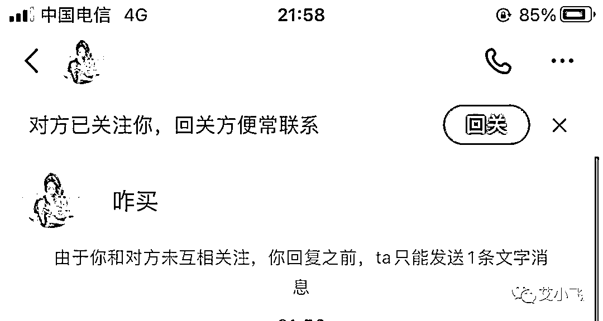

因为刚刚经历过数据的惨淡，所以这个用户我还是很重视的

为了让她尽快下单，可能当时我是有点急了吧，就跟她说40元十斤大果，还包邮

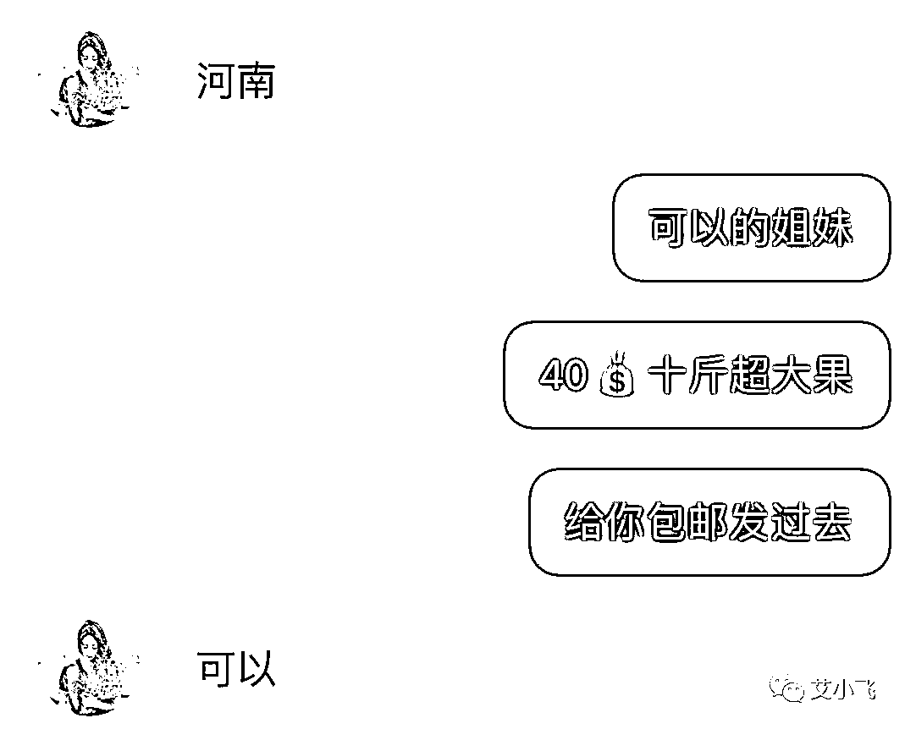

她回复“可以”时，哇那感觉瞬间就上来了

当时我也没来得及去准备引流的小号，为了不让她离开小红书，我马上问她：“你的v多少”

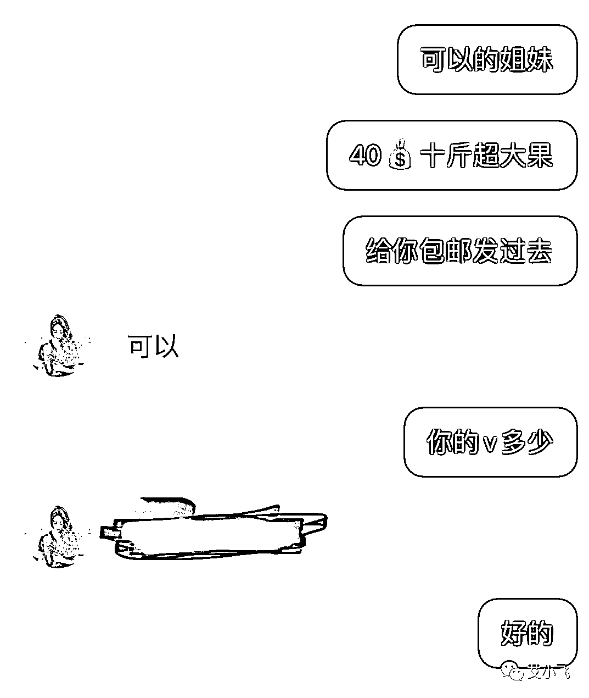

虽然我知道这句话被违规的风险很大，但当时也是急了，圈友们千万别学我当时错误的引流方式啊

她给了我微信号后，我就去用小号加了她

## 付款成功：

加她后的第一句话是问她是否有闲鱼链接

为什么？

你们看下她从咨询我到加微信，中途用了多长时间？

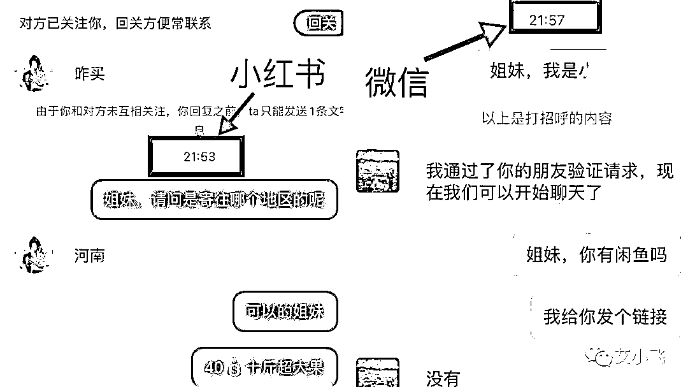

如果你是用户，你会轻易的转钱给陌生人吗？

当时我是从用户的角度去思考问题，为了降低用户决策成本，也为了提高转化率，我就想到了这个办法，不能让客户有过多的顾虑

当时我还在跟对象说：你觉得她会不会是同行啊，会不会不下单，故意来试探我们的

正好我俩还在担忧的时候，听到手机后台闲鱼下单成功的消息了

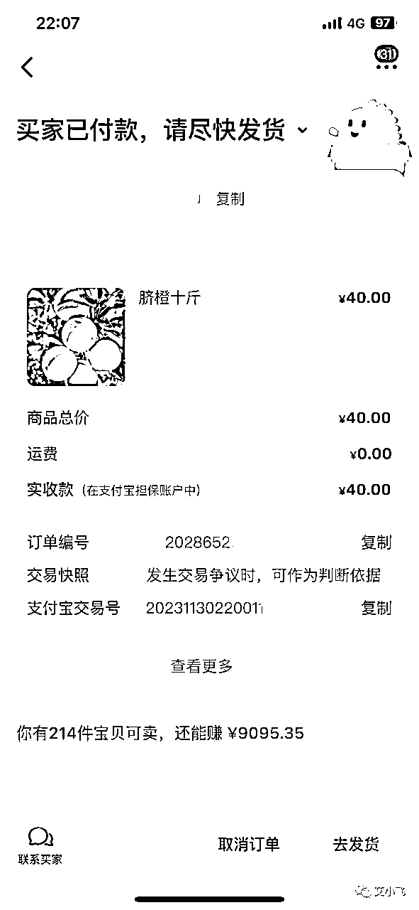

哇塞，那一刻心里终于松口气了，我对象带着不情愿的心情，也接受认输了

然后我就去拼多多给她下单

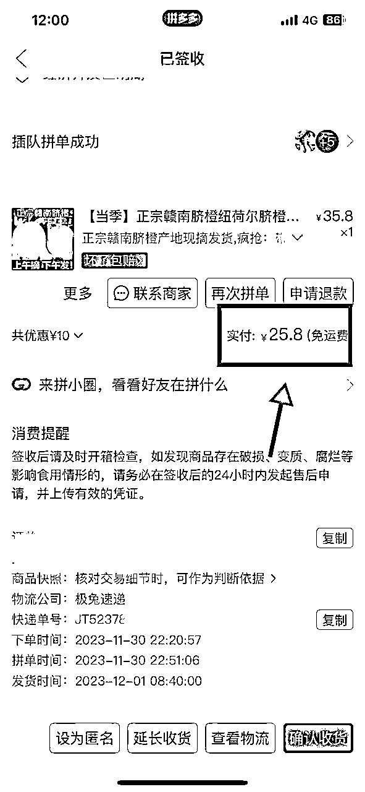

当第二天有物流信息了，我再复制单号到闲鱼上给她就行了

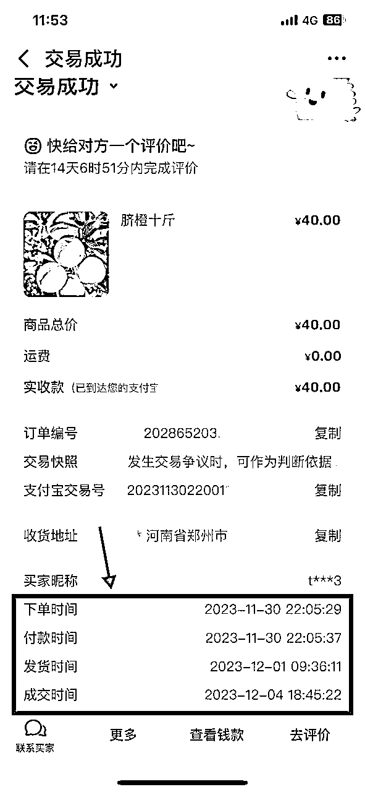

这整个项目从接受挑战到成交第一单，花了5小时全部都跑通了

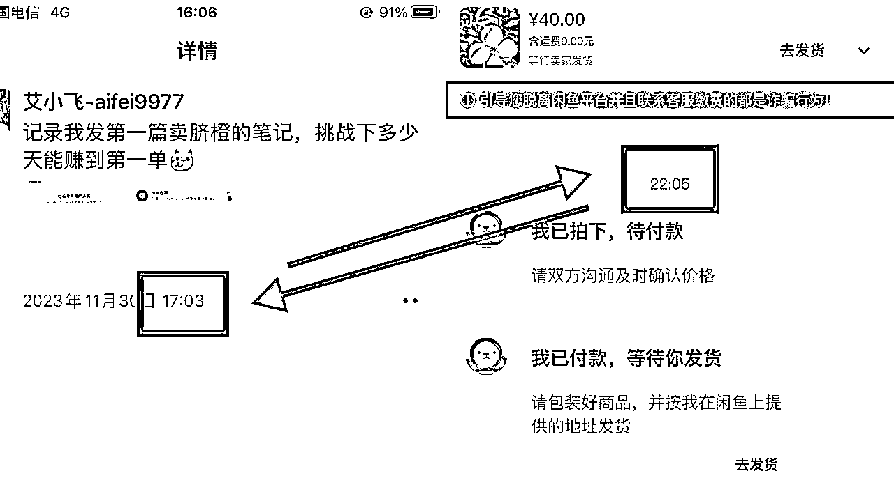

我对象后面也跟我说了实情，她要的不是这个项目能赚多少钱，而是想借此给我找回点自信心

那一刻，我悟了

# 四、最后我想对你说的是

我的整个实操案例都说完了，本来想在这结束文笔的，但后来想了想，不行，要留下点什么才行

以下说的这些，都是真心话

## 想赚钱，先行动：

为什么呢？

比如我今天分享的项目流程都告诉你了，你想去赚钱，但给自己“最近有点忙”的理由不去行动，不去照搬，看完后，有什么用？

或者给自己“我想再看看”的理由，而错失了最佳时机，看完后，又有什么用？

你想赚钱，但不去行动做，人家把饭喂到你嘴边都没用的，对吧

还不如看到一个赚钱的信息，先去完成再说，哪怕测试失败了，至少你也能学到在书中教不到的经验和感受，这也是一种价值

如果你做这项目有顾虑，是因为素材问题不敢去做的话，可以后台来找我要，我这有很多素材自己都用不完，都自己人，我可以免费提供

## 行动前，先思考：

当有了行动上的勤奋还不够，还要有思考上的配合

比如我做项目前，都会思考：

*   这产品利润有多少？

*   有哪些风险和成本？

*   同行还有哪些点，未能满足用户需求？

*   我有没有能力去操作？

*   多久能跑通赚到钱？

*   要是不成怎么办？

你看看，我做一件事之前，如果提前评估了自身能力和预想了未来将遇到的事，那么我去操作执行的时候，心里就有底了

不会迷茫，做事效率也更高

这就是行动前先思考的好处所在

## 思考时，做测试：

当你把问题都提前预想后，接下来就要去验证你所想的，和所做的差距有多少了

只有去验证测试了，你才知道这个项目的困难点在哪，需要用什么办法去攻破它

当下次做其他项目时，所思考的角度和深度，就比之前的有所进步了

## 测试后，拿结果:

不管最后的测试结果如何，当你进行到这步的时候，已经比大多数人要很强了

因为现在人的心态都很浮躁，总认为自己是天选之子，想着一夜暴富，却不愿脚踏实地的把一件小事给做好

如果你测试出来的结果不太理想，可以像我那样，去参考同行看看，以用户的角度，来对比你发的笔记和同行间有什么区别，从细节中，找到自己的问题所在

## 有结果，快复制:

当你成功的跑通第一单，赚到钱后，要冷静的思考下，这次你真正能出单的核心原因是什么，把它给提炼出来

比如像我这次出单的原因，表面上是因为用“诱人”的图片，配上“便宜”的标题去吸引人

实际上我是利用了用户想“占便宜”+“好奇心”的心理，把目标用户给吸引过来的

既然我知道核心点在哪了，肯定还想赚更多的钱，那该怎么办？

那么我发下篇笔记时，就会围绕“占便宜”+“好奇心”的心理去引流

而且，我还要批量注册多个新号，按照我测试出来的“出单秘诀”去铺量，1个账号赚的钱跟10个账号赚的，是不一样的

同时我还会把它做成知识付费的产品，让更多的学员跟着做，量大了还能去找厂家谈价，两边赚

这样的复制模式，赚得多还不累

# 五、总结

其实今天分享了那么多，就是为了让你对赚钱，对项目，有更深层次的认识，而不是迷茫又焦虑的去赚钱

还是回到文章开头的那句话，他问我很焦虑迷茫，该怎么赚钱时，这时大家，可能心里都有不一样的答案了吧

我叫艾小飞，专做小红书流量

我们下期，再见！

原创：艾小飞

转载可私信

禁止搬运和抄袭

微信：aifei9977（记得备注来意）

往期高赞好文

【如何找到商机并快速赚到钱】

https://nivut760ftk.feishu.cn/docx/VUkiddmHso93WHx1CuPcO5o0n1b

【小红书流量密码之-色欲篇】

https://nivut760ftk.feishu.cn/docx/C1ApdZKf7oJEsnxxWKac5ULenUe

【能提升60%销量的测品思路】

https://nivut760ftk.feishu.cn/docx/JUkxdxMvKohWaXxI5rocONV4nq4?from=tab_recent#part-N6EQdmXK0oij1fxHZJycjUoMnif