# 我是如何通过抖音评论区，9个字引流2500个创业粉，变现1W+

> 来源：[https://tv250chtq0.feishu.cn/docx/N8f0d11z3oU1SdxpMT0czjUYnig](https://tv250chtq0.feishu.cn/docx/N8f0d11z3oU1SdxpMT0czjUYnig)

各位生财的圈友们，大家好，我是可乐，也可以叫我蛇哥，98年，位于南宁，潜水了几个月，是时候出来露露面了，商业实干派，某医药集团电商负责人，蛇界淘金创始人，擅长各种热冷门引流手法，踩过几波风口，变现近七位数，2024年目标成为左手AI、右手IP的超级个体。

很高兴今天能给大家分享一个简单粗暴的引流方式，直到今天都有流量进来，主页访问平均两三天就能达到99+。

# 前言

我的职业生涯基本上都挺一帆风顺的，也是今年9月1日加入生财，因为在年中的时候预感到自己的转折点要来了，便萌生了创业的想法。

今年5-7月份的时候试了很多错，也是因为太着急转型和思维有点被固化了，虽然凭运气挣了点钱，但认知还是不够，尝试合伙做了一些业务，结果都失败了。

一次偶然的机会，让我接触到了知识星球，然后在星球财富周榜发现了生财有术这个频道，看完介绍，我的直觉告诉我这是个机会，能撬动大资源的杠杆，二话没说就进来了。

看到大家都这么努力，感觉一下子打开了新世界的大门，我便每天沉溺在信息的世界里寻找突破的办法，尝试了不少项目，逐渐纠正自己原有的一些思维，现在感觉整个脑袋瓜子都开窍了。

关于为什么会选择做资源整合，很大的一部分原因是在圈友@七小 那里得到的启发，思考了一段时间，我挖掘到了自己最擅长的地方，就是信息挖掘，比一般人更快和精准知道一些事情。

好在个人迭代速度很快，没走多少弯路，很快就进入了正途，后来搭建了围绕自己展开的搞钱体系和各种引流手法，我不太会锁死在哪个平台，保证自己的机动性，只要是简单奏效的就死磕它，也会布局SEO。

直到目前12月了，基本上做的很多事情都能拿到一定的结果，其中很大一部分原因还是离不开正确的方法论和超强的执行力，回顾过去的这半年时间里，为了提升认知和不断试错，几乎每天都是15-16个小时连轴转，真的没把自己当人看，这也是我的一段非常宝贵的经历，从茫然到有比较清晰的自我认知，如果我当初没有这个选择和坚持，可能也不会有今天，生财帮了我很大的忙。

抖音评论区这个方式我原来在九月份玩过，后来暂停了一段时间研究其他引流技术，发现还是没有抖音评论区来人快，而且对于我来说足够简单，于是在十月中旬又开始研究起了抖音评论区，中间也封了几个号，总结了一些经验。

我通过这个操作引流了大概2500人，最高一天接近200，正好10月底把产品（搞钱社群和引流陪跑服务）优化完一发布就吸引了十来个人，很快就收到了5个298的合伙人和7个980的股东，还有很多零碎的虚拟资料收入，同时也带带家里中医的手工中药洗发水，多的我就不放了，至少生财的门票钱翻倍赚回来了哈哈哈。

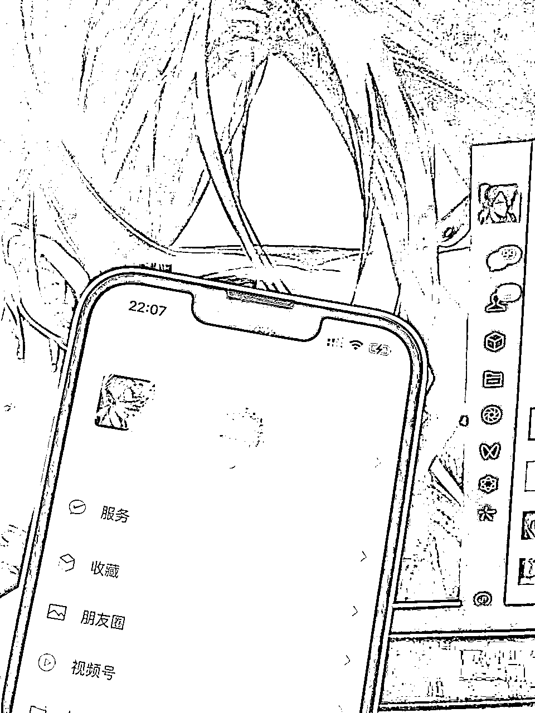

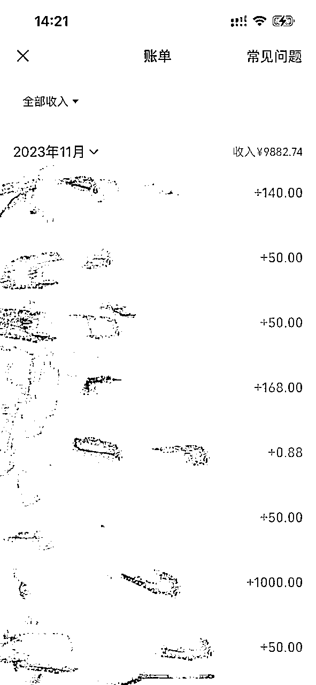

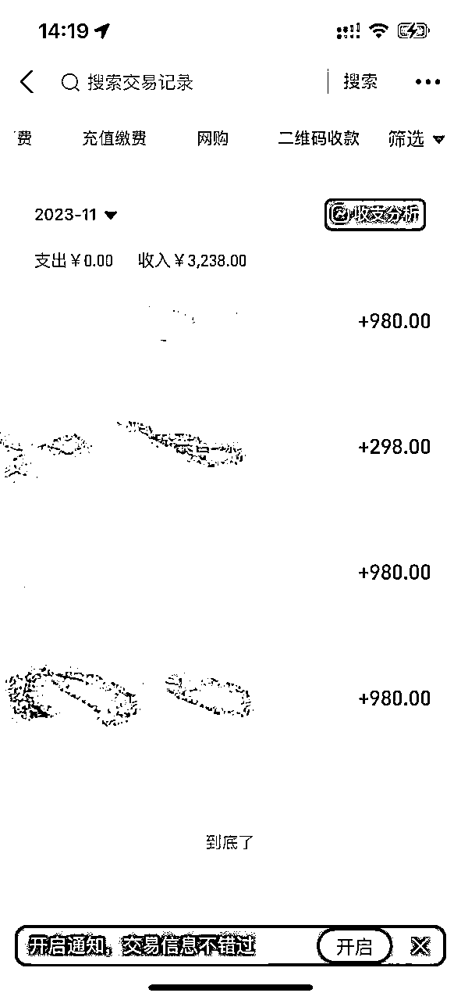

# 好了开始进入正题~

相信大家刷短视频的时候，都会在一些热门作品的下面看到截流的，这种操作起来很简单，效果非常好。

在作品的评论区引流，

1、想拉个圈子，共同努力

2、想拉个圈子，聊聊生活

3、加油年轻人（配收款记录或成绩图）

4、祝在座的各位得偿所愿（配收款记录或成绩图）

....

举一反三，大家发挥想象

为什么我会选择这么做呢，而不是 “拉个创业交流群”，“来人”，“每天只能搞个两三张”

因为后面这种很敏感，平台不欢迎，很容易被系统检测到，如果同行一举报，很容易完蛋，这也是我封了几个号总结出来的经验。

20-30岁的大部分人群面对生活压力是很迷茫的，这样子更容易让人放下戒备心来链接你。

可以试想一下，当你在很迷茫的时候，刚好刷到一个很有感触的视频，正好评论区又有人把大家号召到一起聊聊生活，这个时候你肯定会想着找联系方式。

其实这种类型的内容，也更能触及到许多人的内心，因为我的很多引流都是从人性角度出发。

我觉得把人性这两个字研究明白，引流会变得极其简单，他们想要什么我就给他什么，真诚就是最大的套路，而且我的好友大部分都是通过这个操作，一直都有流量进来还不被平台发现。

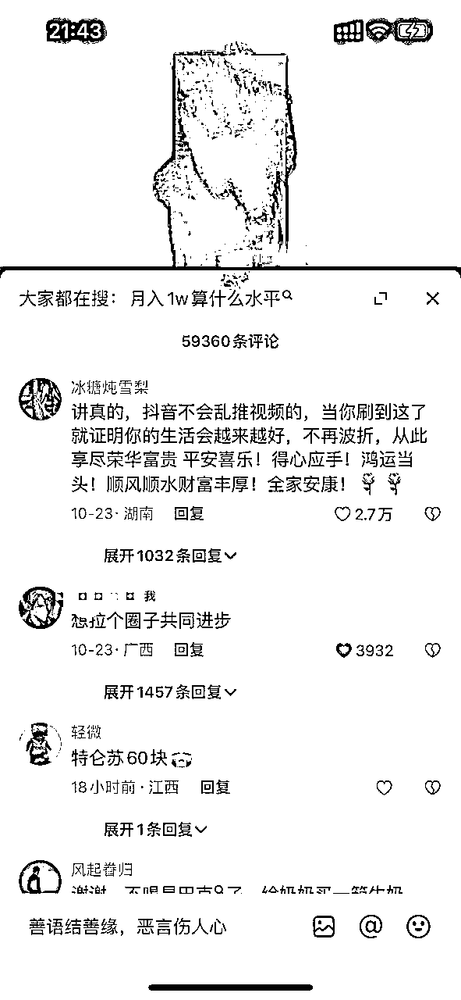

比如这个作品是讲穷人如何翻身的，评论区就有人在呼吁拉一个圈子，互动量非常大，几千条数据。

只要人群对了，哪怕前期只是闲聊，后期也可以针对标签属性接入后端产品。

比如创业+知识付费，后面项目培训这些都是刚需，稍微引导一下，转化其实很简单。

我通过这个操作也涨了不少粉丝，这张是我近期新增粉丝的画像，因为这个年龄段还是比较拥抱互联网的，很多业务也比较好展开，大家可以参照一下自己的业务类型。

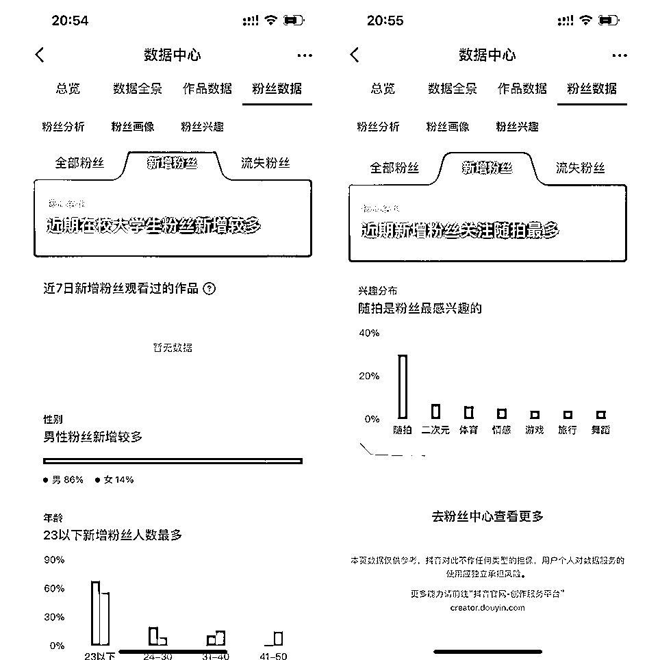

接下来是重点：

# 如何选择合适的账号？

首先一定要是老号，人设接地气点，让大家觉得你是个正常用户，如果直接用企业号，营销味会比较重，我这个号几乎条条评论都能嘎嘎来人，刚发没一会就有人点赞了。

如果是新号很容易被举报传销，而且新号也很难有流量，但是老号的权重比较高，也更容易火，平时多刷点这种鸡汤类型的视频，偏向属性，增加账号的权重，对评论能不能火有好处。

我原来测试的几个账号，现在复盘下来多半也是这个原因，第一：账号活跃度不够，第二：账号属性不太贴近

# 怎么设置个人资料？

关于个人资料可以参照我这么配置，私信习惯用谐音，再链接一个小号直接挂个人微信，再配置个粉丝群，方便后面直接发卡片引流到微信，我现在每天都会有10-30个流量会通过搜索账号进来。

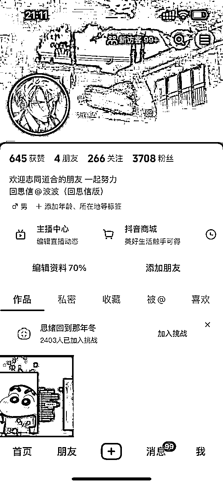

# 如何找到相关的视频？

通过关键词搜索，创业、搞钱、赚钱、翻身、人性、认知等等；

也可以直接关注相关博主，男天门，张华这种鸡汤博主，多刷几次就会自动给你推送很多这种类型的视频，只要刷到相关类型的博主，都给他关注一下，方便后面的操作

可能有圈友会问，为什么我不直接找抖音热点宝呢

1）因为我原来也试过，比如类型是“商业”“商学院”“商业技能”，这种类型的，我发现评论区的人群对于赚钱的欲望没有鸡汤博主的评论区强烈，所以这也是我为什么选择这种方式的原因。

2）另外还有一个原因就是搜索出来的结果不太准确，没有刷多了系统自动推送的质量好，所以我就没有再用

# 评论的技巧

找那些点赞高的，发布时间越近越好，就代表视频上热门了，评论火的概率会大很多。评论的时候顺手再给自己点个赞，不要评论得太频繁，尽量隔10分钟评论一次，每天也不要多，容易被系统检测到。

顺手给自己点赞也是为了引导用户点赞，一般发这种评论，就会有人多人想联系你，纷纷在评论区回复，这个时候就达到我们的目的了。

因为大多平台评论区的机制都是看点赞和评论，而且抖音的流量也是最大的，这个操作就很容易突破系统的机制，就会不断把你推到前面。

还有就是这种类型的视频很容易戳中内心，所以互动数据都很不错，看评论区的人就会特别多，都想看看其他人的情况。

大家也可以矩阵来点赞评论，只要通过了基础的系统机制，比别人的数据多一些（这个可以看评论区点赞和评论最高的那几条评论判断），一般刚发布的视频，有5-10个点赞或评论，流量就很容易滚起来。

一般博主不会删除你这条评论，最关键的一点还是，你的神评会拉动视频的播放数据，对人家来说是好事。只要不太过分一般都不会理。

# 如何回复私信？

当有人私信你就可以利用卡片去做引流，我都是先回一个系统表情包（稳妥），每个人换一个表情，每10分钟回复2-3个人，回复时间间隔10秒以上。

躲避系统检测营销号，不要一下子发太多，信息会被系统吞掉，而且系统没有提示，对方看不到你发的内容，一般24小时就解封了，如果不确定有没有被系统检测到，可以发信息给小号，看能不能收得到。

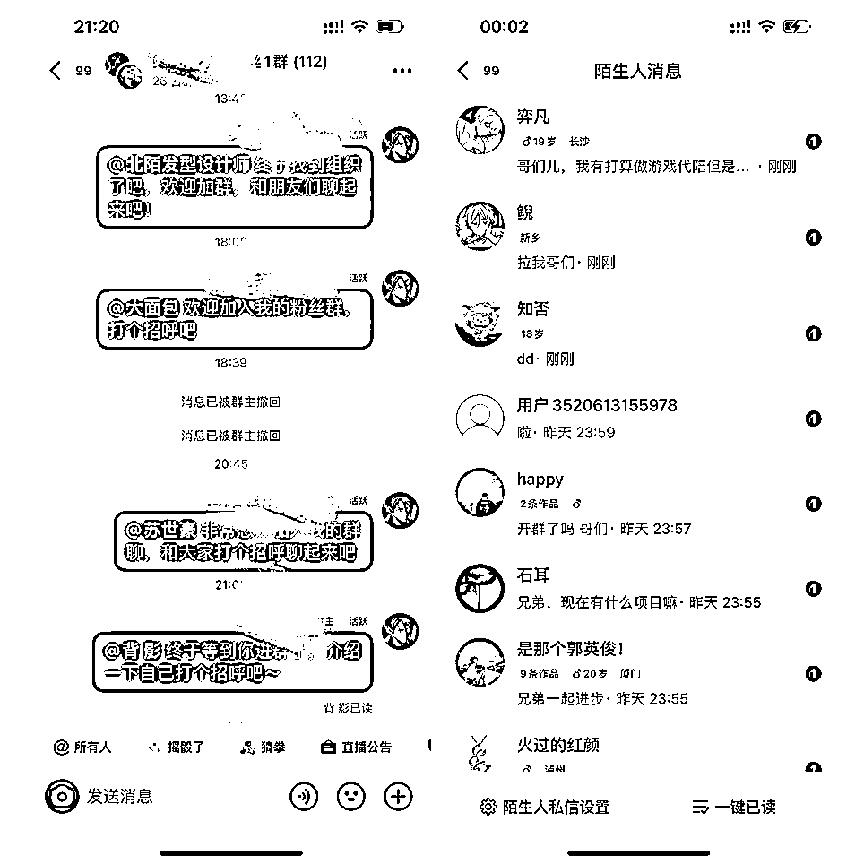

回信后才能转发卡片，然后开始正常操作，我一般每次间隔10秒以上转发一次卡片给对方。

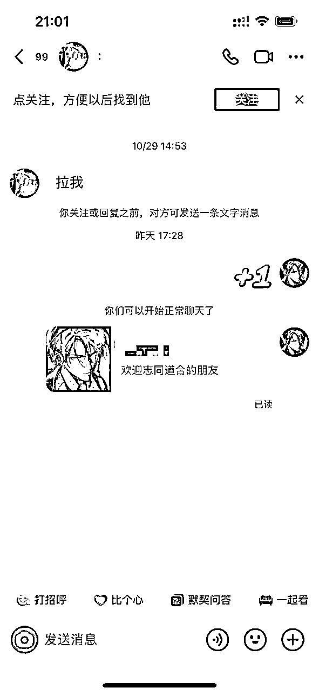

如果平时小爆的时候，可以手动回复评论，但是要注意频率，免得被博主发现举报，我一般“后台踢下我”，“踢一下我”，懂的人会来私信你，看不懂的话进来也没啥用。

等加上好友后，该干啥的干啥，最好附带一个交流群，人家要什么就给他什么，顺应人性

只要一个号养好了，真的可以为所欲为，而且不需要什么时间成本，最大的时间成本就是回私信的时候哈哈哈。

# 如何制作卡片呢？

现在市面上挺多的，天天外链、微客外链这种，我一般用微客，这个没啥说法，能用就行，因为是官方小程序，所以系统没办法检测到，如果跳第三方，外链官方会更新链接，到时候复制新链接出来就行了。

附带微客外链链接：https://weikelink.com/

### 1）新用户免费获得24小时内100次跳转，号多的圈友使劲搞

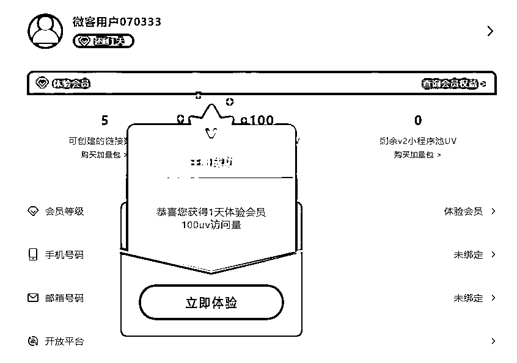

### 2）功能 → 选择跳入微信这项 → 个人微信号 → 立即创建

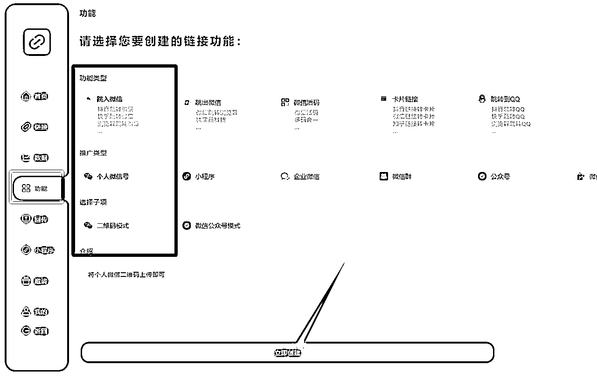

### 3）名称和介绍可以根据自己的需求来，上传二维码

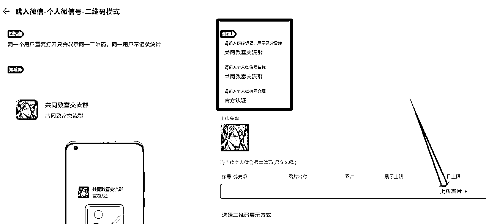

### 4）开启链接卡片配置，然后立即生成就可以了

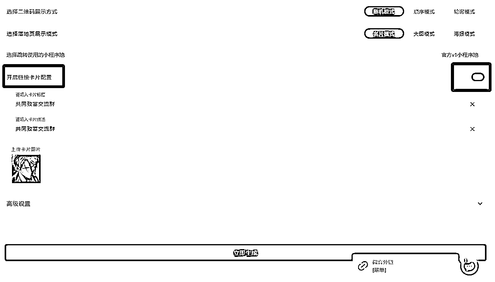

### 5）复制链接到抖音发给小号

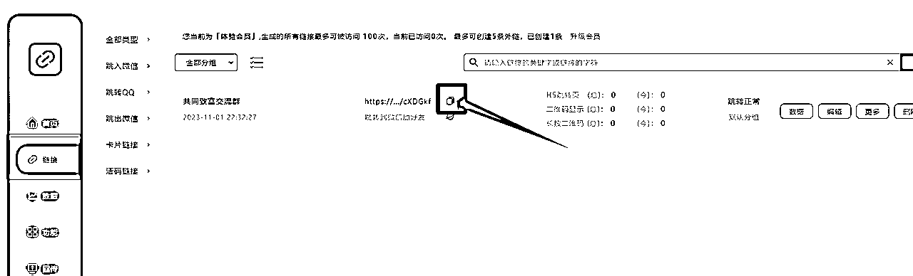

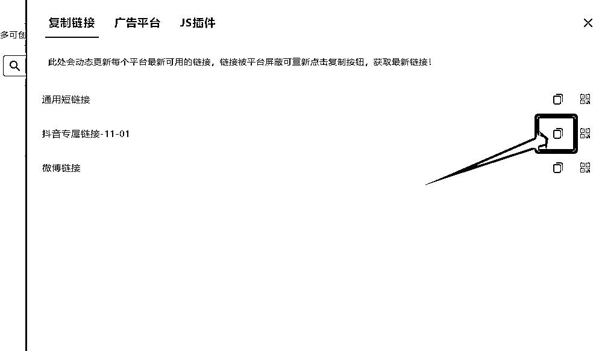

### 6）点进去链接，检查有没有跳转成功

然后返回抖音，点右上角再次分享给小号，就变成一个正常的卡片了

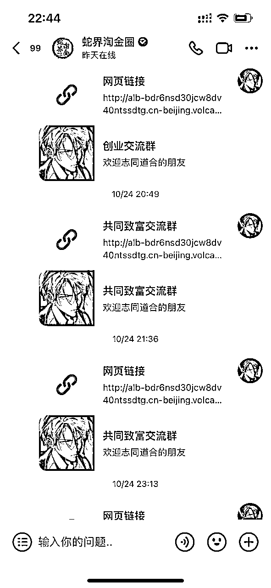

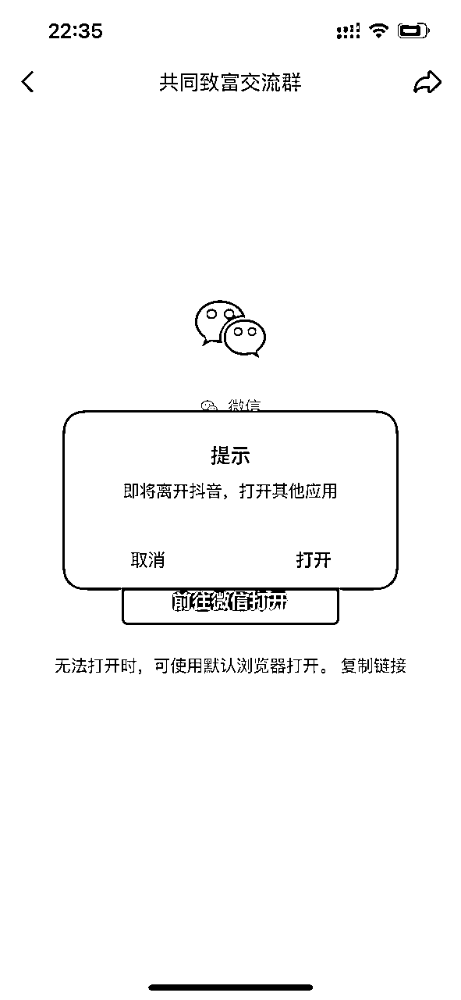

我的分享就到这里，希望能给正在此路之上的朋友一点启发，如果这些内容能为您带来实质性的帮助，那将是我的荣幸。

分享不仅是学习的过程，也是连接彼此的桥梁。让我们一起交流经验，互相学习，共同成长。

越分享越幸运。我是可乐，微信1282910861，欢迎大家多多链接我，祝愿大家在追求财富的路上，技艺精进，做大做强。