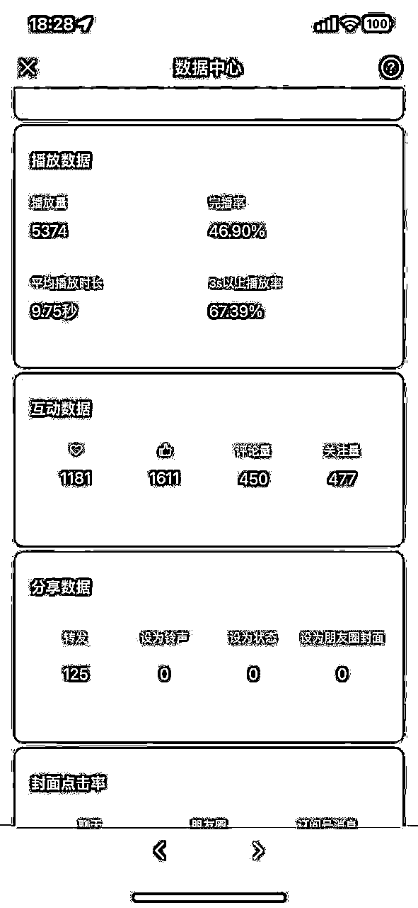

# 小白如何10分钟制作出一条破百粉视频🚀

> 来源：[https://htk589sgsw.feishu.cn/docx/N9uidQnNgoqfMaxizGFcnu0cnFg](https://htk589sgsw.feishu.cn/docx/N9uidQnNgoqfMaxizGFcnu0cnFg)

首先，我来抛出一个问题，大家觉得涨一百粉难吗？自己破百粉用了多久呢？

在这里给大家看一下第一个账号我破百粉的时刻。

准确来说是涨了快500粉，这也是我第一条涨粉视频。

单视频仅仅用了8个小时涨粉500。转粉率差不多在15个浏览出一个关注。很可怕的数据呀

大家想知道这条涨粉视频背后的逻辑和具体操作是什么？

# 现在开始我今天的正式分享：如何10分钟制作出破百粉视频🚀

今天我分享的这本“小白涨粉秘籍”中共有七招武功

1.  第一招 寻元素

1.  第二招 拆元素

1.  第三招 用AI

1.  第四招 导剪影

1.  第五招 调细节

1.  第六招 优内容

1.  第七招 选时间

* * *

# 第一招：寻素材

寻找当前在微信视频号上流行或受欢迎的视频

我们来看一下这几个爆款视频：数据都很不错，而且画面简单容易复制。

我们要找的就是这种简单粗暴的爆款视频。

### 为什么我们要找这种仅靠一张图片，数据就很好的视频呢？

这里回答一下大家：

实际我自己也没有想过，但是我有一个认知：

爆款肯定有爆的理由，咋们就不要想这些。直接拆解，不想为什么。先模仿再说。在模仿路上发现成功的关键。

* * *

# 第二招 拆元素

分析并提取视频中的关键元素，如文字、贴纸、主图等

我们看一下这种壁纸爆款视频的元素，实际上就是由四五个元素构成的：

1.  背景

1.  文字

1.  贴纸

1.  特效

1.  音乐

这两个视频也是一样，所以这种视频基本上都有由这五个元素构成。

我们做视频也是一样，拼接缝合这五个元素即可。

* * *

# 第三招 用AI

运用AI工具快速创建或优化图像

为什么用AI？怎么用？

两句话说明白：

*   为什用：因为AI工具可以提高制图效率，帮助快速生成高质量的视觉内容，而且可以直接开“原创”！

*   怎么用：我们用最简单的步骤和方法：剪映

这是我做的财神素材，一个出四个，直接进我的素材库。

（最近剪映这个功能免费，这种工具太多了不要限制，我只是觉得剪映方便）

* * *

# 第四招 导剪影

使用剪映等视频编辑软件进行视频制作

剪映等工具提供了丰富的编辑功能，帮助制作更加专业和吸引人的视频，主要原因是剪映是目前最简单最容易操作的视频编辑软件了。

### 还有一个最主要的原因：我们要的视频元素，里面都有！

* * *

# 第五招 调细节

细化视频的视觉和听觉元素，如比例、时长、音乐等

首先我们先导入刚才用AI生成的图片，并且将将画面比例调整为9:16，其次把导入的元素先进行抠图，把图片的背景取掉，然后设置纯色背景，增加其他元素进行拼接缝合。

这招还有需要注意的地方：

1.调节元素的时长为8s-15s；

2.贴纸可以增加一下动画，让画面更生动；

3.元素图层的设置，主素材务必位于首层。

* * *

# 第六招 优内容

优化封面和发布文案

这一招也是制作爆款视频的核心，一个好的封面和文案是吸引观众点击的第一印象。

*   封面就选用视频最好看的一帧即可。

*   发布文案就用吸引人的“迎接财神”、“祝你财源滚滚”这类祝福话语，其次可以增加“#+主题”等操作。

*   根据对标增加合适的标签并调整时间长度，添加符合视频的音频音乐直接把对标视频的或者音乐摘录来，添加文本如“迎接财神”、“财源滚滚”、“身体健康”等。

* * *

# 第七招 选时间

根据数据分析确定最佳发布视频的时间

测试不同时间发布视频，分析哪些时段流量最高，根据数据选择发布时间。

我测试了一下这种视频的发布时间节点，发现这四个时间比较容易推流量：

8:00、13:00、18:00、20:00

* * *

实际这些爆款视频就是祝福视频的升级版，万变不离其宗。

以上就是我本次分享的“武功秘籍”，希望大家不断参与、不断讨论、不断进步、不断赚钱！

制作微信视频号破百粉视频并非难事。

遵循这些步骤，快速制作高质量内容，吸引更多粉丝！🌈

我是之势，挑战自己，突破自己，一起成长。