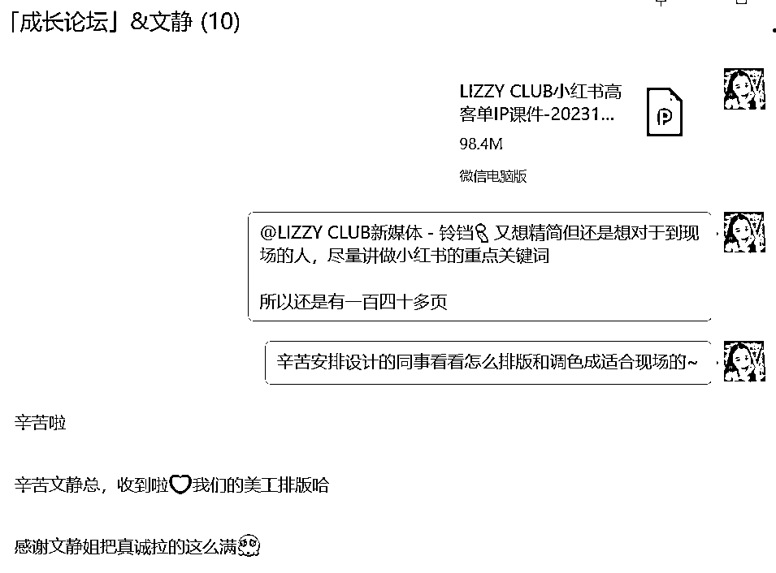

# 小红书流量技能，帮我跑通从个人到超级个体，给30家+企业做线下培训内训游学

> 来源：[https://gifi56ymyi6.feishu.cn/docx/NH7Jd7Udao5wF4xepkxc7t9andh](https://gifi56ymyi6.feishu.cn/docx/NH7Jd7Udao5wF4xepkxc7t9andh)

你好呀，我是文静，目前有教个人做小红书IP，也可帮企业线下内训小红书，同时也跟多个行业企业合作流量技术入股

写这个帖子，很感谢@芷蓝分享了把线下培训内训的游学玩法给我。让我终于有时间有契机沉淀下我跟企业合作线下培训内训的一些玩法。希望给更多个人IP和超级个体，变现上跟企业B端合作的玩法启发

# 一、在哪里可以找到企业B端，做小红书/IP的培训内训和合作呢？

其实我觉得这一点是最简单的：关键是去找，从以下几点

## 1、主动出击，跟身边更厉害的朋友，朋友的朋友，身边的资源，去介绍自己有这么一个业务。如果对方身边有，可以帮忙转介绍名片就ok

其他洽谈沟通合作，都是自己搞定。成交合作成功，会给回对应的分销费给介绍方

## 2、在朋友圈发出这一类信息：你要做这件事

而且你要固定周期地发你找合作、聊合作、有合作、合作数据……持续地发，让人知道和记得你有持续做这件事

## 3、自己做小红书号，在小红书上发出一些：企业内训、企业代运营、企业合作的笔记

## 4、招聘网站应聘

像是什么boss直聘。我有学员私教甚至是去应聘当地的全职工作，被她说服地线上兼职形式来跟企业合作

对于她来说不用每天上班，对于企业来说，也是降低了成本且拿到了想要的结果

## 5、加入一个做企业内训、企业代运营的同行团队

看看同行是怎么做起一个号的，同时也是积累自己的案例

不过据我自己所知，一般都是要你自己有第一个起号的经验，才更有可能试稿应聘成功

就好像11月其中一个内训的美妆护肤企业，我就是第1种方式：身边的资源，转介绍而来的~对方企业主就是咱们没真实线下见过面，转化成交更容易

介绍方只需要把企业主的名片提供给我，剩下的需求洽谈沟通报价合作，都是由我全部负责。成交合作成功，会给回对应的分销费给她介绍方

# 二、企业意向来了，怎么筛选企业来合作呢？有什么合作方式呢？

这个也是很多次被问到的问题。我认为人的时间精力和选择都不尽相同，可能真不一样的，所以这里套用我的例子和走过的路，欢迎一起交流和补充

## 1、首先看看企业是不是自己做过的/想延伸做的行业赛道？

一开始做企业合作培训时，我会优先选择我已经做过的行业：（比如教育、健康养生、家居家装、美容美业、珠宝等行业，排名不分先后）

也会筛选一些有跟我报名学习的个人学员的行业赛道（比如汽车美容、婚嫁、情感咨询、文旅研学、时尚等，排名不分先后）

但有一些行业我是一定不会接的：医美、玄学、理财保险等。这些行业无论跑自然流和投放都受限很大

当然大家还可以考虑这个赛道竞争度是红海还是蓝海？流量成交的周期？私域可否重复回购的更高变现天花板？

## 2、最好结合看看看企业主IP对于小红书的目的、和期望心理

至今还有很多企业实体店是没有开始做小红书的。当然这肯定是一个很大的变现市场。但也一定会存在一些老板主理人会对这个期待很高

我也合作过很多【自己一点力都不出一点素材都没有，全要我们团队去从0去网上搬运内容】，这种一上来就想躺赚的，我都会宁愿退钱，不然自己会越做越累

对方老板其实内心也并不十分认可小红书的流量力，比较容易陷于团队内耗

所以我这里说的看企业做小红书做IP的目的和心理是，对方不要一开始期待值太高，也不要想着自己什么都不配合不做

当然也不要想着说一上来就可以什么长期合作合作利润分销的。饼画得太大，很容易就让你先白干，等赚钱了再分利…

## 3、企业合作方式：

### a、【企业线下培训内训】

一般企业上来找我聊合作，会有2个引流低客单品帮我分流了。至少保证我不会被白嫖

①、个人培训课程私教：线上小红书年度会员498元，小红书年度私教陪跑9999元，终身合伙人16999元/终身

②、企业线下线上内训：按天来收费。一般集中1天-2天内在线下收费。报价收费金额可以按当地一个全职培训师的大概工资水平来收

等内训完1天，如果企业还需要线上社群或者社群陪跑，我又可以把前面的个人培训的课程和服务，复用到这里来

而总有一些企业下的新媒体团队、加盟商代理商，听了课后去发笔记，总会跑出一些爆款数据来

那你在指导他们发笔记时，其实可以看到对方真正的素材力，产品转化成交力，和对方企业主的一些团队观念价值观等

企业也会更看到你的实力，和你带来的新变化新数据新溢价

如果一切都ok，你再提出，以后我们可以长期合作流量利润合作

### b、【合作流量后端+培训内训费】

①你自带团队，或者大家一起共同出人员成本，请小红书员工，共同帮企业做号引流

引来的新流量，全部按一定比例分佣给你。比如按几十几百元/新好友计费给你，比如按微信上的每月收款流水，分比例给你（一般是5%-30%）

这个跟每个行业和企业老板谈判情况，真不同

相当于你真正把行业项目和知识培训，结合在一起

你是对方的小红书运营负责人总监，你只需要主负责流量端。企业负责自己擅长的产品供应链端和成交端即可

至于怎么衡量这个合作收入是否ok？

你就比较知识课程收入，vs企业最后分到你手合作收入有多少，那就很明显的答案了

②帮助企业搭建商学院体系

这个也是我的一大收入来源。每一年固定给企业新加入的加盟商代理商线上培训线下培训，或者给老代理复训等等

培训本身就是复用我已有的个人培训产品。所以交付压力不会太大

而相当于企业成为了我的一个课程分销渠道商，他帮我卖课或者我的课程成为他培训体系里的一环，那其实也是同时给企业赋能和增加收入

### c、【代运营服务费/按条收费】

最后一个，就是代运营服务费，或者按条收费了

为什么我把它放在最后才讲呢？因为代运营很难做，很难持续。但如果你想跑出案例跑出更多深度合作，代运营是一个跳板

那代运营服务费，一般是几千-几万不等，可以按月收费按季度收费，还可以按条收费

举个文静去年的代运营收费是：150条图文笔记，3.7万左右。1-2个月内发完

那一般这个时候企业会问保不保数据，比如引流数量？涨粉数量？曝光数量等等

这个也是按照你自己的情况来了

文静之前做的代运营，都不保数据，我会用我以前跑的案例数据来作为参考，其他的企业主自己来衡量了

但哪怕他不找我代运营，其实他自己要搭团队做小红书，给的员工工资成本也差不多是这个价格了

那为什么不保数据呢？是因为有一些风险你是没办法预测到的，比如说好的企业提供的原始素材力其实并没有，平台突然改变的规则等等

不要把这些风险都让自己来承受

也有一些学员合伙人，是采取前期不收费，等做到有数据才跟企业IP收费，这个看你的接受程度了

总的来说，超级个体，跟企业合作方式，可以单做，也可以结合来做：

【代运营服务费/按条收费】、【企业内训培训】、【人员成本收费+流量后端】、【培训内训费+流量后端】、【代运营合作+流量后端】

# 三、如何跟企业进行合作前聊天对接，意向洽谈，成交后的交付呢？

## 1.一般企业主理人负责人，找到我时，我一般都是直接微信上直接发文字介绍资料

首先展示一些两三张以前我去过企业内训的现场照片（最好遮住品牌logo，企业也授权可公开）

先问清楚客户的需求，已有固定的话术：

## 2.一定要问清楚这些信息，这样你才好判断是否能满足培训需求和培训报价

再发我的企业内训海报：有通用性的小红书IP课程、也可以接受定制专属行业的小红书需求（比如单号起号、矩阵号布局、付费投流、团队搭建等等）

这个时候客户会大概表示出是否ok，甚至追问报价

报价我是一口价，不会来回讲价，毕竟时间真的很重要

## 3.列清楚了线下内训一天的培训费用、差旅费谁付？

我负责的范围（这里特别备注说明：负责一天的讲课内容、ppt定制、答疑等等。但不负责培训招生。最好讲清楚这一点，免得后续扯皮）

也列清楚未来如果需要我线上解答和培训，可以继续购买我线上的培训陪跑。这样企业客户就知道原来你可以线下培训，也可以线上培训

更重要的是，要让他知道，单买了线下一天培训，不代表以后线上我就要一直免费解答，那是另外的价格哈哈

在这之前，企业客户说要跟我语音沟通啥的，我一般都会拒绝

因为做久了培训合作，前置这些需求，真的可以用线上文字方式就先聊成一定的共识，不用特意花时间去跟一个没有明确合作意愿的客户聊电话

这时，客户一般会反馈说要一天培训，还是半天还是两天培训。可以按照天数时间，来扣除乘倍报价就ok

这样你大概就能判断客户是否真的有付费意愿和预算了。我一般是在这一步后（就是客户大概说了以上需求和价格ok后），我才会愿意说线上打电话沟通

而且沟通都尽量在15分钟-30分钟内聊完。因为企业客户，也会趁聊电话看看你讲话的一些音色逻辑等等，毕竟要线下培训演讲

千万不要聊很长时间。。不然其实聊多了也没用，也浪费宝贵的时间

有可能对方也在各方比较价格。所以一天钱没到位，千万不要全all in

我也会在电话里说清楚，合作前，需要先付50%-70%的预付款。我才会提供第一版ppt稿件，和后续可以根据需求再修改第二版。剩下的余款当天马上结清

也有个很要好的朋友介绍了她的企业给我。我当时也不好意思要预付款。就先安排做了PPT，提供过去

结果，后来说对方的项目先暂缓……但我特意花时间做的PPT，也不知道对方是否私下用了，就换了一句不好意思

所以呀，真的要在商言商。不然很容易伤自己

## 4.一般客户打了预付款后，我一般3天内就可以提供行业专属的ppt原稿，给对方线上确认

大多数合作方都不需要怎么改，也曾遇到过一个合作方提了10个点来修改，只要都在小红书范围里，那就都可以答应修改

其实遇到有更高要求的企业客户，也是在完善自己的小红书培训和专业和课件。（对，我通常都是这么安慰说服自己的哈哈）

## 5.那确定完之后，就是去现场线下内训啦！

一般提早半个小时到达现场，最好提前跟现场负责人再确认一下演讲的重点，和注意点。这样可能在现场培训时，会更顺畅。也会有一些外地的企业客户，要求你提早半天到。

以上，希望对在做IP和超级个体的你，有了更多变现方式的启发和玩法

我是文静，愿我们一起生财有术！