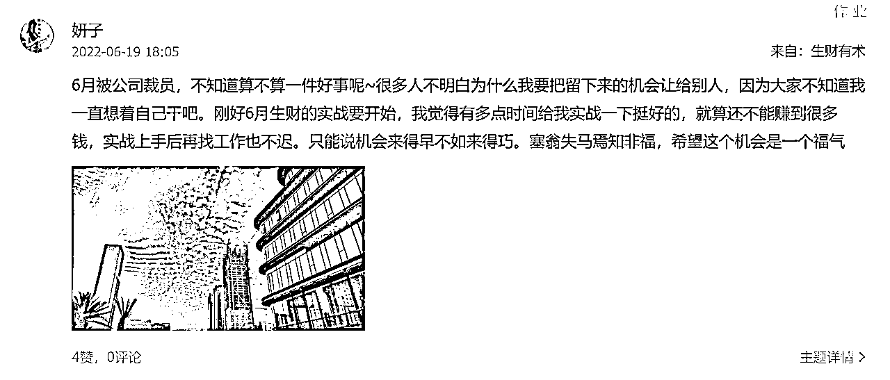
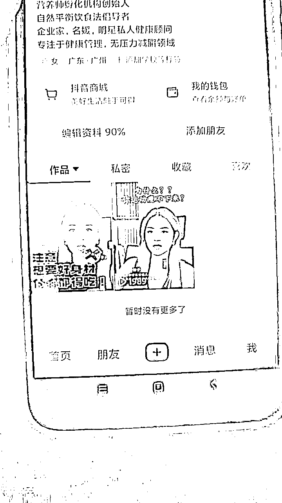

# 一年时间完成蜕变 996大厂女性从零到一个月转化200w ——流量时代下的女性如何沉淀崛起

> 来源：[https://ye9tqux6d9.feishu.cn/docx/NODZdwhjeoHzcWxunMzc4z3RnSd](https://ye9tqux6d9.feishu.cn/docx/NODZdwhjeoHzcWxunMzc4z3RnSd)

感谢生财，一路陪伴。

hello，大家好，我是妍子。

主攻个人IP搭建+内容输出+私域转化闭环体系。

一年半时间因生财而蜕变，从一名996大厂员工到现在的社群主理人。

在大健康行业运营两个500人社群，一个月时间转化220万，转化率36%。

现在这个社会节奏太浮躁了，很多人在当下是极度迷茫的。今天我想结合我自己这一路的蜕变，来和大家聊一聊在这个浮躁的时代下该怎么找到对的方向，沉淀下属于自己的核心，在这条路上走出自己的路，一路崛起。

很多圈友应该对我很陌生，因为我在刚加入生财的时候还只是一个刚刚打开新世界大门的小白，和现在大多数的圈友都都一样。就是在加入生财的这两年时间里，我从一个很普通的每天996的女孩子，走到今天沉淀下了我自己的核心内容，也拿到了很不错的结果。两年前的曾想过很多种自己的未来，但从没有想过原来我也能像电影里一样。在这里我想和刚踏上这条路的圈友们说一句话：其实迷茫和焦虑是正常的，失败也是正常的，在最初的时候我也曾迷茫也曾焦虑，在我这一路上也经历过很多次失败，而且我的基础和资本是远远不如绝大多数圈友的，但到现在我依旧拿到了结果。所以大家不要迷茫，我们沉下心来做好当下的每一件事，只要用心去做，一切皆有可能。

我将把我这一路的经验、认知以及踩过的坑毫无保留地分享给大家，希望能给大家带来一些启发。一切的起点源于生财，所以希望能在生财贡献一点自己的价值。也希望还在探索的圈友能走出自己的路，拿到自己想拿到的结果。

文章篇幅可能会很长，建议大家找个安静没人打扰的地方，静下心地读一读，认真感受一下我是如何跑出来的，很多和我一样的圈友或许可以在其中得到启发，找到属于自己的方向。很希望我的能够可以帮助到大家。

# 一、踏上创业之路前的经历

先和大家聊一聊我在踏上这条路之前是什么样子的。为什么要写这一点呢，我只想让告诉大家，告诉每一个和我一样的普通人：一切皆有可能。即便你现在一无所有，只要你想做，只要你肯做，你就一定有机会。

## （1）普通人身份下的日常状态

创业之前我是某厂的数据分析师。虽然说工资也不错，但生活像是一眼能望到头。离职前我也快三十了，身边越来越多朋友结了婚生了娃，看他们拿着有限的工资，天天计算车贷房贷，盘算着孩子的未来。用有限的工资给孩子尽可能好的物质和教育，给自己花钱只能抠抠搜搜。

三十之后还要面对更现实的35岁。35岁在互联网公司就像是有罪一样，不是不受待见，是连递交简历的机会都没有。找工作说好听一点是双向选择，过了35之后只剩下单项选择，无论你曾经履历怎么样，你都是被挑选的那一个。除了稳定的收入，这个班真的上得很没意思，而且没有一点希望。

## （2）生财是普通人的转机

在遇到生财之前，我能想到的职业生涯方向就是尽量往更大的公司跳，往管理层的方向走。但这个又谈何容易呢？每家公司都在裁员，业务没有增长就不会有太多晋升的机会。通过跳槽晋升，只能找一些年轻一点的公司团队，但这些公司抗风险能力不强，项目做不下去随时会被砍。每天上班都在盘算什么时候辞职跳槽比较好。哈哈哈哈哈，不知道有没有同款打工人~也想过找点副业做，但没有方向。那时候对副业的认知大概就是停留在小红书的穿搭博主，探店这些路子上。

有一天，无意间在公众号刷到了一篇生财的文章，那时候很惊叹居然会有这么详细的“搞钱步骤”！生财真的是在灰蒙蒙的云层里透出的一道光！那一刻，命运的齿轮开始转动。被我埋在心底的那一条路——创业，被我重新挖出来了。报了名之后，每一天通勤的路上，吃完午饭的碎片时间，还有下班回家之后，我都会刷生财的文章。一个又一个超出我认知的项目、案例以及经验，让我的认知快速更新，重组。想要看的文章实在太多了，时间根本不够用啊！

原来钱是“很好赚的”，赚钱这件事其实没这么难。这么说也不是创业/做项目就很容易成功。而是比起996的工作时间，用同样的时间去琢磨做项目赚钱，能收获到的财富，其实性价比更高，天花板也更高。如果你能提前做好风险管理，设好止损点，打工以外的世界不是充满危险，而是处处充满了生机、充满了机会。

有些我特别感兴趣的精华贴，我会找个完整的时间用电脑看，一边看一边整理思维导图。同时也会搜一些行业相关的报告看一下宏观的市场，或者了解下相关产业/公司的新闻，对比一下商业模式。这算是我的“职业病”，因为我是个数据分析师嘛~在遇见生财之前，我了解一个行业，基本都是看宏观的报告。现在多了一个微观的，具体的视角来理解一个项目，在宏观和微观两种视角来回切换去思考问题，这种体验真的很有趣。

在做数据分析师的那段时间，我有个很深刻的体会 —— 所有的数据只是表象，影响数据背后最大的因素是——人性。在大量阅读生财的文章之后，我更加坚定了这样的想法：以人为本、抓住人群，有人的地方才有钱赚。理解你的受众、读懂他们的痛点需求以及关注点，给予他们痛点解决方案，给与足够的情绪价值，让他们对你产生足够信任。赚钱，就只是一件顺理成章的事了。

## （3）义无反顾踏上创业道路的转折点

在这样不断摸索不断前行的时间里，迎来了一个转折点——裁员。

在那个还要戴着口罩的时期，我们迎来了当年最大的一次裁员。其实我的主管是很想要把我留下来的，但是当时我很果断地做出了一个决定，一个令我现在还会感到庆幸的决定——主动离职。(赔偿还是有滴~~不亏不亏)我觉得，我该要自己去闯一闯了。其实很多人都会觉得我的决定是很大胆的，以至于有些前同事会说我就是她们心目中的大女主人设。毕竟按照正常人的逻辑就应该是：先有着稳定的主业，用以保证着日常生活开销，然后副业做起来之后再裸持。但我想泼个冷水，求稳的路大概率是行不通的。

首先，有一份稳定的收入，当加班和副业项目的时间冲突时，你只能选择加班。在相对安全的环境下，你有的是退路，项目这一边一旦出现了什么阻碍，放弃的成本也不是很高。

其次，每天工作至少八，九个小时是跑不掉的，加班也是常态。就算不用加班，工作一天几乎耗尽大多数精力了，回家再做项目其实效率不高，甚至可能因为太累而坚持不下去。那么就始终没办法实操，或者实操的时间极低。所有的东西都是纸上谈兵，没有太多数据反馈，很难完成原始的“经验积累”和“资金积累”，只能日复一日地挣扎在上班和副业之中，然后就会产生负面情绪，想要中途放弃。时间久了下来两边都做不好，就慢慢陷入到了一个负循环里面：上班占用时间→没时间做项目→积累不了经验→没经验做不好项目赚不到钱→只能上班→上班占用时间....

因为我很清楚的知道，人的时间和精力都是有限的。至少我很了解我自己：同一时间我只能做好一件事。所以我选择了机会更大、我更想做的一件事。看了那么多的精华帖之后，徘徊在脑子里的一个想法就是 : 纸上得来终觉浅，绝知此事要躬行。我要开始实践了，把一件事情给落地下来，这是一切的开端。所以我很清晰的知道，在我当时那个什么资源都没有，什么都要自己从0开始的情况下，既要又要，显然是不现实的。

我唯一只有一条路就是：主动跳出自己的小井口，找到自己的路径，并且全身心投入进去做。

所以，就是在这样的环境下，我毅然决然的主动离职，开启了我的蜕变之路。当然，就事实而言，我的这个举动还是很冒险的，圈友们梭哈需谨慎哈！能够支撑我这样果断的原因就只有一点：我很清晰的知道我想要什么，我也知道我一定会不顾一切的好好做。

# 二、第一次创业的惋惜

在创业这一路上，我做过很多的项目。虽然走了很多弯路，但因为我对每一件事很认真，不论项目是成还是败，我都会花很多时间复盘，在这个项目周期内我持续积累下来的能力和技能，为我后面能够在社群中拿到如此成绩做好了铺垫。

在这里面我会展示我所有的经历，给大家诠释清楚，作为一个普通人，该怎么去把握住每一丝机会，怎么能够拿到结果。

我也经历过失败，但是失败其实不可怕，在这里面我想让大家看到的是：认真对待每一件事，拿出200%的努力。只有你真正的去认真对待，认真钻研，认真去做，那即便做了几次没有拿到结果，你依旧可以积累下来属于你自己的核心本领，积累越多，脚步越快，离终点的距离也就越近。

在这里给大家讲一讲我这一路上做过的比较典型的项目，以及经历过的失败和拿到的小结果。这里给圈友们两点引导：

1.  以下的经历，就是影响着我我最终能找到属于我自己的方向并且能拿到结果的经历。在这里我想让圈友看一看，同样的几次普普通通的失败与小的结果，但是我为什么能够一步步的往前走，为什么能走到现在最适合我的方向上。希望圈友们可以借鉴我的经历与方法看看我是怎么不断地调整、优化、改进，从而正确的地调整自己的方向，真正的走到最适合自己的路上并拿到结果。

1.  在这条路上，我也一样经历过失败，也一样拿到过小的结果，我想告诉圈友们：我觉得经历失败不可怕，可怕的是有一点小挫折就垂头丧气自怨自艾；而拿到了小的结果是可喜的，但也绝不能“飘起来”了，要明白能拿到结果的核心原因，而脚步也一样不能停。创业在这条路上，没有老板安排任务给你，你一切的决定都是为了自己，你也要为一切选择负责。如果连赚钱连创业都需要别人逼着你，那这条路肯定是走不通的。我这一路走来信奉的一句话就是：小步快跑、随时优化、快速迭代、不断前行。我们不要因为失败就止步不前，而是要通过失败来不断地调整不断优化，通过失败来找到正确的路线。

## （1）选择方向

在大厂做数据分析师的日子里，我一直在关注一个行业：大健康行业。

这个行业完美符合了几个点：低粉爆款、小众高利润、用户黏度高。

离职后，我就一门心思扎进来想做大健康行业。因为自己很喜欢跳舞，业余跳舞我也跳了二十年左右的时间了，所以我知道女孩子对于身材的焦虑很严重，包括我自己也是这样。

几乎所有的女性，都存在着身材焦虑，在我的舞蹈室里练舞的姐妹，就有一半以上都不是因为喜欢跳舞，而是因为想改变身材，或是练练舞运动一下改善身体的健康状态。个人的健康管理、营养餐以及减脂餐整个行业是良莠不齐的。在我的准备阶段里，我查了很多行业报告，做了大量的数据分析，我发现在这个市场上存在极大的需求差，很多需求还有空缺的市场空间。

接下来我刷了很多视频，分析了各种细分赛道的博主，分析她们的每一条内容和数据，扒下文案逐字逐句地去分析其逻辑（这个阶段我还是实打实地用手机刷，没怎么借助采集工具）。

## （2）启动前的准备

确定好了赛道，当下就存在一个问题：在大健康和营养管理上，我还是个小白。我知道这个东西需求很大，但是很多事情急不得。因为我不是想收一笔钱就跑，我想做一件长期事情，我也想找到忠实追随我的用户。所以我必须得做IP，而不是混剪的短视频带货，或者小红书图文。

这个项目我需要重点提升的，就是一开始提到的“对于自己行业内的深度认知”。虽然当时没有清晰的概念，我脑海里大概能确定我需要深度研究跟打磨的方向就是：1\. 在抖音上的内容与呈现。2\. 营养师相关的专业知识。这两者，缺一不可。

然后我就报名去学习了，我是个付费意愿超高的“小韭菜”！哈哈哈哈！！营养师和短视频的班几乎是同时报的，所以那段时间学习压力还蛮大的。平常我是个社恐，但在学习这件事上我还挺主动的。虽然同时学不同的课程（我还有找免费的课程补充学习），但无论在哪个班里，我都挺积极主动的，所以导师还挺关照我的，不时还会拿我当案例夸一夸。

你要说我比别人聪明嘛，那也不见得。我唯一做的比较好的一件事就是：付出比别人多几倍的努力。因为我很清楚的知道我自己想要什么，一个人在目标很明确的时候脚步会很快的。尤其是练口播的时候，我基础其实真的挺差的，毕竟我是个社恐，平时能不说话就不说话。回答能讲一个“哦”字，就不会再多说一个字。但我还是练出来了，而且还比大多数人练得好。

大概因为我从小就练舞吧，比较能吃苦，所以我很明白一个道理：老师讲的再多、再好，你不去实践练习都没有用。台上一分钟，台下十年功。钱花掉了可能不会带来任何结果，但你花费的时间和努力，不会被白白浪费，最后它们都会以一种美好的形式成就更好的你。

## （3）开始启动

学了大半的课程之后，我觉得我好像能行，就直接启动了。启动其实特别简单，远没有大部分人想象的那么难。都说万事开头难，其实绝大多数难是难在“启动”这一步上了。比如拍口播或者直播这件事，很多人很容易被“出镜”挡在门外。这里我给大家一个建议：别想那么多，直接就开干！场景差一点没关系，说话还有点卡顿也没关系，觉得自己长得不好看？美颜开起来呀！反正一开始也没多少流量，只要后面持续调整优化就好了！

先来跟大家讲一讲，我在这一路上总结出来的收获。一些对于普通打工人，没有创业经验的人而言，很重要的东西。最开始因为缺少这些认知，不可避免的踩了很多很多的坑，也会不时地感慨，如果有人早点给我讲一讲这些东西就好了。

下面总结的都是我深刻的体会，圈友们可以去分析一下我的经历，看看我是怎么拿到结果。也可以从自己的角度出发，结合自身的现状，复盘一下自己经历过的失败与成功。如果大家能够彻底贯通下面这几点，那你的认知就已经超过了大多数人了。你的成功，只是时间问题。

一个好的圈子和氛围真的真的无比重要！！都说创业的人是孤独的，不被理解的。我经历过很多次的失败，到最后我能坚持走下去很重要的一点，就是因为有一群姐妹的支持。所以我时常感慨这一点，如果没有她们支持，我很可能会因为迷茫而放弃，回去当打工人去了。

圈子和氛围对普通人来说，是最难获得的。在我当初裸辞的时候，我身边几乎没有人理解我。“疫情找工作那么难，你为什么就不做了呢？”，“创业就是九死一生的事，你想清楚了没？”全部都是“我为你好”。但是对于我而言，这些为我好的言论，都是负面的情绪表达，反而成为了我的心理负担。

如果长期身处一个充满着质疑充满着负能量的圈子里，这种感觉是很难受的。会很影响我们做事的心态，甚至会让我们陷入到情绪内耗当中。但如果身边是一群和你一起进步，一起想着怎么解决问题，一起想着怎样能把事情做好的人，你感觉会怎么样，是不是听起来就会让你干劲满满？

每个个体都是茫茫人海的一粒尘埃，个体力量太小，一个人很难抵抗风吹雨打。我们可以在工作的时候雷厉风行，但也抵不住漫漫长夜一个人的EMO。过去这段时间，我很深刻地看清了自己，我只是不喜欢上班，而不是不喜欢团队合作。我们身处的圈子和其中的氛围真的太重要了！你这一条路走的是否顺利，很大程度取决于你身边的人是在拖着你走，还是陪你一起走，抑或是推着你走？如果你身边的人大多数时间都是干劲满满，对未来充满希望的，你也会不知不觉地被感染上积极的心态。

很多人不知道该怎么组建自己好氛围的圈子，我推荐一个最有效的办法：去吸引。把你自己正向的，专业的一面展示出去，吸引到同频的忠实追随者，他们对你的认可和欣赏会让你的能量满满的，脚步也会越来越快。

我能走到今天这一步离不开我的姐妹们。她们是我的第一批粉丝，我当时第一次做减脂训练营，虽然人不多，但我真的很感激她们对我的信任，在群里我也有问必答，大家都相处成好朋友了。所以在我的项目遭遇挫折，被封号之后，大家都会积极地安慰我。有时候见我久了没发视频，还会有姐姐“监督”我，在群里@我：妍宝，今儿视频发了吗？

完全独自一人做成项目的人很少很少！真心建议大家可以抱团取暖，在一个温暖又能互相激励的氛围下砥砺前行，走得更远，拿到更大的结果。

## （4）第一个小结果

发布以后，第一条视频的基础播放量就接近2k，破了500的基础流量池还是让我挺满意的。这就意味着我要去做深度的去优化，从选题，到文案以及视觉呈现上不断地优化自己的视频质感。我的做法就是继续多对标同行优质的视频，把他们的视频一点一点拆分开，从文案，口播表达，表情，手势，场景，还有音乐，特效都能学习一番。然后尽可能地把能力范围内能调整的地方都优化一下。

## （5）第一次创业中的第一个小失败

但是还没开心多久，很快就迎来了第一次失败：被举报。

当时看到的第一时间就好像给我泼了一盆凉水，一下子愣在原地，申诉竟然也无效。

当时也消极了几天时间，逐字分析我的内容，也找了短视频的导师来帮我分析原因，得到的答复都是：没有问题，应该就是被恶意举报了。

## （6）一鼓作气再次起航

当时也是很难受的，就好像满身的动力突然一下子就熄了火。但还好，我觉得可能是运气不好，碰到了那个恶意举报的，大不了我重新来过嘛，反正我也验证过了我的视频内容还是很好的。于是一鼓作气，直接开启第二个账号，一切重新来过。

这次发到第二条视频，还是好好的，不由得松了一口气，于是开始持续稳步更新视频，更了几条视频的流量都还是很稳定的

## （7）第一次创业的落幕

就在我准备突破一下冲一条爆款的时候，举报又来了...

在那个时候我就感觉到有一点不对了，我的都是个新号，一个新的IP，在我视频都没有爆的情况下，而且又没有任何的违规内容，甚至后面为了规避违规，完全绕开了大健康的内容，讲的都是普遍的日常生活，到底是谁在恶意举报呢?那个时候也开始不信邪，禁言就开新号，发视频没几天就违规禁言，禁言就开新号，发视频没多久就被举报禁言......

到这里为止，我终于知道这件事情没那么简单了，问了很多前辈，最后得知一点：在这个行业里很多头部都会有这样的一个部门，专门搞这样的小动作，来干扰其他同行，尤其是把新号都扼杀在摇篮里......至此，第一个项目以失败告终。

## （8）分析失败原因

### 1.只看到了市面上的同行少，却没有想到为什么少

做了数据分析，但是只分析了市场，没有分析资本，也没分析人性。万万没有想到在这个行业里竟然会被扼杀掉所有的苗头，就连一丁点的机会都不会给。也算是真正的见识到了一波“商场如战场”，这一次失败也令我消极了一小段时间，但是没过多久就调整好心态，重新出发，调整好所有的内容和形式，从头再来。

### 2.太过依靠数据，没有更全面的分析全盘

每条视频都只是单纯的盯着后台的创作者数据来看，太过执着于技术、执着于起号，陷入到了一个思维误区，一旦有什么问题第一时间都会觉得是自己的问题，直到把所有问题都挖出来无能为力了了才从这个误区跳出来。

### 3.不敬畏市场，毕竟是管控严格的高危行业

人设标签打的还是太高，毕竟带我做口播的老师也讲过这个问题。对于这一行业来讲，营养师资格证是不够的，需要有医生的证明甚至还需要挂靠到三甲医院或者专业国家机构的。而我却明目张胆的在签名上写着营养师机构。

### 4.节奏太快，忽视细节

推进的节奏太快了，没有一个能顾全大盘的操盘思维。只顾着往前快速推进，这种状态是很好的，会很有干劲，但是在这种状态下一定要保持理智。要时时刻刻分析，不然就会出现这样的情况——只能看到脚下的这一步，而忽视了很多决定成败的细节。

# 三、跟随航海，第二次创业的平稳期

在这一次的失败，算是给我敲响了警钟。也让我深刻地认识到，一定要时刻保持清醒，要时刻保持理智、顾全大局。而绝对不能陷入到如此“自嗨”的场景之中。

## （1）调整心态的能力

当时的负面情绪还是有的，因为毕竟付出了很多的心血和努力，甚至到了废寝忘食的程度。起步还挺顺利的，看到了希望，也就抱有很大的期望，刚想要一鼓作气，加速冲刺到爆发的这个关头，却迎来了当头一棒。

当时也难受了几天，但我还是很清醒的，我知道我想要的是什么。庆幸我有练舞，那个时候就强行逼着自己天天去舞室，用运动调整状态。每个人都会有情绪，有个可以释放情绪的途径真的很重要。

很多人在刚开始就很容易放弃，其实这是创业路上最忌讳的一件事。我们当像野草，野火烧不尽，春风吹又生。这是创业能拿到结果必备的核心素质。

我所见过的很容易中途放弃，或是产生负面情绪把自己困在原地的人，几乎都是因为这几点：

*   没有认识到自己到底想要什么

*   当下的生活比较满足

*   认为自己付出了很多，没拿到结果就会直接心态崩溃

*   意志不够坚定，一直摇摆不定，不够自信

尤其是第一点“没有认识到自己到底想要什么”是尤为重要的，很多人即使在刚开始干的时候会热火朝天，状态拉满，但是一旦有一丁点小挫折就立马开始迷茫，在这个时候不妨停下脚步，自己好好想一想，自己所做这一切，到底是为了什么。是现在的日子你过得不开心，还是不满足于当下的现状，还是想换一种活法，去看到更大的世界？

当你很清楚的知道自己想要什么的时候，你的脚步是不会轻易停下来的。此外，意志坚定，不在意付出，只为了成功那一刻，这是创业者必须要具备的基本素质。

## （2）重整旗鼓

那个时间段是在2022年9月，彼时生财有术刚好开通了小航海。经历过第一次的失败之后，我深知自己当下还差了许多，从严格意义上来讲的话，我当下也只能算是个刚入行的小白。

所以我决定从头开始，我需要补足的东西太多了，我很深刻的认识到当下对于我自己而言，我不能只是个打工的状态，而是要干出一番事业来要面面俱到把控全局的创业者。

在当时我报了“抖音半无人直播”的小航海，只抱着一个心态——有人陪着我大家一起去做这样的一件事，我想看看在这个状态下，有很多的人一起做，有问题会有人来帮你指出，会是什么样子。

## （3）收获与结果

跟随生财小航海的时间里，虽然没有拿到金钱上的结果（因为之前的账号被封了，光准备新账号就花了差不多一周），但我还是学到了很多东西。

学到的东西是我受用一生的：我看到了氛围与圈子对于一个人和一件事的重要性；我也通过话术明白了一个点——研究人性。在半无人直播里学到了很多的东西，对我来说，最重要的就这两点。这也是我在自己的这一条创业路上磨练出的最核心的两点技能：对于市场、对于人群的把握。

以人为本嘛，我们做生意永远都离不开人这个核心。只有有人在的地方才会有钱赚，所以明白了研究人心的重要性。接触直播之前，我觉得抖音直播很吵。跟了航海之后，发现原来这些看起来很low的直播间，也满是营销的设计，还有话术的满是针对人性的设计，我突然对做生意这件事充满了敬畏！不要轻易看不起你不理解的事情！

那段时间我扒了很多直播间的话术，研究不同品类，不同类型直播间的话术还有场景。以前看文章只觉得好厉害又好像很简单，但没有实践其实只是纸上谈兵。这一次能够深入的应用到实践之后，会明显感觉到文章里轻描淡写的语句背后，原来藏着说不尽的努力和细节。

此外，还有很多收获。比如直播基础知识，选品相关认知，自然流起号的各种骚操作等等。建议圈友们多参加航海，在小航海中认真的去做着一件事，你的收获会远不止这一个项目，只要你带着思考去实践，多分析复盘，你所获得的能力会为你下一次的成功助推。

# 四、持续深化，积累核心

时间到了2022年11月，又一次参与了小航海，这次除了半无人直播以外还加入了快团团的社群团购。也不是为了拿到什么大结果，在当时还是抱着学习的态度参与的，因为我感觉到自己对于私域转化环节一点都不了解。

走在这条路上就应该是这样子，缺什么就补什么，不能一直沉浸在自己的固定认知里。我们要有一个能拿得出手的核心技能，然后再做一个全能型选手。而我在这一个月的小航海里学习了私域运营以及卖货的方法，同时也深化了社群与朋友圈的运营。

值得开心的是，这次航海期间的直播到手有6000+的佣金。虽然还没我过去的工资高，但真的比发工资那天还开心~！！

## （1）汇聚一体，初步成型

到此为止，前前后后已经有了半年的时间了。就在这半年的时间内，我学习并且实践了过往两三年都积累不起来的技能：从前端的个人IP打造包装，到文案内容，到短视频的拍摄和口播细节，到直播，再到后端私域转化、社群运营以及朋友圈营销等各项个人IP的所有相关知识体系，这可不是理论，而是每一个环节全部经历实操而得来的”核心技术“，底层逻辑已经深深的烙印在我的脑海里。

大家有没有发现，这些东西结合起来就是一个“操盘手”的雏形呢！我自己也很惊讶！我居然在没有规划，在一个看似误打误撞的过程中，学到了跑通一整个链路的技能！经历了每一个环节的实操，又深刻的明白了抓住人群，把握市场这些核心要素以后，所有技能，认知汇聚一体，竟产生了一个化学反应：从“术”的层面，突然间到了一个“道”的层面。在最开始学习口播和IP的时候，老师就讲过这样一句话：这个东西其实就是等你突然开窍的那一天。因为你从来没有接触过这些东西，将再多也不是你自己的，就是要等到你自己突然“悟了”的那一刻，就是开窍了，就会一下子通透了，什么都明白了。而在你开窍之前，你需要做的事情，就是不断地积累，不断地摄取，另外，要去实践，去经历。当你脑子里的东西到了足够的量，也经历的足够多，就是你突然开窍的那一刻。而我那个时候，就是这种状态！一瞬间什么都通透了，也是在那一瞬间，真正的懂了什么是IP。毕竟，没有人比“操盘手”更懂IP，对吧？

到此为止，我如今的的核心能力——IP深化运用，初见雏形。

我在生财里见到很多圈友都有一个共同的现象：一直在原地踏步。相信很多朋友自己也能感受的到，也一直在寻找解决办法，就是不知道自己问题出在哪里。

其实问题很简单，原地踏步最核心的原因其实就是自己没有想通你到底想要什么。我问大家一句话：你走在这条路上想要拿到什么结果？想要拿到这个结果你当下的知识体系够不够？能力不够是不是该去学？我给大家分享我这一路上的经历，是因为我知道，我的经历当中，有很多地方大家是可以拿来借鉴对比的，大家不妨拿自己跌倒的地方和我对比一下，也许就有答案了。

终身学习这个概念其实每个人都知道，但是也仅限于知道而做不到。终身学习这个词还是太大了，很多人甚至都不知道该怎么学习，不知道学习是为了干什么的。在这里我给大家明确一个点，相信很多圈友到现在已经看出来了，那就是：深挖掘，广积累，把核心能力和专业技能有机地结合到自己身上。

## （2）积累叠加技能和认知

为什么很多人做了很多个项目，每个项目也都能赚到钱，但是就一直停留在做项目的阶段，很难再往前走一步？其实就是陷入了一个误区：太过关注项目，而忽略了关注自身。

很多人都是想着，我不就是为了赚钱的吗？赚钱本身没错，但是如果只关注钱的增量，人生未免显得太单薄了。如果大家想要拥有一番属于自己的事业，占领属于自己的一方领地，那么就一定要做到这样两个点：

*   明确自己想要什么（具体一点，别整虚的），想拿到什么结果，深入地去分析自己距离拿到这个结果还差什么

*   带有主观目的性的去做每一个项目，去学习每一个技能。把缺漏的每一个空洞补足。

重要的问题再问一遍：“你走在这条路上想要拿到什么结果？想要拿到这个结果你当下的知识体系够不够？”（请摘抄到小本本上！！认真回答！！）

每个人的理想与目标都可以很远大的，人生都还没跑过二分之一，还有的是机会！找个安静的地方，好好跟自己的内心来一场对话吧！问一下自己最渴望的是什么，要拿到这样的结果，你需要做点什么？你还缺什么？如果自己分析不出来，就去问，去请教，去找人帮你分析。当知道自己需要什么才能够达到这个目标之后，不要贪功冒进，稳扎稳打一步一步来，一定要有目的性的去学习、去实操。而不要盲目，不带思考地去做项目，做来做去到最后没有一丁点的积累。

就在这样的过程里，一点点去完善自己，挖掘并强化自己的核心能力。你会逐渐发现，自己好像越来越有信心了，你能做的事情越来越多，离自己的目标也越来越近。

# 五、再一次大胆的尝试——合伙制的失败

经历过了疫情政策开放的那一波爆发，见证了防疫品爆发的风口机会，即便是素人新号也能够实现一场直播带货几十万。我深刻的认识到了把握市场的重要性。如果能够把握住市场风向，能够抓紧机会，把执行力拉满！

在这个关头，我决定重新投入到自己的事业里，回到我最开始的初心当中来了。但现在的我和当初刚刚脱离职场的我完全是天差地别，在短短半年之内，完全蜕变了一番。我觉得，一个人的蜕变是取决于两点：思维与认知。这两点很重要，绝大多数的情况下，一个人的进步都是由思维与认知驱动的。思维认知到位之后，才会有意识并且主动地去挖掘并积攒强化我们的核心能力和专业技能，才能推动自己不断地往前走。从而实现一次又一次的蜕变、进阶。否则就只能原地踏步，做来做去还是老样子。

## （1）确定项目

22年年末在经历了“阳了个阳”以后，基本上所有人都开始关注起来自己的身体。在我第一次做营养师IP时，虽然我只发了几条视频就被举报下架，但我还是加了十几个姐姐。那段时间里，我的粉丝群里几乎所有人都关注起一个品类：保健品。因为一波小洋人过后，大家身体都进入到了一个极度虚弱的状态，包括我自己也是这样。所有人都开始关注起了自己的身体状况，关注起营养，想要补一补身体。

但我毕竟不是个擅长追风口的人，所以还是看了各种报告，做了数据分析，分析我们到底要选什么产品，毕竟保健品的赛道很大。我还“卧底”混进了各种同行的社群，通过若干个同行假假真真的“行业密报”，确定了整个行业的基础情况。保健品这一行业，市场发展趋势还是比较好的。

由于我的根基尚浅，也没有什么行业知名度，所以我打算从私域IP带货开始，循序渐进，做到一定的结果后和品牌合作，拿着品牌方的背书与支持，再重新做公域的IP。先做私域IP也是生财里前辈的思路，毕竟公域IP起号需要时间，私域IP可以通过提供情绪价值，而引导下单转化。至于流量，是跟护肤品直播间合作，从产品粉转化来的。

## （2）确定合伙人

为什么这一次要找合伙人？当初在学习做短视频的时候，我的老师讲过一句话：“创业你一定要找合伙人，为啥，到时候哭的时候还能有个人陪你一起哭。”哈哈！开个玩笑，主要是因为这一次的项目比之前大，我自己一个人处理不来所有的事，需要找个人来陪我一起做。刚好我的闺蜜，在封控政策开放后失业了。她本身是个很优秀的销售，当时觉得她来帮我做私域的转化实在是太好了！

## （3）项目框架落地

其实两个人精力也是很有限的，基于我和闺蜜各自的能力。我负责所有商品相关的安排，闺蜜负责私域相关的板块。在确定产品之前，我把私域营养师IP的定位，人设打造好，朋友圈打造的SOP交给了闺蜜，也阶段性地引了一点流量进来，让闺蜜维护客情的同时，试着去编写标准化话术。

把上面的东西准备好之后，我开始去跑供应商，打算先跟着各电商平台的爆品，筛选两三款卖点比较多产品回来。样品回来之后我还要负责拍照，参照小红书风格修图，写文案，最后把产品上架到快团团。（真的十八般武艺都用上了）

## （4）沟通：补齐最后一项核心能力

确定了厂家之后，我每天都往偏远的厂区跑。就在这个环节里面，我意外地补齐了自己从来没有在意过的核心能力——沟通。很多人会想：沟通不就是我们平时说话嘛？我曾经也这样想，但当我学会去掌控沟通中谈话的节奏之后，我发现其实打工人也用得上啊！面试的时候，谈薪的时候都可以啊。从来我都是被别人带着节奏走，从来没有主动去引领一段谈话的节奏。

沟通涉及了很多内容。气场，是语言的逻辑、字里行间的语言艺术、能力与价值的展示、未来的美好画像（画大饼）甚至细节到微表情微动作微语气。这些能力研究透了以后，其实对于口播，和打造个人IP都是很有用的。为什么有的人，你一眼就能看出是个大老板，因为气质气场摆在那里嘛。而有的人，毕业两三年了，看着还像个学生。试问你带着书生气去谈生意，谈合作，能谈成吗？

在练起这一项能力之前，我也是碰了千个壁，踩了万个坑，才一点点地磨练出来的。毕竟我一个普通人，想要去和这些身家千万甚至亿级的大老板谈合作，本身就是不对等的关系，一开始真的不知道吃了多少次闭门羹。（只有销售约见了，老板背影都没看到）

讲到这里要特别感谢一个人——稻盛和夫。碰了无数次壁以后，我谈成的第一个大老板——芳姐，她的办公室挂了四个大字—— 敬天爱人。芳姐早就功成名就，财富自由了，她特别的推崇稻盛和夫的人生哲学。除了钱以外，芳姐希望自己能给后辈多一点支持，正是因为这一点，她才愿意和我坐在一起，跟我好好聊一聊。

她说在我身上，她看到了她年轻时候充满拼劲的影子，但是她把大量的时间都放在工作上，导致她没有很好地陪伴家人。可能除了她自己的身影以外，她还在我身上投射了她女儿的影子吧！第一次见面，她居然拉着我讲了很多家事，还给了我一些谈合作方面的指导。回去之后，我也消停了几天，看了些沟通谈判相关的书和视频，还有衣服装造都调整过后，再重新出发。

在这里面我主要想和大家说的是，无论怎么样，大胆地去做！没有钱的时候，你的面子不值钱！一个什么都没有的普通人想去和千万级的大老板谈合作，这听起来就是一件拿不到结果的事对吧？但我还是做到了。有时候无知无畏真的是一种很难能可贵的精神。

我了解大多人的心态，在还没开始做的时候，心里就打起了退堂鼓：“我不行的！人家肯定正眼都不会看我一眼！”其实很正常啦！我也会胆怯。但哪怕我会胆怯，哪怕结果渺茫，这个难题不还是被我攻克了？想，都是问题。做，才有答案。

## （5）来自合伙人的坑

到这里为止，一切都还算挺顺利的。我也把整个项目的框架全部搭建完毕，所有东西都准备好了，就差转化了。

原本我以为这是一件十拿九稳的事，但万万没想到，最后的一步，闺蜜给我掉链子了。

出于信任，我在跑厂家谈合作的过程中没有过问太多私域的细节。毕竟闺蜜是个成熟的销售，她还拿过销冠，我相信她一定会维护好这些客户的。但在我把快团团的链接都准备好了之后，她居然要跟我重新谈条件。一开始，我们就约定好，目前两个人先按50:50分成，等工作量增大，开始找人做细分工作后再按照工作量调整分成。但现在一单都没卖出去，她居然先推翻之前的约定。

我花钱买的流量，都进了她名下的微信号。她有一搭没一搭地跟各个客户聊天，也没有整理出相应的话术SOP。甚至是钱她想要分多一点，我觉得都还好。但她的态度真的让我很心寒，最离谱的是，她跟我说“没有我你也卖不出去，赚不到多少钱”这种话。

我能搭起一个项目，难道销售我还不能招聘一个回来？但当时真的觉得心很累，没有直接反驳她。但两个人心里已经起了芥蒂，没过多久，大家不欢而散。她走了，也带走了我的客源。有时候，创业真的挺无助的，一个人的时候很无助。想找个人分担，没想到两个人的时候，无助还是对方带来的。

来自亲密的人的打击，杀伤力比以往都要大。现在回想起来，心里还是会很难受。当时考虑到要重新找一个合伙人，也需要很长时间去培养信任基础，所以直接就把项目关停了。这里给大家提几点找合伙人的注意事项：

1.  找合伙人最好不要找有感情基础的

1.  合伙人还是得找的，毕竟每个人的能力不一样，互补很重要

1.  钱的分配比例可以适当吃亏，但控制权一定要掌握在自己手上！

1.  缺钱的就找只出钱的，要约定好实权，不能让只出钱的对业务指手画脚。

1.  经验，人品，价值观都是重要的考察因素

# 六、困局与契机——回到起点 深度积累 涅槃重生

合伙的坑，真的来得猝不及防。只要去创业，合伙人大概率是避免不了的。尤其是女孩子要多注意，女性都是偏感性的，参杂了感情的合作，大概率是磕磕绊绊的。

## （1）陷入困局

在这个时间节点，便是我最迷茫的时候。前面的路有很多，但我却不知道该走哪一个，我也不知道到底哪一条路适合我。

在这个困局里，我心里一直在来回拉扯，犹豫不决。那段时间闲下来了，我几乎每一天都在粉丝群里和这十几个姐妹聊天，大家各种安慰+彩虹屁，群里的那个氛围一下子，就让我有种回到了家的感觉，心里真的特别暖。大家都在热火朝天的帮我出着主意，还有姐姐对我说：“妍子你就做就行了，我们大家都相信你是可以做好的，你卖的产品我们也都会支持你”。

其实现在想一想，哪里算是什么困局呢，对于我自己而言，我想往前走完全可以继续往前走的呀，也拿到过很多次的小结果，也把自己锤炼的足够厉害，对于我而言，又算是什么困局呢？

所以，在大家心目中所有的困局，其实都是自己的“心魔”。没有什么真正的困局的，无非只是自己把自己的内心你给困住了而已。所以圈友们我们一定要把心态放开，正视自己当下所走的路，正视所谓的“困局”，其实那都不算什么事的嘛~把心态放开，没有人和事困着你的，不要自己困着自己。

## （2）迎来转折的契机

时隔近一年的时间，我至今仍记得那一天是什么样子：广东的冬天本是刺骨的寒冷。可是那一天，我走在大街上，阳光很暖很暖，我沐浴在阳光里，刹那间就感觉前面的路阳光明媚，一切都是那么的值得期待。

为什么阳光这样温暖？因为就在那天，我做了一个深刻的决定：回到起点，重头再来。这一次，我将会是一个全新的自己，这一次，我要把我的地基，深深的打到足够牢固。

为什么会做这样的决定呢？事情的转机还是在我那个十几个人的小小粉丝群里。在那一个阶段我的状态实在是太差了，即便在过年，我也很难开心的起来。但就是这样不起眼的十几个人，每天都在轮番上阵安慰我，尤其是有好几个姐姐要大我十几岁，竟然给我聊起了人生、理想、目标。但契机就来源于其中的一句话：妍宝啊，我们知道你很棒，这一路我们都看在眼里，知道你的所有努力。但是我们都觉得你现在这样单打独斗很难呀，你的能力摆在这里，那你现在完全可以进一家大公司先做一做呀。

就是这样的一句话，触动到了我的神经。我想起了一个词：凤凰涅槃。就像当初参与生财的小航海一样，我现在在迷茫什么？迷茫不就是因为自己不知道做什么了吗！那就回到起点，重新审视自己，再重新审视一遍自己正在做的、将要做的或者已经失败的事情，你会发现自己通透很多，也会知道自己当下差在哪里，该做什么了。

没错，就是这第一批被我吸引来的姐妹们，一路走来一直陪到我现在。这让当时的我又一次感受到圈子和氛围，对一个人能否成事的重要影响。

## （3）回到起点，深度积累

我自己是一个实干派，我可以快速的调整和优化，一旦确定下来，我会用最快的速度去把所有事情落地并铺开。

在最开始学习营养师相关的内容时，也是找了一个国内很大的营养师机构，当时也交了一笔不菲的学费哈哈，在我学习的时候，我是一整批学员里面最认真的一个，当时所有的老师都很看好我，也很喜欢我，也算是学生时代里老师都喜欢的三好学生了吧。在毕业拿到证书的时候，机构的负责人很想挽留我在她们这里工作，只是被我当时拒绝掉了。因为当时的自己还是比较朝气蓬勃，想要干出一番自己的事业，同时我也觉得我既然刚从一个笼子里跳出来，怎么能又跳到另外一个笼子里去上班呢。

在想明白的那一刻起，我联系了机构负责人，讲清楚了我当下的情况，我想去那里试一试，我想深度的积累。聊的很顺利，毕竟机构都是很缺营养师的，尤其是很认真很负责的。

就这样，刚刚过完年，我便回到了那个梦开始的地方。不过，这一次来和第一次的时候可是完全不一样的了，第一次来的时候，是带着憧憬，带着对于未来的不确定，就像少年一般。而这一次，我是要回到起点，重新开始。我很清楚的知道自己想要什么，这就是我反复提到过的有主观目的的去做事。我回来，就是为了迎接属于我自己的涅槃的那一刻。

回到这里，我好像鱼儿回到了水里一般——在我第一次来学习的时候，什么东西都不懂，所以看什么都是看不懂的。但是再回来的我，已经完全不一样了：她们所有的版块，我竟然都看得懂了；她们所有的业务，我仿佛都很熟练；她们的前端IP和后端的转化，我竟然能看出来点问题了。那一刹那我感觉回到这里，仿佛真就是鱼儿回到了水里。

因为我这一路经历过的弯弯折折，一次次的积累，我把每一次做的事情所学习到的、积累到的全部组合起来，竟然形成了我自己的知识体系——IP。在公司里，我能看得出来有很多的问题，在我和负责人聊过了之后，她们也全部都惊讶的合不拢嘴。

对于大健康行业而言，最重要的一步就在转化。而又得益于整个大健康行业用户粘度高，用户需求强等特性，转化相较于其他行业会更容易一些，所以导致在大部分的机构中，转化这个版块都很薄弱。在我看了机构里的运行之后，我能很清晰的感知到，他们可能错过了一半的潜在客户。

而这，就正是我的机会。

## （4）涅槃重生

和她们进行深度的沟通之后，她们决定要我来试一试——把一个中高客单价的150人小社群交给了我，让我来运营。我们谈的其实也很简单，我不要底薪，只要转化的一成。

我的想法很直白：重构转化。我们不能只注重于前端的IP，IP，一样要融入到后端当中来。我要在这一个小社群中重建我的地基：不能再只是单纯的盯着“术”了，“术”就好像是一块块砖头，而通过“道”的层面的内容衍生出的属于我自己的这一套知识体系，才是图纸，真正的核心。

我要从这样的一个小社群开始，深度的积累，把自己的所有的知识体系完美的这个小社群里运用施展，通过结果来验证我走到现在所得到的宝贵的东西，也就是我自己的核心——IP对于人群的理解。通过之前对于IP的理解，再到后面的直播、社群的运营种种下来，我觉得当下我积累的东西已经足够了，厚积薄发，到“发”的时候了，下定决心，直接开干！让我们好好的验证结果吧！

验证结果，顺利，真的太顺利了。这一百五十个人的小社群，原本只是测试产品而组建的，本身已经被他们放弃掉了。但当我介入之后，在社群里IP运营了9天的时间，客单价3980的产品转化了27单。虽然在行业内不是什么太大的结果，也虽然是得益于大健康行业的用户粘度高，用户需求强等特性。但是，这一次，我验证了我自己的积累，我验证了这一路走来形成的我自己的知识体系，我找到了属于我的正确的方向！

我做对了什么？

其实我只做了几件很简单的、应该做的事情。从第一部开始，就无不融入着我的知识体系——以ip起手。进群，说明我是谁？我要做什么。就这样，很简单，坦诚一点，我们不需要营销也不需要浮夸，只要很简单的和大家讲清楚，我想要来做什么就好了。然后，开始真诚的做事情——带领大家、直播讲课、逐个分析问题、关怀、引导、认知差打击等等，你要时刻让大家感受到你这个人，也就是你这个IP。我们做的所有的事情这不都是突出IP，突出人格魅力的事情吗？我们在前端拍摄视频时所展现出来的IP，你的内容讲什么，怎么设计让大家感受到你这个IP的，运用下来，就这么简单。

说这么多，其实就是为了让大家知道，怎么能够迎接自己的那一刻？不断地挖掘自己的核心，积累自己的知识体系，然后一步一步的往前走，最终找到自己的路，能把自己的知识体系输出出来，把自己的核心运用到极致，那么这个时候，就会是你爆发、是你迎接成功的时候！普通人走出来的路就是这样！

这一次的开篇，算是开启了我的新篇章，而后在这条路上，没有别的，只有继续深耕。

普通人的创业路不就是要这样子吗，弯弯折折，不断积累，不断成长，终于形成自己的核心，而后找到自己的路，自己的方向，在这条路上义无反顾的走下去——开始深耕。

每天的直播、大家的夸赞、耐心的讲解、无不细心的展示自己的IP......

这段时间几乎每时每刻都呆在几个微信群里埋头苦干，虽然又回到了“打工人”的状态，但实际上已经不是“打工人”的心态了。打工变成了我验证学习成果的一个途径，这个选择也是为自己重新创业在做积累。

持续深耕，终于迎来了属于我自己的涅槃！——2个500人的大群，客单价5980的产品，IP化运营一个月时间，转化率达到36%！一波爆发了220万！而在同期内，机构里负责社群运营的团队，转化率只有11%上下，没有对比就看不出差距，通过对比深深的验证了我这一路的成果！

# 七、创业路上的5个关键点

到这里，我的经历大概就讲完啦，我想和大家讲一讲，我在这一路上总结出来的收获。这是一些对于普通打工人，没有创业经验的人而言，很重要的东西。在最开始就是因为缺少这些认知，所以不可避免的踩了很多很多的坑，也会不时地感慨，如果有人早点给我讲一讲这些东西就好了。

下面总结的都是我深刻的体会，圈友们可以去分析一下我的经历，看看我是怎么拿到结果。也可以从自己的角度出发，结合自身的现状，复盘一下自己经历过的失败与成功。如果大家能够彻底贯通下面这几点，那你的认知就已经超过了大多数人了。你的成功，只是时间问题。

## （1）挖掘并强化自己的“核心”

这一点永远都是最重要的！！！因为最开始没有认识到这点，多走了好多弯路！！！

为什么要说挖掘这个词呢，其实每个人身上都有自己独特的能力和气质，都有适合与不适合自己的事情。我相信很多圈友和我最开始的时候是一样的，因为生财里太多的机会了，对于刚入门的小白来讲，会一下子就被震撼住，就像我说的，原来钱还可以这么赚！感觉每一个都是机会，每一个都想试一试。

项目多这一点其实是非常好的，可以帮助我们打开新世界的大门。但同时，也会派生出一个让人难以抉择的问题：是选一个能快速拿到结果的项目，还是要做一件长期的事情？

我在最开始的时候是很盲目的，看到什么好项目都想去做一下，尝试一下。项目做多了，有些能拿到一点结果，有些好像不适合自己做，浑浑噩噩跑了一圈之后，我陷入了迷茫：我的核心竞争力是什么呢？。不带思考地做项目，就算拿到了点成绩，也会有一种在给这一个项目“打工”的感觉。

挖掘出自己的核心点到底有多重要呢？举个我自己的例子，一个项目我一个人什么都亲力亲为的时候，能赚一两万已经很累了。当我挖掘出我的核心竞争力，并围绕着它做事，然后把我外围的事交出去之后。收益变成之前“不明所以”时的十倍甚至二十倍。对自己有清晰的认知与了解，不断地积累与加强你的核心技术，是你在这互联网大浪潮之下，开创一番自己的天地，站稳脚跟的前提条件。

什么是核心能力？

核心能力跟专业技能是相对应的，当你专业技能和别人差不多的时候，你独有的核心能力，是可以让你产生差异化，让你在同质化的同行里脱颖而出，一招吃遍天下鲜的招数。

什么是一个专业技能？比如做饭，服装搭配，摄影，法律咨询等等。一旦选择了一个专业技术领域，你需要花费大量的时间去深耕去实践，而你也可能一辈子都从事这个领域相关的东西。

而核心能力，是能够以不变应万变，可以应对时代的更迭和发展的底层能力。比如表达的能力，读懂人心的能力，共情的能力等等。核心能力与人性相关，最底层的人性是亘古不变的。

一个项目=你的核心能力+这个项目的专业技术。沉迷技术而不解风情，做项目会做得很难受。

大家一定不要光忙着赚钱，一个接着一个项目过后，只提升了“术”，忘了挖掘自己核心的能力。掌握“术”的人多了，“术”是会贬值的，但掌握了人性相关的核心能力，你的路才会越走越顺。这一点，对于每一个想要持续拿到结果，并且能够开辟出自己的一块小天地的圈友们是极度重要的。就是因为刚开始没有意识到核心能力的重要性，我走了很多的弯路，在很多无谓的事情上浪费了很多时间。

## （2）对行业/项目的深度认知与实践

对于行业/项目的深度认知和实践，也就是上面公式里项目所需的专业技术。

比如你在带货，什么是行业的深度认知和实践呢？它是你对于产品/品类横向和纵向的认知总和。纵向的认知是这个产品的外形特征，使用方法，功能功效，适用的场景，适用的人群，解决的需求与痛点等。横向的认知是这个产品/品类跟竞品之间的差异，优势甚至是劣势等等。

再补充一点，在带货里你的核心技术应该是“客户为什么在你这里完成购物闭环？”。研究透人购物行为的心理特征是你可以赚到钱的核心。当然，客户下单的原因很多样，你应该好好思考你运用的/擅长的是什么人性的底层逻辑，然后去发扬它。

现在已经不是那个搬运别人的素材和话术就能轻易出单的时代了。按照统一的话术模板照葫芦画瓢，没有自己独到的见解和认知，就算能赚一点钱，也就是跟打工差不多的水平，没办法再往上突破。

一定不要觉得这个项目好像我做得来就开干，这样没有积累另说，极大的概率是赚不到几个钱的。什么东西都不管，不深入思考分析一下，以为做就可以赚钱。盲目做了半天看不多什么结果，对比一下拿到结果的人，发现原来这个项目里好多东西自己还是不懂的，好多知识点技能点是需要自己去补充学习的，拿不到结果就是因为东缺一块西缺一块。所以，要做一个项目，盲目行动也是无用功，深入的认知和实践才是硬道理。

一定不要觉得别人做这个项目能赚钱，那么你照着做一样能赚钱，更不要觉得“差不多就可以了”。我们做项目就像种树，你给它多少营养，它就会给你结多少果实。有些姐妹找我看她的账号为什么没流量，是不是被限流了？结果一看，她做的内容乱七八糟，甚至可以说是一塌糊涂，到了“一眼假”的程度，而她还不自知。这样怎么可能有什么结果呢？

既然选定一条路，想在这一条路上不断地走下去的话，就不要抱着这种“随便”的心态。静下心来，把一件事给做好。不断积累，不断输入，不断地给自己“换血”，你才能不断地往前走。如果你的认知和知识体系是一成不变的，那么这个项目大概率就只能原地踏步甚至被淘汰。

## （3）静下心来深度积累

这个社会已经浮躁太长时间了，特别是网赚的项目更新迭代特别快，很多人都已经忘记了成事该有的态度了。尤其是很多刚入门的小白，看多了“一个月赚10万”的文章，内心变得极度浮躁。明明没有任何属于自己的核心能力和价值，对项目也是一窍不通，就开始抱有“我很快就要年入百万”这么不切实际的幻想。不切实际的期待，反倒会让人很难持续地赚钱。

我自己从小就是个比较实在，踏踏实实的人。所以从一开始就认识到了这一点，就算我也有迷失在各种项目的过程，但我能够在每个项目过后，积累沉淀下来很多属于我自己的东西。在这一路上，我也见过了很多很浮躁的人，这些人基本上拿不到什么结果，甚至刚开始不久就放弃创业回去打工了。

在这个时代下，大公司都在讲究精细化运营，更何况是我们个人。粗放的土壤几乎已经没有了，沉下心去做深度的积累，积累让自己更值钱的技能和能力才是正确的选择。浮躁会让人看不清本质，忽视绝大多数的细节。静下心来，你才可以发现本质，发现那些无论时代怎么改变都不会被抛弃的能力和品质。

所以，我们要深刻地认识，剖析自己当下欠缺什么。自己掌握了什么核心能力？自己的专业技术有多深厚？对于一个项目又了解多少？是否是连分析都未曾做过就盲目的去行动？

## （4）对于市场的把握

除了自我能力、技能还有心态以外，对于市场的把握也很重要。

我想问问大家，在研究一个新项目的时候，除了研究自己与项目本身的内容之外，还应该研究什么？市场份额？红蓝海？发展趋势？这些都可以了解，但对于个人创业而言，这些不是最重要的。

我一路经历下来，我认为最重要的是——人群。你的目标人群是谁？他们的兴趣/爱好/痛点/需求甚至是性格特点等等都是怎样的？什么样的产品和服务能打动他们？对于市场的把握，最直接的一点就是对于人群的把握。人群为什么重要？因为把握住这一批人，就足够你发家致富。生财里有位大佬曾经讲过：找到你自己的一千个忠实客户，就足够你吃一辈子。

我们在研究任何项目，一定要研究透人群。把你的目标人群吃透，他们才会成为你的客户。很多人只是知其然不知所以然，看到一个项目就盲目的上去做，却不知道为什么要这样做。所以到头来就会像我上面提到的那样，做项目盲目且肤浅。

一定要带着主观意识的去分析你的人群。这是我们成长起来至关重要的一个点，有这样的意识，持续地去调研。时间久了，你会发现原来很多你不会在意的行为都会成为你的灵感。

除了人群以外，我还想强调一个点——趋势。每次别人问我为什么这样选，我都会用一句话回应：选择永远大于努力。在趋势之上做事，相同的努力回报会翻倍，走下坡路的行业/项目累死累活也赚不到多少钱。另外就是平台生态上的趋势，我自己就做了很多平台管控极其严格、竞争极其恶劣的行业，说起来都要流小珍珠了，哎~当时刚有一点起色，就立马被监管给拍在了沙滩上了。虽然市场需求还是很大的，但对新人不友好呀！

## （5）圈子与氛围

一个好的圈子和氛围真的真的无比重要！！都说创业的人是孤独的，不被理解的。我经历过很多次的失败，到最后我能坚持走下去很重要的一点，就是因为有一群姐妹的支持。所以我时常感慨这一点，如果没有她们支持，我很可能会因为迷茫而放弃，回去当打工人去了。

圈子和氛围对普通人来说，是最难获得的。在我当初裸辞的时候，我身边几乎没有人理解我。“疫情找工作那么难，你为什么就不做了呢？”，“创业就是九死一生的事，你想清楚了没？”全部都是“我为你好”。但是对于我而言，这些为我好的言论，都是负面的情绪表达，反而成为了我的心理负担。

如果长期身处一个充满着质疑充满着负能量的圈子里，这种感觉是很难受的。会很影响我们做事的心态，甚至会让我们陷入到情绪内耗当中。但如果身边是一群和你一起进步，一起想着怎么解决问题，一起想着怎样能把事情做好的人，你感觉会怎么样，是不是听起来就会让你干劲满满？

每个个体都是茫茫人海的一粒尘埃，个体力量太小，一个人很难抵抗风吹雨打。我们可以在工作的时候雷厉风行，但也抵不住漫漫长夜一个人的EMO。过去这段时间，我很深刻地看清了自己，我只是不喜欢上班，而不是不喜欢团队合作。我们身处的圈子和其中的氛围真的太重要了！你这一条路走的是否顺利，很大程度取决于你身边的人是在拖着你走，还是陪你一起走，抑或是推着你走？如果你身边的人大多数时间都是干劲满满，对未来充满希望的，你也会不知不觉地被感染上积极的心态。

很多人不知道该怎么组建自己好氛围的圈子，我推荐一个最有效的办法：去吸引。把你自己正向的，专业的一面展示出去，吸引到同频的忠实追随者，他们对你的认可和欣赏会让你的能量满满的，脚步也会越来越快。

我能走到今天这一步离不开我的姐妹们。她们是我的第一批粉丝，我当时第一次做减脂训练营，虽然人不多，但我真的很感激她们对我的信任，在群里我也有问必答，大家都相处成好朋友了。所以在我的项目遭遇挫折，被封号之后，大家都会积极地安慰我。有时候见我久了没发视频，还会有姐姐“监督”我，在群里@我：妍宝，今儿视频发了吗？

完全独自一人做成项目的人很少很少！真心建议大家可以抱团取暖，在一个温暖又能互相激励的氛围下砥砺前行，走得更远，拿到更大的结果。

# 八、总结

讲到这里，我这一路的经历就给圈友们讲完啦。为什么要给大家讲这么多关于我自己的经历，其实我就是想告诉大家，哪怕是一个普通人，哪怕你什么资本都没有，哪怕你只是刚踏入这条路上的小白，我们一样有很大的机会。如果说，在这之前你是很迷茫的，那很正常，因为我自己也迷茫过，这条路上一直都是靠我自己一个人不断地踩坑才走出来的。迷茫是很正常的，但是你们现在可以踩着前人的脚步，脚踏实地一步一步的走出来。希望大家能够看到我这一路的经历不再迷茫，很清晰的知道自己当下该做什么，我们真正的脚踏实地的开始一步一步的走出来。

对于我自己而言，我能够跑出来，其实最核心的就是这几点原因：

1.一直在挖掘并强化自己的核心

2.干一行，爱一行。对干的每一行都会全身心的投入进去，疯狂的摄取知识

3.能够静下心来，关注细节，关注自己的积累

4.圈子与氛围的影响

对于自己，自己的关注点和主观意识上的认知是极度重要的。我们一定要时刻清醒的认识到自己到底想要什么结果，然后接下来做的所有事情，全部有目的性的去进行。而对于外界，圈子和氛围的影响是真的很重要很重要，生财打开了我的认知，一路陪伴一路源源不断地给我输送新的血液，新的知识；而我自己身边的姐妹，一样也是一路陪在我身边，大家的氛围真的特别的好，所以越到后面我就越感觉到，真的是只有在这样的氛围里，才能够跑出来，拿到自己想要的结果。

有的时候我就在想，为什么很多人总说自己身边没什么好人没什么机会，只能自己在那里一个人搞，很难走的出去？其实你身边的好人和机会是需要被你吸引过来的，而不是培养出来的。就像我的营养师IP，只要我去输出，我的内容达到一定的标准，那么我就可以吸引到有需求的人或是有相同能量场的人。所以圈友们不要固步自封，要试着走出去，要试着去输出，对外界开始展示自己。

另外呢，我想说的一点就是相信的力量。相信的力量真的很重要很重要，是可以决定成败的。这一路走来我也有很多心态上的变化，但是唯独有一点没有变过，那就是坚定的信念。也有很多人问我为什么会有这么多人喜欢跟着你？第一点是氛围的原因，而第二点就是因为相信的力量。

送大家一句话：世上无难事，只怕有心人。正如我们前面所说的，我们只要知道自己想要什么，自己需要付出什么样的努力，然后认真去做，把每一件事情做到极致，不断地积累自己，那么成功真的就是时间的问题。

大家可以看，我也是一个普通人，我也是什么资本都没有的小女人，你们觉得我比你们强在哪里呢？应该会有很多人下意识回答道“因为你敢”。没错，其实就是因为我比大家敢干，我能跑出来，就是因为我敢，就是因为我有这个胆量。对于大家而言我并没有强在哪里，但从一开始我就很坚定的相信我自己：我一定能做出来。而对于我身边的人，从一开始我就觉得，我能够给到她们想要的，我可以带她们一起跑出来。就是因为这种坚定的信念，因为这种相信的力量，我可以步步踌躇满志，一步比一步坚定。

所以就像大家看到的，无论是学习口播、学习IP，还是参加航海、跟团实操，还是接手社群，我都是可以很快的拿到结果的。再送大家一句话：敢想敢做，坚定不移，就会有无限的可能。其实这些都还蛮简单的，只要你有真正的去做，有认真的在钻研，脚踏实地的吧路一步一步的给走好，你会发现其实很多东西都是很容易的。如果圈友们有需要的话，后面我会继续给大家分享一下关于做个人IP以及口播的经验和方法。

直到今天，所有东西都已经彻底成型，而我，也终于算是在这条路上跑出来，拿到了结果。下一步就要重启我的个人IP了，不过就不再是简单的大健康营养师IP了，我要做一些较为深度的东西，圈友们拭目以待吧~

回想起这一路，其实很累，真的特别累。但是万幸我身边有这样的一群人，也万幸能够遇到生财。是生财和身边的这一群人陪伴我到现在，大家一路同行，一直走到今天，也祝愿生财会越来越好，每一位圈友都能找到属于自己的航行方向。我想说，其实想拿到结果，想赚到大钱，想打出一片属于自己的小天地，这件事其实真的不难。难就难在能不能保持初心，自己做到勤奋，然后去带领一支队伍有条不紊的打胜仗。