# 如何在影刀 RPA 中实现 AI 提问自由？@Leeka

> 来源：[https://ktuszl372b.feishu.cn/docx/NrDtd0q2wowN5HxS3JQcpgGZnMg](https://ktuszl372b.feishu.cn/docx/NrDtd0q2wowN5HxS3JQcpgGZnMg)

# 一、GPT 虽好但墨迹

在星球里，已经有很多人讲过怎么利用 RPA × ChatGPT 来提升公众号的效率了。这种的出发点很好，但实际使用下来，也会发现有些弊端。譬如因为 ChatGPT 每小时有提问次数的限制，如果有多个账号，尚且可以用切换账号的方式，获取更多次的提问，但如果账号不够，那么就只能等限制解除。属实是不够高效啊！

这篇帖子的部分灵感来源于圈友们都在开发的 GPT 的镜像网站，免开魔法，而且还不受每小时的提问次数限制。那么，这种技术是不是也可以应用在影刀里呢？事实上还真的可以，因为影刀本身是基于 Python 开发的，而 Python 是可以利用 API 接口来调用 ChatGPT 的。

这么一通操作，就可以突破每小时的提问限制了。但唯一的问题就是 ChatGPT 的接口还不那么便宜，那么这样下来，我们时间上是节约了，可是支出却暴增了，并不符合经济效益。是不是还有其他的办法呢？虽然影刀自带一个指令叫影刀 GPT ，也能满足我们在影刀里用 AI 的需求，但这个也是需要氪金的。

正当这篇帖子处于半流产之际，我上网冲浪时，偶然看到一位网友分享了清华智谱 AI ，卡点全都没了，所以也就有了现在的这篇帖子。

大家好呀，我是注册影刀不到半年就被官方邀请去参加线下优秀者开发会的影刀中级工程师 Leeka ，今天继续给大家带来干货！话不多说，打开影刀，马上上车！

# 二、影刀里实现 AI 自由

## 2.1 智谱 AI 是什么？

被外界评为国内“最具 OpenAI 气质”的公司，在2023-07月拿到美团的投资，估值40亿。美团占股10.42%。

智谱AI都致力于做中国最好的大模型，主导研发了ChatGLM和ChatGLM2两代系列模型，覆盖了从6B较小规模到130B千亿级超大规模的全部区间；同时，发展国内大模型开源生态，共建了国内最优大模型开发者生态。自2023年3月14日发布ChatGLM-6B及6月25日发布ChatGLM2-6B以来，这两个模型在 Huggingface 上的下载量已经先后超过了 300 万和 140 万（截至2023年7月底），ChatGLM模型已衍生出数百个开源项目。

智谱AI是一家AI知识智能技术开发商，构造了高质量大规模知识图谱、研发了深度隐含关联挖掘算法和认知图谱等核心关键技术，拥有完全自主知识产权，服务政府、企业、 科研机构。作为主力参与研发落地的悟道2.0，与自身构建的高质量大规模知识图谱结合，形成了融合数据与知识的双轮驱动的人工智能框架，从而打破目前第二代人工智能技术已经触及的天花板，引领第三代人工智能浪潮。

数据上是不错，而且相关的高管也是高等学府的博士，但是这并不等同于产品力，智谱的人工智能能力如何呢？真的能跟 GPT 媲美吗？真的是具有 Openai 气质吗？

ChatGLM系列是国产大语言模型中最强大最著名的模型之一。在第一代ChatGLM-6B在2023年3月份推出，开源推出之后不久就获得了很多的关注和使用。3个月后的2023年6月份，ChatGLM2发布，再次引起了广泛的关注。

2023年的10月27日，智谱AI联合清华大学再次发布第三代基础大语言模型ChatGLM3系列。本次发布的第三代模型共包含3个：基础大语言模型ChatGLM3-6B-Base、对话调优大语言模型ChatGLM3-6B和长文本对话大语言模型ChatGLM3-6B-32K。

如下所示：

需要注意的是，ChatGLM3的功能不仅仅局限于生成对话，在工具调优、prompt调优、代码执行等方面都有很大提升！

如果说只是一大堆的文字还不足以让你了解到智谱的能力的话，那么我相信来自专业机构对目前市面上主流的 AI 语言模型进行一个多维度的打分，通过分数，我们就能大致判断智谱的能力究竟如何了。

智谱的 GSM8K 平均得分是 72.3 ，GPT 4.0 的得分是 92.0 ，GPT 3.5 的得分是 57.0，智谱超过了 GPT 3.5 足足15.3分，可见它的能力还是非常可以的。尤其是现在 GPT 4.0 消极怠工的新闻上了热搜后。

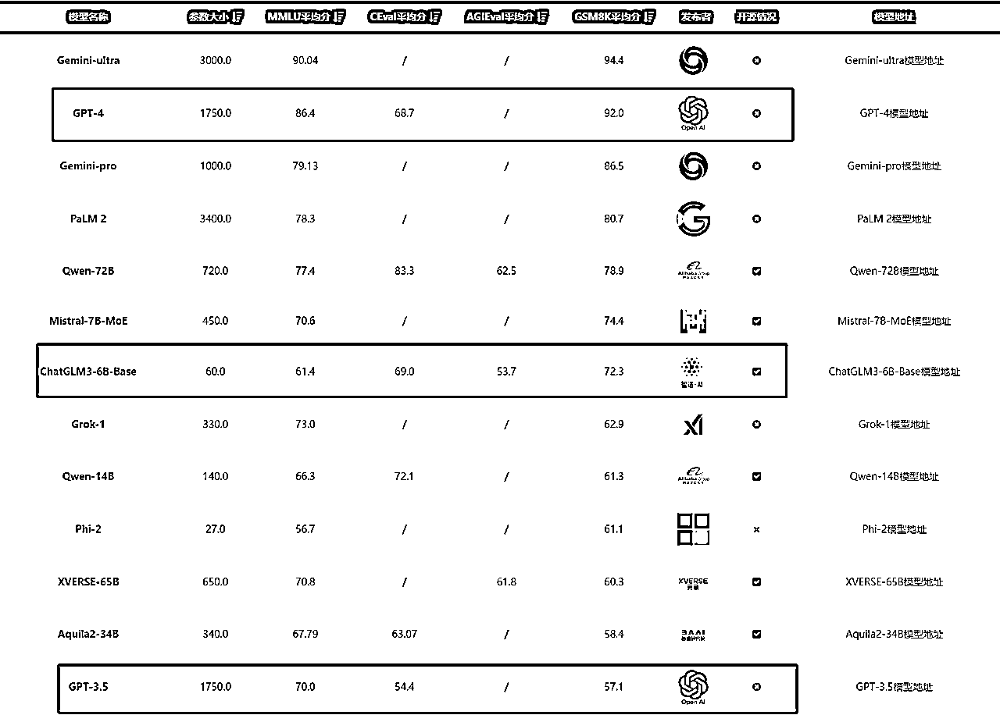

而更让人觉得恐怖的是，这样一个能力还不错的 AI 性价比还非常高，所以这次我就选择了用智谱 AI 来作为本次帖子的基础工具了！

## 2.2 如何实现提问自由

目前智谱用的是手机号注册（中国计算机学会 CCF 会员可以直接授权登录），注册就送 100 万的 Token ，如果实名认证的话，再多送 200 万 Token。需要注意的是赠送的 Token 有效期是 1 个月，注意在过期前使用完毕。也就是如果我们在不实名的情况下，可以利用足够多的手机号来注册，这样就能实现无限的 Token 了。跟 heygen 之前的情况有点类似。

Token 是什么？

作为计算机术语时，是“令牌”的意思。Token 是服务端生成的一串字符串，以作客户端进行请求的一个令牌，当第一次登录后，服务器生成一个 Token 便将此 Token 返回给客户端，以后客户端只需带上这个 Token 前来请求数据即可，无需再次带上用户名和密码。

可以简单理解为 Token 相当于是门禁卡，有了门禁卡才能自由出入小区。（自由使用网站内的相关操作）

智谱注册网址：https://open.bigmodel.cn/login?redirect=%2F

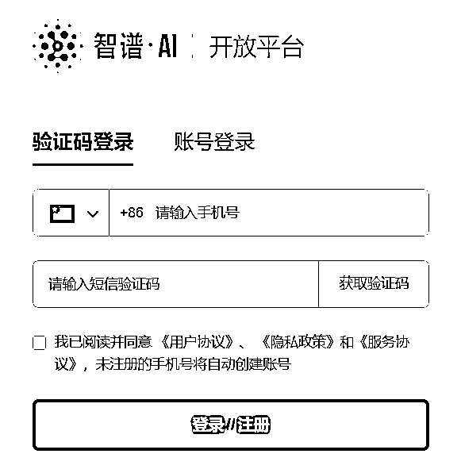

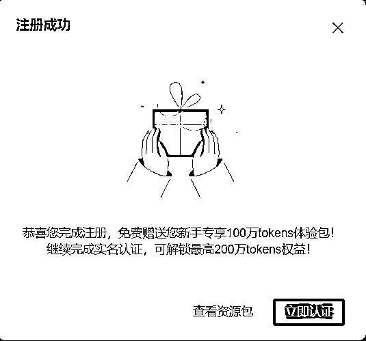

## 2.3 通过 Python 模块接入

以下内容涉及影刀的高级课内容，需要有一定的代码基础。如果你现在还没有学到高级课，又或者没有任何代码基础，也不会影响你阅读的，我尽量用最简谱的语言来跟你唠唠，这个技术是怎么实现的。

### 2.3.1 新建 Python 模块管理

因为影刀是基于 Python 的基础开发的，而 Python 模块是支持第三方的库的，智谱 AI 在 Python 第三方库里，所以我们就可以直接在影刀里新建 Python 模块，模块里安装智谱 AI 的库，就能实现在影刀里自由提问智谱了。

需要注意的是，在影刀里，每个应用的模块和库都是独立的，也就是说，每新建一个机器人，模块和第三方的库是需要重新安装。

什么是 Python 模块？

模块就是 Python 程序。换句话说，任何 Python 程序都可以作为模块。

模块可以比作一盒积木，通过它可以拼出多种主题的玩具，这与函数不同，一个函数仅相当于一块积木，而一个模块（.py 文件）中可以包含多个函数，也就是很多积木。

什么是 Python 的第三方库？

Python 的第三方库是指由 Python 社区开发的并发布到 Python 软件包索引（Python Package Index，PyPI）上的、用于解决特定问题的可复用代码。

这些库是 Python 的强大性和灵活性的主要原因之一，并且可以让开发人员更快地构建应用程序。

在弄明白了什么是 Python 的模块以及第三方库之后，接下来就是在影刀 RPA 软件内的实操了。

在新建 PC 自动化应用界面，右上角的【流程】菜单栏第二个选项就是【新建 Python 模块】

新建完后会弹出一个名为【module.py】是模块，先放着，稍后我们再添加相应的代码块。

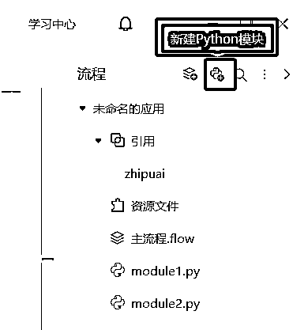

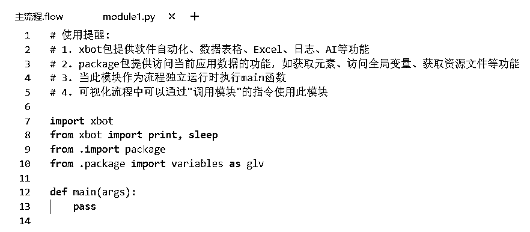

接下来我们需要安装智谱的第三方库，同样也是在右上角的菜单栏【...】，就能看到【Python 包管理】

在弹出的对话框里，输入名称 zhipuai ，安装即可。

注意：在安装 zhipuai 的时候要关闭魔法，否则就会提示 warning 。会导致后续提问有问题。

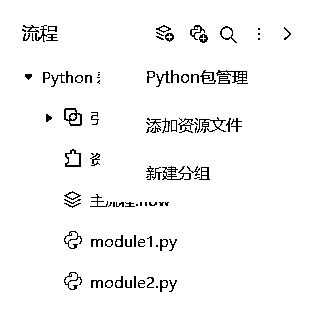

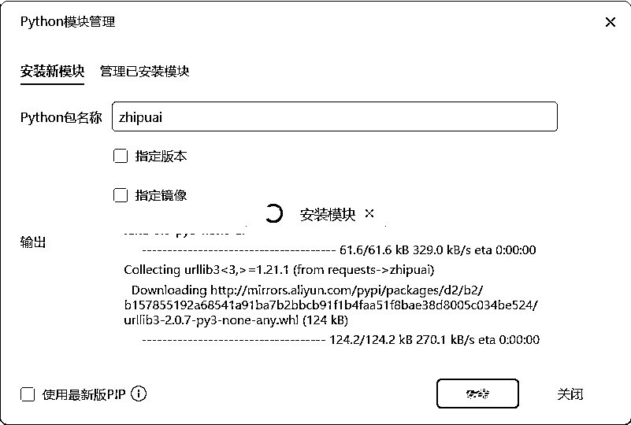

### 2.3.2 写入指令至模块中

刚刚我们新建好的 Python 模块中是没有加入相关的指令的，所以如果此时我们直接调用模块的话，机器人是不会输出任何内容的。

为了能让我们顺利调用智谱，我们需要将相关的代码写入到模块中。我真的翻了好多代码，就这个还不错。

代码块如下：

```
import zhipuai

# your api key
zhipuai.api_key = ""

def invoke_example():
    response = zhipuai.model_api.invoke(
        model="chatglm_turbo",
        prompt=[{"role": "user", "content": "人工智能"}],
        top_p=0.7,
        temperature=0.9,
    )
    return(response)
```

import zhipuai 的意思是，将刚刚我们安装好的 zhipuai 库导入到 Python 模块里，这样才能方便后续的调用。

zhipuai.api_key ="输入自己的 key "

还有一个要注意的点：官方给的调用指令，最后写的都是 print（response），当然如果这些指令是在 Python 环境下使用是没问题的，但现在的 Python 是寄人篱下，要改成 return ，影刀才能接收到回答。

（Python 目前真的还不是我擅长的领域，但是我能用尽一切办法去学呀！）

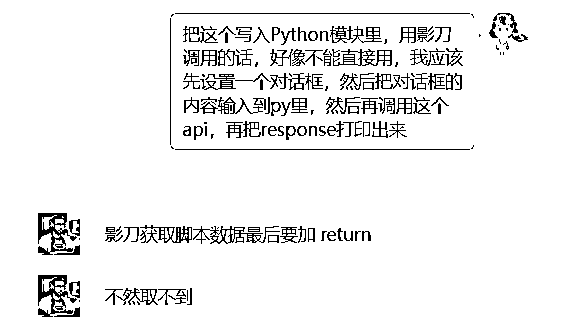

### 2.3.3 如何在流程中调用？

【调用流程】不选择这个的原因是因为 Python 模块内的参数还需要输入输出，参数多了就容易乱了。

【调用模块】直接使用调用模块，将输入的指令以及回复的结果都传到主流程中。

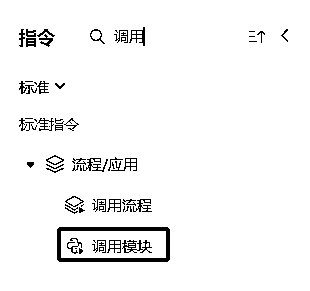

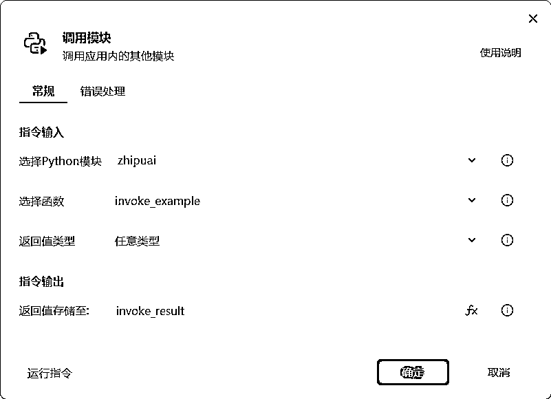

注意，此时返回的结果是 JSON 格式，就像是下方这样的：

{"code": 200, "msg": "操作成功", "data": {"request_id": "8201450333358182104", "task_id": "8201450333358182104", "task_status": "SUCCESS", "choices": [{"role": "assistant", "content": "\" 人工智能（Artificial Intelligence，简称 AI）是指由人制造出来的具有一定智能的系统，可以理解或认识外部环境，并针对所获得的信息做出相应的反应。人工智能技术涉及到多个领域，如机器学习、深度学习、自然语言处理、计算机视觉等。\\n\\n人工智能的应用领域非常广泛，包括但不限于以下几个方面：\\n\\n1\. 金融领域：人工智能技术被用于风险控制、投资决策、客户服务等方面，提高了金融服务的智能化程度和客户体验。\\n\\n2\. 医疗领域：人工智能技术被用于疾病诊断、手术辅助、健康管理等方面，提高了医疗服务的精准度和效率。\\n\\n3\. 制造领域：人工智能技术被用于生产过程优化、质量控制、智能制造等方面，提高了制造业的智能化水平。\\n\\n4\. 零售业：人工智能技术被用于商品推荐、客户服务、库存管理等方面，提高了零售业务的效率和客户满意度。\\n\\n5\. 交通运输领域：人工智能技术被用于自动驾驶、交通规划、物流管理等方面，提高了交通运输的安全性和效率。\\n\\n6\. 教育领域：人工智能技术被用于教学辅助、学习诊断、教育资源推荐等方面，提高了教育质量和学习效果。\\n\\n未来，人工智能技术的发展趋势包括：\\n\\n1\. 深度学习：深度学习是人工智能的核心技术之一，它可以让机器自动学习复杂的模式和规律。随着计算机性能的不断提高和数据量的不断增大，深度学习将会在更多领域得到应用。\\n\\n2\. 自然语言处理：自然语言处理技术可以让机器理解和生成人类语言，这是实现人机交互的关键。随着语料库的不断扩大和算法的不断优化，自然语言处理技术将更加成熟。\\n\\n3\. 计算机视觉：计算机视觉技术可以让机器识别和处理图像、视频等视觉信息，这是实现智能监控、自动驾驶等应用的关键。随着图像处理技术的不断发展，计算机视觉将在更多领域得到应用。\\n\\n4\. 联邦学习：联邦学习是一种分布式机器学习技术，可以让多个设备或系统之间共享数据和模型，从而提高整体的学习效果。联邦学习在物联网、移动设备等领域具有广泛的应用前景。\\n\\n5\. 可解释性人工智能：可解释性人工智能是指让机器学习的模型和决策过程更加透明和可解释。这对于一些对安全性、可靠性要求高的领域（如医疗、金融等）具有重要意义。\\n\\n6\. 人工智能与大数据结合：人工智能技术可以对海量数据进行分析和挖掘，从而发现潜在的规律和价值。随着大数据技术的不断发展，人工智能与大数据的结合将会在更多领域发挥作用。\\n\\n7\. 人工智能与物联网结合：物联网技术可以将现实世界的物体与互联网连接起来，实现智能化管理和服务。人工智能与物联网的结合将在智能家居、智能交通等领域产生广泛应用。\\n\\n总之，人工智能技术正快速发展，并在各个领域展现出巨大的潜力。随着技术的不断进步和创新，人工智能将在未来带来更多的变革和机遇。\""}], "usage": {"prompt_tokens": 202, "completion_tokens": 602, "total_tokens": 804}}, "success": true}

*   注释：什么是字典？

字典（Dictionary）是 Python 提供的一种常用的数据结构，由键（key）和值（value）成对组成，键和值中间以冒号：隔开，项之间用逗号隔开，整个字典由大括号 {} 括起来。

格式如下：

```
dic = {key1 : value1, key2 : value2 }
```

显然，这个是字典，那么我们只需要找到 key 值，让机器人给我们返回对应的 value 值就可以了。

蓝色部分是我们需要的内容，而在这段回复的 key 值是 content。利用影刀市场指令【json 数据提取】，我们就能获得想要的回答，具体操作如下：

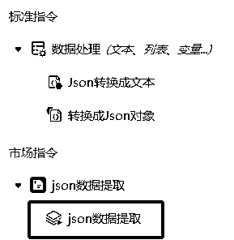

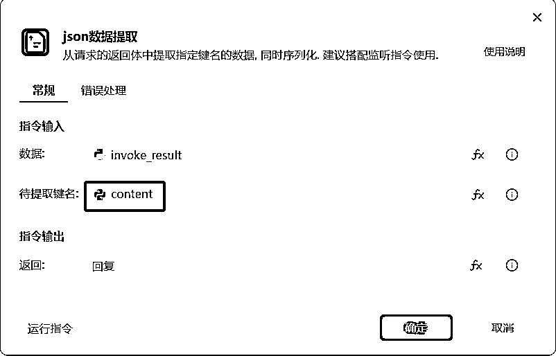

操作后，机器人得到的回复是：

[' 人工智能（Artificial Intelligence，AI）是指由人制造出来的具有一定智能的系统，可以理解或认识外部环境，并针对所获得的信息做出相应的反应。人工智能技术的发展和应用领域非常广泛，包括金融、医疗、制造、教育、交通等领域。\n\n在金融领域，人工智能技术被用于风险控制、投资决策、客户服务等方面，提高了金融服务的智能化程度和客户体验。在医疗领域，人工智能技术被用于疾病诊断、手术辅助、健康管理等方面，提高了医疗服务的精准度和效率。在制造领域，人工智能技术被用于生产过程优化、质量控制、智能制造等方面，提高了制造业的智能化水平。\n\n人工智能的发展趋势包括深度学习、自然语言处理、计算机视觉等技术。深度学习是人工智能的核心技术之一，它可以让机器自动学习复杂的模式和规律。随着计算机性能的不断提高和数据量的不断增大，深度学习将会在更多领域得到应用。\n\n另外，人工智能的应用和发展趋势表明，未来人工智能带来的科技产品，将会是人类智慧的容器。人工智能可以对人的意识、思维的信息过程进行模拟，从而在某种程度上实现人类智能的延伸。\n\n我国政府高度重视人工智能发展，制定了一系列政策和规划，推动人工智能产业的发展。随着我国人工智能技术的不断进步和应用场景的拓展，人工智能将为经济社会发展带来更多机遇和挑战。']

虽然这个列表还凑合，但是，影刀有【列表聚合文本】指令呀，结合在一起，就能将列表中的这些回复，都整合到一起了，因为是重新提问的关系，所以回答略有不同。具体操作：

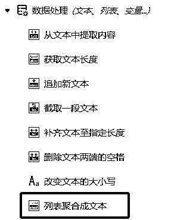

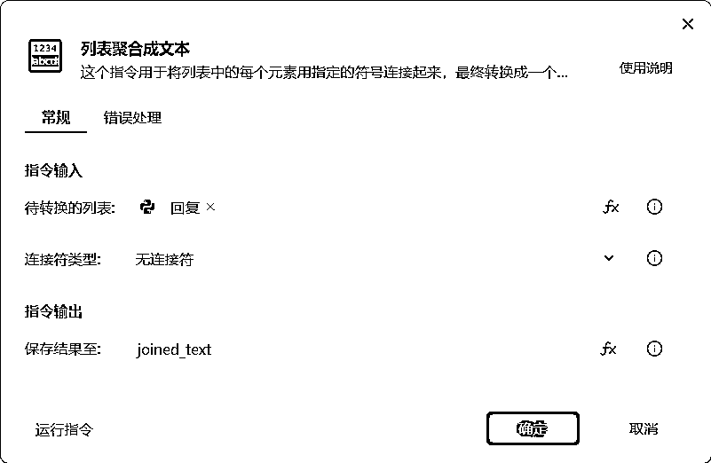

人工智能（Artificial Intelligence，AI）是指由人制造出来的具有一定智能的系统，可以理解或认识外部环境，并针对所获得的信息做出相应的反应。人工智能技术涉及到多个领域，如机器学习、深度学习、自然语言处理、计算机视觉等。

人工智能的应用领域非常广泛，包括但不限于以下几个方面：

1.金融领域：人工智能技术在金融领域的应用包括风险控制、投资决策、客户服务等方面，可以提高金融服务的智能化程度和客户体验。

2\. 医疗领域：人工智能技术在医疗领域的应用包括疾病诊断、手术辅助、健康管理等方面，可以提高医疗服务的精准度和效率。

3\. 制造领域：人工智能技术在制造领域的应用包括生产过程优化、质量控制、智能制造等方面，可以提高制造业的智能化水平。

4\. 交通领域：人工智能技术在交通领域的应用包括自动驾驶、交通优化等方面，可以提高交通系统的效率和安全性。

5\. 教育领域：人工智能技术在教育领域的应用包括智能教学、个性化推荐等方面，可以提高教育质量和学习效果。

6\. 零售业：人工智能技术在零售业的应用包括智能库存管理、客户分析、推荐系统等方面，可以提高销售业绩和客户满意度。

7\. 农业：人工智能技术在农业领域的应用包括智能种植、精准农业、农产品质量检测等方面，可以提高农业产量和质量。

8\. 安全领域：人工智能技术在安全领域的应用包括网络安全、视频监控、异常行为检测等方面，可以提高安全防护能力。

9\. 语音识别：人工智能技术在语音识别领域的应用包括智能语音助手、语音翻译等方面，可以提高沟通效率。

10\. 图像识别：人工智能技术在图像识别领域的应用包括人脸识别、自动驾驶、医学影像诊断等方面，可以提高图像处理的准确度。

未来，人工智能技术将继续发展，趋势包括：

1.深度学习：深度学习是人工智能的核心技术之一，随着计算机性能的不断提高和数据量的不断增大，深度学习将会在更多领域得到应用。

2\. 自主驾驶：自主驾驶技术是人工智能在交通领域的重要应用之一，未来有望实现无人驾驶的普及。

3\. 人工智能与物联网结合：人工智能技术与物联网的结合将为各行各业带来更高效、智能的解决方案。

4\. 人工智能与区块链结合：人工智能技术与区块链技术的结合有望在金融、供应链、数据交易等领域产生创新应用。

5\. 边缘计算：随着物联网设备的普及，边缘计算将成为人工智能技术的重要发展方向，提高数据处理速度和智能化水平。

6\. 可解释性AI：为了提高人工智能系统的透明度和可信度，可解释性AI将成为未来研究的重要方向。

7\. 人工智能伦理和法律：随着人工智能技术的广泛应用，伦理和法律问题日益凸显，未来将加强对相关问题的研究和探讨。

8\. 人工智能芯片：专为人工智能计算任务设计的芯片将成为未来发展趋势，以提高计算效率和降低能耗。

9\. 跨学科研究：人工智能技术将与其他学科如生物学、神经科学、心理学等进行交叉研究，以更深入地探索人类智能的本质。

10\. 人工智能应用场景的拓展：人工智能技术将进一步渗透到各行各业，创造出更多新的应用场景和商业模式。

总之，人工智能技术将持续发展，为人类社会带来更高效、智能的生活和工作方式。然而，随着人工智能技术的广泛应用，也伴随着一定的挑战和风险，需要在技术进步的同时关注伦理、法律和社会问题，以确保人工智能技术的可持续发展。

就这样简单 4 步就能在影刀里实现 AI 提问自由了！

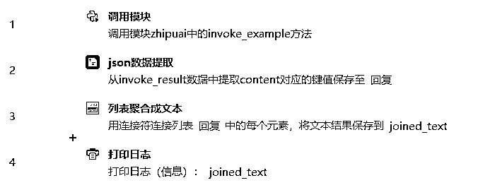

## 2.4 通过魔法指令实现

虽然说写代码确实会方便很多，对于没有任何代码基础的普通人来说，这样的 AI 提问还是不够自由，那怎么办呢？

影刀最近更新了一个指令叫【魔法指令（beta）】，简单来说，我们可以通过文字来让影刀写一个新的指令，以配合我们实际的操作。

我给出的指令是：

```
通过发送HTTP请求调用清华智谱模型接口，对输入数据进行智能分析，并返回回复结果。你需要先导入zhipuai的库，然后还需要用户输入api_key
```

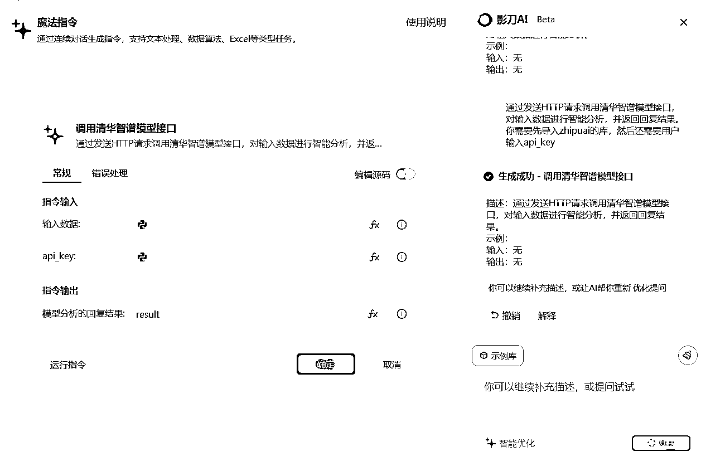

从上述的操作中就知道，这时候返回的结果是 JSON 格式，我们还需要从字典里提取 content 的 value 值。那么我们继续向魔法指令提问。

我给出的指令是：

```
我希望你能帮我从JSON中提取键名为content的value值，如果返回的value值是个列表，我希望你能将列表聚合为文本
```

把刚刚回复的结果放入 JSON 数据里。

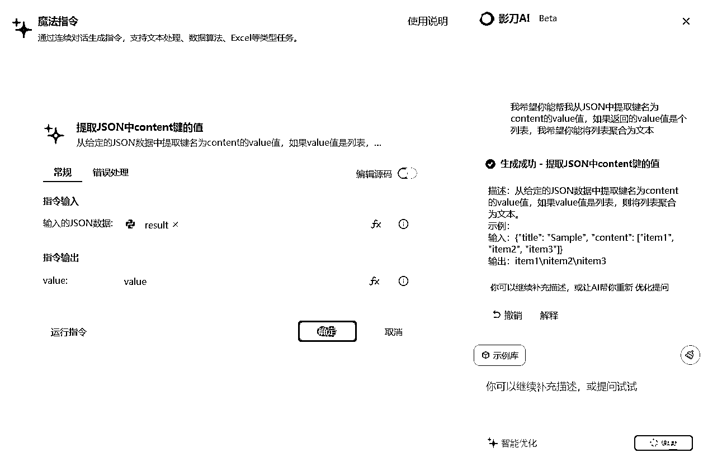

暂时来说，这个魔法指令还是需要时间和耐心去磨一磨的，需要非常精准的文字 Promot 才能输出一个比较好用的指令。 Beta 版目前的 bug 还是有点多，而且虽然可以打开【编辑源码】，但不适合大改。

这就好比如使用 GPT 需要 Promot 一样，有好用的 Promot 才能出相对好一点的结果。

# 三、结语

写这篇帖子，全都是因为官方人员给我发了这个魔法指令的活动。我就想着，就写这么一个，内容可能有点水，那就再加点高级课上学到的内容吧，没想到给自己挖了一个大坑，哈哈哈。

不过整个学习的过程还是很有意义的，在写帖子的时候，顺便也补了一下 Python 的基础，学习就这样，用进废退。学生时代，我的导师就说过，其实大家都不需要到学校上课，Google 就是最好的老师。只要你提问，Google 就能给你找到答案。

那么，在 AI 时代，我们还有没有花时间花精力去学 Python 去学 RPA 呢？《纳瓦尔宝典》里有句话是这么说的：“如果社会可以培训你，那么总有一天社会也可以编写代码，用计算机取代你。”掌握社会所需要独门绝技，才能让我们站在不败之地。

就像是人们常说的，AI 不会取代人， AI 只是会取代不会掌握 AI 的人而已。我想这已经是让我们去学习的最好的理由了，不是吗？这么努力肝的一篇文章，值得你的一键三连吧？

如果你也对影刀 RPA 感兴趣，欢迎来一起唠唠~ 我是 Leeka ，持续在研究 RPA ，点赞过 100 ，下篇帖子马上肝。

V：Leeka56 （备注：生财，会更快通过哟！）

## 3.1 RPA 机器人还能这么玩？

保姆级教程|教你用影刀RPA做定时发朋友圈的机器人@Leeka

【喂饭教程】我用影刀RPA做了个小红书养号机器人@Leeka

《如何通过影刀RPA提升抖音图文10倍跟款的效率》@Leeka

《在学习影刀RPA之前，你得知道这些坑！》@Leeka

《如何利用RPA提升小红书店铺10倍以上的效率？》@Leeka