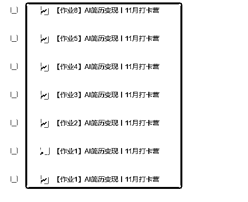
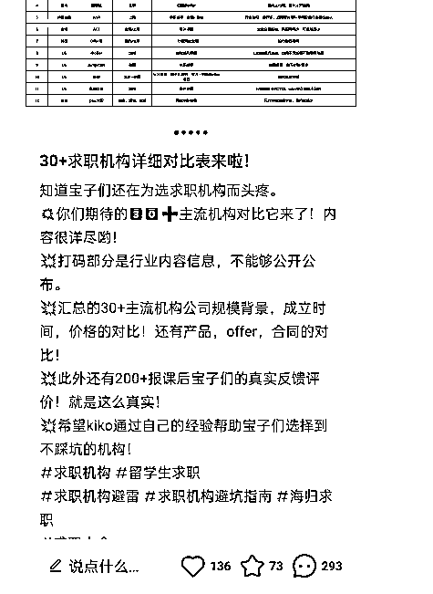

# 成功营收2w+，如何从0-1详细搭建一个项目实操打卡营？精细策划助力147人成功上岸率85%

> 来源：[https://cxqeimz77vr.feishu.cn/docx/OCrvdqXjqoXuWWxUcI3cydfznxe](https://cxqeimz77vr.feishu.cn/docx/OCrvdqXjqoXuWWxUcI3cydfznxe)

各位圈友大家好，我是饭饭，

加入生财半年的龙珠圈友，目前在电商赛道探索，也是经过了生财的首席医官@梁靠谱的

指引和指导，在较短的时间内通过分享自己的实操经验拿到多篇精华帖，也顺利的拿到了龙珠。

进入生财看见生财的价值观“主动、真诚、利他、空杯、开放、日拱一卒”，作为一个刚入门的新手，按着这个路径去执行以后，我的收获较大，成长较多，收入也在增加。

在上个月我分享了一篇《AI+简历修改首月盈利7000+的一个文章》，收到了很多圈友的点赞，被认可很开心，后面又收到了生财官方的邀请，作为实战嘉宾进行了访谈，实战分享。

在被众多的圈友链接到以后有圈友问了一些问题：

有没有交流群、能不能带带、等不能教一下，有没有岗位的指令、怎么去给客户解答、

能不能付费向我学习、能不能请教你问题....

这些我都没有。

然后在圈友@ 摸鱼掌柜的指点下，也就有了免费的【AI简历实操打卡营的从0-1】，在掌柜的指点下一起搭盘子分工合作，在公众号和朋友圈发布了公益实操打卡营以后，报名人数147人、成功打卡上岸达到85%、12天的打卡时间里出单率达到33%，成绩最好的学员更是变现高达4位数。

然而这个实操打卡营对也顺利的丰富了【AI简历】赛道，得到了很多的高阶玩法，积极的将电商和AI相结合。这篇文章详细的复盘关于公益实操打卡营的从0-1，以及AI简历修改的拓展玩法分享，圈友可以当做一个参考，小范围内组局，欢迎对AI简历感兴趣的朋友来交流。

希望圈友见贴受益，用此次的实操打卡营给大家打个样。

# 1.提前准备

### 1.1 确定初衷与目标

其实我在分享文章《AI+简历修改首月测试盈利7000+》详细拆解之前我都没想到这个项目拿到成果会这么迅速，涉及面能够完美的搭配多个行业，玩法也是多样的，既然做了那就把这个行业的玩法扩展丰富，做成一个全面的参考。

我和摸鱼掌柜给自己设立的两个预期目标很简单

一是多普及一下简历修改这个普通人的也能入局的赛道，全面升级一下玩法。

二是超预期的交付可以获得一部分社群成员的付费和信任，为后续的变现做准备。

结果很满意，有大量的参与成员选择付费留群进行后面的交流学习。

### 1.2 确定推广渠道

我们确定了实操打卡营以后就准备宣传物料（多个宣传文案+海报）我和摸鱼掌柜选择了3个信息发布平台，（社群+公众号+朋友圈）顺利的有了147名伙伴报名加入了【AI实操打卡营】。

提前准备：

（1）.要保证活动有序的展开，要有详细合理的介绍（介绍文档是一个比较好的选项）

（2）.提前筹划宣传的渠道：包括微信朋友圈、群分享、公众号推送的时间、内容、频率等，都有预案。

# 2.实操打卡环节设置

### 2.1 设置简便的报名流程

整体报名流程选择了四步：

（1）报名押金收取转账报名、

（2）飞书表格登记、

（3）微信打标签（微信标签可以群发消息）

（4）通过标签群发邀请入群

由于精力有限、人力是有限的，而且人数并不会很多，整个流程设定一定要简单，切勿复杂化，以免重心消耗。简单化报名流程，降低参与门槛，以及便于后期数据统计以及押金退还。

### 2.2 设定押金

我们在宣传的文案中就提前设定了规则。

押金金额398，12天8次作业打卡，难度偏低，这个金额的设定很有利于打卡完成，

提高了打卡营的参与积极性，保证了一个高质量打卡的结果。

# 3\. 做好打卡课程设计

### 3.1详细介绍课程设置

考虑到参加打卡的学员水平参差不齐，所以我们在设计打卡流程时，尽可能的把能想到的环节，比如课程表、上课时间、作业提交时间等都做了详细的文字说明，减少学员实操中因为一些基础问题而浪费时间，同时也降低了我们自己的沟通成本。

### 3.2作业设计要明确

案例实操等，以确保参与者有实际操作的机会，提高学习效果，在成员作业提交完成以后要认真核对，以确保到对每一位打卡成员负责，提升打卡效率。

### 3.3 准备详细的打卡机制

提前说清楚打卡时间安排、打卡作业安排、学习资料、押金退还规则、奖励制度以及打卡活动原则，监督参与者完成任务，确保活动的高质量进行。

# 4\. 获得的AI+简历赛道的高阶玩法

### 4.1简历+职业发展指导

什么是职业发展指导？

这个玩法就是为个人提供全面的职业规划和发展支持。包括职业咨询、技能培训、行业趋势分析等能帮客户更好的去获得offor的机会，就是解决了痛点，就是收费项目，而且收费还不低，结果都不错。

根据目前市场价格分析，目前在淘宝、拼多多和小红书都有较多的人在做，

在职业发展指导服务领域，价格通常取决于服务的深度、个性化程度以及提供的附加价值。调查以后发现一些常见的市场价格范围：

（1）个人咨询费用： 一般按小时计费，市场价在300元至800元/小时不等，取决于顾问的经验和专业背景，定制产品，价格也是不一样的。

（2）在线培训课程： 课程费用根据内容的深度和时长而异。基础课程可能在500元至1500元之间，而更高级、深度的课程可能超过2000元，目前在抖音和小红书两个平台出现的较多。

### 4.2.面试辅导

面试辅导服务帮助个人提高面试技巧，包括但不限于姿势、表达能力、问题回答等方面，提高他们在职场竞争中的成功率，那解决这个痛点，就能收费，

变现方法：

（1）个人面试辅导费用：提供个人面试辅导服务，按小时或按项目计费，按小时计费，通常在180至600/小时之间，具体取决于面试辅导师的经验和专业水平。

（2）在线面试课程：提供付费的在线面试课程，涵盖面试技巧、行为面试策略等， 提供多层次的在线课程，价格从300至1800不等，取决于课程的深度和包含的资源。

（3）高级会员计划：提供高级会员计划，享受更多个性化服务和终极面试准备，以月度或年度订阅费用变现，目前较多的小程序和公众号提供了类似的服务，建议定价： 提供高级会员计划，月度费用在300元至900元之间，年度订阅费用可优惠至3000至5000元。

### 4.3简历赛道+求职培训课程

例如大学毕业生、职场新人、职业转型者都是精准的人群，了解他们的需求和痛点，出能够解决他们痛点的课程。

（1）付费课程：

目前市场上有许多免费的求职培训资源，抖音和小红书一搜非常多，但高质量的付费课程仍然受到追求深度知识和实用技能的用户追捧。

这种课程建议设定不同层次的课程，提供基础课程免费，而深度、实战性的内容则采取付费模式。根据市场竞争情况，初期可以设定每门课程300元，而且很多有实力的用户基数的增加的同时，价格收费也高达500元左右。

（2）企业合作：

就目前的现状企业对员工的职业发展关注度也是蛮高的，通过与企业合作，为他们的员工提供定制的职业培训服务、表达形体等培训也是一个稳健的变现途径。

### 4.4创业导师服务

针对有创业意向的客户，提供创业导师、商业ip等等服务，包括商业计划撰写、市场调研支持等，等等的创业服务，也是一种不错的副业变现，也值得去深挖。

就目前挖掘到的一些很优秀的店家，提供了知识付费的副业变现，求职教练训练营，收费也是相对可观。

### 4.5【AI+简历+写作店铺】

其实这些赛道都是触类旁通的，我的简历店铺和写作店铺结合起来也属于增收阶段，巧用AI可以提供合理合规的写作服务，高质量 简历 商业计划书 自我评价 职业规划 简历修改 求职简历 求学简历等等 演讲稿 报告 读后感 征文文案 等格式修改服务，都是可以和简历赛道相结合。

更多的一些高阶的AI简历+【赛道】的服务也是在未来的时间里会去持续更新玩法，也就是接下来实操总结的一个过程。

# 5.组局打卡营的意义：

这种实操性的打卡营收获是非常大的，除开能够带领一部分人一起丰富这条赛道，更有很多有价值的意义，能让组局者在行业增大自己的影响力，能让参与者获得问题解决的能力和更多变现。

### 5.1单量共享，群友分担

就目前我们实操下来，交流群里就有一个很大的优势，写不了的，拿不下的，丢群里消化，靠谱的合作伙伴，有利于初期的个人发展。

### 5.2业务合作，丢群里消化

小白刚接触一个项目的初期可能会受到产品的标题、文案、主图、网感等等很多因素的影响，综合考虑在实操的过程中，交流群可以有很好的优势互补的作用，P图弱，文案弱都可以丢群里处理。

### 5.3疑问解答、高效上岸

交流群可以折射出非常多圈友遇见的实操问题，小白初期的实操难，出状况，都可以丢群里消化。

### 5.4课程更新，信息差，新玩法，在群里分享

同一个项目在不同人的手里面都会有不同的结果，不同的火花都可以在群里碰撞，达到互利共赢的状态，这些分享的内容对于组局者和参与者都是很好的一个提示。

### 5.5社群分佣，合伙人，招代理

对于目前很多圈友在分享了精华文章以后可能做的都有知识付费或者代理招募等等，一个高质量的合伙人群体能够很高效及时的解决基础流量问题，信任基础也会较好，执行起来会更顺利，有利于组局者增大自己的势能，就例如：我把学员问到的高频问题，以及实操的一些要点，整理成了一份【AI简历变现实操100问】小报童专栏，并且提供给会员100%分佣，尽可能的帮他们落地项目实操，也是一种裂变玩法。

# 6.上岸率85%背后的秘密

就目前操作下来的能够达到总结了为什么能够达到非常高的上岸率的原因有几个：

### 6.1讲清楚、说明白

项目能够真正的落地和实操手册有很多的关系，一定要提前制作详细的实操手册sop，如果目的是能让小白看了就会，那建议做成一个执行手册把每天的待办事项，注意事项都一条一条写进去属于给喂饭那种，他就会特别清楚，操作起来也就不难。所以我们做了详细的AI简历打卡的实操手册，具体到每一个细节，实操手册越细节，得到的结果越好。

### 6.2课程设置

整个打卡环节的设计非常的合理，在摸鱼掌柜丰富的经验之下预估了每个作业完成的时间，以及对每个参与者

都进行了一些可预见的事件假设，留足打卡时间，并且禁止“水作业”让他们可以学习完再打卡，而不是敷衍式的打卡，即完成了打卡，也增大了他出单的可能性。

### 6.3每日提醒

导师引导非常关键，现在的信息流太爆炸了，很多人群消息都不知道有多少，很可能是把群屏蔽的，然后会出现他忘记的情况，及时做到每日提醒，我们在实操的时候每日更改群昵称，帮助大家打卡上岸，按步骤打卡更容易取到出单成果。

然后每日提醒，在群里发布作业链接，既做到了有效通知，也做到了合理提醒。

### 6.4群引导报喜氛围

一定要有氛围的去做一件事情，很多小白刚接触一条新的赛道是比较陌生的，报名咨询一个项目可能就是一时兴起，遇到难题可能就退缩了，但是如果一个圈子里面大家氛围都很好，遇到问题解决问题、遇到好事立马分享，这样是能够有效的带动他们攻破难题，取得好结果的。

总结参与者的细致意见和建议，挖掘活动的优势和不足之处，能够有效的积累精华内容，方便在后面的赛道上去更加的专业化，也是丰富自己的知识手册的关键步骤。

### 6.5留群继续深造计划

其实最开始的时候想着实操打卡营结束以后就把群给解散了，担心后面没有过多的交付的话会变成冷群，但是在收集了参与者的建议以后临时做了调整，可以选择把群作为一个付费交流群，用户可以选择留或者退押金，自由选择

打卡成功，很大一部分选择成功退回押金，但是也有很大一部分选择付费留群学习，这对于组局者来说，也是一笔收入。

# 7.写在最后

在分享的过程中不断优化会使得自己的势能越来越强，这点明显的感觉到，我从最开始的星球小白，在多次分享以后也能够给与小部分群体一定的赋能，这是一个持续性的成长阶段，在这个过程中，这两点一直谨记在心里：

### 7.1真诚分享

“极致的利他就是利己”，在每一次分享中我都没有藏着掖着，详细的方法论和一些内容制作工具、社群运营工具和开店必备的网址等等都给到了实操打卡营的每一位参与者，这样能够获得较大的好感，价值也在升高。也是由于做到了真诚的分享，后面才得到了不少圈友的留群学习。

### 7.2善于合作、双赢之道

“众人拾柴火焰高”是句老话，始终经典。

成长不是个人秀，是个团队活，持续性成长不是孤立的过程，在这次我和摸鱼掌柜一起给大家提供的【AI+简历修改】实操打卡营的实操中，深度体验到。掌柜丰富的网创经验，又是给我一次经验赋能，方法论和言简意赅的经验分享、于我而言就是启发性的成长，这是双赢之道。

也希望圈友们见贴受益，看完觉得有用可以在星球帖子下面留言交流~