# 小红书新风口无人直播实战，7天顺利起号GMV2W+玩法心得分享

> 来源：[https://e102r8ejz5v.feishu.cn/docx/OYpUds3R1oOxIXxri1McOX5gnIb](https://e102r8ejz5v.feishu.cn/docx/OYpUds3R1oOxIXxri1McOX5gnIb)

首先非常感谢书豪无人直播的思路玩法分享，在小红书11月份疯狂打压搬运混剪无货源，笔记获取流量及其困难的时期带来了小红书的新玩法。跟着实操一周，单号单品销售额过2W。虽然离书豪的25W还有很大的距离，但是熟悉玩法后，通过增加设备和账号是可以将这个项目放大的。目前已经添加第二台设备和第二个账号开始测试

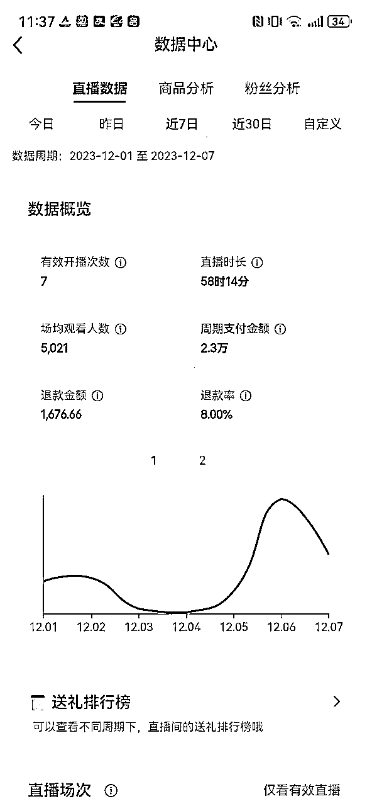

接下来我将结合我这一周整个的起号过程，遇到的问题，以及相关的解决方案，给大家做一个玩法+心得的分享

# 准备工作

## 开通小红书店铺的账号

前期建议先从一个号开始，可以是个人店的账号，也可以是个体店的关联账号。重点是需要有店铺，可以上品，这样直播间才能挂上对应的商品链接。不知道如何开店的小伙伴可以参考航海手册，有具体的开店上品方法。

## 配置中上的电脑

关于电脑具体配置个人不太懂，不是太卡的都OK，不需要耳麦音响摄像头。MAC不太建议，目前暂未找到支持的录制软件和OBS软件，虚拟机或者双系统测试下来直播时会卡顿。

## 需要用到的工具

### 监控录制直播

监控录制直播的软件比较多，我自己使用的是江湖工具箱

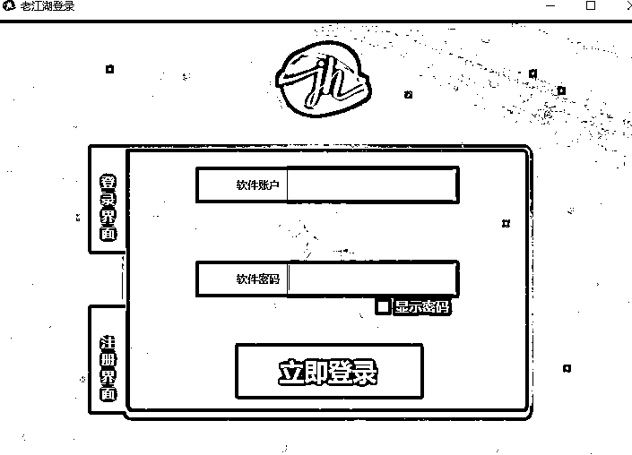

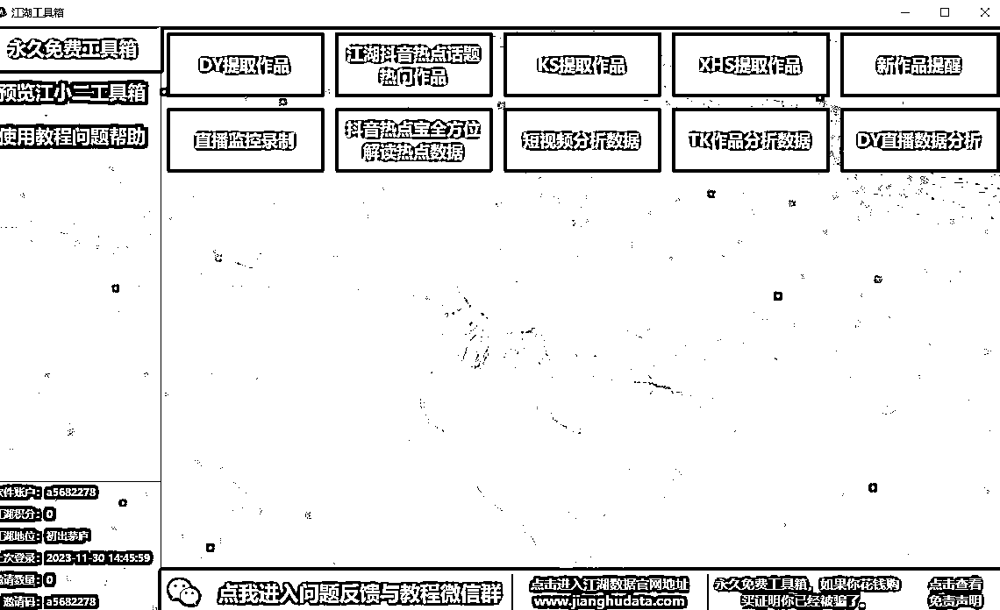

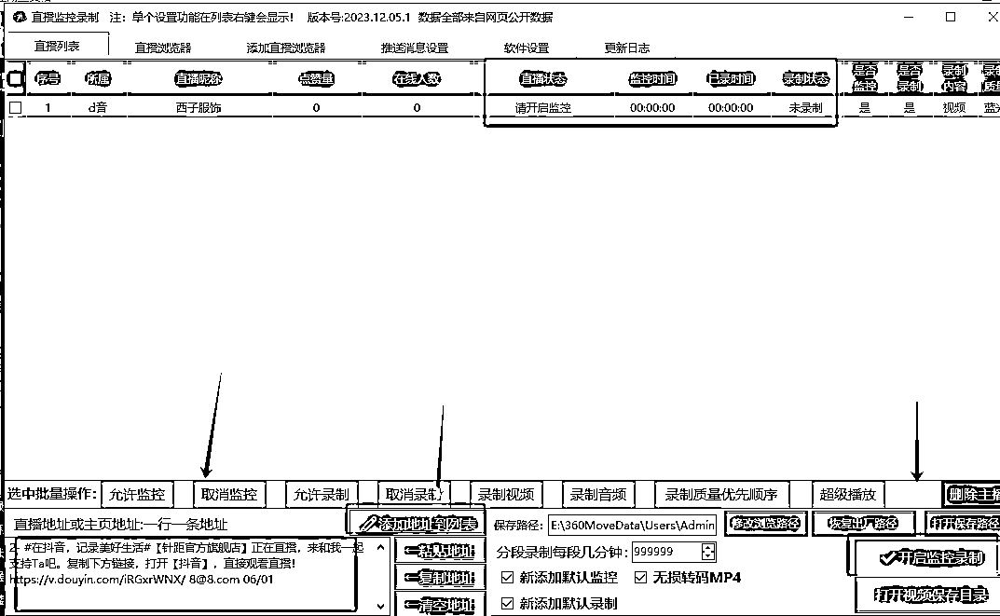

#### 工具使用方法：

软件直接注册登录，将你需要监控录制的直播间链接粘贴到左下角，添加地址到列表，再开启监控录制就可以了。提前设置好保存路径，录制结束后视频就会显示在对应文件夹里。

#### 工具注意事项：

1、建议录制3小时左右的素材，无需从开头到结尾，中间开始录即可。3小时可以确保循环播放不易被观众发现，如果录制时长过短，容易被举报录播

2、录制为后台录制，不影响电脑运行速度，可以在直播时录制其他素材，也可以多个直播间素材一起录制

### OBS推流

#### 工具使用方法：

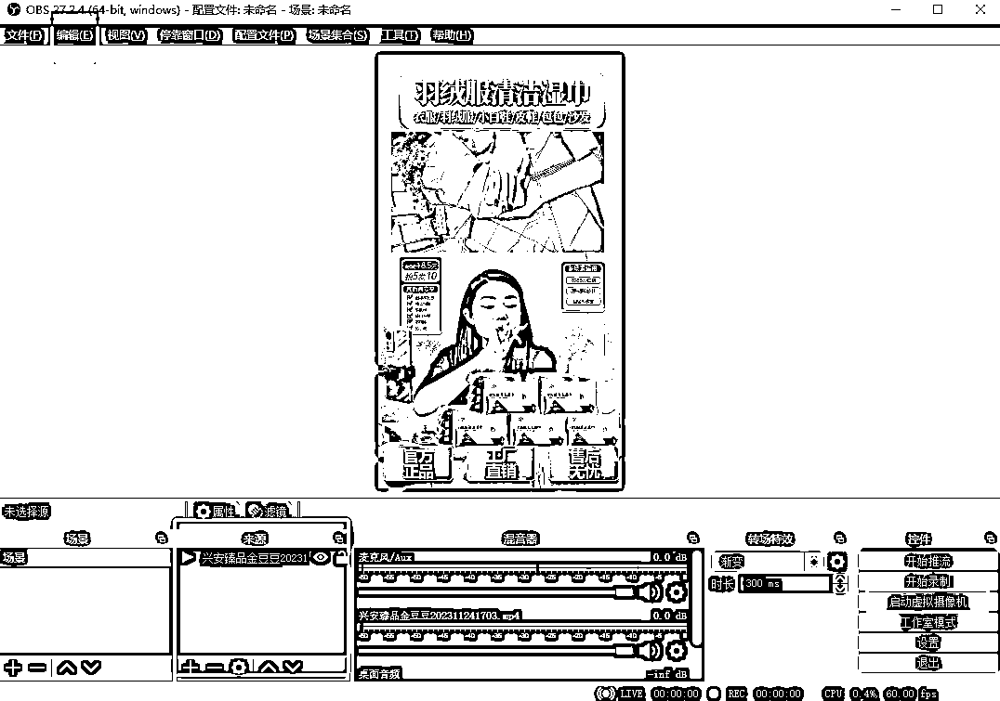

将录制好的直播视频直接拖进OBS里面，接下来启动虚拟摄像机，便可将视频画面推送到直播平台

#### 工具注意事项

1、视频添加进OBS后，点击编辑，高级音频属性，对媒体源开启监听并输出，这样视频才会有声音

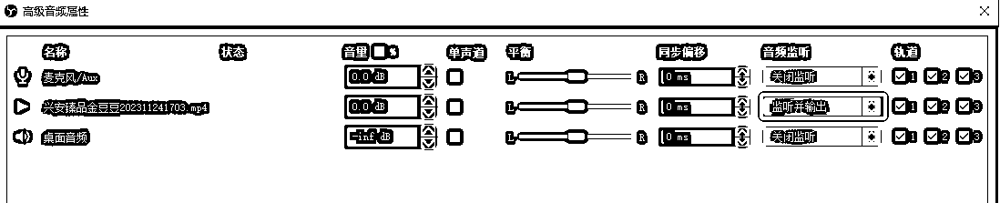

2、在设置里点击视频，调整分辨率，均为1080*1920，没有选项，需要手动输入，注意长宽比是9-16，不是16-9，这样输出的视频才会是竖屏

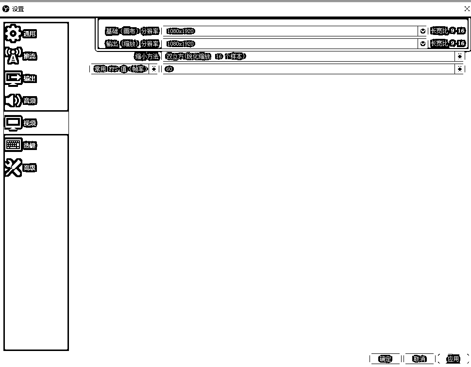

### 小红书直播助手

这个是小红书官方的PC端直播软件，类似抖音的直播伴侣

#### 工具使用方法：

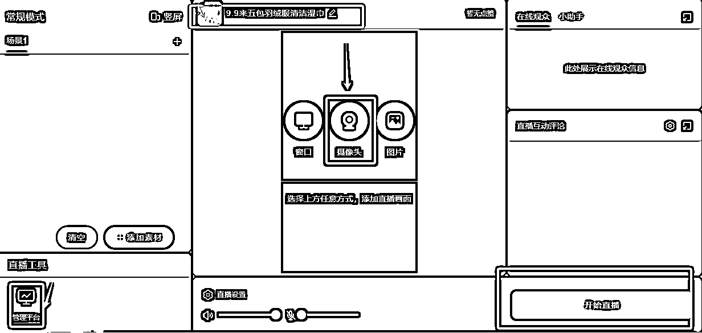

点击摄像头，添加OBS虚拟摄像头，即可同步OBS的视频

上方可以修改封面和标题

左下角为直播后台

#### 工具注意事项：

1、添加OBS摄像头后，需要调整分辨率为1080*1920，有些电脑会出现没有这个选项，在OBS软件上启动虚拟摄像机，再在小红书直播助手上点击刷新，刷出1080*1920

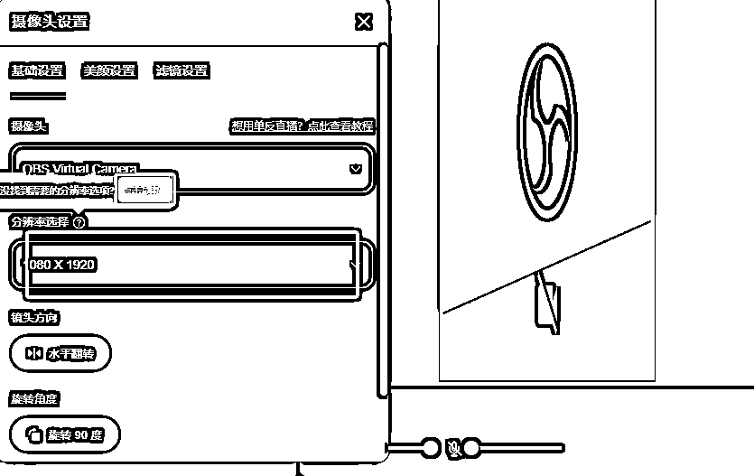

2、设置好封面和标题再开播，可以参照同行直播间

3、开播后记得点击左下角管理平台，完成上品

4、开播完上品后，用其他账号进直播间，检测直播间是否正常（声音是否正常，画面是否正常，商品是否能正常点击购买）

以上就是准备工作，简单来说三个工具，一个录视频，一个放录像，一个平台直播。接下来步入主题

# 选品

## 确定类目：

目前直播广场上效果较好的几个赛道，女装，零食，百货。基于平台性质，女装赛道是最易拿到流量，也最易起号的赛道。

## 选品方法：

### 站内跟同行爆款（只做参考，不建议）

平台直播广场内场观过万的直播间用来做参考，找到对应的品

优点：这是被验证过可以起量的品

缺点：优质的无人直播素材容易撞素材，多人使用同一个直播间素材，会被判多账号直播以及录播，风险较高

解决方法：选择爆款的相似品，或者选择爆款的冷门素材（主播低粉，销量低的直播间）

### 其他平台实时爆款

采用工具：巨量百应，禅妈妈，考古加等

优点：抖音快手验证过的实时爆款，在小红书主播及其匮乏的情况下，拿过来都是降维打击

缺点：可能会出现产品不符合小红书平台人群的情况下

解决方法：测品，每天6小时，测3天，场观拉升仍无法带来合适的转化率，及时换品。女装概率较小，目前我跑通的就是用这个方法选的第一个品

# 选素材

直播素材是很关键的，一个好的直播素材不仅能带来高销量，还能降低违规，延长直播账号寿命。

每个人的素材评判标准不同，我分享下我的素材选择标准

## 基本原则：

直播间画面无花里胡哨的贴片，不是官方旗舰店，不是品牌直播，不是几十万以上粉丝的大V直播，画面没有平台标识。主播话术不会频繁提及平台，点赞关注，小黄车，粉丝牌等

## 个人原则：

1、不选择多链接多品的直播间，由于无人直播的不可控性，避免弹幕出现过多的要求讲解其他链接得不到回复的情况。同时也避免上品找货源的麻烦

2、不选择价格过低，导致找不到合适货源（利润率30%以上）的直播间

3、尽量暖色调的直播间，颜值较高的主播，能带来更高的曝光点击，以及停留时长

# 开播

选好品，录制好素材，找好货源，上架店铺后就可以开始直播了

按照工具使用方法，打开小红书直播助手，设置好标题封面，进行开播

## 注意事项：

1、开播后记得挂车，在直播助手左下角直播管理平台上，实时跟播，添加对应商品

2、封面提示违规需及时更换

3、不要频繁开播下播，容易影响推流

## 必做事项：

1、开播后必须用小号进直播间检测，画面声音是否正常，商品链接是否正常购买

2、设置直播间屏蔽词：如录播，录像，直播，假。减少直播间节奏

# 起号优化

## 提高直播时长，提高封面点击率

新号前两天直播间没有流量是正常现象，毕竟一个新的直播账号是没有标签的，需要通过提高直播时长，来获取官方流量扶持完成冷启动

官方之前一次扶持活动中提到两个标准：

1、直播时长，连续开播3天，直播时长30分钟以上

2、封面点击率在4%以上

所以提高直播时长，采用优质封面，可以帮助账号更快的起来

## 完成直播任务，获得官方流量曝光翻倍

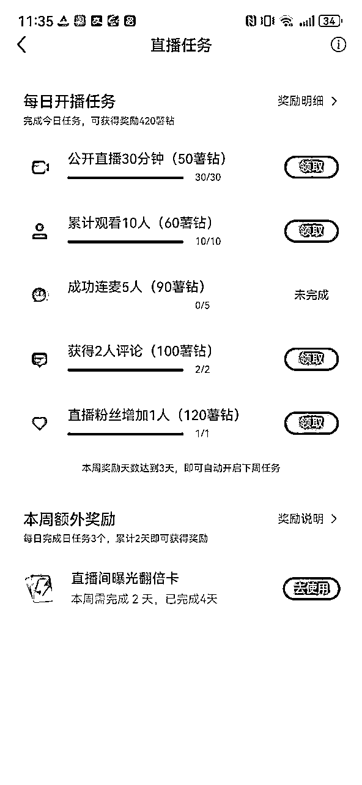

小红书在直播上扶持流量非常大，完成官方任务，获得直播间曝光翻倍卡，也能快速起号

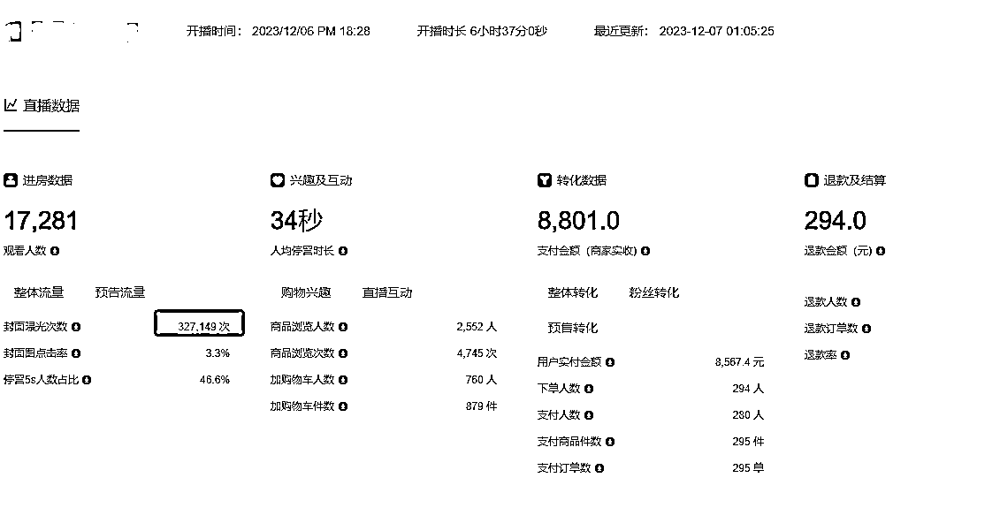

这是六号获得官方曝光翻倍卡的直播数据，单场直播6小时，获得曝光32W，场观1.7W

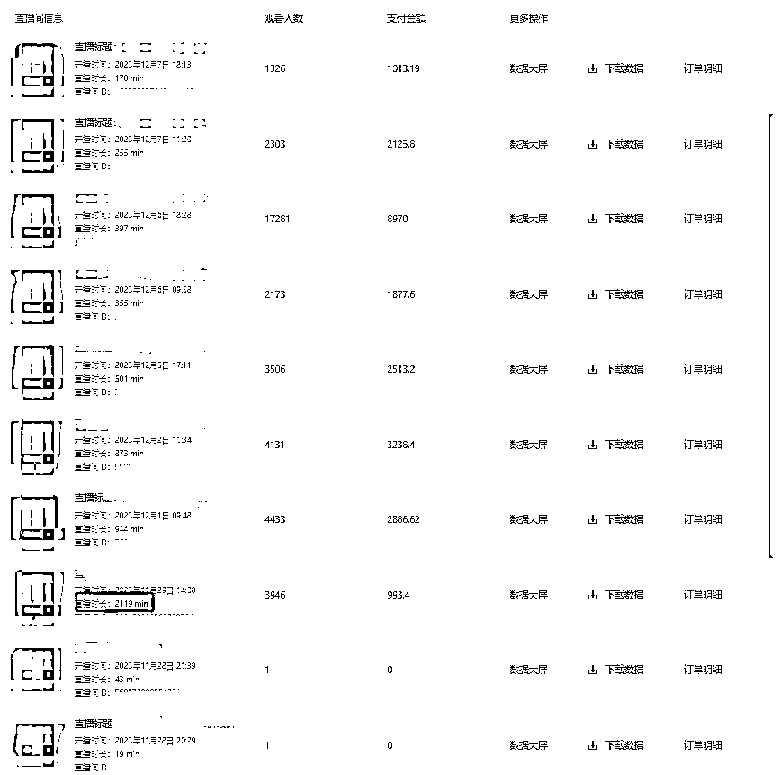

这是本人从开始到7号的直播场次变化，在29号时开播35小时，把场观拉升到4000，开始出单，后续便稳定进人出单了。

所以即便前两场一个人没有，也要坚持的播第三场。

# 流量机制

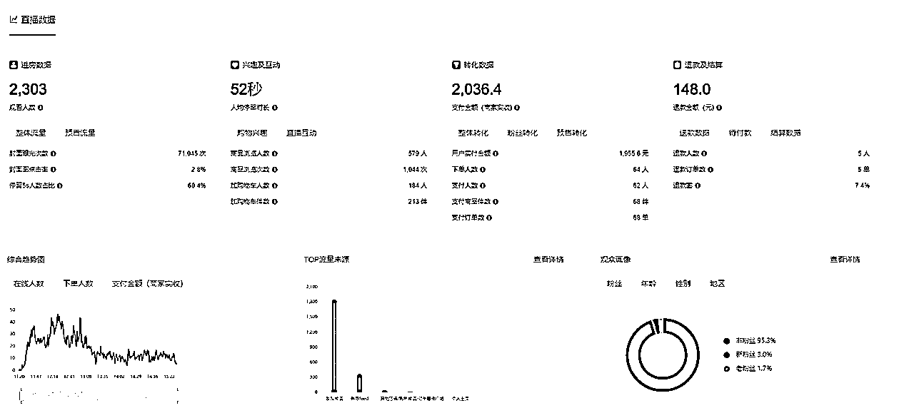

这是小红书的直播后台，目前来看比抖音和视频号的直播大屏还是差远了，但是也没有那么多复杂的数据，没有流量漏斗，CPM,GPM等一大堆需要你去分析的数据，很简洁扼要就是告诉你看你的直播封面

## 封面

抖音的直播推流是根据短视频入口和直播间画面，换到小红书上也就是笔记入口以及直播封面

在不发笔记的前提下，整体数据很简单，就是看封面。主要流量来源于发现，发现页就是看你的直播封面，所以一个好的封面很重要。封面点击率超过4%，平台就会源源不断的给你推人

## 直播标签

一个新开直播的账号是没有标签的，可以通过发垂类笔记去打正标签，也可以通过付费投流，去打正标签，但是这些都太慢，不适合无人直播的打法。

在有一个合适的封面的前提下，我们可以通过拉高直播时长，去获取更多的流量，当然这些流量是泛流量，转化率会过低。但是也会有转化，随着直播时长越来越长，平台也会根据这些有购买行为的人群画像去继续推荐相似人群，你的直播人群画像也会越来越精准

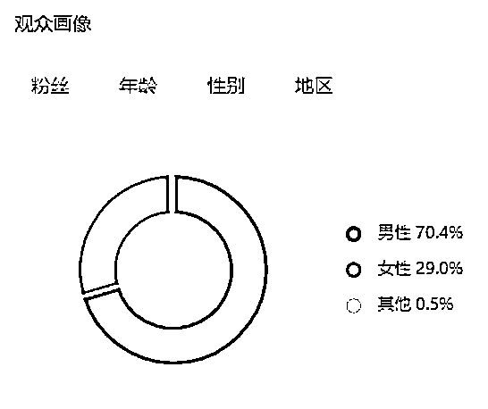

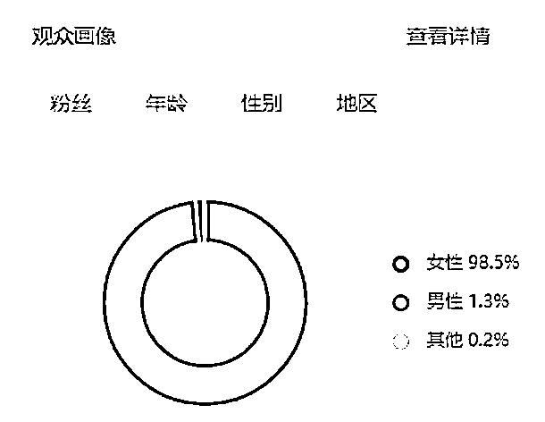

这是同一个账号跑的女装前后对比，刚开始女装赛道有70%的男性观众，明显是不精准的流量，但是随着时长和销量的提高，人群越来越精准，转化率也越来越高。人群画像也回到了以女性为主的正确标签

总结下来，前期是泛流量，会根据你的封面进行推流，再根据你的商品购买人群画像推相似人群，随着时长越长，流量越多。销量越高，人群越精准

# 总结

以上就是项目大致的玩法，常见问题，需要注意的事项，以及一些细节优化的方面。在这里还是需要再感谢一下书豪分享的红利项目。

书豪在帖子中也提到了项目为什么能做，即便不能长久，但也能在短期迅速获得回报，同时还能做到扩大复制。虽说要赚长期的钱，但不代表短期内不赚钱。即便项目不能长久，也能从中培养自己对直播的体感以及经验。

我做过一年抖音直播运营，一个直播间的基本配置基本都在5万以上，绿幕灯光相机电脑，人员上主播运营场控投手。而通过无人直播你能以最低的成本走一遍流程，在这个流程里，你能够单人承担运营，场控，主播，客服的职责，以后如果你想做真人直播，就是在此基础上替换真人直播间和真人主播即可

引用Eric老师的一句话：能赚到钱的时候要用力。

感谢大家观看，我是在苏州的生财圈友小艾，有过私域运营和抖音运营的职场经验，目前自由职业，主要赛道视频号和小红书，欢迎链接！！