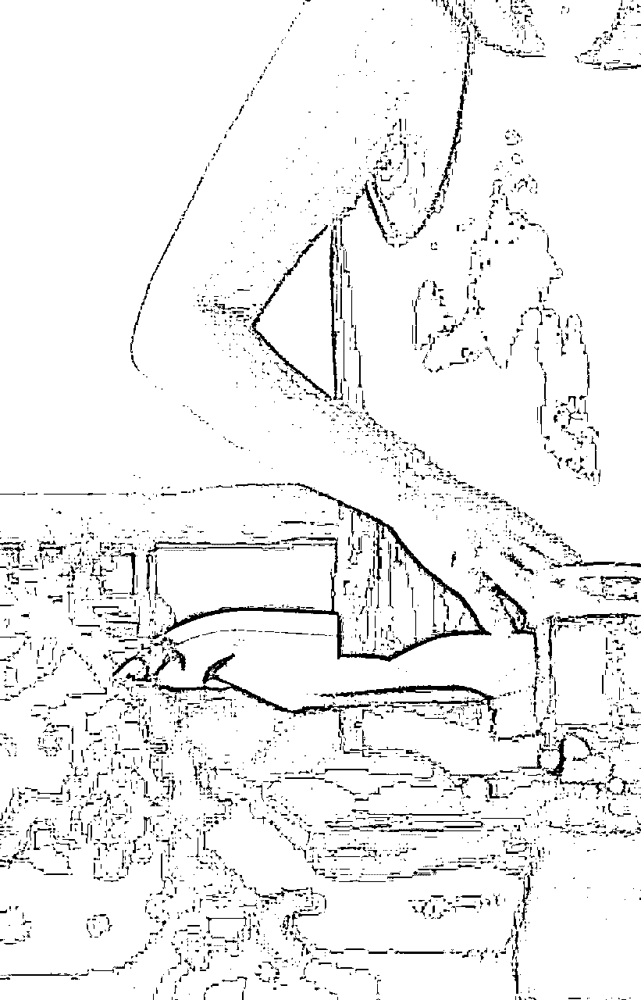

# 从月入7k到7w，利用美学打造朋友圈IP，一手握技能，一手变现翻倍

> 来源：[https://hvzdrpo5wk5.feishu.cn/docx/Oo5SdVUiCoDvG9x3BgDco1mSn2d](https://hvzdrpo5wk5.feishu.cn/docx/Oo5SdVUiCoDvG9x3BgDco1mSn2d)

大家好，我是白羊。95后线上自由创业者。大学毕业后有去大厂工作，但每个月只拿着7k的工作，还每天加班不断，身心疲惫，因为这份工作并不是自己喜欢的，因此也没有想要升职的欲望，于是在自己还在上班期间，我就开始不断投资自己，希望有一天可以做到不用上班也能赚到钱

现在的我过着一年前我所向往的生活。前段时间还去云南旅游了一趟。放在以前，只是一个打工人，没有多少存款，这是我从来想都不敢想，还能去距离自己所在城市那么远的地方去旅游。

虽然很想，但是没有钱的底气，告诉我去旅游，这是一种奢求，与其自寻烦恼，不如想也不去想。

直到现在，去回望，我才敢真正的确认，我过上了我以前所羡慕的生活，而以前的日子，我也肯定不会再回去。

命运的齿轮开始转动，是因为在我一个月到手只有6500的工资时，我花了5000投资自己，去学技能去提升，而且学的时候我就告诉自己，我一定要翻十倍赚回。

这不是头脑一热，我也不是重度韭菜，而是破釜沉舟。

当然，我现在早已赚回了学费。

我是农民的孩子，家人给不了我经济上的支持，所以我只能靠自己，而我也一直以来只靠自己。我没有只是不断的付费学习而不取结果，我是如果学习了，那我一定要取到结果。

因此今天的我也过上了不用上班就可以赚钱的理想的生活。

作为一个普通到不能再普通的人，我想说，只要你想你也可以。

具体我是如何取到这样的结果的，下面我会展开详细来说。

一.能量与有钱人的思维

之前有进过猫叔的社群学习个人IP，我记住了一句话，那就是，坚持看一本书50遍。因此从今年年初到现在，我一直在坚持执行这句话。

当《有钱人和你想的不一样》看到第5遍时，我也已经一个月可以赚到了5w，接着是7w，甚至10w。

为什么这本书能带来这样的结果？我想原因如下：

①.在这本书里我懂得了：有钱人的思维确实和普通人不一样。比如，有钱人去学习是以结果为导向，而普通人只会去想，我做不到怎么办，我会遇到哪些问题，这个课程要是不值怎么办，等等这些情况。

.

②.一个人的能量高低太重要了。能量提升了，钱自然而然就来了。

当我明白了这个道理，我开始不断的通过各种途径提升自己的能量，我也有去观察，当我能量提升时，确实会有很多钱开始源源不断地流向我。我是因为这本书获利，因此我也开始带着学员们开始每日正念打卡，比如类似一些这样的话语：

大家坚持下来的收获：

一个人如果每天只是焦虑，不知道做什么，那就会很迷茫，更不要说想要赚到钱了。所以第一件事先转念，让自己拥有正向思维，和更高的能量，这样不仅每天生活会越来越好，赚到钱也是早晚的事。

其实能够赚到钱好的项目重要，但一个人想要赚到钱的决心以及相信自己能够赚到钱的思维更为重要。

否则你可以看到很多人都是在不断的换项目以及花钱学习的路上。所以在365之约，我会建议大家学习先从打卡100天开始，不要着急，慢慢磨技能，只要你坚持下来了，结果一定不会差。

现在大多数人就是什么都想要，最后反而什么都没抓住，所以花钱学习的结果就是技能或者钱，至少要收获一样。

二.技能

朋友圈美学是通过摄影文案以及美学技能来打造个人IP的。所以我们会教大家会写文案，会摄影，以及做流量。

这些技能的学习不是一两天就可以学会的，至少需要三个月不断练习以及实践。那具体到朋友圈的打造，又是如何运用的呢？

1.朋友圈像杂志一样打造

我的朋友圈：

学员的朋友圈前后对比：

朋友圈的排版：可以不只是发一张图配图片，可以增加纯文字排版，或者三图连发的排版。

朋友圈的内容：生活圈/工作圈/认知价值圈/晒单圈/反馈圈

每天至少发5条圈，至少一条生活圈。通过学习，不只是说让你的朋友圈变得好看，更重要的是通过朋友圈闭环打造，每条圈与每条圈之间的逻辑连接，以及吸金文案，可以让你的朋友圈自动吸引意向，让客户主动来打款。让成交做到只吸引不骚扰。

.

学习海报日签制作

做日签的目的也是为了形成自己的风格，拥有自己的核心竞争力，先吸引到别人，最后再成交。

2.摄影——美图吸睛

美的东西谁都喜欢，美的图片谁都爱看。同样，如何利用美在朋友圈去宣传自己，我们是通过摄影来体现，毕竟摄影最直接，也是距离钱最近的技能：

朋友圈尽量不要都是大头贴，这样即使你长的再美，别人看多了，也会觉得一般。所以我们要增加氛围感，更要增加你想要突出的【松弛感】或者【有钱人的感觉】等等

也就是营造一种只属于你自己的人设感觉。这个人设不是说建议大家去虚假编造，你是什么样的，去突出什么感觉或者你想要的以及期待的感觉就好了。

拍图不只是单纯的拍图，更重要的是为了突出一种你的生活状态，以及你的价值体现。比如你给别人的是一种什么感觉？自律？自信？优秀？有钱？还是普通

所以朋友圈要学会晒，不只是晒单，更重要的是晒家庭，晒生活，晒价值观，晒初心……这样你的IP形象才会越来越丰富和立体。

.

说到晒，接着我们就要再继续说一说文案了

3.用文案攻心，写吸金文案

美图可以吸睛，让别人一眼关注到你，但想让别人被你长期所吸引，文案就无比重要了。

而我们的文案不是简单写写就可以，我们一要学会讲故事，二要学会写吸金文案

.

朋友圈讲故事（是为了充分的展示自己，当你朋友圈的好友知道你越来越多的故事后，自然而然就会对你更熟悉。成交的前提是信任，而朋友圈学会讲故事就是信任的基础）

只有你多写自己的故事，那你才会被更多人所记住，大家都爱听故事，所以把朋友圈的硬广换成故事，成交自然而然也就来了。

.

认知圈：短文案会起到精准的筛选作用，也是最能突出你的价值观的，所以用来筛选同频。而如果你的朋友圈缺少这部分的输出，可能就会有一些白嫖的人，或者与你不同频的一些人会来找你，而这些麻烦事可能会影响到你自己的势能，所以这部分的朋友圈一定不能忽略。

.

再就是朋友圈的文案排版

有诱惑力的朋友圈，一定是一打开圈，从首页就知道一条圈大概讲什么

跟文案提炼有关系，跟排版也有关系

如果是别人打开你的朋友圈要知道每条圈的基本内容，那在写文案的时候就得注意：

朋友圈列表文案显示1-2行是比较好的，如果要显示3行，文字最好紧湊，中间不要空行

如果想要显示1行，第一句话需要在13个字以内(包含标点符号)；

如果想要显示2行，第一句话需要在13-24个字之间；

如果想要显示3行，第一句话需要在24个字以上

感兴趣的大家可以测试。

4.公域引流

流量我主要是通过小红书和抖音，抖音不多，主要是小红书。做的也是朋友圈美学相关的方向：

因此流量也都很精准

我是矩阵做的红薯号，虽然粉丝不多，但引流过来都很精准，有很多人基本都是过来直接打款学习的：

做到今天这样的成绩，会做引流真的很重要。因为客单价相对来说比较高，我也没有试听课，所以基本都是做内容，吸引精准人群，然后大家来学习。

.

市面上小红书的课程也都很多，我想说的是做账号一定要坚持，掌握正确的方法之后，坚持最重要。

.

三.初心

以前我只想自己赚到钱，现在我更希望带着更多人赚到钱。内心丰盈，精神富足，技能在手，赚钱翻倍。

.

不只是带着大家学技能，更是希望大家可以在赚钱的同时找到自己。因此我希望可以带着100000＋女性打造自己个人IP的同时，更能赚钱翻倍。

从无存款的打工人到今天可以存款6位数，我用了整整2年。还是那句话，我所有的自卑都消失在日入3w的那一天。

我靠坚持和深耕取得了今天的成绩，同样我也相信，任何一件你想做的事情，只要坚持下来，也都可以开花结果。

如果大家对学习文案摄影或者打造朋友圈公域引流私域变现感兴趣，欢迎一起来交流讨论呀！