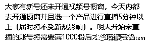
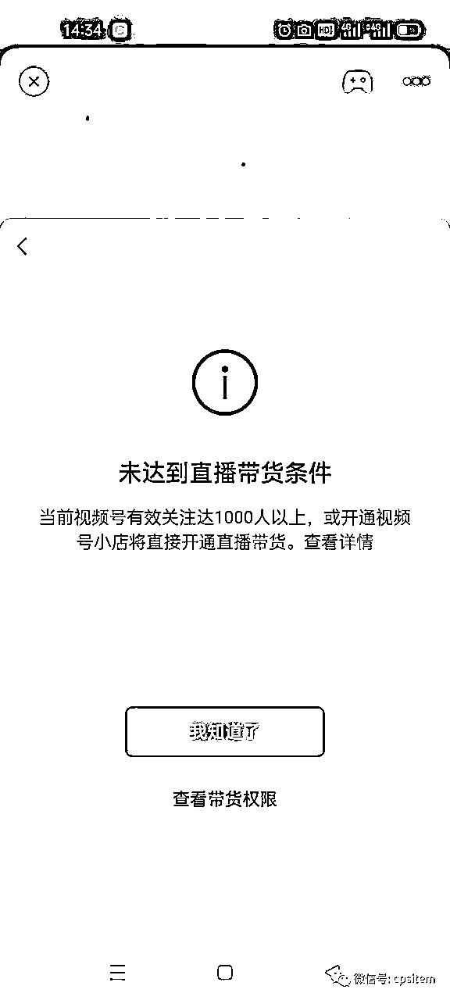
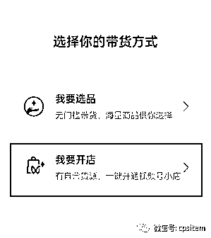
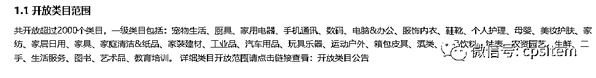
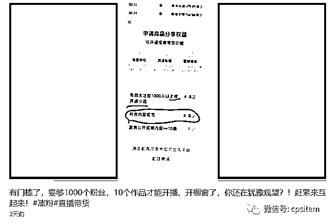
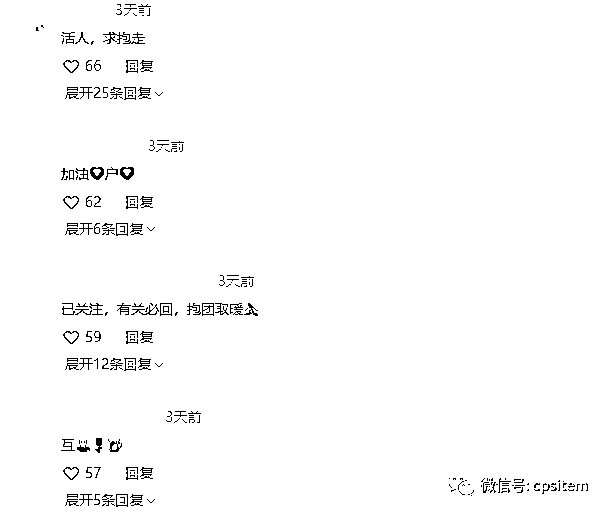

# 视频号直播带货需千粉，汇总一些目前的解决方案

> 来源：[https://uiv0uqamjmc.feishu.cn/docx/Oyqsdiq0LotmvSx4llwc3z25nie](https://uiv0uqamjmc.feishu.cn/docx/Oyqsdiq0LotmvSx4llwc3z25nie)

大家好，我是小马哥。

最近视频号带货比较火，我们也在围绕视频号来进行直播带货，不过前几天露出消息说以后需要满足千粉，就在昨天这个规则已经生效了。

昨天在开播的过程中便遇到这个问题：

根据官方提示，要求有效关注达到1000人，点击查看带货权限，基本就是橱窗带货权限开通，直播带货条件未满足。

不过在提示中提到或开通视频号小店，那么解决方案就有几个方式，一个是不断的围绕达到1k粉的有效关注目标来努力，另外一个便是开通视频号小店。

先整体说下几个目前我看到的解决方案：

1、S粉

2、互关

3、借助一些内容来进行涨粉

4、开通小店

开通小店：

这里面解决方案最简单的便是开通小店，先看下开通小店有那些步骤和方法。

这个步骤适合自己有办个体户或者企业营业执照的朋友来达到开通直播带货权限。

小店开通入口:进入视频号创作者中心（微信-发现-视频号-右上角人头的按钮-创作者中心），在创作者服务中有个带货中心

没有开通视频号的就需要先开通下了。

进入带货中心，如果你橱窗没有添加商品，会有提示前往选品或者开店

直接点击来进行选择

然后跟着官方的要求来开通就可以了。

https://support.weixin.qq.com/cgi-bin/mmsupportacctnodeweb-bin/pages/Koxn0qTlz0LdNfRW

链接为官方视频号小店开店指引内容

主要需要关注几个点，如果你只是为了直播带货而开通，类目方面就选一些开放类目

其他的内容跟着教程走即可，将自己的身份信息与企业的信息提交上去。

电脑端入口：https://channels.weixin.qq.com/shop

S粉

这个不多做解释，基本每个平台都有对应的业务，所以可以平常找下这类的渠道，至于他们是如何达成，是通过任务的形式还是样的，不得而知。

总之这类的方法可以快速涨粉，但是视频号是有效关注，所以实际S粉量与有效关注量就存在一个差距了。一方面有效关注量不知视频号是以什么规则来判断的。

所以各位采用这个办法的时候看着办。

互关

昨天在刷视频号的时候，发现有一些内容便是如此，同时评论区也是互关的一些评论，这个在抖音上玩，涨1k粉也是很多都这样的来进行操作。至于是否影响推流，这个不得而知。

借助一些内容来涨粉

这个方式就是没有营业执照，又不想通过其他方式来涨粉，最后一种的方式了。

内容涨粉很考验对内容、人群的了解度，以往我们在抖音上做中老年的内容，主要就是抄爆款，以及围绕中医相关的内容来进行涨粉。

不过换个平台，内容尺度审核是不一样的，以往在抖音上可以的，不一定在视频号上可以。

所以对于中老年中医类的内容，我们也在摸索中，如果你有这方面的内容经验也可以一起交流。

不过昨天在刷的过程中发现有一些人在用一套逻辑来发内容，至于涨粉如何不得而知，不过一些作品的互动还是可以的。

一张聊天记录截图，然后便是一个冲突类的内容，涉及婆媳类的

这个如何制作，其实就可以借助一些聊天制作软件，将对应的内容输入进去，如果想搞得逼真一些就直接用两个号来进行模拟对话，然后截图。

基本刷到好几个都是这样子来玩的。更多的玩法接下来也会慢慢挖掘出来。

而围绕中医类的个人账号的内容，目前发现的比较少，一方面这类的受管控，基本黄V蓝v的账号进行发布。

围绕这类的涨粉内容依然在摸索中，有在做这方面的也可以一起聊聊。