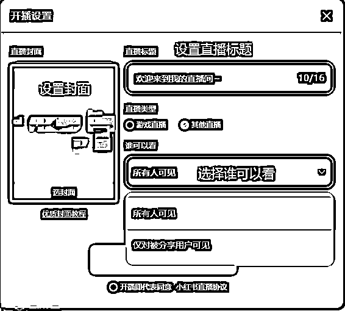

# 小红书电脑开播保姆级教程

> 来源：[https://oghxok13aq.feishu.cn/docx/P5xId1tlwoQQrYxh8SKcukUynjh](https://oghxok13aq.feishu.cn/docx/P5xId1tlwoQQrYxh8SKcukUynjh)

# 第一步，打开小红书后台

## https://www.xiaohongshu.com/explore

## 登陆后，点击右上角的电脑直播助手

# 第二步，下载电脑直播助手

## 目前小红书电脑直播助手仅支持win8，win10系统

# 下载安装好以后，打开电脑直播助手，界面是这样的

## 点击左下角的管理平台，进行直播计划创建以及上架商品

# 点击直播计划，立即创建

# 创建计划按自己的实际情况填写

# 创建完计划以后，点击查看

# 出现下面这个界面以后，点击添加备货商品

# 选择好要直播的商品以后，点击确定

# 开播后的商品选择就搞定了，备货列表会有你想要直播的商品了

# 确定以后，回到电脑直播助手

# 设置封面，设置直播标题，选择谁可以看

# 同意小红书直播协议，点击开始直播

# 现在就已经在直播进行中了，但是进入直播间，你会发现没有购物车

# 下一步，回到管理平台

# 点击实时跟播，点击添加备货商品

# 选择你想要卖的产品，点击确定

# 最后点击上架，这个时候，直播间就可以看见购物车了

