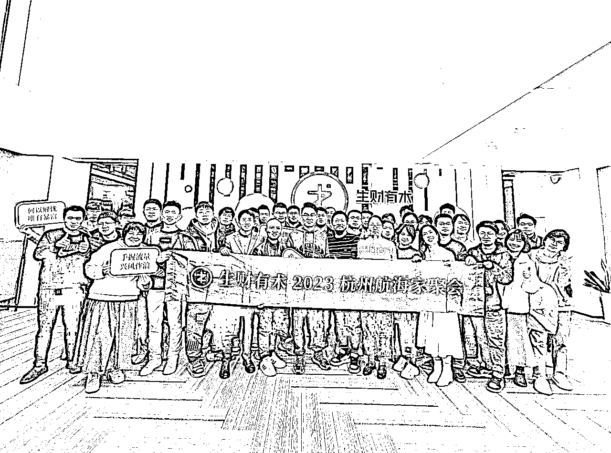

# ChatGPT一岁啦：我在AI前线实践，所看到的商业机会

> 来源：[https://w91h2gmtrn.feishu.cn/docx/PjhZdayZHoCFLExTorMctg3vnTe](https://w91h2gmtrn.feishu.cn/docx/PjhZdayZHoCFLExTorMctg3vnTe)

读前说明：

1、本文5200实战干货，干货内容较长，图片截图也较多，建议用电脑浏览器阅读更加高效。

2、欢迎圈友来链接和交流（微信：qiaobangzhu-cn），赚钱路上一起同行、一起成长！

3、乔帮主的AI实战训练营正在火爆招募中，全新的七大阶段的AI课程体系，手把手带大家玩转AI：

文章目录：

1、创始人介绍

2、公司及团队介绍

3、商业项目介绍

3.1、引流型产品：AI线上课程

3.2、信任型产品：AI线下课程

3.3、盈利型产品：企业AI解决方案

大家好，我是乔帮主。借着ChatGPT发布一周年之际，ChatGPT也满一岁啦，今天跟大家聊聊今年我在AI一线实践场景中所看到的商业机会。在这里也是直接拿出我最近参加项目路演的BP商业计划书，来跟大家进行干货分享。

前两周，先是去参加生财有术航海家的微天使项目路演：

然后又去参加了阿里校友项目路演专场（报名了50个路演项目，从中挑选了6个来路演，我这边的AI项目有幸被选中），从侧面也可以看的出，流量江湖、以及投资机构对AI方向项目的看好。

我这边就直接把我最近大半年做的AI项目和所看到的商业机会，拿出来跟大家做了路演，跟圈友、阿里校友、亦仁、VC风头做了很多交流探讨，有很多收获和心得，在此跟大家分享下。今天也是直接把我路演的商业计划书的PPT内容截取出来，希望对大家有所帮助。

不过说来也是有意思，虽然都是项目路演，在生财的氛围更加积极活跃，都是一群搞流量的新个体创业者，更加接地气，所以大多项目，都是前端偏向自媒体、短视频驱动流量型的项目。

而在阿里校友的氛围，就要严肃冷清多了。毕竟从阿里出来的人，在价值观和方向上，我们是要有更多大梦想的。所以大多路演项目，都是偏向面向用户的产品型项目。

接下来，跟大家详细聊聊这半年，我在一线实践，看到的AI项目和对一些商业机会的思考。我觉得一个靠谱的商业项目，有三个核心因素：创始人、团队、项目，如果要排个优先级的话，首先是创始人，其次是团队，最后才是项目。

# 1、创始人介绍

项目能不能干成功，能不能拿到结果，最后都会落到人的身上去执行，所以人才是项目的核心因素。而一个公司、一个团队去落实项目的执行，最终起到决定因素的，肯定也是创始人。

我在圈内经常分享，基本上大多认识我的人，也都熟知我乔帮主，也多多少少看过我之前的一些干货分享，在这里还是跟大家简单介绍下我：

创始人的认知、眼界格局和能力，是直接决定项目成败的重要因素。我在技术行业多年，最为擅长的还是技术的整体解决方案。其次，也做过讲师多年，尤其擅长培训体系（课程的开发和交付）。这些能力的基础，也是我后面组建团队、所做的项目方向重要依据。

# 2、公司及团队介绍

确定AI赛道方向后，我从6月份就开始组建团队，遇到了很多志同道合的人。团队整体组建过程还算比较顺利，如今线下团队5人，线上团队12人左右。

我在组建团队也是花了大量的时间精力，有意识、有规划、甚至提前于项目的去做这件事的主要原因，是因为我知道个人的能力有限，要想实现更大的目标，也必然是需要依靠团队去执行。很多时候，都在问项目的竞争壁垒是什么，我觉得很大程度，一个靠谱的团队绝对能成为我们强有力的竞争壁垒。

我创立的点金帮，点金帮不仅作为公司名，也作为品牌名，跟我个人名字“乔帮主”也相呼应，也是好记方便传播。

点金帮致力于为企业提供前沿的人工智能解决方案的领先公司。我们的团队由来自阿里、腾讯、字节、携程、等顶尖互联网巨头的核心成员组成，他们不仅拥有丰富的行业经验，而且平均学历均为知名大学的硕士或更高。这为我们提供了一个坚实的技术和知识基础。

作为国内最早的一批AIGC架构师，我们对ChatGPT等AI技术在企业级的应用与实践有着深入的研究和丰富的经验。我们也始终走在技术的前沿，致力于为创业者、为企业创造真正的价值。

# 3、商业项目介绍

最后就是到了商业项目，我们在AI赛道，究竟有哪些靠谱的商业机会，这也是我这边今年AI实践探索出来的一些项目方向。

## 3.1、引流型产品：AI线上课程

去年2022年11月30日GPT3.5刚推出的那几个月，市场红利来了，很多人通过卖账号、做社群赚了一波钱。然后今年上半年，一些知识博主、网红等，凭借AI的热度，进行直播卖课，通过线上知识付费课程，又赚了一波。比如李一舟，199的人工智能课程，在抖音就卖了三四千万。

其实我之前也跟大家聊过，流量型项目是不可持续的，为了追热点、为了追流量红利，有点像吃了这顿没下顿的感觉。这种流量型的项目，不可持续、不可长久的主要原因，就是流量没办法形成闭环。

前面大量成交低客单价后，虽然通过市场红利赚到了钱，但是后面没有信任型产品、没有高客单价产品，就没办法沉淀用户，就没办法让流量形成商业闭环，这本身也是一种通过运气赚钱的模式，也并非是通过能力赚到的钱。

今年下半年，虽然AI的热度有所下滑，但是AI在各行各业的应用和落地是未来必然趋势。现在大家更多的也是冷静下来看待AI到底能在自己的生活、工作和业务场景中怎么去落地应用，怎么去降本增效。

但是AI在市场上依然存在大量的认知差、信息差，这对我们商业来说，就是巨大的商机。在引流型产品这块，我们通过黑科技渠道，拿到市面上几百、几千、几万的所有AI课程（可以理解成为我们有全国最大的AI知识内容素材库）。结合我们自己的一线AI实践经验和实践内容，做出大量9.9块、99块、199等低客单价产品。用高价值产品 + 低价格快速获取用户流量，先让用户进门，这是我们首要做的目标。

市场上也有大量的AI相关课程，别人还在收取几千、几万的时候，我们直接九块九，算是用高价值降维打击了。

## 3.2、信任型产品：AI线下课程

其实很多人骂知识付费是割韭菜的原因，主要是线上录播课程，没有售后服务交付，加上很多人课程质量又是参差不齐。所以花了钱买了课，没有学明白，遇到问题也没人来指导等，就导致感觉被割韭菜了。

我们采用线下课程，在线下手把手的指导实战，目的也是为了加深品牌的口碑和信任。一旦和客户建立信任，后端不管是什么高客单价，客户都是愿意去付费买单。信任成交，是如今商业模式的核心底层逻辑。

我们线下课，也是我们核心的口碑+信任产品，我们主要有四款线下课产品：

AI初阶应用课：《ChatGPT教你学编程：普通人的编程入门课》

AI中阶实践课：《ChatGPT实战营：掌握GPT+多维技能，成为领跑AI时代的高效能人士》

AI高阶企业课：《ChatGPT企业级应用与实践——提高企业10倍生产力》

AI精品体系课：《AIGC应用与实践》

这四款线下课产品，其中有两款是最为核心的，一款是AI中阶实践课：面向大C小B，上周末刚举办了一次两天一夜的GPT线下实战课，口碑和好评度也直接爆炸，直接现场收了8个深度合作的合伙人。

AI中阶实践课：面向大C小B的AI赋能课，除了自己组织外，也主要跟有流量的社群、有流量的机构、渠道等直接合作，这样进行交付会更高效。我也更倾向跟有流量的直接合作，合作共赢也是我一直比较看重的。主要自己组织一次线下课，从招募宣传，到线下场地，再到物料准备、学员通知、售后服务、课程准备等方面，真的是太废人了。

然后再有一款就是AI高阶企业课：面向企业专场，最近三个月大大小小差不多交付了二十多场企业专场，我现在基本上每周都会固定交付至少2场以上的企业专场。

说到这，也都还在说我们线下培训，那我们现在主要做AI培训的？那当然不是了，我们的课程，不管线上还是线下，只是我们售前方案。只是为了让我们跟客户建立信任链接，只是跟我们做营销曝光而已。

因为B端的客户很难直接成交，加上国内现在AI在企业级的解决方案落地还比较早（AI技术虽然是个好技术，主要企业涉及流程、安全、业务业务复杂性等诸多问题），所以我们必须得用前置的低客单价产品+信任产品来切入，这样才能成交后端B端客户的高客单价。

但值得重点说的，低客单价的，有人是做社群的，有人是做线上课程的。信任型产品，有人是做线下培训，也有人是做陪跑训练营等，都是围绕引流产品、信任产品、利润产品这个商业产品模型而来。

不管什么样的产品形式，核心得选择适合自己的方式。线下培训，这块对培训交付的门槛和质量都要求很高，没有这方面的经验，是很难交付这块的。

以下这个表格，是我们跟企业成交的真实服务报价单，算是企业级AI解决方案的一个低配版本，都是些基础服务。里面包含了培训、咨询、账号、定制AI平台、企业智能知识库等。所以由此也可以看到，我们线上和线下课程都只是我们一个营销宣传方案，并不是我们核心服务。

## 3.3、盈利型产品：企业AI解决方案

接下来详细看看我们企业级AI解决方案，也是我们盈利性产品。为什么要谈企业级AI解决方案？因为AI是一个技术，而技术的真正价值就是在各行各业中的应用。

这半年，在一线的AI实践中，算是跑通的比较靠谱的几个项目方向领域，跟大家分享下：

第一个行业解决方案，我们切入了技术领域，

第二个行业解决方案，我们切入了教育领域，

第三个行业解决方案，我们切入了营销领域，

这都是我们这边跑通了，是我们现在正在做的事情。其他一些没跑通的项目，我就不提了。

在项目路演的时候，也有人提问说，做的领域方向很多很杂，没办法聚焦的问题。正如前面我提到的，我觉得生财的氛围特点是搞流量的新个体创业者，阿里校友氛围特点的是产品价值导向的团队创业者。

而我这边做的事情，更好是这两者之间的结合，即我这边通过知识付费+培训来搞流量，然后用企业服务及解决方案来升单。就如同社群的模式，会员费是基础流量池，私董会才是高阶盈利型产品，本质也是同个逻辑。

另外后面我也是想做成一家AI咨询解决方案的公司，汇聚流量和资源，后端是不是自己亲自交付，也显得不是那么重要。前期之所以在AI+技术、AI+教育、AI+营销多个领域的探索，也是想确认市场，以及相应试错，进一步确认真正适合自己、适合团队的赛道。

接下来，跟大家接着细聊下AI+技术领域、AI+教育领域、AI+营销领域具体的一些解决方案。

在AI+技术领域，第一个比较靠谱的解决方案，就是智能客服/智能知识库。智能客服/智能知识库，是现在AI领域算是比较成熟的解决方案，下图是我把今年上半年写的几十篇文章，合计20万字，投喂一个垂直模型，训练出来一个AI版乔帮主。

特别对于做IP的知识博主，我们可以把以前写的所有文章、朋友圈等内容都投喂给到智能知识库，这样它就可以成为一个AI版的你自己，你可以用它来跟你写更符合你风格的文案，也可以用它来帮你回答粉丝问题等。

那对于企业用户，可以把产品信息、企业知识库、客户信息等都可以投喂给到智能知识库，它不仅能替我们回答客户问题，也能帮忙内部培训员工，更是能针对不同客户，我们来对应出销售话术、出对应的方案等。

智能客服/智能知识库，以下是我们一个产品服务报价。这块我们也是通过低客单价产品切入，让用户先用起来，来逐步把这块需求给做深、做强。

在AI+技术领域，第二个比较靠谱的解决方案，就是AI定制开发。OpenAI的API，让我们能将AI的功能集成到我们自己的业务系统中，这也是企业级应用的基础。

比如用ChatGPT一个很大的问题，就是需要国际网络，国内根本访问不了。这对很多想用AI的个人和公司，无疑来说是一个很高门槛。所以为了解决这问题，那我们可以基于正规合法的API部署一个国内能访问的网站。

比如以下的一个AI网站，是我们内部合伙人开发的。李一舟课程中使用的AI网站版本，也是用的我们这边的源码进行部署的。

不仅我们可以根据客户的需求来定制开发，我们也可以基于API做很多工具，现在海外AI工具是个很不错的赛道方向。

在AI+技术领域，最后一个比较靠谱的解决方案，就是垂直模型。我们这边有国内做GPU硬件的资源，及一些找我做垂直模型私有化部署的单子，这块偏向模型微调，技术门槛非常高，当前我们也在跟清华智谱合作的，在推他们的ChatGLM的方案。

比如我们下面这个客户需求，涉及模型训练、算力、定制开发等诸多技术问题。对AI没有一定的技术能力，真还接不了这种大项目了。

垂直模型在国内的技术成熟度和整体解决方案还需要经过一定的市场实践和积累，不像ChatGPT、文心一言等这种公有云版本这么成熟。

当前这块我们也是以培训切入，来获取这块用户的链接和信任背书，也有很多企业找我们做ChatGLM大模型的技术咨询和培训。这块我敢说，国内除了厂家有这块技术能力外，国内没有人具备这块技术能力。而我们3月份，团队合伙人就买GPU服务器在部署这块服务在微调开发过，是具备这方面的技术能力的。

然后就是AI+教育领域，切入教育行业的解决方案。传统做教育的赛道，不管是K12教育、还是成人教育，这方面市场都已饱和。

AI作为一个新的技术，基本能颠覆所有行业。那在教育的课程内容体系这块，毫无疑问也是会引来大改革。所以AI+教育，也算是一个蓝海赛道。

当前我这边已经在合作（都是合伙级别）在做的，一个是跟一家咨询培训机构，直接把我们AI课程+解决方案打包在他们产品里面在跟企业卖。

另外一个合作，直接把我们的AI课程卖给了一家上市培训机构，赋能给到他们老师和培训体系，让他们具备这方面课程能力，这个也是我之前在培训机构做的课程顾问的事情。

还有一个合作，就是跟一家20年的IT培训机构（年营收2个亿），准备切入职场+AI全栈工程师赛道。他们做了20年的教育，整体招生渠道、培训交付等模式非常成熟。当前我们这边切入，主要负责AI课程体系的开发和赋能。我们年底前成立个合伙公司，明年准备干半个小目标。

最后一个就是AI+营销领域，用AI切短视频爆款文案的整体营销解决方案。AI+营销，本质是AI解决流量问题。我为什么把这个行业解决放在最后压轴，是因为我比较看好这个。其次是看好AI+教育领域，最后才是AI+技术领域。

我们这边跟一个做了十多年做短视频营销的在战略合作，他们在短视频矩阵号这块经验非常丰富。美学、培训行业、本地生活、新能源汽车是他们非常擅长的领域。

我这边AI切入，跟他们解决短视频文案的问题，一天最低产出一万条以上，然后他们用矩阵系统做混剪和分发，也可以结合定制数字人形象来做混剪。一天能用短视频矩阵，向公域推送几千、几万条短视频，这便是一张获客的大网。

其次他们B端流量客户的获取，就是直接跟有企业流量的机构、渠道直接合作，然后通过销转课去成交，我这边也负责整体课程体系的设计和交付。

所以这块我们的整体解决方案是：AI爆款短视频文案（培训） + 矩阵系统 + 数字人。

这块我们也是直接签了个70万和190万的大单，上周刚去高净值研究院做了交付。当时高净值研究院的院长，很兴奋的对我们说，传统行业，比如大健康、医美等行业卷的不行，AI智能营销算是他今年看到最有前景的项目。

用AI颠覆性技术解决企业营销获客的痛点，用技术解决流量，这事情对企业、对创业者是无法抵抗的吸引力，也足够有价值意义，也预计在国内掀起一番浪潮！

* * *

乔帮主的AI实战训练营正在火爆招募中，全新的七大阶段的AI课程体系，手把手带大家玩转AI：

* * *

往期干货精选：

往期干货合集：

微信：qiaobangzhu-cn，欢迎交流！

公众号：乔帮主的AI江湖

