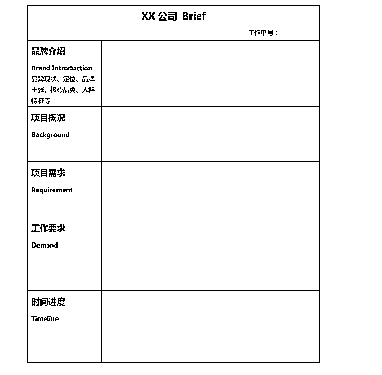

# 95年斜杠女青年靠商业文案小赛道，月收入突破十万

> 来源：[https://smxxze121r.feishu.cn/docx/QYcHddGGcoTPIlx74q4cPAR8nbe](https://smxxze121r.feishu.cn/docx/QYcHddGGcoTPIlx74q4cPAR8nbe)

# 自我介绍

哈咯，大家好，我是容棪，95年斜杠女青年，目前主要做商业文案服务以及AI训练营，单商业文案的月收入平均可以达到3-5万，赶上大促的消费节日周期突破月入十万。今天来和大家分享一下我是如何一步步升级打怪靠着这个赛道从全职社畜转为工作室自由职业者的。

大致的经过是，内容类工作全职工作两年，离职在云南小住半年的同时接单子，成都两年创建了工作室，一直到现在在杭州开启自由之路。

早在大学的时候，我就很喜欢写点东西，在参加了一些比赛获得一些不错的结果之后，开始思考能不能靠写东西来赚点零花钱，一开始也是各种尝试，写过小说、做过公众号代运营，当过当地创业服务中心的采编······

基本上和文字相关的工作我都尝试过，而在这个尝试的过程中，我也发现，各种类型的文案各有利弊，而最适合新手入门的就是商业文案。因为门槛不算高、市场需求多、未来前景好。

2019年我刚刚工作，在一家互联网大厂做内容运营，也是从那时候开始，我真正接触到专业的商业文案，同时也开启了副业之路。

先晒一下今年双十一几笔大收入，零碎的小单子就不放啦~扣去分给工作室小伙伴的部分，咱再次突破了月入十万！！！

接下来的长文内容包含商业文案的基础教程，感兴趣的小伙伴可以一起交流。

# 一、关于商业文案的简述

## （一）什么是商业文案

商业文案来源于广告行业，主要就是用文字来推广或销售产品、服务、品牌或理念的写作方式，其目的是吸引潜在的客户，增加他们的兴趣和信任，最终促使他们采取行动，比如购买、订阅、注册、咨询等。

简而言之，商业文案就是用来推销产品和服务，而我们写文案的就是说客。所以有一条贯穿所有商业文案的底层逻辑：首先就是吸引、其次就是传播、最后就是说服。

吸引：你的文案一定是要接地气，让别人听得懂，能够满足受众的需求。

传播：传播以人的大脑为终点，在正式动笔之前一定要搞清楚受众的所思所需所想。

说服：论据合理，循序渐进，引导用户购买付费。

既然是为了营销推广，那么自然绕不开营销必须要懂的4p理论，这里简单说一下:

产品：产品是什么，能够打动用户的需求的痛点和优势

价格：定价策略，市场上的竞争优势

渠道：推广发售的渠道，渠道的用户画像

宣传：营销的内容方式，提高转化率的细节

以上就是一篇合格的商业文案在正式接单子动笔之前必须要搞清楚的基本常识。

## （二）商业文案的类型

商业文案的类型主要包括品牌宣传语、朋友圈文案、视频脚本、种草文案、电商详情页文案、品牌故事、品牌新闻稿、投放文案等等。

下面给大家列举几个例子，可做参考：

1.产品说明书文案

产品说明书文案是商业文案中最常见的一种类型。它的主要目的是向消费者详细介绍产品的功能、特点和使用方法。好的产品说明书文案应该简洁明了、语言通俗易懂，让消费者一目了然。在创作产品说明书文案时，要注意以下几点：

*   抓住产品核心卖点：突出产品的亮点，让消费者一眼就能看到产品的优势。

*   使用简洁明了的语言：避免冗长的句子和复杂的词汇，让消费者轻松阅读。

*   注重实用性：以消费者需求为导向，提供详细的使用方法和建议。

案例：某智能手机的产品说明书文案

标题：轻松掌握，畅快体验！

内容：尊敬的用户，感谢您选择我们的智能手机！为了让您更好地了解和使用本产品，特制定以下说明书。

·产品简介

本智能手机采用高通骁龙处理器，运行速度快如闪电，让您享受流畅的操作体验。配备高清屏幕，色彩鲜艳，视觉效果出众。此外，内置多种实用功能，满足您的日常需求。

·功能介绍

（1）快速充电：采用先进的快充技术，充电速度提升50%，让您节省更多时间。

（2）人脸识别：精准识别面部特征，为您提供安全、快速的解锁方式。

（3）智能助手：一键呼出，为您提供语音助手、日程管理、通知提醒等功能。

·使用方法

（1）充电：将充电器插入手机充电接口，根据充电指示灯进行充电。

（2）解锁：将手指放在指纹识别区域，即可轻松解锁手机。

（3）开启应用：轻轻一划，即可开启您喜欢的应用。

2\. 营销推广文案

营销推广文案是为了吸引潜在客户，提升产品销量和品牌知名度而创作的商业文案。这类文案要具有强烈的吸引力，让人一看就想深入了解产品。在创作营销推广文案时，要注意以下几点：

*   设定明确的目标：明确文案要达成的目标，如提高关注度、增加点击率、提升转化率等。

*   抓住消费者心理：了解消费者需求，把握消费者痛点，创造出符合他们期望的文案。

*   运用创意手法：运用各种创意手段，如对比、排比、夸张等，让文案更具吸引力。

案例：某电商平台的营销推广文案

标题：限时抢购！全场低至5折！

内容：

亲爱的用户，为了感谢您一直以来的支持，本平台决定开展限时抢购活动！千款商品低至5折，优惠力度史上最大！错过这次，再无如此实惠！

3\. 品牌塑造文案

品牌塑造文案是为了提升品牌形象，彰显品牌内涵而创作的商业文案。这类文案要具有较高的文学价值和审美价值，让人产生共鸣。在创作品牌塑造文案时，要注意以下几点：

*   突出品牌特点：挖掘品牌的核心价值，将之融入文案中。

*   运用修辞手法：如比喻、拟人、对仗等，增强文案的艺术性。

*   情感共鸣：以故事、事件等为载体，引发消费者的情感共鸣。

案例：某高端茶叶品牌的文化文案

标题：岁月如茶，品味人生

内容：

茶，是一种生活方式。在繁忙的生活中，泡一杯好茶，品味岁月的沉淀，感受生活的美好。我们的茶叶，源自千年传承的茶园，汲取大自然的精华，以匠心精神炮制而成。每一口茶汤，都蕴含着辛勤的汗水和时光的印记。让我们一起，品味岁月如茶，感受生活的真谛。

商业文案的类型繁多，每种类型都有其独特的特点和应用场景。掌握各类型文案的创作方法，将有助于提升我们的文案写作能力。在实际操作中，我们要根据目标受众、传播渠道和市场需求，灵活运用不同类型的商业文案，为企业创造更大的价值。

## （三）商业稿件与新媒体文的区别是什么？

商业稿件是指为推销产品、服务或品牌而创作的文字材料，其目的是引起消费者的关注、兴趣和购买欲望。商业稿件的特点如下：

（1）注重事实性：商业稿件通常会强调产品的功能、特点和优势，以便让读者了解产品的实际价值。

（2）逻辑性强：商业稿件的结构一般为“发现问题、解决问题、展示解决方案”，以便让读者跟随作者的思路，深入了解产品。

（3）语言简练：商业稿件要求文字简练、易懂，避免使用过于复杂的句子和生僻词汇。

新媒体文是指在互联网平台上发布的、以吸引和互动为目标的文字内容。新媒体文的特点如下：

（1）个性鲜明：新媒体文注重表达作者的观点和态度，具有很强的个性特点。

（2）互动性强：新媒体文通常会设置话题，引导读者参与讨论和互动，增加文章的传播效果。

（3）形式多样：新媒体文不仅包括文字，还可能包含图片、音频、视频等多媒体元素，形式丰富多样。

商业稿件与新媒体文的差异

·目的性差异

商业稿件以推销产品、服务或品牌为目的，关注产品的功能、特点和优势；而新媒体文以吸引和互动为目标，注重表达作者的观点和态度。

·内容风格差异

商业稿件要求语言简练、逻辑性强，尽量避免过于复杂的句子和生僻词汇；新媒体文则更注重个性表达，可以运用丰富的修辞手法和表达方式。

·互动性差异

商业稿件往往不具备很强的互动性，而新媒体文通常会设置话题，引导读者参与讨论和互动，增加文章的传播效果。

## （四）商业稿作者为啥收入高？

接下来，我们来谈谈商业稿作者收入高的几个原因。

1.高度的专业素养

商业稿作者需要具备较高的专业素养，包括深厚的文字功底、市场营销知识以及行业洞察力，能够准确捕捉产品的卖点，把握市场的脉搏，为客户量身定制具有吸引力的商业稿。这种专业素养的提升，不仅有助于提高稿件的质量，更能为作者带来更高的收入。

2\. 敏锐的市场洞察力

商业稿作者需要具备敏锐的市场洞察力，以便抓住市场的热点和风口。这样，他们才能创作出符合市场需求、具有时效性的稿件。例如，在疫情期间，很多作者迅速捕捉到口罩、消毒液等产品的市场需求，为相关企业创作了大量商业稿，从而获得了较高的收入。

3\. 持续的学习和积累

商业稿作者需要不断地学习和积累，提高自己的知识储备和创作水平。这包括关注行业动态、研究竞品、学习营销策略等。只有这样，他们才能在创作中游刃有余，为客户提供更有价值的服务。

4\. 良好的沟通和协作能力

商业稿作者需要与客户、策划、设计等团队成员保持良好的沟通和协作。这样才能确保稿件符合客户需求，顺利进行后期推广。同时，商业稿作者还需要具备一定的谈判能力，以便在合作中争取到更高的稿费。

5\. 多元化的创作技巧

商业稿作者需要掌握多种创作技巧，包括故事营销、情感诉求、痛点挖掘等。这样，他们才能根据不同的产品和市场策略，灵活运用各种技巧，提高稿件的吸引力。

6.市场需求巨大

商业稿作者面对的是一个庞大的市场需求，无论是大型的企业、品牌、机构，还是中小型的公司、店铺、个人，都需要通过商业文案来展示自己的形象、理念、价值和故事，从而吸引和留住客户，提高自己的竞争力和收益。因此，商业稿作者的客源是非常广泛和稳定的。

商业稿作者的收入与他们的影响力也是成正比的，一般来说，商业稿作者会通过自己的作品和案例，来建立自己的品牌和口碑，从而获得更多的认可和推荐，进而获取更多的客户和合作。

商业稿作者还可以通过自己的平台或渠道，来传播或互动自己的信息、观点、感受或故事，从而增加自己的知名度和影响力，进而获取更多的收益

# 二、商业稿件的价格

## （一）不同类型商业稿件价格区间

这里是容容这么多年以来根据市场的报价来做的一个整理，可以作为参考：

1\. 传统类文章：如新闻稿、演讲稿、征文、工作笔记、读书笔记等。稿费千字50-200元，可按自身时薪收费，根据客户预算调整。

2\. 新媒体渠道商业文案：如小红书种草文、朋友圈宣传文案、微博宣传文案、产品宣传文案等。稿费千字100-200元，按实际字数收费。如100字小红书文案最低价10元/篇，800字小红书文案则为80元。

3\. 短视频脚本文案：包括信息流脚本、口播脚本、剧情脚本等。信息流和口播一般一分钟30-50元，量大可降至几元一分钟。新手市场价格一分钟30-50元练手可接受。成熟作者一分钟50-100元起，粉丝多的博主可承受。剧情类脚本难度大，收费较高，一分钟50-200元，能力强者一分钟500元也完全可以。

4\. 专业营销类稿件：千字200-500元起，最高可达千字1000元。要求作者具备高能力、丰富案例，涉及市场研究、用户研究、文字撰写、文案专业能力等。需重新取标题、罗列大纲并撰写新内容，原创度高。

以上报价仅供参考，具体价格还需根据市场状况和客户预算调整。不断提高自身能力，扩大客户群体，才能在竞争激烈的市场中脱颖而出。

## （二）报价技巧（6个维度分析）

1.甲方公司规模

了解对方公司的规模和业务类型，可以通过工商局网站等途径获得信息。如果是大型汽车制造或金融公司，可以适当提高报价；如果是普通淘宝店铺，则应该知道他们不太可能愿意花大笔费用来委托文案撰写。

国有企业通常慷慨大方，以前容容在成都负责包装了某大酒厂公众号一年，每篇的价格都在500以上，内容并不复杂，基本上都是新闻稿。

简单来说，根据对方公司情况，可以预估对方在文案上可能会花费多少钱。

2.个人水平

作为在校学生，你不太可能给一篇产品文案报价超过500元，如果你在某个领域有2-3年经验，比如时尚、影视行业，那么可以报价500-800元一篇，如果是长期合作，你可以自行决定是否给予优惠。目前，我们团队成员对外报价大约在1200元。

3.稿件类型

产品软文类一般不会超过1000元一篇，新闻稿加深度分析的一般不会超过1500元一篇，大篇幅案例分析一般不会超过4000元一篇。剧本、脚本的报价要视视频长度和创意难度而定，长篇小说等按千字报价。对于刚起步的撰稿人来说，可以从200-300元一篇开始，慢慢积累经验，等自己水平提高后再逐渐提高报价。

4.字数和交稿时间

可以与客户商议，对于1500字以内的稿件价格，超过1500字的可以设置一个价格梯度。此外，要考虑客户需要投稿的时间，如果客户在当天提出需求，并希望当晚即交稿，可以适当增加报价。对于金融、汽车、时尚等领域的文案，由于难度较大，可以适当提高报价；而淘宝商品、消费品、励志故事类等则可以稍微降低价格。

5.根据工作时间报价

如果遇到自己不确定如何报价的需求，可以评估自己完成该任务所需的时间，并根据自己的标准来设定价格。例如，接到一部微电影剧本，预计需要一天时间才能完成，可以将自己的工时与对应的时薪相乘，得出一个估计的报价。

6.根据当地价格行情

如果客户公司位于北上广等一线城市，相应的文案价格会稍高一些；如果是三四线小公司，很可能无法提供高价。对于包月的文案需求，比如一个月需要写10篇文章，你需要考虑本地市场上全职文案的薪资水平，例如上海的全职文案大约薪资为10,000元，那么你可以报价8,000元左右。

# 三、一篇商业软文是怎么写成的

## （一）分析软文目的、背景、产品优势和用户

在开始写商业软文之前，我们需要先进行一些基础准备工作。

首先，我们要明确软文的写作目的，是为了获得更多的潜在客户？还是为了加强品牌形象？

然后，我们要了解软文的背景，即所涉及的行业领域和竞争对手情况。

接下来，我们要梳理出产品或服务的优势，以及目标用户的特点和需求。只有全面了解这些信息，才能更好地编写商业软文。

以一款智能家居产品为例，我们的目标是让消费者认识到这款产品的智能化、便捷性和安全性，从而产生购买欲望。在分析背景时，我们需要了解目前智能家居市场的现状和发展趋势，以及竞品的情况。接下来，挖掘产品的优势，例如节能、智能互联等，并分析用户的需求，如舒适、便捷等。

## （二）软文的架构方法

商业软文的结构应该清晰简洁，用词精准明确。一般来说，可以采用以下架构方法：

有了目的和产品优势，我们接下来要考虑如何搭建软文的架构。一般来说，商业软文的架构可以分为三个部分：引子、内容和结尾。

1\. 引言：通过引用相关统计数据，或者提出一个引人入胜的问题，引起读者的兴趣。同时，可以在引言部分简单介绍产品或服务。

2\. 产品或服务介绍：突出产品或服务的核心优势，并结合实际案例进行说明。这一部分应该尽可能详细地介绍产品或服务的特点和功能，以便读者对其有一个全面的了解。

3\. 用户评价：通过引用客户的评价或者分享用户的使用体验，增加产品或服务的可信度。这一部分可以结合不同用户的情况，体现产品或服务的广泛适用性。

4\. 解决方案：根据用户的需求和痛点，提供相应的解决方案。可以结合实际案例，详细列举解决方案的步骤和执行方法。

5\. 总结和呼吁：总结产品或服务的优势和解决方案的有效性，并引导读者进行购买或行动。

以下以一款智能家居为例：

家里的电费为什么总是居高不下？是不是感觉用了智能家居产品就能解决这些问题呢？

近年来，智能家居市场呈现出快速发展的趋势。据统计，我国智能家居市场规模已达到百亿元级别，而且这个数字还在不断增长。在众多智能家居产品中，一款备受关注的智能电器吸引了消费者的目光。它到底有何魅力呢？

这款智能电器采用了先进的节能技术，相较于传统电器，它能节省30%的能源消耗。此外，它还具备智能互联功能，让家居生活更便捷。

张先生是这款智能电器的忠实用户，他表示：“自从用了这款产品后，家里的电费明显下降，而且操控起来非常方便。以前出门还要担心家里的电器是否关闭，现在完全不用担心这些问题了。”

如果你也想体验智能家居的便捷与节能，不妨试试这款产品。现在购买，还可享受优惠券和免费安装服务。赶快行动吧！

## （三）怎么提高软文写作能力

在这里容容根据自己的经验给大家分享一下自己的经验：

1.明确目标受众

在撰写商业软文之前，首先要明确目标受众。了解读者的特点和需求，可以帮助我们更好地定位和编写软文。通过分析受众的年龄、性别、职业等信息，我们可以确定合适的语言风格和表达方式，从而提高软文的针对性和吸引力。

案例分享：以某健康养生品牌为例，他们的目标受众主要是年轻女性，那么在写软文时，我会选择活泼轻松的语言风格，结合年轻女性关注的话题，如美容护肤、健康饮食等，以吸引读者的注意力。

2.商业软文的目的是推销产品或服务，因此在文章中要充分展示其优势。

可以通过列举产品或服务的特点、功能或效果，以及与竞争对手的比较等方式，让读者更好地理解和认可我们的产品或服务。

案例分享：某电商平台在软文中突出了其丰富的商品种类、物流快速，以及用户评价高等优势。通过具体的数据和用户的真实评论，增加了软文的可信度和吸引力。

3.在软文中，案例是非常重要的。

通过引用真实的案例，可以更加直观地展示产品或服务的实际效果和用户的真实体验，从而增加读者的信任和购买意愿。

案例分享：某教育机构的软文中，分享了几个学员的成功案例，从上课前的迷茫到获得明显进步的转变，让潜在学员对该机构的教学质量产生了兴趣和信心。

4.结合实际行动提供解决方案

除了展示产品或服务的优势，还需要给读者提供切实可行的解决方案。通过详细列举解决方案的步骤和执行方法，以及提供相应的工具和资源，可以帮助读者更好地实施，从而提升软文的实用性和影响力。

案例分享：某投资理财平台的软文中，分享了一个逐步实施的投资理财方案，包括选股、资金分配等具体步骤和方法。通过实际执行的案例，让读者更加明确如何进行投资，增加了软文的可操作性和参考价值。

最后，要想写出高质量的软文，需要具备一定的写作能力。以下是我的一些建议：

（1）多阅读：阅读优秀的软文和文案，学习他们的写作技巧和思路，为己所用。

（2）善于观察：关注时事热点、行业动态，敏锐地捕捉有价值的写作素材。

（3）培养逻辑思维：写作前先构思好整体架构，让内容条理清晰，易于理解。

（4）善于沟通：与产品、设计、市场等部门保持密切沟通，了解产品背后的故事和用户需求。

# 四、商业稿件的接稿流程

### （一）确认双方需求

在正式接到稿件之前，我们首先要和客户进行沟通，明确双方的需求。例如，确定稿件的主题、字数、关键词等。通过与客户交流，我们可以更好地了解客户的需求，为稿件的创作提供参考。

案例分享：我曾接到一家电商公司的商业稿件任务，他们要求我为他们的新产品撰写一篇宣传文案。在与客户的沟通中，我了解到他们的产品特点是高品质、环保，并且适用于各个领域。根据这些需求，我制定了一个初步的创作方案。

### （二）归纳总结信息

在与客户交流后，我们需要对收集到的信息进行归纳总结。这一步骤非常重要，因为只有清楚地了解客户的需求，我们才能更好地进行创作。在归纳总结信息时，我们可以根据关键词或者主题将信息分类整理，为稿件的创作提供参考。

案例分享：

回到上述的电商公司的案例，我在收集到的信息中发现，他们的产品特点是高品质和环保。因此，在创作过程中，我注重突出这两个特点，并且通过一些实例来说明产品适用于各个领域。这样，可以更好地吸引读者的注意力。

### （三）制定创作计划

接下来，我们需要制定一个创作计划，明确稿件的结构和内容。创作计划可以包括所要表达的核心观点、每个段落的主题和要点，以及如何进行结尾等。有了一个明确的创作计划，我们在写作过程中就能更好地遵循一个逻辑，提高稿件的质量。

案例分享：

回到电商公司的案例，根据客户的需求和信息归纳总结，我制定了以下创作计划：

第一段，引入产品的特点；

第二段，阐述产品的优势；

第三段，举例说明产品的应用场景；

第四段，总结产品的价值。

通过这样的创作计划，我可以有条理地进行创作，使得文章更加清晰明了。

### （四）撰写稿件

在完成了前面的准备工作后，我们可以开始正式撰写稿件了。在写作过程中，我们要注意文风的选择，尽量符合客户的要求和产品的特点，并且要注意语言的精炼性和可读性。同时，我们还需要根据创作计划逐步展开，确保整个文章的逻辑性和连贯性。

案例分享：

在撰写电商公司的商业稿件时，我采用了简洁明了的文风，突出了产品的优点，并通过具体的事例来说明产品的应用场景。在每个段落中，我都注重了逻辑的连接，使得整个文章更加连贯。

PS：这里给大家一个广告行业常备的brief模板，可以更好地和需求方沟通文案需求。

# 五、接稿渠道，自由撰稿人的未来

如果是纯新人，没有任何的文案合作案例，自己也不知道怎么去写案例，也不知道写哪方面的案例，想积累案例，那推荐给大家以下几个方式去尝试。

1.豆瓣各个文字类小组查看合作机会

豆瓣有很多文字类的小组，都会招一些文字类的兼职作者，这些稿费都不高，但是有很多比较简单些是长期合作的项目，有时候不会要求，必须得有案例，但是可以先选择试稿，试稿通过则正式合作。

像以上这个小组，基本上每天都会更新很多文字类的兼职信息，很多客户在找作者的时候，除了去淘宝等代写店铺找写手，就是去豆瓣各个小组发合作需求，所以大家可以去豆瓣探索更多可以去寻找合作的文字小组。

2.BOSS直聘、智联招聘、58同城

这些招聘平台上基本上有很多招聘兼职作者的需求，特别是boss直聘，非常适合咱们兼职作者去寻求合作。如果你是处于大城市，可以直接去找相关城市的兼职作者，这样可以线下面谈。

这上面有特别多的合作需求，在寻求合作的时候，给对方发送应聘消息时，可以带上自己的案例。这样客户如果觉得你的案例适合他们的需求，会第一时间联系你。

不同作者在boss直聘上都能找到的不同阶段的稿费合作，优质作者带上自己的优质案例，同样可以找到千字几百甚至上千的合作机会。

我当初去给各大平台合作文案就是从BOSS直聘上获得了一个机会开始的，然后合作完又获得了很多客户的转介绍。包括我们团队的小伙伴，都是在我的建议下去这上面找合作，拿到了上千元一篇的稿费机会。

所以大家可以大胆尝试，机会真的很多，只是看自己适不适合某类写作，看看稿费是否适合~

一般低于千字30元的话就建议少尝试，因为价格偏低，但如果是特别简单，那么就可以忽略不计。

3.运营自己的公域平台，打造个人品牌

第3个渠道最难做，但是也是对自己长期发展最有利的一种方式。

大家可以尝试做小红书、抖音、知乎、淘宝代写、闲鱼代写等等平台，通过做平台来打造个人品牌，或者是宣传自己是写文案的作者，以此来获得更多的合作。

以上这三类的合作渠道是我们平日比较常用的，大家都可以去尝试，还给大家再介绍几个需求比较多，但是合作机会概率不是很大的几个渠道。

4.圆领、甜薪工厂、猪八戒、自由人。

以上几个渠道有APP也有小程序形式，我也摸索过，但是我个人觉得可能对于咱们想做的来说，前面三种主要的渠道就已经足够了，主要这些都要会员付费，具体的可以参考一下使用者的评价。

这里分享一下如何制作自己的作品集：

1.作品集制作格式与大小

我们建议使用PDF格式（首选）或PPT格式（次选）来制作个人作品集。文件大小最好控制在15M以内，尽量不要超过20M。另外，您也可以在微信公众号上创建一篇推送，并进行精美的排版。

为什么首选PDF格式？原因有三：

- 避免因为格式问题被当成垃圾邮件；

- 避免因电脑系统问题导致无法打开或出现乱码等问题；

- 避免因附件大小而受到网络速度限制，影响打开速度。

2\. 作品集内容筛选技巧

作品集的目的是让雇主全面了解您的能力。但是不同岗位对于所需能力的需求也不同，因此，内容的筛选要根据客户需求和自身职业情况进行针对性的分类和排序。

开头部分需要展示自己的优势、经验和在领域内的突出表现。例如：“XXX，五年经验的资深文案，是简书和喜马拉雅的签约作者，曾为***等知名客户提供服务。”

接下来进入作品页：

- 作品要按照类别进行划分，以展现综合实力；

- 将与需求方最相关的项目放在最前面，然后是间接相关的项目，最后是日常积累的作品；

- 近期高质量的项目应该放在前面，视觉冲击力强的日常作品放在最后，以高质量项目开头吸引关注，再以高质量项目结尾增加印象分。

3.作品集整体风格

制作作品集时，请注意以下要点：

- 简洁大方，视觉风格舒适即可，避免过度包装；

- 区分作品集信息的优先等级，适当进行设计，但不要喧宾夺主；

- 对于每个项目添加背景说明、设计思路等有助于提升需求方对您的评估；

- 避免将作品整合成长图，以免文件过大、不易观看、版式设计难以统一、长度难以控制等问题。

4.作品集页面及封面设计注意事项

- 页面规格：推荐使用横版页面，避免竖版页面导致阅读不便；

- 封面、封底：精心设计封面，给甲方留下良好的第一印象；

- 背景用色：推荐使用白色或浅色，避免颜色间相互影响；

- 文字用色：安全选择黑白灰系列；

- 字体：使用无衬线字体，如方正兰亭系列；

- 积累和调整：作品集是长期积累的成果，要及时更新和调整，根据不同职业需求进行区分。

最后，建议准备两份作品集：一份完整版，记录所有项目及日常作品；另一份可以根据需求随时调整。

# 六、叠加AI，效率666

商业文案写作是一项需要花费大量时间和精力的工作，尤其是在面对复杂和多样的需求和项目时，商业文案作者可能会感到压力和困难。幸运的是，今年随着AI技术的发展，商业文案写作也可以借助AI的力量，来提高效率和质量，实现更好的结果。这里就不得不感谢生财有术，最开始了解到chatgpt就是通过这个圈子，进而跟着实战手册学习，认识了一批玩赚Ai的大神，付费学习，快读运用到商业文案上面，拥有了最强辅助！

AI在商业文案写作中的应用，可以分为以下几个方面：

*   信息获取：快速和准确地获取和整理相关的信息和素材，比如行业动态、市场分析、产品评价、用户反馈等，从而节省商业文案作者的时间和精力，提高商业文案的客观性和权威性。

*   内容生成：自动和智能地生成和优化各种类型的内容，比如标题、内容、结构、文采等，从而节省商业文案作者的时间和精力，提高商业文案的文采和说服力。

*   质量检查：检查和修改商业文案的质量，比如语法、拼写、标点、格式等，从而节省商业文案作者的时间和精力，提高商业文案的规范性和准确性。

*   效果评估：评估和反馈商业文案的效果，比如阅读量、点击率、转化率、收益等，从而节省商业文案作者的时间和精力，提高商业文案的影响力和转化力。

通过使用AI，商业文案作者可以将更多的时间和精力放在更重要和更有创意的部分，比如分析、构思、修改等，从而提高自己的水平和质量，同时也可以获得更多的机会和收入，实现更好的结果。

这里给大家展示一下一些使用ai写文案案例（需要魔法）

案例一：短视频脚本

https://chat.openai.com/share/1a7828fa-9cd2-4749-96b0-1b3b19a472ee

案例二：小红书爆款标题模型

https://chat.openai.com/share/5e14d7db-c843-47d0-8545-f793b557392d

最后，作为商业文案的自由撰稿人，要耐得住前期的寂寂无闻和低收入，毕竟一开始可能月入也许只有几百到一千，但仍然要坚持修炼自身，同时学会利用公域宣传自己，才能慢慢对接到优质的B端客户，针对他们的需求推商业文案的包年服务、企业AI文案写作的培训服务以及提示词定制服务。

当你的接单量越来越大的时候后，你就要学会合作，但是考虑到合作伙伴的水平参差不齐为了保证效率，容容可以提供一个思路，那就是开设相关的培训课程，亲自花时间培训一批靠谱的写手，可以是是收费方式也可以是押金方式，主要就是希望学员能够实时认真学习，也是为后期团队培养核心成员。

最后渐渐放手一些小单子或者难度不大的单子给大家，这个时候要学会分钱，比如谈的单子报价1000，那容容一般取2~3成，其他的都给写手。

感谢诸位看到此处，欢迎有兴趣的小伙伴交流哟~