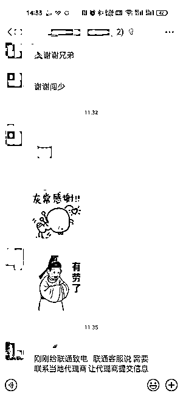
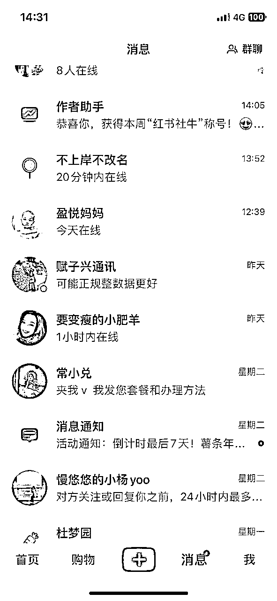
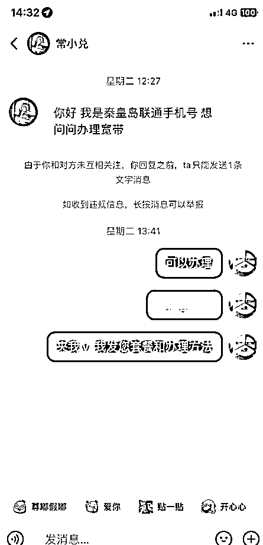
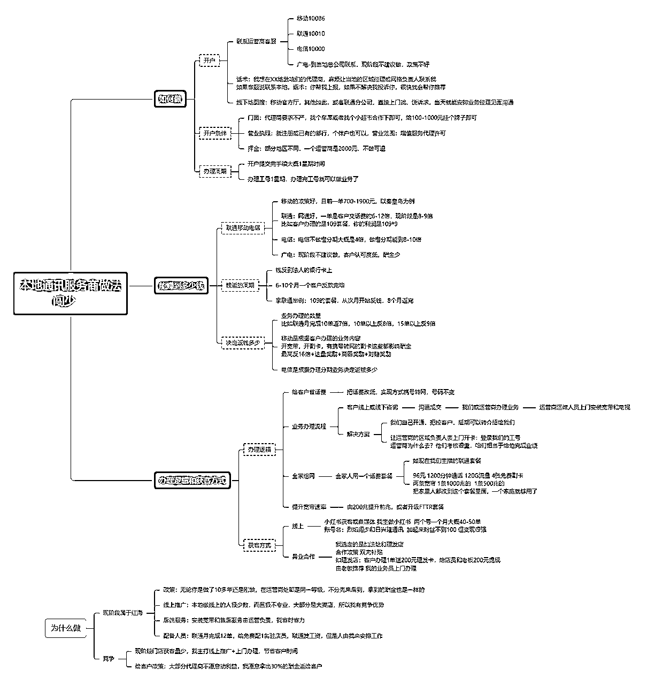

# 7月份入局运营商项目实战，4个月后每月月入4w+

> 来源：[https://tey1bi2rk7.feishu.cn/docx/QufidRli3oe1j3xxsQscsq2snHe](https://tey1bi2rk7.feishu.cn/docx/QufidRli3oe1j3xxsQscsq2snHe)

各位圈友好，第一次分享，偶然的机会在一条风向标下回复后，收到圈友们的咨询并收到第一份打赏，受宠若惊，把我在运营商的经验和经历，拿出来和大家分享。

我是2023年7月在朋友的带领下加入到运营商实战的阵营上的，最初只做了联通一家，吸引我的是高额的酬金。

我记得当时办理一单业务的酬金是1400多，有点惊讶，原来这个行业存在着这么大的信息差。

当时运营商办理套餐送电动车，我都怀疑，这送电动车还赚什么钱？

入行后了解到，哪怕是送你电动车，我还能赚800-1200元，天呐，这真是妥妥的信息差。

从这之后我就躬身入局了，发现大街上到处都是运营商的门店，这些店怎么活着呢？

举例：

30平米的店面，一年租金和水电费4万肯定是够了，一个月办理4单业务就回本了，剩下的都是赚的。

看不懂的行业都有里面的信息差和赚钱逻辑在里面，我相信药店也是一样的。

一、这个行业值得做吗

这是一个红海项目，街面上到处都是运营商门店，但是入局后我了解到，大部分是夫妻店，少部分是官方合作厅，获客途径基本上是线下散客，还有一些手机和配件销售，以及手机维修，勉强维持。

同时做移动、电信、联通、广电的人少之又少，客户办理就不方便。

我从这里面看到了机会：

1、我可以线上引流，这个是目前这些门店不具备的

2、我可以做差异化服务，上门开卡，这也是目前这些门店不具备的

3、我可以做美团外卖、饿了么外卖，这也是目前这些门店不具备的意识

利用这些差异化，我在4个月内迅速开了4家综合营业厅，移动联通电信广电业务都能办理的，营业厅是异业合作的点，我出一个挂牌的费用，200-1000，最高的是给了1000，目的是拿工号，做业务。

因为做的比较好，经常能排到本地的第一名，陆续有一些本地做运营商很久的，找我来进行帮忙操盘，合作政策是4-6分，我的4需要次月一次性拿走，目前已经合作5家营业厅。

我目前和朋友合伙在西安开户，正准备在北京也开户做这个项目。

所以我感觉如果圈友来做，这个项目大有可为。如果有其他城市的圈友想做，我们也可以合作。

二、这些地方政策有差别吗

我在河北秦皇岛做，开户政策和西安基本一致，酬金方面略有差别。万变不离其宗。

移动联通电信广电四家的政策目前不同，宣传点也不一致。

移动赚的最多，一单700-1900

联通相对还可以，一单是套餐金额的6-10倍

电信相对较少，4倍左右，做分期是能多4-6倍。

三、如何做？

1、开户

2、业务办理

3、佣金结算

这些都写在思维导图里面

四、如何获客

1、线下获客能够够营业员的工资，我的营业员是联通给发工资，这个钱就算日常运营了。

2、我主要是在小红书上获客，目前2个账号，一个月稳定能在40-50单。

我的小红书是自嗨型的，如果圈友们做，可以大放异彩，一定比我做的好。如果想入门的，也可以引流秦皇岛的，我们合作，利润按5-5开。

具体内容我发在思维导图里面，各位圈友有兴趣可自取，以后再写详细的业务细节的帖子，希望对大家有帮助。

