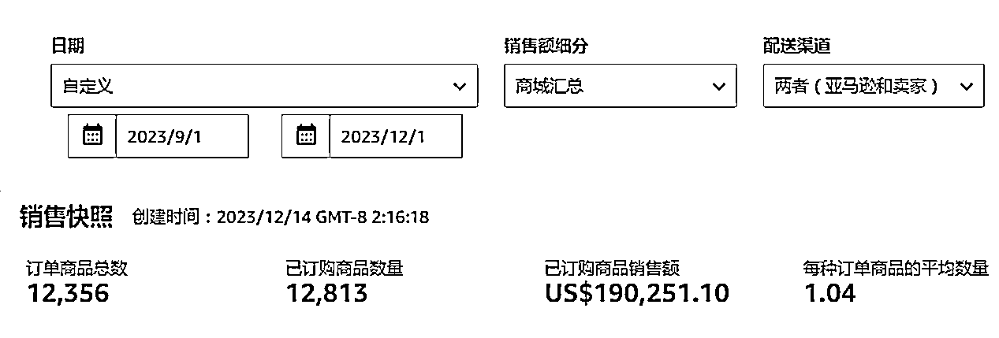
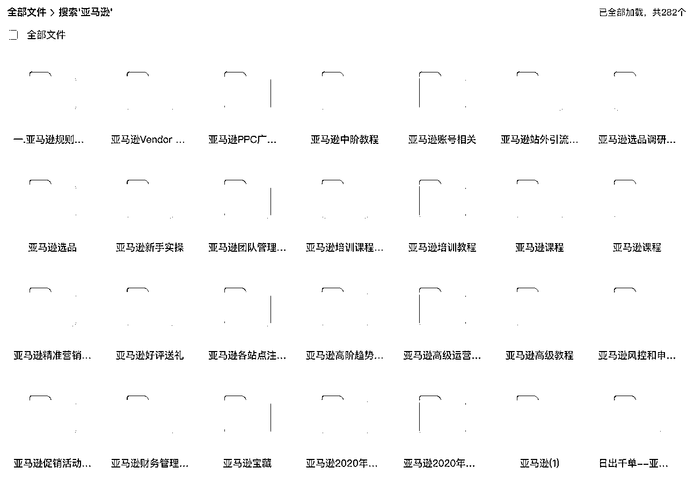

# 99年0基础女生，如何用5k起步，在亚马逊稳定达到月利润10w+？

> 来源：[https://ot7udbz6gd.feishu.cn/docx/S4AjdGwU6oIVLtx77M6ceJkGn8G](https://ot7udbz6gd.feishu.cn/docx/S4AjdGwU6oIVLtx77M6ceJkGn8G)

大家好，我是短发zelda，99年。

我在2021年大学毕业后就开始创业，之前没有任何创业经验，在缓慢发展两年后，今年终于找到了适合自己的发展路线，达到了月入10万的水平。

有图为证：

# 背景及发展历程：

21年6月计算机毕业，毕业前去外包公司实习了两个月，然后深刻的认识到---我真的非常讨厌上班。但是不上班我又能做什么呢？我很迷茫，于是求助我当时认识的最厉害的朋友，并在朋友介绍下认识了seven老师，开始了我的亚马逊之路。

从此命运的齿轮开始转动。

当时我并不知道入行亚马逊会对我来说产生什么影响，我只知道seven老师是行业大牛，我能接触到这样的人物，真是命运对我的眷顾。我必须抓住这个机会。成也得成，不成也得成。不然我只能就得滚回去拿5k的实习期工资，做着没有成长的工作，这不是我想要的人生。

所以我当时就和自己讲了一句话：你没有退路，必须全力以赴。

# 初步的正反馈：

21年5月，我刚从实习公司辞职。因为地域原因，我没办法在seven老师身边学习。不过后面有幸去拜访过两次，分别呆了3天。 只能说seven真的很厉害。为我后面的自己琢磨打了非常好的基础，这一点已经超越了99%的人。再次感谢seven老师！叩谢！

不过因为我是个重度i人（i的程度在70%-80%之间了），所以我更愿意自己反复研究一个东西，很多时候也不愿意开口求助。（这在后面看来是非常错误的决定，让我发展的很慢，我反思）。所以我入行很慢，差不多花了3个月的时间，才对亚马逊有了一个基础的了解。在2021年7月试着挂了一个自发货的链接，然后发现这个自发货的链接也能出单！！于是在seven老师的鼓励下，我发了第一批货过去，差不多花了5千多块钱。幸运的是，这第一款产品就成功了！差不多能达到一个月6-7k的利润，这给了我很大的信心！

于是在得到第一个正反馈后，开始垂直拓品，抓住同类人群，研究用户习惯和其他竞品，然后陆续又针对这个人群开出了3个品（基本上都是修改设计和内容），获得超预期收益的是其中一个产品，这个产品在2022年4月上线以后，一抢而空，达到高峰月入5万的水平。

第一个产品的成功来源于seven的指点，以及我发现了不同平台的信息差并加以利用。而利润的扩大在于，我在发现一个信息差以后，快速的垂直深挖，同类型的产品做了3个以上，而且都是可行的。可以说这个时候，我在亚马逊上的初步探索得到了第一个正反馈。

# 遇到能力瓶颈

有了几个产品以后，我就需要运营这些产品，这个时候我发现我脑子里面对于运营完全是空白的。之前的一段时间都是在研究选品选品，运营这一块我并没有怎么涉及。所以问题很快出现，这款月入5万的产品刚打造出来没两个月，就遇到了竞争对手抄袭，我完全处于劣势。

我是亚马逊上第一家做这个产品的，我现在快要被抄袭我对手搞死了，却完全不知道该怎么办。

为了稳定这款产品的销售，我开始疯狂的上网找资料，咸鱼上找，熟人私发，报课等，市面上能找到的资料都被我收入网盘了。看完就做笔记，然后马上在产品上做实验。我觉得这也是我0基础创业可以做下来的主要原因：知道自己欠缺什么能力，就开始恶补。找市面上所有能找到的资料，整理框架，快速的达到一个60分的水平。

Ps：这是我网盘的资料，并不是全部（我很多都是咸鱼上买的）

由于网络上的方法真的很多，所以我挑选了几个我认为可以尝试的打法后，就开始尝试。用不同的广告组进行赛马，给不高的预算，拉长时间线，看哪个方法最终出来的效果最好。最后保留效果好的广告组，关停不好的。好在最后是稳定住了销量，甚至还有所提升，广告也得到了很诱人的投入产出比。

# 又出问题

在我以为我终于可以躺一躺的时候，我的产品被投诉了！直接下架，原因是版权侵权。

收到这个绩效通知的时候，我刚准备登上去往广州的飞机，这个消息犹如五雷轰顶。核心链接被封，店铺也快玩完。

当即打了一个刚认识没几天的律师朋友，发了一个大红包，与她认真的分析了产品是否违规。在得到大概率不侵权的回复后，犹豫再三，我找了服务商帮我写了DMCA反通知。（大致含义是：我认为我没有侵权，如果你坚持我侵权了，去法院告我）。但当时我还是很慌的，因为如果对方真的告我，我就会被封店，那么我这一年多的努力就付之东流了。如果我认怂，链接下架了，我至少还能保住店铺。

我不甘心呐，我清楚我的产品是怎么来的，我为了研究这个产品，花了整整一个月的时间，自己设计款式，画图，写说明书。所以哪怕最后被封店，我也要一试。我不会认怂，

好在对方没有投诉我，因为我的确是没有侵权，对方也没有版权。这一切只是一场出于商业竞争的恶意投诉。我的链接平安回来了，我也可以继续做新品，卖东西。但其实最后想起来还是后怕的，如果不是我孑然一身，肯赌一次，要不是我真的在这个产品上花了很多心血，我可能就认怂，然后失去这个很好的产品。这个产品在后面整整一年多的时间，给我带来了不少的利润。

很多时候，创业，还是得勇敢一点。（亚马逊上的恶意投诉是真的多。。）

# 消沉和迷茫的一段时间

在达到月入5万以后，我就有点开始躺平了。很大的原因是我没有钱。亚马逊压的现金流越来越多，新赚的钱被压入货中，我本来就没多少本金，还要负担生活开销和社保，又不想借钱，所以只能先牺牲速度，积累资金。

其实，在2022年躺平前，我还做了几个产品，是做产品组合类的。当时身边的朋友都做的非常好，好几个都达到了单品月入10万的水平，我跃跃欲试，做了几个类似的产品，结果都死的很惨，大减价都没有人买的那种。我事后反思，还是因为我的能力不到位，我在拍图，产品运营上的能力还是没有达到这类产品的平均水平。所以我的失败是必然。我并不能在大家都做出成绩的地方做出成绩，那么属于我的路在哪里？

我开始意识到别人的路子不一定适合我，我应该寻找属于自己的发展路径。

# 找到属于我自己的模式

什么是属于我的发展路径呢？我开始从过去的经验中总结我的命运。每个人都有自己擅长的点，我就问我自己，你擅长的点是什么呢？

整理出之前成功的产品，总结规律，我发现了我成功的产品，基本上都是市场第一家的蓝海，而且都是设计类。我在国外的平台上找到很多独特的设计，然后基于对人群的理解，能创作出属于自己的设计，产生不一样的图案创意。

那我想这就是我的优势或者说天赋所在，这就是我的命运。

结合我的优势，今年我为自己打造了一套模式：

1，深挖一个人群

2，快速产生创意

3，用最低成本的载体去做

4，快速测试快速淘汰。

在确定好我的优势在于图案/文案创新后，今年6月份，命运的齿轮再次开始转动。

1，深挖一个人群：

我从搜索词出发，找出几个搜索量大，上升快的关键词（有很多软件可以用，比如我是先看aba数据，粗筛，然后在到sif里面看搜索趋势）。然后就开始研究这个关键词背后对应的是什么人群，反应了用户什么需求。

粗筛出几个大致的方向后，我还会去做：

A. 看这个关键词下的市场。看有什么产品，销量如何，竞争大不大，大致价格区间在哪里，利润空间怎么样。

B. 看新品排行榜，找出市面上快速上升的新品，分析这些新品是如何抢到市场的（有的是功能上做了升级，有的是设计上做了升级，有的是价格上做了很大的折扣）

C.只是通过产品设计，就可以上新品榜的方向，就是我要的方向。（因为我不擅长功能升级，所以选我容易出成绩的方向）

D. 用一些常规的产品，比如杯子，碟子之类的产品，这些产品有大块平面可以给我做设计，而且起订量小，成本低。结合我调研出来的关键词方向，把产生的创意做到这些普通的载体上。

2，快速产生创意

市场确定了，我该怎么产生创意呢？

这就提及到了一个非常重要的平台：pinterest

Pinterest也是图片流网站，上面有很多创意设计。我找到点赞多的图片或产品，从这些创意中获取灵感，然后创作出属于自己的设计。

3，用最低成本的载体去做

我一般测试的成本不会超过一万。大多数都是5k以内的。如果好卖就快速补货，如果不好卖，就低价清仓。

筛选低生产周期，低测试成本，快速产生图案或者文案的创意，快速试错。让我研究出了基于我优势的一套流程。

4，快速测试快速淘汰

我在6月份的时候实践了我总结的路径，当时一个月落地了5款新品，7月份证明了我成功了3款，最好的那款产品一个月7-8万的利润。还有两款是月入小1万的产品，剩下的两个投入不到一万的产品，卖不动，就快速清仓。

同理，7月份我又开发了4款产品，2款卖不动清仓，一款达到月入小一万，一款达到月入3-4万。

我就这样不停的重复这套流程。

5，优点和缺点

图片文案设计类的产品有一个很大的问题，就是，很快会被抄袭，所以产品的生命周期会比较短。这种模式必须要每个月都推陈出新。

不过优势也很明显，不需要精心的运营，因为是市场原创，也不用担心别人投诉侵权。而且因为设计独一无二，竞争也小，就不需要花费很多时间运营。

# 被后来者抄袭了，怎么办？

孙子兵法里面有一句话，我深受启发：可胜在敌，不可胜在己

做市场第一家的产品，如果销量能起来，早晚都是要被抄袭的，我能做的就是尽可能不断货，做好品控，然后做好性价比。同时，尽可能不要上新品榜（如果感觉要上新品榜了，就涨价控一控，新品榜第一太容易被抄），这样就可以尽可能的拉长产品的生命周期。而且如果对方是基于你的产品做出的优化，其实没什么可说的，应该学习他们超越的思路，然后下次做出更好的产品。

但是, 还有一些人，直接原封不动的抄袭了你的设计，理论上你可以去投诉他们侵权。但是子卿有一句话启发了我：不要陷入负面的能量场。虽然你可以投诉他们，也许他们也会因为你的投诉下架，但是这种动作会让你进入一个负面的能量场里面，并不划算，我们要让自己处在一个正向的能量场里。

所以如果只是简单的设计创新的产品，遇到别人抄袭，我主张是不投诉。因为如果你一直把目光放到竞争对手上，你永远做不出更好的产品。

# 总结一下：

1，每个人都有自己擅长的点和不擅长的点，多从过去成功的经验中去寻找规律。找到属于你的优势，那就是你的命运。比如我从过去做产品的经历中总结出来我适合做图案类的创意，我做这些成功率高，那我就放大，研究属于自己的一套打法。我身边的朋友，也有擅长做工具类功能创新的，那他就依据他的优势和经验，在工具类目做的非常好。

每个人的机遇或者说天赋是不可被复制的。找到属于你自己的优势，然后放大，比什么教程都强。

2，创业和上班很不一样，上班只要一个能力打通，就可以拿到薪水。创业是需要每个环节都得有至少60分的能力，而且需要有自己的核心优势，才可以。如果你是和我一样是0基础创业的，就必须保持终身学习的姿态。意识到自己缺乏哪个能力后，快速学习，然后快速补上。

这是一个伟大的时代，市面上几乎可以找到任何领域的资料，而且可以用不高的成本得到。这是这个时代的机遇。

3，小心试错。做产品本质上是一个概率问题。只要我控制好我的测试成本，确保我在失败的时候不会被请下牌桌，那么我就可以无数次试错。总归是能找到正确的路子的。

4，长期的项目需要all in

不是说金钱上all in，我指的是做项目的心态。做一个长期项目，要学会死磕，绝对不能东张西望。这里敲一下，那里打一下，容易最后什么都做不成。

5，如果你和我一样没钱，没经验，又想做一个可以长期做的项目。那就选启动成本最低的起盘，等做出正反馈后，再放大。不要怕慢，稳扎稳打，多学习，多复盘，多总结。时间会告诉你答案。

2025年2月

感谢星友提醒，上文中涉及到的一些私密信息已经去掉。同时目前产品线也做了较大的更新，过去的经验只能用作参考。

然后我不加好友。 其实我也偶尔会想是不是要和身边的社交大佬一样去链接更多优质的人，那样的人生看着好丰富哦！但是我确实是提不起社交的动力，花花草草大自然才是我真正喜欢接触的东西。

亚马逊的好处就是可以不用被迫社交，也可以赚钱，i人友好。

随着业务越做越好，身边的老友也会不断的问我：亚马逊现在还能不能做？

emm，真是一个难回答的问题。做过股票交易的都知道，市场还有分歧的时候，是依然有介入的机会的。每年都有新人入场做亚马逊，每年都会有一批人赚到钱。但你能不能成为那批人，不知道。

其实我觉得这个问题的答案，更应该问自己，我能不能做亚马逊？

1，我愿不愿意2年没有正反馈，还继续做。我的经济允许吗？（我是特殊案例，身边从0起步的好友，基本上都花了2年的时间才步入正轨）

2，我是一个善于观察的人吗？我能经常总结出生活中的规律并加以应用吗？

3，我是一个勤奋的人吗？我的行动力强吗？

4，我的风险意识强吗？（很多人高举高打，梭哈到一个产品，然后产品失败，元气大伤）我觉得做亚马逊高低得有点投资思维。

5，我有经验吗？（或者我有大腿可以抱吗）

如果都是“是”，那亚马逊就可以做。

———————————————————————————————————————————————————————————

然后关于财富自由的问题，我这两年有了新的思考。

今年已经有好几个好友问我财富自由的问题了。。。其实我觉得，财富自由是个相对的概念。

个人认为，财富自由=消费自由+时间自由。可是消费自由，是非常难达到的---消费取决于人的欲望。如果欲望随着财富的上涨而疯狂膨胀，就永远也达不到财富自由。

所以财富自由不是一个值。有的人赚了一千万还想要有两千万，因为他的想要的是身家上亿的人的那种消费力。有的人觉得一千万就可以舒舒服服的过一辈子了，因为他想要的只是中小城市的普通生活。

前者没有实现财富自由，后者实现了。就这么简单。