# 普通人如何入局小红书旅游赛道？

> 来源：[https://p03a4vs9s2.feishu.cn/docx/SY4udW2AeoG0xGx5McbcSnbdnVi](https://p03a4vs9s2.feishu.cn/docx/SY4udW2AeoG0xGx5McbcSnbdnVi)

哈喽， 我是叁斤，一个普通的小红书赛道玩家，分享过关于小红书引流和得物好物变现的精华文章，感兴趣的圈友可以看看：

小红书安全引流指南：https://t.zsxq.com/14egViF6h

得物好物变现项目：https://t.zsxq.com/149Jc3rvk

今年小红书旅游赛道的风很大，我也去对接了一个做马尔代夫定制旅游的旅行社测试了一下，结果有点出乎意料

客单价还可以，一单都是几万，甚至几十万的

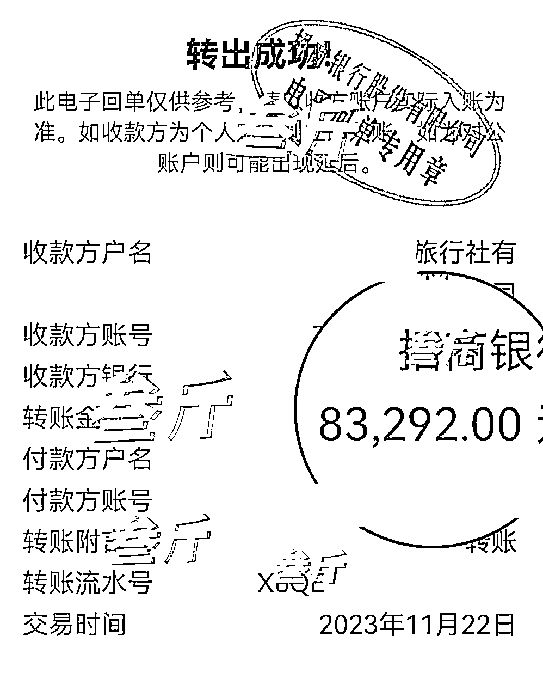

「得物的帖子被盗用过，部分图片追加水印，望谅解」

为什么看好旅游？官方数据，82%的出游者会在线上研究攻略，小红书是top1平台。生财也在内测小红书旅游项目，这个项目怎么样不用多说

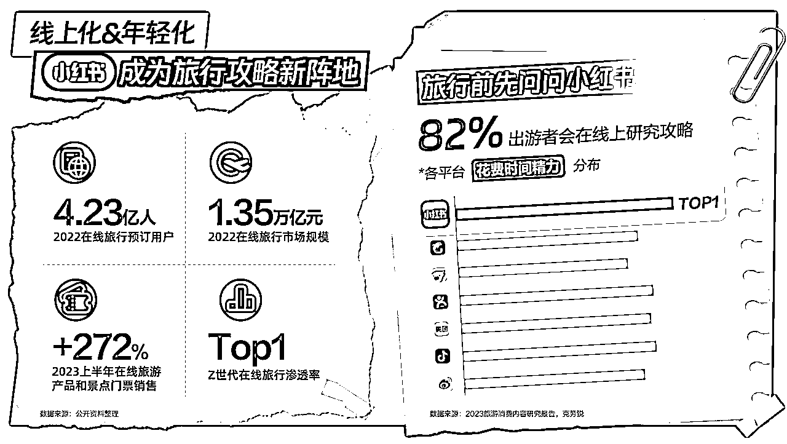

为什么选了国外定制旅游？主要2个原因

1、国内市场，卷！太卷了！

价格低、坑多、口碑差，这些问题在国内市场非常常见，这导致我们在找合作方的时候会比较困难

另外，国内有很多低价购物团，口碑和客户体验非常差

再说国内旅游景点自己做攻略自由行，难度也不大（我就不喜欢跟团，更喜欢独自旅行）

2、国外市场客单价高

相比之下，国外的市场客单价要高很多，而且大部分人是没有能力自己做攻略出国旅游的，都需要找旅行社去跟团或者定制

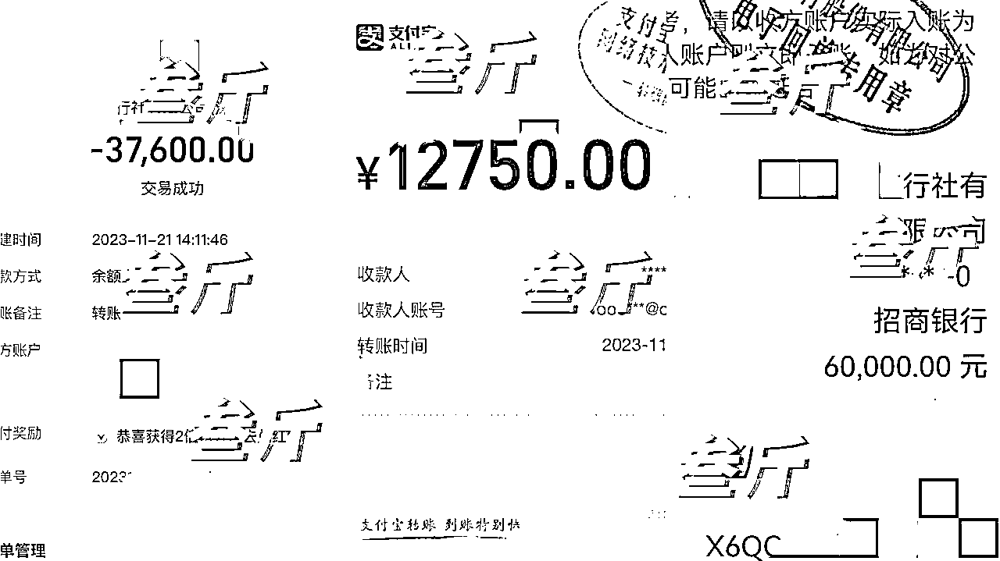

「得物的帖子被盗用过，部分图片追加水印，望谅解」

# 目录（点击直达）

一、普通人怎么入局旅游赛道？

二、如何找旅行社？

三、如何选品？

四、运营篇

五、引流篇

六、投流篇

七、矩阵篇

# 普通人怎么入局旅游赛道？

没有旅行社资源，要怎么入局小红书旅游赛道？

大部分商业形态都可以拆解为：供给方、需求方和链接者，只能做其中一方就可以，小红书旅游项目也一样

供给方：旅行社

需求方：旅游客户

链接者：平台

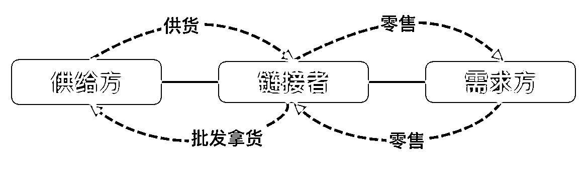

以前的链接者，是飞猪、携程等平台，但经过一波疫情，小红书迎来了爆发式增长，用户习惯也发生了改变，链接者已经从携程、飞猪等平台慢慢转移到了小红书

但是大部分旅行社没有跟上这个转变，还不知道怎么从小红书获客，这就是我们的机会，我们可以做链接者，帮助旅行社在平台上获客

# 如何找旅行社

要做链接者，就要找到供给方和需求方。普通人最难解决的其实是找合适的旅行社

这里分享几个找旅行社的方式，只要去实操，肯定能找到

## 身边资源

首先肯定是发动身边资源，问一圈谁有一手旅行社资源。别说身边没有，你不问怎么会有？

其实很多人的朋友圈都有资源，只是自己脸皮薄，拉不下脸去问

所以建议先问问身边朋友，有没有做旅行社、或者认识旅行社朋友的？甚至朋友在哪个旅行社报过团，体验感不错的，都可以介绍来聊聊，大胆去问

## 社群资源

第二个是扩散资源：社群

这也很容易被忽视，就拿生财来说，生财有资源对接服务，但是有多少人真的去用了？

所以可以在生财或者其他社群，发起资源对接，问问有没有旅行社合作或者推荐

生财肯定有，而且不少

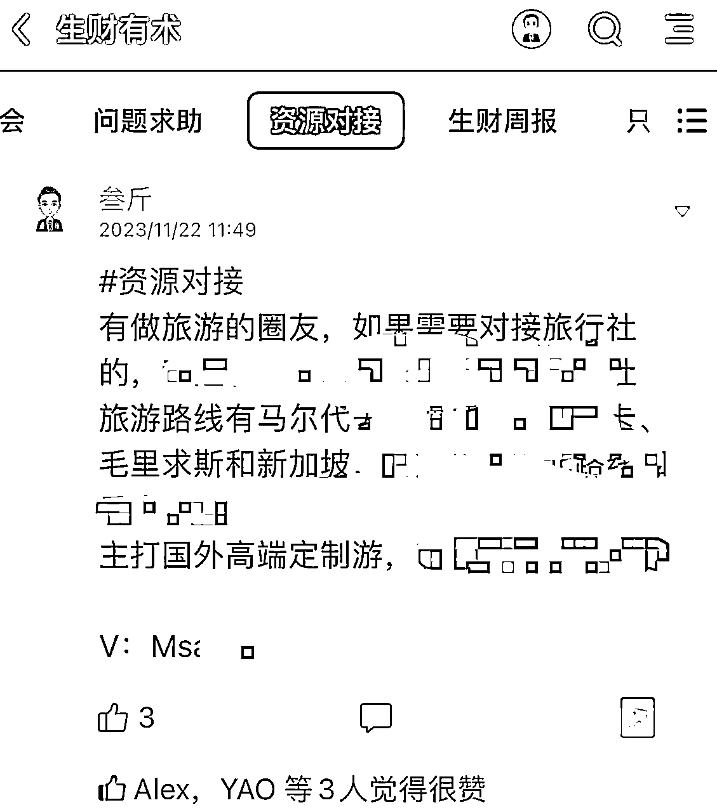

## 小红书

如果身边是在没资源，或者没有自己想要的资源，那就主动出击！主动去寻找外部旅行社合作

1、 小红书发帖

去小红书发布需要旅行社的帖子，啥也不用多说，你只要说你有客户资源，就会有大量的旅行社来找你合作

因为旅行社也已经知道了小红书有客户，但自己运营效果总是差一些，当他看到你有资源时，都会来主动链接

但这个需要自己花比较多时间去筛选，看是否靠谱，口碑怎么样

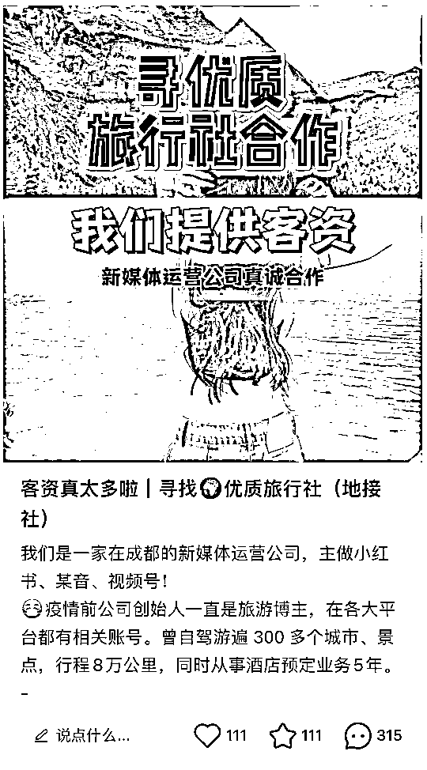

2、主动出击

想要一些优质旅行社的话，就自己去小红书找一些口碑好、好评多的旅行社，主动私信他们寻求合作

同样的，就说自己手上有客户，可以对接给他们

一般不会有旅行社拒绝的，因为他们投流和运营的费用也不低，有现成的客户都不会放过

# 如何选品

知道怎么找旅行社后，就要开始选品了。做旅游跟做电商本质上是一样的，选品定生死。

旅行选品主要分为2个方向：国内产品和国外产品

为方便大家参考，附一份

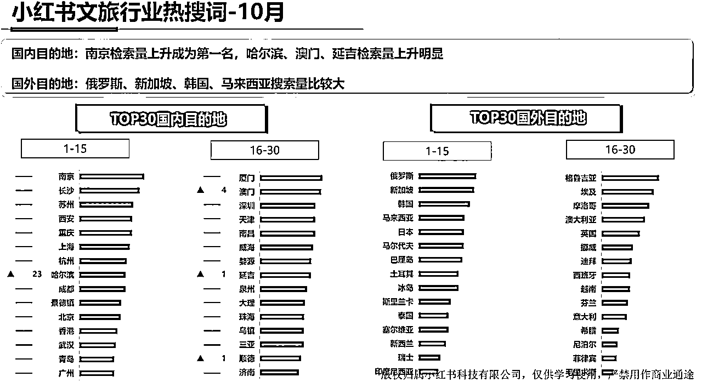

## 热门国内产品

写帖子的时间是11月份，冬季。国内最热门的旅游点，是东北线。

包括哈尔滨、长白山、延吉、漠河等，这个时间段去东北看雪，是最好的时候。选品时可以往这个方向找

但是也有一些常年热门景点，云南、西藏和新疆方向，这几个点都是常年热门，也都可以参考

而且西藏、新疆两个地方，面积太大了，跟团比自驾去要方便很多

## 热门国外产品

跟国内的比起来，热门旅游国家相对少一些。受核废水事件和嘎腰子事件影响，日本和东南亚部分国家的游客少了很多

比较热门的国家有：俄罗斯、新加坡、马来西亚、马尔代夫、巴厘岛、斯里兰卡、迪拜、新西兰等，有些国家是免签证的，非常方便

国家之间，也可以联游。例如，去马尔代夫，可以在迪拜转机，顺便在迪拜玩几天

国外产品跟国内的比起来，会更依赖旅行社，而且客单价更高。

## 注意事项：

1、旅游产品

团游、定制？还是购物团，一定要问清楚，方便自己做笔记。购物团一般价格非常低，但是体验感不太好

2、给钱爽不爽快

第一次合作又担心不结算的话，可以签个协议。如果结算很费劲的话，就不要继续跟他合作

3、口碑怎么样

在合作前，可以在小红书、携程和飞猪等平台看下这个旅行社的口碑怎么样，如果口碑很差的，也可以不合作了

# 运营篇

产品搞定后，就要搞定需求方了，分享下我自己做旅游账号的方式

## 运营方向

分享两个比较常见的运营方向

1、简单粗暴怼爆文

直接找爆款笔记的模板套用，洗稿，一直怼爆文。这种方式简单粗暴，更快出爆文

2、人设大法

在小红书打造一个人设，比如做xx旅游多少年等，通过人设的方式打动用户成交。人设不是虚构的，可以把合作方身份用去小红书

## 账号装修

1、昵称

小红书昵称只要好记、好读，没有生僻字，而且小众，就差不多了。可以在昵称后面加上“旅行”的字眼，但不要取大众名字，如“momo”，用户是记不住你且搜不到你的

2、头像

头像尽量是跟你的产品有关，做西藏的可以放西藏风景。

3、简介

可以分3～4段写简介

第一段：展示实力、特色。如：2-6人精品小团自由行

第二段：展示路线，主要做那些地区的旅游。如：主营西藏丨云南丨新疆 路线

第三段：引导小号，@小号，让用户知道从哪联系你

4、置顶介绍

置顶介绍可以放企业介绍，展示旅行社实力，如营业执照、奖项、客户评价、带客户旅行的图片等

素材可以跟合作方要一份，一般长期合作的都愿意给你

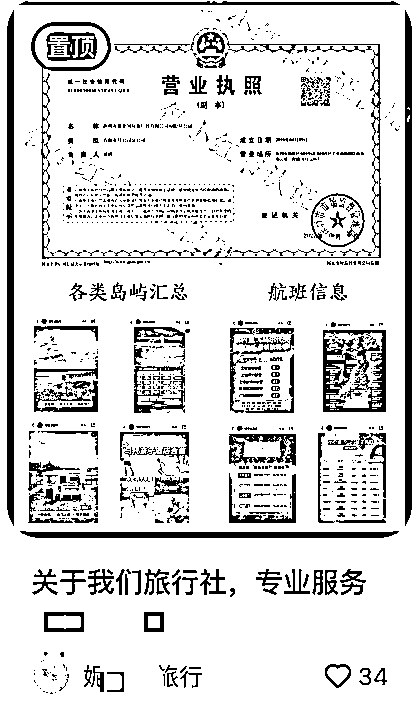

## 内容制作

### 1、选题

为了避免不知道更新什么内容，建议养成一个收集爆款笔记的习惯，建立一个选题库。

分享几个常用的选题方式：

1.1\. 搜索词下拉词：

在小红书搜索产品关键词，搜索下拉词中找到合适的选题

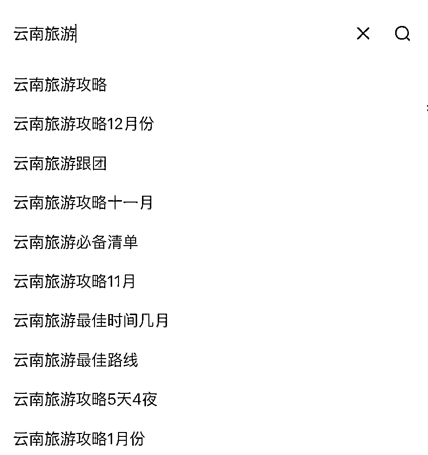

1.2\. 搜索热门笔记：

同样是搜索，除了下拉词，还可以在搜索结果中，找到近期的爆款笔记，这些笔记的选题都可以去模仿

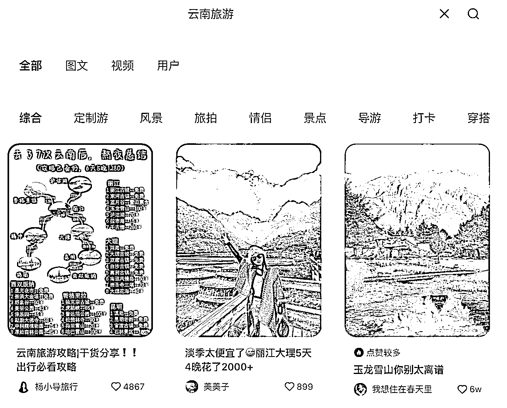

1.3\. 第三方工具：低粉爆文

用灰豚数据、千瓜等工具，找到旅游相关的低粉爆文，可以模仿这些爆文的选题

1.4\. 对标选题

找到自己的对标账号，他们发什么选题，自己就跟什么选题

1.5\. 万能选题法：

再分享个万用选题法：

时间：基于时间做选题，如什么时间去旅游？

地点：去哪里旅游？

人物：跟谁去旅游？如闺蜜、父母、亲子、夫妻

需求：什么类型的旅游？潜水、看山、看水看雪？

价格：什么价位的旅游？轻奢？还是小团？价格越低越吸引人

### 2、标题

下我是如何模仿爆款笔记的，先分享标题模仿的干货：

2.1\. 筛选标题

在取标题前，我会搜索同选题的爆款笔记，并找5～10个爆款标题

如我想写哈尔滨旅游攻略，就会搜索相关爆款笔记并收集爆款标题

1.  不敢想象😭带着这份攻略去哈尔滨会有多爽

1.  哈尔滨超全攻略，情侣游买一送一人均才1K

1.  广东人去东北|13天花4500💰之哈尔滨（上）

1.  哈尔滨旅游攻略✅送给第一次来雪乡的你🎉 🌟

1.  哈尔滨6天5晚超详细攻略|属于冬天的浪漫

收集到这些标题后，会逐个拆解关键词

2.2\. 拆解标题

1⃣️ 不敢想象😭带着这份攻略去哈尔滨会有多爽

可拆解“不敢想象”、“带着这份xxx会有多爽”这两个关键词，关键词可以迁移到其他标题使用，并可把“哈尔滨”替换成其它地区

2⃣️ 哈尔滨超全攻略，情侣游买一送一人均才1K

可拆解为“xxx超全攻略”、“人均才xx”，这两个关键词可迁移，看产品情况是否添加“情侣游”

3⃣️ 广东人去东北|13天花4500💰之哈尔滨（上）

关键词可拆解“广东人去xxx”、“x天花了xxx”，人群词、价格词都有了，换到其他旅游景点也一样

4⃣️ 哈尔滨旅游攻略✅送给第一次来雪乡的你🎉 🌟

关键词可拆解“xxx旅游攻略”、“送给第一次xxx的你”，这个标题的都是大词，可以选择性使用

5⃣️ 哈尔滨6天5晚超详细攻略|属于冬天的浪漫

可通用的关键词“x天x晚”“属于xx的浪漫”，这些关键词也可以在很多旅游笔记中适用

2.3\. 重写标题

标题拆解完后，会重写几个标题，再选其一使用

1.  哈尔滨超全旅游攻略，属于冬天的浪漫

1.  不敢相信！哈尔滨6天5晚，人均才xx元

1.  ……

这样模仿下来，你的标题就有几个可选了，模仿的多了，之后自己就能完全原创新的标题

### 3、封面

小红书封面在笔记中的作用非常重要，直接决定了笔记点击率的高低

分享几个旅游赛道的爆款封面类型，都是可以迁移复制的

最后再分享一个我收集爆款封面常用的工具

3.1\. 单图

第一种是非常常见的单图封面，单图一般可以直接放景点比较具有代表性的图片，比如哈尔滨，就可以放雪的图片，香港就可以放一些建筑的图片

另外，除了图片，也可以加一些标题文字，但是需要跟图片风格一致，如香港攻略，文字就是港风。如果捉不准风格，可以不放

图片来源，可以跟旅行社要一些，也可以自己网上找，但是要注意去重

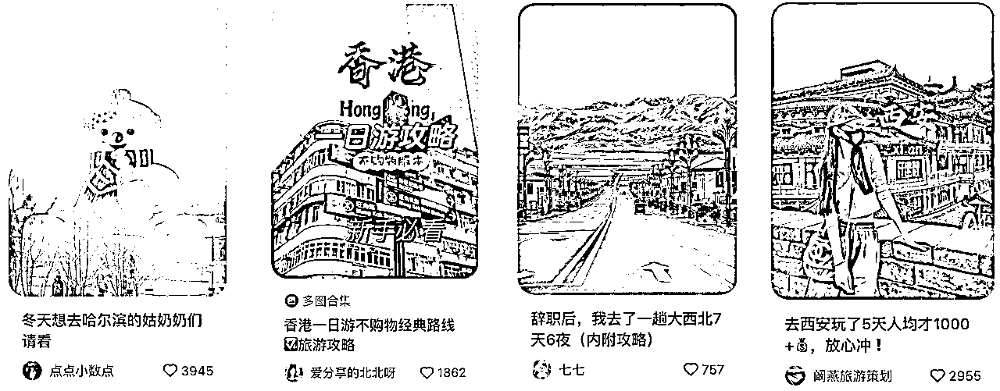

3.2\. 拼图

第二个是拼图类型，一般旅游点都有好几个知名景点，把这些景点的图拼在一起，比如云南，有西双版纳、大理、丽江等，大理有分大理古城、洱海、喜洲古镇等，把这些图片拼一起，就可以当作首图

也可以加一些行程规划，如下图1，第一天去哪里，第二天去哪里，用箭头画一下，这个封面现在也是热门的

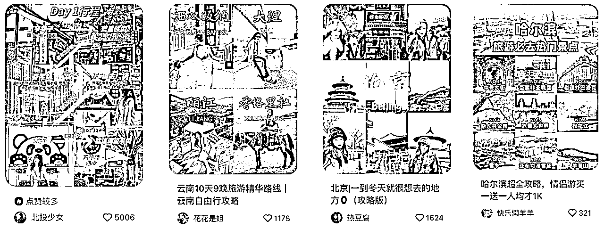

3.3\. 贴图

如果一点素材都没有，也不想搬运他人素材的话，可以用贴图类型。贴图直接放旅游规划，去哪玩、怎么去、怎样的路线、去哪里不踩雷等，模板也有非常多

这些图片可以用ps、稿定设计等工具完成

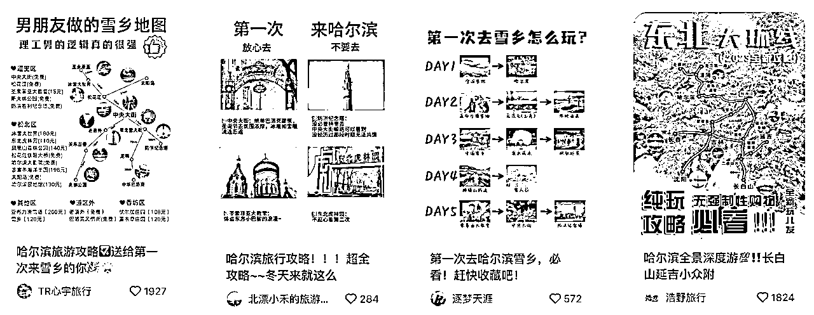

另外，如果不会用ps、稿定设计也没有合适模板的话，ppt、xmind也是合适的。我在11月份参加了生财研习社@罗卜 的导图营，就使用竖版思维导图做了小红书笔记，发现效果也还不错

以下是当时的作业：

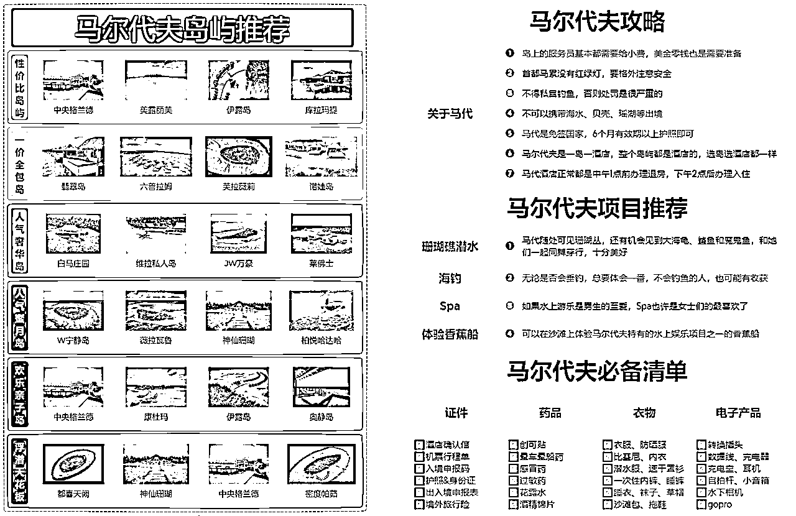

之后优化了配色和排版，发出去的曝光和点击反馈也很不错，而且难度比ps、稿定设计都低一些，感兴趣的圈友可以留意生财研习社的导图营

3.4\. 纯文

如果贴图的还是不会，那么就试试纯文，不需要图片和复杂制作，直接把攻略写在图片上

路线攻略、景点推荐、大字报标题、备忘录攻略……，这种难度非常低，也很吸引人，这是最低难度的制作方式

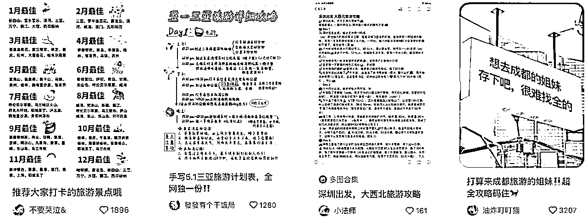

3.5\. 其他

再分享8种点击率很高的封面类型，每一个都可复制（丑不拉几的数字是我标的）

第一种：朋友圈文案

以朋友圈文案做封面，后面放攻略图片。或者朋友圈封面+风景图，文案放攻略，亲测点击率不错

第二种：聊天风格

没有人会拒绝看别人的聊天记录，这种类型我在做电商时也用过，点击率真的高，而且话术设置好的话，转化率也不低。迁移到旅行笔记中，也一样。点击率很高。聊天记录可以用小程序：聊天记录生成器

第三种：地图路线

在地图上用箭头标注路线，这种笔记的互动数据也很高，制作难度不大

第四种：手抄攻略

如果写字好看，可以把攻略写下来再拍图做封面

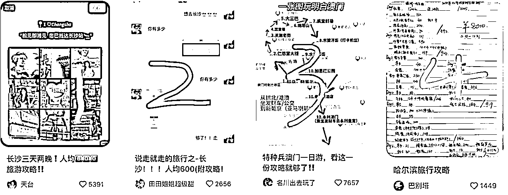

第五种：对比图

这个也是多赛道迁移复制过很多的封面，做攻略前和做攻略后，也比较吸引人点击，但是被用烂了

第六种：备忘录封面

跟手抄差不多，写字不好看的可以使用备忘录，再拍图的方式做封面

第七种：一句话封面

可以用聊天截图，也可以用ppt等工具，核心就是，一句话反复发，让人重视这个标题，而且话术一般都是“劝你别xx”，文案中在写“怕你去了不舍得回来xxx”

第八种：评论截图

去爆款笔记的评论区，找到带攻略类型的爆款评论（高点赞），截图下来，并用醒目颜色圈起来

这个可能比较难找，平时多留意评论区，不仅可以用于封面，还能作为选题

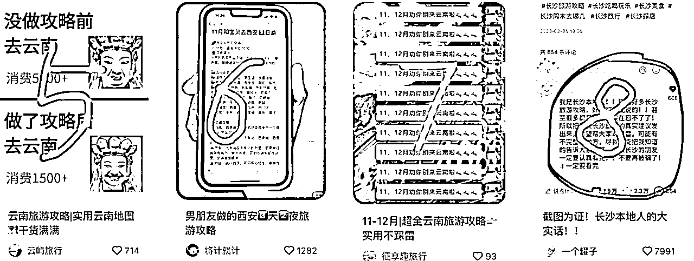

3.6\. 封面收集工具：

我自己常用的封面收集工具是花瓣网，可以安装插件，pc端浏览小红书时，可以直接采集对应的封面，方便自己对标

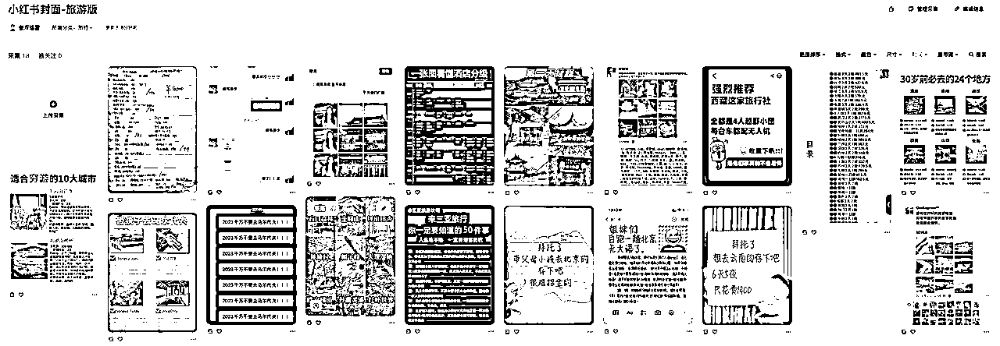

### 4、文案

旅游的文案是最好写的，一般就是旅游攻略，不会做攻略的，就洗稿就行了。

也可以按旅行社的产品来做相关推荐，比如旅行社有一个云南路线的产品，那么文案就按照这个路线去写就行

如果把文案写在图片上，文案就可以少写点，但也建议写上相关关键词，如xx旅游攻略等，可以增加搜索收录概率

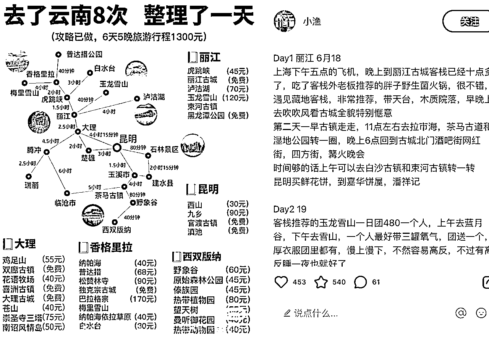

# 引流篇

关于引流，我在生财分享过一篇精华帖，目前里面的引流方法还有用，而且安全系数较高。

这里在针对旅行行业写一下引流重点

## 微信包装

首先要把承接的微信号养好，微信养号也比较简单：

实名认证、开通支付、多发日常朋友圈、少发营销内容、多聊天互动，就行了

但是如果已经开始引流客户的话，需要对微信进行包装

1、头像昵称

建议跟小红书一样，头像和名字都一样，这样用户识别成本最低

2、朋友圈

一天可以更新几条朋友圈，1条日常、1条广告、1条客户反馈、1条景点分享、1条旅行趣事

包装微信是为了降低用户信任成本，增加成交率，方法不是固定的，可以按自己的来

## 引流小号设置

引流建议至少有2个账号，1个主号，1个小号

主号正常发笔记，互动，简介@小号，引导用户去小号添加

小号可以命名为“xx助理”，把微信号拆分成2段，分别发一篇笔记，如下图：

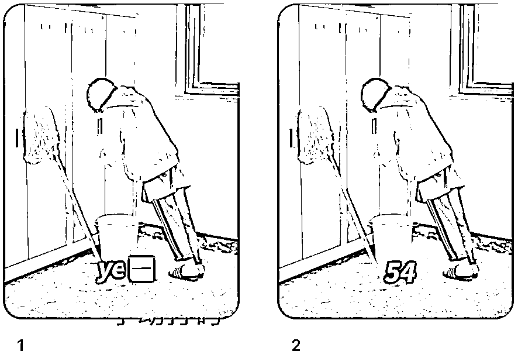

也可以做更直接的引导：在1张图上写上完整微信，有人咨询就发过去

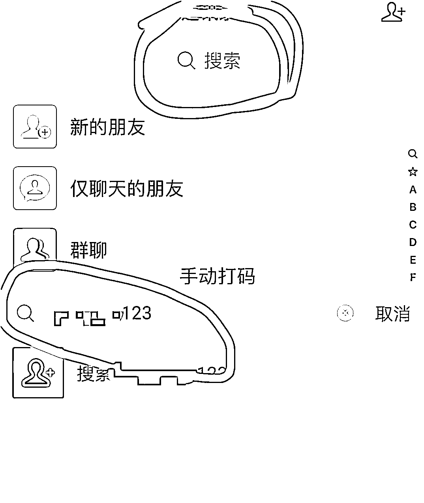

## 引导用户

有了引流图片后，需要引导用户添加。

最直接的引导就是私信，但每天私信次数是有限的，所以需要让用户主动私信我们

在大号发布笔记后，如果数据明显有提升，阅读量高，就用小号去评论如“行程在这xx”之类的话术，并置顶改评论

评论不一定会马上显示，如果没显示或者没审核通过，换一个话术继续，总之，置顶评论是小号，让用户知道去哪里找你，就行了

用户点击小号，即可看到笔记的微信，如果看不懂，也大概率会私信你，这时再发引流图片即可

# 投流篇

以上的引流方法，都有风险。这是平台限制，无法避免。要100%安全又直接的引流，只有投放广告

但是旅游行业投放有门槛，除了需要是企业号，还需要有相关资质，这个可以看下旅行社是否能支持提供。如果能提供授权，可以尝试投流，只要完成最低消费，就可以安全引流

投流方法如下：（如无法开启聚光，可跳过该环节）

## 第一步：选择“客资收集”营销诉求

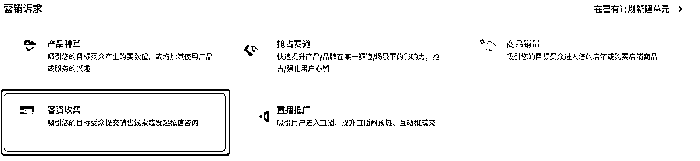

## 第二步：建立全站智能投计划

功能说明：

全站智投：将广告投放至小红书站内（信息流+搜索等），系统会根据广告主属性、特征、素材等特性进行智能计算并投放

搜索推广：将广告投放至小红书搜索结果页面

信息流推广：信息流广告是指在小红书主页内容流中的广告

视频流推广：将广告投放至沉浸式视频流中，类似抖音刷着视频刷到广告

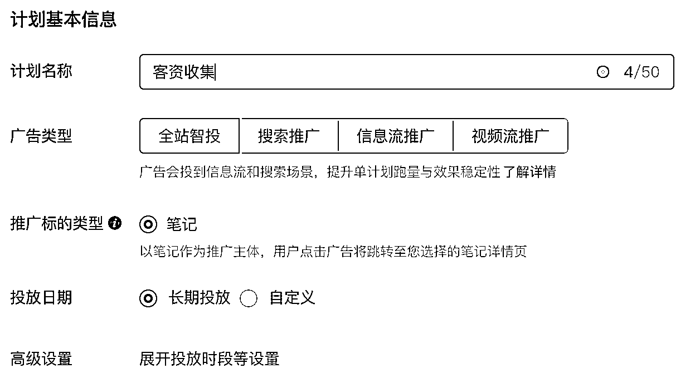

一般建议新手推全站智投，傻瓜式操作，效果也不错

## 第三步：设置预算

出价方式选择“私信开口量”，目标预算设置100以上，如果想在广告多跑些费用，可以设置高预算。如果只是想私信白名单，则设置200～500就够了

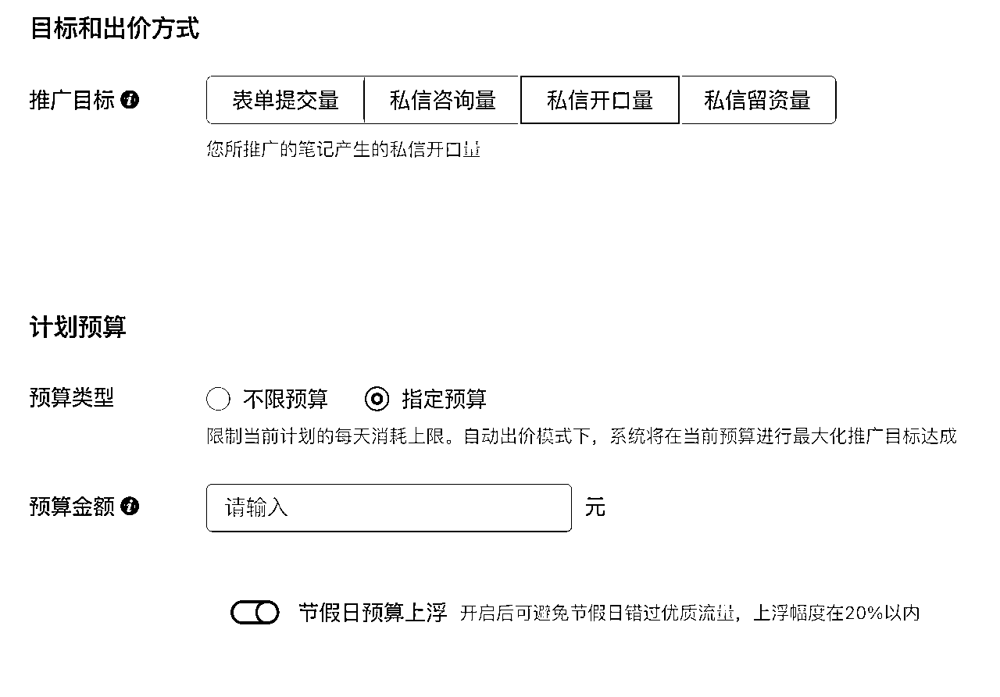

## 第四步：添加笔记

根据计划的特征，添加高互动、高转化的笔记。如：云南旅游攻略计划，就只投放云南旅游相关，高转化、高互动的笔记

一个计划，一个单元可以添加多篇笔记

投放广告虽然可以按效果付费，但如果笔记素材不好，转化和互动过低的话，会导致钱花不出去。所以即使投放广告，也要做好素材管理

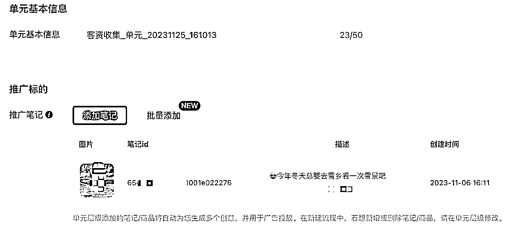

## 第五步：推广和出价设置

推广业务类型选择出行旅游，目标出价可以问问小红书直客，你的赛道平均私信开口是多少钱（直客可能也不会说，很恶心人）

想起来补充一个建议，如果要开通聚光，非常非常建议通过代理商去开通和投放，不仅有返点，服务还好一些，小红书官方直客很多服务很差的

代理商一般都会告诉你大概多少钱，不同旅游、不同景点出价可能都不一样，但范围大概在30～50上下浮动，如果保守一些，可以设置30一个开口，看计划情况增减

如果计划跑的很快，可以减少私信开口费用，如果计划跑不动，可以增加开口费用

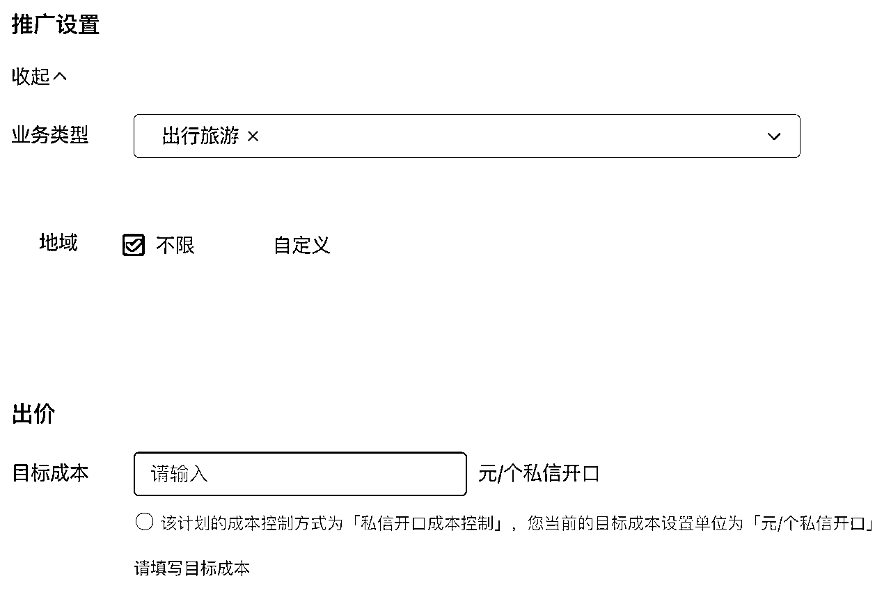

## 第六步：对创意命名

为了方便区分，可以给创意命名，如客资收集-哈尔滨攻略，这个只是为了方便自己区分，名字可以随意

另外，封面优选和标题优选都可以打开

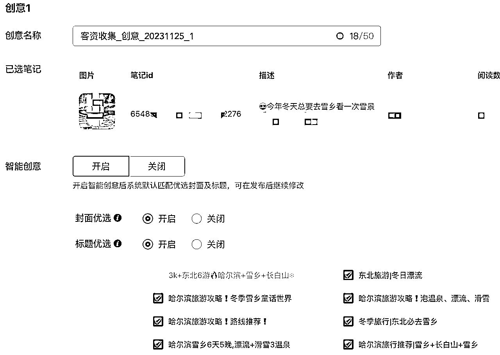

## 第七步：设置组件

这一步可以直接用互动栏胶囊，也可以设置置顶评论，效果都差不多，置顶评论可以在笔记自动置顶一条评论，点击评论可以跳转到私信

但该评论只有广告投放触达的人群能看到，也就是说，自然流刷到笔记，或者主页点开笔记，是看不到这条评论的

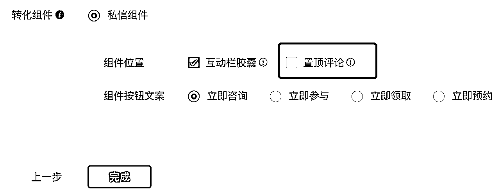

设置完这些，就算是完成了一个计划建立，一定要留意费用情况，虽然可以设置预算，但有时会跑不出费用或者超一部分预算，所以要经常看着

计划建立后，不需要一直开启，如果笔记优质，只需要在高峰期（晚7～12点）开启一下，确保费用不超就行了

# 矩阵篇

如果无法投流，则可以设置矩阵号

## 矩阵作用

1、降低影响

私信引流容易封号，如果只有单账号引流，一旦遭遇封号，则一切从头开始，影响很大。

矩阵号的方式，可以降低封号带来的影响，引流封了一个号，还有其他几个号继续跑

2、增加产品方向

在前期没有固定旅行社合作时，可以多个赛道跑，如国内云南路线、新疆路线、哈尔滨路线，以及国外马尔代夫、新加坡、迪拜等几个产品一起跑

但是如果把这些放在一个号上，会显得不那么专业，分开矩阵号操作最好

3、扩大流量面积

当你确定了跟某个旅行社长期合作后，也可以多账号同时发布不同风格的笔记内容，可以扩大流量面积，让更多人刷到笔记，比单账号效果要好一些

## 矩阵方向

分享2个做矩阵账号的方向：

1、怼爆文

每一个账号，单独怼爆文。直接套模板发笔记，效果最快最直接。也可以用于测试哪一个模板的数据最好。

2、多号导流

建立多个矩阵账号，一个主号，若干个伪素人账号，伪素人账号发布游客笔记，往主号导流

如：

我去了云南旅游，发布了旅游攻略笔记，笔记中告诉用户，我是在哪定的行程。与产品种草一个方式。

该矩阵方式内容更加真实，但缺点是，非爆款模板，流量小

两种方法参考使用，但一般情况下都建议采用第一种方法，直接怼爆文。如果开通了聚光，大号有白名单权限，也可以考虑第二种方法

## 设备

手机：

建议买二手iphone6以上，我自己用的是oppo r11s，拼多多大约200～300左右，目前不卡，正常发笔记和评论没问题

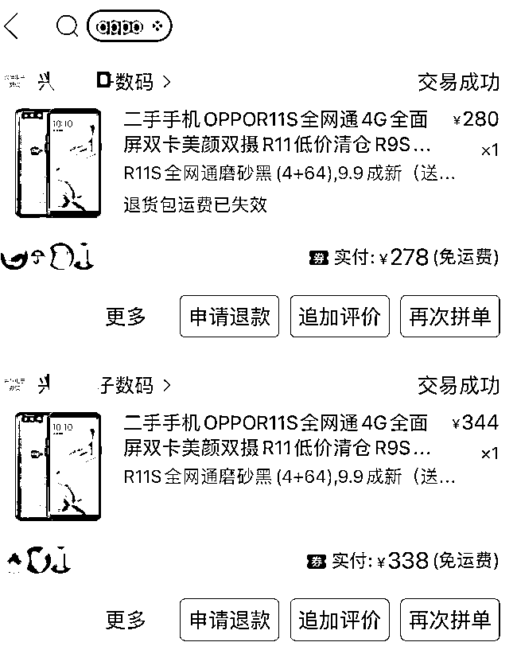

电话卡：

我自己用着2种电话卡，虚拟卡和流量卡

虚拟卡用的和多号，仅用于账号注册。流量卡拼多多买的，可以用于账号注册和开wifi给虚拟卡手机使用

和多号：

移动虚拟卡平台，不一定有号码，建议预约，一旦有号码了注册放着，36/年，很实用。

流量卡：

拼多多买的，19.9月租，但要看清楚套餐情况

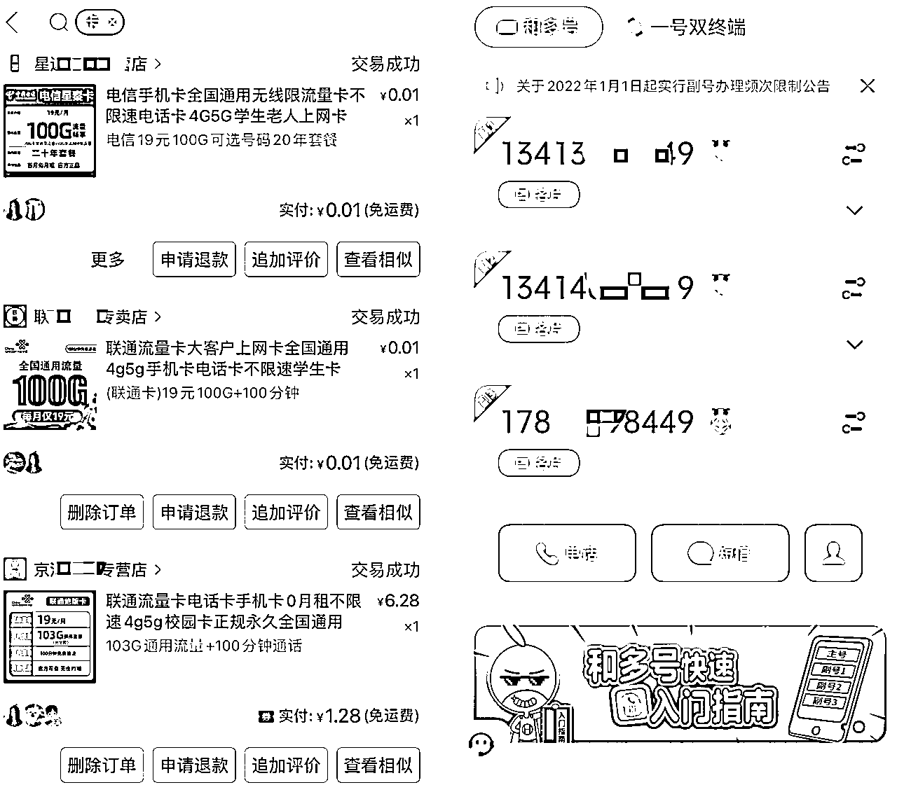

网络：

流量卡用来开Wi-Fi给虚拟卡用，注意，不要所有账号连在一个Wi-Fi上，容易一起违规

## 内容制作

矩阵账号最需要解决的问题是素材，建议固定制作素材的sop，再通过招聘兼职的方式快速制作内容

1、固定模板

图片模板：

如果使用实拍内容模板（如单图、拼图），就需要建立一个线上素材库，让兼职知道素材在哪里

如果是非实拍类型，则可以找到对标账号，要求兼职做一个类似的出来，并提供文案。

文案模板：

找到对标的爆款笔记，并把自己的产品特点、产品路线写下来，交给兼职去排版。要求按照笔记的风格，将自己的产品路线编辑成笔记

2、兼职招聘

兼职招聘渠道：qq群、boss直聘、大学生群、各类兼职app

发布兼职：运营助理、美工、文案，都可以

3、磨合环节

第一次招聘兼职，磨合期会比较痛苦，兼职往往做不出自己想要的结果。这时要么换更聪明的人，要么多给几次机会

费用一般是10～20一篇笔记，超过这个费用则不划算（不需要他们原创）

## 注意事项

1、不要在同一网络下

矩阵账号不要在同一网络环境下，非常容易违规

2、不要经常互赞互评

矩阵账号之间不要经常互赞互评，也容易连带违规

# 总结

以上是旅游类型账号的，2023年旅游行业真的是彻底的大爆发，热度至少可以持续到2024年，据我了解，有很多旅行社、地接社等，2024年的价格都已经上涨了。特别是国外的，很多地方涨幅超过50%，都很看好明年的行情。

从现在开始入旅游赛道，时间刚好，春节还有一波爆发。即使来不及吃春节的订单，也能吃到春节的流量，预定明年的订单

最后，祝大家生财有术，一起暴富