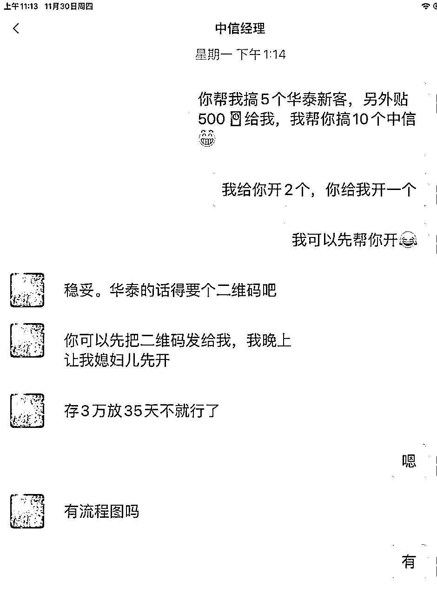

# 冷门业务：券商新客套利，0成本入局，通过小红书单天套利超500+实操案例

> 来源：[https://vna3hj4mnn.feishu.cn/docx/StsMdg1p3owcAlxaReWc5aItnTb](https://vna3hj4mnn.feishu.cn/docx/StsMdg1p3owcAlxaReWc5aItnTb)

圈友们好，我是两千金，为证券公司（以下统称：券商）和客户提供居间服务，主营券商新客套利，已链接上百位生财圈友，累积套利超7位数。

今天给大家分享一个冷门套利项目：券商新客套利——在不确定行情中寻找确定性收益！

先讲核心点：从小红书上找到券商新客供求双方，通过信息差套利，单天轻松套利500+

## 一．套利逻辑

1.券商为了获客，针对新用户发行金额1万—30万不等，年化利率4%—8.18%的新客理财产品，单个券商每人限购1次，产品为保本保息固定收益，安全性和收益保障等同于银行存款。

2.各省区、地级市券商营业部或券商经理为了获客，完成考核指标，支付补贴费用。

## 二.收益来源

券商营业部或者券商经理补贴的获客费用。

## 三.市场需求

供给端：141家券商，加起来4千余个省区营业部，5万余个地级市营业部，数百万券商经理的获客需求；

客户端：客户每个券商都可以享受一次新客福利，并获得新客奖励补贴，单人多家券商累计无风险收益可达5位数；

# 接下来给大家拆解：小红书0成本券商新客套利实操案例，欢迎围观。

本方法适合新手小白，无技术门槛。只需找到产品的精准需求和供给方！案例如下：

## 一.搭建流量池

在小红书搜索栏，输入关键词，刷帖子，点赞，关注，评论。

主页搜索：券商，会出现引导性提示，包括：券商羊毛；券商开户；券商新客理财怎么买；券商新户理财；券商有效户，等等，如图示：

接下来，点开任意关键词，建议首选：券商羊毛，券商新客理财，券商有效户，券商开户红包，以上几个关键词，全网8W+笔记，由此也可看出市场需求量。

如图示：

打开任意关联帖子，做点赞，关注，评论等动作，多刷几个关于券商新客的帖子，根据小红书的推荐机制，刷的越多，同类帖子推送就越多，这样就搭建起了客户经理和客户的流量池。

看图示：评论可以无脑复制。这里有个细节动作，每个帖子尽量只评论一次，如果同一个帖子反复评论，有可能会被题主举报。

上述动作简单无门槛，相信圈友一看就懂，接下来就是评论的话术了！

## 二.评论话术

话术分为你扮演的是券商经理角色还是客户的角色，角色不同，自然引流过来的群体不同。很简单，如果你的评论话术是券商经理的角度，引流到的自然是有需求的客户；如果你的评论话术是客户的角度，引流到的自然是经理。

不管哪个角色的话术，都可以通过评论区无脑复制，几乎没有技术含量的说法。再次提示：每个帖子尽量只评论一次，避免被举报。

这里举几个话术例子，客户角色话术（引流券商经理）：

1.蹲券商新客理财

2.来互换经理

3.有HONGBAO吗

4.我想买，怎么操作

5.求介绍

6.有10万想买新客

......

经理角色话术（引流客户）：

1.年化6.88%有考虑吗？

2.我的20限额，4.68率

3.可以贴

4.还差几个任务，新手收益+贴

5.姐妹，能贴，私

......

以上话术都可以，而且都是我在码字的时候刷两三个帖子复制过来的话术，简单粗暴。

## 三.私信导流

每个小红书账号每天可以给陌生人发10次私信，我们刷帖子的时候看到愿意给红包的经理，或者意向客户，都可以私信他，角色不同，话术不同，针对性沟通，让对方留个V，主动去加，然后进一步沟通。

## 四.沟通需求

### 经理需求

这里以这周我和从小红书引流到微信的经理之间，沟通的流程为例，介绍一下如何通过信息差套利500元+收益的。

当天，和这位经理达成了10户中信新客，5户华泰新客的合作，利润怎么样呢？

这么说吧，不管中信还是华泰，每开一户，我赚50元，累积15户，利润：750元。

今天，经理又找我加了3户的合作，加起来利润有900元，而且从我合作过超百位经理的经验来说，这个经理后续大概率陆续会和我产生持续的合作，因为他们每个月都有指标需求。

说句题外话，就案例这个业务，要想赚多少利润，其实我占据绝对的主动权，这是信息差决定的！

我完全有能力和把握赚到更高的收益。但是市场告诉我，要想获得持续长远的合作，永远只能留有限的利润。

通过互换指标或收费的方式，我个人平均每个月从小红书上链接到3位数的券商经理，每月新增合作经理不下2位数，并达成长期合作！

帮经理完成任务以后，赚钱的同时还能收获经理的感谢，当我们持续为券商经理输出价值，甚至在某种程度上实现了券商经理的转介绍，券商经理愿意把身边的资源推荐给我们的时候，也就是咱们跑通上游渠道的开始！

附上月微信流水和单日微信收款记录。

### 客户需求

引流客户相对来说更简单粗暴，就说自己有经理资源，可以推给他，让意向客户留微信，然后在微信给客户放经理的业务，每单能赚取50+的利润就行，目前通过小红书已引流300余用户。

## 五.拓展玩法

以上只是针对小红书平台做出的实操拆解，拓展玩法包括但不限于其它流量平台：公众号，百家号，抖快，B站等流量平台，微信群运营，客户转介绍政策，以及线下招聘全职兼职裂变等玩法。

以上玩法，只针对小白和没有资源或者没有资金的圈友参考，如果是善于引流的大佬或者有资金，或者有资源的圈友，就是进阶玩法了。

## 六.项目难点

信息差永远存在，了解清楚了券商新客套利逻辑，项目难点在于前期需要逐步累积经理（产品）资源和客户资源，一旦完成前期产品和客户资源积累，你自己就能完成券商套利闭环，无非就是时间问题，实测短则1个月，长则半年，就能独立实现经理和客户资源的闭环。一旦完成闭环，就能实现每月5位数的持续性收益，而且呈线性增长！

## 七.陪跑计划

当然，我自己已经实现了套利闭环，可以与圈友同步产品和客户资源，目前也在布局矩阵玩法。

这个项目我在生财资源对接栏已经连续发布小半年了，链接了数百位圈友，带领圈友累积套利超6位数，但是也有很多自称有资源的圈友或者想让我带着一起做的圈友跟我交流，消耗了我大量的时间和精力，最后并没有行动，属于浪费精力的无效沟通！

所以，为了避免过多的无效沟通，我决定链接一些真正感兴趣，有执行力的圈友，一起下场实操，开设一个券商套利陪跑营。建立陪跑营的目的：找到有执行力的人放大业务，拓宽上下渠道。上下游渠道越多，自然更能在市场上占据主动性！

参加陪跑营条件：不收取费用，但是采用邀约制，需要了解业务逻辑，有参与过证券羊毛实操，并拿到经理补贴。

陪跑营学员待遇：

1.入门指导

2.产品和客户支持：也就是前期缺产品和缺客户的起步初期遇到的难点，陪跑营提供。

3.产品报价指导

4.针对性话术

5.拓展玩法

6.一对一沟通，针对性建议

第一期陪跑因为精力有限，人手有限，暂定上限20人，没有下限。

## 八.欢迎围观

当然，除了陪跑营，对于有撸券商新客收益和补贴，或者有兴趣围观的圈友，提供券商套利围观群，0门槛围观，欢迎有兴趣的圈友链接。